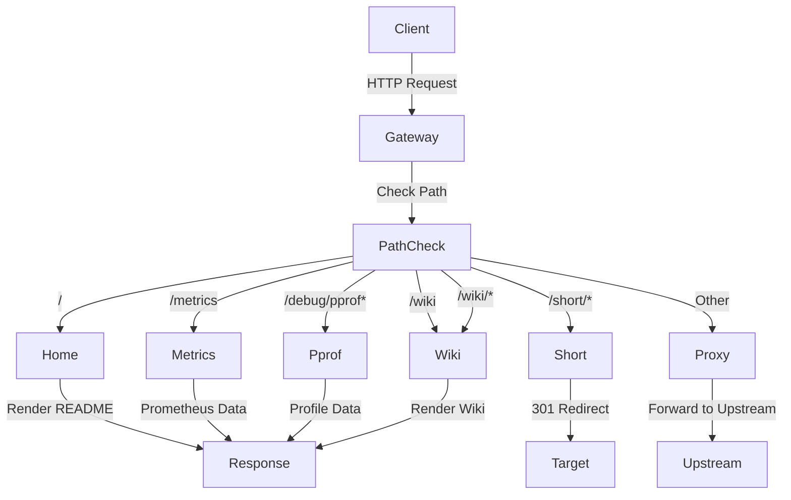

# API端点参考

<cite>
**本文档中引用的文件**  
- [wiki.go](file://internal/wiki/wiki.go)
- [proxy.go](file://internal/proxy/proxy.go)
- [config.example.yaml](file://config.example.yaml)
- [home.go](file://internal/home/home.go)
- [short.go](file://internal/short/short.go)
- [metrics.go](file://internal/metrics/metrics.go)
- [pprof.go](file://internal/pprof/pprof.go)
- [README.md](file://README.md)
</cite>

## 更新摘要
**已做更改**  
- 在“核心API端点”部分添加了新的 `/wiki` 和 `/wiki/` 端点描述
- 更新了“核心API端点”部分的流程图，以包含新的wiki处理路径
- 在“目录”中添加了新的“/wiki端点”条目
- 添加了关于 `/wiki` 端点的完整新章节
- 更新了“介绍”部分的Section sources以包含新分析的文件

### 目录
1. [介绍](#介绍)
2. [核心API端点](#核心api端点)
3. [/主页端点](#主页端点)
4. [/short/*短链接端点](#short短链接端点)
5. [/metrics指标端点](#metrics指标端点)
6. [/debug/pprof调试端点](#debugpprof调试端点)
7. [/wiki端点](#wiki端点)
8. [使用示例](#使用示例)

## 介绍
RSSHub-Gateway是一个为RSSHub和Upvote RSS服务设计的网关，提供路由、认证、健康检查和可观测性功能。本参考文档详细描述了网关暴露的所有HTTP API端点，包括其URL模式、HTTP方法、请求参数、响应格式、状态码及用途。文档还说明了/metrics端点与Prometheus的集成方式，列举了所有暴露的指标名称和含义，并描述了/pprof各子端点的功能和使用方法。

**Section sources**
- [README.md](file://README.md#L1-L361)
- [wiki.go](file://internal/wiki/wiki.go#L1-L152)
- [proxy.go](file://internal/proxy/proxy.go#L72-L85)

## 核心API端点
RSSHub-Gateway暴露了多个核心HTTP API端点，用于提供服务功能、监控和调试。这些端点包括：
- `/`：主页端点，渲染README文档
- `/short/*`：短链接重定向端点
- `/metrics`：Prometheus指标端点
- `/debug/pprof`：Go语言性能分析端点
- `/wiki` 和 `/wiki/`：项目文档维基端点

这些端点在网关的请求处理流程中具有最高优先级，不会被代理到上游服务。它们由网关直接处理，为开发者和运维人员提供必要的服务信息、监控数据和调试工具。



**Diagram sources**
- [proxy.go](file://internal/proxy/proxy.go#L42-L183)
- [home.go](file://internal/home/home.go#L116-L125)
- [short.go](file://internal/short/short.go#L19-L35)
- [metrics.go](file://internal/metrics/metrics.go#L113-L122)
- [pprof.go](file://internal/pprof/pprof.go#L33-L62)
- [wiki.go](file://internal/wiki/wiki.go#L27-L70)

## /主页端点
`/`端点是RSSHub-Gateway的主页，用于渲染项目的README文档。该端点支持多语言，可以根据请求参数或路径选择显示英文或中文版本。

### URL模式与HTTP方法
- **URL模式**: `/`, `/zh`, `/en`
- **HTTP方法**: GET
- **用途**: 显示项目文档和说明

### 请求参数
- `lang` (可选): 指定语言，可选值为`en`（英文）或`zh`（中文）

### 响应格式
返回HTML文档，包含渲染后的README内容，使用GitHub风格的Markdown样式。

### 状态码
- `200 OK`: 成功渲染并返回主页
- `500 Internal Server Error`: 渲染失败

### 功能说明
该端点会读取项目根目录下的`README.md`和`README_zh.md`文件，根据用户的语言偏好渲染相应的文档。用户可以通过以下方式访问不同语言版本：
- `/` 或 `/?lang=en`: 访问英文版
- `/zh` 或 `/?lang=zh`: 访问中文版

**Section sources**
- [home.go](file://internal/home/home.go#L116-L125)
- [proxy.go](file://internal/proxy/proxy.go#L51-L54)
- [README.md](file://README.md#L23)

## /short/*短链接端点
`/short/*`端点提供短链接重定向功能，允许用户创建简短、易记的订阅链接。

### URL模式与HTTP方法
- **URL模式**: `/short/{name}`
- **HTTP方法**: GET
- **用途**: 301重定向到预定义的目标URL

### 请求参数
此端点不接受特定参数，但会将原始请求中的查询参数传递到目标URL。

### 响应格式
返回HTTP 301重定向响应，`Location`头包含目标URL。

### 状态码
- `301 Moved Permanently`: 成功重定向
- `404 Not Found`: 指定的短链接名称不存在
- `400 Bad Request`: 请求路径格式无效

### 功能说明
短链接功能通过配置文件中的`short.entries`定义。当用户访问`/short/{name}`时，网关会查找对应的`target`并执行301重定向。查询参数会被自动传递到目标URL：
- 如果目标URL已有查询参数，则使用`&`连接
- 如果目标URL没有查询参数，则使用`?`连接

例如，配置了`name: "latepost"`和`target: "/rsshub/latepost/4"`，则访问`/short/latepost?key=ACCESS_KEY`会重定向到`/rsshub/latepost/4?key=ACCESS_KEY`。

**Section sources**
- [short.go](file://internal/short/short.go#L19-L35)
- [proxy.go](file://internal/proxy/proxy.go#L65-L71)
- [config.go](file://internal/config/config.go#L78-L87)
- [README.md](file://README.md#L22)

## /metrics指标端点
`/metrics`端点提供Prometheus格式的监控指标，用于监控网关的运行状态和性能。

### URL模式与HTTP方法
- **URL模式**: 由配置文件中的`metrics.path`定义，默认为`/metrics`
- **HTTP方法**: GET
- **用途**: 提供Prometheus监控指标

### 请求参数
- `accesskey`: 访问密钥，必须与配置文件中的`metrics.accesskey`匹配

### 响应格式
返回文本格式的Prometheus指标数据，每行一个指标，格式为`指标名称{标签} 值`。

### 状态码
- `200 OK`: 成功返回指标数据
- `403 Forbidden`: 访问密钥不正确或缺失

### Prometheus集成
该端点与Prometheus集成，需要在配置文件中启用并设置访问密钥。Prometheus可以通过HTTP请求定期抓取这些指标。

### 暴露的指标
以下是/metrics端点暴露的所有指标及其含义：

| 指标名称 | 标签 | 含义 |
|---------|------|------|
| rsshub_gateway_requests_total | method, group, route_prefix, status | 网关请求数量总计 |
| rsshub_gateway_request_duration_seconds | group, route_prefix | 网关请求持续时间（秒） |
| rsshub_gateway_upstream_requests_total | group, upstream, status | 上游请求数量总计 |
| rsshub_gateway_upstream_success_total | group, upstream | 上游成功响应数量总计 |
| rsshub_gateway_upstream_failure_total | group, upstream | 上游失败响应数量总计 |
| rsshub_gateway_route_success_total | group, route_prefix | 路由成功响应数量总计 |
| rsshub_gateway_route_failure_total | group, route_prefix | 路由失败响应数量总计 |
| rsshub_gateway_cache_hit_total | provider | 缓存命中数量总计 |
| rsshub_gateway_cache_miss_total | provider | 缓存未命中数量总计 |
| rsshub_gateway_upstream_health | group, upstream | 上游健康状态（1为健康，0为不健康） |
| rsshub_gateway_upstream_eject_total | group, upstream | 上游驱逐数量总计 |
| rsshub_gateway_retry_total | group | 重试数量总计 |
| rsshub_gateway_fallback_total | from, to | 故障转移数量总计 |
| rsshub_gateway_config_reload_total | result | 配置重载数量总计 |

**Section sources**
- [metrics.go](file://internal/metrics/metrics.go#L12-L29)
- [proxy.go](file://internal/proxy/proxy.go#L56-L60)
- [config.go](file://internal/config/config.go#L38-L42)
- [README.md](file://README.md#L284-L303)

## /debug/pprof调试端点
`/debug/pprof`端点提供Go语言的性能分析功能，用于诊断性能问题和内存使用情况。

### URL模式与HTTP方法
- **URL模式**: 由配置文件中的`pprof.path`定义，默认为`/debug/pprof`
- **HTTP方法**: GET
- **用途**: 提供Go语言性能分析数据

### 子端点功能
/pprof端点包含多个子端点，每个提供不同的性能分析数据：

| 子端点 | 功能说明 |
|-------|--------|
| `/debug/pprof/` | 主页，列出所有可用的分析工具 |
| `/debug/pprof/cmdline` | 显示启动当前程序的命令行 |
| `/debug/pprof/profile` | 进行CPU性能分析，持续30秒 |
| `/debug/pprof/symbol` | 查找程序中的符号 |
| `/debug/pprof/trace` | 记录执行跟踪，持续5秒 |
| `/debug/pprof/heap` | 堆内存分析，显示内存分配情况 |
| `/debug/pprof/goroutine` | Goroutine分析，显示所有Goroutine的堆栈 |
| `/debug/pprof/block` | 阻塞分析，显示goroutine阻塞的位置 |
| `/debug/pprof/mutex` | 互斥锁竞争分析 |

### 请求参数
- `accesskey`: 访问密钥，必须与配置文件中的`pprof.accesskey`匹配

### 响应格式
返回二进制或文本格式的性能分析数据，具体格式取决于请求的子端点。

### 状态码
- `200 OK`: 成功返回分析数据
- `403 Forbidden`: 访问密钥不正确或缺失
- `301 Moved Permanently`: 重定向到带斜杠的路径

### 使用方法
要使用pprof进行性能分析，可以使用Go工具链中的`go tool pprof`命令：
```bash
go tool pprof http://<gateway-host>:<port>/debug/pprof/profile?accesskey=<PPROF_ACCESS_KEY>
```

这将下载CPU性能分析数据并启动交互式分析会话。对于内存分析，可以使用：
```bash
go tool pprof http://<gateway-host>:<port>/debug/pprof/heap?accesskey=<PPROF_ACCESS_KEY>
```

**Section sources**
- [pprof.go](file://internal/pprof/pprof.go#L33-L62)
- [proxy.go](file://internal/proxy/proxy.go#L62-L64)
- [config.go](file://internal/config/config.go#L44-L48)
- [README.md](file://README.md#L305-L311)

## /wiki端点
`/wiki`和`/wiki/`端点提供项目文档维基功能，用于展示项目的技术文档和使用指南。该端点基于Qoder RepoWiki内容，从`.qoder/repowiki/zh`目录加载中文文档。

### URL模式与HTTP方法
- **URL模式**: `/wiki`, `/wiki/*`
- **HTTP方法**: GET
- **用途**: 显示项目技术文档和维基内容

### 请求参数
此端点不接受特定参数，但会保留原始请求中的查询参数。

### 响应格式
返回HTML文档，包含渲染后的维基内容，支持Mermaid图表和KaTeX数学公式。文档中的`file://`链接会被重写为指向GitHub仓库的永久链接（使用构建时的git commit哈希）。

### 状态码
- `200 OK`: 成功渲染并返回维基页面
- `301 Moved Permanently`: 从`/wiki`重定向到`/wiki/`
- `404 Not Found`: 请求的维基页面不存在
- `500 Internal Server Error`: 维基内容加载或渲染失败

### 功能说明
维基端点通过`go-embed-qorder-wiki`库实现，具有以下特性：
- 自动从`.qoder/repowiki/zh`目录加载维基内容
- 使用CDN加载Mermaid和KaTeX资源（`https://cdn.jsdelivr.net/npm/mermaid@10/dist/mermaid.min.js`和`https://cdn.jsdelivr.net/npm/katex@0.16.9/dist/katex.min.css`）
- 将文档中的`file://`链接重写为指向`https://github.com/nerdneilsfield/RSSHub-Gateway/blob/<gitCommit>/...`的GitHub链接
- 在Docker镜像和GoReleaser构建中包含维基资产，确保运行时可用

当访问`/wiki`时，网关会自动重定向到`/wiki/`以确保正确的路径处理。维基内容的首页（home）按以下优先级确定：
1. `主页.md`
2. `README.md`
3. `README_zh.md`
4. `README_ZH.md`
5. `快速开始.md`
6. 任意其他`.md`文件

该端点已在`gateway_auth.bypass_paths`中配置为认证绕行路径，因此访问维基内容无需提供访问密钥。

**Section sources**
- [wiki.go](file://internal/wiki/wiki.go#L16-L25)
- [proxy.go](file://internal/proxy/proxy.go#L72-L85)
- [config.example.yaml](file://config.example.yaml#L28-L34)

## 使用示例
以下是一些常用的curl命令示例，帮助开发者和运维人员测试和监控服务状态。

### 测试主页访问
```bash
# 访问英文主页
curl -i http://localhost:8080/

# 访问中文主页
curl -i http://localhost:8080/zh

# 通过参数指定语言
curl -i "http://localhost:8080/?lang=zh"
```

### 测试短链接重定向
```bash
# 测试短链接重定向
curl -i http://localhost:8080/short/latepost?key=ACCESS_KEY

# 检查重定向目标
curl -I http://localhost:8080/short/latepost?key=ACCESS_KEY
```

### 获取监控指标
```bash
# 获取Prometheus指标（需要正确的accesskey）
curl "http://localhost:8080/metrics?accesskey=PROM_KEY_123"

# 使用HTTP基本认证（如果配置了）
curl -u username:password http://localhost:8080/metrics
```

### 性能分析
```bash
# 获取CPU性能分析数据
curl -o profile.out "http://localhost:8080/debug/pprof/profile?accesskey=PPROF_KEY_123"

# 获取堆内存分析数据
curl -o heap.out "http://localhost:8080/debug/pprof/heap?accesskey=PPROF_KEY_123"

# 获取goroutine分析数据
curl "http://localhost:8080/debug/pprof/goroutine?debug=1&accesskey=PPROF_KEY_123"
```

### 测试维基访问
```bash
# 访问维基首页（会重定向到/wiki/）
curl -i http://localhost:8080/wiki

# 访问维基内容
curl -i http://localhost:8080/wiki/

# 访问特定维基页面
curl -i http://localhost:8080/wiki/安装指南.md
```

### 健康检查
```bash
# 检查服务是否正常运行
curl -i http://localhost:8080/healthz

# 检查pprof端点是否可用
curl -i "http://localhost:8080/debug/pprof/?accesskey=PPROF_KEY_123"
```

这些示例展示了如何使用curl命令与RSSHub-Gateway的各种API端点进行交互，从简单的页面访问到复杂的性能分析。运维人员可以将这些命令集成到监控系统中，以确保服务的稳定运行。

**Section sources**
- [README.md](file://README.md#L288-L289)
- [proxy.go](file://internal/proxy/proxy.go#L56-L60)
- [pprof.go](file://internal/pprof/pprof.go#L33-L62)