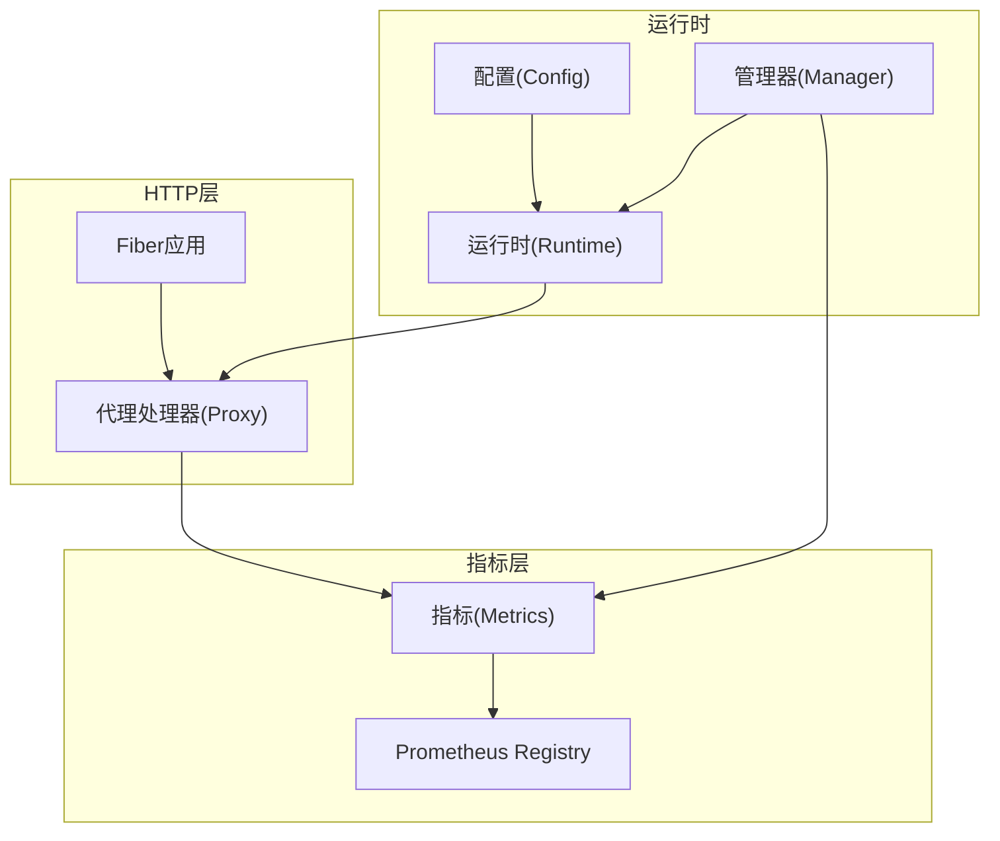
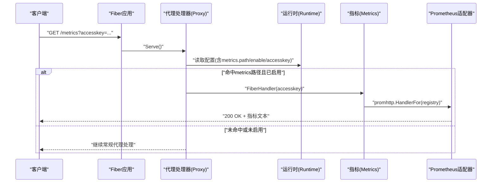
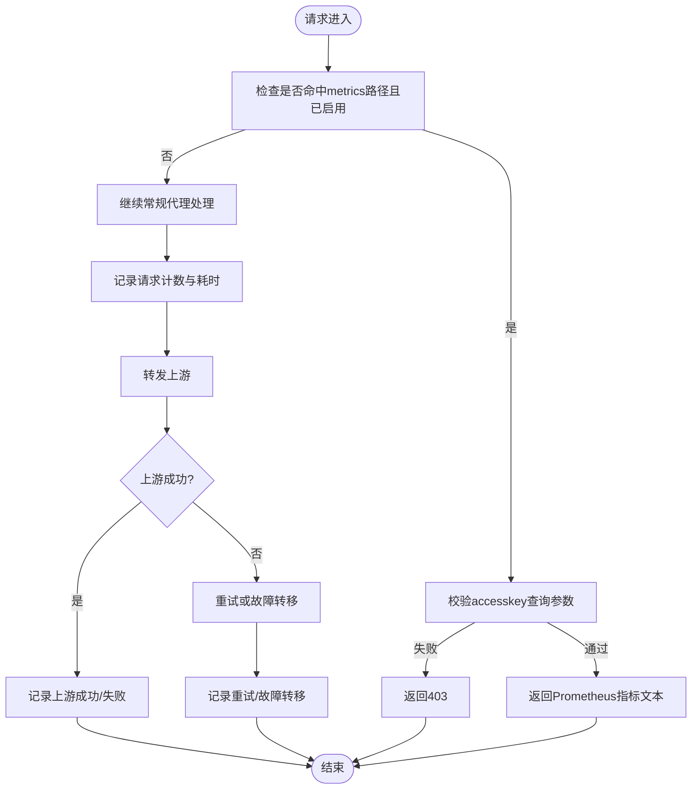
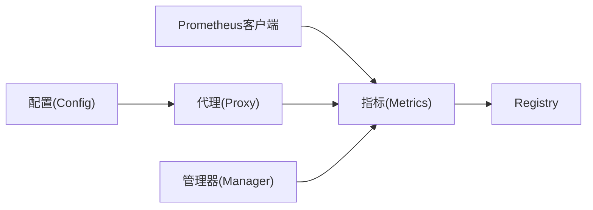

# Prometheus指标

<cite>
**本文引用的文件**
- [internal/metrics/metrics.go](file://internal/metrics/metrics.go)
- [internal/proxy/proxy.go](file://internal/proxy/proxy.go)
- [internal/config/config.go](file://internal/config/config.go)
- [config.example.yaml](file://config.example.yaml)
- [internal/runtime/manager.go](file://internal/runtime/manager.go)
</cite>

## 目录
1. [简介](#简介)
2. [项目结构](#项目结构)
3. [核心组件](#核心组件)
4. [架构总览](#架构总览)
5. [详细组件分析](#详细组件分析)
6. [依赖关系分析](#依赖关系分析)
7. [性能考量](#性能考量)
8. [故障排查指南](#故障排查指南)
9. [结论](#结论)
10. [附录](#附录)

## 简介
本文件面向RSSHub-Gateway的Prometheus指标端点（/metrics），提供全面的API文档与使用指南。内容覆盖：
- 指标名称、类型与业务含义
- 指标标签（labels）维度说明
- 如何通过配置启用端点并设置访问密钥进行保护
- curl命令示例与Prometheus抓取配置片段
- 关键调用链路与数据流图示

## 项目结构
与Prometheus指标端点直接相关的模块与职责：
- internal/metrics：定义并注册Prometheus指标，提供/Fiber处理器适配器
- internal/proxy：在请求处理流程中记录各类指标，并在命中metrics路径时返回指标页面
- internal/config：配置项包含metrics.enabled、metrics.path、metrics.accesskey
- internal/runtime/manager：在配置重载时记录“配置重载”指标

图表来源
- [internal/proxy/proxy.go](file://internal/proxy/proxy.go#L42-L77)
- [internal/metrics/metrics.go](file://internal/metrics/metrics.go#L12-L122)
- [internal/config/config.go](file://internal/config/config.go#L38-L42)
- [internal/runtime/manager.go](file://internal/runtime/manager.go#L28-L67)

章节来源
- [internal/metrics/metrics.go](file://internal/metrics/metrics.go#L12-L122)
- [internal/proxy/proxy.go](file://internal/proxy/proxy.go#L42-L77)
- [internal/config/config.go](file://internal/config/config.go#L38-L42)
- [internal/runtime/manager.go](file://internal/runtime/manager.go#L28-L67)

## 核心组件
- 指标定义与注册：在内部创建CounterVec/HistogramVec/GaugeVec，并统一注册到Prometheus Registry
- 指标适配器：将Prometheus的HTTP处理器适配为Fiber Handler，并支持查询参数accesskey鉴权
- 请求处理中的指标记录：在代理转发、重试、故障转移、缓存命中/未命中、上游请求成功/失败、剔除等环节记录指标
- 配置驱动：通过配置开启metrics、设置路径与访问密钥；配置校验要求启用metrics时必须提供accesskey且path以/开头

章节来源
- [internal/metrics/metrics.go](file://internal/metrics/metrics.go#L12-L122)
- [internal/proxy/proxy.go](file://internal/proxy/proxy.go#L251-L274)
- [internal/config/config.go](file://internal/config/config.go#L330-L345)

## 架构总览
下图展示从HTTP请求到指标输出的关键调用链与控制流。

图表来源
- [internal/proxy/proxy.go](file://internal/proxy/proxy.go#L42-L77)
- [internal/metrics/metrics.go](file://internal/metrics/metrics.go#L113-L122)

## 详细组件分析

### 指标清单与业务含义
以下指标均来自指标定义与注册逻辑，名称、类型与用途如下：
- rsshub_gateway_requests_total：计数器，记录网关请求总量，按method、group、route_prefix、status聚合
- rsshub_gateway_request_duration_seconds：直方图，记录请求耗时（秒），按group、route_prefix聚合
- rsshub_gateway_upstream_requests_total：计数器，记录上游请求总量，按group、upstream、status聚合
- rsshub_gateway_upstream_success_total：计数器，记录上游成功响应次数，按group、upstream聚合
- rsshub_gateway_upstream_failure_total：计数器，记录上游失败响应次数，按group、upstream聚合
- rsshub_gateway_route_success_total：计数器，记录路由成功响应次数，按group、route_prefix聚合
- rsshub_gateway_route_failure_total：计数器，记录路由失败响应次数，按group、route_prefix聚合
- rsshub_gateway_cache_hit_total：计数器，记录缓存命中次数，按provider聚合
- rsshub_gateway_cache_miss_total：计数器，记录缓存未命中次数，按provider聚合
- rsshub_gateway_upstream_health：仪表（Gauge），记录上游健康状态（1健康/0不健康），按group、upstream聚合
- rsshub_gateway_upstream_eject_total：计数器，记录上游被剔除次数，按group、upstream聚合
- rsshub_gateway_retry_total：计数器，记录重试次数，按group聚合
- rsshub_gateway_fallback_total：计数器，记录故障转移尝试次数，按from、to聚合
- rsshub_gateway_config_reload_total：计数器，记录配置重载次数，按result（success/fail）聚合

章节来源
- [internal/metrics/metrics.go](file://internal/metrics/metrics.go#L15-L109)
- [internal/proxy/proxy.go](file://internal/proxy/proxy.go#L251-L274)
- [internal/runtime/manager.go](file://internal/runtime/manager.go#L128-L135)

### 指标标签（labels）维度
- method：HTTP方法（如GET/POST等）
- group：路由分组名（来自配置中的groups.name）
- route_prefix：路由前缀（来自路由选择结果）
- status：HTTP状态码字符串（如200、504等）
- upstream：上游主机标识（通常为上游State的HostLabel）
- provider：缓存提供者（如memory/redis）
- from/to：故障转移的源分组与目标分组名
- result：配置重载结果（success/fail）

章节来源
- [internal/metrics/metrics.go](file://internal/metrics/metrics.go#L35-L109)
- [internal/proxy/proxy.go](file://internal/proxy/proxy.go#L251-L274)

### 指标采集与保护机制
- 采集端点：当请求方法为GET且路径等于配置的metrics.path时，代理处理器将交由指标适配器处理
- 访问密钥：指标适配器会校验查询参数accesskey是否与配置一致，不一致返回403
- 启用条件：配置中metrics.enabled=true时才允许访问；若启用但未提供accesskey或path格式不合法，将在配置校验阶段报错

章节来源
- [internal/proxy/proxy.go](file://internal/proxy/proxy.go#L42-L77)
- [internal/metrics/metrics.go](file://internal/metrics/metrics.go#L113-L122)
- [internal/config/config.go](file://internal/config/config.go#L330-L345)

### 关键调用链与数据流
- 请求进入：Fiber路由匹配后进入代理处理器
- 路由判断：若命中metrics.path且已启用，则调用指标适配器返回指标文本
- 指标记录：在代理处理过程中，按阶段调用record*系列函数更新各类指标
- 配置重载：管理器在重载配置时记录config_reload_total

图表来源
- [internal/proxy/proxy.go](file://internal/proxy/proxy.go#L42-L77)
- [internal/proxy/proxy.go](file://internal/proxy/proxy.go#L251-L274)
- [internal/runtime/manager.go](file://internal/runtime/manager.go#L128-L135)

## 依赖关系分析
- 指标层依赖Prometheus客户端库，负责Counter/Histogram/Gauge的创建与注册
- 代理层在请求处理中调用指标层接口进行计数与观测
- 配置层决定是否启用metrics、路径与访问密钥
- 管理器在配置重载时记录重载结果

图表来源
- [internal/metrics/metrics.go](file://internal/metrics/metrics.go#L12-L122)
- [internal/proxy/proxy.go](file://internal/proxy/proxy.go#L251-L274)
- [internal/config/config.go](file://internal/config/config.go#L38-L42)
- [internal/runtime/manager.go](file://internal/runtime/manager.go#L128-L135)

章节来源
- [internal/metrics/metrics.go](file://internal/metrics/metrics.go#L12-L122)
- [internal/proxy/proxy.go](file://internal/proxy/proxy.go#L251-L274)
- [internal/config/config.go](file://internal/config/config.go#L38-L42)
- [internal/runtime/manager.go](file://internal/runtime/manager.go#L128-L135)

## 性能考量
- 指标注册采用Registry集中管理，避免重复注册
- Histogram直方图使用默认桶，适合通用场景；如需更细粒度的耗时观测，可在部署侧调整抓取范围或Prometheus配置
- 计数器与Gauge开销较低，建议在生产环境保持开启
- 访问密钥校验为O(1)查询，对性能影响可忽略

[本节为通用性能讨论，不直接分析具体文件]

## 故障排查指南
- 403 Forbidden：访问metrics路径时accesskey不匹配或缺失
  - 排查：确认配置中metrics.accesskey与请求URL的accesskey一致
- 404 Not Found：指标适配器未初始化或未启用
  - 排查：确认metrics.enabled=true且path有效
- 抓取失败：Prometheus无法访问或认证失败
  - 排查：确保Prometheus scrape配置正确，且目标主机可达；如需保护，可在Prometheus侧配置HTTP头或使用反向代理注入密钥

章节来源
- [internal/metrics/metrics.go](file://internal/metrics/metrics.go#L113-L122)
- [internal/proxy/proxy.go](file://internal/proxy/proxy.go#L42-L77)
- [internal/config/config.go](file://internal/config/config.go#L330-L345)

## 结论
RSSHub-Gateway的/Fiber适配器Prometheus指标端点通过配置驱动启用，具备访问密钥保护能力。其指标覆盖请求总量与耗时、上游请求与健康、故障转移与重试、缓存命中/未命中以及配置重载等关键维度，能够满足可观测性需求。结合Prometheus抓取配置与合理的label设计，可构建完善的监控体系。

[本节为总结性内容，不直接分析具体文件]

## 附录

### 启用与配置步骤
- 在配置文件中启用metrics并设置路径与访问密钥
- 启动服务后，访问对应路径并携带accesskey查询参数

章节来源
- [internal/config/config.go](file://internal/config/config.go#L38-L42)
- [config.example.yaml](file://config.example.yaml#L36-L46)

### curl命令示例
- 成功访问（携带正确accesskey）
  - curl -i "http://HOST:PORT/METRICS_PATH?accesskey=YOUR_ACCESSKEY"
- 访问被拒绝（accesskey错误或缺失）
  - curl -i "http://HOST:PORT/METRICS_PATH?accesskey=INVALID"

章节来源
- [internal/metrics/metrics.go](file://internal/metrics/metrics.go#L113-L122)
- [internal/proxy/proxy.go](file://internal/proxy/proxy.go#L42-L77)

### Prometheus抓取配置片段
- static_configs
  - targets: ["HOST:PORT"]
- metrics_path: 对应配置中的metrics.path
- params:
  - accesskey: 对应配置中的metrics.accesskey

章节来源
- [internal/config/config.go](file://internal/config/config.go#L330-L345)
- [config.example.yaml](file://config.example.yaml#L36-L46)