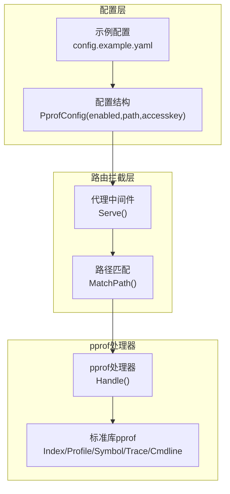
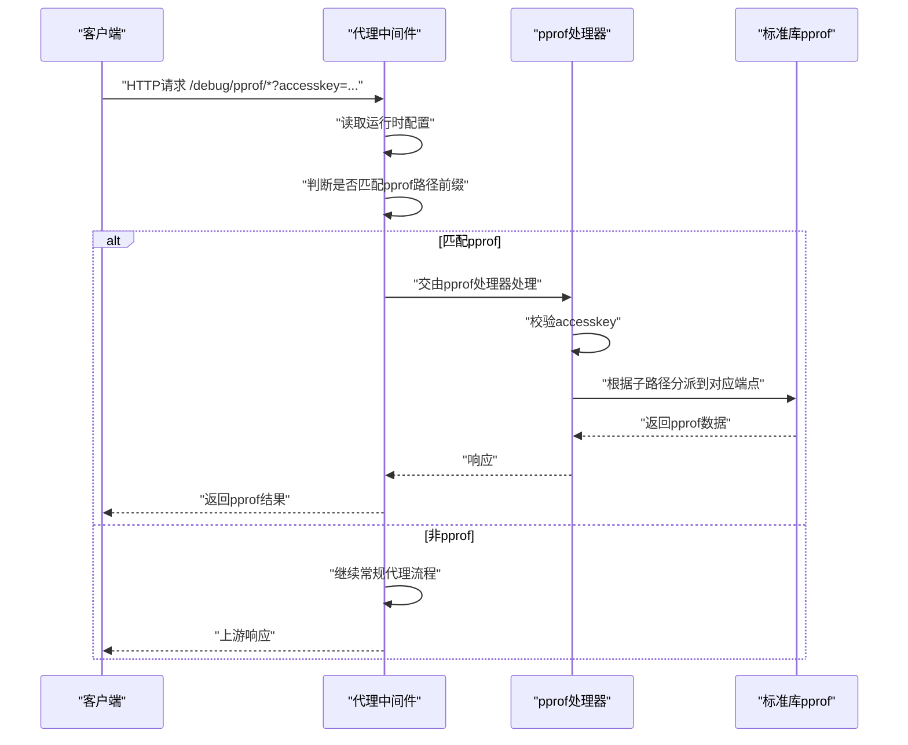
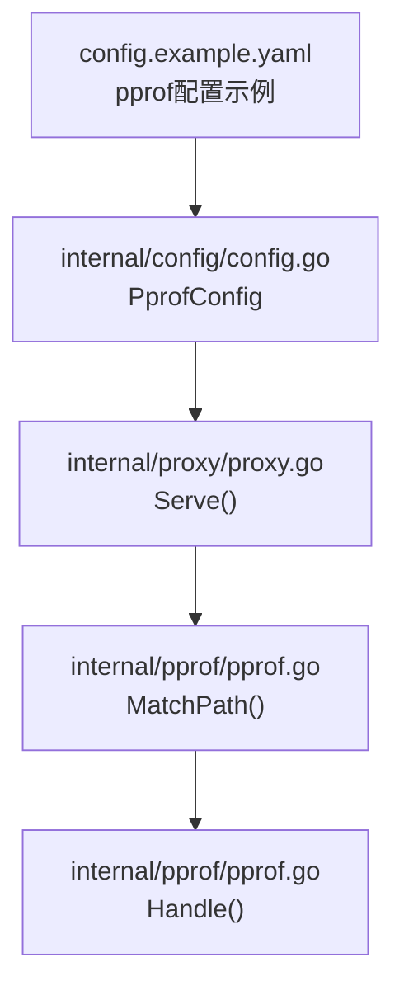

# pprof调试接口

<cite>
**本文引用的文件**
- [internal/pprof/pprof.go](file://internal/pprof/pprof.go)
- [internal/proxy/proxy.go](file://internal/proxy/proxy.go)
- [internal/config/config.go](file://internal/config/config.go)
- [config.example.yaml](file://config.example.yaml)
- [README.md](file://README.md)
- [openspec/changes/add-v0-2-observability-reload/specs/gateway-observability/spec.md](file://openspec/changes/add-v0-2-observability-reload/specs/gateway-observability/spec.md)
</cite>

## 目录
1. [简介](#简介)
2. [项目结构](#项目结构)
3. [核心组件](#核心组件)
4. [架构概览](#架构概览)
5. [详细组件分析](#详细组件分析)
6. [依赖关系分析](#依赖关系分析)
7. [性能注意事项](#性能注意事项)
8. [故障排查指南](#故障排查指南)
9. [结论](#结论)
10. [附录](#附录)

## 简介
本文件面向RSSHub-Gateway集成的pprof调试端点（/debug/pprof/*），系统性说明其功能、安全机制与使用方式。pprof在本项目中作为可观测性的一部分，默认路径为“/debug/pprof”，可通过配置启用，并要求访问密钥（accesskey）以保障安全。pprof子端点覆盖索引页、CPU Profile、堆内存快照、协程栈追踪、内存分配统计与跟踪等常用场景，便于在调试环境中进行性能分析与问题定位。

## 项目结构
pprof相关能力由以下模块协同实现：
- 配置层：定义pprof开关、访问路径与访问密钥
- 路由拦截层：在代理处理前识别pprof路径并交由pprof处理器
- pprof处理器：将请求映射到标准库pprof的对应子端点
- 文档与规范：明确pprof启用条件、访问密钥要求与不走上游转发的行为

图表来源
- [internal/config/config.go](file://internal/config/config.go#L43-L47)
- [config.example.yaml](file://config.example.yaml#L47-L58)
- [internal/proxy/proxy.go](file://internal/proxy/proxy.go#L62-L63)
- [internal/pprof/pprof.go](file://internal/pprof/pprof.go#L24-L61)

章节来源
- [internal/config/config.go](file://internal/config/config.go#L43-L47)
- [config.example.yaml](file://config.example.yaml#L47-L58)
- [internal/proxy/proxy.go](file://internal/proxy/proxy.go#L62-L63)
- [internal/pprof/pprof.go](file://internal/pprof/pprof.go#L24-L61)

## 核心组件
- 配置项PprofConfig
  - 字段：enabled（是否启用）、path（pprof访问路径）、accesskey（访问密钥）
  - 默认路径：/debug/pprof
  - 校验规则：启用时必须提供accesskey且path必须以“/”开头
- 路由拦截
  - 当请求命中pprof路径前缀时，代理逻辑直接交由pprof处理器处理，不转发至上游
- pprof处理器
  - 对请求路径进行规范化与匹配
  - 根据子路径将请求分派到标准库pprof的对应端点
  - 支持访问密钥校验，缺失或错误返回403

章节来源
- [internal/config/config.go](file://internal/config/config.go#L43-L47)
- [internal/config/config.go](file://internal/config/config.go#L172-L174)
- [internal/config/config.go](file://internal/config/config.go#L338-L345)
- [internal/proxy/proxy.go](file://internal/proxy/proxy.go#L62-L63)
- [internal/pprof/pprof.go](file://internal/pprof/pprof.go#L24-L61)

## 架构概览
pprof在请求生命周期中的位置如下：

图表来源
- [internal/proxy/proxy.go](file://internal/proxy/proxy.go#L62-L63)
- [internal/pprof/pprof.go](file://internal/pprof/pprof.go#L32-L61)
- [openspec/changes/add-v0-2-observability-reload/specs/gateway-observability/spec.md](file://openspec/changes/add-v0-2-observability-reload/specs/gateway-observability/spec.md#L18-L21)

## 详细组件分析

### pprof路径匹配与访问控制
- 路径规范化
  - 自动去除多余空白字符
  - 若末尾为“/”，则移除，确保与“/”结尾的路径保持一致
  - 默认路径为“/debug/pprof”
- 路径匹配
  - 当请求路径等于规范化后的基础路径，或以“基础路径/”开头时，判定为命中pprof
- 访问控制
  - 若配置了accesskey，则请求必须携带查询参数accesskey且值匹配，否则返回403
  - 若未配置accesskey，直接放行（不建议在生产使用）

章节来源
- [internal/pprof/pprof.go](file://internal/pprof/pprof.go#L12-L23)
- [internal/pprof/pprof.go](file://internal/pprof/pprof.go#L24-L31)
- [internal/pprof/pprof.go](file://internal/pprof/pprof.go#L32-L36)

### 子端点与功能映射
pprof处理器将请求映射到标准库pprof的对应端点，支持以下常见子路径：
- /debug/pprof/（带斜杠）
  - 返回pprof首页，列出可用子端点
- /debug/pprof/profile
  - CPU性能分析（Profile），可指定持续时间参数（例如seconds=30）
- /debug/pprof/heap
  - 堆内存快照（Heap）
- /debug/pprof/goroutine
  - 协程栈追踪（Goroutines）
- /debug/pprof/allocs
  - 内存分配统计（Allocs）
- /debug/pprof/block
  - 阻塞同步事件（Block）
- /debug/pprof/contention
  - 争用统计（Contention）
- /debug/pprof/cmdline
  - 命令行参数（Cmdline）
- /debug/pprof/symbol
  - 符号解析（Symbol）
- /debug/pprof/trace
  - 运行跟踪（Trace），可指定持续时间参数（例如seconds=30）

说明
- 处理器会将请求重定向到标准库pprof的对应Handler或HTTPHandlerFunc
- 未显式列举的子路径将尝试通过标准库pprof.Handler(name)进行分派

章节来源
- [internal/pprof/pprof.go](file://internal/pprof/pprof.go#L43-L61)

### 启用与配置要点
- 开启pprof
  - 在配置中将pprof.enabled设为true
  - 设置pprof.path（默认“/debug/pprof”）
  - 必须设置pprof.accesskey（启用时强制校验）
- 默认路径与规范化
  - 默认路径为“/debug/pprof”
  - 路径前后空白会被清理，末尾“/”会被移除
- 生效时机
  - 代理中间件在每次请求进入时读取运行时配置，若命中pprof路径前缀则直接处理，不转发上游

章节来源
- [internal/config/config.go](file://internal/config/config.go#L172-L174)
- [internal/config/config.go](file://internal/config/config.go#L338-L345)
- [config.example.yaml](file://config.example.yaml#L47-L58)
- [internal/proxy/proxy.go](file://internal/proxy/proxy.go#L62-L63)

### 安全与访问密钥
- 强制访问密钥
  - 启用pprof后，必须在请求中携带accesskey查询参数，且与配置一致
  - 未提供或提供错误的accesskey将返回403
- 不走上游
  - 命中pprof路径的请求不会被转发到上游，直接在本地处理

章节来源
- [internal/pprof/pprof.go](file://internal/pprof/pprof.go#L32-L36)
- [openspec/changes/add-v0-2-observability-reload/specs/gateway-observability/spec.md](file://openspec/changes/add-v0-2-observability-reload/specs/gateway-observability/spec.md#L10-L21)

### 使用go tool pprof进行远程性能分析
- 基本用法
  - CPU Profile：访问“/debug/pprof/profile?seconds=N”，其中N为采样秒数
  - 运行跟踪：访问“/debug/pprof/trace?seconds=N”
- 本地分析
  - 将远程pprof数据拉取到本地后，使用go tool pprof打开分析
- 注意事项
  - 请在调试环境启用pprof，生产环境务必谨慎使用，避免泄露敏感信息与对线上性能造成影响

章节来源
- [README.md](file://README.md#L328-L336)

## 依赖关系分析
pprof相关依赖关系如下：

图表来源
- [internal/proxy/proxy.go](file://internal/proxy/proxy.go#L62-L63)
- [internal/pprof/pprof.go](file://internal/pprof/pprof.go#L24-L61)
- [internal/config/config.go](file://internal/config/config.go#L43-L47)
- [config.example.yaml](file://config.example.yaml#L47-L58)

章节来源
- [internal/proxy/proxy.go](file://internal/proxy/proxy.go#L62-L63)
- [internal/pprof/pprof.go](file://internal/pprof/pprof.go#L24-L61)
- [internal/config/config.go](file://internal/config/config.go#L43-L47)
- [config.example.yaml](file://config.example.yaml#L47-L58)

## 性能注意事项
- pprof会采集实时运行时数据，可能对CPU、内存与I/O产生额外开销
- 建议仅在调试环境启用，采样时长按需设置，避免长时间高负载采样
- 生产环境如需长期观测，建议结合其他指标体系（如Prometheus）进行周期性采集

## 故障排查指南
- 403 Forbidden
  - 症状：访问pprof页面返回403
  - 排查：确认pprof.enabled已开启；确认请求携带正确的accesskey查询参数；确认pprof.path与实际访问路径一致
- 无法访问pprof首页
  - 症状：访问“/debug/pprof”返回301重定向或空白
  - 排查：确认pprof.path未被误配置为“/debug/pprof/”（末尾斜杠会被规范化）；确认pprof处理器已正确匹配路径前缀
- 请求被转发到上游
  - 症状：pprof路径被代理到上游
  - 排查：确认pprof路径前缀匹配逻辑生效；确认代理中间件在Serve中对pprof路径进行了优先处理
- 配置校验失败
  - 症状：启动时报错提示pprof.path或pprof.accesskey无效
  - 排查：确保pprof.enabled=true时提供非空的accesskey；确保pprof.path以“/”开头

章节来源
- [internal/config/config.go](file://internal/config/config.go#L338-L345)
- [internal/pprof/pprof.go](file://internal/pprof/pprof.go#L32-L36)
- [internal/proxy/proxy.go](file://internal/proxy/proxy.go#L62-L63)
- [openspec/changes/add-v0-2-observability-reload/specs/gateway-observability/spec.md](file://openspec/changes/add-v0-2-observability-reload/specs/gateway-observability/spec.md#L18-L21)

## 结论
RSSHub-Gateway的pprof调试接口提供了与Go标准库pprof一致的可观测能力，通过配置启用、访问密钥保护与路径前缀匹配，确保在调试环境中的安全与易用。建议仅在受控的调试环境中启用pprof，并合理设置采样时长与访问范围，避免对生产系统造成不必要的影响。

## 附录
- 示例配置参考
  - pprof.enabled、pprof.path、pprof.accesskey的示例与默认值
- 规范与约束
  - pprof启用时必须提供accesskey
  - pprof请求不走上游转发

章节来源
- [config.example.yaml](file://config.example.yaml#L47-L58)
- [openspec/changes/add-v0-2-observability-reload/specs/gateway-observability/spec.md](file://openspec/changes/add-v0-2-observability-reload/specs/gateway-observability/spec.md#L10-L21)