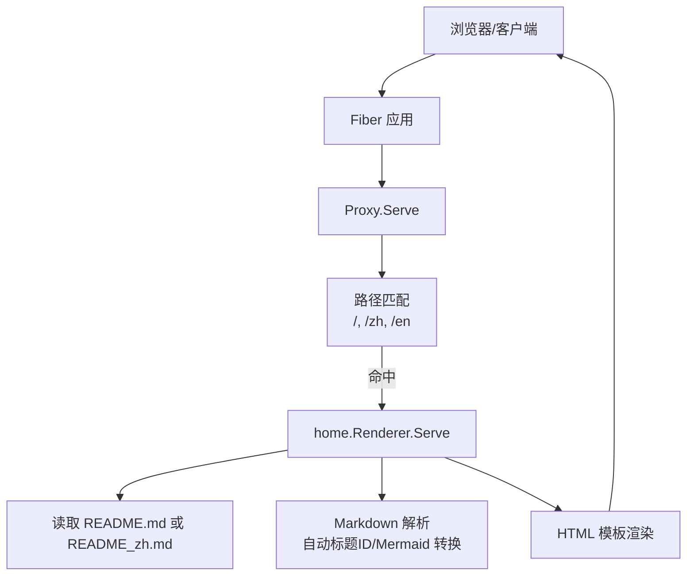
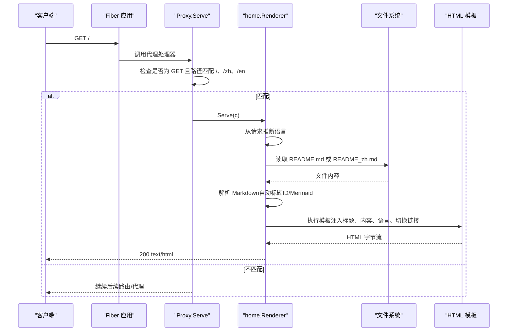
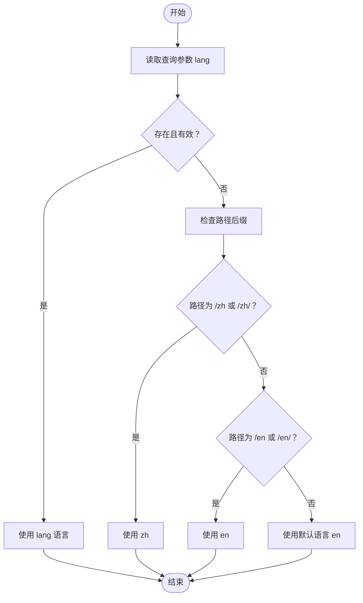
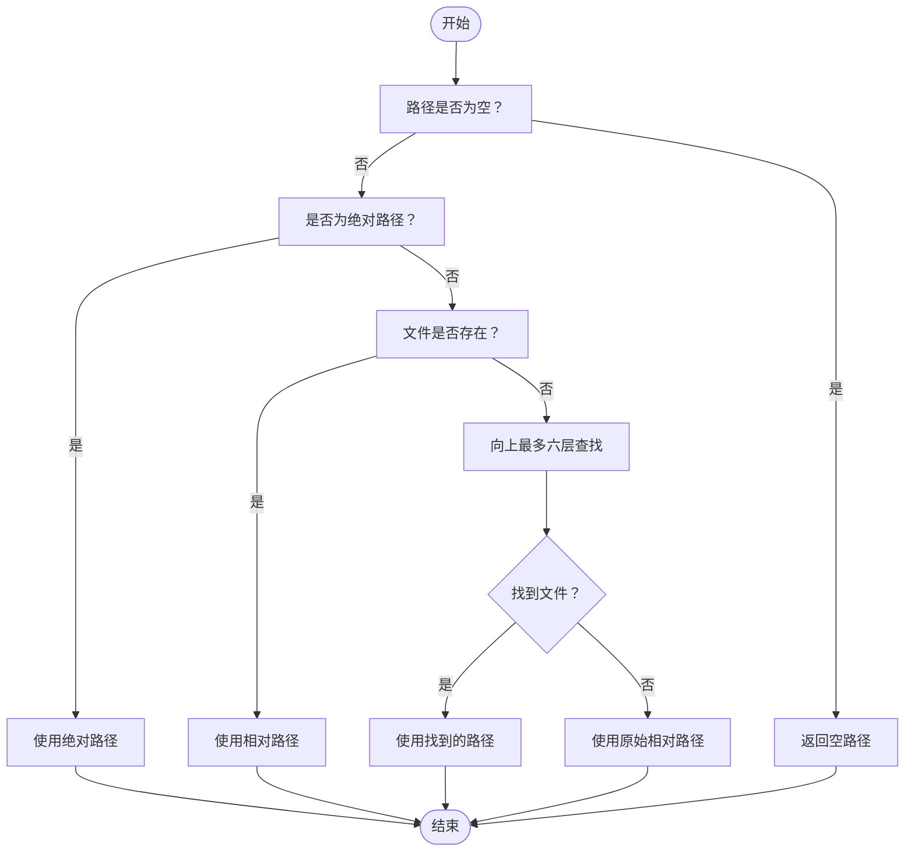
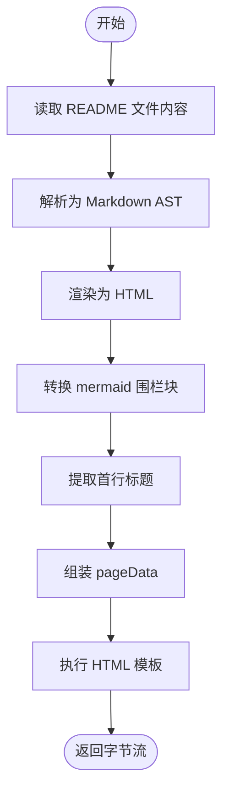
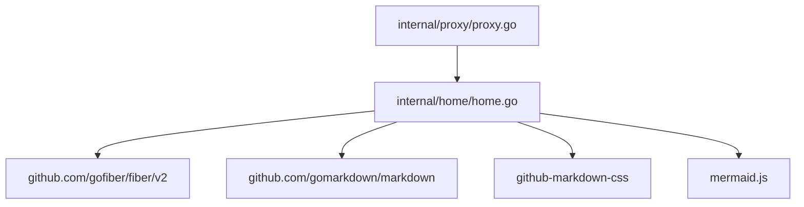

# 主页

<cite>
**本文引用的文件**
- [main.go](file://main.go)
- [cmd/serve.go](file://cmd/serve.go)
- [internal/proxy/proxy.go](file://internal/proxy/proxy.go)
- [internal/home/home.go](file://internal/home/home.go)
- [README.md](file://README.md)
- [README_zh.md](file://README_zh.md)
</cite>

## 目录
1. [简介](#简介)
2. [项目结构](#项目结构)
3. [核心组件](#核心组件)
4. [架构总览](#架构总览)
5. [详细组件分析](#详细组件分析)
6. [依赖关系分析](#依赖关系分析)
7. [性能考量](#性能考量)
8. [故障排查指南](#故障排查指南)
9. [结论](#结论)
10. [附录](#附录)

## 简介
本文件面向 RSSHub-Gateway 的主页端点（/、/zh、/en），系统性说明其工作原理与行为特征，包括：
- 如何将 README.md 与 README_zh.md 渲染为 HTML 页面
- 通过 ?lang=en 或 ?lang=zh 切换语言
- 内置 Markdown 解析器的特性（含 Mermaid 图表支持与自动标题 ID 生成）
- 响应内容结构（HTML 模板、CSS 样式、客户端脚本）
- 访问示例与自定义方法（替换 README 文件、调整路径匹配规则）

## 项目结构
主页端点位于应用的“代理层”中，由 Fiber 路由在 GET 请求命中特定路径时交由 home 渲染器处理。整体调用链如下图所示。

**图表来源**
- [cmd/serve.go](file://cmd/serve.go#L37-L40)
- [internal/proxy/proxy.go](file://internal/proxy/proxy.go#L49-L54)
- [internal/home/home.go](file://internal/home/home.go#L116-L145)

**章节来源**
- [cmd/serve.go](file://cmd/serve.go#L37-L40)
- [internal/proxy/proxy.go](file://internal/proxy/proxy.go#L49-L54)

## 核心组件
- 路由与入口
  - 服务器启动后创建 Fiber 实例并在全局中间件中注册代理处理器。主页端点的匹配逻辑在代理处理器内部完成。
- 代理处理器
  - 在 GET 请求下，若路径为 /、/zh、/zh/、/en、/en/，则交由 home 渲染器处理。
- 主页渲染器
  - 负责根据语言选择 README 文件、解析 Markdown、生成 HTML 模板数据并输出。

**章节来源**
- [cmd/serve.go](file://cmd/serve.go#L37-L40)
- [internal/proxy/proxy.go](file://internal/proxy/proxy.go#L49-L54)
- [internal/home/home.go](file://internal/home/home.go#L116-L145)

## 架构总览
主页端点的请求处理流程如下：

**图表来源**
- [internal/proxy/proxy.go](file://internal/proxy/proxy.go#L49-L54)
- [internal/home/home.go](file://internal/home/home.go#L116-L145)

## 详细组件分析

### 路由与路径匹配
- 匹配规则
  - 当请求方法为 GET 且路径为以下之一时，进入主页渲染流程：
    - /、/zh、/zh/、/en、/en/
- 默认语言
  - 若未显式指定语言参数，则默认使用英文（en）。
- 语言参数优先级
  - 查询参数 lang 的优先级高于路径后缀 zh/en。

**章节来源**
- [internal/proxy/proxy.go](file://internal/proxy/proxy.go#L49-L54)
- [internal/home/home.go](file://internal/home/home.go#L219-L232)

### 语言选择逻辑
- 优先级
  - 若请求包含 lang 参数，则按规范化后的值选择语言。
  - 若路径为 /zh 或 /en，则强制 zh 或 en。
  - 否则使用默认语言（en）。
- 规范化策略
  - 支持 zh、zh-cn、zh-hans、cn 映射为 zh
  - 支持 en、en-us、en-gb 映射为 en
  - 其他值视为无效，回退到默认语言

**图表来源**
- [internal/home/home.go](file://internal/home/home.go#L219-L244)

**章节来源**
- [internal/home/home.go](file://internal/home/home.go#L219-L244)

### README 文件定位与回退策略
- 选择策略
  - 若配置了对应语言的 README 路径，则优先使用。
  - 否则回退到默认语言路径。
  - 若仍为空，则使用第一个可用路径。
- 路径解析
  - 若路径为空，直接返回。
  - 若为绝对路径，直接使用。
  - 若相对路径存在，直接使用。
  - 否则在当前工作目录及其父目录最多向上六层查找是否存在该文件。
  - 若仍未找到，回退为原路径。

**图表来源**
- [internal/home/home.go](file://internal/home/home.go#L168-L194)

**章节来源**
- [internal/home/home.go](file://internal/home/home.go#L168-L194)

### Markdown 解析与渲染
- 解析器扩展
  - 启用常用扩展，包括自动标题 ID、围栏代码块、表格、删除线等。
- 渲染器选项
  - 启用在新窗口打开链接等通用标志。
- 标题提取
  - 从 Markdown 内容中扫描第一行以 “# ” 开头的标题作为页面标题。
  - 若未找到，则使用默认标题。
- Mermaid 支持
  - 将 Markdown 中的围栏代码块中的 mermaid 语法转换为前端可识别的 <pre class="mermaid"> 结构，以便 mermaid.js 渲染。
- 输出类型
  - 将渲染结果包装为模板安全的 HTML 片段，供模板渲染使用。

**图表来源**
- [internal/home/home.go](file://internal/home/home.go#L147-L166)
- [internal/home/home.go](file://internal/home/home.go#L246-L269)

**章节来源**
- [internal/home/home.go](file://internal/home/home.go#L147-L166)
- [internal/home/home.go](file://internal/home/home.go#L246-L269)

### HTML 模板与样式
- 模板结构
  - 包含基础 HTML 结构、字符集、视口设置、标题、语言属性。
- 样式来源
  - 引入 github-markdown-css 作为基础 Markdown 排版样式。
  - 自定义主题色与暗色模式适配，确保在浅色与深色主题下均具可读性。
- 语言切换区
  - 提供英文/中文切换链接，分别指向 /?lang=en 与 /?lang=zh。
- 客户端脚本
  - 引入 mermaid.js 并初始化，使页面中的 mermaid 图表自动渲染。

**章节来源**
- [internal/home/home.go](file://internal/home/home.go#L33-L101)

### 响应内容结构
- 内容类型
  - text/html; charset=utf-8
- 结构组成
  - 语言切换区（英文/中文）
  - Markdown 内容容器（markdown-body）
  - mermaid 初始化脚本

**章节来源**
- [internal/home/home.go](file://internal/home/home.go#L116-L125)

### 访问示例
- 英文主页
  - 访问 / 或 /en 或 /en/，默认语言为 en；可通过 ?lang=en 强制。
- 中文主页
  - 访问 / 或 /zh 或 /zh/，默认语言为 zh；可通过 ?lang=zh 强制。
- 语言切换
  - 在任意语言页面，点击顶部语言切换链接即可在两种语言间切换。

**章节来源**
- [internal/proxy/proxy.go](file://internal/proxy/proxy.go#L49-L54)
- [internal/home/home.go](file://internal/home/home.go#L133-L139)

### 自定义页面方法
- 替换 README 文件
  - 将 README.md 与 README_zh.md 放置于可被解析到的路径，或通过配置指定具体路径（参见 README 中的“首页”说明）。
- 调整路径匹配规则
  - 当前匹配规则为固定路径集合。若需扩展匹配范围（如 /home、/docs 等），可在代理处理器中增加条件判断，将匹配逻辑扩展到新的路径集合。
- 自定义模板与样式
  - 可在模板中新增样式片段或引入外部资源，但需注意跨域与 CDN 可用性。
- 自定义 Mermaid 行为
  - 可在模板中调整 mermaid 初始化参数，以满足不同渲染需求。

**章节来源**
- [README.md](file://README.md#L19-L24)
- [README_zh.md](file://README_zh.md#L23-L27)
- [internal/proxy/proxy.go](file://internal/proxy/proxy.go#L49-L54)

## 依赖关系分析
- 组件耦合
  - Proxy.Serve 依赖 home.Renderer 的 Serve 方法。
  - home.Renderer 依赖文件系统读取与模板引擎。
- 外部依赖
  - Fiber：Web 框架与路由。
  - gomarkdown/markdown：Markdown 解析与渲染。
  - github-markdown-css：Markdown 基础样式。
  - mermaid.js：Mermaid 图表渲染。

**图表来源**
- [internal/proxy/proxy.go](file://internal/proxy/proxy.go#L32-L40)
- [internal/home/home.go](file://internal/home/home.go#L105-L114)

**章节来源**
- [internal/proxy/proxy.go](file://internal/proxy/proxy.go#L32-L40)
- [internal/home/home.go](file://internal/home/home.go#L105-L114)

## 性能考量
- 文件读取
  - README 文件在每次请求时读取，建议将文件放置在本地磁盘且具备良好 I/O 性能，避免频繁远程挂载导致延迟。
- 模板渲染
  - 模板编译一次，多次请求复用，开销较低。
- Markdown 解析
  - 解析与渲染在单次请求内完成，复杂文档可能带来 CPU 占用上升；建议控制文档长度与图表数量。
- 样式与脚本
  - 使用 CDN 加载样式与脚本，减少服务器带宽压力；确保网络可达性。

## 故障排查指南
- 无法渲染主页
  - 检查 README.md 与 README_zh.md 是否存在且可读。
  - 检查路径解析逻辑是否能找到文件（相对路径、工作目录、向上查找）。
- 语言切换无效
  - 确认请求中 lang 参数是否为 zh 或 en（支持 zh-cn、en-us 等变体）。
  - 确认路径是否为 /、/zh、/en 等受支持的集合。
- Mermaid 图表未渲染
  - 确认 README 中使用了正确的围栏代码块标记（language-mermaid）。
  - 确认模板中已引入 mermaid.js 并正确初始化。
- 404 或 500 错误
  - 检查代理处理器是否正确匹配路径。
  - 查看日志中是否有渲染失败的警告信息。

**章节来源**
- [internal/home/home.go](file://internal/home/home.go#L116-L125)
- [internal/home/home.go](file://internal/home/home.go#L168-L194)
- [internal/home/home.go](file://internal/home/home.go#L219-L244)

## 结论
RSSHub-Gateway 的主页端点通过简洁而稳健的设计实现了：
- 基于路径与查询参数的语言切换
- 内置 Markdown 解析与 Mermaid 图表支持
- 可读性强的 HTML 模板与暗色模式适配
- 易于扩展的路径匹配与文件定位机制

对于日常使用，只需确保 README 文件可读且路径可解析；对于定制化需求，可在代理层扩展路径匹配、在模板层调整样式与脚本，或在渲染层扩展 Markdown 扩展能力。

## 附录
- 示例路径
  - /、/zh、/en、/zh/、/en/
- 示例查询参数
  - lang=en、lang=zh（以及 zh-cn、en-us 等变体）
- 相关参考
  - README 中关于“首页”的说明条目，明确了默认语言与路径行为

**章节来源**
- [README.md](file://README.md#L19-L24)
- [README_zh.md](file://README_zh.md#L23-L27)