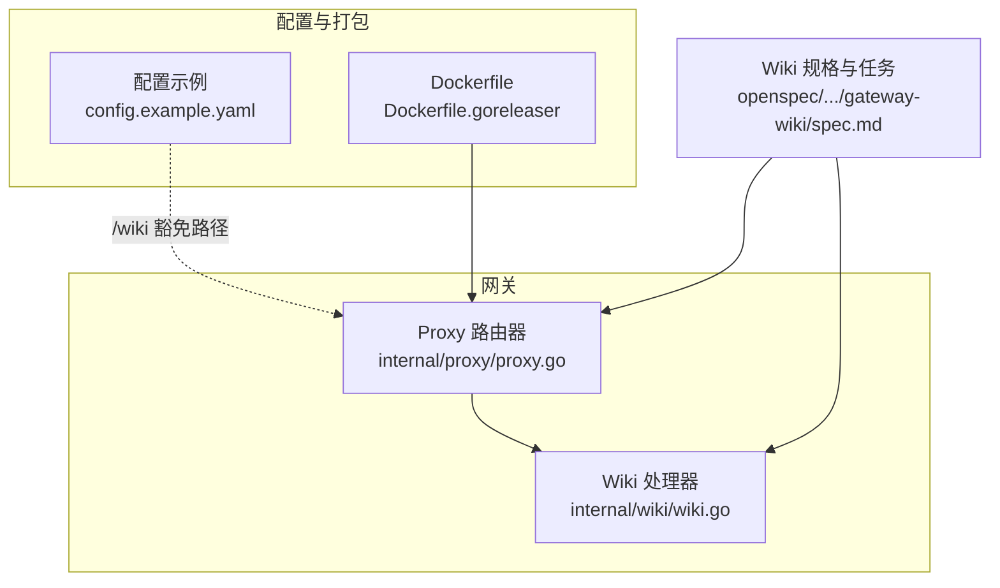
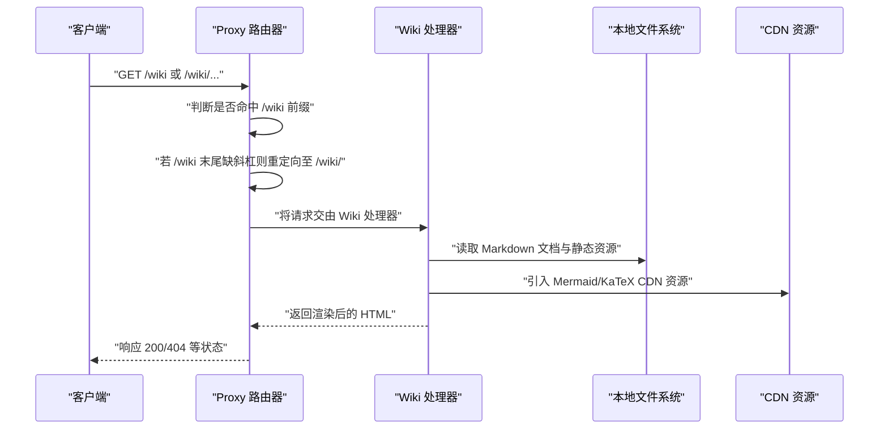
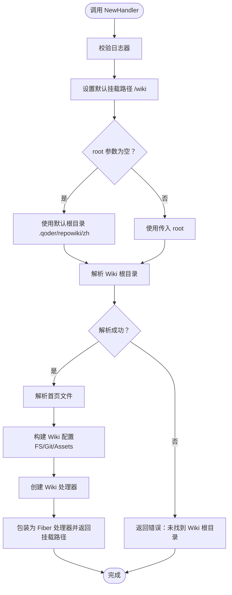
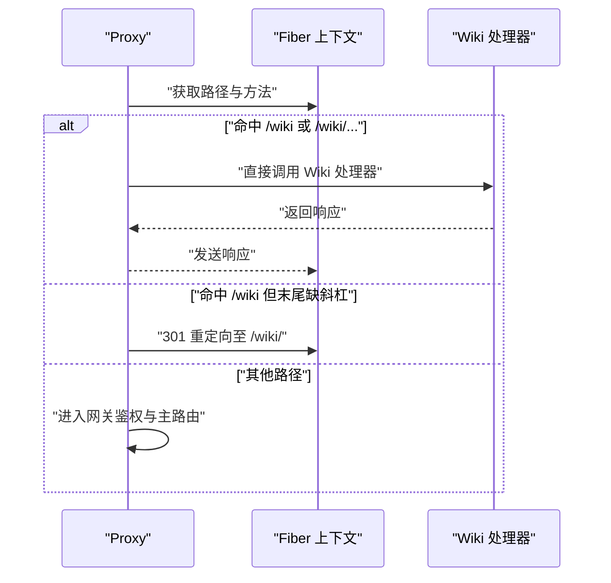
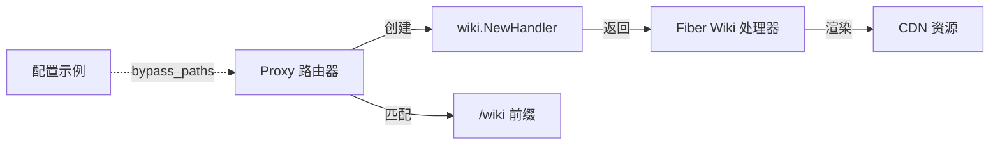

# 嵌入式Wiki功能

<cite>
**本文引用的文件**
- [internal/wiki/wiki.go](file://internal/wiki/wiki.go)
- [internal/wiki/wiki_test.go](file://internal/wiki/wiki_test.go)
- [internal/proxy/proxy.go](file://internal/proxy/proxy.go)
- [openspec/changes/add-qorder-wiki/specs/gateway-wiki/spec.md](file://openspec/changes/add-qorder-wiki/specs/gateway-wiki/spec.md)
- [openspec/changes/add-qorder-wiki/tasks.md](file://openspec/changes/add-qorder-wiki/tasks.md)
- [openspec/changes/add-qorder-wiki/design.md](file://openspec/changes/add-qorder-wiki/design.md)
- [config.example.yaml](file://config.example.yaml)
- [Dockerfile](file://Dockerfile)
- [Dockerfile.goreleaser](file://Dockerfile.goreleaser)
- [README.md](file://README.md)
- [README_zh.md](file://README_zh.md)
</cite>

## 目录
1. [简介](#简介)
2. [项目结构](#项目结构)
3. [核心组件](#核心组件)
4. [架构总览](#架构总览)
5. [详细组件分析](#详细组件分析)
6. [依赖关系分析](#依赖关系分析)
7. [性能考量](#性能考量)
8. [故障排查指南](#故障排查指南)
9. [结论](#结论)
10. [附录](#附录)

## 简介
本文件系统性阐述 RSSHub-Gateway 的“嵌入式 Wiki 功能”。该功能通过 go-embed-qorder-wiki 将本地仓库文档内容嵌入到网关中，并在运行时以 /wiki 路由对外提供渲染后的 HTML 页面。Wiki 内容默认从 .qoder/repowiki/zh 目录加载，支持 Mermaid 图表与 KaTeX 数学公式渲染，所有资源通过 CDN 加载。网关在路由层将 /wiki 前缀的请求交由 Wiki 处理器，且 Wiki 访问无需网关鉴权。

## 项目结构
- Wiki 功能实现位于 internal/wiki，负责创建 Fiber 处理器、解析根目录与首页、配置 CDN 资产与 Git 源信息。
- 网关路由位于 internal/proxy，负责在进入主鉴权与路由逻辑前，先判断是否命中 /wiki 前缀并交由 Wiki 处理器处理。
- 规格与设计文档位于 openspec/changes/add-qorder-wiki，明确 Wiki 的需求、场景与打包要求。
- 配置示例中包含 /wiki 与 /wiki/ 的鉴权豁免路径，确保 Wiki 可被无 key/code 访问。
- Dockerfile 与 Dockerfile.goreleaser 在构建产物中复制 .qoder/repowiki/zh，保证容器镜像包含 Wiki 资源。

图表来源
- [internal/proxy/proxy.go](file://internal/proxy/proxy.go#L40-L56)
- [internal/wiki/wiki.go](file://internal/wiki/wiki.go#L27-L71)
- [config.example.yaml](file://config.example.yaml#L26-L35)
- [Dockerfile](file://Dockerfile#L18-L19)
- [Dockerfile.goreleaser](file://Dockerfile.goreleaser#L12-L13)
- [openspec/changes/add-qorder-wiki/specs/gateway-wiki/spec.md](file://openspec/changes/add-qorder-wiki/specs/gateway-wiki/spec.md#L1-L36)

章节来源
- [internal/wiki/wiki.go](file://internal/wiki/wiki.go#L1-L152)
- [internal/proxy/proxy.go](file://internal/proxy/proxy.go#L40-L86)
- [config.example.yaml](file://config.example.yaml#L26-L35)
- [openspec/changes/add-qorder-wiki/specs/gateway-wiki/spec.md](file://openspec/changes/add-qorder-wiki/specs/gateway-wiki/spec.md#L1-L36)
- [openspec/changes/add-qorder-wiki/tasks.md](file://openspec/changes/add-qorder-wiki/tasks.md#L1-L9)
- [openspec/changes/add-qorder-wiki/design.md](file://openspec/changes/add-qorder-wiki/design.md#L1-L31)
- [Dockerfile](file://Dockerfile#L18-L19)
- [Dockerfile.goreleaser](file://Dockerfile.goreleaser#L12-L13)
- [README.md](file://README.md#L20-L30)
- [README_zh.md](file://README_zh.md#L20-L30)

## 核心组件
- Wiki 处理器工厂
  - 负责解析 Wiki 根目录、选择首页文件、配置 Git 源与 CDN 资产，并返回 Fiber 处理器与挂载路径。
  - 关键行为包括：默认根目录 .qoder/repowiki/zh、默认挂载 /wiki、默认首页 主页.md、Mermaid 与 KaTeX CDN 配置、Git 源使用仓库 URL 与构建时提交哈希。
- Proxy 路由器
  - 在进入网关鉴权与主路由前，优先判断是否命中 /wiki 前缀，若是则直接交由 Wiki 处理器处理。
  - 对 /wiki 末尾缺少斜杠的请求进行永久重定向至带斜杠的路径，以保证静态资源与链接正确解析。
- 配置与打包
  - 配置示例中将 /wiki 与 /wiki/ 明确加入 bypass_paths，确保 Wiki 访问无需鉴权。
  - Dockerfile 与 Dockerfile.goreleaser 在镜像构建阶段复制 .qoder/repowiki/zh，保证运行时可加载 Wiki 资源。

章节来源
- [internal/wiki/wiki.go](file://internal/wiki/wiki.go#L27-L71)
- [internal/proxy/proxy.go](file://internal/proxy/proxy.go#L40-L86)
- [config.example.yaml](file://config.example.yaml#L26-L35)
- [Dockerfile](file://Dockerfile#L18-L19)
- [Dockerfile.goreleaser](file://Dockerfile.goreleaser#L12-L13)

## 架构总览
下图展示 Wiki 功能在网关中的整体交互：Proxy 在路由阶段识别 /wiki 前缀请求，交由 Wiki 处理器渲染页面；Wiki 处理器基于本地文件系统与 CDN 资源生成 HTML；配置示例将 /wiki 豁免鉴权，使用户无需携带 key/code 即可访问。

图表来源
- [internal/proxy/proxy.go](file://internal/proxy/proxy.go#L72-L86)
- [internal/wiki/wiki.go](file://internal/wiki/wiki.go#L27-L71)
- [config.example.yaml](file://config.example.yaml#L26-L35)

## 详细组件分析

### Wiki 处理器工厂（internal/wiki/wiki.go）
- 职责
  - 解析 Wiki 根目录：支持绝对路径、相对路径与工作目录向上查找，最多向上遍历 6 层。
  - 选择首页：优先尝试 主页.md，其次 README.md/README_zh.md/README_ZH.md/快速开始.md，最后在 content 目录中选择首个 .md 文件作为兜底。
  - 配置 CDN：Mermaid 与 KaTeX 通过 CDN 引入，确保渲染效果。
  - 配置 Git 源：使用仓库 URL 与构建时提交哈希，用于将 file:// 链接重写为 GitHub Blob 链接。
  - 包装为 Fiber 处理器：返回处理器与挂载路径。
- 错误处理
  - 当根目录不存在时返回错误，提示“未找到 Wiki 根目录”。
  - 初始化 Wiki 处理器失败时返回错误，提示“初始化 Wiki 处理器失败”。

图表来源
- [internal/wiki/wiki.go](file://internal/wiki/wiki.go#L27-L106)

章节来源
- [internal/wiki/wiki.go](file://internal/wiki/wiki.go#L27-L106)

### Proxy 路由器对 Wiki 的集成（internal/proxy/proxy.go）
- 初始化
  - 在构造 Proxy 时调用 wiki.NewHandler 创建 Wiki 处理器与挂载路径；若失败则记录警告并继续运行（Wiki 可选）。
- 路由匹配
  - 若命中 /wiki 或 /wiki/...，直接交由 Wiki 处理器处理。
  - 对 /wiki 末尾缺斜杠的请求进行永久重定向至带斜杠路径，避免静态资源与链接解析问题。
  - 对 /_assets/ 前缀的请求同样交由 Wiki 处理器，确保资源正常加载。
- 鉴权豁免
  - Wiki 路由不经过网关鉴权，因此无需 key/code 即可访问。

图表来源
- [internal/proxy/proxy.go](file://internal/proxy/proxy.go#L40-L86)

章节来源
- [internal/proxy/proxy.go](file://internal/proxy/proxy.go#L40-L86)

### 配置与打包（config.example.yaml、Dockerfile、Dockerfile.goreleaser）
- 配置示例
  - 在 gateway_auth.bypass_paths 中显式添加 /wiki 与 /wiki/，确保 Wiki 访问无需鉴权。
- 打包
  - Dockerfile 与 Dockerfile.goreleaser 在镜像构建阶段复制 .qoder/repowiki/zh 到 /app/.qoder/repowiki/zh，保证运行时可加载 Wiki 资源。
- 规格与任务
  - 规格文档明确 Wiki 应在 /wiki 提供内容、支持 CDN 资产、重写 file:// 链接为 GitHub Blob 链接、发布物包含 Wiki 资源。
  - 任务清单显示已实现：集成 RepoWiki 处理器、挂载 Wiki、注入 Git 源提交哈希、配置 CDN、打包包含 Wiki 资源、更新 README 与测试。

章节来源
- [config.example.yaml](file://config.example.yaml#L26-L35)
- [Dockerfile](file://Dockerfile#L18-L19)
- [Dockerfile.goreleaser](file://Dockerfile.goreleaser#L12-L13)
- [openspec/changes/add-qorder-wiki/specs/gateway-wiki/spec.md](file://openspec/changes/add-qorder-wiki/specs/gateway-wiki/spec.md#L1-L36)
- [openspec/changes/add-qorder-wiki/tasks.md](file://openspec/changes/add-qorder-wiki/tasks.md#L1-L9)

### 测试验证（internal/wiki/wiki_test.go）
- 测试覆盖
  - 验证 NewHandler 返回非空处理器与默认挂载路径 /wiki。
  - 验证在传入空 root 时仍能正确解析默认根目录并返回处理器。

章节来源
- [internal/wiki/wiki_test.go](file://internal/wiki/wiki_test.go#L1-L21)

## 依赖关系分析
- 组件耦合
  - Proxy 依赖 wiki.NewHandler 创建 Wiki 处理器；二者通过挂载路径字符串耦合。
  - Wiki 处理器依赖 go-embed-qorder-wiki 与 Fiber 适配器；资产配置依赖 CDN。
- 外部依赖
  - Mermaid 与 KaTeX 通过 CDN 引入，降低本地资源体积与维护成本。
  - Git 源信息用于将 file:// 链接重写为 GitHub Blob 链接，便于在 Wiki 中引用源码。
- 潜在循环依赖
  - 代码结构清晰，未发现循环依赖迹象。

图表来源
- [internal/proxy/proxy.go](file://internal/proxy/proxy.go#L40-L56)
- [internal/wiki/wiki.go](file://internal/wiki/wiki.go#L27-L71)
- [config.example.yaml](file://config.example.yaml#L26-L35)

章节来源
- [internal/proxy/proxy.go](file://internal/proxy/proxy.go#L40-L56)
- [internal/wiki/wiki.go](file://internal/wiki/wiki.go#L27-L71)
- [config.example.yaml](file://config.example.yaml#L26-L35)

## 性能考量
- 资源加载
  - Mermaid 与 KaTeX 通过 CDN 加载，减少本地体积，但首次访问可能受网络影响。
- 文件系统访问
  - Wiki 以 os.DirFS 读取本地文件，建议将 .qoder/repowiki/zh 放置于高性能存储介质，避免磁盘抖动影响。
- 路由优先级
  - /wiki 前缀在进入网关鉴权与主路由前即被处理，避免不必要的鉴权与上游代理开销。
- 缓存策略
  - Wiki 页面通常为静态内容，建议在反向代理层开启缓存（如 Nginx），以减轻网关压力。

## 故障排查指南
- 无法访问 /wiki
  - 检查配置示例中是否已将 /wiki 与 /wiki/ 添加到 bypass_paths。
  - 确认容器镜像已包含 .qoder/repowiki/zh（Dockerfile 与 Dockerfile.goreleaser 已复制）。
- /wiki 末尾斜杠导致资源 404
  - Proxy 已对 /wiki 末尾缺斜杠进行 301 重定向；请确认浏览器已跟随重定向。
- Wiki 内容未更新
  - 确认构建时已将最新 .qoder/repowiki/zh 复制进镜像。
- Mermaid/KaTeX 渲染异常
  - 检查网络连通性与 CDN 可达性；必要时更换网络环境或使用代理。
- file:// 链接未重写为 GitHub Blob
  - 确认 Wiki 配置中 Git 源已正确设置（仓库 URL 与构建时提交哈希）。

章节来源
- [config.example.yaml](file://config.example.yaml#L26-L35)
- [Dockerfile](file://Dockerfile#L18-L19)
- [Dockerfile.goreleaser](file://Dockerfile.goreleaser#L12-L13)
- [internal/proxy/proxy.go](file://internal/proxy/proxy.go#L72-L86)
- [internal/wiki/wiki.go](file://internal/wiki/wiki.go#L27-L71)

## 结论
嵌入式 Wiki 功能通过 go-embed-qorder-wiki 将本地文档内容无缝集成到网关，提供 /wiki 路由与无需鉴权的访问体验。其核心优势在于：简单部署（镜像内置资源）、无需额外存储、CDN 渲染增强、以及与现有路由与鉴权体系的自然衔接。配合配置示例中的鉴权豁免与打包策略，可快速上线并稳定运行。

## 附录
- 相关文档与规范
  - Wiki 规格与场景：明确路由、鉴权豁免、CDN 资产、GitHub 链接重写与打包要求。
  - 设计与任务：说明实现思路、依赖与打包落地。
  - 项目文档：README 与 README_zh 中均提及 /wiki 与 Mermaid/KaTeX CDN。

章节来源
- [openspec/changes/add-qorder-wiki/specs/gateway-wiki/spec.md](file://openspec/changes/add-qorder-wiki/specs/gateway-wiki/spec.md#L1-L36)
- [openspec/changes/add-qorder-wiki/design.md](file://openspec/changes/add-qorder-wiki/design.md#L1-L31)
- [openspec/changes/add-qorder-wiki/tasks.md](file://openspec/changes/add-qorder-wiki/tasks.md#L1-L9)
- [README.md](file://README.md#L20-L30)
- [README_zh.md](file://README_zh.md#L20-L30)