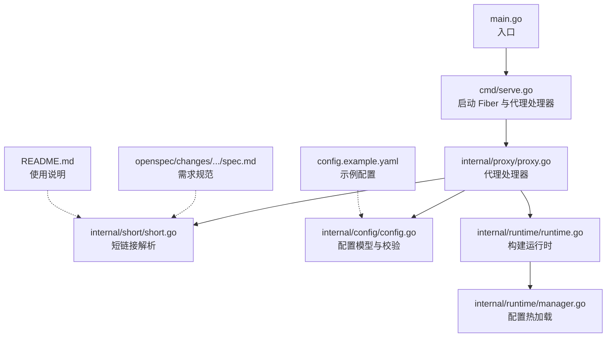
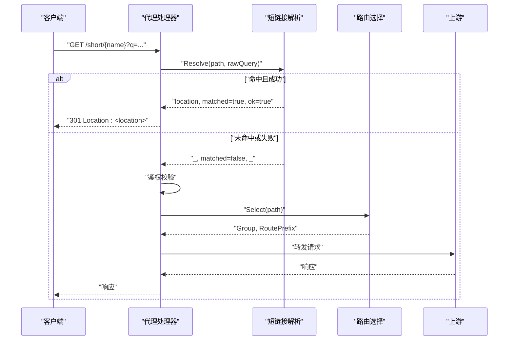
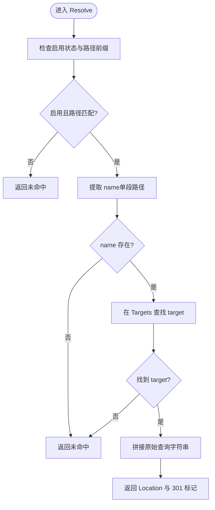
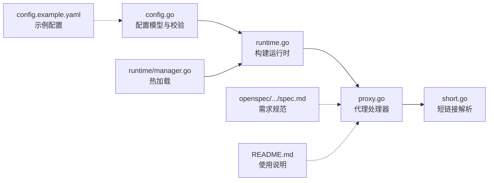

# 短链接服务

<cite>
**本文引用的文件**
- [main.go](file://main.go)
- [cmd/serve.go](file://cmd/serve.go)
- [internal/proxy/proxy.go](file://internal/proxy/proxy.go)
- [internal/short/short.go](file://internal/short/short.go)
- [internal/config/config.go](file://internal/config/config.go)
- [internal/runtime/runtime.go](file://internal/runtime/runtime.go)
- [internal/runtime/manager.go](file://internal/runtime/manager.go)
- [openspec/changes/add-short-subscriptions/specs/gateway-short/spec.md](file://openspec/changes/add-short-subscriptions/specs/gateway-short/spec.md)
- [config.example.yaml](file://config.example.yaml)
- [README.md](file://README.md)
</cite>

## 目录
1. [简介](#简介)
2. [项目结构](#项目结构)
3. [核心组件](#核心组件)
4. [架构总览](#架构总览)
5. [详细组件分析](#详细组件分析)
6. [依赖关系分析](#依赖关系分析)
7. [性能考量](#性能考量)
8. [故障排查指南](#故障排查指南)
9. [结论](#结论)
10. [附录](#附录)

## 简介
本章节面向使用 RSSHub-Gateway 的用户与运维人员，系统性说明“短链接重定向”能力（/short/{name}）。该能力允许通过配置 entries 将短名称映射到目标 URL，并在访问时执行 301 永久重定向。同时，客户端附加的查询参数会完整透传至目标地址。匹配逻辑采用“精确路径匹配优先”的策略，并支持以通配符“*”匹配前缀路径的扩展场景。本文还提供配置示例与 curl 测试命令，帮助快速验证短链接是否正确生效。

## 项目结构
短链接服务位于请求处理链路的早期阶段：当请求到达后，代理处理器会先尝试短链接匹配，若命中则直接返回 301；否则进入常规路由与上游转发流程。关键文件与职责如下：
- main.go：入口程序，调用命令子系统启动服务。
- cmd/serve.go：启动 Fiber 应用、加载配置、注册全局代理处理器。
- internal/proxy/proxy.go：核心代理逻辑，包含短链接解析与 301 返回。
- internal/short/short.go：短链接运行时与解析算法。
- internal/config/config.go：配置模型与校验，包括 short 配置项。
- internal/runtime/runtime.go：构建运行时对象，将配置转换为运行时数据结构。
- internal/runtime/manager.go：配置热加载与运行时切换。
- openspec/changes/add-short-subscriptions/specs/gateway-short/spec.md：需求与行为规范。
- config.example.yaml：示例配置，包含 short 配置段。
- README.md：官方文档，包含短链接使用说明与示例。

图表来源
- [main.go](file://main.go#L1-L22)
- [cmd/serve.go](file://cmd/serve.go#L1-L66)
- [internal/proxy/proxy.go](file://internal/proxy/proxy.go#L42-L71)
- [internal/short/short.go](file://internal/short/short.go#L1-L75)
- [internal/config/config.go](file://internal/config/config.go#L78-L110)
- [internal/runtime/runtime.go](file://internal/runtime/runtime.go#L99-L118)
- [internal/runtime/manager.go](file://internal/runtime/manager.go#L28-L67)
- [openspec/changes/add-short-subscriptions/specs/gateway-short/spec.md](file://openspec/changes/add-short-subscriptions/specs/gateway-short/spec.md#L1-L43)
- [config.example.yaml](file://config.example.yaml#L112-L132)
- [README.md](file://README.md#L271-L282)

章节来源
- [main.go](file://main.go#L1-L22)
- [cmd/serve.go](file://cmd/serve.go#L1-L66)
- [README.md](file://README.md#L271-L282)

## 核心组件
- 短链接运行时（Runtime）
  - 字段：Enabled、Path、Targets
  - 作用：承载配置的启用状态、短链接前缀路径、以及 name 到 target 的映射表。
- 解析器（Resolve）
  - 输入：运行时、请求路径、原始查询字符串
  - 输出：重定向目标位置、是否匹配过短链、是否成功解析
  - 行为：若未启用或路径不匹配，则返回未命中；若命中 name 且存在 target，则将原始查询字符串拼接到目标 URL 并返回 301 所需的 Location。

章节来源
- [internal/short/short.go](file://internal/short/short.go#L1-L75)
- [internal/config/config.go](file://internal/config/config.go#L78-L110)
- [internal/runtime/runtime.go](file://internal/runtime/runtime.go#L99-L118)

## 架构总览
短链接处理在代理处理器中进行，优先于常规路由与上游转发。其工作流如下：
- Fiber 接收请求，进入代理处理器
- 若短链接匹配命中且成功解析，则设置 Location 头并返回 301
- 若未命中短链接，则继续进行网关鉴权、路由选择、负载均衡与上游转发

图表来源
- [internal/proxy/proxy.go](file://internal/proxy/proxy.go#L42-L71)
- [internal/short/short.go](file://internal/short/short.go#L19-L35)

章节来源
- [internal/proxy/proxy.go](file://internal/proxy/proxy.go#L42-L71)

## 详细组件分析

### 短链接运行时与解析算法
- 运行时初始化
  - 将配置中的 entries 转换为 map[string]string，键为 name，值为 target
  - 构建 short.Runtime 并注入到运行时对象
- 匹配与解析
  - 路径匹配：要求请求路径以 short.path 开头（精确路径匹配优先），例如 /short/{name}
  - 名称提取：从 /short/{name} 中提取 name，要求 name 为单段路径（不含斜杠）
  - 目标查找：根据 name 在 Targets 映射中查找对应 target
  - 查询透传：将原始查询字符串拼接到 target，若 target 已含查询参数则使用 & 拼接
  - 返回：返回 301 所需的 Location 与状态

图表来源
- [internal/short/short.go](file://internal/short/short.go#L19-L75)

章节来源
- [internal/short/short.go](file://internal/short/short.go#L1-L75)
- [internal/runtime/runtime.go](file://internal/runtime/runtime.go#L99-L118)

### 配置模型与校验
- 配置项
  - short.enabled：启用短链接功能
  - short.path：短链接前缀路径，默认 “/short”
  - short.entries：短链接条目列表，每项包含 name 与 target
- 校验规则
  - 当启用时，short.path 必须以 “/” 开头
  - entries 中 name 必须非空且唯一
  - target 支持三种格式：
    - 以 “https://” 开头的外部 URL
    - 以 “/rsshub/” 开头的内部 RSSHub 路径
    - 以 “/upvote/” 开头的内部 Upvote 路径
- 默认化与归一化
  - short.path 会去除尾部斜杠并确保以 “/” 开头
  - entries 中的 name 与 target 会去除首尾空白

章节来源
- [internal/config/config.go](file://internal/config/config.go#L78-L110)
- [internal/config/config.go](file://internal/config/config.go#L248-L302)
- [internal/config/config.go](file://internal/config/config.go#L373-L390)
- [internal/config/config.go](file://internal/config/config.go#L466-L476)

### 运行时构建与热加载
- 构建运行时
  - 从配置读取 short.enabled、short.path、short.entries
  - 将 entries 转换为 map 并创建 short.Runtime
  - 注入到 Runtime 对象，供代理处理器使用
- 热加载
  - 通过 Manager.Reload 重新加载配置并切换运行时
  - 自动轮询与 SIGHUP 触发重载，失败时记录日志并保持旧配置

章节来源
- [internal/runtime/runtime.go](file://internal/runtime/runtime.go#L99-L118)
- [internal/runtime/manager.go](file://internal/runtime/manager.go#L28-L67)
- [internal/runtime/manager.go](file://internal/runtime/manager.go#L77-L126)

### 代理处理器中的短链接处理
- 入口
  - Fiber 全局处理器对所有路径进行处理
- 短链接优先
  - 调用 short.Resolve，传入 path 与原始查询字符串
  - 若 matched 为真且 ok 为真，设置 Location 并返回 301
  - 若 matched 为真但 ok 为假，返回 404
- 鉴权与路由
  - 若未命中短链接，继续进行网关鉴权校验
  - 之后进行路由选择与上游转发

章节来源
- [internal/proxy/proxy.go](file://internal/proxy/proxy.go#L42-L71)

### 需求与行为规范
- 301 永久重定向：支持内部 RSSHub、内部 Upvote 与外部 HTTPS 目标
- 查询透传：原始查询字符串完整保留并附加到目标 URL
- 鉴权豁免：短链接请求不经过网关鉴权，由目标端点自行处理认证
- 配置校验：启用时要求 short.path 以 “/” 开头，entries 的 name 唯一且 target 格式合法

章节来源
- [openspec/changes/add-short-subscriptions/specs/gateway-short/spec.md](file://openspec/changes/add-short-subscriptions/specs/gateway-short/spec.md#L1-L43)

## 依赖关系分析
短链接功能的依赖关系如下：
- 代理处理器依赖短链接解析器与运行时配置
- 短链接解析器依赖运行时的 Enabled、Path、Targets
- 运行时由配置构建，配置来源于配置文件与校验逻辑
- 热加载通过 Manager 实现，保证配置变更时平滑切换

图表来源
- [internal/config/config.go](file://internal/config/config.go#L78-L110)
- [internal/runtime/runtime.go](file://internal/runtime/runtime.go#L99-L118)
- [internal/proxy/proxy.go](file://internal/proxy/proxy.go#L42-L71)
- [internal/short/short.go](file://internal/short/short.go#L1-L75)
- [internal/runtime/manager.go](file://internal/runtime/manager.go#L28-L67)
- [openspec/changes/add-short-subscriptions/specs/gateway-short/spec.md](file://openspec/changes/add-short-subscriptions/specs/gateway-short/spec.md#L1-L43)
- [config.example.yaml](file://config.example.yaml#L112-L132)
- [README.md](file://README.md#L271-L282)

章节来源
- [internal/proxy/proxy.go](file://internal/proxy/proxy.go#L42-L71)
- [internal/short/short.go](file://internal/short/short.go#L1-L75)
- [internal/config/config.go](file://internal/config/config.go#L78-L110)
- [internal/runtime/runtime.go](file://internal/runtime/runtime.go#L99-L118)
- [internal/runtime/manager.go](file://internal/runtime/manager.go#L28-L67)

## 性能考量
- 短链接匹配为 O(1) 查表操作，开销极低
- 查询字符串拼接为线性复杂度，通常影响很小
- 由于短链接处理发生在代理处理器早期，命中后可避免后续鉴权与路由计算，整体延迟更低
- 若 entries 数量较大，建议控制在合理范围，避免映射表过大带来的内存占用

## 故障排查指南
- 短链接 404
  - 检查 name 是否存在于 entries 中
  - 检查请求路径是否以 short.path 开头
- 短链接未生效
  - 确认 short.enabled 已开启
  - 检查 short.path 是否以 “/” 开头
- 查询未透传
  - 确认未对原始查询进行过滤或修改
  - 若 target 已带查询参数，确认拼接逻辑为 “&”
- 鉴权问题
  - 短链接请求不受网关鉴权限制，若目标端点需要认证，请在目标端点自行处理

章节来源
- [internal/short/short.go](file://internal/short/short.go#L19-L75)
- [internal/config/config.go](file://internal/config/config.go#L373-L390)
- [openspec/changes/add-short-subscriptions/specs/gateway-short/spec.md](file://openspec/changes/add-short-subscriptions/specs/gateway-short/spec.md#L1-L43)

## 结论
RSSHub-Gateway 的短链接重定向功能以简洁高效的实现满足了“短名称映射 + 301 永久重定向 + 查询透传”的核心需求。通过严格的配置校验与清晰的匹配逻辑，用户可以安全地将常用订阅链接缩短为易记的短名称，并在不改变上游认证的前提下完成重定向。配合热加载与日志监控，可在生产环境中稳定运行。

## 附录

### 配置示例
- 启用 short 功能
  - 设置 short.enabled 为 true
  - 设置 short.path 为期望的前缀（默认 “/short”）
  - 在 short.entries 中添加 name 与 target 条目
- 示例条目
  - 内部 RSSHub：/rsshub/...
  - 内部 Upvote：/upvote/...
  - 外部 HTTPS：https://...

章节来源
- [config.example.yaml](file://config.example.yaml#L112-L132)
- [internal/config/config.go](file://internal/config/config.go#L78-L110)
- [internal/config/config.go](file://internal/config/config.go#L466-L476)

### 实际测试命令
- 使用 curl 验证短链接重定向
  - 命令示例（请替换为你的实际地址与配置）：
    - curl -I "http://127.0.0.1:8080/short/latepost?key=ACCESS_KEY"
    - curl -I "http://127.0.0.1:8080/short/reddit-top?code=ABC"
  - 预期结果：
    - 返回 301 状态码
    - Location 头为目标 URL，且原始查询参数已透传

章节来源
- [README.md](file://README.md#L271-L282)
- [openspec/changes/add-short-subscriptions/specs/gateway-short/spec.md](file://openspec/changes/add-short-subscriptions/specs/gateway-short/spec.md#L1-L43)