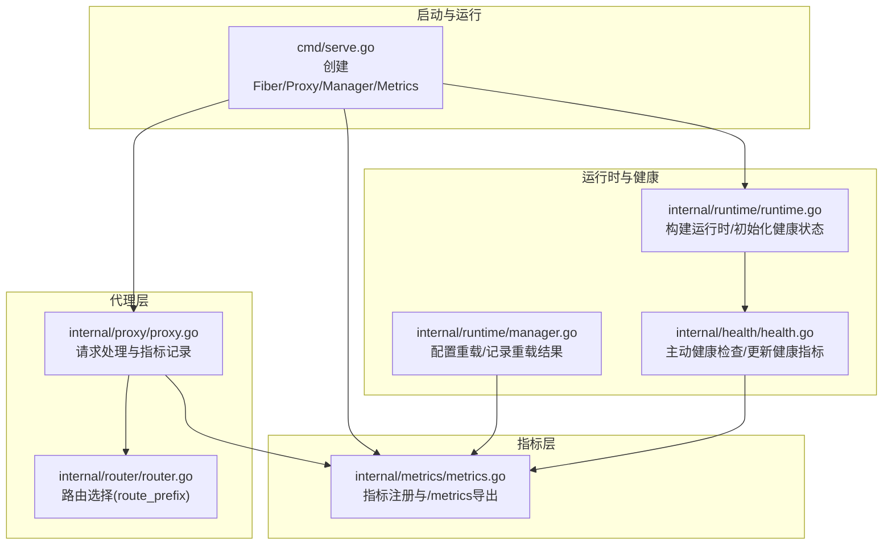
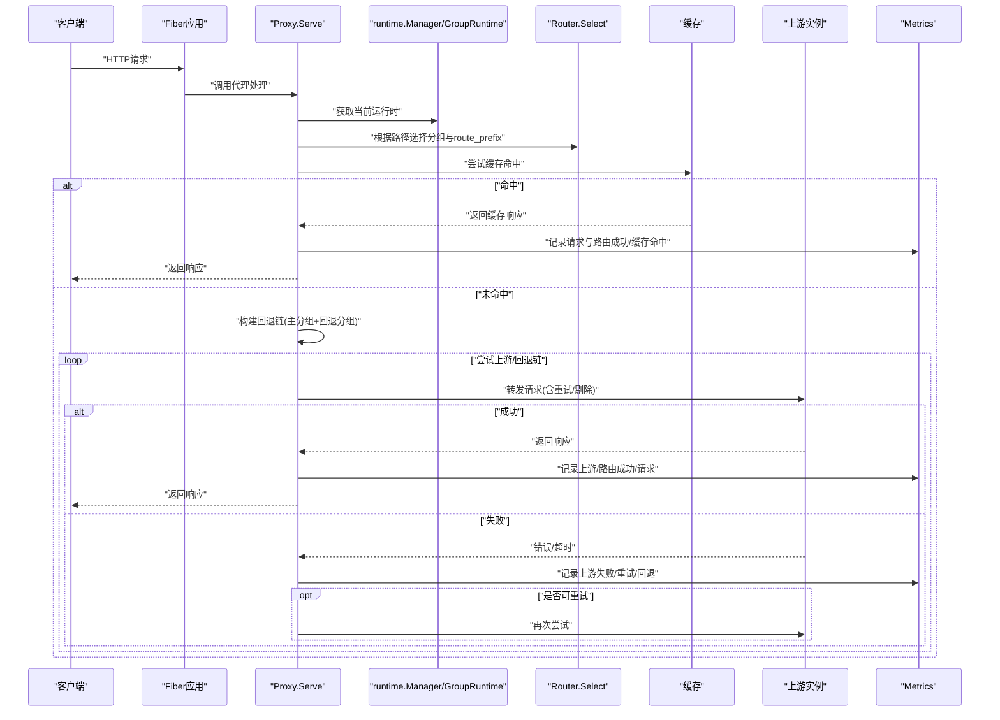
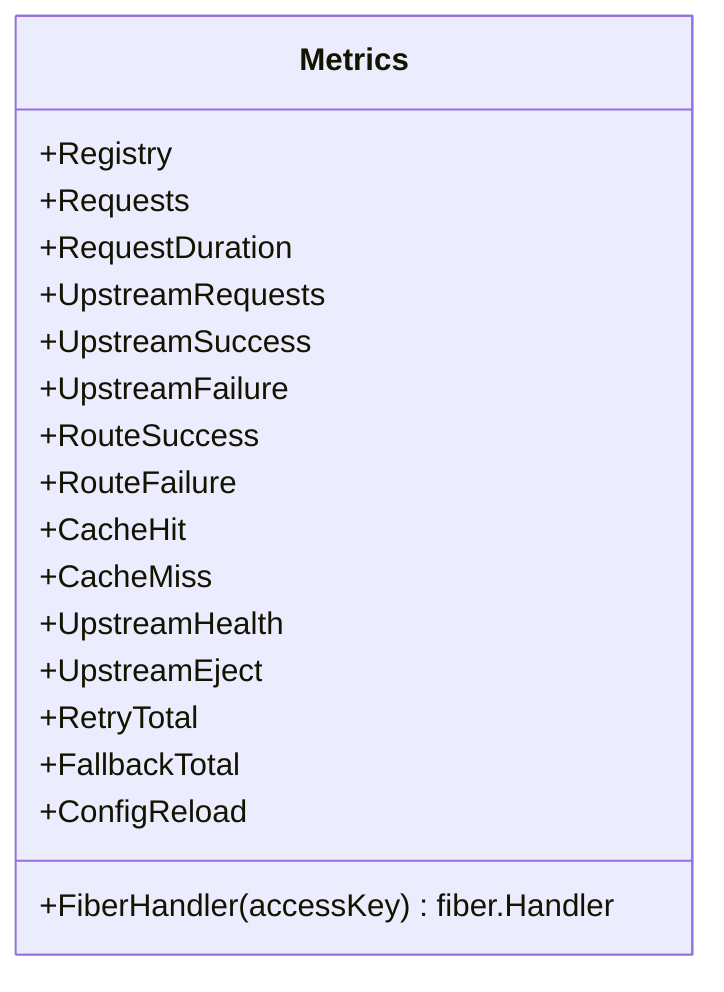
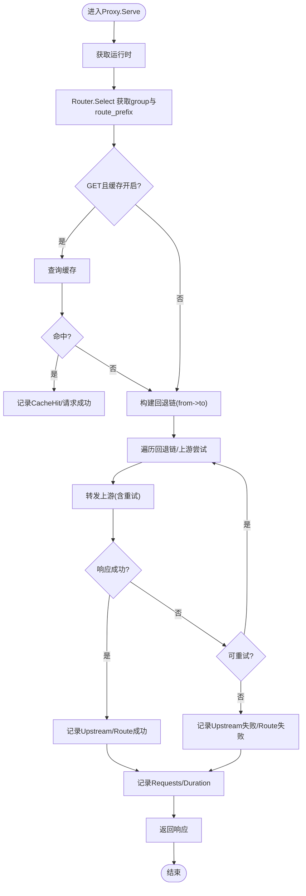
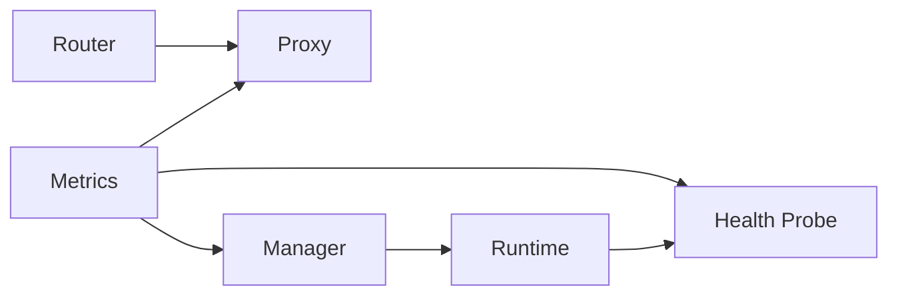

# Prometheus指标

<cite>
**本文引用的文件列表**
- [internal/metrics/metrics.go](file://internal/metrics/metrics.go)
- [internal/proxy/proxy.go](file://internal/proxy/proxy.go)
- [internal/runtime/runtime.go](file://internal/runtime/runtime.go)
- [internal/runtime/manager.go](file://internal/runtime/manager.go)
- [internal/health/health.go](file://internal/health/health.go)
- [internal/router/router.go](file://internal/router/router.go)
- [cmd/serve.go](file://cmd/serve.go)
- [config.example.yaml](file://config.example.yaml)
- [internal/proxy/proxy_test.go](file://internal/proxy/proxy_test.go)
</cite>

## 目录
1. [简介](#简介)
2. [项目结构与指标相关模块](#项目结构与指标相关模块)
3. [核心指标与标签维度](#核心指标与标签维度)
4. [架构总览](#架构总览)
5. [组件详解](#组件详解)
6. [依赖关系分析](#依赖关系分析)
7. [性能与可观测性建议](#性能与可观测性建议)
8. [故障排查指南](#故障排查指南)
9. [结论](#结论)
10. [附录：Prometheus抓取与Grafana面板建议](#附录prometheus抓取与grafana面板建议)

## 简介
本文件围绕RSSHub网关的Prometheus指标体系进行深入解析，重点覆盖以下方面：
- 自定义指标的名称、含义与标签维度
- 指标采集机制与Fiber中间件集成
- 与runtime.Manager的动态配置联动
- Prometheus抓取配置与Grafana仪表板设计建议
- 指标注册与更新的实现逻辑与调用链路

## 项目结构与指标相关模块
- 指标定义与导出：位于 internal/metrics/metrics.go，负责创建Counter/Histogram/Gauge等指标对象，并注册到Registry，同时提供Fiber Handler用于暴露/metrics端点。
- 代理处理与指标记录：位于 internal/proxy/proxy.go，请求进入后在路由选择、缓存命中/未命中、上游转发、重试、回退、错误分类等关键节点记录指标。
- 动态配置与指标联动：位于 internal/runtime/runtime.go 与 internal/runtime/manager.go，构建运行时时初始化上游健康状态为“健康”，并在配置重载时记录重载结果。
- 主动健康检查：位于 internal/health/health.go，周期性探测上游健康状态，变更时更新健康指标。
- 路由选择：位于 internal/router/router.go，用于确定route_prefix，影响请求与路由相关的指标标签。
- 启动入口：位于 cmd/serve.go，创建Metrics、Manager与Proxy，挂载Fiber路由。

图表来源
- [cmd/serve.go](file://cmd/serve.go#L1-L66)
- [internal/metrics/metrics.go](file://internal/metrics/metrics.go#L1-L123)
- [internal/proxy/proxy.go](file://internal/proxy/proxy.go#L1-L419)
- [internal/router/router.go](file://internal/router/router.go#L1-L80)
- [internal/runtime/runtime.go](file://internal/runtime/runtime.go#L1-L155)
- [internal/runtime/manager.go](file://internal/runtime/manager.go#L1-L173)
- [internal/health/health.go](file://internal/health/health.go#L1-L115)

章节来源
- [cmd/serve.go](file://cmd/serve.go#L1-L66)
- [internal/metrics/metrics.go](file://internal/metrics/metrics.go#L1-L123)
- [internal/proxy/proxy.go](file://internal/proxy/proxy.go#L1-L419)
- [internal/router/router.go](file://internal/router/router.go#L1-L80)
- [internal/runtime/runtime.go](file://internal/runtime/runtime.go#L1-L155)
- [internal/runtime/manager.go](file://internal/runtime/manager.go#L1-L173)
- [internal/health/health.go](file://internal/health/health.go#L1-L115)

## 核心指标与标签维度
以下指标均在内部注册并可通过/metrics端点暴露，标签维度与典型用途如下：

- rsshub_gateway_requests_total
  - 标签：method、group、route_prefix、status
  - 用途：按HTTP方法、路由分组、路由前缀、状态码统计请求总量，便于区分不同接口与错误类型占比

- rsshub_gateway_request_duration_seconds
  - 标签：group、route_prefix
  - 用途：按分组与路由前缀统计请求耗时直方图，用于SLA与延迟分析

- rsshub_gateway_upstream_requests_total
  - 标签：group、upstream、status
  - 用途：统计上游请求总量与状态分布，定位上游异常

- rsshub_gateway_upstream_success_total
  - 标签：group、upstream
  - 用途：统计成功上游响应次数，配合failure指标计算成功率

- rsshub_gateway_upstream_failure_total
  - 标签：group、upstream
  - 用途：统计失败上游响应次数，辅助故障定位

- rsshub_gateway_route_success_total
  - 标签：group、route_prefix
  - 用途：统计路由成功响应次数，评估路由策略有效性

- rsshub_gateway_route_failure_total
  - 标签：group、route_prefix
  - 用途：统计路由失败响应次数，识别路由匹配问题

- rsshub_gateway_cache_hit_total
  - 标签：provider
  - 用途：统计缓存命中次数，评估缓存效果

- rsshub_gateway_cache_miss_total
  - 标签：provider
  - 用途：统计缓存未命中次数，辅助容量规划

- rsshub_gateway_upstream_health
  - 标签：group、upstream
  - 用途：上游健康状态（1健康/0不健康），用于告警与可视化

- rsshub_gateway_upstream_eject_total
  - 标签：group、upstream
  - 用途：被动剔除次数，反映故障转移策略生效情况

- rsshub_gateway_retry_total
  - 标签：group
  - 用途：重试总次数，评估网络稳定性与上游可靠性

- rsshub_gateway_fallback_total
  - 标签：from、to
  - 用途：从分组回退到另一分组的次数，验证回退链路

- rsshub_gateway_config_reload_total
  - 标签：result
  - 用途：配置重载结果（success/fail），保障灰度与变更安全

章节来源
- [internal/metrics/metrics.go](file://internal/metrics/metrics.go#L1-L123)

## 架构总览
下图展示了从请求进入、路由选择、缓存命中/未命中、上游转发、重试与回退、错误分类到指标记录的整体流程。

图表来源
- [internal/proxy/proxy.go](file://internal/proxy/proxy.go#L42-L183)
- [internal/router/router.go](file://internal/router/router.go#L29-L56)
- [internal/runtime/manager.go](file://internal/runtime/manager.go#L69-L126)
- [internal/metrics/metrics.go](file://internal/metrics/metrics.go#L1-L123)

## 组件详解

### 指标注册与/metrics导出
- 指标注册：在指标构造函数中创建各类Counter/Histogram/Gauge，并统一注册到Registry。
- /metrics导出：通过适配器将Prometheus HTTP处理器包装为Fiber Handler，支持accesskey鉴权。

图表来源
- [internal/metrics/metrics.go](file://internal/metrics/metrics.go#L1-L123)

章节来源
- [internal/metrics/metrics.go](file://internal/metrics/metrics.go#L1-L123)

### 代理层指标记录逻辑
- 请求计数与延迟：在请求开始时记录时间戳，结束时根据状态码与路由信息记录请求总数与直方图。
- 上游指标：每次上游请求后根据状态码记录请求总数、成功/失败计数，并在被动剔除时记录剔除次数。
- 路由指标：根据路由选择结果记录路由成功/失败计数。
- 缓存指标：命中/未命中分别记录。
- 回退与重试：当从一个分组回退到另一个分组或发生重试时分别记录对应计数。

图表来源
- [internal/proxy/proxy.go](file://internal/proxy/proxy.go#L42-L183)

章节来源
- [internal/proxy/proxy.go](file://internal/proxy/proxy.go#L1-L419)

### 路由选择与route_prefix标签
- Router.Select根据allow/deny前缀匹配与优先级选择最佳分组，并返回route_prefix。
- route_prefix作为请求与路由相关指标的关键标签，便于按路径前缀聚合分析。

章节来源
- [internal/router/router.go](file://internal/router/router.go#L29-L56)

### 主动健康检查与健康指标
- 主动健康检查周期性探测上游健康，成功则设置健康指标为1，失败则设置为0，并记录日志。
- 健康状态变化会触发告警，结合被动剔除策略提升整体可用性。

章节来源
- [internal/health/health.go](file://internal/health/health.go#L1-L115)

### 配置重载与重载指标
- Manager在重载配置时记录重载结果（success/fail），并与日志协同输出。
- 构建新运行时过程中初始化各上游健康状态为1（健康）。

章节来源
- [internal/runtime/manager.go](file://internal/runtime/manager.go#L77-L135)
- [internal/runtime/runtime.go](file://internal/runtime/runtime.go#L50-L127)

## 依赖关系分析
- 指标对象由Metrics集中管理，Proxy与Health在关键路径上直接调用其WithLabelValues Inc/Observe/Set。
- Router.Select决定route_prefix，直接影响请求与路由指标的标签值。
- Manager在重载时通过Metrics记录重载结果，形成配置变更的可观测闭环。
- 启动入口在创建Metrics后将其注入Proxy与Manager，确保全链路可观测。

图表来源
- [internal/metrics/metrics.go](file://internal/metrics/metrics.go#L1-L123)
- [internal/proxy/proxy.go](file://internal/proxy/proxy.go#L1-L419)
- [internal/health/health.go](file://internal/health/health.go#L1-L115)
- [internal/runtime/manager.go](file://internal/runtime/manager.go#L1-L173)
- [internal/runtime/runtime.go](file://internal/runtime/runtime.go#L1-L155)
- [internal/router/router.go](file://internal/router/router.go#L1-L80)

章节来源
- [internal/metrics/metrics.go](file://internal/metrics/metrics.go#L1-L123)
- [internal/proxy/proxy.go](file://internal/proxy/proxy.go#L1-L419)
- [internal/health/health.go](file://internal/health/health.go#L1-L115)
- [internal/runtime/manager.go](file://internal/runtime/manager.go#L1-L173)
- [internal/runtime/runtime.go](file://internal/runtime/runtime.go#L1-L155)
- [internal/router/router.go](file://internal/router/router.go#L1-L80)

## 性能与可观测性建议
- 直方图桶设置：默认DefBuckets已覆盖常见场景，若需更细粒度或更宽范围，可在部署侧调整抓取目标的直方图聚合策略。
- 标签基数控制：避免在route_prefix或upstream上产生极高基数，必要时在Prometheus侧使用relabel规则限制标签值数量。
- 重试与回退：结合retry_total与fallback_total观察网络抖动与上游故障，合理设置重试次数与回退链。
- 缓存命中率：通过cache_hit_total与cache_miss_total计算命中率，评估缓存策略与TTL设置。
- 健康指标：持续监控upstream_health，结合被动剔除阈值优化故障转移策略。

[本节为通用建议，不直接分析具体文件]

## 故障排查指南
- /metrics访问鉴权失败
  - 确认配置中的accesskey与请求参数一致，否则返回403。
  - 参考测试用例验证鉴权行为。
  
- 请求计数与延迟异常
  - 检查route_prefix是否符合预期，确认Router.Select的allow/deny与优先级配置。
  - 关注route_success_total与route_failure_total的比例，定位路由或上游问题。

- 上游失败与剔除
  - 结合upstream_failure_total与upstream_eject_total，判断是否存在频繁超时/连接失败或被动剔除导致的流量偏移。

- 配置重载失败
  - 查看config_reload_total中result为fail的次数与日志，定位配置校验或构建阶段的问题。

章节来源
- [internal/proxy/proxy_test.go](file://internal/proxy/proxy_test.go#L322-L343)
- [internal/proxy/proxy_test.go](file://internal/proxy/proxy_test.go#L345-L427)
- [internal/runtime/manager.go](file://internal/runtime/manager.go#L77-L135)

## 结论
该指标体系覆盖了请求、路由、上游、缓存、重试、回退与配置重载等关键环节，标签维度清晰，能够支撑多维监控与告警。通过Fiber中间件与runtime.Manager的紧密集成，实现了静态指标与动态配置的无缝衔接，为生产环境的稳定性与可观测性提供了坚实基础。

[本节为总结性内容，不直接分析具体文件]

## 附录：Prometheus抓取与Grafana面板建议

### Prometheus抓取配置示例
- job名称：rsshub-gateway
- scrape_interval：15s
- static_configs：
  - targets：["gateway-host:port"]
- params：
  - accesskey：["你的访问密钥"]

说明：
- 若未启用accesskey，可省略params或留空
- 如需限制抓取范围，可在scrape_config中添加relabel_configs

章节来源
- [config.example.yaml](file://config.example.yaml#L34-L46)
- [internal/metrics/metrics.go](file://internal/metrics/metrics.go#L113-L123)

### Grafana仪表板关键面板设计建议
- 请求总量与成功率
  - 指标：rate(rsshub_gateway_requests_total[5m])，按method/group/route_prefix聚合
  - 建议：分组堆叠柱状图，叠加错误率曲线

- 延迟分布
  - 指标：histogram_quantile(0.95, sum by(le, group, route_prefix) (rate(rsshub_gateway_request_duration_seconds_bucket[5m])))
  - 建议：95线趋势图，按group/route_prefix分面

- 上游健康与失败
  - 指标：rsshub_gateway_upstream_health，按group/upstream分面
  - 建议：热力图/状态指示器，结合upstream_failure_total与eject_total

- 路由与缓存
  - 指标：rsshub_gateway_route_success_total、rsshub_gateway_cache_hit_total、rsshub_gateway_cache_miss_total
  - 建议：命中率曲线与路由成功率对比

- 重试与回退
  - 指标：rsshub_gateway_retry_total、rsshub_gateway_fallback_total
  - 建议：回退链可视化，重试次数趋势

- 配置重载
  - 指标：rsshub_gateway_config_reload_total
  - 建议：重载事件标记，结合日志面板

[本节为概念性建议，不直接分析具体文件]