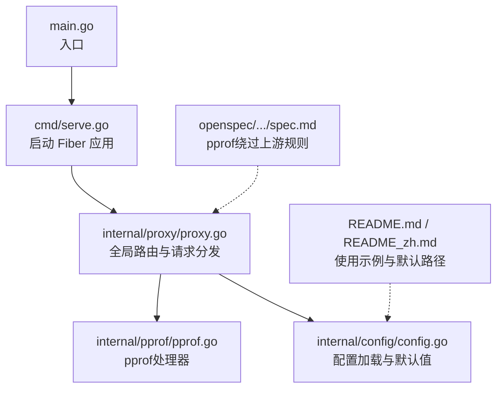
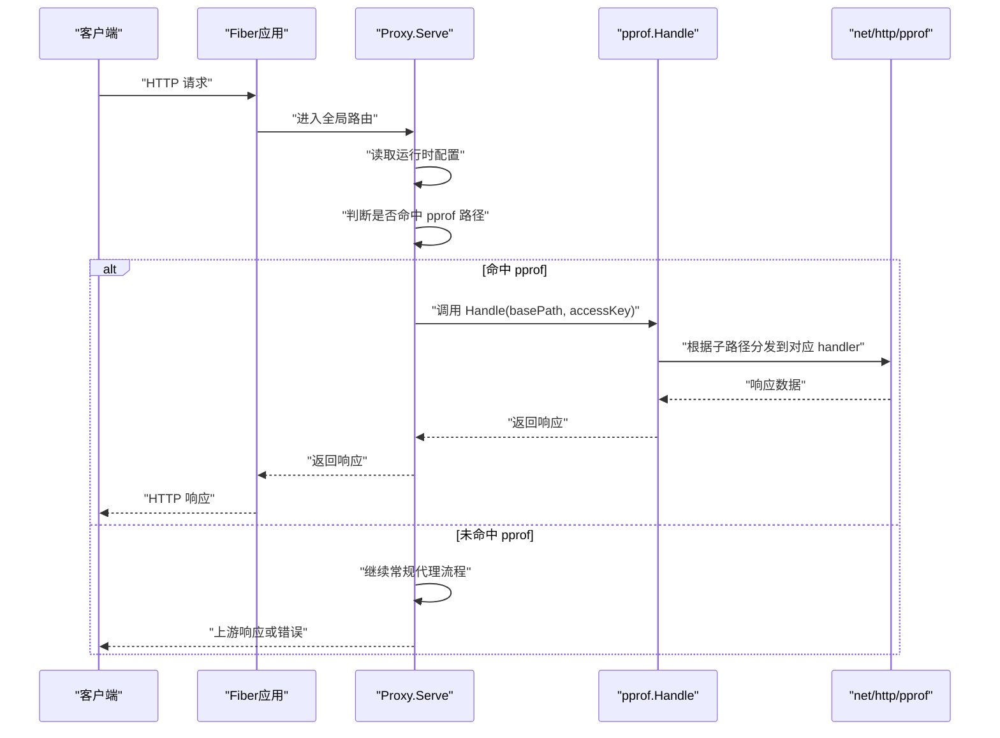
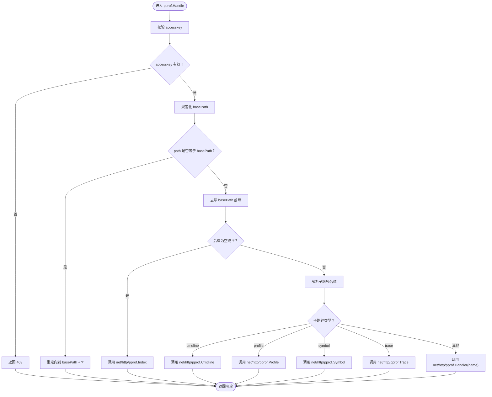
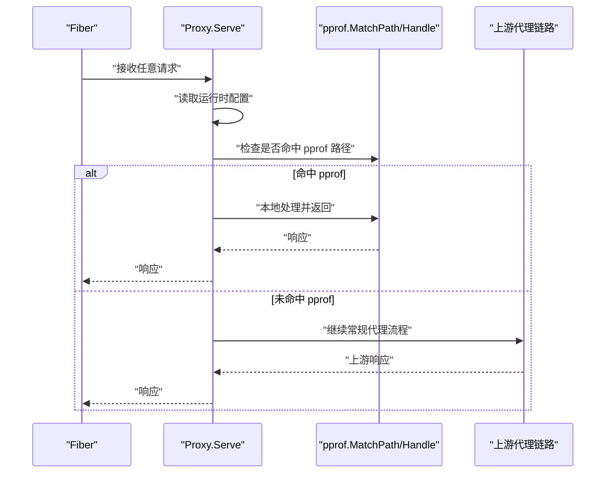
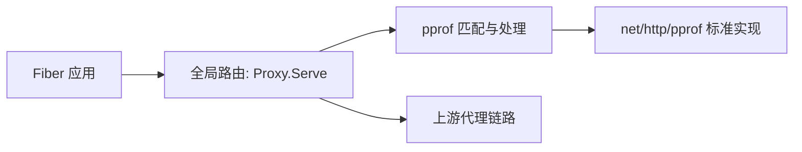

# pprof调试接口

<cite>
**本文引用的文件列表**
- [main.go](file://main.go)
- [cmd/serve.go](file://cmd/serve.go)
- [internal/proxy/proxy.go](file://internal/proxy/proxy.go)
- [internal/pprof/pprof.go](file://internal/pprof/pprof.go)
- [internal/config/config.go](file://internal/config/config.go)
- [openspec/changes/add-v0-2-observability-reload/specs/gateway-observability/spec.md](file://openspec/changes/add-v0-2-observability-reload/specs/gateway-observability/spec.md)
- [README.md](file://README.md)
- [README_zh.md](file://README_zh.md)
</cite>

## 目录
1. [简介](#简介)
2. [项目结构](#项目结构)
3. [核心组件](#核心组件)
4. [架构总览](#架构总览)
5. [详细组件分析](#详细组件分析)
6. [依赖关系分析](#依赖关系分析)
7. [性能与安全考量](#性能与安全考量)
8. [故障排查指南](#故障排查指南)
9. [结论](#结论)
10. [附录：使用指南与命令示例](#附录使用指南与命令示例)

## 简介
本章节面向运维与开发人员，系统性讲解如何通过内置的 /debug/pprof 调试接口进行性能分析。该功能基于 Go 标准库 net/http/pprof 的集成，借助 Fiber 路由在运行时暴露 pprof 端点，并通过访问密钥进行访问控制。文档将说明：
- 如何在配置中启用 pprof 并设置访问路径与访问密钥
- pprof 路由的注册与匹配逻辑
- 在不中断服务的前提下进行低开销的性能诊断
- 使用 go tool pprof 抓取 CPU、内存、goroutine 阻塞等数据，并生成火焰图
- 生产环境启用该功能的安全风险与防护建议

## 项目结构
pprof 功能涉及以下关键文件：
- 配置定义与默认值：internal/config/config.go
- 服务启动与 Fiber 应用初始化：cmd/serve.go
- 路由与请求分发：internal/proxy/proxy.go
- pprof 处理器与路径匹配：internal/pprof/pprof.go
- 规范约束（pprof 不走上游代理）：openspec/changes/add-v0-2-observability-reload/specs/gateway-observability/spec.md
- 文档中的使用示例与默认路径：README.md、README_zh.md

图表来源
- [main.go](file://main.go#L1-L22)
- [cmd/serve.go](file://cmd/serve.go#L1-L66)
- [internal/proxy/proxy.go](file://internal/proxy/proxy.go#L41-L83)
- [internal/pprof/pprof.go](file://internal/pprof/pprof.go#L1-L62)
- [internal/config/config.go](file://internal/config/config.go#L162-L174)
- [openspec/.../spec.md](file://openspec/changes/add-v0-2-observability-reload/specs/gateway-observability/spec.md#L10-L21)
- [README.md](file://README.md#L150-L170)
- [README_zh.md](file://README_zh.md#L160-L170)

章节来源
- [main.go](file://main.go#L1-L22)
- [cmd/serve.go](file://cmd/serve.go#L1-L66)
- [internal/proxy/proxy.go](file://internal/proxy/proxy.go#L41-L83)
- [internal/pprof/pprof.go](file://internal/pprof/pprof.go#L1-L62)
- [internal/config/config.go](file://internal/config/config.go#L162-L174)
- [openspec/.../spec.md](file://openspec/changes/add-v0-2-observability-reload/specs/gateway-observability/spec.md#L10-L21)
- [README.md](file://README.md#L150-L170)
- [README_zh.md](file://README_zh.md#L160-L170)

## 核心组件
- pprof 配置模型与默认值
  - 配置项包含 enabled、path、accesskey；默认路径为 /debug/pprof
  - 默认值在配置加载阶段应用
- pprof 路由处理
  - 提供 MatchPath 判断是否命中 pprof 基础路径
  - Handle 统一处理 /debug/pprof 下的子路径，支持 index、cmdline、profile、symbol、trace 等
  - 支持访问密钥校验，未通过则返回禁止访问
- 请求分发与绕过规则
  - 在 Proxy.Serve 中优先判断 pprof 是否命中，若命中则直接本地处理，不转发至上游
  - 同时对 /metrics 等其他调试端点也采用相同“本地处理、不走上游”的策略

章节来源
- [internal/config/config.go](file://internal/config/config.go#L44-L48)
- [internal/config/config.go](file://internal/config/config.go#L162-L174)
- [internal/pprof/pprof.go](file://internal/pprof/pprof.go#L12-L31)
- [internal/pprof/pprof.go](file://internal/pprof/pprof.go#L33-L62)
- [internal/proxy/proxy.go](file://internal/proxy/proxy.go#L41-L83)

## 架构总览
pprof 调试接口在运行时通过 Fiber 全局中间件拦截匹配到的 /debug/pprof* 请求，交由 pprof 处理器直接响应，不经过上游代理链路。

图表来源
- [cmd/serve.go](file://cmd/serve.go#L37-L40)
- [internal/proxy/proxy.go](file://internal/proxy/proxy.go#L41-L83)
- [internal/pprof/pprof.go](file://internal/pprof/pprof.go#L33-L62)
- [openspec/.../spec.md](file://openspec/changes/add-v0-2-observability-reload/specs/gateway-observability/spec.md#L18-L21)

## 详细组件分析

### pprof 路由匹配与处理
- 路径规范化
  - 支持空字符串、末尾斜杠等情况的标准化，默认路径为 /debug/pprof
- 匹配逻辑
  - MatchPath 判断请求路径是否以配置的 pprof 基础路径开头
- 访问控制
  - Handle 会检查查询参数 accesskey，若配置了访问密钥且不匹配则返回禁止访问
- 子路径分发
  - index、cmdline、profile、symbol、trace 等子路径分别映射到标准库对应的 handler
  - 其他子路径通过 net/http/pprof.Handler(name) 分发

图表来源
- [internal/pprof/pprof.go](file://internal/pprof/pprof.go#L12-L31)
- [internal/pprof/pprof.go](file://internal/pprof/pprof.go#L33-L62)

章节来源
- [internal/pprof/pprof.go](file://internal/pprof/pprof.go#L12-L31)
- [internal/pprof/pprof.go](file://internal/pprof/pprof.go#L33-L62)

### 请求分发与绕过规则
- 全局路由
  - Fiber 对所有路径使用代理处理器，但会在进入代理前先检查 pprof 命中
- 绕过上游
  - 若命中 pprof，则直接由 pprof 处理器返回，不转发到上游
  - 同样地，/metrics 等其他调试端点也遵循“本地处理、不走上游”的策略

图表来源
- [cmd/serve.go](file://cmd/serve.go#L37-L40)
- [internal/proxy/proxy.go](file://internal/proxy/proxy.go#L41-L83)
- [openspec/.../spec.md](file://openspec/changes/add-v0-2-observability-reload/specs/gateway-observability/spec.md#L18-L21)

章节来源
- [cmd/serve.go](file://cmd/serve.go#L37-L40)
- [internal/proxy/proxy.go](file://internal/proxy/proxy.go#L41-L83)
- [openspec/.../spec.md](file://openspec/changes/add-v0-2-observability-reload/specs/gateway-observability/spec.md#L18-L21)

### 配置模型与默认值
- 配置结构体包含 Pprof 字段：enabled、path、accesskey
- 默认值
  - pprof.path 默认为 /debug/pprof
- 校验规则
  - 当 pprof.enabled 为真时，必须提供有效的 pprof.accesskey 与以 / 开头的 pprof.path

章节来源
- [internal/config/config.go](file://internal/config/config.go#L44-L48)
- [internal/config/config.go](file://internal/config/config.go#L162-L174)
- [internal/config/config.go](file://internal/config/config.go#L338-L345)

## 依赖关系分析
- Fiber 应用在启动时创建并挂载全局路由
- Proxy.Serve 是全局中间件，负责在进入上游代理前做 pprof 匹配与本地处理
- pprof.Handle 依赖 net/http/pprof 的标准实现，通过 Fiber 的 HTTP 适配器桥接

图表来源
- [cmd/serve.go](file://cmd/serve.go#L37-L40)
- [internal/proxy/proxy.go](file://internal/proxy/proxy.go#L41-L83)
- [internal/pprof/pprof.go](file://internal/pprof/pprof.go#L33-L62)

章节来源
- [cmd/serve.go](file://cmd/serve.go#L37-L40)
- [internal/proxy/proxy.go](file://internal/proxy/proxy.go#L41-L83)
- [internal/pprof/pprof.go](file://internal/pprof/pprof.go#L33-L62)

## 性能与安全考量
- 低开销诊断
  - pprof 仅在被访问时产生开销，正常流量下几乎无影响
  - 可通过短时间采集 profile、heap、block 等数据进行快速定位
- 安全风险
  - pprof 暴露敏感运行时信息，可能被用于攻击或信息泄露
  - 建议仅在内网或受控网络中启用，或通过反向代理、网络策略限制访问
- 访问控制
  - 通过配置 pprof.accesskey 并在请求中携带 accesskey 查询参数进行访问控制
  - 未提供或不匹配时返回禁止访问

章节来源
- [internal/pprof/pprof.go](file://internal/pprof/pprof.go#L33-L36)
- [internal/config/config.go](file://internal/config/config.go#L338-L345)

## 故障排查指南
- 无法访问 /debug/pprof
  - 检查 pprof.enabled 是否开启
  - 检查 pprof.path 是否正确（默认 /debug/pprof）
  - 检查是否提供了正确的 accesskey 查询参数
- 访问被拒绝
  - 确认 accesskey 与配置一致
  - 确认请求 URL 中包含 ?accesskey=...
- 请求被转发到上游
  - 确认请求路径确实以 pprof.path 开头
  - 确认未被 deny/allow 规则影响（pprof 路径不会被路由选择影响，但需确保未被其他规则拦截）

章节来源
- [internal/config/config.go](file://internal/config/config.go#L338-L345)
- [internal/pprof/pprof.go](file://internal/pprof/pprof.go#L33-L36)
- [internal/proxy/proxy.go](file://internal/proxy/proxy.go#L41-L83)

## 结论
pprof 调试接口通过 Fiber 路由与标准库 net/http/pprof 的无缝集成，在不中断服务的前提下提供低开销的性能诊断能力。通过配置访问密钥与合理的网络隔离策略，可以在保障安全的同时高效定位性能瓶颈。建议在生产环境中谨慎启用，并配合反向代理或网络策略限制访问范围。

## 附录：使用指南与命令示例
- 启用与访问
  - 在配置中启用 pprof 并设置访问密钥与路径
  - 默认路径为 /debug/pprof，可通过访问参数 accesskey 进行鉴权
- 常见采集场景
  - CPU 性能剖析：采集一段时间的 profile 数据，结合 go tool pprof 生成火焰图
  - 内存分配：采集 heap 数据，分析内存增长与热点对象
  - goroutine 阻塞：采集 block 数据，定位阻塞热点
- 命令示例（描述性说明）
  - 抓取 CPU profile 并生成火焰图：使用 go tool pprof 从 /debug/pprof/profile 接口拉取数据
  - 抓取内存 heap 数据：访问 /debug/pprof/heap
  - 抓取 goroutine 阻塞 block 数据：访问 /debug/pprof/block
  - 所有可用子路径可参考 /debug/pprof/ 索引页

章节来源
- [README.md](file://README.md#L150-L170)
- [README_zh.md](file://README_zh.md#L160-L170)
- [internal/pprof/pprof.go](file://internal/pprof/pprof.go#L44-L61)