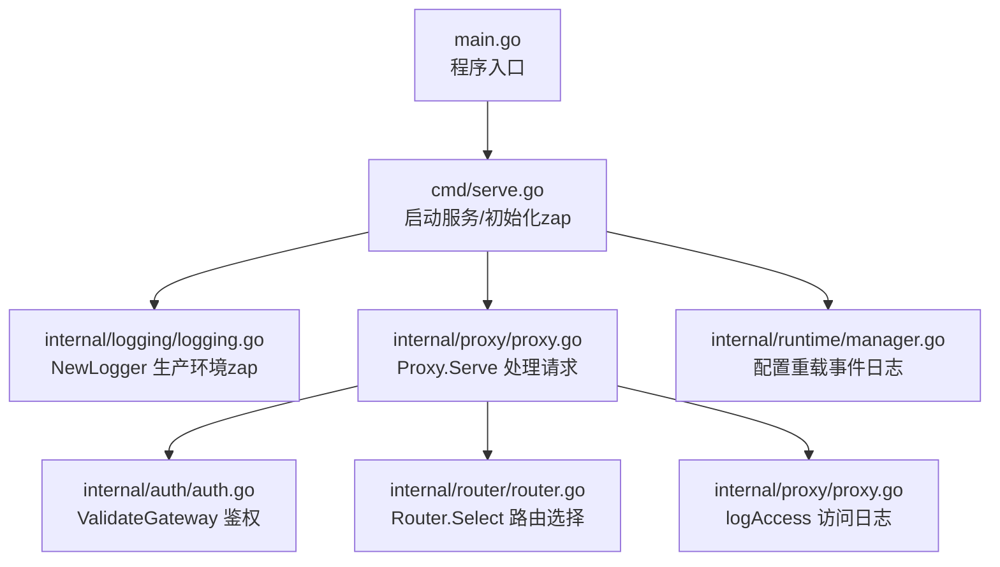
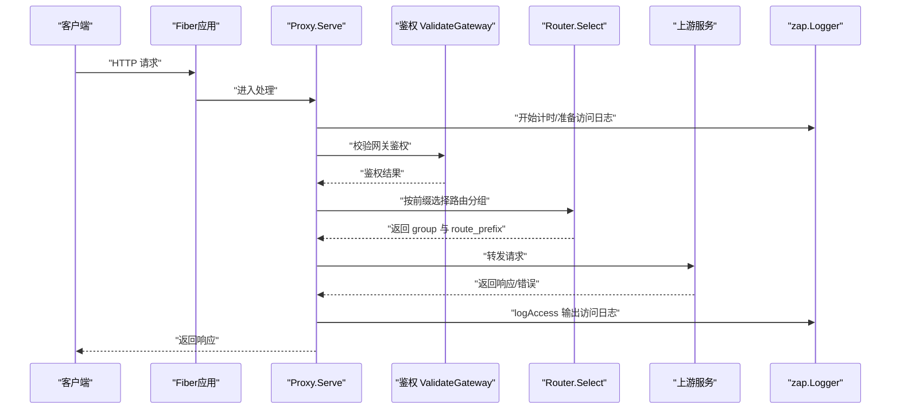
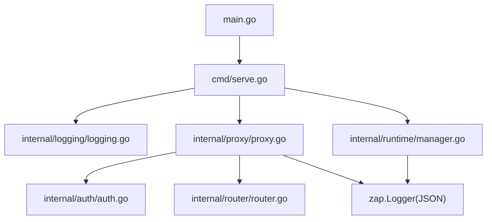
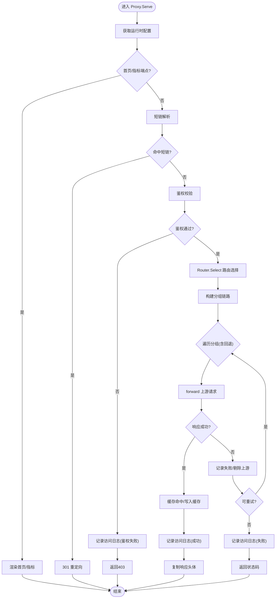

# 结构化日志

<cite>
**本文引用的文件**
- [main.go](file://main.go)
- [cmd/serve.go](file://cmd/serve.go)
- [internal/logging/logging.go](file://internal/logging/logging.go)
- [internal/proxy/proxy.go](file://internal/proxy/proxy.go)
- [internal/router/router.go](file://internal/router/router.go)
- [internal/auth/auth.go](file://internal/auth/auth.go)
- [internal/runtime/manager.go](file://internal/runtime/manager.go)
- [README.md](file://README.md)
</cite>

## 目录
1. [简介](#简介)
2. [项目结构](#项目结构)
3. [核心组件](#核心组件)
4. [架构总览](#架构总览)
5. [详细组件分析](#详细组件分析)
6. [依赖关系分析](#依赖关系分析)
7. [性能考量](#性能考量)
8. [故障排查指南](#故障排查指南)
9. [结论](#结论)
10. [附录](#附录)

## 简介
本文件围绕基于 uber/zap 的结构化日志系统展开，聚焦 JSON 格式日志输出与请求生命周期中的关键事件记录。文档将系统性说明：
- 请求生命周期的关键节点：进入网关、鉴权、路由选择、上游转发、响应返回、错误信息
- 日志字段语义与含义：level、ts、msg、method、path、group、route_prefix、status、duration_ms、retries、fallback_chain、err_type、err
- zap.Logger 的配置方式：日志级别、输出目标（stdout）、编码格式（json）
- 日志中间件与统一日志实例的使用：在 proxy、auth、router、runtime 等模块中保持上下文一致
- 日志采集与分析建议：与 ELK/Loki 栈集成思路
- 通过代码路径定位实现细节，帮助读者快速定位问题并优化日志策略

## 项目结构
本项目采用分层与功能模块化组织，日志相关能力集中在以下位置：
- 入口与服务启动：main.go 调用命令入口；cmd/serve.go 初始化 zap.Logger 并注入到各模块
- 日志初始化：internal/logging/logging.go 提供生产环境 zap.Logger 构造
- 请求处理链路：internal/proxy/proxy.go 在请求生命周期中记录 access 日志，并在失败时记录重试、回退、被动剔除等事件
- 鉴权与路由：internal/auth/auth.go 执行鉴权；internal/router/router.go 执行路由选择
- 运行时与热重载：internal/runtime/manager.go 记录配置重载事件
- 文档与示例：README.md 提供 JSON 日志字段建议与使用说明

图表来源
- [main.go](file://main.go#L1-L22)
- [cmd/serve.go](file://cmd/serve.go#L1-L66)
- [internal/logging/logging.go](file://internal/logging/logging.go#L1-L8)
- [internal/proxy/proxy.go](file://internal/proxy/proxy.go#L1-L419)
- [internal/auth/auth.go](file://internal/auth/auth.go#L1-L58)
- [internal/router/router.go](file://internal/router/router.go#L1-L80)
- [internal/runtime/manager.go](file://internal/runtime/manager.go#L1-L173)

章节来源
- [main.go](file://main.go#L1-L22)
- [cmd/serve.go](file://cmd/serve.go#L1-L66)

## 核心组件
- zap.Logger 初始化：通过 internal/logging/logging.go 的 NewLogger 返回生产环境配置的 zap.Logger，使用 JSON 编码输出至 stdout
- 请求处理与访问日志：internal/proxy/proxy.go 的 logAccess 方法在每次请求结束时输出 JSON 访问日志，包含方法、路径、分组、前缀、状态、耗时、重试次数、回退链路、错误类型与错误详情
- 鉴权日志：在鉴权失败时，Proxy.Serve 主流程会调用 logAccess 输出带错误类型的访问日志
- 被动剔除日志：当上游被剔除时，Proxy.recordFailure 会向 zap.Logger 写入告警日志，包含分组与上游标签
- 配置重载日志：internal/runtime/manager.go 在重载成功或失败时输出 JSON 事件日志
- 路由选择：internal/router/router.go 的 Router.Select 基于最长前缀匹配与优先级选择路由分组，为访问日志提供 group 与 route_prefix 字段

章节来源
- [internal/logging/logging.go](file://internal/logging/logging.go#L1-L8)
- [internal/proxy/proxy.go](file://internal/proxy/proxy.go#L394-L418)
- [internal/auth/auth.go](file://internal/auth/auth.go#L1-L58)
- [internal/router/router.go](file://internal/router/router.go#L1-L80)
- [internal/runtime/manager.go](file://internal/runtime/manager.go#L128-L135)

## 架构总览
下图展示请求从进入网关到返回客户端的完整生命周期，以及日志记录点位。

图表来源
- [internal/proxy/proxy.go](file://internal/proxy/proxy.go#L42-L183)
- [internal/auth/auth.go](file://internal/auth/auth.go#L11-L28)
- [internal/router/router.go](file://internal/router/router.go#L29-L56)
- [internal/proxy/proxy.go](file://internal/proxy/proxy.go#L394-L418)

## 详细组件分析

### zap.Logger 配置与初始化
- 初始化方式：在命令入口处创建 zap.Logger，使用生产环境配置，输出为 JSON 格式至 stdout
- 生命周期：服务启动后创建，关闭前同步日志缓冲
- 使用范围：贯穿服务运行期，作为全局日志实例注入到 Proxy、Runtime 等模块

章节来源
- [cmd/serve.go](file://cmd/serve.go#L21-L30)
- [internal/logging/logging.go](file://internal/logging/logging.go#L1-L8)

### 访问日志字段与语义
- 字段清单与含义（以 JSON 形式呈现）：
  - ts：事件时间戳（当前写入时间）
  - msg：消息键，固定为“access”
  - method：HTTP 方法
  - path：原始请求路径
  - group：路由分组名称
  - route_prefix：匹配到的路由前缀
  - status：最终响应状态码
  - duration_ms：请求总耗时（毫秒）
  - retries：重试次数
  - fallback_chain：回退链路（多个分组顺序）
  - err_type：错误类型（如 timeout、connect）
  - err：错误对象（字符串化）

- 记录时机：
  - 成功：在上游返回成功后记录一次
  - 失败：在上游返回失败且不可重试时记录一次
  - 超时/连接失败：根据错误类型映射为标准 HTTP 状态码并记录
  - 被动剔除：上游被剔除时记录告警日志

章节来源
- [internal/proxy/proxy.go](file://internal/proxy/proxy.go#L394-L418)
- [internal/proxy/proxy.go](file://internal/proxy/proxy.go#L146-L171)
- [internal/proxy/proxy.go](file://internal/proxy/proxy.go#L174-L182)
- [internal/proxy/proxy.go](file://internal/proxy/proxy.go#L294-L297)

### 请求生命周期中的关键事件日志
- 请求进入：Proxy.Serve 开始计时并准备日志字段
- 鉴权结果：鉴权失败时立即记录访问日志，包含 err_type 与 err
- 路由选择：Router.Select 返回 group 与 route_prefix，用于后续日志
- 上游转发：forward 发起上游请求，根据错误类型分类并决定是否重试
- 响应返回：成功时记录一次访问日志；失败但可重试则继续尝试
- 错误信息：根据错误类型映射为标准 HTTP 状态码，记录 err_type 与 err

章节来源
- [internal/proxy/proxy.go](file://internal/proxy/proxy.go#L42-L183)
- [internal/auth/auth.go](file://internal/auth/auth.go#L11-L28)
- [internal/router/router.go](file://internal/router/router.go#L29-L56)
- [internal/proxy/proxy.go](file://internal/proxy/proxy.go#L191-L228)

### 日志中间件与统一日志实例
- 中间件形态：Proxy.Serve 作为 Fiber 中间件，负责在请求生命周期内记录访问日志
- 统一日志实例：zap.Logger 由命令入口创建并注入到 Proxy、Runtime 等模块，保证日志上下文一致
- 模块协同：
  - Proxy：记录访问日志、重试、回退、失败与上游剔除事件
  - Runtime：记录配置重载事件（成功/失败）
  - Router：提供 group 与 route_prefix，支撑访问日志
  - Auth：提供鉴权结果，影响访问日志的 err_type 与 err

章节来源
- [cmd/serve.go](file://cmd/serve.go#L31-L40)
- [internal/proxy/proxy.go](file://internal/proxy/proxy.go#L32-L40)
- [internal/runtime/manager.go](file://internal/runtime/manager.go#L128-L135)

### 日志字段含义详解
- level：zap 日志级别（Info/Warn/Error 等），在生产环境默认 Info
- ts：事件发生的时间戳（当前写入时间）
- msg：消息键，固定为“access”，便于日志系统识别
- method：HTTP 方法（GET/POST/等）
- path：原始请求路径
- group：路由分组名称（如 rsshub-public）
- route_prefix：匹配到的路由前缀（如 /rsshub/）
- status：最终响应状态码
- duration_ms：请求总耗时（毫秒）
- retries：重试次数（含首次）
- fallback_chain：回退链路（多个分组顺序，如从主分组到备用分组）
- err_type：错误类型（timeout/connect/空）
- err：错误对象（字符串化）

章节来源
- [internal/proxy/proxy.go](file://internal/proxy/proxy.go#L394-L418)
- [README.md](file://README.md#L336-L358)

### 日志采集与分析建议
- 输出目标：zap.Logger 默认输出到 stdout，容器化部署时可由容器运行时收集
- 编码格式：JSON，便于结构化解析与字段提取
- 采集方案：
  - ELK：通过 Filebeat/Fluent Bit 收集 stdout，解析 JSON 字段，建立索引与仪表盘
  - Loki：通过 Promtail 收集 stdout，利用 JSON 字段作为标签，结合 Grafana 可视化
- 建议字段：按 README.md 的建议字段进行标准化，便于跨模块对齐

章节来源
- [internal/logging/logging.go](file://internal/logging/logging.go#L1-L8)
- [README.md](file://README.md#L336-L358)

## 依赖关系分析
- 入口依赖：main.go 依赖 cmd.Execute 启动服务
- 服务启动依赖：cmd/serve.go 依赖 logging.NewLogger 创建 zap.Logger，并注入到 Proxy、Runtime
- Proxy 依赖：auth.ValidateGateway、router.Router、runtime.Runtime、zap.Logger
- Runtime 依赖：config.Load、metrics.Metrics、zap.Logger
- 日志依赖：zap.Logger 由 logging.NewLogger 提供，统一编码为 JSON

图表来源
- [main.go](file://main.go#L1-L22)
- [cmd/serve.go](file://cmd/serve.go#L1-L66)
- [internal/logging/logging.go](file://internal/logging/logging.go#L1-L8)
- [internal/proxy/proxy.go](file://internal/proxy/proxy.go#L1-L419)
- [internal/auth/auth.go](file://internal/auth/auth.go#L1-L58)
- [internal/router/router.go](file://internal/router/router.go#L1-L80)
- [internal/runtime/manager.go](file://internal/runtime/manager.go#L1-L173)

章节来源
- [main.go](file://main.go#L1-L22)
- [cmd/serve.go](file://cmd/serve.go#L1-L66)

## 性能考量
- 日志开销：zap 在生产环境默认异步写入，JSON 编码成本较低；建议避免在高频路径中构造大量临时字段
- 计时精度：duration_ms 以毫秒为单位，避免过细粒度导致日志膨胀
- 错误分类：err_type 仅区分 timeout/connect，减少复杂分支判断
- 重试与回退：retries 与 fallback_chain 有助于定位失败路径，但需控制日志量

## 故障排查指南
- 鉴权失败：查看访问日志中的 err_type 与 err，确认 key 或 code 是否正确
- 路由不匹配：检查 route_prefix 与 group，确认 allow/deny 规则与最长前缀匹配逻辑
- 上游超时/连接失败：关注 err_type 为 timeout/connect，结合 retries 与 fallback_chain 分析
- 上游被剔除：查看 Warn 日志中的 group 与 upstream，确认被动剔除阈值与持续时间
- 配置重载：查看配置重载事件日志，确认重载结果（success/fail）

章节来源
- [internal/proxy/proxy.go](file://internal/proxy/proxy.go#L73-L77)
- [internal/proxy/proxy.go](file://internal/proxy/proxy.go#L146-L171)
- [internal/proxy/proxy.go](file://internal/proxy/proxy.go#L294-L297)
- [internal/runtime/manager.go](file://internal/runtime/manager.go#L128-L135)

## 结论
本项目通过 zap 在生产环境提供 JSON 格式的结构化日志，覆盖请求生命周期的关键事件。通过统一的日志实例与清晰的字段定义，能够快速定位鉴权、路由、上游转发、重试与回退等问题。配合 ELK/Loki 等日志栈，可实现高效的采集、检索与可视化分析。

## 附录

### 请求处理流程图（算法实现）

图表来源
- [internal/proxy/proxy.go](file://internal/proxy/proxy.go#L42-L183)
- [internal/auth/auth.go](file://internal/auth/auth.go#L11-L28)
- [internal/router/router.go](file://internal/router/router.go#L29-L56)