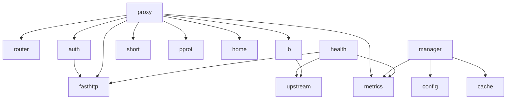

# 开发者指南

<cite>
**本文档引用的文件**  
- [main.go](file://main.go)
- [cmd/root.go](file://cmd/root.go)
- [cmd/serve.go](file://cmd/serve.go)
- [internal/auth/auth.go](file://internal/auth/auth.go)
- [internal/router/router.go](file://internal/router/router.go)
- [internal/lb/wrr.go](file://internal/lb/wrr.go)
- [internal/lb/hash.go](file://internal/lb/hash.go)
- [internal/proxy/proxy.go](file://internal/proxy/proxy.go)
- [internal/runtime/manager.go](file://internal/runtime/manager.go)
- [internal/config/config.go](file://internal/config/config.go)
- [internal/health/health.go](file://internal/health/health.go)
- [internal/metrics/metrics.go](file://internal/metrics/metrics.go)
- [internal/short/short.go](file://internal/short/short.go)
- [internal/logging/logging.go](file://internal/logging/logging.go)
- [Makefile](file://Makefile)
- [openspec/project.md](file://openspec/project.md)
- [openspec/changes/](file://openspec/changes/)
- [config.example.yaml](file://config.example.yaml)
</cite>

## 目录
1. [项目结构](#项目结构)
2. [核心包职责与依赖关系](#核心包职责与依赖关系)
3. [测试策略与覆盖率](#测试策略与覆盖率)
4. [本地开发环境与自动化任务](#本地开发环境与自动化任务)
5. [贡献流程与变更提案](#贡献流程与变更提案)

## 项目结构

本项目采用Go模块化布局，遵循清晰的职责划分原则。主要目录结构如下：

```
.
├── cmd/                  # 命令行入口
├── internal/             # 核心业务逻辑
│   ├── auth/             # 认证逻辑
│   ├── config/           # 配置加载与验证
│   ├── health/           # 健康检查
│   ├── lb/               # 负载均衡
│   ├── logging/          # 日志
│   ├── metrics/          # 指标暴露
│   ├── pprof/            # 性能分析
│   ├── proxy/            # 代理核心
│   ├── router/           # 路由选择
│   ├── runtime/          # 运行时管理
│   ├── short/            # 短链接重定向
│   └── upstream/         # 上游状态管理
├── openspec/             # 开发规范与变更提案
├── Makefile              # 构建与自动化
└── main.go               # 程序入口
```

程序入口为`main.go`，通过`cmd`包组织命令行接口，核心逻辑封装在`internal`目录下，确保外部不可见，符合Go最佳实践。

**Section sources**
- [main.go](file://main.go#L1-L22)
- [cmd/root.go](file://cmd/root.go)

## 核心包职责与依赖关系

### 包职责划分

`internal`目录下的各包具有明确的单一职责：

- **auth**: 处理网关认证（`key`或`code`）及上游代码注入
- **config**: 加载并验证YAML配置文件
- **health**: 对上游实例执行主动健康检查
- **lb**: 实现加权轮询（WRR）和哈希（Hash）负载均衡策略
- **logging**: 初始化JSON格式日志记录器
- **metrics**: 暴露Prometheus指标
- **pprof**: 提供性能分析端点
- **proxy**: 核心代理逻辑，协调路由、认证、负载均衡和转发
- **router**: 根据路径前缀选择路由组
- **runtime**: 管理运行时配置快照和热重载
- **short**: 处理短链接重定向
- **upstream**: 管理上游实例的状态（健康、被动驱逐）

### 依赖关系图



**Diagram sources**
- [internal/proxy/proxy.go](file://internal/proxy/proxy.go#L24-L38)
- [internal/runtime/manager.go](file://internal/runtime/manager.go#L14-L26)
- [internal/health/health.go](file://internal/health/health.go#L16-L42)
- [internal/lb/wrr.go](file://internal/lb/wrr.go#L10-L21)

**Section sources**
- [internal/auth/auth.go](file://internal/auth/auth.go#L1-L58)
- [internal/router/router.go](file://internal/router/router.go#L1-L80)
- [internal/lb/wrr.go](file://internal/lb/wrr.go#L1-L51)
- [internal/proxy/proxy.go](file://internal/proxy/proxy.go#L24-L419)
- [internal/runtime/manager.go](file://internal/runtime/manager.go#L14-L173)
- [internal/config/config.go](file://internal/config/config.go#L1-L476)

## 测试策略与覆盖率

项目采用分层测试策略，确保核心逻辑的可靠性。

### 单元测试

单元测试覆盖关键算法和逻辑分支：

- **路由**: 测试最长前缀匹配、优先级、允许/拒绝规则
- **认证**: 验证`key`和`code`认证逻辑
- **负载均衡**: 验证WRR分布均匀性、哈希稳定性
- **被动驱逐**: 测试失败计数和驱逐逻辑
- **配置**: 验证配置加载、默认值填充和校验规则

测试文件命名遵循`*_test.go`模式，与源文件同目录。

### 集成测试

使用`httptest`和模拟组件进行集成测试，验证跨组件交互：

- **代码注入**: 验证网关`key`移除和上游`code`注入
- **健康检查**: 模拟健康状态变化并验证指标更新
- **重试与故障转移**: 验证GET/HEAD请求的重试和故障转移链
- **热重载**: 验证SIGHUP信号触发配置重载和运行时快照切换

### 运行测试与覆盖率

使用`Makefile`中的目标运行测试：

```bash
# 运行所有测试
make test

# 运行测试并生成覆盖率报告
make cover
```

`make cover`命令会生成`coverage.out`文件，并以函数级别显示覆盖率。开发者应确保新增代码有相应的测试覆盖，并保持整体覆盖率稳定。

**Section sources**
- [internal/router/router_test.go](file://internal/router/router.go)
- [internal/auth/auth_test.go](file://internal/auth/auth.go)
- [internal/lb/wrr_test.go](file://internal/lb/wrr.go)
- [internal/proxy/proxy_test.go](file://internal/proxy/proxy.go)
- [internal/health/health_test.go](file://internal/health/health.go)
- [Makefile](file://Makefile#L30-L42)

## 本地开发环境与自动化任务

### 环境搭建

1. 安装Go 1.22+
2. 克隆仓库
3. 安装依赖：`make bootstrap`

### 自动化任务

`Makefile`提供了完整的开发自动化流程：

| 目标 | 描述 |
|------|------|
| `build` | 构建二进制文件 |
| `run` | 运行应用（使用示例配置） |
| `test` | 运行所有测试 |
| `cover` | 运行测试并显示覆盖率 |
| `fmt` | 格式化Go代码 |
| `lint` | 执行代码检查 |
| `clean` | 清理构建产物 |

**示例：本地运行**
```bash
make build
./rsshub-gateway serve -c config.example.yaml
```

**示例：代码检查**
```bash
make fmt
make lint
```

**Section sources**
- [Makefile](file://Makefile#L1-L58)
- [cmd/serve.go](file://cmd/serve.go)

## 贡献流程与变更提案

### 开发规范

参考`openspec/project.md`中的约定：

- **代码风格**: 遵循标准Go风格，使用`gofmt`
- **架构模式**: 采用模块化布局，`internal`包内小而专注的包
- **日志**: 使用JSON结构化日志，包含关键字段如`ts`, `level`, `req_id`, `method`, `path`, `status`
- **测试**: 必须通过`go test ./...`和`go test -race ./...`

### 变更提案流程

项目使用`openspec/changes/`目录管理变更提案（RFC）：

1. 在`openspec/changes/`下创建新目录，命名如`add-feature-name/`
2. 在目录内创建：
   - `specs/`: 详细技术规范
   - `proposal.md`: 变更概述和设计决策
   - `tasks.md`: 实现任务清单
3. 提交PR，讨论并完善提案
4. 根据批准的提案进行开发

此流程确保重大变更经过充分设计和评审，维护项目长期健康。

**Section sources**
- [openspec/project.md](file://openspec/project.md#L1-L60)
- [openspec/changes/](file://openspec/changes/)