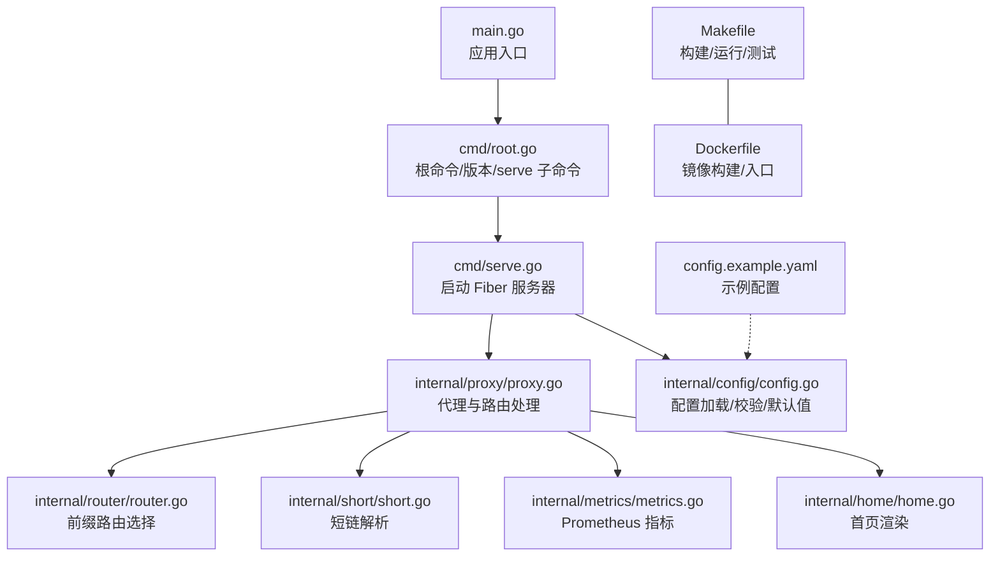
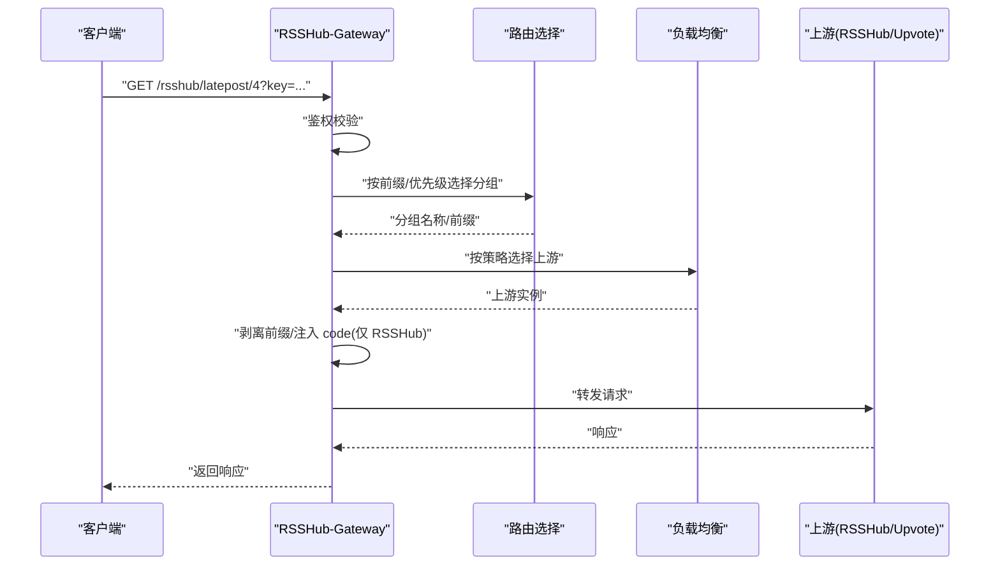
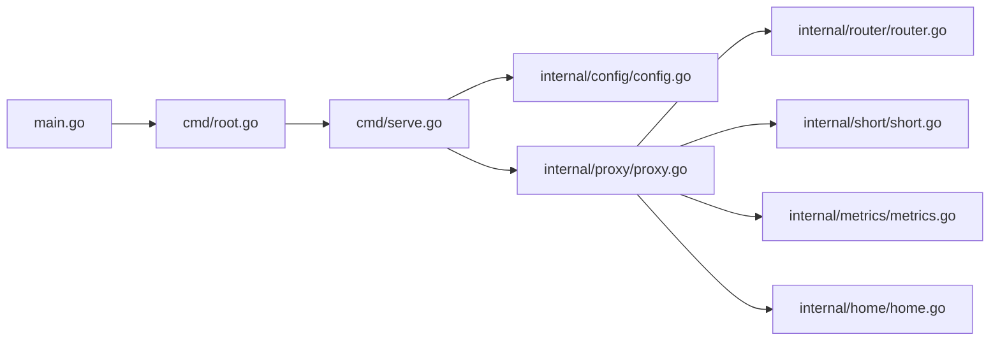

# 快速开始

<cite>
**本文引用的文件**
- [README.md](file://README.md)
- [README_zh.md](file://README_zh.md)
- [Makefile](file://Makefile)
- [Dockerfile](file://Dockerfile)
- [config.example.yaml](file://config.example.yaml)
- [main.go](file://main.go)
- [cmd/root.go](file://cmd/root.go)
- [cmd/serve.go](file://cmd/serve.go)
- [internal/config/config.go](file://internal/config/config.go)
- [internal/router/router.go](file://internal/router/router.go)
- [internal/short/short.go](file://internal/short/short.go)
- [internal/proxy/proxy.go](file://internal/proxy/proxy.go)
- [internal/metrics/metrics.go](file://internal/metrics/metrics.go)
- [internal/home/home.go](file://internal/home/home.go)
</cite>

## 更新摘要
**已做更改**
- 在“Docker 部署”部分新增“Docker Compose 部署”子章节
- 添加了包含健康检查、卷挂载和重启策略的 Docker Compose 示例
- 更新了“最小化可运行示例”步骤以包含 Docker Compose 部署方式
- 新增了 Docker Compose 最佳实践说明

## 目录
1. [简介](#简介)
2. [项目结构](#项目结构)
3. [核心组件](#核心组件)
4. [架构总览](#架构总览)
5. [详细组件分析](#详细组件分析)
6. [依赖关系分析](#依赖关系分析)
7. [性能注意事项](#性能注意事项)
8. [故障排查指南](#故障排查指南)
9. [结论](#结论)
10. [附录](#附录)

## 简介
本指南面向新手用户，帮助你在本地或容器环境中快速部署并运行 RSSHub-Gateway。你将学会：
- 通过源码构建（使用 Makefile）与 Docker 镜像两种方式启动服务
- 正确配置 config.example.yaml 的关键项
- 启动服务后访问首页与短链功能，并进行基础验证（如 /metrics）

目标是在约 10 分钟内看到第一个 HTTP 响应。

## 项目结构
仓库采用模块化组织，命令入口位于 cmd，核心业务逻辑分布在 internal 下的子包，顶层提供构建与运行脚本。



图表来源
- [main.go](file://main.go#L1-L22)
- [cmd/root.go](file://cmd/root.go#L1-L30)
- [cmd/serve.go](file://cmd/serve.go#L1-L66)
- [internal/proxy/proxy.go](file://internal/proxy/proxy.go#L1-L350)
- [internal/router/router.go](file://internal/router/router.go#L1-L80)
- [internal/short/short.go](file://internal/short/short.go#L1-L75)
- [internal/metrics/metrics.go](file://internal/metrics/metrics.go#L1-L87)
- [internal/home/home.go](file://internal/home/home.go#L1-L270)
- [internal/config/config.go](file://internal/config/config.go#L1-L476)
- [Makefile](file://Makefile#L1-L58)
- [Dockerfile](file://Dockerfile#L1-L22)
- [config.example.yaml](file://config.example.yaml#L1-L212)

章节来源
- [Makefile](file://Makefile#L1-L58)
- [Dockerfile](file://Dockerfile#L1-L22)
- [README.md](file://README.md#L78-L109)

## 核心组件
- 应用入口与命令
  - main.go 调用 cmd.Execute(version, buildTime, gitCommit)，启动根命令
  - cmd/root.go 定义根命令与子命令（version、serve）
  - cmd/serve.go 实现 serve 子命令：初始化日志、加载配置、创建 Fiber 应用、注册代理处理器、监听信号（SIGHUP 热重载、SIGINT/SIGTERM 优雅退出）
- 配置系统
  - internal/config/config.go 提供 Config 结构体及加载/默认值/规范化/校验逻辑
  - config.example.yaml 提供完整示例与注释
- 代理与路由
  - internal/proxy/proxy.go 实现请求进入后的鉴权、短链、路由选择、上游挑选、转发、重试、回退、指标与日志
  - internal/router/router.go 基于 allow/deny 前缀、优先级与顺序选择最佳分组
  - internal/short/short.go 解析短链路径并拼接查询参数
- 指标与首页
  - internal/metrics/metrics.go 注册 Prometheus 指标并通过 Fiber 中间件暴露
  - internal/home/home.go 渲染 README 内容为 HTML 页面，支持中英文切换

章节来源
- [main.go](file://main.go#L1-L22)
- [cmd/root.go](file://cmd/root.go#L1-L30)
- [cmd/serve.go](file://cmd/serve.go#L1-L66)
- [internal/config/config.go](file://internal/config/config.go#L1-L476)
- [config.example.yaml](file://config.example.yaml#L1-L212)
- [internal/proxy/proxy.go](file://internal/proxy/proxy.go#L1-L350)
- [internal/router/router.go](file://internal/router/router.go#L1-L80)
- [internal/short/short.go](file://internal/short/short.go#L1-L75)
- [internal/metrics/metrics.go](file://internal/metrics/metrics.go#L1-L87)
- [internal/home/home.go](file://internal/home/home.go#L1-L270)

## 架构总览
下图展示从客户端到上游的典型请求路径，以及短链、指标与首页的特殊处理。



图表来源
- [internal/proxy/proxy.go](file://internal/proxy/proxy.go#L41-L157)
- [internal/router/router.go](file://internal/router/router.go#L29-L56)

章节来源
- [README.md](file://README.md#L38-L77)

## 详细组件分析

### 本地构建与运行（Makefile）
- 构建二进制
  - 执行 make build，生成可执行文件
- 运行服务
  - 执行 make run，直接使用示例配置启动
- 其他常用目标
  - make bootstrap：下载依赖
  - make test/cover：运行测试与覆盖率
  - make fmt/lint：格式化与静态检查
  - make release-test：模拟发布打包

章节来源
- [Makefile](file://Makefile#L14-L58)
- [README.md](file://README.md#L82-L89)

### Docker 部署

#### Docker Compose 部署
对于生产环境或需要持久化配置的场景，推荐使用 Docker Compose 部署。以下是一个包含最佳实践的示例：

```yaml
services:
  rsshub-gateway:
    image: ghcr.io/nerdneilsfield/rsshub-gateway:latest
    restart: unless-stopped
    ports:
      - "8080:8080"
    volumes:
      - ./config.yaml:/app/config.yaml:ro
    command: ["/app/rsshub-gateway", "serve", "-c", "/app/config.yaml"]
    healthcheck:
      test: ["CMD", "curl", "-f", "http://localhost:8080/"]
      interval: 30s
      timeout: 5s
      retries: 3
```

**最佳实践说明：**
- **重启策略**：`restart: unless-stopped` 确保容器在意外退出时自动重启，但允许手动停止
- **卷挂载**：将本地配置文件挂载到容器内，实现配置持久化和热更新
- **健康检查**：通过 curl 检查服务主页，确保服务正常运行
- **只读挂载**：使用 `:ro` 标志确保配置文件在容器内为只读，提高安全性

章节来源
- [README.md](file://README.md#L120-L137)
- [README_zh.md](file://README_zh.md#L124-L141)

#### 基础 Docker 部署
- 构建镜像
  - docker build -t rsshub-gateway:latest .
- 直接运行
  - docker run --rm -p 8080:8080 rsshub-gateway:latest
- 使用自定义配置
  - 将 config.example.yaml 映射到容器内并指定 serve -c /app/config.yaml

章节来源
- [Dockerfile](file://Dockerfile#L1-L22)
- [README.md](file://README.md#L90-L109)

### 配置文件 config.example.yaml 关键项说明
以下为初始设置建议，满足“最小可运行”目标：
- server.listen
  - 监听地址，默认 ":8080"
- server.timeout_ms
  - 请求超时（毫秒），默认 8000
- gateway_auth.enabled
  - 启用网关鉴权
- gateway_auth.access_key
  - 全局访问密钥（用于 key/code 鉴权）
- gateway_auth.accept_key / accept_code
  - 启用 ?key= 或 ?code= 鉴权方式
- metrics.enabled / metrics.path / metrics.accesskey
  - 启用 Prometheus 指标、指标路径、访问密钥
- short.enabled / short.path / short.entries
  - 启用短链、短链前缀、条目（name 与 target 唯一且合法）
- routing.default_group
  - 默认路由分组名，需与 groups 中某一项一致
- groups[].name/backend/allow/deny/priority/lb.policy/strip_prefix
  - 分组名、后端类型（rsshub/upvote）、允许/拒绝前缀、优先级、负载均衡策略、转发前缀剥离
- groups[].health.active.*
  - 主动健康检查路径、间隔、超时、重试
- groups[].upstreams[].url/weight/access_key
  - 上游地址、权重、RSSHub 后端必填 access_key
- failover.retry.enabled/max_retries
  - GET/HEAD 的重试策略
- failover.passive_eject.enabled/*
  - 被动剔除阈值与时长

章节来源
- [config.example.yaml](file://config.example.yaml#L1-L212)
- [internal/config/config.go](file://internal/config/config.go#L162-L246)
- [internal/config/config.go](file://internal/config/config.go#L248-L320)
- [internal/config/config.go](file://internal/config/config.go#L321-L464)

### 最小化可运行示例（10 分钟清单）
- 步骤 1：拉取代码并构建
  - make build
- 步骤 2：准备配置
  - 复制 config.example.yaml 为 config.yaml
  - 至少设置以下关键项：
    - server.listen、server.timeout_ms
    - gateway_auth.enabled、gateway_auth.access_key、gateway_auth.accept_key、gateway_auth.accept_code
    - metrics.enabled、metrics.path、metrics.accesskey
    - routing.default_group
    - groups[] 至少包含一个分组，含 allow/deny/priority/lb.policy/strip_prefix
    - groups[].upstreams[] 至少一个，含 url/weight/access_key（RSSHub 后端）
- 步骤 3：启动服务
  - ./rsshub-gateway serve -c config.yaml
  - 或使用 Docker：docker run --rm -p 8080:8080 rsshub-gateway:latest
  - 或使用 Docker Compose：将配置文件保存为 config.yaml，创建 docker-compose.yml 并执行 docker-compose up
- 步骤 4：验证服务
  - 访问首页：浏览器打开 http://127.0.0.1:8080/
  - 访问指标：http://127.0.0.1:8080/metrics?accesskey=你的指标密钥
  - 访问短链（如启用）：http://127.0.0.1:8080/short/latepost?key=你的网关密钥
- 步骤 5：优雅退出与热重载
  - Ctrl+C 优雅退出
  - 向进程发送 SIGHUP 触发热重载配置

章节来源
- [README.md](file://README.md#L82-L109)
- [cmd/serve.go](file://cmd/serve.go#L18-L66)
- [internal/proxy/proxy.go](file://internal/proxy/proxy.go#L41-L157)
- [internal/metrics/metrics.go](file://internal/metrics/metrics.go#L77-L87)
- [internal/short/short.go](file://internal/short/short.go#L19-L35)

### 关键流程图：代理与路由选择


图表来源
- [internal/proxy/proxy.go](file://internal/proxy/proxy.go#L41-L157)
- [internal/router/router.go](file://internal/router/router.go#L29-L56)
- [internal/short/short.go](file://internal/short/short.go#L19-L35)
- [internal/metrics/metrics.go](file://internal/metrics/metrics.go#L77-L87)
- [internal/home/home.go](file://internal/home/home.go#L116-L125)

## 依赖关系分析
- 命令层
  - main.go 依赖 cmd/root.go
  - cmd/root.go 依赖 cmd/serve.go
- 服务层
  - cmd/serve.go 依赖 internal/config/config.go、internal/proxy/proxy.go、internal/metrics/metrics.go、internal/logging/logging.go
  - internal/proxy/proxy.go 依赖 internal/router/router.go、internal/short/short.go、internal/metrics/metrics.go、internal/home/home.go、internal/upstream/state.go
- 配置层
  - internal/config/config.go 加载并校验 config.example.yaml



图表来源
- [main.go](file://main.go#L1-L22)
- [cmd/root.go](file://cmd/root.go#L1-L30)
- [cmd/serve.go](file://cmd/serve.go#L1-L66)
- [internal/config/config.go](file://internal/config/config.go#L1-L476)
- [internal/proxy/proxy.go](file://internal/proxy/proxy.go#L1-L350)
- [internal/router/router.go](file://internal/router/router.go#L1-L80)
- [internal/short/short.go](file://internal/short/short.go#L1-L75)
- [internal/metrics/metrics.go](file://internal/metrics/metrics.go#L1-L87)
- [internal/home/home.go](file://internal/home/home.go#L1-L270)

章节来源
- [Makefile](file://Makefile#L14-L24)
- [Dockerfile](file://Dockerfile#L1-L22)

## 性能注意事项
- 超时与重试
  - server.timeout_ms 控制上游请求超时
  - failover.retry.enabled 与 max_retries 控制 GET/HEAD 的重试次数
- 负载均衡
  - groups[].lb.policy 支持 wrr/hash，合理设置权重与回退分组
- 健康检查
  - groups[].health.active.* 控制主动健康检查频率与超时
- 指标与日志
  - 启用 metrics 与 pprof 时注意 accesskey 保护
  - 日志为 JSON，便于采集与分析

[本节为通用建议，不涉及具体文件分析]

## 故障排查指南
- 无法启动
  - 检查配置文件路径与权限：serve -c 指向的 config.yaml 是否存在
  - 查看日志输出（控制台），确认错误信息
- 403 鉴权失败
  - 确认 gateway_auth.access_key 已设置
  - 使用 ?key= 或 ?code=（后者需按规则计算）
- 502/504 网关错误
  - 检查上游地址可达性与 access_key
  - 调整 server.timeout_ms 与 failover.retry
- 指标不可见
  - 确认 metrics.enabled 与 metrics.accesskey 已配置
  - 通过 /metrics?accesskey=... 访问
- 短链 404
  - 确认 short.enabled、short.path、short.entries.name 唯一且 target 合法
- 热重载
  - 向进程发送 SIGHUP 触发配置重载，失败会回滚

章节来源
- [cmd/serve.go](file://cmd/serve.go#L18-L66)
- [internal/config/config.go](file://internal/config/config.go#L321-L464)
- [internal/proxy/proxy.go](file://internal/proxy/proxy.go#L41-L157)
- [internal/metrics/metrics.go](file://internal/metrics/metrics.go#L77-L87)
- [README.md](file://README.md#L284-L317)

## 结论
通过本指南，你可以在本地或容器中快速完成 RSSHub-Gateway 的部署与运行。建议先以示例配置启动，逐步完善分组、上游与鉴权策略，并结合 /metrics 与日志进行观测与优化。

[本节为总结性内容，不涉及具体文件分析]

## 附录

### 常用命令速查
- 构建：make build
- 运行：make run 或 ./rsshub-gateway serve -c config.yaml
- Docker：docker build/run
- 测试：make test / make cover
- 格式化/检查：make fmt / make lint

章节来源
- [Makefile](file://Makefile#L14-L58)
- [README.md](file://README.md#L346-L357)