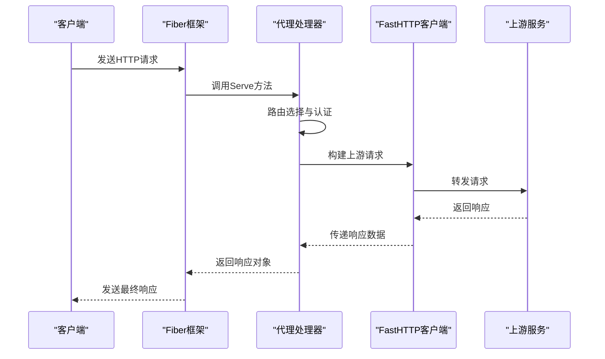
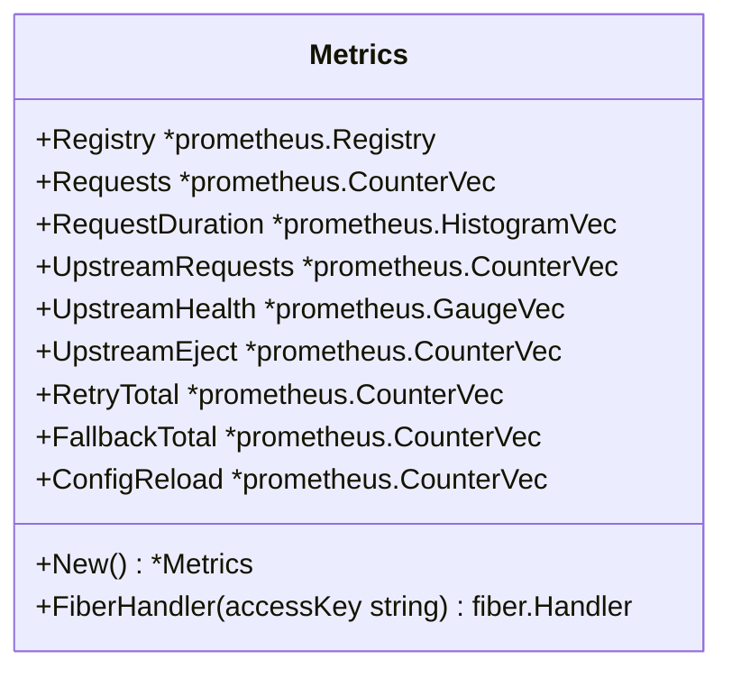

# 技术栈与依赖

<cite>
**本文档中引用的文件**  
- [go.mod](file://go.mod)
- [main.go](file://main.go)
- [cmd/root.go](file://cmd/root.go)
- [cmd/serve.go](file://cmd/serve.go)
- [internal/proxy/proxy.go](file://internal/proxy/proxy.go)
- [internal/router/router.go](file://internal/router/router.go)
- [internal/runtime/manager.go](file://internal/runtime/manager.go)
- [internal/runtime/runtime.go](file://internal/runtime/runtime.go)
- [internal/config/config.go](file://internal/config/config.go)
- [internal/metrics/metrics.go](file://internal/metrics/metrics.go)
- [internal/logging/logging.go](file://internal/logging/logging.go)
- [internal/lb/hash.go](file://internal/lb/hash.go)
- [internal/lb/wrr.go](file://internal/lb/wrr.go)
- [internal/auth/auth.go](file://internal/auth/auth.go)
- [internal/pprof/pprof.go](file://internal/pprof/pprof.go)
- [internal/short/short.go](file://internal/short/short.go)
- [internal/upstream/state.go](file://internal/upstream/state.go)
- [internal/health/health.go](file://internal/health/health.go)
</cite>

## 目录
1. [引言](#引言)
2. [Go语言选型分析](#go语言选型分析)
3. [核心框架解析](#核心框架解析)
4. [关键外部依赖](#关键外部依赖)
5. [依赖管理策略](#依赖管理策略)
6. [系统性能边界与扩展潜力](#系统性能边界与扩展潜力)
7. [结论](#结论)

## 引言
RSSHub-Gateway是一个高性能的网关服务，旨在为RSSHub提供路由、负载均衡、认证和可观测性等核心功能。本技术栈文档详细阐述了项目所依赖的技术选型，重点分析了Go语言在高性能网关场景下的优势，深入介绍了核心框架gofiber/fiber/v2和valyala/fasthttp的作用机制，并逐一说明了关键外部依赖的用途和集成方式。通过分析go.mod文件中的版本信息，本文还强调了项目的依赖管理策略和版本兼容性考虑，为开发者提供了全面的技术背景知识。

**Section sources**
- [go.mod](file://go.mod#L1-L36)
- [main.go](file://main.go#L1-L22)

## Go语言选型分析
Go语言被选为RSSHub-Gateway的开发语言，主要基于其在构建高性能、高并发网络服务方面的卓越表现。Go的静态编译特性使得最终生成的二进制文件不依赖外部运行时环境，极大地简化了部署流程。其内置的goroutine和channel机制提供了轻量级的并发模型，能够高效地处理大量并发连接，这对于一个需要同时处理众多客户端请求的网关服务至关重要。

Go语言的性能优势在网关场景下尤为突出。与基于虚拟机的语言（如Java）相比，Go程序的启动速度极快，内存占用更低。与动态语言（如Python）相比，Go的编译型特性确保了运行时的高性能和可预测性。此外，Go标准库提供了强大且高效的网络编程支持，使得开发者能够快速构建稳定可靠的网络服务。

**Section sources**
- [go.mod](file://go.mod#L3)
- [main.go](file://main.go#L1-L22)

## 核心框架解析

### gofiber/fiber/v2 框架
gofiber/fiber/v2是RSSHub-Gateway的核心Web框架，它构建在valyala/fasthttp之上，提供了类似Express.js的简洁API，同时继承了底层库的高性能特性。在项目中，Fiber负责处理HTTP请求的生命周期，包括路由匹配、中间件执行和响应生成。

在`cmd/serve.go`文件中，可以看到Fiber应用的初始化过程。`fiber.New()`创建了一个新的应用实例，而`app.All("/*", proxyHandler.Serve)`则将所有路径的请求都交由代理处理器处理，实现了统一的入口点。Fiber的中间件机制被用于集成各种功能，如日志记录、认证和指标收集。

**Diagram sources**
- [cmd/serve.go](file://cmd/serve.go#L37-L39)
- [internal/proxy/proxy.go](file://internal/proxy/proxy.go#L41-L157)

**Section sources**
- [cmd/serve.go](file://cmd/serve.go#L9-L66)
- [internal/proxy/proxy.go](file://internal/proxy/proxy.go#L11-L21)

### valyala/fasthttp 库
valyala/fasthttp是RSSHub-Gateway实现高性能代理转发的关键。与标准库`net/http`相比，fasthttp通过避免内存分配和重用数据结构来显著提升性能。它不遵循HTTP/1.x规范的某些部分以换取速度，例如它不解析请求体，而是将原始字节传递给用户，这在代理场景下非常高效。

在`internal/proxy/proxy.go`的`forward`方法中，fasthttp被用于向后端服务发起请求。`fasthttp.AcquireRequest()`和`fasthttp.AcquireResponse()`从对象池中获取请求和响应对象，避免了频繁的内存分配。`p.client.DoTimeout()`方法执行带有超时的HTTP请求，确保了服务的稳定性。fasthttp的客户端配置了读写超时，防止了因后端服务无响应而导致的资源耗尽。

**Section sources**
- [internal/proxy/proxy.go](file://internal/proxy/proxy.go#L19-L21)
- [internal/proxy/proxy.go#L165-L204](file://internal/proxy/proxy.go#L165-L204)

## 关键外部依赖

### spf13/cobra
spf13/cobra是一个用于创建强大CLI应用程序的Go库。在RSSHub-Gateway中，它被用于构建命令行接口，支持`serve`和`version`等子命令。`cmd/root.go`文件定义了根命令，而`cmd/serve.go`则实现了启动服务器的逻辑。Cobra提供了清晰的命令结构和参数解析功能，使得用户可以通过命令行轻松地启动和配置网关服务。

**Section sources**
- [cmd/root.go](file://cmd/root.go#L6-L30)
- [cmd/serve.go](file://cmd/serve.go#L14-L66)

### prometheus/client_golang
prometheus/client_golang库为RSSHub-Gateway提供了全面的可观测性支持。在`internal/metrics/metrics.go`中，定义了多个Prometheus指标，包括请求总数、请求延迟、上游请求、上游健康状态等。这些指标通过`/metrics`端点暴露，可以被Prometheus服务器抓取，用于监控网关的运行状态和性能。

`Metrics`结构体封装了所有指标的定义和注册逻辑。`FiberHandler`方法返回一个Fiber中间件，用于处理对指标端点的访问请求，并在访问时进行认证检查。这些指标对于分析系统瓶颈、评估负载均衡效果和进行故障排查至关重要。

**Diagram sources**
- [internal/metrics/metrics.go](file://internal/metrics/metrics.go#L12-L87)

**Section sources**
- [internal/metrics/metrics.go](file://internal/metrics/metrics.go#L8-L21)
- [internal/proxy/proxy.go#L25](file://internal/proxy/proxy.go#L25)

### go.uber.org/zap
go.uber.org/zap是一个高性能的日志库，被用于RSSHub-Gateway的日志记录。在`internal/logging/logging.go`中，`NewLogger()`函数创建了一个生产级别的Zap日志记录器。Zap以其极低的内存分配和高吞吐量著称，非常适合在高性能服务中使用。

日志记录器被注入到`Proxy`、`Manager`等核心组件中，用于记录访问日志、错误信息和系统事件。`logAccess`方法在`internal/proxy/proxy.go`中被调用，记录了每个请求的详细信息，包括时间戳、方法、路径、状态码、处理时长和重试次数等，为系统监控和问题排查提供了宝贵的数据。

**Section sources**
- [internal/logging/logging.go](file://internal/logging/logging.go#L5-L8)
- [internal/proxy/proxy.go#L26](file://internal/proxy/proxy.go#L26)
- [internal/proxy/proxy.go#L325-L349](file://internal/proxy/proxy.go#L325-L349)

### 其他关键依赖
- **gopkg.in/yaml.v3**: 用于解析`config.yaml`配置文件，将YAML格式的配置数据反序列化为Go结构体。
- **github.com/gomarkdown/markdown**: 用于渲染README文件，为网关提供友好的首页展示。
- **github.com/andybalholm/brotli**: 用于Brotli压缩，可能在未来的版本中用于响应压缩以减少带宽消耗。

**Section sources**
- [internal/config/config.go](file://internal/config/config.go#L9-L10)
- [internal/home/home.go](file://internal/home/home.go#L1-L1)
- [go.mod](file://go.mod#L7)
- [go.mod](file://go.mod#L16)

## 依赖管理策略
RSSHub-Gateway使用Go Modules进行依赖管理，这在`go.mod`文件中得到了体现。该文件明确列出了项目直接依赖的所有模块及其版本号，确保了构建的可重复性和一致性。

项目采用了语义化版本控制（Semantic Versioning），所有依赖都指定了精确的版本号（如`v2.52.2`），这有助于避免因依赖库的意外更新而导致的兼容性问题。同时，`go.sum`文件记录了每个依赖模块的校验和，保证了依赖包的完整性和安全性。

依赖的版本选择体现了对稳定性和性能的平衡。例如，gofiber/fiber/v2选择了v2.52.2版本，这是一个经过充分测试的稳定版本。同样，prometheus/client_golang选择了v1.19.0版本，确保了与Prometheus生态的兼容性。间接依赖（indirect）由Go Modules自动管理，开发者无需手动维护。

**Section sources**
- [go.mod](file://go.mod#L1-L36)
- [go.sum](file://go.sum#L1-L100)

## 系统性能边界与扩展潜力

### 性能边界
RSSHub-Gateway的性能边界主要由以下几个因素决定：
1.  **网络I/O**: 作为代理服务，其性能很大程度上受限于与上游服务的网络延迟和带宽。
2.  **CPU计算**: 路由匹配、负载均衡决策和日志记录等操作会消耗CPU资源。
3.  **内存使用**: 高并发连接和缓存机制会占用内存。

通过使用fasthttp和Fiber，项目在I/O处理上达到了很高的效率。`ServerConfig.TimeoutMS`配置项（默认8000ms）定义了请求的超时时间，防止了长时间挂起的连接耗尽资源。`CacheConfig`允许配置内存或Redis缓存，可以显著减轻上游服务的负载。

### 扩展潜力
RSSHub-Gateway的设计具有良好的扩展潜力：
- **水平扩展**: 服务本身是无状态的（除了本地缓存），可以轻松地通过部署多个实例并配合外部负载均衡器来实现水平扩展。
- **功能扩展**: 模块化的设计（如`internal/lb`、`internal/auth`）使得添加新的负载均衡策略或认证方式变得容易。
- **配置热更新**: `Manager.Reload()`方法支持配置文件的热重载，无需重启服务即可更新路由、上游服务等配置。
- **可观测性扩展**: Prometheus指标的丰富性为集成更高级的监控和告警系统（如Grafana）提供了基础。

**Section sources**
- [internal/config/config.go](file://internal/config/config.go#L25-L28)
- [internal/cache](file://internal/cache)
- [internal/runtime/manager.go](file://internal/runtime/manager.go#L77-L84)

## 结论
RSSHub-Gateway的技术栈选择体现了对高性能、高可靠性和易维护性的追求。Go语言作为基础，提供了卓越的并发性能和简单的部署模型。gofiber/fiber/v2和valyala/fasthttp的组合在易用性和性能之间取得了完美的平衡，使得网关能够高效地处理代理转发任务。关键的外部依赖如Cobra、Prometheus和Zap，分别解决了命令行交互、系统监控和日志记录等核心问题。严格的依赖管理策略确保了项目的稳定性和可预测性。总体而言，这一技术栈为构建一个健壮、可扩展的高性能网关服务奠定了坚实的基础。