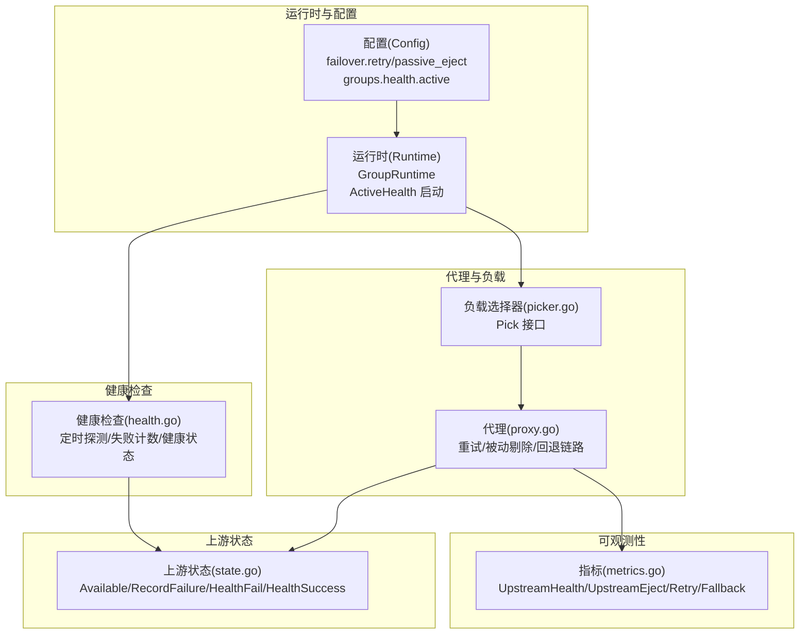
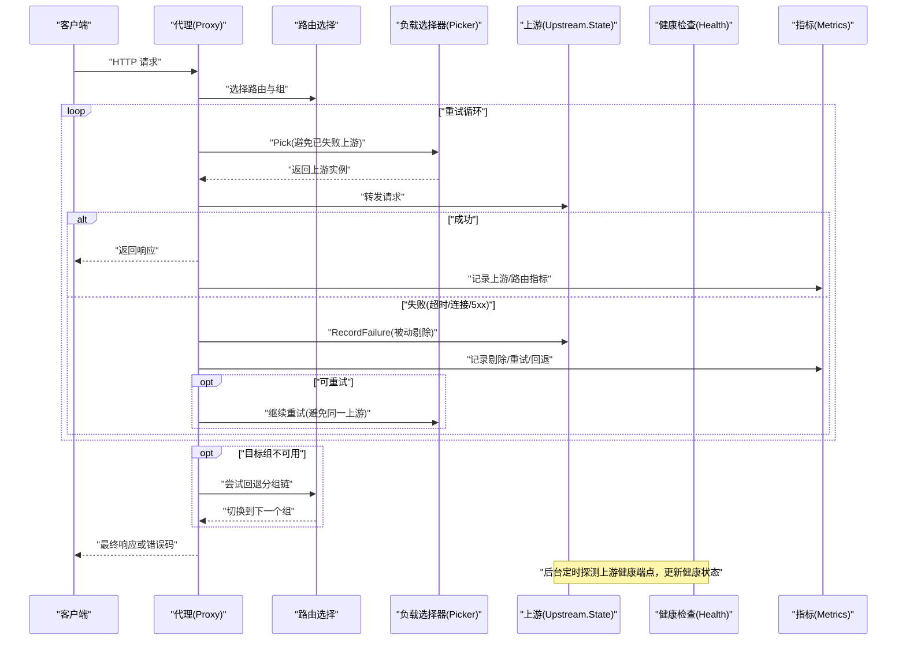
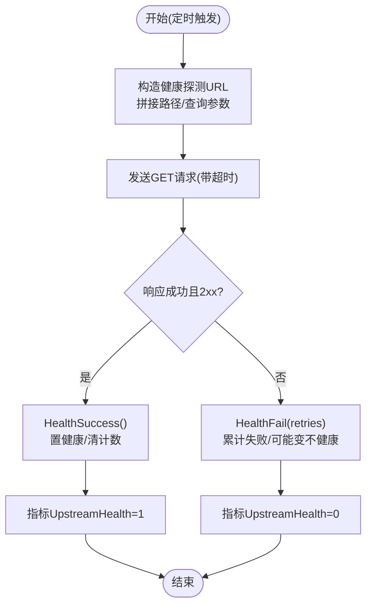
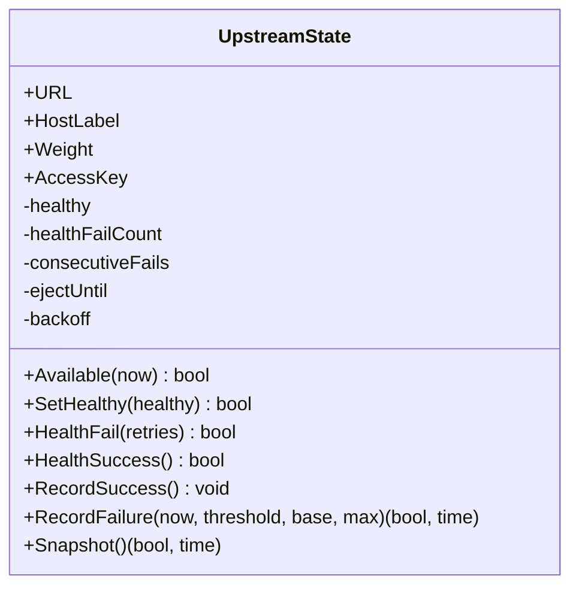
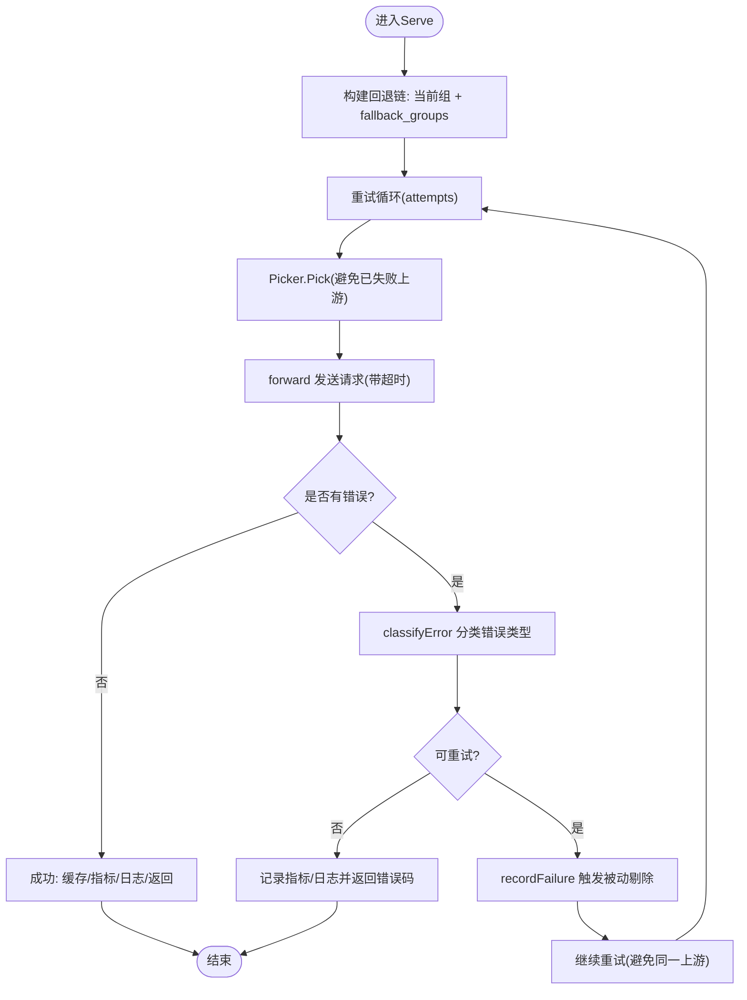
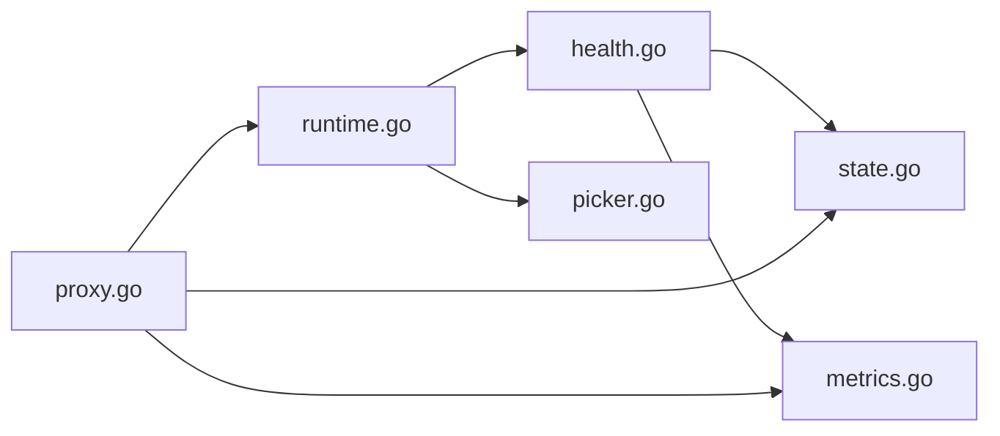

# 健康检查与故障转移

<cite>
**本文引用的文件**
- [internal/health/health.go](file://internal/health/health.go)
- [internal/upstream/state.go](file://internal/upstream/state.go)
- [internal/proxy/proxy.go](file://internal/proxy/proxy.go)
- [internal/config/config.go](file://internal/config/config.go)
- [internal/runtime/runtime.go](file://internal/runtime/runtime.go)
- [internal/lb/picker.go](file://internal/lb/picker.go)
- [internal/metrics/metrics.go](file://internal/metrics/metrics.go)
- [openspec/changes/add-v0-1-basic-routing-lb/specs/gateway-availability/spec.md](file://openspec/changes/add-v0-1-basic-routing-lb/specs/gateway-availability/spec.md)
</cite>

## 目录
1. [引言](#引言)
2. [项目结构](#项目结构)
3. [核心组件](#核心组件)
4. [架构总览](#架构总览)
5. [详细组件分析](#详细组件分析)
6. [依赖关系分析](#依赖关系分析)
7. [性能考量](#性能考量)
8. [故障排查指南](#故障排查指南)
9. [结论](#结论)
10. [附录：配置参数与调优建议](#附录配置参数与调优建议)

## 引言
本文件围绕“健康检查与高可用机制”展开，系统阐述主动健康检查（Active Health Check）与被动剔除（Passive Eject）的设计与实现，解释 health.go 如何通过定时探测上游实例的健康端点维护其状态，state.go 中 UpstreamState 结构体如何记录健康度与故障计数；并说明 proxy.go 在请求失败时如何触发被动剔除，结合重试（retry）机制与回退分组（fallback_groups）实现故障转移。最后讨论主动与被动机制的协同作用，如何在保证服务可用性的同时避免雪崩效应，并给出配置参数调优建议。

## 项目结构
本节聚焦与健康检查、故障转移直接相关的模块：
- health 模块：负责按配置周期性探测上游健康端点，更新上游健康状态。
- upstream 模块：维护每个上游实例的状态（健康、剔除时间、连续失败次数等），并提供可用性判断与剔除逻辑。
- proxy 模块：处理请求转发，包含重试与被动剔除触发、回退分组链路选择。
- config/runtime/lb/metrics 模块：提供配置项、运行时构建、负载选择器接口、指标采集等支撑能力。

图表来源
- [internal/config/config.go](file://internal/config/config.go#L93-L140)
- [internal/runtime/runtime.go](file://internal/runtime/runtime.go#L44-L90)
- [internal/health/health.go](file://internal/health/health.go#L15-L42)
- [internal/upstream/state.go](file://internal/upstream/state.go#L34-L108)
- [internal/proxy/proxy.go](file://internal/proxy/proxy.go#L126-L183)
- [internal/lb/picker.go](file://internal/lb/picker.go#L9-L11)
- [internal/metrics/metrics.go](file://internal/metrics/metrics.go#L12-L29)

章节来源
- [internal/config/config.go](file://internal/config/config.go#L93-L140)
- [internal/runtime/runtime.go](file://internal/runtime/runtime.go#L44-L90)

## 核心组件
- 主动健康检查（Active Health Check）
  - 定时器以配置的间隔探测上游健康端点，默认路径为 /healthz，支持超时与重试次数。
  - 成功探测将上游标记为健康，失败则累计失败次数，达到阈值后标记为不健康。
  - 通过指标上报上游健康状态，便于观测与告警。
- 被动剔除（Passive Eject）
  - 在代理层根据错误类型与状态码判定是否触发剔除。
  - 连续失败次数达到阈值后，进入指数退避的剔除期，剔除截止时间由当前时间加上退避时长决定。
  - 可观测性指标记录每次剔除事件。
- 重试与回退分组（Retry + Fallback Groups）
  - 对 GET/HEAD 请求启用最大重试次数，重试期间避免再次选择已失败的上游。
  - 当目标组无可用上游或失败达到阈值时，按顺序尝试回退分组链路，实现故障转移。

章节来源
- [internal/health/health.go](file://internal/health/health.go#L15-L78)
- [internal/upstream/state.go](file://internal/upstream/state.go#L34-L108)
- [internal/proxy/proxy.go](file://internal/proxy/proxy.go#L126-L183)
- [internal/metrics/metrics.go](file://internal/metrics/metrics.go#L72-L88)

## 架构总览
下图展示从请求进入网关到上游探测、状态更新与故障转移的整体流程。

图表来源
- [internal/proxy/proxy.go](file://internal/proxy/proxy.go#L126-L183)
- [internal/lb/picker.go](file://internal/lb/picker.go#L9-L11)
- [internal/upstream/state.go](file://internal/upstream/state.go#L84-L108)
- [internal/health/health.go](file://internal/health/health.go#L15-L78)
- [internal/metrics/metrics.go](file://internal/metrics/metrics.go#L72-L88)

## 详细组件分析

### 主动健康检查（health.go）
- 启动流程
  - 依据组配置中的 ActiveHealthConfig 启动定时任务，使用配置的间隔、超时与重试次数。
  - 默认健康端点为 /healthz，若上游配置了 access_key，则在探测 URL 上附加查询参数 key。
- 探测逻辑
  - 使用带超时的 HTTP 客户端发起 GET 请求。
  - 若错误或状态码不在 2xx 范围，调用 HealthFail 累计失败并可能变为不健康；否则调用 HealthSuccess 将上游标记为健康。
  - 通过指标 UpstreamHealth 上报健康状态，日志输出健康状态变更事件。
- 错误识别
  - 提供 IsTimeout 判断网络超时错误，用于区分超时与连接错误。

图表来源
- [internal/health/health.go](file://internal/health/health.go#L45-L78)
- [internal/upstream/state.go](file://internal/upstream/state.go#L54-L76)

章节来源
- [internal/health/health.go](file://internal/health/health.go#L15-L78)
- [internal/upstream/state.go](file://internal/upstream/state.go#L54-L76)

### 上游状态管理（state.go）
- 关键字段
  - healthy：上游健康状态
  - healthFailCount：健康探测失败计数
  - consecutiveFails：连续失败计数（用于被动剔除）
  - ejectUntil：剔除截止时间
  - backoff：指数退避时长
- 可用性判断
  - Available(now) 返回 true 的条件：上游处于健康且当前时间已超过 ejectUntil。
- 健康状态变更
  - HealthFail(retries)：累计失败次数达到 retries 即标记为不健康。
  - HealthSuccess()：将健康置为 true 并清零失败计数。
- 被动剔除
  - RecordFailure(now, failThreshold, baseEject, maxEject)：连续失败达到阈值后，计算指数退避并设置 ejectUntil，返回是否被剔除及截止时间。
  - RecordSuccess()：成功时清零连续失败计数。

图表来源
- [internal/upstream/state.go](file://internal/upstream/state.go#L8-L21)
- [internal/upstream/state.go](file://internal/upstream/state.go#L34-L108)

章节来源
- [internal/upstream/state.go](file://internal/upstream/state.go#L34-L108)

### 代理层重试与被动剔除（proxy.go）
- 请求处理主流程
  - 解析路由与组，构建回退链（当前组 + fallback_groups）。
  - 对 GET/HEAD 启用最大重试次数，重试期间避免再次选择同一上游。
  - 发送请求，统计上游指标与路由指标，缓存命中时直接返回。
- 失败处理与被动剔除
  - classifyError 将超时与连接错误分类为可重试类型。
  - 对于 5xx 或可重试错误，记录失败并触发被动剔除：调用 RecordFailure 计算退避并设置 ejectUntil。
  - 记录 UpstreamEject 指标与日志。
- 回退分组
  - 当目标组不可用或多次失败后，按顺序尝试 fallback_groups 链路，实现故障转移。
- 错误映射
  - 将错误类型映射为 HTTP 状态码：timeout -> 504，其他 -> 502。

图表来源
- [internal/proxy/proxy.go](file://internal/proxy/proxy.go#L126-L183)
- [internal/proxy/proxy.go](file://internal/proxy/proxy.go#L276-L298)
- [internal/proxy/proxy.go](file://internal/proxy/proxy.go#L300-L302)
- [internal/proxy/proxy.go](file://internal/proxy/proxy.go#L359-L364)

章节来源
- [internal/proxy/proxy.go](file://internal/proxy/proxy.go#L126-L183)
- [internal/proxy/proxy.go](file://internal/proxy/proxy.go#L276-L298)
- [internal/proxy/proxy.go](file://internal/proxy/proxy.go#L300-L302)
- [internal/proxy/proxy.go](file://internal/proxy/proxy.go#L359-L364)

### 运行时与启动（runtime.go）
- 运行时构建
  - 为每个组创建上游状态数组，并初始化健康指标为 1。
  - 根据组配置决定是否启动主动健康检查。
- 可用上游统计
  - AvailableUpstreams 统计当前可用的上游数量，用于观测与决策。

章节来源
- [internal/runtime/runtime.go](file://internal/runtime/runtime.go#L50-L127)
- [internal/runtime/runtime.go](file://internal/runtime/runtime.go#L141-L155)

### 负载选择器接口（picker.go）
- Picker 接口定义 Pick 方法，支持传入避免集合，确保重试与剔除场景下不会重复选择同一上游。

章节来源
- [internal/lb/picker.go](file://internal/lb/picker.go#L9-L11)

### 指标与可观测性（metrics.go）
- 关键指标
  - UpstreamHealth：上游健康状态（1 健康，0 不健康）
  - UpstreamEject：上游剔除次数
  - RetryTotal：重试总次数
  - FallbackTotal：回退总次数
- 代理层在关键路径上记录这些指标，便于监控与告警。

章节来源
- [internal/metrics/metrics.go](file://internal/metrics/metrics.go#L12-L29)
- [internal/proxy/proxy.go](file://internal/proxy/proxy.go#L251-L298)

## 依赖关系分析
- 组件耦合
  - health 与 upstream：健康检查直接修改上游状态（healthy、healthFailCount），并通过指标与日志反馈。
  - proxy 与 upstream：代理层在失败时调用 RecordFailure 实现被动剔除，同时通过 Picker 的避免集合避免重复失败。
  - proxy 与 runtime：回退链由 runtime.GroupRuntime 的 FallbackGroups 决定。
  - proxy 与 metrics：在多个关键节点记录指标。
- 外部依赖
  - fasthttp 用于高性能 HTTP 请求与超时控制。
  - Prometheus 客户端用于指标暴露。

图表来源
- [internal/health/health.go](file://internal/health/health.go#L15-L78)
- [internal/upstream/state.go](file://internal/upstream/state.go#L34-L108)
- [internal/proxy/proxy.go](file://internal/proxy/proxy.go#L126-L183)
- [internal/runtime/runtime.go](file://internal/runtime/runtime.go#L44-L90)
- [internal/lb/picker.go](file://internal/lb/picker.go#L9-L11)
- [internal/metrics/metrics.go](file://internal/metrics/metrics.go#L72-L88)

## 性能考量
- 主动健康检查
  - 合理设置 interval 与 timeout，避免对上游造成过大压力；retries 过小可能导致误判，过大可能延迟恢复。
  - 健康端点应轻量，避免成为瓶颈。
- 被动剔除
  - fail_threshold 过低会频繁剔除，过高会延迟故障隔离；base_eject 与 max_eject 控制退避上限，防止雪崩。
- 重试与回退
  - max_retries 与方法限制（仅 GET/HEAD）有助于降低瞬时压力；避免在失败后重复选择同一上游。
  - fallback_groups 应按稳定性排序，优先选择更可靠的上游。
- 指标与日志
  - 合理采样与聚合，避免指标风暴；日志级别与字段控制在生产环境尤为重要。

## 故障排查指南
- 健康检查未生效
  - 检查组配置中 health.active.enabled 是否开启，以及 interval/timeout/retries 是否有效。
  - 确认健康端点可达且返回 2xx；如需 access_key，请确认已正确注入。
- 上游频繁被剔除
  - 检查 fail_threshold 与 base_eject/max_eject 设置是否过严；观察 UpstreamEject 指标与日志。
- 重试无效或雪崩
  - 检查 retry.enabled 与 max_retries；确认仅对 GET/HEAD 生效。
  - 查看 fallback_groups 配置与可用性，避免回退到同样不稳定的上游。
- 指标异常
  - 检查 UpstreamHealth 是否持续为 0；核对健康端点与 access_key。
  - 关注 RetryTotal 与 FallbackTotal，定位重试与回退频率。

章节来源
- [internal/health/health.go](file://internal/health/health.go#L15-L78)
- [internal/proxy/proxy.go](file://internal/proxy/proxy.go#L126-L183)
- [internal/metrics/metrics.go](file://internal/metrics/metrics.go#L72-L88)

## 结论
本系统通过“主动健康检查 + 被动剔除”的双轨机制，结合重试与回退分组，实现了对上游故障的快速隔离与平滑转移。健康检查负责提前发现并隔离故障实例，被动剔除在真实流量中进一步收敛影响范围；重试与回退链路在保证可用性的前提下，避免了雪崩效应。通过合理的配置与可观测性指标，可以在生产环境中获得稳定的服务质量。

## 附录：配置参数与调优建议
- 主动健康检查（groups[].health.active）
  - enabled：是否启用
  - path：健康端点路径（默认 /healthz）
  - interval_ms：探测间隔
  - timeout_ms：探测超时
  - retries：探测失败累计阈值（达到即标记为不健康）
- 被动剔除（failover.passive_eject）
  - enabled：是否启用
  - fail_threshold：连续失败阈值
  - base_eject_ms：基础剔除时长
  - max_eject_ms：最大剔除时长（指数退避上限）
- 重试（failover.retry）
  - enabled：是否启用
  - max_retries：最大重试次数（仅 GET/HEAD 生效）
- 回退分组（groups[].fallback_groups）
  - 按稳定性排序，优先选择更可靠的上游

调优建议
- 健康检查
  - interval_ms 建议 ≥ 10s，避免过于频繁；timeout_ms 建议与上游健康端点响应时间匹配。
  - retries 建议 2–3，兼顾快速恢复与误判规避。
- 被动剔除
  - fail_threshold 建议 3–5；base_eject_ms 建议 10–30s；max_eject_ms 建议 30–120s。
- 重试与回退
  - max_retries 建议 1–2；仅对幂等 GET/HEAD 开启。
  - fallback_groups 从最稳定到最不稳定的顺序排列，减少回退次数。

章节来源
- [internal/config/config.go](file://internal/config/config.go#L93-L140)
- [internal/config/config.go](file://internal/config/config.go#L211-L245)
- [openspec/changes/add-v0-1-basic-routing-lb/specs/gateway-availability/spec.md](file://openspec/changes/add-v0-1-basic-routing-lb/specs/gateway-availability/spec.md#L1-L31)