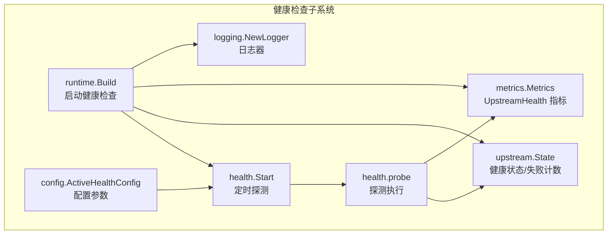
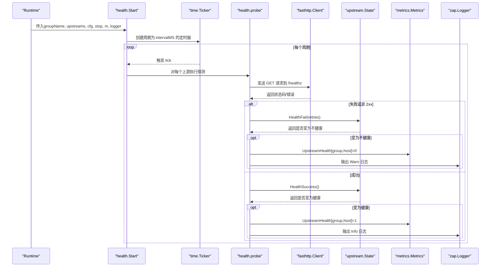
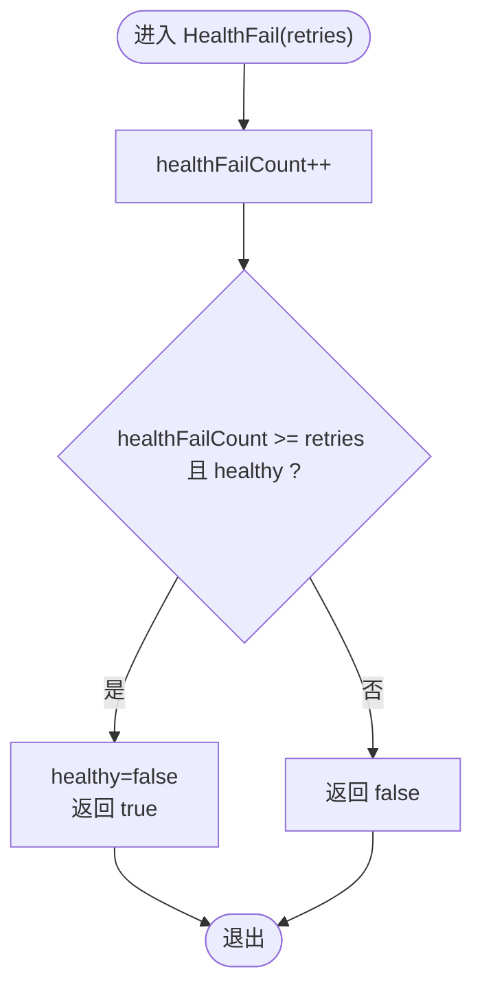
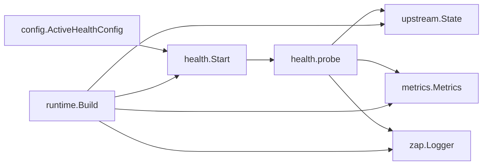
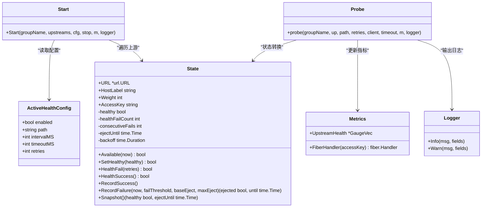

# 健康检查机制

<cite>
**本文引用的文件**
- [internal/health/health.go](file://internal/health/health.go)
- [internal/upstream/state.go](file://internal/upstream/state.go)
- [internal/metrics/metrics.go](file://internal/metrics/metrics.go)
- [internal/config/config.go](file://internal/config/config.go)
- [internal/runtime/runtime.go](file://internal/runtime/runtime.go)
- [internal/logging/logging.go](file://internal/logging/logging.go)
- [config.example.yaml](file://config.example.yaml)
- [internal/health/health_test.go](file://internal/health/health_test.go)
- [internal/upstream/state_test.go](file://internal/upstream/state_test.go)
</cite>

## 目录
1. [简介](#简介)
2. [项目结构](#项目结构)
3. [核心组件](#核心组件)
4. [架构总览](#架构总览)
5. [详细组件分析](#详细组件分析)
6. [依赖关系分析](#依赖关系分析)
7. [性能考量](#性能考量)
8. [故障排查指南](#故障排查指南)
9. [结论](#结论)
10. [附录](#附录)

## 简介
本文件围绕 RSSHub-Gateway 的“主动健康检查（Active Health Check）”机制进行深入解析，重点说明以下方面：
- Start 函数如何依据配置启动定时探测任务
- probe 函数如何使用 fasthttp 客户端对上游实例的 /healthz 端点发起探测
- 结合配置中的 retries 阈值决定健康状态变更
- upstream.State 结构体中的 healthFailCount 字段如何记录连续失败次数
- HealthFail 和 HealthSuccess 方法如何实现健康状态转换
- 配置参数 intervalMS、timeoutMS、path、retries 的作用与调优建议
- 主动健康检查与 Prometheus 指标（UpstreamHealth）和日志系统的集成方式
- 实际配置案例与故障排查方法

## 项目结构
主动健康检查涉及的关键模块如下：
- health 包：负责定时探测、构建探测 URL、错误判定与指标/日志上报
- upstream 包：维护上游实例的健康状态、失败计数与可用性判断
- metrics 包：定义并注册 UpstreamHealth 指标，供 Prometheus 抓取
- config 包：定义 ActiveHealthConfig 及其默认值与校验规则
- runtime 包：在运行时构建 GroupRuntime 并启动健康检查任务
- logging 包：提供生产级日志器
- 示例配置：提供 groups.health.active 的完整配置项参考

图表来源
- [internal/health/health.go](file://internal/health/health.go#L16-L43)
- [internal/health/health.go](file://internal/health/health.go#L45-L78)
- [internal/upstream/state.go](file://internal/upstream/state.go#L9-L21)
- [internal/metrics/metrics.go](file://internal/metrics/metrics.go#L12-L29)
- [internal/config/config.go](file://internal/config/config.go#L127-L137)
- [internal/runtime/runtime.go](file://internal/runtime/runtime.go#L120-L124)
- [internal/logging/logging.go](file://internal/logging/logging.go#L1-L8)

章节来源
- [internal/health/health.go](file://internal/health/health.go#L16-L43)
- [internal/runtime/runtime.go](file://internal/runtime/runtime.go#L120-L124)

## 核心组件
- 主动健康检查入口：Start(groupName, upstreams, cfg, stop, m, logger)
  - 基于配置的 intervalMS、timeoutMS、path 初始化 fasthttp 客户端
  - 使用 time.Ticker 按固定周期遍历所有上游实例执行探测
- 探测执行：probe(groupName, up, path, retries, client, timeout, m, logger)
  - 构建探测 URL（含 access_key 查询参数），发送 GET 请求
  - 依据返回状态码或错误判定是否标记为不健康
  - 当达到 retries 阈值时，触发状态切换并更新指标与日志
- 上游状态管理：upstream.State
  - 维护 healthy、healthFailCount、consecutiveFails、ejectUntil、backoff 等字段
  - 提供 HealthFail(retries)、HealthSuccess() 等方法实现状态转换
- 指标与日志：metrics.Metrics、logging.NewLogger
  - UpstreamHealth 为 1 表示健康，0 表示不健康
  - 健康状态变化时输出 Info/Warn 日志

章节来源
- [internal/health/health.go](file://internal/health/health.go#L16-L43)
- [internal/health/health.go](file://internal/health/health.go#L45-L78)
- [internal/upstream/state.go](file://internal/upstream/state.go#L54-L76)
- [internal/metrics/metrics.go](file://internal/metrics/metrics.go#L72-L76)
- [internal/logging/logging.go](file://internal/logging/logging.go#L1-L8)

## 架构总览
主动健康检查在运行时构建阶段被启动，每个分组独立运行一个定时任务，周期性探测该分组内所有上游实例的健康端点。

图表来源
- [internal/runtime/runtime.go](file://internal/runtime/runtime.go#L120-L124)
- [internal/health/health.go](file://internal/health/health.go#L16-L43)
- [internal/health/health.go](file://internal/health/health.go#L45-L78)
- [internal/metrics/metrics.go](file://internal/metrics/metrics.go#L72-L76)
- [internal/logging/logging.go](file://internal/logging/logging.go#L1-L8)

## 详细组件分析

### Start 函数与定时探测流程
- 参数与配置映射
  - intervalMS → 定时器周期
  - timeoutMS → 客户端读/写超时
  - path → 探测路径，默认 “/healthz”
- 客户端初始化
  - 使用 fasthttp.Client，统一设置 ReadTimeout/WriteTimeout
- 任务循环
  - 使用 time.NewTicker(interval) 产生周期事件
  - 在 stop 通道关闭前持续探测所有上游实例
  - 每个周期内依次调用 probe 执行探测

章节来源
- [internal/health/health.go](file://internal/health/health.go#L16-L43)

### probe 函数与探测逻辑
- 请求准备
  - 构造请求 URI：buildHealthURL 将 path 与查询参数拼接到上游 URL
  - 设置方法为 GET
- 超时控制
  - 使用 context.WithTimeout 控制整体探测超时
  - doWithContext 根据上下文 deadline 选择 DoDeadline 或 DoTimeout
- 失败判定与状态转换
  - 若发生错误或状态码不在 [200, 300)，认为失败
  - 调用 up.HealthFail(retries) 计算是否达到阈值并切换为不健康
  - 若变为不健康，设置 UpstreamHealth=0 并输出 Warn 日志
- 成功判定与状态恢复
  - 若成功，调用 up.HealthSuccess() 将健康状态置为真并清零失败计数
  - 设置 UpstreamHealth=1 并输出 Info 日志

章节来源
- [internal/health/health.go](file://internal/health/health.go#L45-L78)
- [internal/health/health.go](file://internal/health/health.go#L80-L86)
- [internal/health/health.go](file://internal/health/health.go#L98-L114)

### upstream.State 健康状态与计数
- 关键字段
  - healthy：当前健康状态
  - healthFailCount：连续失败计数
  - consecutiveFails：被动剔除用的连续失败计数
  - ejectUntil/backoff：被动剔除相关的封禁截止时间与指数退避
- 方法行为
  - HealthFail(retries)
    - 增加 healthFailCount
    - 当计数达到 retries 且当前健康时，标记为不健康并返回 true
  - HealthSuccess()
    - 若当前不健康，则标记为健康并返回 true
    - 清零 healthFailCount
  - SetHealthy(healthy)
    - 直接设置健康状态，若健康则清零失败计数
  - Available(now)
    - 受健康状态与被动剔除封禁时间影响

图表来源
- [internal/upstream/state.go](file://internal/upstream/state.go#L54-L65)

章节来源
- [internal/upstream/state.go](file://internal/upstream/state.go#L54-L76)
- [internal/upstream/state.go](file://internal/upstream/state.go#L9-L21)

### 探测 URL 构建与 access_key 注入
- buildHealthURL
  - 确保 path 以 “/” 开头
  - 若上游 URL 已带路径，将其尾部去除多余斜杠后拼接 path
  - 若存在 AccessKey，则追加查询参数 key=AccessKey
- 测试验证
  - 单元测试验证了在上游 URL 基础上正确拼接 /healthz 并注入 ?key=ACCESS

章节来源
- [internal/health/health.go](file://internal/health/health.go#L98-L114)
- [internal/health/health_test.go](file://internal/health/health_test.go#L10-L20)

### Prometheus 指标集成（UpstreamHealth）
- 指标定义
  - 名称：rsshub_gateway_upstream_health
  - 类型：GaugeVec，标签：group、upstream
  - 值：1 表示健康，0 表示不健康
- 更新时机
  - 不健康：HealthFail 达到阈值时设置为 0
  - 健康：HealthSuccess 时设置为 1
- 暴露方式
  - metrics.Metrics.FiberHandler 提供 /metrics 路由，支持 accesskey 访问控制

章节来源
- [internal/metrics/metrics.go](file://internal/metrics/metrics.go#L72-L76)
- [internal/metrics/metrics.go](file://internal/metrics/metrics.go#L113-L122)
- [internal/health/health.go](file://internal/health/health.go#L60-L73)

### 日志系统集成
- 日志器来源
  - logging.NewLogger 返回生产级 zap.Logger
- 日志内容
  - 健康状态变化时输出 Info/Warn 日志，包含 group、upstream、status 等关键信息

章节来源
- [internal/logging/logging.go](file://internal/logging/logging.go#L1-L8)
- [internal/health/health.go](file://internal/health/health.go#L64-L76)

### 运行时启动与生命周期
- 启动位置
  - runtime.Build 在构建运行时对象后，对每个启用 active health 的分组调用 health.Start
- 生命周期
  - stop 通道用于优雅停止定时探测
  - Runtime.Stop 关闭 stop，释放资源

章节来源
- [internal/runtime/runtime.go](file://internal/runtime/runtime.go#L120-L124)
- [internal/runtime/runtime.go](file://internal/runtime/runtime.go#L129-L139)

## 依赖关系分析
- 组件耦合
  - health.Start 依赖 config.ActiveHealthConfig、upstream.State、metrics.Metrics、zap.Logger
  - probe 依赖 fasthttp.Client、context 超时控制、upstream.State 的状态转换
  - runtime.Build 将健康检查与运行时生命周期绑定
- 外部依赖
  - fasthttp：高性能 HTTP 客户端
  - Prometheus：指标采集
  - zap：结构化日志

图表来源
- [internal/config/config.go](file://internal/config/config.go#L127-L137)
- [internal/health/health.go](file://internal/health/health.go#L16-L43)
- [internal/health/health.go](file://internal/health/health.go#L45-L78)
- [internal/upstream/state.go](file://internal/upstream/state.go#L54-L76)
- [internal/metrics/metrics.go](file://internal/metrics/metrics.go#L72-L76)
- [internal/runtime/runtime.go](file://internal/runtime/runtime.go#L120-L124)

## 性能考量
- 探测频率与开销
  - intervalMS 越小，探测越频繁，CPU 与网络开销越大；过小可能放大抖动
  - 建议：根据上游实例规模与网络状况，从几十秒起步，逐步调优
- 超时设置
  - timeoutMS 应小于 intervalMS，避免探测堆积导致周期延长
  - 建议：timeoutMS ≈ 0.6 × intervalMS，留出余量
- 并发与资源
  - 每个分组独立定时器，彼此隔离
  - fasthttp 客户端复用，减少连接开销
- 指标与日志
  - UpstreamHealth 为轻量 Gauge，抓取成本低
  - 日志按状态变化输出，避免高频噪声

## 故障排查指南
- 健康状态异常波动
  - 检查 retries 是否过小，导致轻微抖动即触发不健康
  - 建议：适当提高 retries，结合业务容忍度评估
- 探测超时或失败
  - 检查 timeoutMS 是否过短
  - 检查上游 /healthz 是否可达且返回 2xx
  - 检查网络延迟与防火墙策略
- access_key 未生效
  - 确认上游实例是否需要 key 参数
  - 检查上游 URL 的 AccessKey 配置是否正确
- 指标未更新
  - 确认 Prometheus 抓取路径与 accesskey 配置
  - 检查 /metrics 路由是否被鉴权拒绝
- 日志缺失
  - 确认日志器初始化与级别设置
  - 检查健康状态变化日志是否被过滤

章节来源
- [internal/health/health.go](file://internal/health/health.go#L57-L77)
- [internal/health/health.go](file://internal/health/health.go#L98-L114)
- [internal/metrics/metrics.go](file://internal/metrics/metrics.go#L113-L122)
- [internal/logging/logging.go](file://internal/logging/logging.go#L1-L8)

## 结论
RSSHub-Gateway 的主动健康检查通过定时探测与阈值判定，实现了对上游实例健康状态的自动化监控。其设计要点包括：
- 明确的配置参数与默认值，便于快速启用
- 基于 fasthttp 的高效探测与超时控制
- 健康状态与指标、日志的强一致联动
- 与运行时生命周期无缝集成，支持优雅停机

通过合理调优 intervalMS、timeoutMS、path、retries，可在稳定性与开销之间取得平衡，并借助 Prometheus 与日志体系实现可观测性闭环。

## 附录

### 配置参数详解与调优建议
- intervalMS
  - 作用：健康检查周期（毫秒）
  - 建议：根据上游实例数量与网络状况，从 30~60 秒起步，观察波动后再调整
- timeoutMS
  - 作用：单次探测超时（毫秒）
  - 建议：小于 intervalMS，推荐 0.6×intervalMS，避免探测堆积
- path
  - 作用：上游健康端点路径
  - 默认：/healthz
  - 建议：与上游实例实际健康端点保持一致
- retries
  - 作用：连续失败达到该阈值才标记为不健康
  - 建议：结合业务容忍度与网络抖动，通常 2~5 之间

章节来源
- [internal/config/config.go](file://internal/config/config.go#L127-L137)
- [internal/config/config.go](file://internal/config/config.go#L228-L239)
- [internal/health/health.go](file://internal/health/health.go#L16-L23)

### 实际配置案例
- groups[].health.active.enabled/path/interval_ms/timeout_ms/retries
  - 参考示例配置中的 groups[] 下 health.active 字段
- metrics.enabled/path/accesskey
  - 参考示例配置中的 metrics 字段
- 上游 access_key
  - 参考示例配置中 upstreams[].access_key 的使用

章节来源
- [config.example.yaml](file://config.example.yaml#L205-L221)
- [config.example.yaml](file://config.example.yaml#L36-L46)
- [config.example.yaml](file://config.example.yaml#L222-L233)

### 代码级关系图（类图）

图表来源
- [internal/config/config.go](file://internal/config/config.go#L127-L137)
- [internal/upstream/state.go](file://internal/upstream/state.go#L9-L21)
- [internal/upstream/state.go](file://internal/upstream/state.go#L54-L76)
- [internal/metrics/metrics.go](file://internal/metrics/metrics.go#L12-L29)
- [internal/health/health.go](file://internal/health/health.go#L16-L43)
- [internal/health/health.go](file://internal/health/health.go#L45-L78)