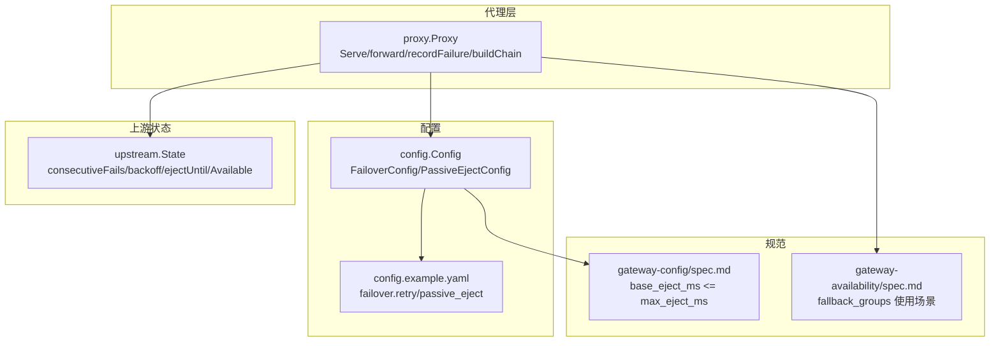
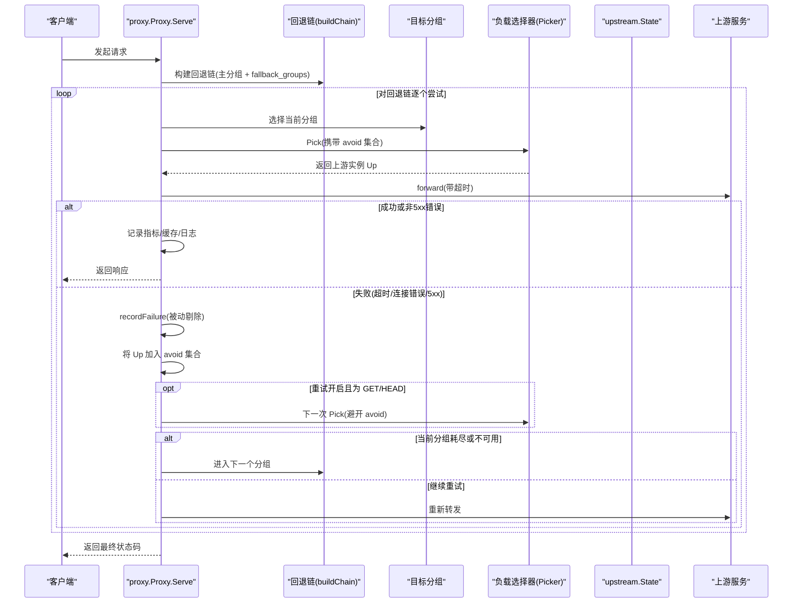
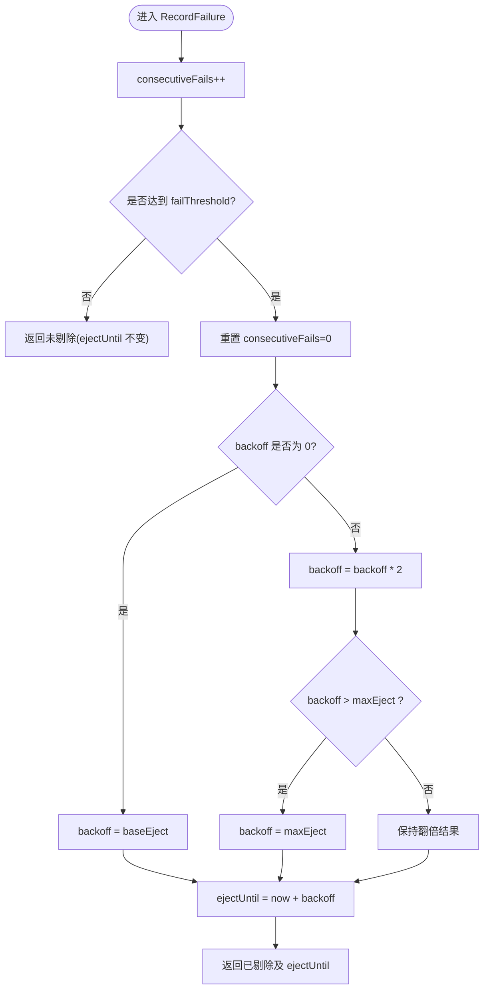
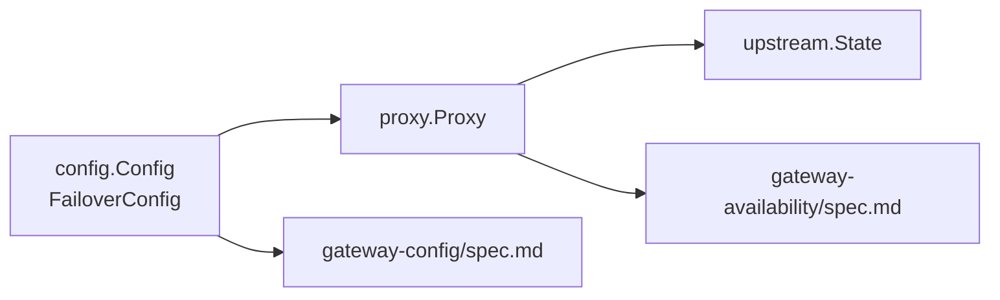

# 故障转移策略

<cite>
**本文引用的文件**
- [internal/upstream/state.go](file://internal/upstream/state.go)
- [internal/proxy/proxy.go](file://internal/proxy/proxy.go)
- [internal/config/config.go](file://internal/config/config.go)
- [config.example.yaml](file://config.example.yaml)
- [openspec/changes/add-v0-1-basic-routing-lb/specs/gateway-availability/spec.md](file://openspec/changes/add-v0-1-basic-routing-lb/specs/gateway-availability/spec.md)
- [openspec/changes/add-v0-1-basic-routing-lb/specs/gateway-config/spec.md](file://openspec/changes/add-v0-1-basic-routing-lb/specs/gateway-config/spec.md)
- [internal/upstream/state_test.go](file://internal/upstream/state_test.go)
- [internal/proxy/proxy_test.go](file://internal/proxy/proxy_test.go)
</cite>

## 目录
1. [简介](#简介)
2. [项目结构](#项目结构)
3. [核心组件](#核心组件)
4. [架构总览](#架构总览)
5. [详细组件分析](#详细组件分析)
6. [依赖关系分析](#依赖关系分析)
7. [性能考量](#性能考量)
8. [故障排查指南](#故障排查指南)
9. [结论](#结论)
10. [附录：配置示例与最佳实践](#附录配置示例与最佳实践)

## 简介
本文件系统性讲解 RSSHub Gateway 的故障转移策略，重点围绕“被动剔除（Passive Eject）”与“重试机制”的协同工作原理。文档将深入剖析 upstream.State 结构体中的 consecutiveFails、backoff 和 ejectUntil 字段如何实现指数退避的被动剔除算法；解释 proxy.go 中 recordFailure 方法如何依据 failThreshold、baseEjectMS、maxEjectMS 参数计算剔除时长；说明 proxy.go 的 recordFailure 如何在请求失败时触发被动剔除，并通过 avoid 集合在重试时避开已剔除实例；阐述 buildChain 函数如何构建回退分组链（fallback_groups），以及 for 循环如何实现跨分组的故障转移。最后提供配置示例、规避“雪崩效应”的策略与性能优化建议。

## 项目结构
与故障转移相关的关键代码分布在以下模块：
- upstream.State：上游实例状态与被动剔除逻辑
- proxy.Proxy：请求处理、重试、失败记录与回退链
- config.Config：配置模型与默认值、校验
- 示例配置：config.example.yaml 展示 failover.retry 与 failover.passive_eject 的典型用法
- 规范文档：openspec 中对回退链与剔除阈值约束的说明



图表来源
- [internal/upstream/state.go](file://internal/upstream/state.go#L9-L21)
- [internal/proxy/proxy.go](file://internal/proxy/proxy.go#L79-L173)
- [internal/config/config.go](file://internal/config/config.go#L93-L108)
- [config.example.yaml](file://config.example.yaml#L140-L167)
- [openspec/changes/add-v0-1-basic-routing-lb/specs/gateway-availability/spec.md](file://openspec/changes/add-v0-1-basic-routing-lb/specs/gateway-availability/spec.md#L43-L47)
- [openspec/changes/add-v0-1-basic-routing-lb/specs/gateway-config/spec.md](file://openspec/changes/add-v0-1-basic-routing-lb/specs/gateway-config/spec.md#L14-L18)

章节来源
- [internal/upstream/state.go](file://internal/upstream/state.go#L9-L21)
- [internal/proxy/proxy.go](file://internal/proxy/proxy.go#L79-L173)
- [internal/config/config.go](file://internal/config/config.go#L93-L108)
- [config.example.yaml](file://config.example.yaml#L140-L167)
- [openspec/changes/add-v0-1-basic-routing-lb/specs/gateway-availability/spec.md](file://openspec/changes/add-v0-1-basic-routing-lb/specs/gateway-availability/spec.md#L43-L47)
- [openspec/changes/add-v0-1-basic-routing-lb/specs/gateway-config/spec.md](file://openspec/changes/add-v0-1-basic-routing-lb/specs/gateway-config/spec.md#L14-L18)

## 核心组件
- upstream.State：封装单个上游实例的状态，包括健康标记、连续失败计数、剔除退避时长与剔除截止时间，并提供可用性判断与成功/失败记录接口。
- proxy.Proxy：负责路由选择、重试控制、失败记录、回退链构建与日志记录；在请求失败时调用 recordFailure 实现被动剔除；在重试时通过 avoid 集合避免再次命中已剔除实例。
- config.Config：定义 failover.retry 与 failover.passive_eject 的配置项及其默认值与校验规则。

章节来源
- [internal/upstream/state.go](file://internal/upstream/state.go#L9-L21)
- [internal/proxy/proxy.go](file://internal/proxy/proxy.go#L79-L173)
- [internal/config/config.go](file://internal/config/config.go#L93-L108)

## 架构总览
下图展示了从请求进入、重试尝试、失败判定、被动剔除到跨分组回退的整体流程。



图表来源
- [internal/proxy/proxy.go](file://internal/proxy/proxy.go#L103-L173)
- [internal/proxy/proxy.go](file://internal/proxy/proxy.go#L126-L163)
- [internal/proxy/proxy.go](file://internal/proxy/proxy.go#L276-L298)
- [internal/proxy/proxy.go](file://internal/proxy/proxy.go#L383-L392)

## 详细组件分析

### upstream.State：被动剔除与指数退避
- 关键字段
  - consecutiveFails：连续失败计数，每次失败递增，成功清零
  - backoff：当前剔除退避时长，初始为 baseEject，后续按 2 倍增长，不超过 maxEject
  - ejectUntil：剔除截止时间，等于当前时间加上 backoff
  - Available(now)：当实例健康且当前时间已超过 ejectUntil 时才视为可用
- RecordFailure(now, failThreshold, baseEject, maxEject)
  - 若 consecutiveFails 达不到 failThreshold，则不剔除，直接返回
  - 达到阈值后，重置 consecutiveFails 并计算 backoff：若为首次则设为 baseEject，否则翻倍但不超过 maxEject
  - 更新 ejectUntil = now + backoff，并返回被剔除与截止时间
- RecordSuccess()
  - 成功时重置 consecutiveFails，便于下次失败重新计数



图表来源
- [internal/upstream/state.go](file://internal/upstream/state.go#L84-L102)

章节来源
- [internal/upstream/state.go](file://internal/upstream/state.go#L34-L41)
- [internal/upstream/state.go](file://internal/upstream/state.go#L78-L82)
- [internal/upstream/state.go](file://internal/upstream/state.go#L84-L102)
- [internal/upstream/state_test.go](file://internal/upstream/state_test.go#L25-L51)

### proxy.Proxy：重试与被动剔除协同
- 重试控制
  - 仅对 GET/HEAD 生效，可通过 failover.retry.enabled 与 max_retries 控制尝试次数
  - 每次重试会增加 retries 计数并记录指标
- 失败判定与被动剔除
  - recordFailure 在发生超时/连接错误或 5xx 响应时触发
  - 仅当 group.PassiveEject.Enabled 为真时执行剔除
  - 将 failThreshold、baseEjectMS、maxEjectMS 转换为毫秒级 Duration 传入 upstream.State.RecordFailure
  - 剔除后记录指标与日志
- 避免重复命中已剔除实例
  - 使用 avoid map[*upstream.State]struct{} 记录已失败的实例，在 Pick 时避开它们
- 跨分组回退
  - buildChain 将主分组与 fallback_groups 按顺序拼接为回退链
  - for 循环遍历链路，一旦当前分组无可用实例或失败达到阈值，自动切换到下一个分组

```mermaid
sequenceDiagram
participant P as "Proxy.Serve"
participant G as "Group"
participant U as "upstream.State"
participant R as "recordFailure"
P->>G : 选择分组并准备重试
loop 尝试次数
P->>U : Pick(携带 avoid)
alt 成功
P-->>P : 记录指标/缓存/日志
P-->>Client : 返回
else 失败
P->>R : recordFailure(errType,status)
R->>U : RecordFailure(now,failThreshold,baseEject,maxEject)
R-->>P : 返回是否剔除
P->>P : 将 U 加入 avoid
opt 仍可重试
P->>U : 下一次 Pick(避开 avoid)
else 切换分组
P->>P : 进入下一个分组
end
end
end
```

图表来源
- [internal/proxy/proxy.go](file://internal/proxy/proxy.go#L126-L163)
- [internal/proxy/proxy.go](file://internal/proxy/proxy.go#L276-L298)
- [internal/proxy/proxy.go](file://internal/proxy/proxy.go#L383-L392)

章节来源
- [internal/proxy/proxy.go](file://internal/proxy/proxy.go#L126-L163)
- [internal/proxy/proxy.go](file://internal/proxy/proxy.go#L276-L298)
- [internal/proxy/proxy.go](file://internal/proxy/proxy.go#L383-L392)

### 配置模型与默认值
- FailoverConfig
  - RetryConfig：enabled、max_retries
  - PassiveEjectConfig：enabled、fail_threshold、base_eject_ms、max_eject_ms
- 默认值与校验
  - 若未显式配置，系统会填充默认值（例如 max_retries、fail_threshold、base_eject_ms、max_eject_ms）
  - 存在校验规则：要求 base_eject_ms ≤ max_eject_ms，否则加载失败

章节来源
- [internal/config/config.go](file://internal/config/config.go#L93-L108)
- [internal/config/config.go](file://internal/config/config.go#L212-L220)
- [openspec/changes/add-v0-1-basic-routing-lb/specs/gateway-config/spec.md](file://openspec/changes/add-v0-1-basic-routing-lb/specs/gateway-config/spec.md#L14-L18)

### 回退链与跨分组故障转移
- buildChain 将主分组与 fallback_groups 按顺序组成回退链
- Proxy.Serve 遍历回退链，若当前分组无法提供服务或失败达到阈值，自动切换到下一个分组
- 规范明确：当目标分组没有可用上游且配置了回退分组时，应按顺序尝试回退分组

章节来源
- [internal/proxy/proxy.go](file://internal/proxy/proxy.go#L383-L392)
- [openspec/changes/add-v0-1-basic-routing-lb/specs/gateway-availability/spec.md](file://openspec/changes/add-v0-1-basic-routing-lb/specs/gateway-availability/spec.md#L43-L47)

## 依赖关系分析
- upstream.State 与 proxy.Proxy 的耦合
  - Proxy 通过 upstream.State 的 Available 与 RecordFailure 实现剔除与可用性判断
  - Proxy 使用 avoid 集合与上游实例指针进行去重，避免重复命中同一实例
- 配置对行为的影响
  - failover.retry.enabled/max_retries 影响重试次数
  - failover.passive_eject.enabled/fail_threshold/base_eject_ms/max_eject_ms 影响剔除策略与退避上限
- 规范约束
  - 回退链 fallback_groups 的使用场景与顺序
  - 剔除阈值与退避上下限的约束



图表来源
- [internal/config/config.go](file://internal/config/config.go#L93-L108)
- [internal/proxy/proxy.go](file://internal/proxy/proxy.go#L79-L173)
- [openspec/changes/add-v0-1-basic-routing-lb/specs/gateway-availability/spec.md](file://openspec/changes/add-v0-1-basic-routing-lb/specs/gateway-availability/spec.md#L43-L47)
- [openspec/changes/add-v0-1-basic-routing-lb/specs/gateway-config/spec.md](file://openspec/changes/add-v0-1-basic-routing-lb/specs/gateway-config/spec.md#L14-L18)

章节来源
- [internal/config/config.go](file://internal/config/config.go#L93-L108)
- [internal/proxy/proxy.go](file://internal/proxy/proxy.go#L79-L173)

## 性能考量
- 指数退避上限
  - 通过 max_eject_ms 控制剔除时长上限，避免极端情况下上游长时间不可用导致流量全部堆积在其他实例上
- 重试次数限制
  - 仅对 GET/HEAD 启用重试，且通过 max_retries 控制尝试次数，防止放大下游压力
- 避免重复命中
  - 使用 avoid 集合在同一次请求内避免重复选择已失败实例，减少无效重试
- 超时与缓存
  - 服务器超时（timeout_ms）与缓存（cache）可降低整体延迟与上游压力
- 负载均衡策略
  - 不同分组采用不同负载均衡策略（如 wrr/hash），有助于分散热点

[本节为通用指导，不直接分析具体文件]

## 故障排查指南
- 症状：上游频繁被剔除但很快恢复
  - 检查 base_eject_ms 与 max_eject_ms 设置是否过小，导致退避时间不足
  - 检查 fail_threshold 是否过高，导致需要更多失败才触发剔除
- 症状：请求长时间处于 5xx
  - 检查是否启用了重试，确认 max_retries 是否足够
  - 查看 avoid 集合是否正确传递，确保不会重复命中同一实例
- 症状：跨分组回退未生效
  - 检查 groups.fallback_groups 是否配置正确且顺序合理
  - 确认当前分组确实无可选上游实例
- 症状：配置加载失败
  - 检查 base_eject_ms 是否大于 max_eject_ms，需满足约束条件

章节来源
- [internal/proxy/proxy.go](file://internal/proxy/proxy.go#L126-L163)
- [internal/proxy/proxy.go](file://internal/proxy/proxy.go#L276-L298)
- [internal/proxy/proxy.go](file://internal/proxy/proxy.go#L383-L392)
- [openspec/changes/add-v0-1-basic-routing-lb/specs/gateway-config/spec.md](file://openspec/changes/add-v0-1-basic-routing-lb/specs/gateway-config/spec.md#L14-L18)

## 结论
RSSHub Gateway 的故障转移策略以“被动剔除 + 指数退避”为核心，结合“重试 + 回退链”的多层保护，既能在短期内隔离故障上游，又能在退避期后逐步恢复流量，避免“雪崩效应”。通过配置层面对 failover.retry 与 failover.passive_eject 的精细控制，可以平衡可靠性与性能，满足不同业务场景的需求。

[本节为总结，不直接分析具体文件]

## 附录：配置示例与最佳实践

### 配置示例
- 重试与被动剔除组合
  - 开启重试：failover.retry.enabled=true，max_retries=1
  - 开启被动剔除：failover.passive_eject.enabled=true，fail_threshold=3，base_eject_ms=10000，max_eject_ms=60000
- 回退链
  - 主分组配置 fallback_groups，形成“主分组 → 备份分组”的回退链
- 参考示例文件
  - config.example.yaml 展示了完整的 failover.retry 与 failover.passive_eject 配置位置与注释

章节来源
- [config.example.yaml](file://config.example.yaml#L140-L167)

### 常见问题与规避方案
- 雪崩效应
  - 限制重试次数与范围（仅 GET/HEAD），并设置合理的 max_retries
  - 合理设置 base_eject_ms 与 max_eject_ms，避免剔除时间过短导致反复抖动
  - 使用回退链将流量分散至多个分组，降低单一上游压力
- 性能优化建议
  - 适当提高 base_eject_ms 与 max_eject_ms，使退避更平滑
  - 启用缓存（cache）以减少对上游的压力
  - 为不同分组选择合适的负载均衡策略（wrr/hash），提升资源利用率
  - 监控指标（metrics）观察失败率、剔除次数与回退链切换频率，持续优化阈值

[本节为通用指导，不直接分析具体文件]