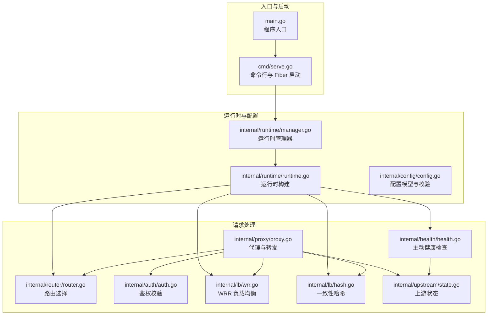
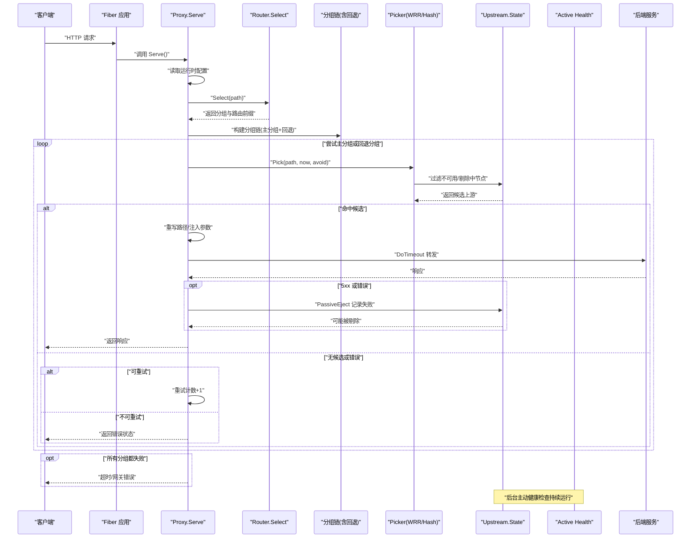
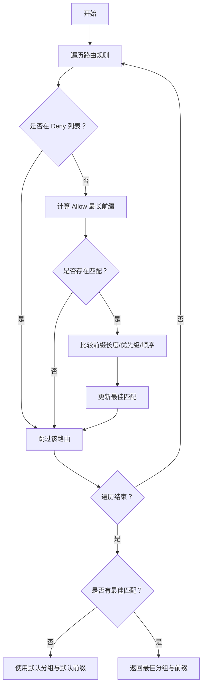
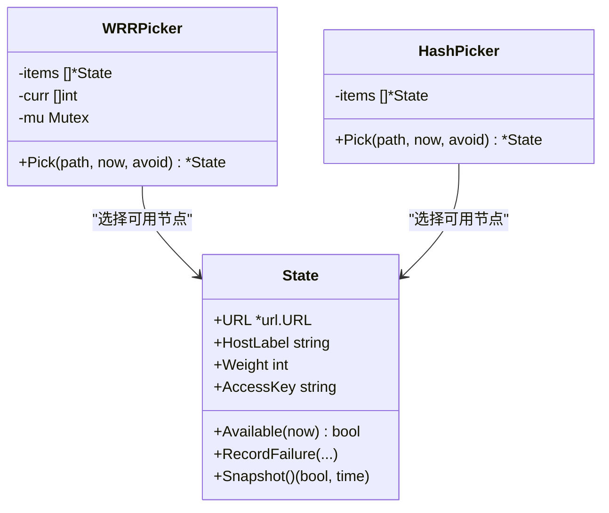
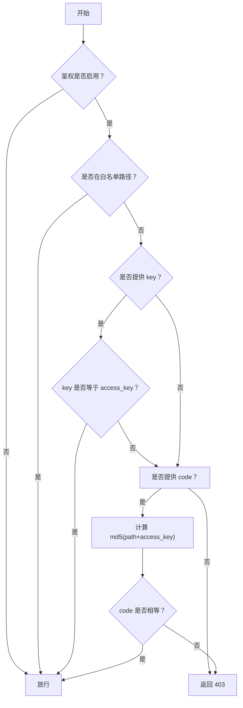
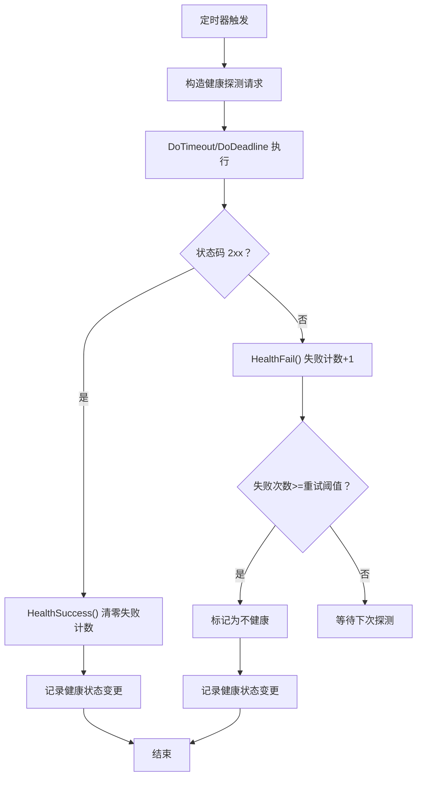
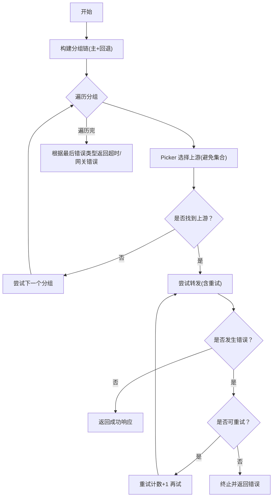
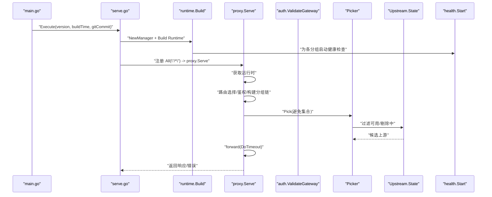
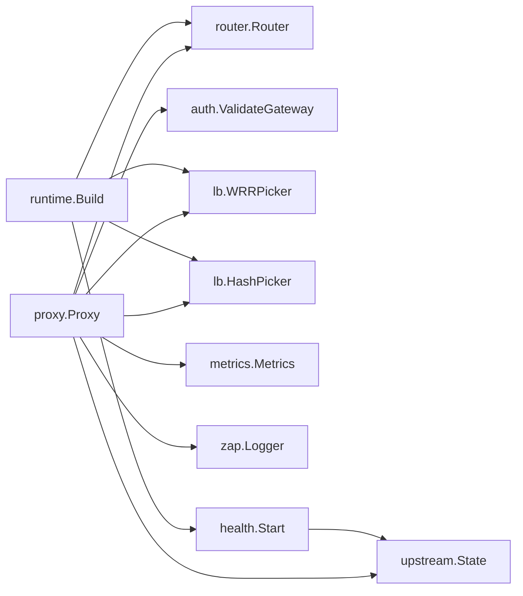

# 核心功能详解

<cite>
**本文引用的文件**
- [main.go](file://main.go)
- [cmd/serve.go](file://cmd/serve.go)
- [internal/proxy/proxy.go](file://internal/proxy/proxy.go)
- [internal/router/router.go](file://internal/router/router.go)
- [internal/lb/wrr.go](file://internal/lb/wrr.go)
- [internal/lb/hash.go](file://internal/lb/hash.go)
- [internal/auth/auth.go](file://internal/auth/auth.go)
- [internal/health/health.go](file://internal/health/health.go)
- [internal/upstream/state.go](file://internal/upstream/state.go)
- [internal/runtime/runtime.go](file://internal/runtime/runtime.go)
- [internal/runtime/manager.go](file://internal/runtime/manager.go)
- [internal/config/config.go](file://internal/config/config.go)
</cite>

## 目录
1. [引言](#引言)
2. [项目结构](#项目结构)
3. [核心组件](#核心组件)
4. [架构总览](#架构总览)
5. [详细组件分析](#详细组件分析)
6. [依赖关系分析](#依赖关系分析)
7. [性能考量](#性能考量)
8. [故障排查指南](#故障排查指南)
9. [结论](#结论)
10. [附录](#附录)

## 引言
本文件围绕 RSSHub 网关的核心功能进行系统化说明，重点覆盖以下三大支柱：
- 路由与负载均衡：分组路由匹配逻辑、加权轮询（WRR）与一致性哈希（Rendezvous）负载均衡策略及适用场景。
- 鉴权机制：网关密钥与 Code 鉴权工作流，以及白名单路径（BypassPaths）的处理。
- 健康检查与高可用：主动健康检查与被动剔除协同保障后端稳定性，以及重试与回退分组的故障转移策略。

文档将结合 proxy.go 中的请求处理流程，完整串联上述功能在一次 HTTP 请求中的执行顺序与交互关系，并通过图示帮助读者建立从入口到后端的全链路理解。

## 项目结构
项目采用按职责分层的组织方式，核心处理链路集中在 proxy 层，路由、负载均衡、鉴权、健康检查与上游状态管理分别位于独立模块，运行时配置构建与热重载由 runtime 与 manager 提供支撑。

图表来源
- [main.go](file://main.go#L1-L22)
- [cmd/serve.go](file://cmd/serve.go#L1-L66)
- [internal/runtime/manager.go](file://internal/runtime/manager.go#L1-L173)
- [internal/runtime/runtime.go](file://internal/runtime/runtime.go#L1-L155)
- [internal/proxy/proxy.go](file://internal/proxy/proxy.go#L1-L350)
- [internal/router/router.go](file://internal/router/router.go#L1-L80)
- [internal/lb/wrr.go](file://internal/lb/wrr.go#L1-L51)
- [internal/lb/hash.go](file://internal/lb/hash.go#L1-L49)
- [internal/auth/auth.go](file://internal/auth/auth.go#L1-L58)
- [internal/health/health.go](file://internal/health/health.go#L1-L115)
- [internal/upstream/state.go](file://internal/upstream/state.go#L1-L109)

章节来源
- [main.go](file://main.go#L1-L22)
- [cmd/serve.go](file://cmd/serve.go#L1-L66)
- [internal/runtime/manager.go](file://internal/runtime/manager.go#L1-L173)
- [internal/runtime/runtime.go](file://internal/runtime/runtime.go#L1-L155)

## 核心组件
- 路由选择器：根据 Allow/Deny 前缀、优先级与顺序，选择最佳分组与路由前缀。
- 负载均衡器：支持 WRR 与一致性哈希两种策略，均考虑上游可用性与权重。
- 鉴权模块：支持密钥（key）与 Code（基于 MD5 的签名）两种方式，可配置白名单路径。
- 主动健康检查：周期性探测上游健康状态，更新上游健康指标。
- 上游状态：记录健康状态、剔除时间、连续失败次数与退避策略。
- 故障转移与重试：基于回退分组链与重试策略，实现自动故障转移与幂等友好重试。

章节来源
- [internal/router/router.go](file://internal/router/router.go#L1-L80)
- [internal/lb/wrr.go](file://internal/lb/wrr.go#L1-L51)
- [internal/lb/hash.go](file://internal/lb/hash.go#L1-L49)
- [internal/auth/auth.go](file://internal/auth/auth.go#L1-L58)
- [internal/health/health.go](file://internal/health/health.go#L1-L115)
- [internal/upstream/state.go](file://internal/upstream/state.go#L1-L109)
- [internal/proxy/proxy.go](file://internal/proxy/proxy.go#L1-L350)

## 架构总览
下图展示了从客户端请求进入，到路由选择、鉴权、负载均衡、转发与回退的完整链路。

图表来源
- [internal/proxy/proxy.go](file://internal/proxy/proxy.go#L40-L156)
- [internal/router/router.go](file://internal/router/router.go#L28-L55)
- [internal/lb/wrr.go](file://internal/lb/wrr.go#L22-L49)
- [internal/lb/hash.go](file://internal/lb/hash.go#L18-L37)
- [internal/health/health.go](file://internal/health/health.go#L16-L78)
- [internal/upstream/state.go](file://internal/upstream/state.go#L34-L109)

## 详细组件分析

### 分组路由匹配逻辑
- 匹配规则
  - Deny 列表优先拒绝；随后对 Allow 列表求最长前缀匹配。
  - 若存在多个匹配，优先选择最长前缀；若前缀相同，比较优先级；若仍相同，比较顺序。
  - 若无任何匹配，使用默认分组与默认路由前缀。
- 关键点
  - 路由前缀用于后续“StripPrefix”路径重写，确保后端收到干净的子路径。
  - 路由选择发生在每次请求，保证动态配置生效。

图表来源
- [internal/router/router.go](file://internal/router/router.go#L28-L55)

章节来源
- [internal/router/router.go](file://internal/router/router.go#L1-L80)

### 负载均衡策略：WRR 与一致性哈希
- 加权轮询（WRR）
  - 维护每个上游的当前权重值，每次选择当前权重最大的节点作为候选，选中后减去总权重。
  - 仅在可用且未被“避免集合”剔除的节点中选择。
  - 适合均匀分配流量、权重调整灵活的场景。
- 一致性哈希（Rendezvous）
  - 对路径与上游标签组合做哈希，计算得分并选择得分最小者。
  - 以权重为分母进行归一化，权重越大被选概率越高。
  - 适合需要会话亲和或路径级稳定性的场景（例如缓存命中、幂等性要求）。
- 共同特性
  - 均考虑上游可用性与剔除时间窗口，避免向不健康或被临时剔除的上游发送请求。
  - 支持“避免集合”，在重试或回退时排除已失败的上游。

图表来源
- [internal/lb/wrr.go](file://internal/lb/wrr.go#L10-L51)
- [internal/lb/hash.go](file://internal/lb/hash.go#L11-L49)
- [internal/upstream/state.go](file://internal/upstream/state.go#L9-L109)

章节来源
- [internal/lb/wrr.go](file://internal/lb/wrr.go#L1-L51)
- [internal/lb/hash.go](file://internal/lb/hash.go#L1-L49)
- [internal/upstream/state.go](file://internal/upstream/state.go#L1-L109)

### 鉴权机制：网关密钥与 Code 鉴权
- 鉴权开关与白名单
  - 当启用鉴权时，对非白名单路径进行校验；白名单路径直接放行。
- 密钥（key）与 Code（md5(path+access_key)）
  - 支持同时开启 key 与 code 校验，任一满足即通过。
  - 后端上游查询参数重写：移除 key/code，必要时注入后端专用 code。
- 影响范围
  - 在代理转发前执行，失败直接返回禁止状态码。
  - 对指标与日志记录包含鉴权失败标记，便于审计。

图表来源
- [internal/auth/auth.go](file://internal/auth/auth.go#L10-L43)

章节来源
- [internal/auth/auth.go](file://internal/auth/auth.go#L1-L58)

### 健康检查与高可用：主动与被动协同
- 主动健康检查
  - 定时器周期探测上游健康端点，支持超时与重试。
  - 成功/失败分别更新健康指标与日志，失败达到阈值标记为不健康。
- 被动剔除（故障转移）
  - 对 5xx 或网络错误进行统计，超过阈值触发指数退避剔除，设置“剔除截止时间”。
  - 剔除期间上游不再被选中，避免放大故障。
- 协同效果
  - 主动检查快速发现异常，被动剔除抑制雪崩传播，二者共同提升整体稳定性。

图表来源
- [internal/health/health.go](file://internal/health/health.go#L16-L78)
- [internal/upstream/state.go](file://internal/upstream/state.go#L54-L76)

章节来源
- [internal/health/health.go](file://internal/health/health.go#L1-L115)
- [internal/upstream/state.go](file://internal/upstream/state.go#L1-L109)

### 重试与回退分组：故障转移策略
- 重试策略
  - 仅对 GET/HEAD 幂等方法启用，最大重试次数可配置。
  - 每次重试都会增加重试计数，并在指标中记录。
- 回退分组
  - 将主分组与回退分组组成链，依次尝试；链上切换会在指标中记录“回退”事件。
  - 在单一分组内，若上游被剔除或发生可重试错误，会避免再次选择同一上游（避免集合）。
- 错误分类与终止条件
  - 连接类错误与超时可重试；其他错误直接返回，不再继续重试。

图表来源
- [internal/proxy/proxy.go](file://internal/proxy/proxy.go#L90-L156)
- [internal/lb/wrr.go](file://internal/lb/wrr.go#L22-L49)
- [internal/lb/hash.go](file://internal/lb/hash.go#L18-L37)

章节来源
- [internal/proxy/proxy.go](file://internal/proxy/proxy.go#L1-L350)

### 请求处理全流程：一次 HTTP 请求的串联
- 入口与初始化
  - main 调用命令行入口，启动 Fiber 应用并注册代理处理器。
  - 运行时管理器加载配置并构建运行时对象，包含路由、分组、负载均衡器、健康检查与短链接等。
- 请求阶段
  - 路由选择：根据路径选择最佳分组与前缀。
  - 鉴权：对非白名单路径进行 key/code 校验。
  - 负载均衡：在主分组内选择上游，支持重试与避免集合。
  - 转发：构造上游 URL，注入后端专用 code（如适用），超时控制。
  - 回退与回退链：若主分组失败，按链路切换至回退分组。
  - 指标与日志：记录请求耗时、状态、重试次数、回退链与错误类型。
  - 健康检查：后台持续探测上游健康状态，更新指标与日志。

图表来源
- [main.go](file://main.go#L16-L21)
- [cmd/serve.go](file://cmd/serve.go#L18-L60)
- [internal/runtime/runtime.go](file://internal/runtime/runtime.go#L50-L127)
- [internal/proxy/proxy.go](file://internal/proxy/proxy.go#L40-L156)
- [internal/health/health.go](file://internal/health/health.go#L16-L43)
- [internal/auth/auth.go](file://internal/auth/auth.go#L10-L27)

章节来源
- [main.go](file://main.go#L1-L22)
- [cmd/serve.go](file://cmd/serve.go#L1-L66)
- [internal/runtime/runtime.go](file://internal/runtime/runtime.go#L1-L155)
- [internal/proxy/proxy.go](file://internal/proxy/proxy.go#L1-L350)

## 依赖关系分析
- 组件耦合
  - Proxy 依赖 Router、Auth、Picker、Upstream.State、Metrics、Logger。
  - Runtime 构建时为各分组选择 Picker（WRR/Hash），并启动健康检查。
  - Health 与 Upstream.State 双向影响：健康检查更新状态，状态变化影响选择。
- 外部依赖
  - 使用 fasthttp 进行高性能 HTTP 请求与响应处理。
  - 使用 Fiber 作为 Web 框架入口。
  - 使用 Prometheus 指标与 Zap 日志。

图表来源
- [internal/proxy/proxy.go](file://internal/proxy/proxy.go#L1-L350)
- [internal/runtime/runtime.go](file://internal/runtime/runtime.go#L50-L127)
- [internal/health/health.go](file://internal/health/health.go#L16-L43)
- [internal/upstream/state.go](file://internal/upstream/state.go#L1-L109)

章节来源
- [internal/proxy/proxy.go](file://internal/proxy/proxy.go#L1-L350)
- [internal/runtime/runtime.go](file://internal/runtime/runtime.go#L1-L155)
- [internal/health/health.go](file://internal/health/health.go#L1-L115)
- [internal/upstream/state.go](file://internal/upstream/state.go#L1-L109)

## 性能考量
- 负载均衡
  - WRR 适合均匀分布与权重动态调整；Hash 适合路径级稳定性与缓存命中。
  - Picker 选择时仅考虑可用节点，避免无效连接开销。
- 超时与重试
  - 请求超时与重试次数直接影响延迟与吞吐，需结合业务幂等性与后端能力配置。
- 指标与日志
  - 记录每分组、每上游的请求量、状态分布与耗时，有助于容量规划与问题定位。
- 主动健康检查
  - 合理的间隔与超时避免过度探测，同时及时发现异常。

[本节为通用指导，无需特定文件来源]

## 故障排查指南
- 鉴权失败
  - 检查是否启用了鉴权、白名单路径配置是否正确、key/code 是否传递与匹配。
  - 查看访问日志中的“err_type=auth”字段。
- 超时/网关错误
  - 确认 server.timeout_ms 配置是否合理；查看“err_type=timeout”或“status=504/502”。
  - 检查上游健康状态与剔除时间。
- 重试未生效
  - 确认 GET/HEAD 方法且 retry.enabled/max_retries 已配置；检查“err_type=connect/timeout”。
- 回退链未触发
  - 检查分组链配置与 fallback_groups 是否正确；查看指标“fallback_total”。
- 健康检查异常
  - 检查 health.active 的 path/interval/timeout/retries；确认后端健康端点可达。

章节来源
- [internal/auth/auth.go](file://internal/auth/auth.go#L10-L27)
- [internal/proxy/proxy.go](file://internal/proxy/proxy.go#L266-L295)
- [internal/health/health.go](file://internal/health/health.go#L16-L78)
- [internal/upstream/state.go](file://internal/upstream/state.go#L84-L109)

## 结论
RSSHub 网关通过“路由+鉴权+负载均衡+健康检查+故障转移”的闭环设计，在保证安全与稳定的前提下，提供了灵活的流量调度与可观测能力。WRR 与一致性哈希满足不同场景下的均衡需求；鉴权与白名单路径确保访问控制；主动健康检查与被动剔除协同提升系统韧性；重试与回退分组则在故障发生时提供自动恢复能力。proxy.go 中的处理流程将这些能力有机串联，形成一条高效、可观察、可扩展的请求链路。

[本节为总结，无需特定文件来源]

## 附录
- 关键配置要点
  - 路由：allow/deny/priority/order 控制匹配优先级。
  - 分组：backend、strip_prefix、lb.policy、fallback_groups、health.active。
  - 鉴权：gateway_auth.enabled/access_key/accept_key/accept_code/bypass_paths。
  - 故障转移：failover.retry.enabled/max_retries 与 passive_eject.threshold/base_eject_ms/max_eject_ms。
- 默认行为
  - 默认监听地址、指标与 pprof 路径、短链接路径、缓存与自动重载等均有默认值，可在配置中覆盖。

章节来源
- [internal/config/config.go](file://internal/config/config.go#L12-L476)
- [internal/runtime/runtime.go](file://internal/runtime/runtime.go#L19-L127)
- [internal/proxy/proxy.go](file://internal/proxy/proxy.go#L1-L350)