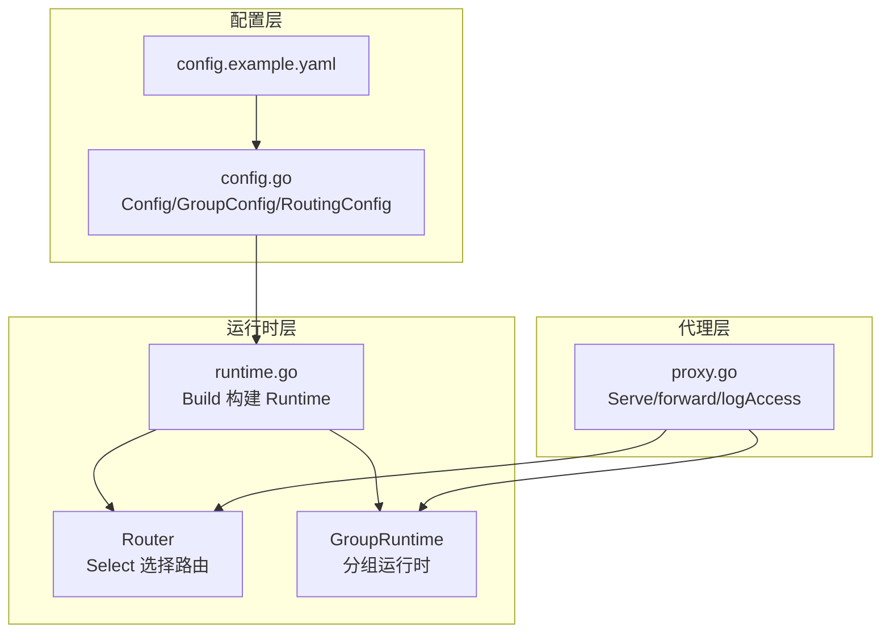
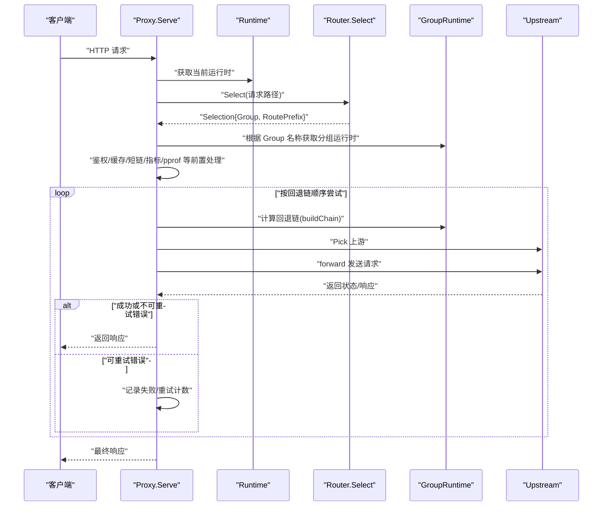
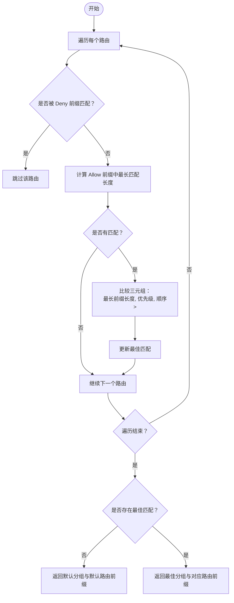
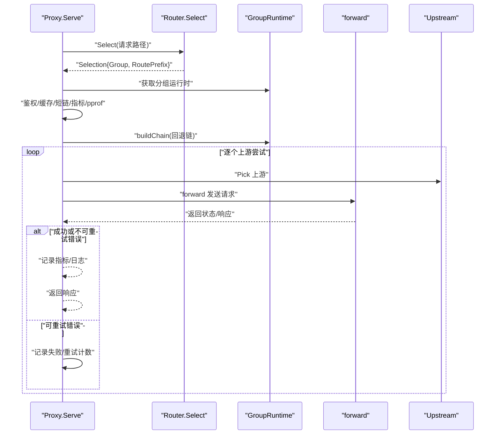
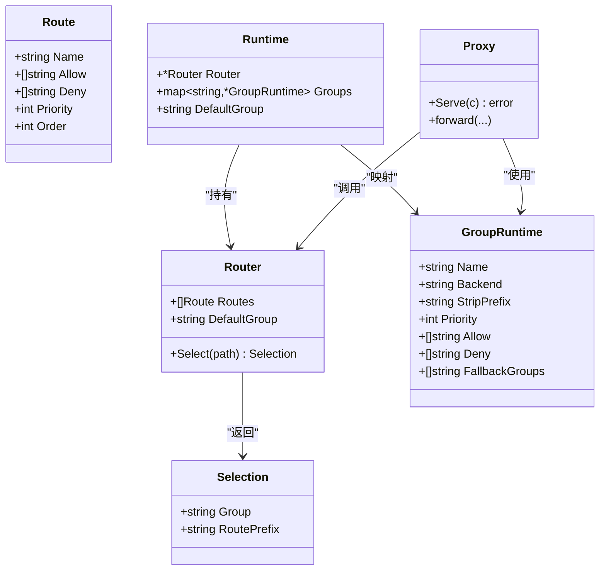

# 分组路由

<cite>
**本文引用的文件**
- [internal/router/router.go](file://internal/router/router.go)
- [internal/router/router_test.go](file://internal/router/router_test.go)
- [internal/proxy/proxy.go](file://internal/proxy/proxy.go)
- [internal/runtime/runtime.go](file://internal/runtime/runtime.go)
- [internal/config/config.go](file://internal/config/config.go)
- [config.example.yaml](file://config.example.yaml)
</cite>

## 目录
1. [简介](#简介)
2. [项目结构](#项目结构)
3. [核心组件](#核心组件)
4. [架构总览](#架构总览)
5. [详细组件分析](#详细组件分析)
6. [依赖关系分析](#依赖关系分析)
7. [性能考量](#性能考量)
8. [故障排查指南](#故障排查指南)
9. [结论](#结论)
10. [附录](#附录)

## 简介
本篇文档围绕“分组路由”机制展开，系统性阐述基于路径前缀的路由匹配逻辑，详解 router.go 中 Route 结构体的 Allow、Deny、Priority 和 Order 字段的含义与作用，以及 Router.Select 方法如何通过最长前缀匹配、拒绝规则优先、优先级排序与顺序控制来确定最佳路由。结合 proxy.go 的请求处理流程，展示从 HTTP 请求进入网关到匹配目标分组的完整过程。同时提供配置示例，说明 allow/deny 规则的典型应用场景（如 API 版本隔离、路径白名单控制），并讨论 DefaultGroup 与 DefaultRoutePrefix 的默认行为及其在故障转移中的作用，最后通过 router_test.go 的测试用例说明边界情况的处理。

## 项目结构
- 路由核心位于 internal/router，包含路由定义与选择算法。
- 请求入口与转发逻辑位于 internal/proxy，负责鉴权、缓存、故障转移与上游转发。
- 运行时对象 internal/runtime 将配置转换为运行态的 Router 与 Groups，并注入到代理层。
- 配置解析与校验位于 internal/config，提供默认值、规范化与验证。
- 示例配置 config.example.yaml 展示了路由相关的关键项。

图表来源
- [internal/config/config.go](file://internal/config/config.go#L1-L120)
- [internal/runtime/runtime.go](file://internal/runtime/runtime.go#L50-L118)
- [internal/router/router.go](file://internal/router/router.go#L1-L80)
- [internal/proxy/proxy.go](file://internal/proxy/proxy.go#L42-L183)

章节来源
- [internal/config/config.go](file://internal/config/config.go#L1-L120)
- [internal/runtime/runtime.go](file://internal/runtime/runtime.go#L50-L118)
- [internal/router/router.go](file://internal/router/router.go#L1-L80)
- [internal/proxy/proxy.go](file://internal/proxy/proxy.go#L42-L183)

## 核心组件
- Route：描述一个分组的路由规则，包含允许前缀、拒绝前缀、优先级与顺序。
- Router：维护一组 Route 并提供 Select 方法进行路径匹配。
- Selection：表示一次匹配的结果，包含目标分组与对应路由前缀。
- Runtime：将配置转换为运行态，构建 Router 与各分组运行时。
- Proxy：接收请求，调用 Router.Select 获取分组与前缀，执行鉴权、缓存、故障转移与上游转发。

章节来源
- [internal/router/router.go](file://internal/router/router.go#L4-L16)
- [internal/runtime/runtime.go](file://internal/runtime/runtime.go#L19-L48)
- [internal/proxy/proxy.go](file://internal/proxy/proxy.go#L42-L83)

## 架构总览
下图展示了从请求进入网关到命中目标分组的端到端流程，包括路由选择、鉴权、缓存、故障转移与上游转发。

图表来源
- [internal/proxy/proxy.go](file://internal/proxy/proxy.go#L42-L183)
- [internal/runtime/runtime.go](file://internal/runtime/runtime.go#L36-L48)
- [internal/router/router.go](file://internal/router/router.go#L29-L56)

## 详细组件分析

### 路由选择算法：Router.Select
Router.Select 的决策流程如下：
- 遍历所有路由，先检查是否被 Deny 前缀拒绝。
- 对未被拒绝的路由，计算 Allow 前缀中最长匹配前缀。
- 在所有匹配的路由中，比较三元组：最长前缀长度、优先级、顺序，择优。
- 若没有任何路由匹配，则回退到默认分组与默认路由前缀。

图表来源
- [internal/router/router.go](file://internal/router/router.go#L29-L56)
- [internal/router/router.go](file://internal/router/router.go#L58-L80)

章节来源
- [internal/router/router.go](file://internal/router/router.go#L29-L56)
- [internal/router/router.go](file://internal/router/router.go#L58-L80)

### Route 字段语义与作用
- Name：路由所属分组名称，用于标识目标分组。
- Allow：允许的路径前缀列表。只有当请求路径以任一 Allow 前缀开头时，才考虑该路由。
- Deny：拒绝的路径前缀列表。若请求路径以任一 Deny 前缀开头，则直接排除该路由，且 Deny 优先于 Allow 生效。
- Priority：优先级。当多个路由对同一请求存在最长前缀匹配时，优先级更高的路由胜出。
- Order：顺序。当最长前缀长度与优先级均相等时，顺序更小的路由胜出。

章节来源
- [internal/router/router.go](file://internal/router/router.go#L4-L10)
- [internal/router/router.go](file://internal/router/router.go#L29-L56)

### 选择结果 Selection
- Group：命中的分组名称。
- RoutePrefix：与命中的路由对应的最长前缀，用于后续路径重写与缓存键生成。

章节来源
- [internal/router/router.go](file://internal/router/router.go#L12-L15)

### 从配置到运行时：Runtime 构建
- Build 将配置中的 groups 转换为 GroupRuntime，并为每个分组构造 router.Route，其中 Order 使用其在配置数组中的索引。
- Runtime.Router 由 router.New(routes, cfg.Routing.DefaultGroup) 构建，DefaultGroup 来自配置的 routing.default_group。

章节来源
- [internal/runtime/runtime.go](file://internal/runtime/runtime.go#L50-L118)
- [internal/config/config.go](file://internal/config/config.go#L89-L91)

### 请求处理流程：Proxy.Serve
- 获取当前运行时，提取 Router 与 Groups。
- 调用 Router.Select 获取分组与路由前缀。
- 执行鉴权、缓存、短链、指标与 pprof 等前置处理。
- 按回退链顺序尝试上游，支持重试与被动剔除。
- 返回响应并记录指标与日志。

图表来源
- [internal/proxy/proxy.go](file://internal/proxy/proxy.go#L42-L183)
- [internal/proxy/proxy.go](file://internal/proxy/proxy.go#L383-L392)

章节来源
- [internal/proxy/proxy.go](file://internal/proxy/proxy.go#L42-L183)
- [internal/proxy/proxy.go](file://internal/proxy/proxy.go#L383-L392)

### 默认行为：DefaultGroup 与 DefaultRoutePrefix
- DefaultRoutePrefix：当没有任何路由匹配时，返回的路由前缀常量。
- DefaultGroup：当没有任何路由匹配时，返回的分组名称，来源于配置 routing.default_group。
- 在故障转移中，Proxy.Serve 会按回退链依次尝试，最终若仍失败，会使用最终分组与路由前缀记录指标与日志。

章节来源
- [internal/router/router.go](file://internal/router/router.go#L18-L23)
- [internal/router/router.go](file://internal/router/router.go#L52-L56)
- [internal/runtime/runtime.go](file://internal/runtime/runtime.go#L104-L118)
- [internal/proxy/proxy.go](file://internal/proxy/proxy.go#L103-L183)

### 边界情况与测试用例
- 最长前缀优先：当 Allow 存在更长的匹配前缀时，即使优先级相同，也应命中更长前缀。
- 拒绝规则优先：若某路由被 Deny 前缀命中，则该路由不参与选择。
- 优先级与顺序：当最长前缀与优先级都相等时，顺序更小的路由胜出。
- 默认回退：当没有任何路由匹配时，回退到 DefaultGroup 与 DefaultRoutePrefix。

章节来源
- [internal/router/router_test.go](file://internal/router/router_test.go#L1-L63)

## 依赖关系分析
- Router 依赖 strings 包进行前缀判断。
- Runtime.Build 将 GroupConfig 转换为 GroupRuntime，并构造 router.Route，其中 Order 使用配置数组索引。
- Proxy.Serve 依赖 Runtime.Router 与 Runtime.Groups，执行鉴权、缓存、故障转移与上游转发。
- 配置层提供默认值、规范化与校验，确保 routing.default_group 存在且有效。

图表来源
- [internal/router/router.go](file://internal/router/router.go#L4-L16)
- [internal/router/router.go](file://internal/router/router.go#L19-L23)
- [internal/runtime/runtime.go](file://internal/runtime/runtime.go#L19-L48)
- [internal/proxy/proxy.go](file://internal/proxy/proxy.go#L42-L83)

章节来源
- [internal/router/router.go](file://internal/router/router.go#L4-L16)
- [internal/runtime/runtime.go](file://internal/runtime/runtime.go#L19-L48)
- [internal/proxy/proxy.go](file://internal/proxy/proxy.go#L42-L83)

## 性能考量
- 路由选择复杂度：对每个请求，需要遍历所有路由并进行前缀匹配与比较，时间复杂度为 O(N)，N 为路由数量。通常路由数量有限，开销可控。
- 最长前缀查找：对每个未被拒绝的路由，计算 Allow 前缀中最长匹配，整体为 O(N·M)，M 为该路由 Allow 数量。
- 优化建议：
  - 控制路由数量，避免过多 Allow/Deny 前缀导致匹配成本上升。
  - 合理设置 Priority 与 Order，减少歧义与比较次数。
  - 将高频命中路由置于靠前位置（Order 更小），有助于减少比较次数。

[本节为通用性能讨论，不直接分析具体文件]

## 故障排查指南
- 路由未命中：
  - 检查请求路径是否以任一 Allow 前缀开头。
  - 检查是否存在 Deny 前缀导致被拒绝。
  - 确认 DefaultGroup 是否正确配置，避免误以为默认路由生效。
- 优先级与顺序问题：
  - 当多个路由对同一请求有相同最长前缀时，优先级更高的路由胜出；若优先级相同，顺序更小的路由胜出。
- 故障转移与重试：
  - GET/HEAD 请求在可重试错误（如超时/连接错误）时会自动重试，重试次数受配置限制。
  - 被动剔除策略会在连续失败后暂时剔除上游，降低对不稳定上游的流量。
- 日志与指标：
  - Proxy.logAccess 记录访问日志，包含分组、路由前缀、状态、重试次数与回退链等信息，便于定位问题。
  - 指标模块记录请求总量、成功率、失败率、重试次数、缓存命中/未命中等，可用于监控与告警。

章节来源
- [internal/proxy/proxy.go](file://internal/proxy/proxy.go#L103-L183)
- [internal/proxy/proxy.go](file://internal/proxy/proxy.go#L394-L419)

## 结论
分组路由机制通过 Allow/Deny 前缀匹配、最长前缀优先、优先级与顺序控制，实现了稳定而灵活的路径路由选择。配合默认分组与默认路由前缀，能够在无匹配时安全回退。Proxy.Serve 将路由选择与鉴权、缓存、故障转移、指标与日志整合，形成完整的请求处理闭环。合理配置 allow/deny、优先级与顺序，可满足 API 版本隔离、路径白名单控制等常见场景需求。

[本节为总结性内容，不直接分析具体文件]

## 附录

### 配置示例与典型场景
- API 版本隔离：通过不同分组的 allow 前缀实现版本前缀隔离，例如 /v1/、/v2/，并在各分组内设置不同的 strip_prefix 与负载均衡策略。
- 路径白名单控制：在主分组中设置 deny 前缀拒绝敏感路径，同时在备用分组中允许特定路径，实现细粒度的访问控制。
- 默认分组与默认路由前缀：当请求路径无法匹配任何路由时，将回退到默认分组与默认路由前缀，确保系统具备兜底能力。

章节来源
- [config.example.yaml](file://config.example.yaml#L133-L167)
- [config.example.yaml](file://config.example.yaml#L181-L264)

### 测试用例要点
- 最长前缀优先：当存在更长的 Allow 前缀时，应命中更长前缀。
- 拒绝规则优先：Deny 前缀优先于 Allow 生效。
- 优先级与顺序：当最长前缀与优先级相等时，顺序更小的路由胜出。
- 默认回退：当没有任何路由匹配时，回退到默认分组与默认路由前缀。

章节来源
- [internal/router/router_test.go](file://internal/router/router_test.go#L1-L63)