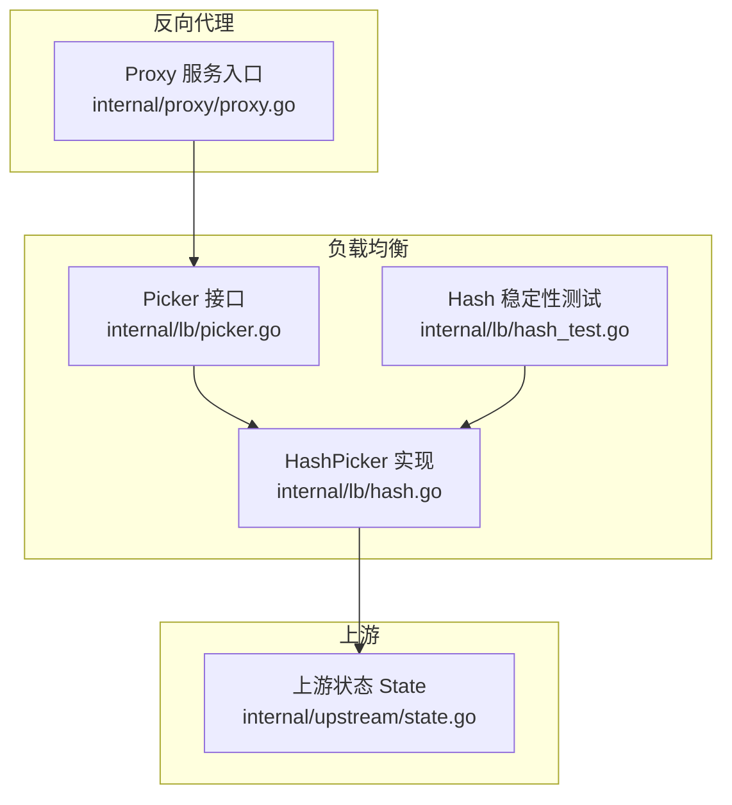
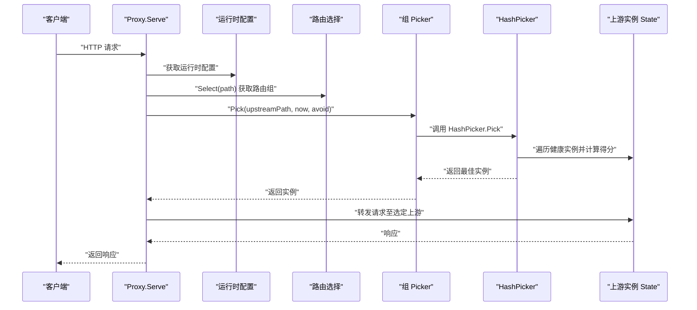
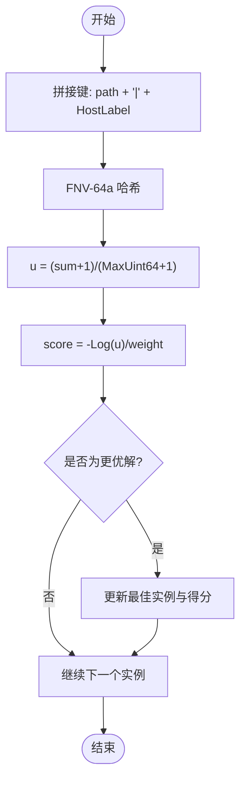
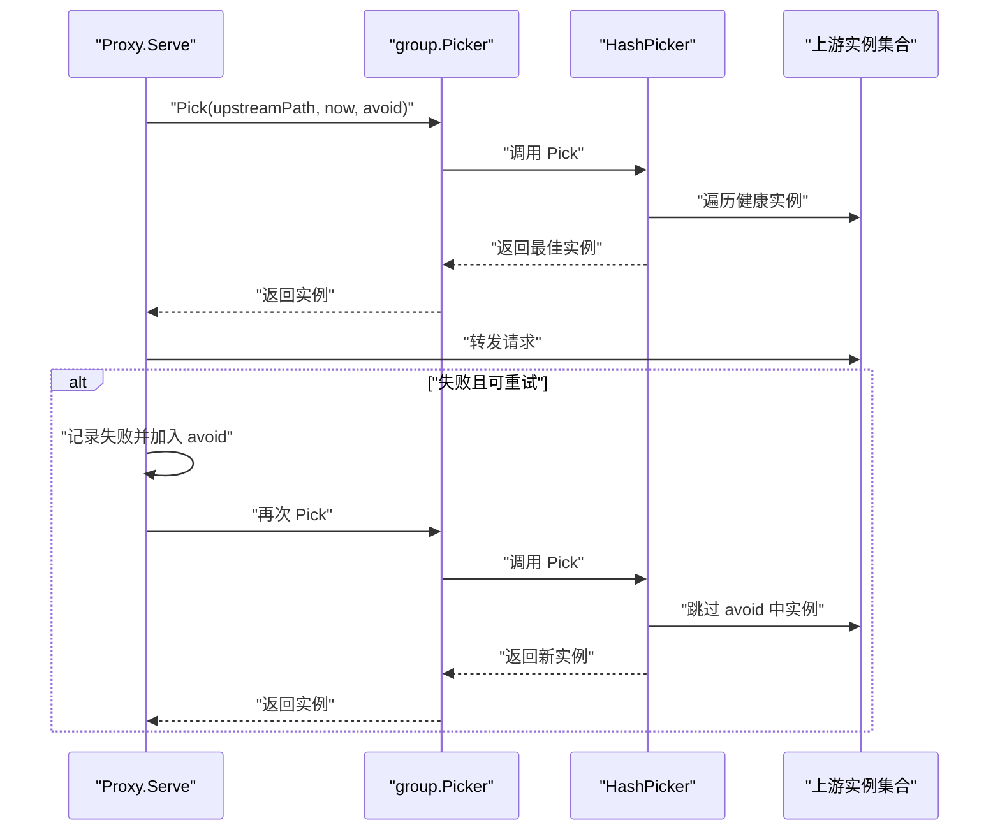
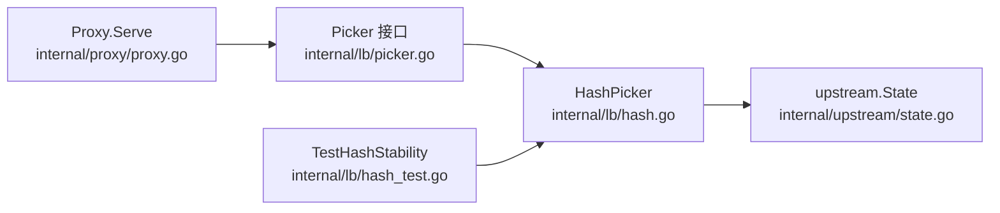

# 一致性哈希(Hash)

<cite>
**本文引用的文件**
- [internal/lb/hash.go](file://internal/lb/hash.go)
- [internal/lb/hash_test.go](file://internal/lb/hash_test.go)
- [internal/lb/picker.go](file://internal/lb/picker.go)
- [internal/proxy/proxy.go](file://internal/proxy/proxy.go)
- [internal/upstream/state.go](file://internal/upstream/state.go)
</cite>

## 目录
1. [引言](#引言)
2. [项目结构](#项目结构)
3. [核心组件](#核心组件)
4. [架构总览](#架构总览)
5. [详细组件分析](#详细组件分析)
6. [依赖关系分析](#依赖关系分析)
7. [性能考量](#性能考量)
8. [故障排查指南](#故障排查指南)
9. [结论](#结论)
10. [附录](#附录)

## 引言
本文件围绕 HashPicker 的一致性哈希（Rendezvous 最高随机权重法）实现进行深入解析，重点说明 rendezvousScore 如何结合 FNV-64a 哈希与上游实例权重，通过 -Log(u)/weight 公式完成权重归一化，使高权重实例获得更高被选概率；Pick 方法如何遍历所有健康实例并选择得分最低者，从而保证相同请求路径始终映射到同一后端。结合 hash_test.go 中的 TestHashStability 测试用例，验证路由稳定性与权重调整后的重新分布行为；结合 proxy.go 对 Picker 接口的调用，说明 Hash 策略在处理缓存亲和性需求时的关键作用，并讨论其在实例增减时最小化缓存失效的优势及全量遍历带来的性能开销，适用于对会话粘性要求高的场景。

## 项目结构
- 负载均衡层位于 internal/lb，包含 HashPicker、Picker 接口与相关测试。
- 上游状态模型位于 internal/upstream，提供实例健康状态与权重等信息。
- 反向代理层 internal/proxy 在请求转发前通过 Picker 选择上游实例，并支持缓存亲和与重试回退链路。



图表来源
- [internal/lb/picker.go](file://internal/lb/picker.go#L1-L12)
- [internal/lb/hash.go](file://internal/lb/hash.go#L1-L49)
- [internal/lb/hash_test.go](file://internal/lb/hash_test.go#L1-L35)
- [internal/upstream/state.go](file://internal/upstream/state.go#L1-L109)
- [internal/proxy/proxy.go](file://internal/proxy/proxy.go#L1-L183)

章节来源
- [internal/lb/picker.go](file://internal/lb/picker.go#L1-L12)
- [internal/lb/hash.go](file://internal/lb/hash.go#L1-L49)
- [internal/lb/hash_test.go](file://internal/lb/hash_test.go#L1-L35)
- [internal/upstream/state.go](file://internal/upstream/state.go#L1-L109)
- [internal/proxy/proxy.go](file://internal/proxy/proxy.go#L1-L183)

## 核心组件
- Picker 接口：定义 Pick(path, now, avoid) -> *upstream.State 的统一选择器签名，便于替换不同负载均衡策略。
- HashPicker：实现基于 Rendezvous（最高随机权重法）的一致性哈希选择器，内部以 FNV-64a 计算哈希，再经 -Log(u)/weight 归一化权重，最终选择得分最低的健康实例。
- upstream.State：承载上游实例的 URL、HostLabel、Weight、AccessKey 以及健康状态与弹出时间等信息，供选择器过滤与权重使用。
- Proxy：在请求进入时根据路由选择组，随后通过 group.Picker.Pick 进行实例选择，并在失败时支持重试与回退链路。

章节来源
- [internal/lb/picker.go](file://internal/lb/picker.go#L1-L12)
- [internal/lb/hash.go](file://internal/lb/hash.go#L1-L49)
- [internal/upstream/state.go](file://internal/upstream/state.go#L1-L109)
- [internal/proxy/proxy.go](file://internal/proxy/proxy.go#L108-L173)

## 架构总览
下图展示了从请求进入代理到选择上游实例的整体流程，以及 Hash 策略在其中的位置。



图表来源
- [internal/proxy/proxy.go](file://internal/proxy/proxy.go#L79-L173)
- [internal/lb/hash.go](file://internal/lb/hash.go#L19-L38)
- [internal/upstream/state.go](file://internal/upstream/state.go#L34-L41)

## 详细组件分析

### HashPicker 与 rendezvousScore：Rendezvous 一致性哈希
- rendezvousScore 的设计要点：
  - 使用 FNV-64a 对输入进行哈希，输入由 path 与上游 HostLabel 组合而成，确保相同 path 与相同上游组合产生稳定哈希值。
  - 将无符号 64 位哈希值映射到 [0,1) 区间 u，避免 0 导致对数运算未定义的问题。
  - 采用 -Log(u)/weight 的归一化公式，使权重越大，得分越低，从而提升被选概率。
- Pick 的选择逻辑：
  - 遍历所有上游实例，跳过被 avoid 标记或不健康的实例。
  - 计算每个候选实例的得分，保留当前最低得分的实例作为最佳选择。
  - 返回最佳实例，若无可选实例则返回空。



图表来源
- [internal/lb/hash.go](file://internal/lb/hash.go#L40-L48)
- [internal/upstream/state.go](file://internal/upstream/state.go#L10-L14)

章节来源
- [internal/lb/hash.go](file://internal/lb/hash.go#L19-L48)
- [internal/upstream/state.go](file://internal/upstream/state.go#L10-L41)

### Picker 接口与 HashPicker 的关系
- Picker 定义了统一的选择器接口，HashPicker 实现该接口，使得在运行时可灵活切换不同的负载均衡策略（如 WRR）。
- Proxy 在每次转发前调用 group.Picker.Pick，将上游选择逻辑与业务处理解耦。

```mermaid
classDiagram
class Picker {
+Pick(path string, now time.Time, avoid map[*upstream.State]struct{}) *upstream.State
}
class HashPicker {
-items []*upstream.State
+Pick(path string, now time.Time, avoid map[*upstream.State]struct{}) *upstream.State
}
class State {
+URL *url.URL
+HostLabel string
+Weight int
+Available(now time.Time) bool
}
Picker <|.. HashPicker : "实现"
HashPicker --> State : "遍历并选择"
```

图表来源
- [internal/lb/picker.go](file://internal/lb/picker.go#L1-L12)
- [internal/lb/hash.go](file://internal/lb/hash.go#L11-L18)
- [internal/upstream/state.go](file://internal/upstream/state.go#L9-L21)

章节来源
- [internal/lb/picker.go](file://internal/lb/picker.go#L1-L12)
- [internal/lb/hash.go](file://internal/lb/hash.go#L11-L18)
- [internal/upstream/state.go](file://internal/upstream/state.go#L9-L21)

### 缓存亲和性与稳定性：TestHashStability
- TestHashStability 通过创建两个上游实例并反复对同一路径进行选择，断言多次选择结果一致，验证了 Hash 策略的稳定性。
- 当上游权重发生变化时，相同路径的映射可能改变，但该测试仅覆盖初始稳定性，不包含权重变化场景。

章节来源
- [internal/lb/hash_test.go](file://internal/lb/hash_test.go#L11-L26)

### 在代理中的调用与重试回退链路
- Proxy.Serve 在选择上游时，会将已尝试过的实例加入 avoid 集合，避免重复失败实例。
- 若发生可重试错误（如超时/连接错误），会增加重试次数并继续通过 group.Picker.Pick 选择新的上游实例。
- 通过 fallbackChain 记录回退链路，便于可观测性与排障。



图表来源
- [internal/proxy/proxy.go](file://internal/proxy/proxy.go#L134-L173)
- [internal/lb/hash.go](file://internal/lb/hash.go#L19-L38)

章节来源
- [internal/proxy/proxy.go](file://internal/proxy/proxy.go#L134-L173)

## 依赖关系分析
- HashPicker 依赖 upstream.State 提供权重与健康状态判断。
- Proxy 依赖 runtime.Router.Select 获取路由组，再通过 group.Picker.Pick 选择上游。
- 测试用例依赖 upstream.NewState 构造上游实例，验证 Pick 的稳定性。



图表来源
- [internal/proxy/proxy.go](file://internal/proxy/proxy.go#L79-L173)
- [internal/lb/picker.go](file://internal/lb/picker.go#L1-L12)
- [internal/lb/hash.go](file://internal/lb/hash.go#L1-L49)
- [internal/lb/hash_test.go](file://internal/lb/hash_test.go#L1-L35)
- [internal/upstream/state.go](file://internal/upstream/state.go#L1-L109)

章节来源
- [internal/proxy/proxy.go](file://internal/proxy/proxy.go#L79-L173)
- [internal/lb/picker.go](file://internal/lb/picker.go#L1-L12)
- [internal/lb/hash.go](file://internal/lb/hash.go#L1-L49)
- [internal/lb/hash_test.go](file://internal/lb/hash_test.go#L1-L35)
- [internal/upstream/state.go](file://internal/upstream/state.go#L1-L109)

## 性能考量
- 时间复杂度：Pick 对所有上游实例进行一次线性扫描，时间复杂度为 O(n)，n 为上游实例数量。当实例数量较大时，遍历成本线性增长。
- 空间复杂度：O(1)，除输入参数外仅使用常量级额外空间。
- 权重归一化：-Log(u)/weight 使高权重实例得分更低，被选概率更高，同时保持路径到实例的稳定映射。
- 缓存亲和性：由于相同 path 永远映射到同一实例，有利于缓存命中与会话粘性，降低跨实例缓存失效。
- 实例增减影响：新增实例会改变部分路径的映射，导致缓存失效；删除实例会使原本映射到该实例的路径迁移到其他实例，同样引发缓存失效。因此该策略更适合对会话粘性要求高而对缓存全局一致性要求相对较低的场景。

[本节为通用性能讨论，不直接分析具体文件，故无“章节来源”]

## 故障排查指南
- 选择不到实例：
  - 检查上游健康状态与弹出时间，确保实例处于可用窗口内。
  - 检查 avoid 集合是否包含了所有实例（例如重试过多导致全部被排除）。
- 选择不稳定：
  - 确认上游权重是否频繁变动，权重变化会导致路径映射迁移。
  - 确认 path 是否稳定，不同 path 会映射到不同实例。
- 缓存命中率下降：
  - 实例增减会触发路径到实例的重映射，导致缓存失效。可通过减少实例变更频率或采用更细粒度的缓存键策略缓解。
- 可观测性：
  - 利用 Proxy 的日志与指标记录，定位失败类型（超时/连接）、重试次数与回退链路，辅助问题定位。

章节来源
- [internal/lb/hash.go](file://internal/lb/hash.go#L19-L38)
- [internal/upstream/state.go](file://internal/upstream/state.go#L34-L41)
- [internal/proxy/proxy.go](file://internal/proxy/proxy.go#L134-L173)

## 结论
HashPicker 基于 Rendezvous（最高随机权重法）实现了稳定的路径到实例映射，通过 FNV-64a 哈希与 -Log(u)/weight 权重归一化，确保高权重实例获得更高被选概率。Pick 方法的全量遍历保证了相同请求路径始终映射到同一后端，适合对会话粘性与缓存亲和性有较高要求的场景。然而，实例增减会引发路径重映射与缓存失效，需在部署策略与缓存设计上加以权衡。

[本节为总结性内容，不直接分析具体文件，故无“章节来源”]

## 附录
- 关键实现位置参考：
  - HashPicker.Pick 与 rendezvousScore：[internal/lb/hash.go](file://internal/lb/hash.go#L19-L48)
  - Picker 接口定义：[internal/lb/picker.go](file://internal/lb/picker.go#L1-L12)
  - 上游状态与可用性判断：[internal/upstream/state.go](file://internal/upstream/state.go#L34-L41)
  - Proxy 中对 Picker 的调用与重试回退链路：[internal/proxy/proxy.go](file://internal/proxy/proxy.go#L134-L173)
  - Hash 稳定性测试：[internal/lb/hash_test.go](file://internal/lb/hash_test.go#L11-L26)

[本节为索引性内容，不直接分析具体文件，故无“章节来源”]