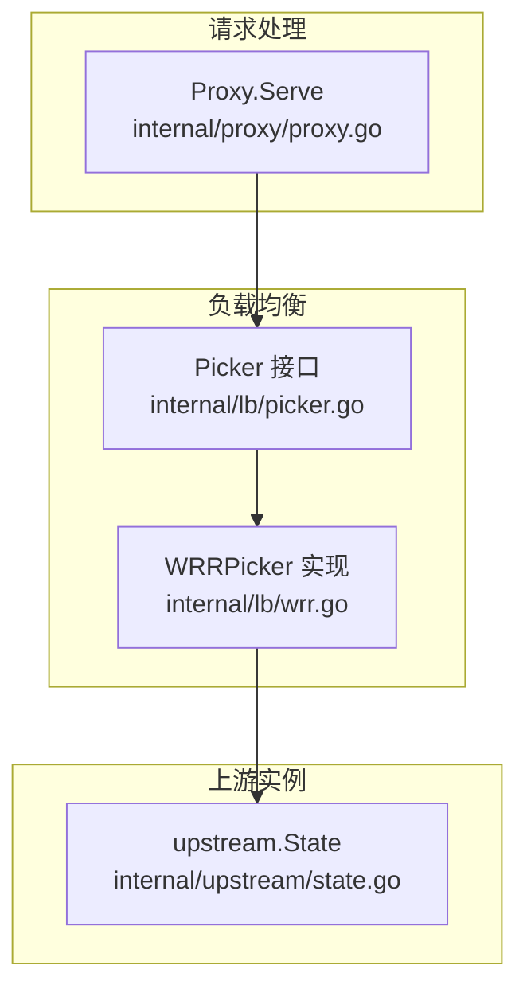
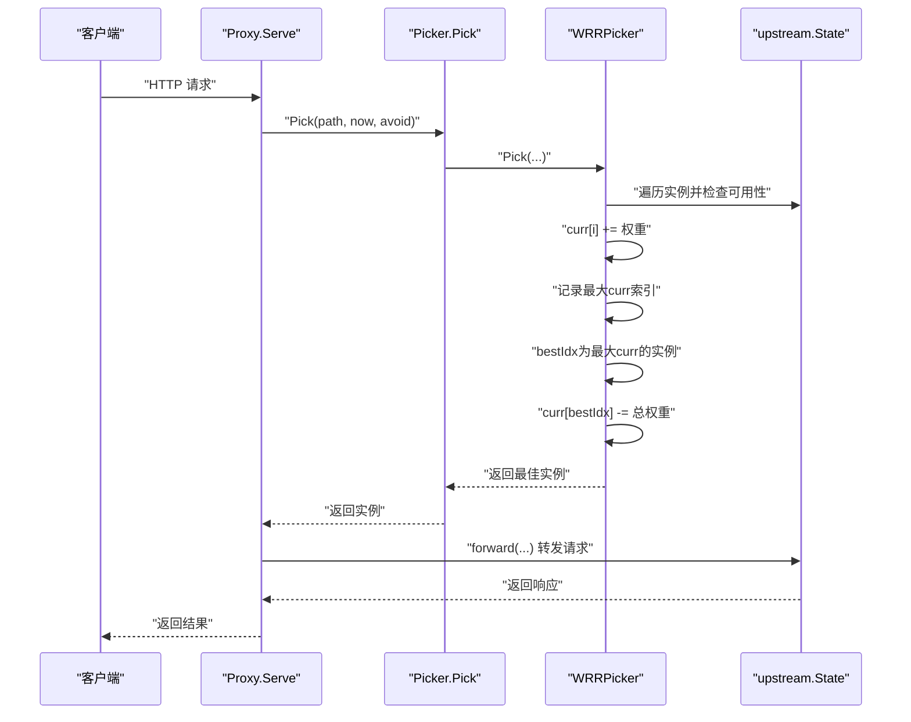
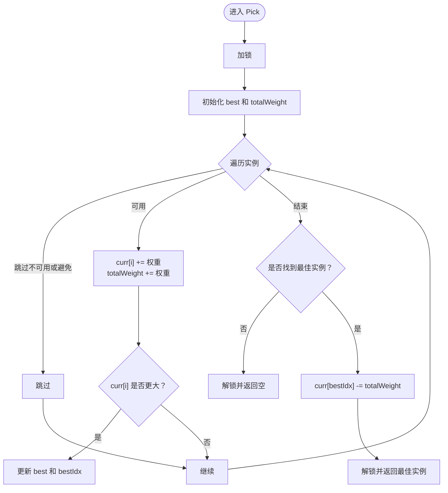
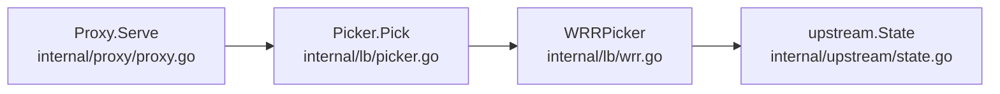

# 加权轮询(WRR)

<cite>
**本文引用的文件**
- [internal/lb/wrr.go](file://internal/lb/wrr.go)
- [internal/lb/wrr_test.go](file://internal/lb/wrr_test.go)
- [internal/lb/picker.go](file://internal/lb/picker.go)
- [internal/proxy/proxy.go](file://internal/proxy/proxy.go)
- [internal/upstream/state.go](file://internal/upstream/state.go)
</cite>

## 目录
1. [引言](#引言)
2. [项目结构](#项目结构)
3. [核心组件](#核心组件)
4. [架构总览](#架构总览)
5. [详细组件分析](#详细组件分析)
6. [依赖关系分析](#依赖关系分析)
7. [性能考量](#性能考量)
8. [故障排查指南](#故障排查指南)
9. [结论](#结论)
10. [附录](#附录)

## 引言
本文件围绕加权轮询（Weighted Round Robin, WRR）策略在网关中的实现与应用进行系统化剖析。重点解释WRRPicker如何通过curr数组维护当前权重积分，并在Pick方法中完成基于权重的实例选择；详述每次选择后如何将被选中实例的积分扣除总权重值以确保轮询公平性；结合wrr_test.go中的TestWRRDistribution测试用例，展示不同权重配置下的请求分布效果；说明WRRPicker结构体中items、curr和mu字段的作用，特别是sync.Mutex在并发场景下的保护机制；并结合proxy.go中对Picker接口的调用，阐述WRR策略在请求处理链中的实际应用流程。最后讨论WRR在后端实例性能不均等场景的优势、高并发下的潜在锁竞争问题及优化建议。

## 项目结构
本次文档聚焦于负载均衡子系统与上游实例状态管理：
- 负载均衡器：WRRPicker位于internal/lb目录，负责根据权重选择上游实例。
- 接口定义：Picker接口位于internal/lb/picker.go，统一了Pick方法签名。
- 上游实例状态：upstream.State位于internal/upstream/state.go，包含权重、健康状态、可用性判断等。
- 请求处理链：proxy.go在转发前通过Picker.Pick获取上游实例，形成完整的请求路径。



图表来源
- [internal/lb/picker.go](file://internal/lb/picker.go#L1-L12)
- [internal/lb/wrr.go](file://internal/lb/wrr.go#L1-L51)
- [internal/upstream/state.go](file://internal/upstream/state.go#L1-L109)
- [internal/proxy/proxy.go](file://internal/proxy/proxy.go#L1-L183)

章节来源
- [internal/lb/wrr.go](file://internal/lb/wrr.go#L1-L51)
- [internal/lb/picker.go](file://internal/lb/picker.go#L1-L12)
- [internal/upstream/state.go](file://internal/upstream/state.go#L1-L109)
- [internal/proxy/proxy.go](file://internal/proxy/proxy.go#L1-L183)

## 核心组件
- WRRPicker：实现加权轮询的核心结构体，包含items（上游实例列表）、curr（当前权重积分数组）、mu（互斥锁）。
- Picker接口：抽象出Pick方法，便于替换不同的选择策略。
- upstream.State：封装上游实例的URL、权重、访问密钥、健康状态与可用性判断逻辑。
- Proxy.Serve：在请求处理链中调用Picker.Pick获取上游实例，并执行转发与重试逻辑。

章节来源
- [internal/lb/wrr.go](file://internal/lb/wrr.go#L1-L51)
- [internal/lb/picker.go](file://internal/lb/picker.go#L1-L12)
- [internal/upstream/state.go](file://internal/upstream/state.go#L1-L109)
- [internal/proxy/proxy.go](file://internal/proxy/proxy.go#L1-L183)

## 架构总览
WRR策略在请求处理链中的位置如下：
- Fiber路由触发Proxy.Serve。
- Proxy根据路由选择组，构建调用链。
- 在每次尝试中，调用group.Picker.Pick获取上游实例。
- 若失败且可重试，则将该实例加入avoid集合，避免重复选择，继续下一次Pick。
- 成功后执行forward并返回响应。



图表来源
- [internal/proxy/proxy.go](file://internal/proxy/proxy.go#L108-L173)
- [internal/lb/picker.go](file://internal/lb/picker.go#L1-L12)
- [internal/lb/wrr.go](file://internal/lb/wrr.go#L23-L50)
- [internal/upstream/state.go](file://internal/upstream/state.go#L34-L41)

## 详细组件分析

### WRRPicker实现机制
- curr数组维护每个实例的当前权重积分。每次Pick时，会将每个可用实例的curr[i]加上其权重，同时累加总权重totalWeight。随后在所有可用实例中选择curr值最大的实例作为最佳候选。
- 选择完成后，将最佳实例的curr[bestIdx]减去totalWeight，从而实现“先高后低”的轮询效果，保证在多个周期内按权重比例分配请求。
- 可用性过滤：Pick会跳过被标记为不可用或在避免集合中的实例，确保只从健康、可用的实例中选择。
- 并发安全：Pick使用互斥锁保护对curr数组和内部状态的读写，避免多协程同时修改导致的竞争条件。



图表来源
- [internal/lb/wrr.go](file://internal/lb/wrr.go#L23-L50)

章节来源
- [internal/lb/wrr.go](file://internal/lb/wrr.go#L1-L51)

### WRRPicker结构体字段解析
- items：上游实例切片，对应每个实例的权重与可用性信息。
- curr：与items一一对应的当前权重积分数组，用于本轮选择的累计与比较。
- mu：互斥锁，保护Pick过程中的共享状态，确保并发安全。
- 注意：NewWRRPicker在构造时会为curr分配与items相同长度的切片，初始值为0。

章节来源
- [internal/lb/wrr.go](file://internal/lb/wrr.go#L10-L21)
- [internal/lb/wrr.go](file://internal/lb/wrr.go#L23-L50)

### upstream.State与可用性判定
- upstream.State包含URL、权重、健康状态、弹出时间等字段，并提供Available(now)方法用于判断实例在给定时间点是否可用。
- 可用性考虑包括：实例是否健康、是否处于弹出冷却期（ejectUntil）。
- 这些因素直接影响WRRPicker在Pick时的过滤逻辑，确保仅从可用实例中选择。

章节来源
- [internal/upstream/state.go](file://internal/upstream/state.go#L9-L21)
- [internal/upstream/state.go](file://internal/upstream/state.go#L34-L41)

### Picker接口与Proxy中的调用
- Picker接口定义了Pick方法签名，使上层无需关心具体选择算法。
- Proxy.Serve在每次尝试中调用group.Picker.Pick，传入路径、当前时间与避免集合，以获取合适的上游实例。
- 当转发失败且可重试时，将当前实例加入avoid集合，避免在同一轮尝试中重复选择同一实例。

章节来源
- [internal/lb/picker.go](file://internal/lb/picker.go#L1-L12)
- [internal/proxy/proxy.go](file://internal/proxy/proxy.go#L108-L173)

### 测试用例：TestWRRDistribution
- 测试通过创建两个权重分别为3和1的上游实例，连续进行40次Pick，统计各自被选中的次数。
- 断言要求：权重更高的实例应被更多地选中，且选中次数应超过权重比例的偏斜（例如u1的次数应显著大于u2）。
- 该测试验证了WRR在不同权重配置下的请求分布效果，体现了加权轮询的公平性与比例性。

章节来源
- [internal/lb/wrr_test.go](file://internal/lb/wrr_test.go#L1-L39)

### 类图：Picker与WRRPicker的关系
```mermaid
classDiagram
class Picker {
+Pick(path string, now time.Time, avoid map[*upstream.State]struct{}) *upstream.State
}
class WRRPicker {
-items []*upstream.State
-curr []int
-mu sync.Mutex
+Pick(path string, now time.Time, avoid map[*upstream.State]struct{}) *upstream.State
}
class State {
+URL *url.URL
+HostLabel string
+Weight int
+Available(now time.Time) bool
}
Picker <|.. WRRPicker : "实现"
WRRPicker --> State : "选择可用实例"
```

图表来源
- [internal/lb/picker.go](file://internal/lb/picker.go#L1-L12)
- [internal/lb/wrr.go](file://internal/lb/wrr.go#L1-L51)
- [internal/upstream/state.go](file://internal/upstream/state.go#L1-L109)

## 依赖关系分析
- WRRPicker依赖upstream.State的权重与可用性信息，用于计算curr与选择最佳实例。
- Proxy.Serve依赖Picker接口，通过group.Picker.Pick获取上游实例，形成请求处理链。
- 避免集合avoid用于在同一次尝试中避免重复选择同一实例，提升重试效率与稳定性。



图表来源
- [internal/proxy/proxy.go](file://internal/proxy/proxy.go#L108-L173)
- [internal/lb/picker.go](file://internal/lb/picker.go#L1-L12)
- [internal/lb/wrr.go](file://internal/lb/wrr.go#L1-L51)
- [internal/upstream/state.go](file://internal/upstream/state.go#L1-L109)

章节来源
- [internal/proxy/proxy.go](file://internal/proxy/proxy.go#L108-L173)
- [internal/lb/picker.go](file://internal/lb/picker.go#L1-L12)
- [internal/lb/wrr.go](file://internal/lb/wrr.go#L1-L51)
- [internal/upstream/state.go](file://internal/upstream/state.go#L1-L109)

## 性能考量
- 锁竞争风险：Pick方法在每次选择时持有互斥锁，若上游实例数量较多或并发量极高，可能导致锁竞争加剧，影响吞吐。
- 优化建议：
  - 将锁粒度细化：将curr数组拆分为更细粒度的分段，减少热点竞争。
  - 使用无锁数据结构：在允许的情况下采用原子操作或读写锁，降低写锁持有时间。
  - 批量选择：在高频场景下，考虑批量选择并合并锁持有时间。
  - 降低实例数量：通过实例聚合或分组，减少Pick时的遍历与计算开销。
  - 预热与复用：在启动阶段预热Pick状态，减少运行时的动态分配与计算。

## 故障排查指南
- 无法选择实例：当所有实例均不可用或被避免时，Pick返回空。检查上游实例的健康状态与弹出冷却设置。
- 分布偏差过大：若权重设置不合理或实例数量较少，可能导致统计偏差。可通过增加采样次数或调整权重验证分布。
- 并发异常：若出现竞态或死锁迹象，检查是否存在对WRRPicker的不当并发访问，确保仅通过Pick方法进行访问。
- 重试链路：Proxy在转发失败时会将实例加入avoid集合，避免重复选择。若重试次数过多，需检查上游实例的健康状态与网络状况。

章节来源
- [internal/lb/wrr.go](file://internal/lb/wrr.go#L23-L50)
- [internal/upstream/state.go](file://internal/upstream/state.go#L34-L41)
- [internal/proxy/proxy.go](file://internal/proxy/proxy.go#L134-L173)

## 结论
WRRPicker通过curr数组与总权重扣减机制，实现了基于权重的公平轮询选择。在Proxy的请求处理链中，Picker接口抽象使得策略可插拔，配合avoid集合与重试机制，提升了整体的鲁棒性与可维护性。在后端实例性能不均等的场景下，WRR能够有效倾斜流量至高性能实例，同时兼顾其他实例的负载。针对高并发场景，建议从锁粒度、无锁优化与实例聚合等方面入手，进一步提升吞吐与稳定性。

## 附录
- 关键实现路径参考：
  - WRRPicker.Pick：[internal/lb/wrr.go](file://internal/lb/wrr.go#L23-L50)
  - Picker接口定义：[internal/lb/picker.go](file://internal/lb/picker.go#L1-L12)
  - upstream.State.Available：[internal/upstream/state.go](file://internal/upstream/state.go#L34-L41)
  - Proxy.Serve中的Picker调用：[internal/proxy/proxy.go](file://internal/proxy/proxy.go#L134-L173)
  - 分布测试用例：[internal/lb/wrr_test.go](file://internal/lb/wrr_test.go#L1-L39)