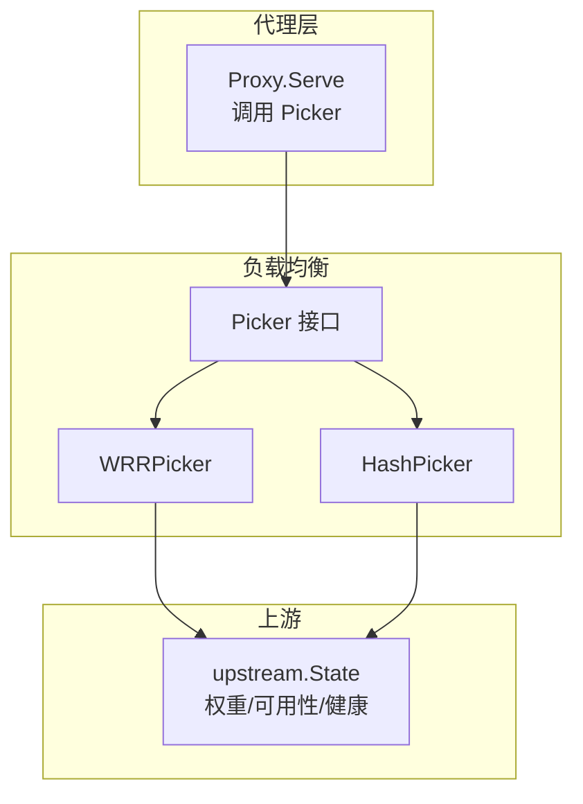
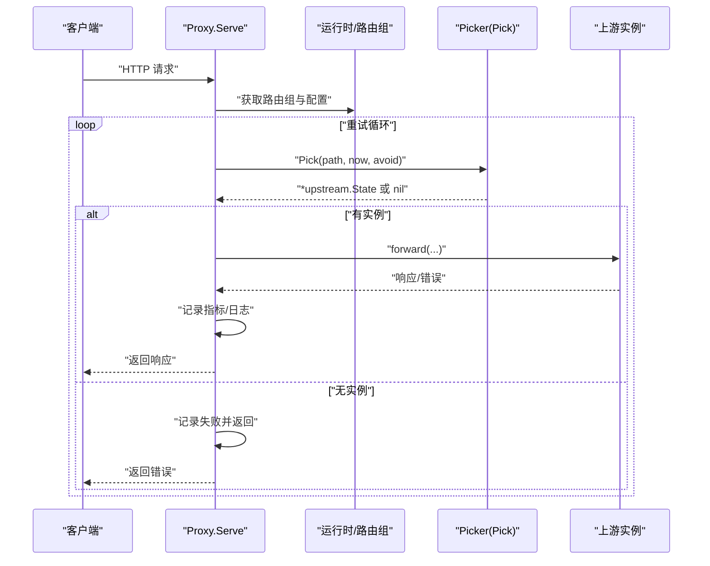
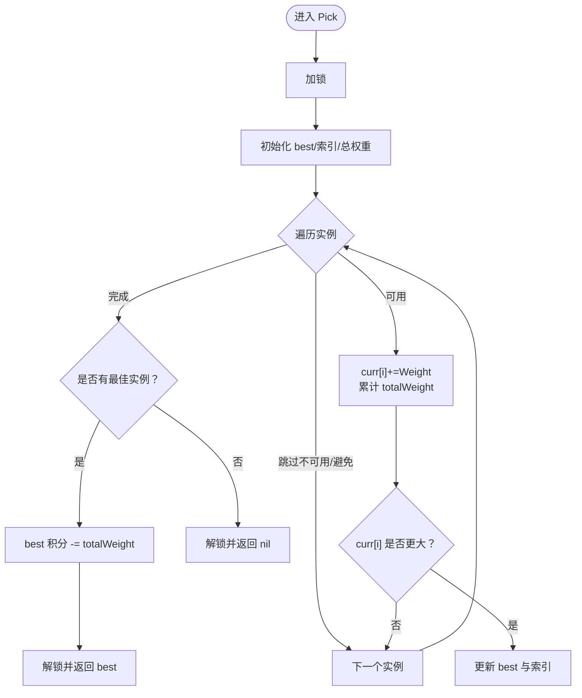
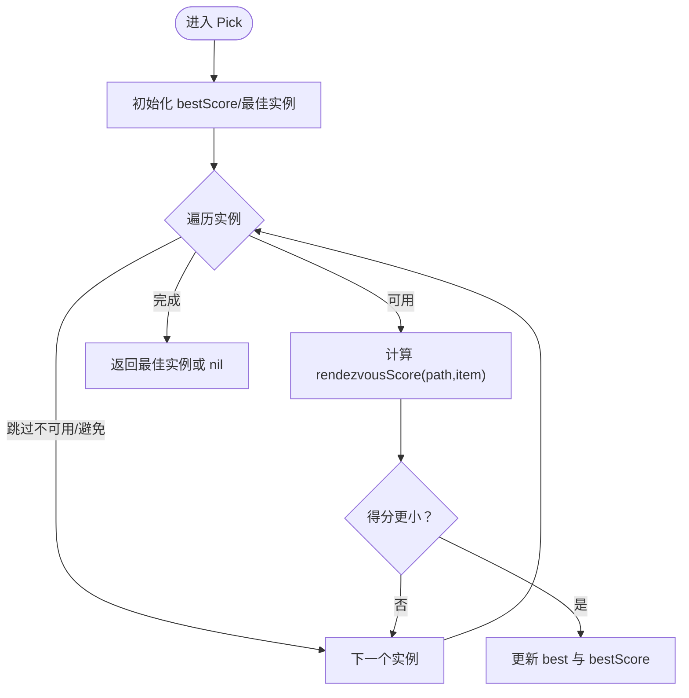
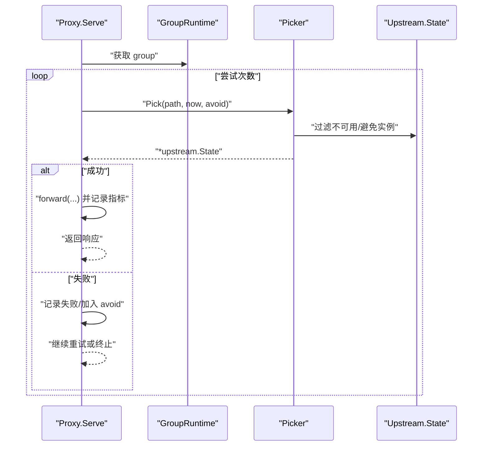
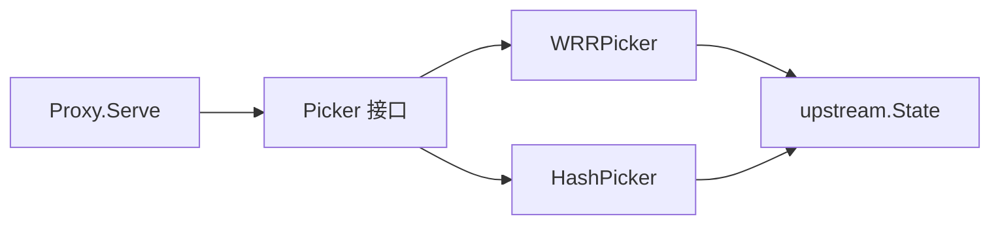

# 负载均衡策略

<cite>
**本文引用的文件**
- [internal/lb/wrr.go](file://internal/lb/wrr.go)
- [internal/lb/hash.go](file://internal/lb/hash.go)
- [internal/lb/picker.go](file://internal/lb/picker.go)
- [internal/proxy/proxy.go](file://internal/proxy/proxy.go)
- [internal/lb/wrr_test.go](file://internal/lb/wrr_test.go)
- [internal/lb/hash_test.go](file://internal/lb/hash_test.go)
- [internal/upstream/state.go](file://internal/upstream/state.go)
- [internal/runtime/runtime.go](file://internal/runtime/runtime.go)
</cite>

## 目录
1. [引言](#引言)
2. [项目结构](#项目结构)
3. [核心组件](#核心组件)
4. [架构总览](#架构总览)
5. [详细组件分析](#详细组件分析)
6. [依赖关系分析](#依赖关系分析)
7. [性能考量](#性能考量)
8. [故障排查指南](#故障排查指南)
9. [结论](#结论)
10. [附录](#附录)

## 引言
本文件聚焦于仓库内“负载均衡”子系统，围绕两种策略展开：加权轮询（Weighted Round Robin, WRR）与一致性哈希（Rendezvous Hash）。我们将从代码实现、数据流、并发控制、错误处理与性能特征等维度进行深入剖析，并结合代理层调用链说明其在请求处理流程中的位置，最后通过测试用例解读两种策略的公平性与稳定性表现及适用场景。

## 项目结构
- 负载均衡策略位于 internal/lb 下：
  - picker.go 定义统一的 Picker 接口，抽象出 Pick 方法签名，便于替换不同策略。
  - wrr.go 实现 WRRPicker，维护每条上游实例的当前权重积分，提供基于权重的实例选择。
  - hash.go 实现 HashPicker，采用 Rendezvous 哈希（最高随机权重法），结合 FNV-64a 哈希与权重归一化，确保路径到实例的稳定映射。
- 上游状态定义位于 internal/upstream/state.go，包含权重、健康状态、可用性判断等，为 Pick 提供基础数据。
- 代理层 internal/proxy/proxy.go 在转发前调用 group.Picker.Pick 获取上游实例，贯穿重试、降级与可观测性记录。
- 测试位于 internal/lb 下的 wrr_test.go 与 hash_test.go，分别验证 WRR 的权重分布公平性与 Hash 的路由稳定性。



图表来源
- [internal/lb/picker.go](file://internal/lb/picker.go#L8-L10)
- [internal/lb/wrr.go](file://internal/lb/wrr.go#L9-L13)
- [internal/lb/hash.go](file://internal/lb/hash.go#L10-L12)
- [internal/upstream/state.go](file://internal/upstream/state.go#L9-L21)
- [internal/proxy/proxy.go](file://internal/proxy/proxy.go#L133-L146)

章节来源
- [internal/lb/picker.go](file://internal/lb/picker.go#L8-L10)
- [internal/lb/wrr.go](file://internal/lb/wrr.go#L9-L13)
- [internal/lb/hash.go](file://internal/lb/hash.go#L10-L12)
- [internal/upstream/state.go](file://internal/upstream/state.go#L9-L21)
- [internal/proxy/proxy.go](file://internal/proxy/proxy.go#L133-L146)

## 核心组件
- Picker 接口：统一的 Pick 方法签名，接收路径、当前时间与避免集合，返回上游实例或空。
- WRRPicker：维护 items 列表与 curr 积分数组，使用互斥锁保护 Pick 并发安全；Pick 中对可用且未被避免的实例累加其权重到 curr，并以最大 curr 选优，随后将胜者积分回扣为总权重的负值，形成“加权轮询”的积分回退。
- HashPicker：遍历可用且未被避免的实例，计算 rendezvousScore（基于 FNV-64a 哈希与权重归一化），取最小得分对应的实例，实现路径到实例的稳定映射。
- upstream.State：提供 Weight、Available(now) 等字段与方法，决定实例是否参与选择。

章节来源
- [internal/lb/picker.go](file://internal/lb/picker.go#L8-L10)
- [internal/lb/wrr.go](file://internal/lb/wrr.go#L9-L13)
- [internal/lb/wrr.go](file://internal/lb/wrr.go#L23-L50)
- [internal/lb/hash.go](file://internal/lb/hash.go#L10-L12)
- [internal/lb/hash.go](file://internal/lb/hash.go#L19-L38)
- [internal/lb/hash.go](file://internal/lb/hash.go#L40-L49)
- [internal/upstream/state.go](file://internal/upstream/state.go#L9-L21)
- [internal/upstream/state.go](file://internal/upstream/state.go#L34-L41)

## 架构总览
下图展示了代理层在请求处理链中调用 Picker 的关键流程：获取运行时配置 -> 选择路由组 -> 循环尝试（含重试与避免已失败实例）-> 调用 group.Picker.Pick -> 发送上游请求 -> 记录指标与日志。



图表来源
- [internal/proxy/proxy.go](file://internal/proxy/proxy.go#L133-L173)
- [internal/lb/picker.go](file://internal/lb/picker.go#L8-L10)

章节来源
- [internal/proxy/proxy.go](file://internal/proxy/proxy.go#L133-L173)

## 详细组件分析

### WRRPicker 组件分析
- 数据结构与并发
  - 结构体包含 items（上游实例列表）、curr（当前权重积分数组）与互斥锁。构造函数初始化 curr 长度与 items 对齐。
  - Pick 方法在开始与结束处加锁/解锁，保证多线程环境下 curr 数组与选择过程的原子性。
- 选择逻辑
  - 遍历 items，跳过被 avoid 标记或不可用的实例；对可用实例累加其 Weight 到 curr[i]，同时累计 totalWeight。
  - 选择 curr[i] 最大的实例作为最佳候选；若没有可用实例则返回空。
  - 将最佳实例的 curr[bestIdx] 回扣为 -totalWeight，使后续轮询中其他实例有机会被选中，从而实现“加权轮询”的积分回退。
- 复杂度与性能
  - 单次 Pick 为 O(n)，n 为上游实例数；加锁粒度覆盖整个选择过程，适合实例数量较小或高并发但低延迟要求的场景。
- 错误处理
  - 当所有实例均被避免或不可用时返回空，上层代理层据此决定是否继续重试或终止。



图表来源
- [internal/lb/wrr.go](file://internal/lb/wrr.go#L23-L50)

章节来源
- [internal/lb/wrr.go](file://internal/lb/wrr.go#L9-L13)
- [internal/lb/wrr.go](file://internal/lb/wrr.go#L23-L50)
- [internal/upstream/state.go](file://internal/upstream/state.go#L34-L41)

### HashPicker 组件分析
- 数据结构
  - 结构体仅持有 items 列表，无需额外状态。
- 选择逻辑
  - 遍历可用且未被避免的实例，计算 rendezvousScore(path, item)。
  - rendezvousScore 使用 FNV-64a 哈希对 path 与实例 HostLabel 拼接后的字节串进行哈希，得到 64 位无符号整数。
  - 将哈希值映射到 (0,1] 区间 u，再计算 -log(u) / item.Weight，得到“最高随机权重”意义上的得分越小越优。
  - 返回最小得分对应的实例，实现路径到实例的稳定映射。
- 复杂度与性能
  - 单次 Pick 为 O(n)，包含一次哈希计算；整体开销与 WRR 类似，但具备稳定路由特性。
- 错误处理
  - 与 WRR 一致，当无可选实例时返回空。



图表来源
- [internal/lb/hash.go](file://internal/lb/hash.go#L19-L38)
- [internal/lb/hash.go](file://internal/lb/hash.go#L40-L49)

章节来源
- [internal/lb/hash.go](file://internal/lb/hash.go#L10-L12)
- [internal/lb/hash.go](file://internal/lb/hash.go#L19-L38)
- [internal/lb/hash.go](file://internal/lb/hash.go#L40-L49)

### Picker 接口与可插拔性
- 接口定义统一了 Pick 方法签名，使得代理层仅依赖接口，不关心具体策略实现。
- 运行时配置中 group.Picker 为 lb.Picker 类型，可在运行时注入 WRR 或 Hash 实例，实现策略切换与热更新。

```mermaid
classDiagram
class Picker {
+Pick(path string, now time.Time, avoid map[*upstream.State]struct{}) *upstream.State
}
class WRRPicker {
-items []*upstream.State
-curr []int
-mu Mutex
+Pick(...)
}
class HashPicker {
-items []*upstream.State
}
class State {
+Weight int
+Available(now time.Time) bool
+HostLabel string
}
Picker <|.. WRRPicker
Picker <|.. HashPicker
WRRPicker --> State : "使用"
HashPicker --> State : "使用"
```

图表来源
- [internal/lb/picker.go](file://internal/lb/picker.go#L8-L10)
- [internal/lb/wrr.go](file://internal/lb/wrr.go#L9-L13)
- [internal/lb/hash.go](file://internal/lb/hash.go#L10-L12)
- [internal/upstream/state.go](file://internal/upstream/state.go#L9-L21)

章节来源
- [internal/lb/picker.go](file://internal/lb/picker.go#L8-L10)
- [internal/runtime/runtime.go](file://internal/runtime/runtime.go#L42-L42)

### 代理层调用链与负载均衡位置
- 代理层在每次请求处理中：
  - 获取运行时与路由组；
  - 构建重试链路（fallbackChain）；
  - 在每次尝试中调用 group.Picker.Pick 获取上游实例；
  - 若发生可重试错误，则将本次选择加入 avoid 集合，避免重复失败；
  - 成功后记录指标、缓存响应并返回。
- Pick 在代理层的调用点位于重试循环内部，确保每次尝试都可能更换上游实例（WRR 的积分回扣或 Hash 的稳定映射）。



图表来源
- [internal/proxy/proxy.go](file://internal/proxy/proxy.go#L133-L173)

章节来源
- [internal/proxy/proxy.go](file://internal/proxy/proxy.go#L133-L173)

## 依赖关系分析
- Picker 接口被代理层依赖，策略实现依赖 upstream.State 的可用性与权重信息。
- WRRPicker 依赖 upstream.State 的 Weight 与 Available(now)；HashPicker 依赖 HostLabel 与 Weight。
- 运行时配置中 group.Picker 为 lb.Picker，体现策略的可插拔性。



图表来源
- [internal/proxy/proxy.go](file://internal/proxy/proxy.go#L133-L146)
- [internal/lb/picker.go](file://internal/lb/picker.go#L8-L10)
- [internal/lb/wrr.go](file://internal/lb/wrr.go#L9-L13)
- [internal/lb/hash.go](file://internal/lb/hash.go#L10-L12)
- [internal/upstream/state.go](file://internal/upstream/state.go#L34-L41)

章节来源
- [internal/proxy/proxy.go](file://internal/proxy/proxy.go#L133-L146)
- [internal/lb/picker.go](file://internal/lb/picker.go#L8-L10)
- [internal/lb/wrr.go](file://internal/lb/wrr.go#L9-L13)
- [internal/lb/hash.go](file://internal/lb/hash.go#L10-L12)
- [internal/upstream/state.go](file://internal/upstream/state.go#L34-L41)

## 性能考量
- 时间复杂度
  - 两种策略均为 O(n) 遍历，n 为上游实例数；WRR 额外维护 curr 数组，空间 O(n)。
- 并发安全
  - WRRPicker 使用互斥锁保护 Pick 全过程，避免竞态；HashPicker 无状态，天然无锁。
- 可扩展性
  - Picker 接口抽象利于新增策略；上游状态包含健康与弹出（eject）机制，配合 avoid 集合提升整体可用性。
- 重试与降级
  - 代理层在可重试错误时将失败实例加入 avoid，减少热点失败实例的再次选择，提高成功率。

[本节为通用性能讨论，不直接分析具体文件]

## 故障排查指南
- 无可用实例
  - 现象：Pick 返回空，代理层记录失败并终止。
  - 排查：检查 upstream.State 的可用性（健康状态、弹出时间）与 avoid 集合是否过大。
- 权重分布不公平（WRR）
  - 现象：低权重实例被频繁选中。
  - 排查：确认 Weight 设置与实例数量；观察 Pick 的积分回扣是否生效。
- 路由不稳定（Hash）
  - 现象：同一路径在不同时间映射到不同实例。
  - 排查：确认 HostLabel 是否变化；检查实例列表是否动态变更。
- 重试与降级
  - 现象：连续失败导致上游被弹出或长时间不可用。
  - 排查：查看被动弹出阈值、指数退避与弹出时长配置。

章节来源
- [internal/lb/wrr.go](file://internal/lb/wrr.go#L23-L50)
- [internal/lb/hash.go](file://internal/lb/hash.go#L19-L38)
- [internal/upstream/state.go](file://internal/upstream/state.go#L34-L41)
- [internal/proxy/proxy.go](file://internal/proxy/proxy.go#L133-L173)

## 结论
- WRR 通过积分回扣实现“加权轮询”，适合后端性能异构、追求总体吞吐与公平分配的场景。
- Hash 通过 Rendezvous 哈希与权重归一化实现“路径稳定映射”，适合缓存亲和性、会话粘性等强路由稳定需求。
- Picker 接口抽象与代理层调用链共同实现了策略的可插拔与易维护性；结合上游健康与弹出机制，进一步提升了系统的鲁棒性。

[本节为总结性内容，不直接分析具体文件]

## 附录

### 测试用例解读
- WRR 权重分布公平性
  - 测试创建两个权重分别为 3 与 1 的上游实例，执行多次 Pick，断言权重更高的实例被选中的次数显著更多，且满足权重偏斜的预期。
- Hash 路由稳定性
  - 测试固定路径“/stable”，多次 Pick 应始终返回同一实例，验证 Rendezvous 哈希与 FNV-64a 的稳定映射能力。

章节来源
- [internal/lb/wrr_test.go](file://internal/lb/wrr_test.go#L11-L30)
- [internal/lb/hash_test.go](file://internal/lb/hash_test.go#L11-L26)

### 适用场景建议
- WRR 适用于：
  - 后端性能差异较大，需要按权重分配流量；
  - 追求整体吞吐与资源利用率的场景。
- Hash 适用于：
  - 需要缓存亲和性或会话粘性的场景；
  - 要求路径到实例映射稳定的场景。

[本节为通用建议，不直接分析具体文件]