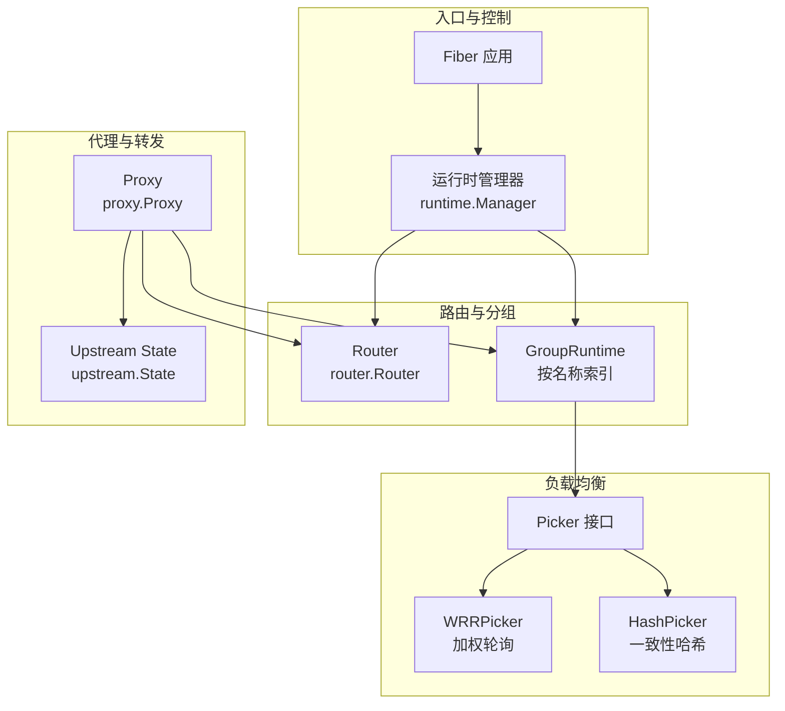
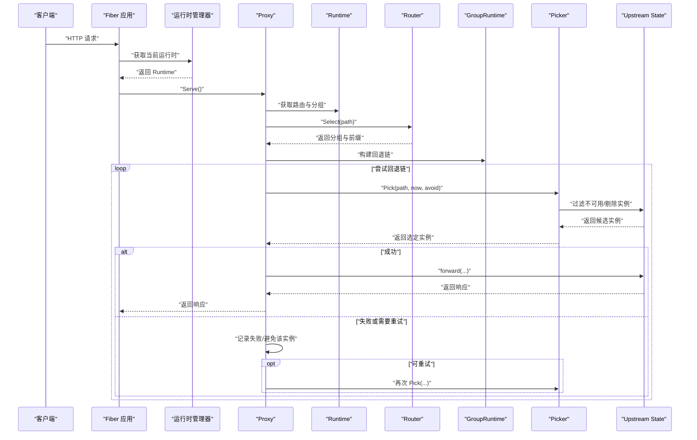
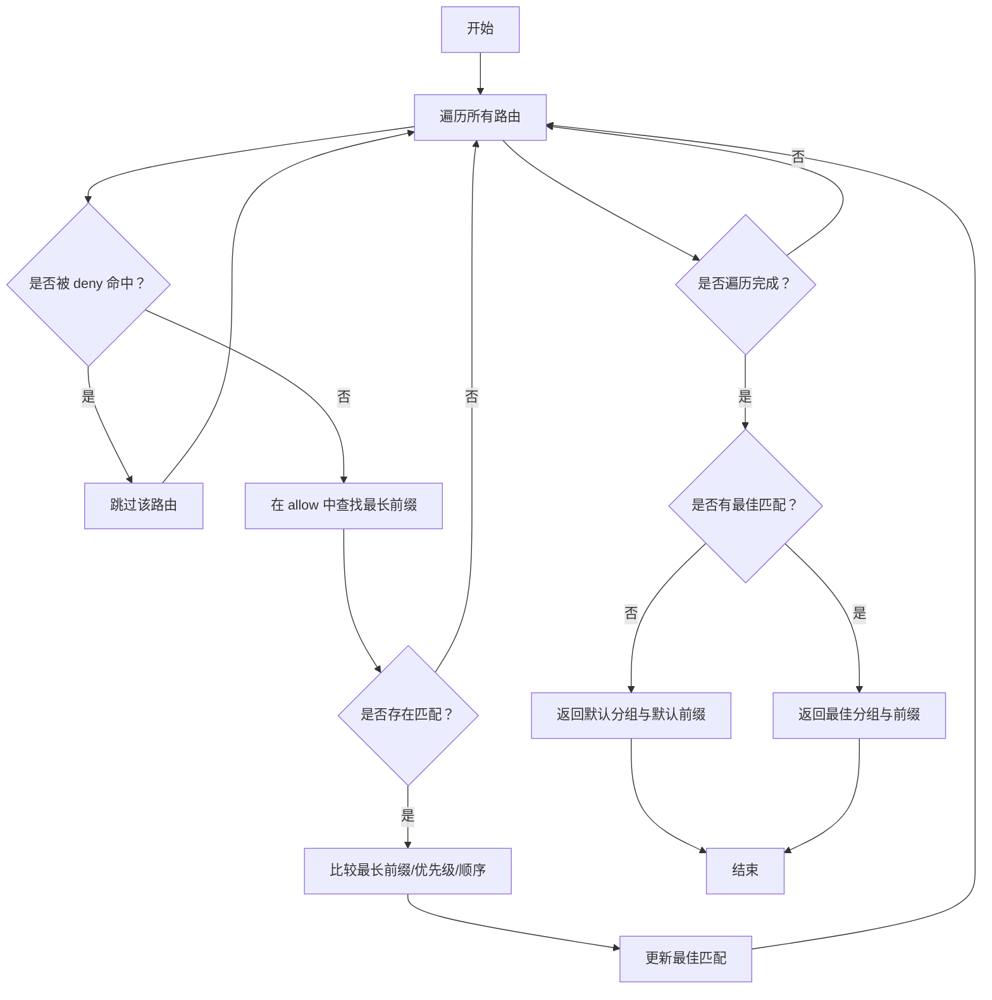
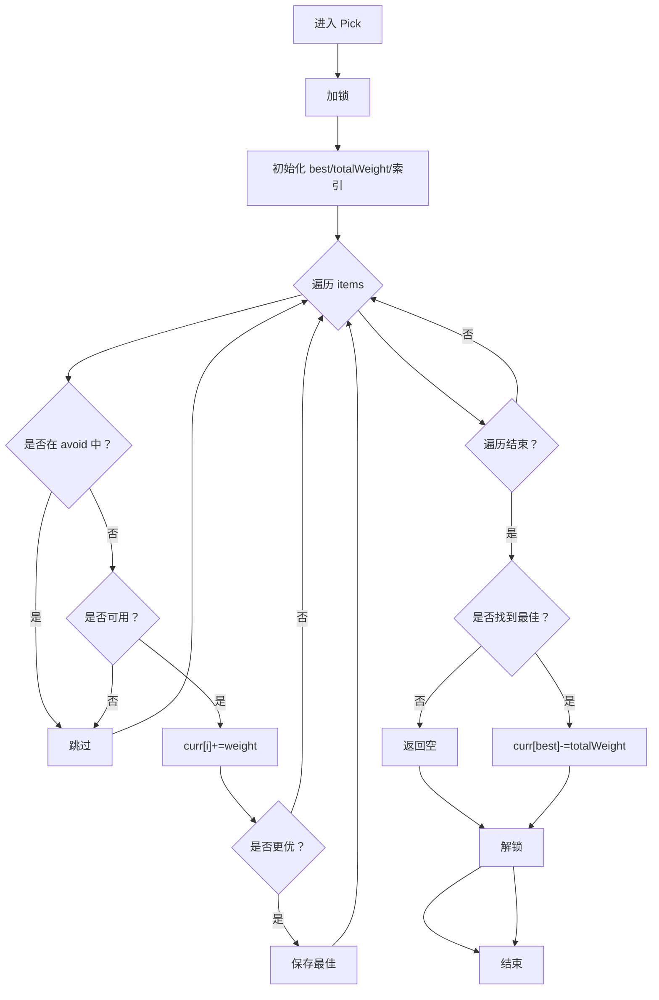
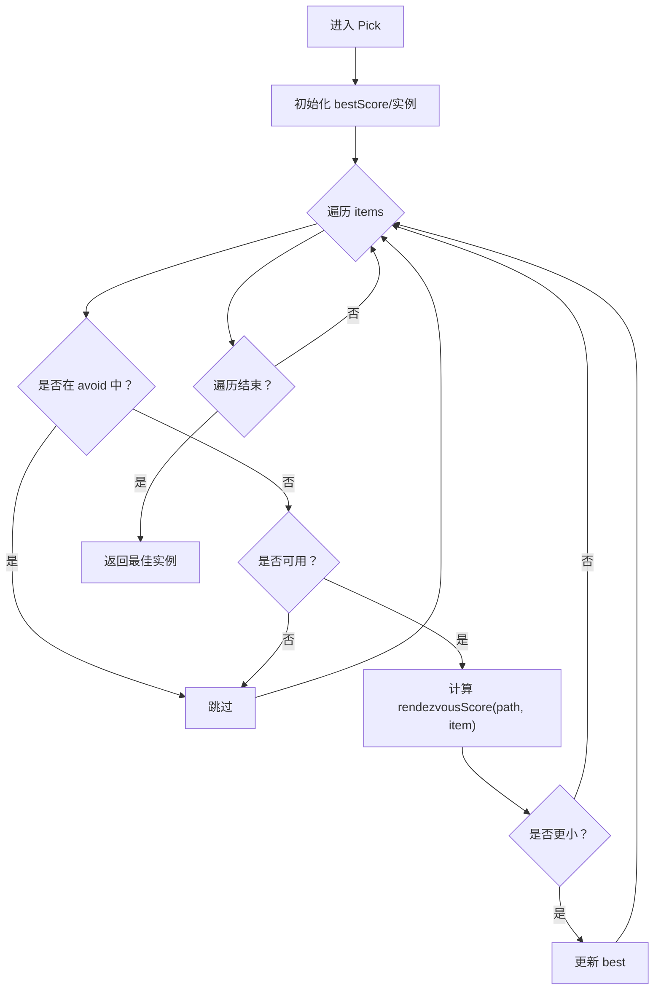
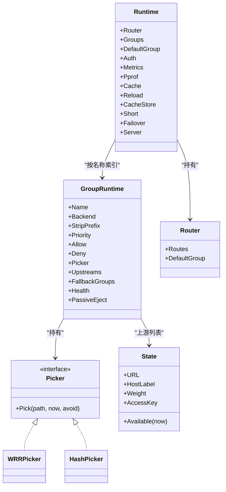
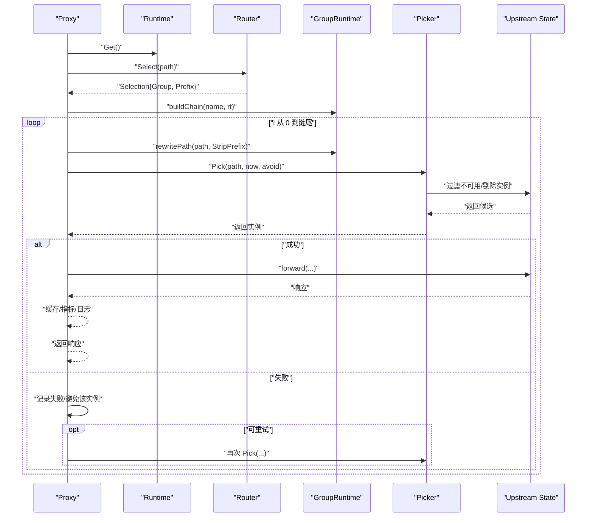
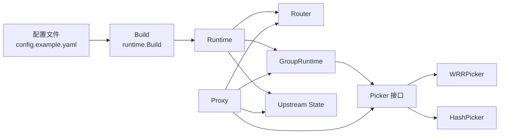

# 路由与负载均衡

<cite>
**本文引用的文件**
- [internal/router/router.go](file://internal/router/router.go)
- [internal/lb/picker.go](file://internal/lb/picker.go)
- [internal/lb/wrr.go](file://internal/lb/wrr.go)
- [internal/lb/hash.go](file://internal/lb/hash.go)
- [internal/proxy/proxy.go](file://internal/proxy/proxy.go)
- [internal/runtime/runtime.go](file://internal/runtime/runtime.go)
- [internal/upstream/state.go](file://internal/upstream/state.go)
- [config.example.yaml](file://config.example.yaml)
</cite>

## 目录
1. [简介](#简介)
2. [项目结构](#项目结构)
3. [核心组件](#核心组件)
4. [架构总览](#架构总览)
5. [详细组件分析](#详细组件分析)
6. [依赖关系分析](#依赖关系分析)
7. [性能考量](#性能考量)
8. [故障排查指南](#故障排查指南)
9. [结论](#结论)
10. [附录：配置示例与策略建议](#附录配置示例与策略建议)

## 简介
本文件围绕“路由与负载均衡”主题，系统阐述以下内容：
- 分组路由机制：基于路径前缀的 allow/deny 匹配与优先级排序规则
- 负载均衡策略：WRR（加权轮询）与一致性哈希（Rendezvous/Hash）的具体实现与差异
- picker 接口如何抽象负载均衡行为
- 结合代理层请求处理流程，展示从路由匹配到上游实例选择的完整数据流
- 配置示例与不同场景下的策略选择建议，特别强调一致性哈希在缓存亲和性场景中的优势

## 项目结构
本项目采用按职责分层的组织方式：
- 路由层：负责将请求路径映射到上游分组
- 负载均衡层：通过 picker 抽象不同算法，选择具体上游实例
- 代理层：执行鉴权、缓存、重试、故障转移与转发
- 运行时层：装配路由、分组、负载均衡器与上游状态
- 上游状态：维护实例健康、剔除与权重等信息

图表来源
- [internal/runtime/manager.go](file://internal/runtime/manager.go#L69-L75)
- [internal/runtime/runtime.go](file://internal/runtime/runtime.go#L19-L31)
- [internal/router/router.go](file://internal/router/router.go#L19-L23)
- [internal/lb/picker.go](file://internal/lb/picker.go#L8-L12)
- [internal/lb/wrr.go](file://internal/lb/wrr.go#L9-L14)
- [internal/lb/hash.go](file://internal/lb/hash.go#L10-L12)
- [internal/proxy/proxy.go](file://internal/proxy/proxy.go#L42-L83)
- [internal/upstream/state.go](file://internal/upstream/state.go#L9-L21)

章节来源
- [internal/runtime/manager.go](file://internal/runtime/manager.go#L69-L75)
- [internal/runtime/runtime.go](file://internal/runtime/runtime.go#L19-L31)

## 核心组件
- 路由器 Router：根据 allow/deny 前缀集合与优先级选择最佳分组
- 负载均衡 Picker 接口：统一抽象 pick 策略
- WRRPicker：基于权重的轮询状态数组，支持避免已知不可用实例
- HashPicker：基于路径与实例标签的一致性哈希（Rendezvous），实现亲和性
- Proxy：鉴权、缓存、重试、故障转移与转发
- GroupRuntime：承载分组配置、picker 实例、上游列表与回退链
- Upstream State：实例健康、剔除时间、权重与可用性判断

章节来源
- [internal/router/router.go](file://internal/router/router.go#L5-L18)
- [internal/lb/picker.go](file://internal/lb/picker.go#L8-L12)
- [internal/lb/wrr.go](file://internal/lb/wrr.go#L9-L14)
- [internal/lb/hash.go](file://internal/lb/hash.go#L10-L12)
- [internal/proxy/proxy.go](file://internal/proxy/proxy.go#L42-L83)
- [internal/runtime/runtime.go](file://internal/runtime/runtime.go#L36-L48)
- [internal/upstream/state.go](file://internal/upstream/state.go#L9-L21)

## 架构总览
下面以序列图展示一次请求从进入网关到上游实例选择与转发的关键步骤。

图表来源
- [internal/runtime/manager.go](file://internal/runtime/manager.go#L69-L75)
- [internal/proxy/proxy.go](file://internal/proxy/proxy.go#L42-L183)
- [internal/router/router.go](file://internal/router/router.go#L29-L56)
- [internal/runtime/runtime.go](file://internal/runtime/runtime.go#L36-L48)
- [internal/lb/picker.go](file://internal/lb/picker.go#L8-L12)
- [internal/upstream/state.go](file://internal/upstream/state.go#L34-L41)

## 详细组件分析

### 分组路由机制（router.go）
- 路由结构
  - Route：包含允许前缀、拒绝前缀、优先级与顺序
  - Selection：输出分组名与匹配到的路由前缀
- 选择逻辑
  - 先检查 deny，命中即跳过
  - 在 allow 中寻找最长前缀匹配
  - 若存在多个匹配，按“最长前缀 > 优先级 > 顺序”进行排序
  - 若无匹配，使用默认分组与默认前缀
- 关键函数
  - Select：主流程
  - matchesDeny：前缀匹配
  - longestAllow：最长前缀匹配

图表来源
- [internal/router/router.go](file://internal/router/router.go#L29-L56)
- [internal/router/router.go](file://internal/router/router.go#L58-L80)

章节来源
- [internal/router/router.go](file://internal/router/router.go#L5-L18)
- [internal/router/router.go](file://internal/router/router.go#L29-L56)
- [internal/router/router.go](file://internal/router/router.go#L58-L80)

### 负载均衡策略（picker.go、wrr.go、hash.go）

#### picker 接口抽象
- 统一签名：Pick(path, now, avoid) -> *upstream.State
- 作用：屏蔽具体算法细节，便于替换与扩展

章节来源
- [internal/lb/picker.go](file://internal/lb/picker.go#L8-L12)

#### WRR（加权轮询）实现（wrr.go）
- 数据结构
  - items：上游实例列表
  - curr：每个实例的当前计数（随权重累加）
  - mu：互斥锁，保证 Pick 的并发安全
- 选择过程
  - 忽略 avoid 中的实例
  - 忽略不可用实例（Available(now)）
  - 对每个候选实例加上其权重，记录最大值
  - 若存在候选，将“被选中实例”的 curr 减去总权重，实现轮询
- 复杂度
  - 时间复杂度 O(n)，n 为候选实例数量
  - 空间复杂度 O(n)

图表来源
- [internal/lb/wrr.go](file://internal/lb/wrr.go#L23-L50)
- [internal/upstream/state.go](file://internal/upstream/state.go#L34-L41)

章节来源
- [internal/lb/wrr.go](file://internal/lb/wrr.go#L9-L14)
- [internal/lb/wrr.go](file://internal/lb/wrr.go#L23-L50)
- [internal/upstream/state.go](file://internal/upstream/state.go#L34-L41)

#### 一致性哈希（Rendezvous/Hash）实现（hash.go）
- 数据结构
  - items：上游实例列表
- 选择过程
  - 忽略 avoid 中的实例
  - 忽略不可用实例
  - 对每个候选实例计算“分数”，取最小分数者
  - 分数由路径与实例 HostLabel 的哈希决定，再按权重归一化
- 特点
  - 同一路径总是落到同一实例，适合缓存亲和性
  - 权重影响被选概率，但不改变“同一路径固定”的特性

图表来源
- [internal/lb/hash.go](file://internal/lb/hash.go#L19-L38)
- [internal/lb/hash.go](file://internal/lb/hash.go#L40-L49)

章节来源
- [internal/lb/hash.go](file://internal/lb/hash.go#L10-L12)
- [internal/lb/hash.go](file://internal/lb/hash.go#L19-L38)
- [internal/lb/hash.go](file://internal/lb/hash.go#L40-L49)

#### 运行时装配与回退链（runtime.go）
- GroupRuntime 字段
  - Backend、StripPrefix、Priority、Allow、Deny、Picker、Upstreams、FallbackGroups、Health、PassiveEject
- Build 流程
  - 解析上游 URL、构造 State
  - 根据 LB.policy 创建对应 Picker
  - 构建路由表（Route 列表），并设置默认分组
- 回退链
  - buildChain 将主分组与回退分组拼接为链，依次尝试

图表来源
- [internal/runtime/runtime.go](file://internal/runtime/runtime.go#L19-L48)
- [internal/router/router.go](file://internal/router/router.go#L19-L23)
- [internal/lb/picker.go](file://internal/lb/picker.go#L8-L12)
- [internal/lb/wrr.go](file://internal/lb/wrr.go#L9-L14)
- [internal/lb/hash.go](file://internal/lb/hash.go#L10-L12)
- [internal/upstream/state.go](file://internal/upstream/state.go#L9-L21)

章节来源
- [internal/runtime/runtime.go](file://internal/runtime/runtime.go#L50-L119)
- [internal/runtime/runtime.go](file://internal/runtime/runtime.go#L36-L48)
- [internal/runtime/runtime.go](file://internal/runtime/runtime.go#L383-L392)

### 代理层请求处理流程（proxy.go）
- 主流程要点
  - 获取运行时、鉴权、短链处理、指标与 pprof 路径处理
  - 路由选择：rt.Router.Select(path)
  - 构建回退链：buildChain(groupName, rt)
  - 循环尝试：对每个分组尝试 Pick，支持重试与避免已知失败实例
  - 转发：forward，设置超时、注入参数、复制头与体
  - 缓存：命中直接返回，未命中按策略写入
  - 指标与日志：记录请求耗时、状态、回退链、剔除等

图表来源
- [internal/proxy/proxy.go](file://internal/proxy/proxy.go#L42-L183)
- [internal/proxy/proxy.go](file://internal/proxy/proxy.go#L191-L228)
- [internal/proxy/proxy.go](file://internal/proxy/proxy.go#L383-L392)

章节来源
- [internal/proxy/proxy.go](file://internal/proxy/proxy.go#L42-L183)
- [internal/proxy/proxy.go](file://internal/proxy/proxy.go#L191-L228)
- [internal/proxy/proxy.go](file://internal/proxy/proxy.go#L383-L392)

## 依赖关系分析
- 路由层依赖于运行时中的分组配置（Allow/Deny/Priority/Order）
- 负载均衡层依赖上游状态（权重、可用性、剔除时间）
- 代理层依赖运行时的 Router、Groups、Picker 与 Upstreams
- 运行时在 Build 时根据配置选择 Picker 并装配路由

图表来源
- [config.example.yaml](file://config.example.yaml#L133-L264)
- [internal/runtime/runtime.go](file://internal/runtime/runtime.go#L50-L119)
- [internal/proxy/proxy.go](file://internal/proxy/proxy.go#L42-L83)

章节来源
- [internal/runtime/runtime.go](file://internal/runtime/runtime.go#L50-L119)
- [internal/proxy/proxy.go](file://internal/proxy/proxy.go#L42-L83)

## 性能考量
- WRR
  - 优点：公平分配，权重越高命中越多；实现简单，常用于通用流量分发
  - 注意：在实例数量较多时，每次 Pick 需要遍历，注意避免不必要的实例过多
- 一致性哈希
  - 优点：路径到实例的稳定性强，适合缓存亲和性与会话亲和
  - 注意：权重影响概率，但不改变“同路径固定”；实例增减可能引起热点迁移
- 上游剔除与健康检查
  - Upstream State 提供剔除时间窗口与指数退避，降低对故障实例的请求
- 代理层优化
  - 缓存命中直接返回，减少下游压力
  - 重试策略仅对 GET/HEAD 生效，避免对幂等性敏感的请求造成额外负担

[本节为通用指导，不直接分析具体文件]

## 故障排查指南
- 路由未命中
  - 检查 allow/deny 前缀是否正确，deny 优先于 allow
  - 确认最长前缀与优先级/顺序是否满足预期
- 负载均衡无效
  - 确认上游权重设置与实例可用性
  - 检查 avoid 集合是否导致全部实例被跳过
- 一致性哈希亲和异常
  - 确认路径稳定且 HostLabel 未频繁变化
  - 检查实例数量与权重分布
- 代理层错误
  - 查看错误类型（timeout/connect）与状态码映射
  - 检查回退链与重试次数
  - 关注剔除日志与指标

章节来源
- [internal/router/router.go](file://internal/router/router.go#L58-L80)
- [internal/lb/wrr.go](file://internal/lb/wrr.go#L23-L50)
- [internal/lb/hash.go](file://internal/lb/hash.go#L19-L38)
- [internal/proxy/proxy.go](file://internal/proxy/proxy.go#L300-L302)
- [internal/proxy/proxy.go](file://internal/proxy/proxy.go#L359-L364)
- [internal/upstream/state.go](file://internal/upstream/state.go#L84-L102)

## 结论
- 分组路由通过 allow/deny 与优先级排序，确保路径到分组的确定性与可控性
- Picker 接口将算法抽象化，便于在 WRR 与一致性哈希之间灵活切换
- 代理层串联鉴权、缓存、重试与故障转移，形成完整的请求处理闭环
- 在缓存亲和与稳定性要求高的场景，推荐使用一致性哈希；在通用流量分发与公平性优先时，推荐 WRR

[本节为总结性内容，不直接分析具体文件]

## 附录：配置示例与策略建议

### 配置要点（来自示例配置）
- 路由默认组：当无路由匹配时使用的分组
- 分组字段
  - backend：后端类型（如 rsshub、upvote）
  - strip_prefix：转发前剥离的前缀
  - priority：优先级，用于前缀长度相同时的决胜条件
  - allow/deny：前缀匹配，deny 优先
  - lb.policy：负载均衡策略（wrr 或 hash）
  - fallback_groups：回退分组列表，按顺序尝试
  - health.active：主动健康检查配置
  - upstreams：上游列表，含 url、weight、access_key
- 全局策略
  - failover.retry.enabled/max_retries：GET/HEAD 的重试策略
  - failover.passive_eject：被动剔除阈值与退避

章节来源
- [config.example.yaml](file://config.example.yaml#L133-L264)

### 策略选择建议
- 通用流量分发
  - 使用 WRR，依据权重分配流量，适合多实例均衡
- 缓存亲和与会话亲和
  - 使用一致性哈希，确保同一路径始终命中同一实例，提升缓存命中率
- 回退链与高可用
  - 为主分组配置 fallback_groups，配合重试与被动剔除，提升整体可用性
- 安全与可观测性
  - 开启鉴权、指标与 pprof，便于监控与排障

[本节为实践建议，不直接分析具体文件]