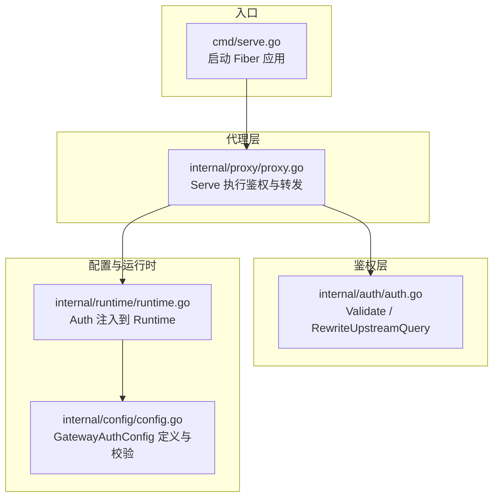
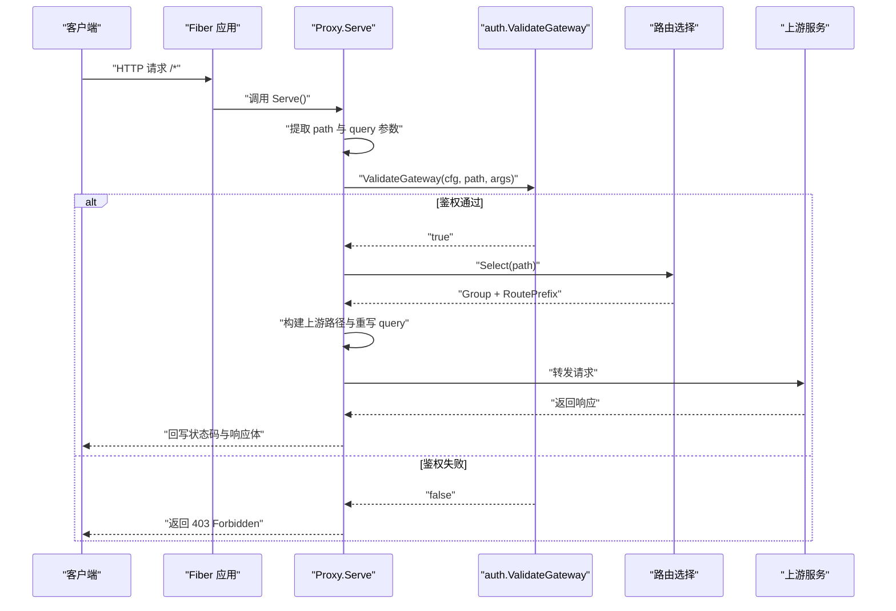
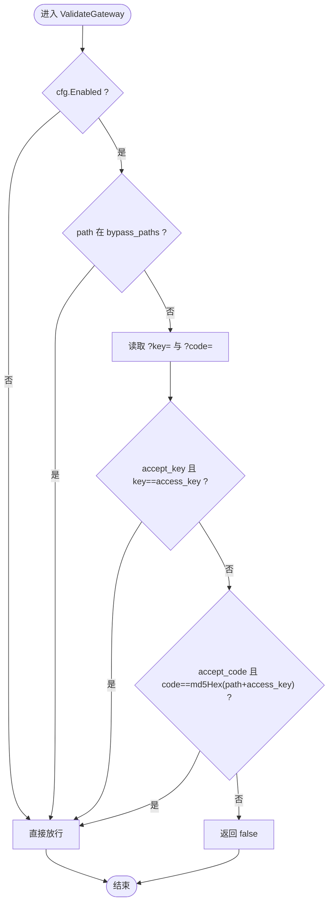
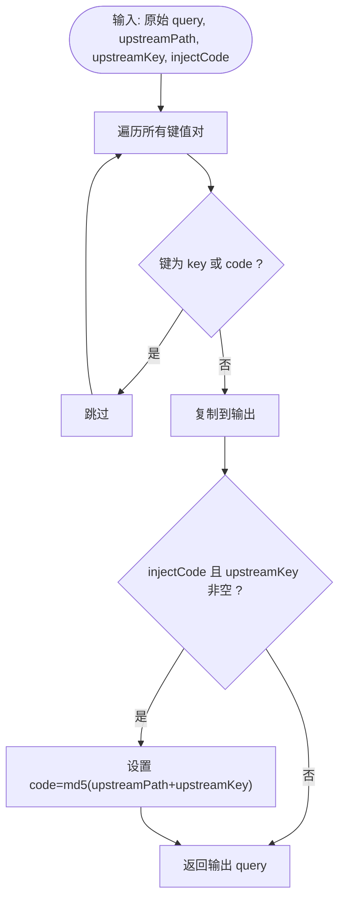
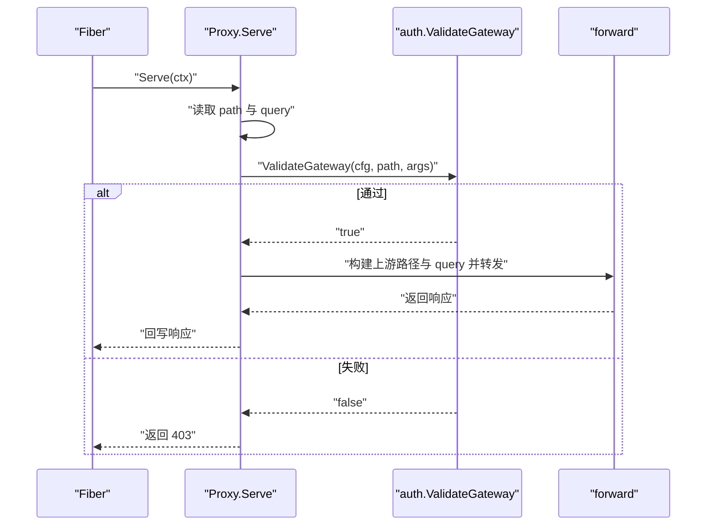
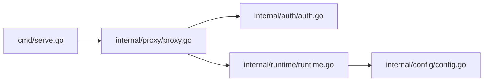
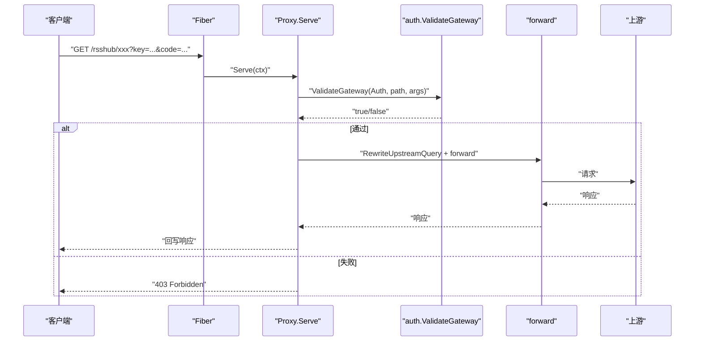

# 鉴权机制

<cite>
**本文引用的文件列表**
- [internal/auth/auth.go](file://internal/auth/auth.go)
- [internal/auth/auth_test.go](file://internal/auth/auth_test.go)
- [internal/proxy/proxy.go](file://internal/proxy/proxy.go)
- [internal/config/config.go](file://internal/config/config.go)
- [internal/runtime/runtime.go](file://internal/runtime/runtime.go)
- [cmd/serve.go](file://cmd/serve.go)
- [config.example.yaml](file://config.example.yaml)
- [internal/router/router.go](file://internal/router/router.go)
</cite>

## 目录
1. [简介](#简介)
2. [项目结构](#项目结构)
3. [核心组件](#核心组件)
4. [架构总览](#架构总览)
5. [组件详解](#组件详解)
6. [依赖关系分析](#依赖关系分析)
7. [性能考量](#性能考量)
8. [故障排查指南](#故障排查指南)
9. [结论](#结论)
10. [附录](#附录)

## 简介
本文件系统化阐述 RSSHub 网关的鉴权机制，重点覆盖两种认证方式：
- 密钥（key）：通过查询参数 ?key= 提交全局访问密钥进行校验
- 网关码（code）：通过查询参数 ?code=md5(path+access_key) 的签名进行校验

同时，文档详细说明白名单路径（bypass_paths）的匹配机制、鉴权中间件在请求转发前的执行流程、鉴权失败的响应处理，并提供配置示例与常见问题排查方法（如签名错误、时钟偏移等）。

## 项目结构
围绕鉴权机制的关键模块与职责如下：
- internal/auth：鉴权核心逻辑（Validate、RewriteUpstreamQuery、辅助函数）
- internal/proxy：HTTP 入口与中间件，负责在转发前执行鉴权
- internal/config：配置模型与校验（含 gateway_auth 字段）
- internal/runtime：运行时装配，将配置注入到运行态对象
- cmd/serve：服务启动入口，注册路由与代理处理器
- config.example.yaml：示例配置，包含 gateway_auth 的关键字段
- internal/router：路由选择器（与鉴权无直接耦合，但影响上游路径）

图表来源
- [cmd/serve.go](file://cmd/serve.go#L31-L40)
- [internal/proxy/proxy.go](file://internal/proxy/proxy.go#L42-L77)
- [internal/auth/auth.go](file://internal/auth/auth.go#L11-L28)
- [internal/config/config.go](file://internal/config/config.go#L30-L36)
- [internal/runtime/runtime.go](file://internal/runtime/runtime.go#L104-L118)

章节来源
- [cmd/serve.go](file://cmd/serve.go#L31-L40)
- [internal/proxy/proxy.go](file://internal/proxy/proxy.go#L42-L77)
- [internal/auth/auth.go](file://internal/auth/auth.go#L11-L28)
- [internal/config/config.go](file://internal/config/config.go#L30-L36)
- [internal/runtime/runtime.go](file://internal/runtime/runtime.go#L104-L118)

## 核心组件
- 配置模型 GatewayAuthConfig
  - 字段：enabled、access_key、accept_key、accept_code、bypass_paths
  - 校验规则：当 enabled=true 时，access_key 必填；至少开启 accept_key 或 accept_code
- 鉴权函数 ValidateGateway
  - 逻辑：若未启用或命中白名单路径，直接放行
  - 支持两种方式：
    - key：当 accept_key=true 且 ?key= 等于全局 access_key 时放行
    - code：当 accept_code=true 且 ?code=md5(path+access_key) 一致时放行
- 上游查询重写 RewriteUpstreamQuery
  - 移除客户端传入的 key 与 code
  - 在需要时向上游注入新的 code=md5(upstreamPath+upstream.access_key)

章节来源
- [internal/config/config.go](file://internal/config/config.go#L30-L36)
- [internal/config/config.go](file://internal/config/config.go#L321-L330)
- [internal/auth/auth.go](file://internal/auth/auth.go#L11-L28)
- [internal/auth/auth.go](file://internal/auth/auth.go#L30-L43)

## 架构总览
鉴权在代理层 Serve 中前置执行，随后进入路由选择与转发链路。下图展示了从请求进入网关到鉴权与转发的关键交互。

图表来源
- [internal/proxy/proxy.go](file://internal/proxy/proxy.go#L42-L77)
- [internal/auth/auth.go](file://internal/auth/auth.go#L11-L28)
- [internal/router/router.go](file://internal/router/router.go#L29-L56)

章节来源
- [internal/proxy/proxy.go](file://internal/proxy/proxy.go#L42-L77)
- [internal/auth/auth.go](file://internal/auth/auth.go#L11-L28)
- [internal/router/router.go](file://internal/router/router.go#L29-L56)

## 组件详解

### 鉴权函数 ValidateGateway 工作原理
- 入口参数
  - cfg：GatewayAuthConfig（来自运行时）
  - path：当前请求路径
  - args：FastHTTP 查询参数容器
- 执行步骤
  1) 若 cfg.Enabled=false，直接放行
  2) 若 path 在 bypass_paths 中，直接放行
  3) 解析 ?key= 与 ?code=
  4) 若 accept_key=true 且 ?key= 等于 cfg.AccessKey，则放行
  5) 若 accept_code=true 且 ?code= 等于 md5Hex(path + cfg.AccessKey)，则放行
  6) 否则拒绝
- 关键点
  - 白名单匹配为“精确路径”匹配
  - code 的生成使用 md5Hex(path + cfg.AccessKey)，与全局 access_key 对齐
  - 该函数不关心上游 access_key，仅校验全局 access_key

图表来源
- [internal/auth/auth.go](file://internal/auth/auth.go#L11-L28)

章节来源
- [internal/auth/auth.go](file://internal/auth/auth.go#L11-L28)

### 白名单路径（bypass_paths）匹配机制
- 匹配规则
  - 精确路径匹配（字符串相等），非前缀匹配
  - 命中后直接放行，不进行 key 或 code 校验
- 应用场景
  - 健康检查、静态资源、机器人协议等无需鉴权的公开接口
- 配置与归一化
  - 配置文件中支持多条路径
  - 归一化时会去除多余空白、保证以斜杠开头、末尾不带多余斜杠，并去重

章节来源
- [internal/auth/auth.go](file://internal/auth/auth.go#L50-L57)
- [internal/config/config.go](file://internal/config/config.go#L304-L319)
- [internal/config/config.go](file://internal/config/config.go#L248-L273)

### 上游查询重写与 code 注入
- 目标
  - 安全地将客户端传入的 key 与 code 移除，避免泄露
  - 在需要时向上游注入新的 code=md5(upstreamPath+upstream.access_key)
- 行为细节
  - RewriteUpstreamQuery 遍历原始 query，跳过 key 与 code
  - 当 injectCode=true 且上游 access_key 非空时，注入新的 code
  - 该注入发生在转发前，确保上游仅接收必要的参数

图表来源
- [internal/auth/auth.go](file://internal/auth/auth.go#L30-L43)

章节来源
- [internal/auth/auth.go](file://internal/auth/auth.go#L30-L43)

### 代理层调用流程与鉴权前置
- 入口
  - Fiber 将所有路径交由 Proxy.Serve 处理
- 鉴权前置
  - 读取 path 与 query
  - 调用 auth.ValidateGateway
  - 若返回 false，记录日志并返回 403
- 路由与转发
  - 成功后进行路由选择，构建上游路径与重写 query
  - 调用 forward 执行上游请求

图表来源
- [internal/proxy/proxy.go](file://internal/proxy/proxy.go#L42-L77)
- [internal/proxy/proxy.go](file://internal/proxy/proxy.go#L191-L228)
- [internal/auth/auth.go](file://internal/auth/auth.go#L11-L28)

章节来源
- [internal/proxy/proxy.go](file://internal/proxy/proxy.go#L42-L77)
- [internal/proxy/proxy.go](file://internal/proxy/proxy.go#L191-L228)

### 配置模型与运行时注入
- 配置模型
  - GatewayAuthConfig：定义 enabled、access_key、accept_key、accept_code、bypass_paths
  - 归一化与校验：确保 access_key 存在、至少开启一种认证方式、路径格式正确
- 运行时注入
  - runtime.Build 将 cfg.GatewayAuth 注入到 Runtime.Auth
  - Proxy.Serve 从运行时读取 Auth 配置并执行 ValidateGateway

章节来源
- [internal/config/config.go](file://internal/config/config.go#L30-L36)
- [internal/config/config.go](file://internal/config/config.go#L321-L330)
- [internal/config/config.go](file://internal/config/config.go#L248-L273)
- [internal/runtime/runtime.go](file://internal/runtime/runtime.go#L104-L118)

### 示例配置与使用建议
- 示例配置要点
  - gateway_auth.enabled：是否启用网关鉴权
  - gateway_auth.access_key：全局访问密钥
  - gateway_auth.accept_key：是否接受 ?key= 方式
  - gateway_auth.accept_code：是否接受 ?code=md5(path+access_key) 方式
  - gateway_auth.bypass_paths：无需鉴权的精确路径集合
- 使用建议
  - 生产环境建议同时开启 accept_key 与 accept_code，便于灵活接入
  - 将静态资源与健康检查路径加入 bypass_paths，减少不必要的签名计算
  - 上游分组的 access_key 仅用于 code 注入与健康检查，与网关全局 access_key 解耦

章节来源
- [config.example.yaml](file://config.example.yaml#L13-L33)
- [internal/config/config.go](file://internal/config/config.go#L30-L36)

## 依赖关系分析
- 组件耦合
  - Proxy.Serve 依赖 auth.ValidateGateway 与 runtime.Runtime（包含 Auth 配置）
  - auth.ValidateGateway 依赖 config.GatewayAuthConfig 与 FastHTTP 参数容器
  - runtime.Build 将配置注入到运行时对象
- 外部依赖
  - FastHTTP 用于高效解析与构造 HTTP 请求/参数
  - Fiber 作为 Web 框架入口
- 循环依赖
  - 代码结构清晰，未发现循环依赖

图表来源
- [internal/proxy/proxy.go](file://internal/proxy/proxy.go#L42-L77)
- [internal/auth/auth.go](file://internal/auth/auth.go#L11-L28)
- [internal/runtime/runtime.go](file://internal/runtime/runtime.go#L104-L118)
- [cmd/serve.go](file://cmd/serve.go#L31-L40)

章节来源
- [internal/proxy/proxy.go](file://internal/proxy/proxy.go#L42-L77)
- [internal/auth/auth.go](file://internal/auth/auth.go#L11-L28)
- [internal/runtime/runtime.go](file://internal/runtime/runtime.go#L104-L118)
- [cmd/serve.go](file://cmd/serve.go#L31-L40)

## 性能考量
- 鉴权成本低
  - ValidateGateway 仅进行常量时间的字符串比较与一次 MD5 计算
  - bypass_paths 采用线性扫描，路径数量有限时开销可忽略
- 重写成本低
  - RewriteUpstreamQuery 仅遍历一次 query，复制必要参数并按需注入 code
- 路由与转发
  - 路由选择与上游转发在鉴权之后执行，整体延迟主要受上游与网络影响

[本节为通用性能讨论，不直接分析具体文件]

## 故障排查指南
- 签名错误（code 不匹配）
  - 确认客户端使用的 path 与网关最终转发给上游的路径一致（可能受 strip_prefix 影响）
  - 确认 access_key 与网关配置一致
  - 确认编码与大小写一致（MD5 输出为小写十六进制）
  - 参考单元测试用例验证预期行为
- 时钟偏移
  - code 依赖静态字符串拼接与哈希，不受时间影响
  - 若上游实现依赖时间戳，请在上游侧处理时钟同步
- 白名单误用
  - bypass_paths 为精确匹配，若路径包含查询参数或尾随斜杠，不会命中
  - 如需前缀匹配，请在上游路由或业务层处理
- 配置校验失败
  - 当 enabled=true 时，access_key 必须存在
  - 至少开启 accept_key 或 accept_code 之一
  - 路径需以斜杠开头，且末尾不带多余斜杠
- 常见返回码
  - 403 Forbidden：鉴权失败
  - 503 Service Unavailable：运行时未就绪
  - 504 Gateway Timeout / 502 Bad Gateway：上游超时或连接失败

章节来源
- [internal/auth/auth_test.go](file://internal/auth/auth_test.go#L12-L29)
- [internal/auth/auth_test.go](file://internal/auth/auth_test.go#L31-L45)
- [internal/auth/auth_test.go](file://internal/auth/auth_test.go#L47-L81)
- [internal/config/config.go](file://internal/config/config.go#L321-L330)
- [internal/proxy/proxy.go](file://internal/proxy/proxy.go#L42-L77)

## 结论
- 本鉴权机制通过 key 与 code 两种方式提供灵活的访问控制，配合白名单路径实现最小权限原则
- 鉴权前置、安全重写与运行时注入的设计，使网关在保证安全性的同时保持较低的实现复杂度与性能开销
- 建议生产环境同时启用两种认证方式，并合理规划白名单路径，结合上游 access_key 实现端到端的安全链路

[本节为总结性内容，不直接分析具体文件]

## 附录

### API/服务组件调用序列（代码级）

图表来源
- [internal/proxy/proxy.go](file://internal/proxy/proxy.go#L42-L77)
- [internal/proxy/proxy.go](file://internal/proxy/proxy.go#L191-L228)
- [internal/auth/auth.go](file://internal/auth/auth.go#L11-L28)
- [internal/auth/auth.go](file://internal/auth/auth.go#L30-L43)