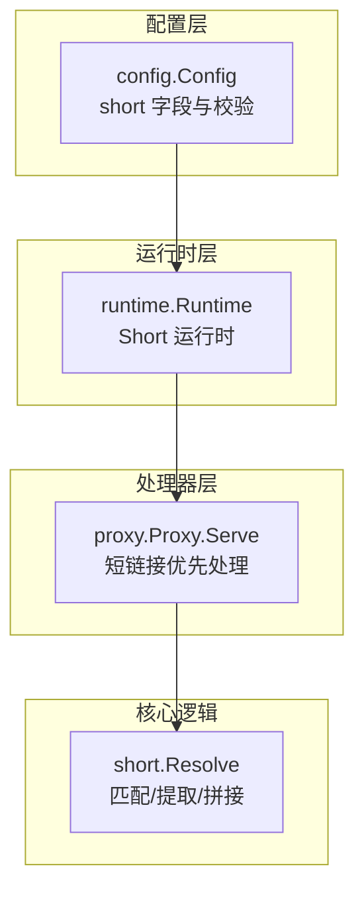
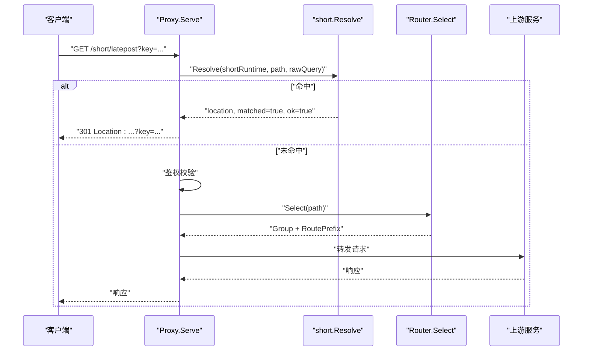
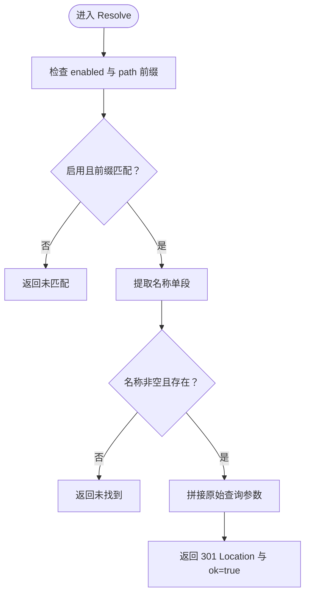
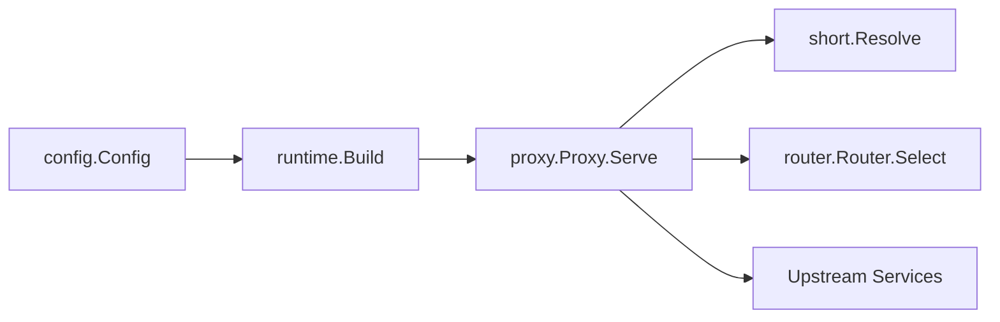

# 短链接服务

<cite>
**本文引用的文件列表**
- [internal/short/short.go](file://internal/short/short.go)
- [internal/config/config.go](file://internal/config/config.go)
- [internal/proxy/proxy.go](file://internal/proxy/proxy.go)
- [internal/runtime/runtime.go](file://internal/runtime/runtime.go)
- [config.example.yaml](file://config.example.yaml)
- [README.md](file://README.md)
- [internal/proxy/proxy_test.go](file://internal/proxy/proxy_test.go)
</cite>

## 目录
1. [简介](#简介)
2. [项目结构](#项目结构)
3. [核心组件](#核心组件)
4. [架构总览](#架构总览)
5. [详细组件分析](#详细组件分析)
6. [依赖关系分析](#依赖关系分析)
7. [性能考量](#性能考量)
8. [故障排查指南](#故障排查指南)
9. [结论](#结论)
10. [附录：配置与使用示例](#附录配置与使用示例)

## 简介
本节介绍短链接服务的目标与价值：通过在网关层提供“短路径”重定向能力，将复杂的 RSSHub 订阅链接简化为易记的短路径，并保持查询参数透传，从而提升用户体验与可维护性。短链接服务在整体请求处理链中处于早期阶段，优先于网关鉴权与代理路由，直接返回 HTTP 301 重定向。

## 项目结构
短链接功能涉及以下关键模块：
- 配置层：定义 short.enabled、short.path、short.entries 等字段，并进行校验与归一化。
- 运行时层：将配置转换为运行时对象，供处理器使用。
- 处理器层：在代理入口处先尝试短链接解析，命中即返回 301，否则进入常规鉴权与路由流程。
- 核心逻辑：短链接解析器负责路径匹配、名称提取、目标查找与查询参数拼接。

图表来源
- [internal/config/config.go](file://internal/config/config.go#L78-L88)
- [internal/runtime/runtime.go](file://internal/runtime/runtime.go#L99-L115)
- [internal/proxy/proxy.go](file://internal/proxy/proxy.go#L65-L71)
- [internal/short/short.go](file://internal/short/short.go#L19-L35)

章节来源
- [internal/config/config.go](file://internal/config/config.go#L78-L88)
- [internal/runtime/runtime.go](file://internal/runtime/runtime.go#L99-L115)
- [internal/proxy/proxy.go](file://internal/proxy/proxy.go#L65-L71)

## 核心组件
- 短链接配置模型：包含 enabled、path、entries，其中 entries 为 name/target 对集合。
- 短链接运行时：封装 enabled、path、targets 映射。
- 解析器：根据请求路径与运行时配置判断是否命中短链接，若命中则返回 Location 并透传原始查询参数。
- 代理处理器：在进入常规鉴权与路由之前，先尝试短链接解析，命中即返回 301。

章节来源
- [internal/config/config.go](file://internal/config/config.go#L78-L88)
- [internal/short/short.go](file://internal/short/short.go#L5-L17)
- [internal/short/short.go](file://internal/short/short.go#L19-L35)
- [internal/proxy/proxy.go](file://internal/proxy/proxy.go#L65-L71)

## 架构总览
短链接在请求处理链中的位置如下：
- 客户端请求到达后，先检查是否命中短链接前缀与名称；
- 若命中，则直接构造 Location 并返回 301；
- 若未命中，则继续执行网关鉴权与路由选择，再进行上游转发。

图表来源
- [internal/proxy/proxy.go](file://internal/proxy/proxy.go#L65-L71)
- [internal/short/short.go](file://internal/short/short.go#L19-L35)
- [internal/router/router.go](file://internal/router/router.go#L29-L56)

## 详细组件分析

### 短链接解析器（short.Resolve）
- 功能要点
  - 仅当运行时启用且请求路径匹配短链接前缀时才尝试解析。
  - 从路径中提取短名称，要求名称为单段（不含斜杠），且存在于 targets 映射。
  - 将原始查询字符串按规则拼接到目标 URL 上，实现查询参数透传。
- 匹配模式
  - 前缀匹配：短链接路径以配置的 path 作为前缀，例如 path="/short" 时，"/short/latepost" 命中，但 "/short/latepost/sub" 不命中。
  - 名称提取：名称必须位于 path 之后的第一个斜杠之后，且不包含斜杠。
- 查询参数透传
  - 若目标已带查询参数，新查询以 "&" 连接；否则以 "?" 连接。
  - 透传的是原始 rawQuery，不做过滤或重写。

图表来源
- [internal/short/short.go](file://internal/short/short.go#L19-L35)
- [internal/short/short.go](file://internal/short/short.go#L37-L64)
- [internal/short/short.go](file://internal/short/short.go#L66-L74)

章节来源
- [internal/short/short.go](file://internal/short/short.go#L19-L35)
- [internal/short/short.go](file://internal/short/short.go#L37-L64)
- [internal/short/short.go](file://internal/short/short.go#L66-L74)

### 配置模型与校验（config.ShortConfig、config.ShortEntry）
- 配置项
  - enabled：是否启用短链接。
  - path：短链接路径前缀，默认归一化为以 "/" 开头、末尾无 "/" 的形式。
  - entries：短链接条目数组，每项包含 name 与 target。
- 校验规则
  - 当启用时，path 必须以 "/" 开头。
  - entries 中 name 必须唯一且非空。
  - target 必须满足内部路径（/rsshub/... 或 /upvote/...）或外部 HTTPS URL。
- 归一化
  - 对 entries 的 name 与 target 去空白并标准化。

章节来源
- [internal/config/config.go](file://internal/config/config.go#L78-L88)
- [internal/config/config.go](file://internal/config/config.go#L257-L260)
- [internal/config/config.go](file://internal/config/config.go#L373-L390)
- [internal/config/config.go](file://internal/config/config.go#L466-L476)

### 运行时构建（runtime.Build）
- 将配置中的 entries 转换为 map[string]string，作为 targets 映射。
- 创建 short.Runtime 并注入到全局运行时对象中，供代理处理器使用。

章节来源
- [internal/runtime/runtime.go](file://internal/runtime/runtime.go#L99-L115)

### 代理处理器集成（proxy.Proxy.Serve）
- 在进入常规鉴权与路由之前，先调用 short.Resolve。
- 若 matched=true 且 ok=true：设置 Location 并返回 301。
- 若 matched=true 但 ok=false：返回 404。
- 若未命中短链接：继续鉴权与路由流程。

章节来源
- [internal/proxy/proxy.go](file://internal/proxy/proxy.go#L65-L71)

## 依赖关系分析
- 配置层依赖 YAML 解析与校验函数，确保 path 与 entries 合法。
- 运行时层依赖配置层输出，构建 short.Runtime。
- 处理器层依赖运行时层提供的 short.Runtime，并在请求入口处优先处理短链接。
- 核心逻辑层提供纯函数式的解析与拼接，便于测试与复用。

图表来源
- [internal/config/config.go](file://internal/config/config.go#L145-L160)
- [internal/runtime/runtime.go](file://internal/runtime/runtime.go#L99-L115)
- [internal/proxy/proxy.go](file://internal/proxy/proxy.go#L65-L71)
- [internal/router/router.go](file://internal/router/router.go#L29-L56)

章节来源
- [internal/config/config.go](file://internal/config/config.go#L145-L160)
- [internal/runtime/runtime.go](file://internal/runtime/runtime.go#L99-L115)
- [internal/proxy/proxy.go](file://internal/proxy/proxy.go#L65-L71)
- [internal/router/router.go](file://internal/router/router.go#L29-L56)

## 性能考量
- 短链接解析为 O(1) 查找（map），开销极低，适合在请求入口处高频调用。
- 查询参数拼接为字符串拼接，复杂度 O(n)，n 为原始查询长度，通常很小。
- 由于短链接命中即返回 301，避免了后续鉴权与路由的开销，整体延迟更低。

## 故障排查指南
- 404 未找到
  - 可能原因：路径前缀不匹配、名称不存在、名称含斜杠等。
  - 排查步骤：确认 path 与 name 是否符合前缀与单段规则。
- 302/307 非预期重定向
  - 可能原因：浏览器或中间件缓存导致的临时重定向。
  - 排查步骤：清除缓存或使用无缓存方式验证。
- 查询参数丢失
  - 可能原因：目标 URL 已带查询参数，但期望以 "&" 连接。
  - 排查步骤：确认 appendQuery 行为与目标 URL 结构。
- 鉴权冲突
  - 短链接请求绕过网关鉴权，若上游需要鉴权，请确保上游自行处理。
- 单元测试参考
  - 内部目标与外部目标的 301 重定向与查询透传行为均有测试覆盖。

章节来源
- [internal/proxy/proxy_test.go](file://internal/proxy/proxy_test.go#L592-L666)
- [internal/proxy/proxy_test.go](file://internal/proxy/proxy_test.go#L668-L742)

## 结论
短链接服务通过简洁的配置与高效的解析，在请求链路早期完成重定向，显著提升了订阅链接的可读性与可维护性。其查询参数透传特性保证了与上游鉴权与业务逻辑的兼容性，同时在性能上几乎零开销。建议在对外发布订阅链接时优先采用短链接，内部管理仍保留完整路径以便调试与审计。

## 附录：配置与使用示例
- 配置要点
  - short.enabled：启用短链接。
  - short.path：短链接前缀路径（默认 "/short"）。
  - short.entries：短链接条目数组，name 唯一，target 支持内部路径或外部 HTTPS URL。
- 使用示例
  - 将复杂 RSSHub 订阅链接简化为短路径，如将 "/rsshub/latepost/4" 简化为 "/short/latepost"。
  - 外部站点订阅同样支持，如将 "https://example.com/rss?platform=reddit" 简化为 "/short/reddit-top"。
  - 查询参数透传：GET /short/latepost?key=ACCESS_KEY 会返回 301 Location: /rsshub/latepost/4?key=ACCESS_KEY。

章节来源
- [config.example.yaml](file://config.example.yaml#L60-L80)
- [README.md](file://README.md#L248-L259)