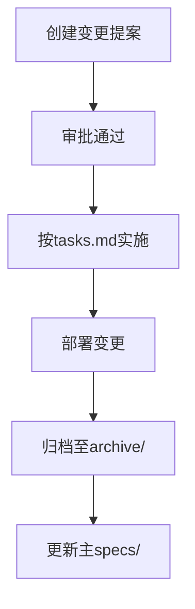

# 变更提案流程

<cite>
**本文档中引用的文件**
- [AGENTS.md](file://openspec/AGENTS.md)
- [project.md](file://openspec/project.md)
- [proposal.md](file://openspec/changes/add-cache-auto-reload-metrics/proposal.md)
- [tasks.md](file://openspec/changes/add-cache-auto-reload-metrics/tasks.md)
- [design.md](file://openspec/changes/add-cache-auto-reload-metrics/design.md)
- [spec.md](file://openspec/changes/add-cache-auto-reload-metrics/specs/gateway-cache/spec.md)
</cite>

## 目录
1. [引言](#引言)
2. [三阶段工作流概述](#三阶段工作流概述)
3. [第一阶段：创建变更](#第一阶段创建变更)
4. [第二阶段：实施变更](#第二阶段实施变更)
5. [第三阶段：归档变更](#第三阶段归档变更)
6. [关键CLI命令与标志](#关键cli命令与标志)
7. [常见错误排查](#常见错误排查)
8. [附录：示例结构参考](#附录示例结构参考)

## 引言

本指南旨在为基于OpenSpec指令的设计驱动开发（Design-Driven Development）提供全面的变更提案流程说明。通过遵循此流程，团队可以确保所有功能扩展、架构调整和性能优化均经过充分规划、评审和验证，从而维护系统的稳定性与可维护性。该流程特别适用于需要引入新能力或修改现有行为的场景，并通过标准化的文档结构和自动化工具链来支持协作与一致性。

**Section sources**
- [AGENTS.md](file://openspec/AGENTS.md#L1-L457)
- [project.md](file://openspec/project.md#L1-L60)

## 三阶段工作流概述

设计驱动开发采用三阶段工作流：**创建变更**、**实施变更** 和 **归档变更**。这一流程确保所有重大变更在编码前经过明确提案与审批，在实施中遵循检查清单，并在完成后正确归档以更新系统规范。

```mermaid
graph TD
A[第一阶段: 创建变更] --> B[第二阶段: 实施变更]
B --> C[第三阶段: 归档变更]
A --> A1[决定是否需要提案]
A --> A2[选择change-id]
A --> A3[搭建proposal.md, tasks.md, design.md]
A --> A4[编写spec delta]
B --> B1[阅读proposal.md]
B --> B2[阅读design.md (如存在)]
B --> B3[按tasks.md顺序实现]
B --> B4[确认所有任务完成]
C --> C1[使用openspec archive命令]
C --> C2[移动至archive/YYYY-MM-DD-[name]]
C --> C3[更新主规格]
```

**Diagram sources**
- [AGENTS.md](file://openspec/AGENTS.md#L15-L65)

## 第一阶段：创建变更

### 触发条件与豁免情况

变更提案应在以下情况下创建：
- 新增功能或能力
- 架构或模式变更
- 破坏性更改（API、数据结构）
- 性能优化（改变行为）
- 安全模式更新

无需创建提案的情况包括：
- Bug修复（恢复预期行为）
- 拼写、格式、注释调整
- 非破坏性依赖更新
- 配置变更
- 现有行为的测试补充

决策树如下：
```
新请求？
├─ Bug fix restoring spec behavior? → 直接修复
├─ Typo/format/comment? → 直接修复  
├─ New feature/capability? → 创建提案
├─ Breaking change? → 创建提案
├─ Architecture change? → 创建提案
└─ Unclear? → 创建提案（更安全）
```

**Section sources**
- [AGENTS.md](file://openspec/AGENTS.md#L18-L41)
- [AGENTS.md](file://openspec/AGENTS.md#L147-L156)

### change-id命名规范

必须选择唯一且描述性的kebab-case格式change-id，前缀应为动词引导：
- `add-`：新增功能
- `update-`：修改现有功能
- `remove-`：移除功能
- `refactor-`：重构代码

示例：`add-two-factor-auth`、`update-routing-logic`。

若名称已被使用，可追加`-2`、`-3`等后缀以保证唯一性。

**Section sources**
- [AGENTS.md](file://openspec/AGENTS.md#L9-L10)
- [AGENTS.md](file://openspec/AGENTS.md#L400-L404)

### 文件结构搭建

在`openspec/changes/`目录下创建以`change-id`命名的子目录，并初始化以下文件：

```
openspec/changes/[change-id]/
├── proposal.md     # 变更目的、内容与影响
├── tasks.md        # 实现检查清单
├── design.md       # 技术决策（可选）
└── specs/
    └── [capability]/
        └── spec.md # 规范增量（delta）
```

**Section sources**
- [AGENTS.md](file://openspec/AGENTS.md#L160-L161)
- [AGENTS.md](file://openspec/AGENTS.md#L134-L141)

### proposal.md编写规范

`proposal.md`采用三段式结构，清晰阐述变更的动机、内容与影响。

#### 结构模板
```markdown
## Why
[1-2句话说明问题或机会]

## What Changes
- [变更项列表]
- [用 **BREAKING** 标记破坏性变更]

## Impact
- Affected specs: [受影响的能力列表]
- Affected code: [关键文件或系统]
```

#### 编写要点
- **Why**：聚焦业务价值或技术必要性，避免技术细节。
- **What Changes**：列出具体变更点，区分新增、修改、删除。
- **Impact**：明确指出影响的规范模块（specs）和代码区域。

示例：
```markdown
## Why
网关需要响应缓存、自动配置重载和更细粒度的指标，以减少上游负载、简化运维并提升可见性。

## What Changes
- 添加GET请求的响应缓存（200状态码），支持内存或Redis两种提供者。
- 添加通过轮询文件哈希实现的自动配置重载。
- 扩展Prometheus指标，增加缓存命中/未命中及每上游/每路由的成功/失败计数器。

## Impact
- Affected specs: gateway-cache, gateway-reload, gateway-observability.
- Affected code: config schema/validation, runtime manager/reload loop, proxy handler, metrics, new cache provider package(s), docs/tests.
```

**Section sources**
- [AGENTS.md](file://openspec/AGENTS.md#L162-L174)
- [proposal.md](file://openspec/changes/add-cache-auto-reload-metrics/proposal.md#L1-L12)

### spec delta编写规范

spec delta定义了对现有规范的增量变更，必须遵循严格的格式要求。

#### 基本结构
```markdown
## ADDED Requirements
### Requirement: 新功能
系统应...

#### Scenario: 成功场景
- **WHEN** 用户执行操作
- **THEN** 预期结果

## MODIFIED Requirements
### Requirement: 现有功能
[完整的修改后需求]

## REMOVED Requirements
### Requirement: 旧功能
**Reason**: [移除原因]
**Migration**: [迁移方案]
```

#### 关键规则
- 使用 `## ADDED|MODIFIED|REMOVED Requirements` 作为顶级标题。
- 每个需求必须至少包含一个 `#### Scenario:` 场景描述。
- 场景标题必须使用四个井号（`####`），不可使用粗体或列表。
- 使用 **SHALL/MUST** 表示规范性要求，避免使用should/may。
- 修改现有需求时，必须复制整个需求块并完整粘贴到`## MODIFIED Requirements`下进行编辑，确保不丢失原有细节。

**Section sources**
- [AGENTS.md](file://openspec/AGENTS.md#L177-L194)
- [AGENTS.md](file://openspec/AGENTS.md#L238-L255)
- [spec.md](file://openspec/changes/add-cache-auto-reload-metrics/specs/gateway-cache/spec.md#L1-L32)

### design.md创建条件

`design.md`为可选文件，仅在满足以下任一条件时创建：
- 跨模块变更或引入新的架构模式
- 新增外部依赖或重大数据模型变更
- 存在安全、性能或迁移复杂性
- 技术决策存在歧义，需在编码前明确

#### 最小骨架结构
```markdown
## Context
[背景、约束、利益相关者]

## Goals / Non-Goals
- Goals: [...]
- Non-Goals: [...]

## Decisions
- Decision: [决策内容及原因]
- Alternatives considered: [考虑的替代方案+理由]

## Risks / Trade-offs
- [风险] → 缓解措施

## Migration Plan
[步骤、回滚方案]

## Open Questions
- [...]
```

**Section sources**
- [AGENTS.md](file://openspec/AGENTS.md#L207-L211)
- [design.md](file://openspec/changes/add-cache-auto-reload-metrics/design.md#L1-L34)

### tasks.md作用说明

`tasks.md`作为实施阶段的检查清单，指导开发者按步骤完成变更。其作用包括：
- 明确实现路径
- 防止遗漏关键步骤
- 支持进度跟踪（通过复选框 `- [ ]` / `- [x]`）

#### 结构示例
```markdown
## 1. Implementation
- [ ] 1.1 扩展配置模式以支持缓存提供者
- [ ] 1.2 实现内存缓存接口
- [ ] 1.3 实现Redis缓存提供者
...
```

**Section sources**
- [AGENTS.md](file://openspec/AGENTS.md#L197-L204)
- [tasks.md](file://openspec/changes/add-cache-auto-reload-metrics/tasks.md#L1-L9)

## 第二阶段：实施变更

### 实施前准备

在开始编码前，必须完成以下准备工作：
1. **阅读proposal.md**：理解变更的目标与范围。
2. **阅读design.md（如存在）**：掌握关键技术决策。
3. **阅读tasks.md**：获取详细的实现检查清单。

### 实施步骤

1. **按顺序完成任务**：严格按照`tasks.md`中的条目逐一实现。
2. **保持同步**：每完成一个任务，将对应的复选框从 `- [ ]` 更新为 `- [x]`。
3. **确认全部完成**：确保所有任务均已标记为完成，方可进入下一阶段。

### 审批门控

**关键原则**：必须在提案获得评审并批准后，才能开始任何编码工作。未经批准的变更不得合并。

**Section sources**
- [AGENTS.md](file://openspec/AGENTS.md#L50-L57)

## 第三阶段：归档变更

### 归档操作

变更部署后，需创建独立的PR执行归档操作：
1. 将 `changes/[name]/` 移动至 `changes/archive/YYYY-MM-DD-[name]/`
2. 更新 `specs/` 目录下的主规范文件，反映能力变更
3. 使用 `openspec archive [change] --skip-specs --yes` 处理仅工具化的变更

### 验证归档

归档后运行 `openspec validate --strict` 确认变更通过所有检查，确保归档后的状态符合规范。

**Section sources**
- [AGENTS.md](file://openspec/AGENTS.md#L59-L64)

## 关键CLI命令与标志

### 常用命令

```bash
# 列出活动中的变更
openspec list

# 列出所有规范
openspec list --specs

# 显示变更或规范详情
openspec show [item]

# 显示变更差异
openspec diff [change]

# 验证变更或规范
openspec validate [item]

# 归档已完成的变更
openspec archive [change] [--yes|-y]
```

### 常用标志

- `--json`：输出机器可读格式
- `--type change|spec`：明确指定项目类型
- `--strict`：启用严格模式进行全面验证
- `--skip-specs`：归档时不更新规范
- `--yes` / `-y`：跳过确认提示（适用于自动化）

**Section sources**
- [AGENTS.md](file://openspec/AGENTS.md#L95-L123)
- [AGENTS.md](file://openspec/AGENTS.md#L449-L454)

## 常见错误排查

### 典型错误与解决方案

| 错误信息 | 原因 | 解决方法 |
|--------|------|--------|
| "Change must have at least one delta" | 缺少规范增量文件 | 检查 `changes/[name]/specs/` 是否存在 `.md` 文件，且包含 `## ADDED Requirements` 等操作前缀 |
| "Requirement must have at least one scenario" | 需求缺少场景描述 | 确保每个需求下有 `#### Scenario:` 格式的场景，使用四个井号 |
| 静默的场景解析失败 | 场景格式不正确 | 使用 `openspec show [change] --json --deltas-only` 调试，检查JSON输出中的deltas字段 |

### 验证建议

始终使用 `--strict` 模式进行验证：
```bash
openspec validate [change] --strict
```

对于复杂问题，可通过JSON输出深入分析：
```bash
openspec show [change] --json | jq '.deltas'
```

**Section sources**
- [AGENTS.md](file://openspec/AGENTS.md#L292-L303)
- [AGENTS.md](file://openspec/AGENTS.md#L307-L314)

## 附录：示例结构参考

### 多能力变更示例

```
openspec/changes/add-2fa-notify/
├── proposal.md
├── tasks.md
└── specs/
    ├── auth/
    │   └── spec.md   # ADDED: Two-Factor Authentication
    └── notifications/
        └── spec.md   # ADDED: OTP email notification
```

### 完整变更生命周期示例



**Diagram sources**
- [AGENTS.md](file://openspec/AGENTS.md#L351-L359)