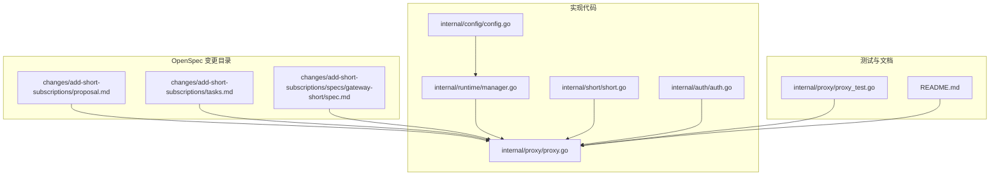
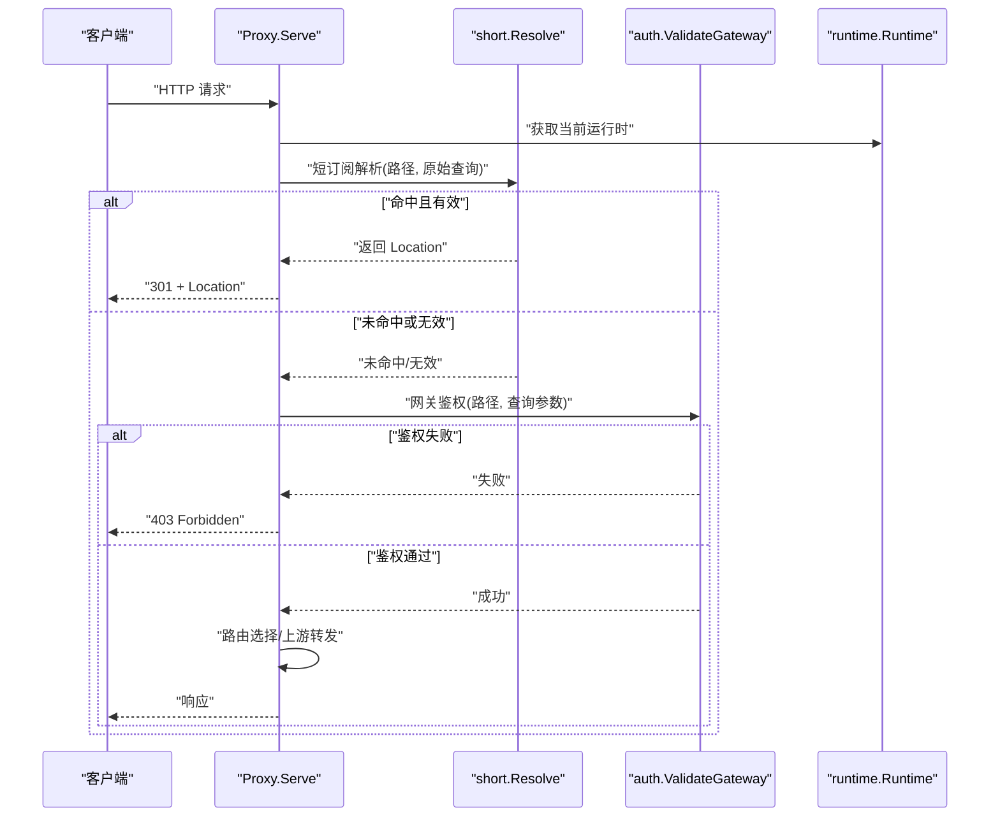
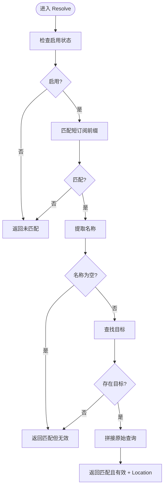
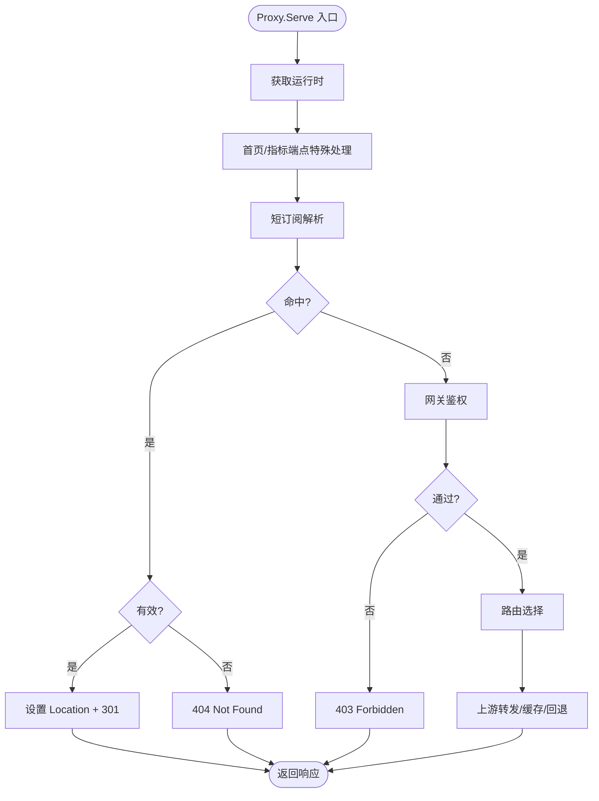
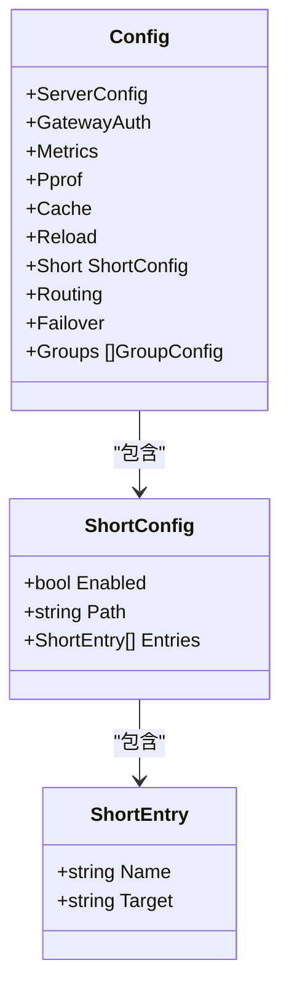
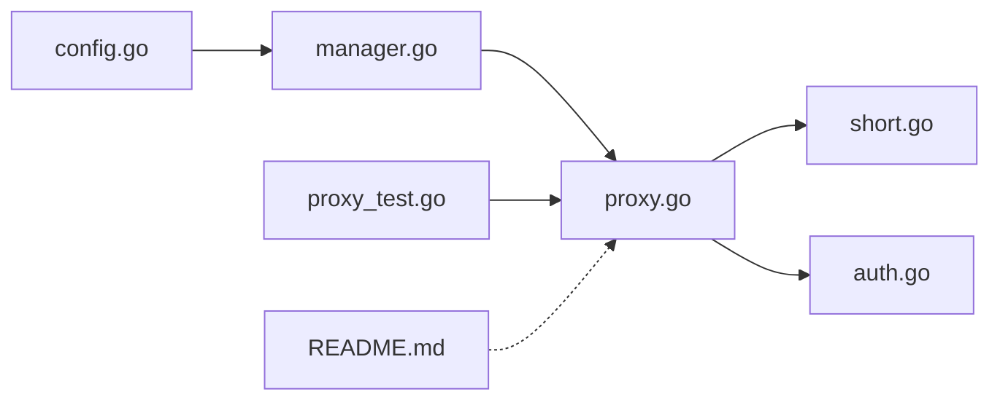
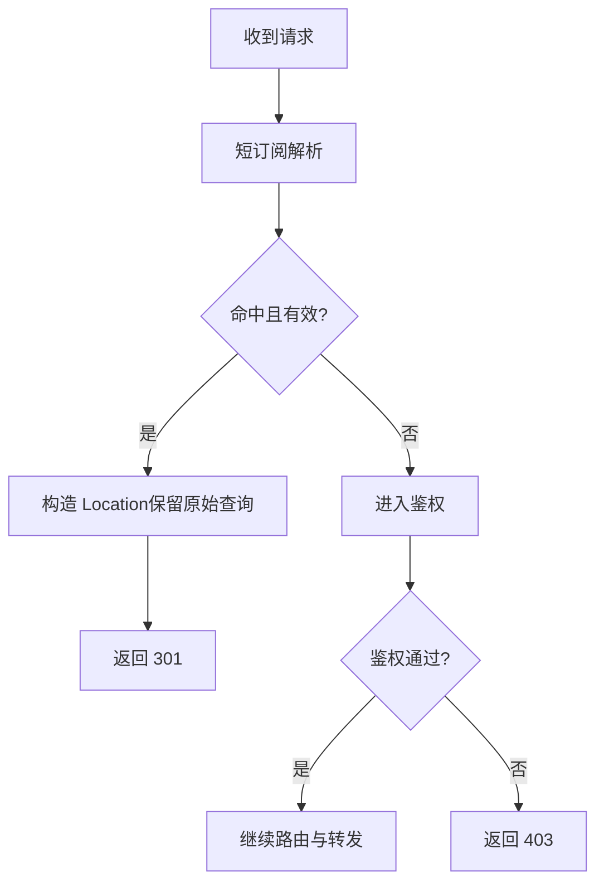

# 实施变更

<cite>
**本文引用的文件**
- [AGENTS.md](file://openspec/AGENTS.md)
- [proposal.md](file://openspec/changes/add-short-subscriptions/proposal.md)
- [tasks.md](file://openspec/changes/add-short-subscriptions/tasks.md)
- [spec.md](file://openspec/changes/add-short-subscriptions/specs/gateway-short/spec.md)
- [config.go](file://internal/config/config.go)
- [short.go](file://internal/short/short.go)
- [proxy.go](file://internal/proxy/proxy.go)
- [auth.go](file://internal/auth/auth.go)
- [manager.go](file://internal/runtime/manager.go)
- [proxy_test.go](file://internal/proxy/proxy_test.go)
- [README.md](file://README.md)
</cite>

## 目录
1. [引言](#引言)
2. [项目结构](#项目结构)
3. [核心组件](#核心组件)
4. [架构总览](#架构总览)
5. [详细组件分析](#详细组件分析)
6. [依赖关系分析](#依赖关系分析)
7. [性能考量](#性能考量)
8. [故障排查指南](#故障排查指南)
9. [结论](#结论)
10. [附录](#附录)

## 引言
本章节面向“变更实施阶段”的落地实践，严格遵循 OpenSpec 第二阶段工作流：在提案获得批准后方可开始编码，坚持“设计先行”。文档围绕如何顺序执行 tasks.md 中的任务清单、如何对照 proposal.md 理解需求、如何阅读 spec.md（如存在）把握技术约束，以及如何确保实现与 spec delta 保持一致，给出系统化方法论与最佳实践。同时结合项目内“短订阅”（add-short-subscriptions）的实际案例，展示从 spec 到代码的转化路径与代码审查要点。

## 项目结构
- 变更提案与规范位于 openspec/changes 下，包含 proposal.md、tasks.md、design.md（可选）、以及针对受影响能力的 spec delta 文件。
- 实现代码集中在 internal 子包中，包括配置解析、路由选择、代理转发、鉴权、短订阅处理等模块。
- README 提供用户侧使用示例与行为说明，便于回归验证。

图表来源
- [proposal.md](file://openspec/changes/add-short-subscriptions/proposal.md#L1-L12)
- [tasks.md](file://openspec/changes/add-short-subscriptions/tasks.md#L1-L7)
- [spec.md](file://openspec/changes/add-short-subscriptions/specs/gateway-short/spec.md#L1-L43)
- [config.go](file://internal/config/config.go#L1-L120)
- [short.go](file://internal/short/short.go#L1-L75)
- [proxy.go](file://internal/proxy/proxy.go#L41-L80)
- [auth.go](file://internal/auth/auth.go#L1-L58)
- [manager.go](file://internal/runtime/manager.go#L1-L75)
- [proxy_test.go](file://internal/proxy/proxy_test.go#L686-L836)
- [README.md](file://README.md#L271-L288)

章节来源
- [AGENTS.md](file://openspec/AGENTS.md#L49-L66)
- [AGENTS.md](file://openspec/AGENTS.md#L124-L143)

## 核心组件
- 配置与校验：负责加载 YAML 配置、应用默认值、归一化路径、校验短订阅配置的有效性。
- 运行时管理：负责构建运行时对象、热重载配置、提供当前运行时给处理器使用。
- 短订阅解析：根据请求路径与配置，判断是否命中短订阅规则并生成 Location。
- 代理与鉴权：在短订阅匹配前，先进行网关鉴权；短订阅命中后跳过鉴权直接返回 301。
- 测试与文档：通过单元测试覆盖内部/外部目标与查询透传，README 提供用户侧行为说明。

章节来源
- [config.go](file://internal/config/config.go#L1-L120)
- [manager.go](file://internal/runtime/manager.go#L1-L75)
- [short.go](file://internal/short/short.go#L1-L75)
- [proxy.go](file://internal/proxy/proxy.go#L41-L80)
- [auth.go](file://internal/auth/auth.go#L1-L58)
- [proxy_test.go](file://internal/proxy/proxy_test.go#L686-L836)
- [README.md](file://README.md#L271-L288)

## 架构总览
下图展示了“短订阅”请求在系统内的处理流程：代理层首先尝试短订阅解析，若命中则直接返回 301；否则进入常规鉴权与路由转发逻辑。

图表来源
- [proxy.go](file://internal/proxy/proxy.go#L41-L80)
- [short.go](file://internal/short/short.go#L19-L35)
- [auth.go](file://internal/auth/auth.go#L11-L28)
- [manager.go](file://internal/runtime/manager.go#L69-L75)

## 详细组件分析

### 组件A：短订阅解析器（short）
- 职责：判断请求是否匹配短订阅前缀、提取名称、查找目标、拼接查询字符串。
- 关键点：
  - 匹配前缀与名称提取遵循严格的路径格式要求。
  - 对于已含查询的目标，采用“&”拼接；否则使用“?”。
  - 返回三元组：location、是否匹配、是否有效，供上层决定响应状态码。

图表来源
- [short.go](file://internal/short/short.go#L19-L35)
- [short.go](file://internal/short/short.go#L37-L64)
- [short.go](file://internal/short/short.go#L66-L74)

章节来源
- [short.go](file://internal/short/short.go#L1-L75)

### 组件B：代理与鉴权（proxy）
- 职责：统一入口处理请求，优先短订阅解析，再进行网关鉴权，最后路由与转发。
- 关键点：
  - 短订阅命中后直接设置 Location 并返回 301，不进入后续鉴权与路由。
  - 鉴权失败返回 403，通过后继续后续流程。
  - 与短订阅相关的“绕过鉴权”由短订阅命中即返回的控制流保证。

图表来源
- [proxy.go](file://internal/proxy/proxy.go#L41-L80)
- [auth.go](file://internal/auth/auth.go#L11-L28)

章节来源
- [proxy.go](file://internal/proxy/proxy.go#L41-L80)
- [auth.go](file://internal/auth/auth.go#L11-L28)

### 组件C：配置与校验（config）
- 职责：定义配置结构体、加载 YAML、应用默认值、归一化路径、校验短订阅配置。
- 关键点：
  - 默认短订阅前缀为“/short”，可通过配置修改。
  - 校验规则包括：前缀必须以“/”开头、条目名称非空且唯一、目标必须符合允许格式（内部 rsshub/upvote 或外部 https）。

图表来源
- [config.go](file://internal/config/config.go#L12-L120)
- [config.go](file://internal/config/config.go#L370-L390)
- [config.go](file://internal/config/config.go#L466-L476)

章节来源
- [config.go](file://internal/config/config.go#L12-L120)
- [config.go](file://internal/config/config.go#L370-L390)
- [config.go](file://internal/config/config.go#L466-L476)

### 组件D：运行时管理（runtime）
- 职责：加载配置、构建运行时、热重载、提供当前运行时。
- 关键点：运行时对象包含短订阅配置、路由选择器、鉴权策略等，代理层通过运行时获取这些信息。

章节来源
- [manager.go](file://internal/runtime/manager.go#L1-L75)
- [manager.go](file://internal/runtime/manager.go#L69-L126)

### 组件E：测试用例（proxy_test）
- 覆盖场景：
  - 内部短订阅到 rsshub 的 301 重定向与查询透传。
  - 外部短订阅到 https 的 301 重定向与查询透传。
  - 未命中的情况返回 404。
- 价值：验证短订阅实现与 spec 要求一致，确保行为稳定。

章节来源
- [proxy_test.go](file://internal/proxy/proxy_test.go#L686-L836)

### 组件F：用户文档（README）
- 提供短订阅的行为说明与示例，便于回归验证与对外说明。

章节来源
- [README.md](file://README.md#L271-L288)

## 依赖关系分析
- 短订阅实现依赖：
  - 配置层：提供短订阅启用开关、路径前缀、条目列表。
  - 运行时：提供短订阅运行时对象。
  - 解析器：负责路径匹配与目标解析。
  - 代理层：负责短订阅命中后的快速返回与后续鉴权/路由。
  - 鉴权层：在短订阅未命中时执行网关鉴权。
- 测试依赖：代理层测试用例覆盖短订阅关键路径。

图表来源
- [config.go](file://internal/config/config.go#L1-L120)
- [manager.go](file://internal/runtime/manager.go#L1-L75)
- [proxy.go](file://internal/proxy/proxy.go#L41-L80)
- [short.go](file://internal/short/short.go#L1-L75)
- [auth.go](file://internal/auth/auth.go#L1-L58)
- [proxy_test.go](file://internal/proxy/proxy_test.go#L686-L836)
- [README.md](file://README.md#L271-L288)

## 性能考量
- 短订阅解析为纯内存操作，时间复杂度低，对整体延迟影响可忽略。
- 代理层短订阅命中后直接返回，避免了后续鉴权与路由开销。
- 配置加载与热重载在后台进行，不影响请求处理路径。

## 故障排查指南
- 症状：短订阅未生效或返回 404
  - 检查配置是否启用、路径前缀是否以“/”开头、条目名称是否唯一且非空。
  - 检查目标是否符合允许格式（/rsshub、/upvote 或 https）。
  - 使用测试用例作为对比，确认行为是否一致。
- 症状：鉴权失败返回 403
  - 确认短订阅命中路径是否被短订阅解析器正确识别。
  - 若未命中短订阅，检查网关鉴权参数（key/code）与配置。
- 症状：查询未透传
  - 确认短订阅目标是否已正确拼接原始查询字符串。

章节来源
- [config.go](file://internal/config/config.go#L370-L390)
- [config.go](file://internal/config/config.go#L466-L476)
- [proxy.go](file://internal/proxy/proxy.go#L41-L80)
- [auth.go](file://internal/auth/auth.go#L11-L28)
- [proxy_test.go](file://internal/proxy/proxy_test.go#L686-L836)

## 结论
- 在变更实施阶段，务必先完成 proposal 审批与 spec 对齐，再按 tasks.md 逐项推进。
- 以短订阅为例，实现的关键在于：配置校验、短订阅解析、代理层命中即返回、测试覆盖与文档说明。
- 代码审查时应对照原始提案与 spec，确保实现与预期一致，避免偏离范围。

## 附录

### 实施步骤与最佳实践
- 步骤一：阅读 proposal.md，明确“为什么做、做什么、影响面”。
- 步骤二：阅读 spec.md（如存在），理解需求与验收场景。
- 步骤三：按 tasks.md 顺序执行，每完成一项即更新为“已完成”。
- 步骤四：在实现过程中持续对照 spec，确保与 delta 保持一致。
- 步骤五：编写/完善测试，覆盖内部/外部目标与查询透传。
- 步骤六：更新 README 示例，补充配置说明。
- 步骤七：代码审查时对照原始提案与 spec，确保一致性。

章节来源
- [AGENTS.md](file://openspec/AGENTS.md#L49-L66)
- [proposal.md](file://openspec/changes/add-short-subscriptions/proposal.md#L1-L12)
- [tasks.md](file://openspec/changes/add-short-subscriptions/tasks.md#L1-L7)
- [spec.md](file://openspec/changes/add-short-subscriptions/specs/gateway-short/spec.md#L1-L43)

### 代码级流程图（短订阅到 301）

图表来源
- [proxy.go](file://internal/proxy/proxy.go#L41-L80)
- [short.go](file://internal/short/short.go#L19-L35)
- [auth.go](file://internal/auth/auth.go#L11-L28)