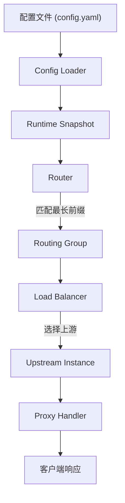
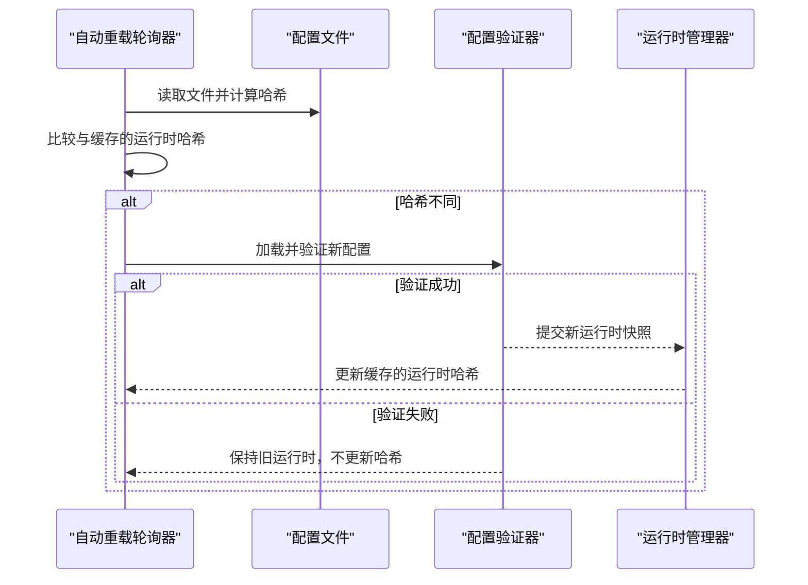

# 规格变更说明

<cite>
**本文档引用的文件**  
- [add-v0-1-basic-routing-lb/specs/gateway-routing/spec.md](file://openspec/changes/add-v0-1-basic-routing-lb/specs/gateway-routing/spec.md)
- [add-cache-auto-reload-metrics/specs/gateway-reload/spec.md](file://openspec/changes/add-cache-auto-reload-metrics/specs/gateway-reload/spec.md)
- [add-v0-2-observability-reload/specs/gateway-observability/spec.md](file://openspec/changes/add-v0-2-observability-reload/specs/gateway-observability/spec.md)
- [add-v0-2-observability-reload/specs/gateway-reload/spec.md](file://openspec/changes/add-v0-2-observability-reload/specs/gateway-reload/spec.md)
- [add-v0-1-basic-routing-lb/proposal.md](file://openspec/changes/add-v0-1-basic-routing-lb/proposal.md)
- [add-cache-auto-reload-metrics/proposal.md](file://openspec/changes/add-cache-auto-reload-metrics/proposal.md)
- [add-cache-auto-reload-metrics/design.md](file://openspec/changes/add-cache-auto-reload-metrics/design.md)
- [add-v0-1-basic-routing-lb/tasks.md](file://openspec/changes/add-v0-1-basic-routing-lb/tasks.md)
- [add-cache-auto-reload-metrics/tasks.md](file://openspec/changes/add-cache-auto-reload-metrics/tasks.md)
- [project.md](file://openspec/project.md)
</cite>

## 目录
1. [引言](#引言)
2. [规格变更机制概述](#规格变更机制概述)
3. [变更操作符详解](#变更操作符详解)
4. [实际变更提案分析](#实际变更提案分析)
5. [场景描述规范](#场景描述规范)
6. [与主规格的关系](#与主规格的关系)
7. [编写清晰变更需求的指导原则](#编写清晰变更需求的指导原则)
8. [结论](#结论)

## 引言
本文件旨在详细说明RSSHub-Gateway项目中规格变更（Specification Deltas）的机制。该机制通过在`openspec/changes/[change-id]/specs/`目录下的`spec.md`文件，定义对系统能力的增量修改提案。这些变更提案以结构化方式描述新增、修改、移除或重命名的功能，并通过行为驱动的场景确保实现的可验证性。

## 规格变更机制概述
在RSSHub-Gateway项目中，所有功能演进均通过“规格变更”（Specification Deltas）的方式进行管理。每个变更提案位于`openspec/changes/[change-id]/`目录下，其中`[change-id]`为描述性的变更标识（如`add-v0-1-basic-routing-lb`）。该目录下的`specs/`子目录包含针对特定功能模块（如`gateway-routing`、`gateway-reload`等）的`spec.md`文件。

这些`spec.md`文件作为对当前系统能力的**增量修改提案**，精确描述了对特定模块的变更。变更提案需包含`proposal.md`（提案说明）、`design.md`（设计决策）和`tasks.md`（实施任务）等配套文件，形成完整的变更生命周期管理。

**Section sources**
- [project.md](file://openspec/project.md#L1-L60)
- [add-v0-1-basic-routing-lb/proposal.md](file://openspec/changes/add-v0-1-basic-routing-lb/proposal.md#L1-L20)

## 变更操作符详解
规格变更文件使用标准化的操作符来定义变更类型，确保语义清晰且无歧义。主要操作符包括：

- **## ADDED**: 声明新增的功能或要求。
- **## MODIFIED**: 声明对现有功能的修改。**必须完整描述修改后的新行为**，避免遗漏原有内容。
- **## REMOVED**: 声明将被移除的功能或配置项。
- **## RENAMED**: 声明被重命名的配置项或接口。

这些操作符使得变更内容一目了然，便于审查和追溯。例如，在`add-v0-1-basic-routing-lb`提案中，使用`## ADDED`引入了路由分组和负载均衡等全新功能。

**Section sources**
- [add-v0-1-basic-routing-lb/specs/gateway-routing/spec.md#L1](file://openspec/changes/add-v0-1-basic-routing-lb/specs/gateway-routing/spec.md#L1)
- [add-v0-2-observability-reload/specs/gateway-reload/spec.md#L1](file://openspec/changes/add-v0-2-observability-reload/specs/gateway-reload/spec.md#L1)

## 实际变更提案分析
本节通过两个实际的变更提案，分析规格变更文件的具体应用。

### 案例一：基础路由与负载均衡（add-v0-1-basic-routing-lb）
该提案为`gateway-routing`模块引入了核心的路由分组和负载均衡能力。

- **新增功能**：通过`## ADDED`定义了“基于配置的路由分组”、“前缀匹配选择”、“组级负载均衡”等要求。
- **具体实现**：路由分组支持允许/拒绝前缀、优先级、默认组；负载均衡支持平滑加权轮询（WRR）和基于路径的哈希（hash(path)）策略。
- **验证场景**：例如，“最长前缀匹配”场景验证了当请求路径为`/telegram/private/x`时，系统应选择允许前缀`/telegram/private/`的分组，而非`/telegram/`。

此提案全面影响了配置加载、路由、负载均衡、代理等多个组件，是v0.1版本的基石。

**Diagram sources**
- [add-v0-1-basic-routing-lb/specs/gateway-routing/spec.md](file://openspec/changes/add-v0-1-basic-routing-lb/specs/gateway-routing/spec.md#L1-L63)
- [add-v0-1-basic-routing-lb/proposal.md](file://openspec/changes/add-v0-1-basic-routing-lb/proposal.md#L7-L15)

**Section sources**
- [add-v0-1-basic-routing-lb/specs/gateway-routing/spec.md](file://openspec/changes/add-v0-1-basic-routing-lb/specs/gateway-routing/spec.md#L1-L63)
- [add-v0-1-basic-routing-lb/proposal.md](file://openspec/changes/add-v0-1-basic-routing-lb/proposal.md#L1-L20)
- [add-v0-1-basic-routing-lb/tasks.md](file://openspec/changes/add-v0-1-basic-routing-lb/tasks.md#L1-L28)

### 案例二：自动重载与指标增强（add-cache-auto-reload-metrics）
该提案为`gateway-reload`模块增加了自动配置重载功能。

- **新增功能**：通过`## ADDED`定义了“基于文件哈希的自动重载”要求。
- **具体实现**：网关在配置中启用轮询后，会定期检查配置文件的哈希值。若发现变化，则触发重载流程，使用现有的验证和运行时交换机制。
- **验证场景**：例如，“哈希变化触发重载”场景明确了当缓存的运行时哈希与当前文件哈希不同时，轮询器应执行重载。

此变更简化了运维操作，无需手动发送SIGHUP信号。

**Diagram sources**
- [add-cache-auto-reload-metrics/specs/gateway-reload/spec.md](file://openspec/changes/add-cache-auto-reload-metrics/specs/gateway-reload/spec.md#L1-L20)
- [add-cache-auto-reload-metrics/design.md](file://openspec/changes/add-cache-auto-reload-metrics/design.md#L21-L22)

**Section sources**
- [add-cache-auto-reload-metrics/specs/gateway-reload/spec.md](file://openspec/changes/add-cache-auto-reload-metrics/specs/gateway-reload/spec.md#L1-L20)
- [add-cache-auto-reload-metrics/proposal.md](file://openspec/changes/add-cache-auto-reload-metrics/proposal.md#L6)
- [add-cache-auto-reload-metrics/design.md](file://openspec/changes/add-cache-auto-reload-metrics/design.md#L1-L34)
- [add-cache-auto-reload-metrics/tasks.md](file://openspec/changes/add-cache-auto-reload-metrics/tasks.md#L1-L9)

## 场景描述规范
每个变更需求**必须**附带至少一个`#### Scenario:场景描述`，以行为驱动开发（BDD）的Given-When-Then格式定义期望结果。

- **GIVEN**：描述初始状态或前提条件。
- **WHEN**：描述触发事件或操作。
- **THEN**：描述系统应产生的预期结果。

这种格式确保了需求的可测试性和无歧义性。例如，在`add-v0-2-observability-reload`提案中，`Reload Preflight Validation`要求通过多个场景（如“拒绝无效的路由和组引用”）来精确界定验证失败的条件。

**Section sources**
- [add-v0-1-basic-routing-lb/specs/gateway-routing/spec.md#L7](file://openspec/changes/add-v0-1-basic-routing-lb/specs/gateway-routing/spec.md#L7-L10)
- [add-cache-auto-reload-metrics/specs/gateway-reload/spec.md#L5](file://openspec/changes/add-cache-auto-reload-metrics/specs/gateway-reload/spec.md#L5-L8)
- [add-v0-2-observability-reload/specs/gateway-reload/spec.md#L5](file://openspec/changes/add-v0-2-observability-reload/specs/gateway-reload/spec.md#L5-L7)

## 与主规格的关系
规格变更文件是**临时的、增量的提案**。它们与位于`specs/[capability]/spec.md`的主规格文件（如果存在）形成对比。

- **变更流程**：一个变更提案经过评审和批准后，其内容将被**合并**到相应的主规格文件中。
- **单一事实来源**：主规格文件是系统能力的“单一事实来源”（Single Source of Truth），反映了所有已批准变更的最终状态。
- **可追溯性**：通过保留`openspec/changes/`目录下的历史提案，可以完整追溯系统功能的演进过程。

这种机制保证了文档的准确性和一致性，避免了主规格文件与实现之间的偏离。

**Section sources**
- [project.md](file://openspec/project.md#L1-L60)

## 编写清晰变更需求的指导原则
为了确保变更需求的有效性，开发者应遵循以下原则：

1.  **使用正确的操作符**：严格区分`ADDED`、`MODIFIED`、`REMOVED`和`RENAMED`。
2.  **完整描述修改**：在`## MODIFIED`中，必须完整写出修改后的行为，不能假设读者知道原有逻辑。
3.  **提供具体场景**：每个需求至少包含一个`#### Scenario`，使用Given-When-Then格式。
4.  **保持原子性**：一个变更提案应聚焦于一个明确的主题，避免过大或过小。
5.  **关联设计与任务**：确保`proposal.md`、`design.md`和`tasks.md`与`spec.md`内容一致，形成闭环。

遵循这些原则可以显著提高变更提案的质量和审查效率。

**Section sources**
- [add-v0-1-basic-routing-lb/specs/gateway-routing/spec.md](file://openspec/changes/add-v0-1-basic-routing-lb/specs/gateway-routing/spec.md#L1-L63)
- [add-cache-auto-reload-metrics/specs/gateway-reload/spec.md](file://openspec/changes/add-cache-auto-reload-metrics/specs/gateway-reload/spec.md#L1-L20)

## 结论
RSSHub-Gateway的规格变更机制通过结构化的`spec.md`文件、标准化的操作符和行为驱动的场景描述，实现了对系统演进的精细化管理。这一流程确保了所有变更都是清晰、可验证和可追溯的。通过将批准的变更合并到主规格文件，项目维护了“单一事实来源”，保障了文档与实现的一致性，为系统的长期稳定发展奠定了坚实基础。