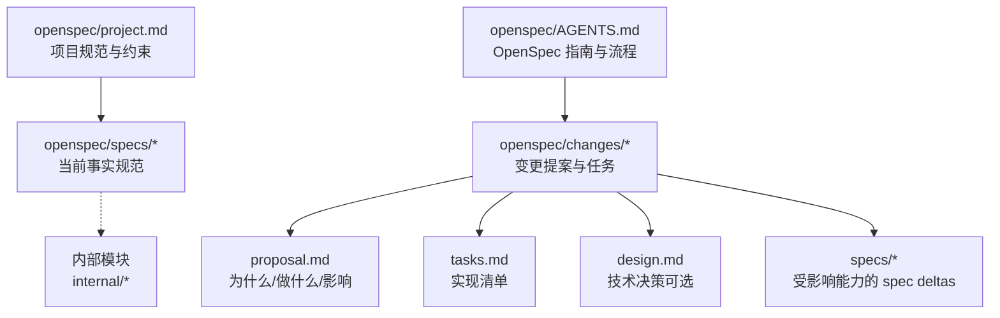
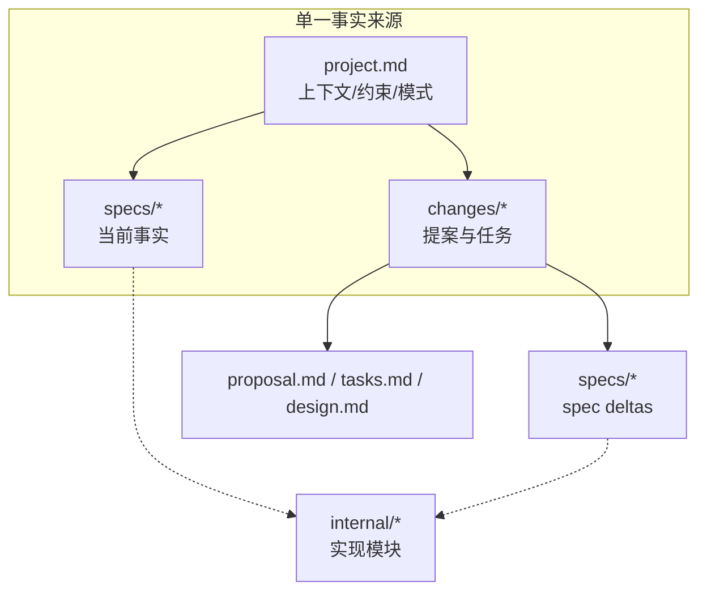
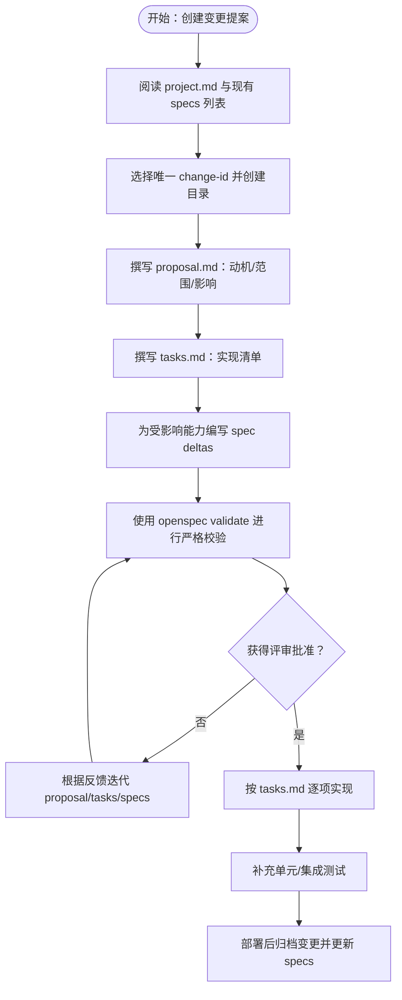
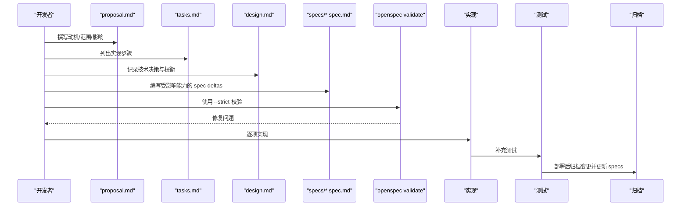
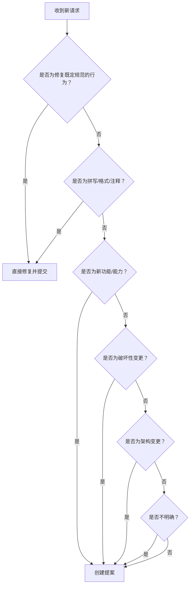
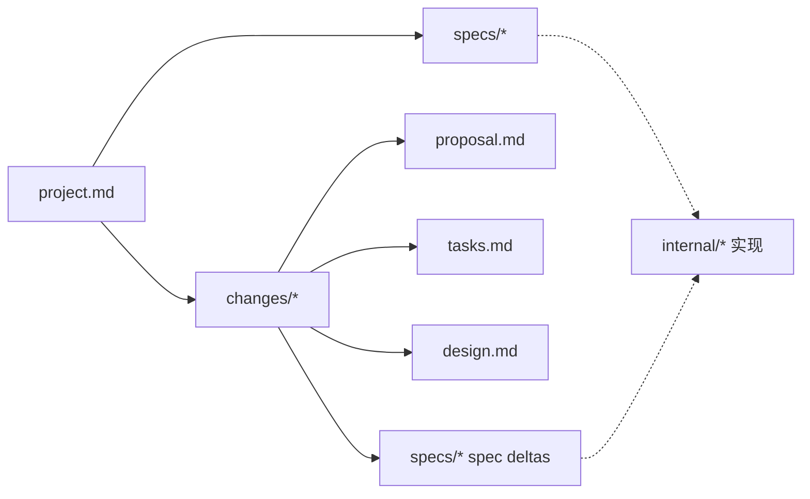

# 设计文档

<cite>
**本文引用的文件**
- [openspec/project.md](file://openspec/project.md)
- [openspec/AGENTS.md](file://openspec/AGENTS.md)
- [openspec/changes/add-v0-1-basic-routing-lb/proposal.md](file://openspec/changes/add-v0-1-basic-routing-lb/proposal.md)
- [openspec/changes/add-v0-1-basic-routing-lb/tasks.md](file://openspec/changes/add-v0-1-basic-routing-lb/tasks.md)
- [openspec/changes/add-v0-1-basic-routing-lb/specs/gateway-routing/spec.md](file://openspec/changes/add-v0-1-basic-routing-lb/specs/gateway-routing/spec.md)
- [openspec/changes/add-cache-auto-reload-metrics/proposal.md](file://openspec/changes/add-cache-auto-reload-metrics/proposal.md)
- [openspec/changes/add-cache-auto-reload-metrics/tasks.md](file://openspec/changes/add-cache-auto-reload-metrics/tasks.md)
- [openspec/changes/add-cache-auto-reload-metrics/specs/gateway-cache/spec.md](file://openspec/changes/add-cache-auto-reload-metrics/specs/gateway-cache/spec.md)
- [openspec/changes/add-cache-auto-reload-metrics/specs/gateway-observability/spec.md](file://openspec/changes/add-cache-auto-reload-metrics/specs/gateway-observability/spec.md)
- [openspec/changes/add-cache-auto-reload-metrics/specs/gateway-reload/spec.md](file://openspec/changes/add-cache-auto-reload-metrics/specs/gateway-reload/spec.md)
- [openspec/changes/add-cache-auto-reload-metrics/design.md](file://openspec/changes/add-cache-auto-reload-metrics/design.md)
</cite>

## 目录
1. [引言](#引言)
2. [项目结构](#项目结构)
3. [核心组件](#核心组件)
4. [架构总览](#架构总览)
5. [详细组件分析](#详细组件分析)
6. [依赖关系分析](#依赖关系分析)
7. [性能考量](#性能考量)
8. [故障排查指南](#故障排查指南)
9. [结论](#结论)
10. [附录](#附录)

## 引言
本设计文档聚焦于 openspec 目录作为“单一事实来源”的角色，系统性说明：
- project.md 中定义的项目规范与架构原则；
- AGENTS.md 描述的变更提案流程（Decision Tree）与目录结构约定；
- 如何通过 changes/ 下的 proposal.md、tasks.md 以及 specs/ 中的 spec.md 推动新功能或架构变更；
- 设计驱动开发（Design-Driven Development）的工作流，强调在编码前进行技术决策评审，以确保系统演进的可控性与一致性。

## 项目结构
openspec 目录采用“提案-规范”双轨并行的结构化组织方式：
- openspec/project.md：项目上下文、技术栈、约定、约束与外部依赖等“当前事实”；
- openspec/AGENTS.md：OpenSpec 指南、三阶段工作流、决策树、目录结构、CLI 命令与最佳实践；
- openspec/changes/：变更提案集合，每个变更包含 proposal.md、tasks.md、可选 design.md，以及受影响能力的 spec deltas；
- openspec/specs/：已构建并部署的能力规范，作为“当前事实”。

图表来源
- [openspec/project.md](file://openspec/project.md#L1-L60)
- [openspec/AGENTS.md](file://openspec/AGENTS.md#L124-L143)

章节来源
- [openspec/project.md](file://openspec/project.md#L1-L60)
- [openspec/AGENTS.md](file://openspec/AGENTS.md#L124-L143)

## 核心组件
- 项目规范（project.md）
  - 明确目的、技术栈、代码风格、架构模式、测试策略、Git 工作流、领域概念与重要约束，为所有变更提供一致的上下文基线。
- 变更提案（changes/*）
  - proposal.md：阐述动机、范围与影响；
  - tasks.md：分步骤的实现清单；
  - design.md：跨模块或引入新依赖时的技术决策与权衡；
  - specs/*：受影响能力的规范增量（ADDED/MODIFIED/REMOVED/RENAMED）。
- 规范（specs/*）
  - 以“需求 + 场景”的形式记录“当前事实”，是系统演进的权威依据。

章节来源
- [openspec/project.md](file://openspec/project.md#L1-L60)
- [openspec/AGENTS.md](file://openspec/AGENTS.md#L146-L235)
- [openspec/changes/add-v0-1-basic-routing-lb/proposal.md](file://openspec/changes/add-v0-1-basic-routing-lb/proposal.md#L1-L20)
- [openspec/changes/add-v0-1-basic-routing-lb/tasks.md](file://openspec/changes/add-v0-1-basic-routing-lb/tasks.md#L1-L28)
- [openspec/changes/add-cache-auto-reload-metrics/proposal.md](file://openspec/changes/add-cache-auto-reload-metrics/proposal.md#L1-L12)
- [openspec/changes/add-cache-auto-reload-metrics/tasks.md](file://openspec/changes/add-cache-auto-reload-metrics/tasks.md#L1-L9)

## 架构总览
OpenSpec 的“单一事实来源”体现在：
- 规范（specs）是“当前事实”，反映已上线能力；
- 提案（changes）是“未来蓝图”，在获得评审批准后逐步落地；
- project.md 为两者提供统一的上下文与约束，确保变更与既有架构保持一致。

图表来源
- [openspec/project.md](file://openspec/project.md#L1-L60)
- [openspec/AGENTS.md](file://openspec/AGENTS.md#L124-L143)

## 详细组件分析

### 组件A：路由与负载均衡（v0.1 基线）
- 背景与目标：建立生产可用的 v0.1 网关，支持基于前缀的组路由、组内负载均衡、基础可用性与可观测性、热重载等。
- 关键要点
  - 配置驱动的路由组模型：允许/拒绝前缀、优先级、默认组；
  - 前缀匹配规则：deny 覆盖 allow，最长前缀优先，再按优先级与配置顺序；
  - 组内 LB：平滑 WRR 或哈希（HRW）策略，需跳过不健康/被剔除上游；
  - 代理层：移除客户端 key/code，注入上游 code，过滤 hop-by-hop 头并设置 Host；
  - 健康检查、被动剔除、重试（GET/HEAD）、回退组链路；
  - Prometheus 指标、JSON 日志、SIGHUP 热重载。
- 实施路径
  - 通过 proposal.md 明确范围与影响；
  - 用 tasks.md 分步推进：配置加载与校验、运行时快照、路由选择、LB、认证与注入、代理转发、健康检查、被动剔除与重试、指标、日志、热重载；
  - 用 specs/gateway-routing/spec.md 记录“需求 + 场景”，确保行为可验证。

图表来源
- [openspec/AGENTS.md](file://openspec/AGENTS.md#L146-L235)
- [openspec/changes/add-v0-1-basic-routing-lb/proposal.md](file://openspec/changes/add-v0-1-basic-routing-lb/proposal.md#L1-L20)
- [openspec/changes/add-v0-1-basic-routing-lb/tasks.md](file://openspec/changes/add-v0-1-basic-routing-lb/tasks.md#L1-L28)
- [openspec/changes/add-v0-1-basic-routing-lb/specs/gateway-routing/spec.md](file://openspec/changes/add-v0-1-basic-routing-lb/specs/gateway-routing/spec.md#L1-L63)

章节来源
- [openspec/changes/add-v0-1-basic-routing-lb/proposal.md](file://openspec/changes/add-v0-1-basic-routing-lb/proposal.md#L1-L20)
- [openspec/changes/add-v0-1-basic-routing-lb/tasks.md](file://openspec/changes/add-v0-1-basic-routing-lb/tasks.md#L1-L28)
- [openspec/changes/add-v0-1-basic-routing-lb/specs/gateway-routing/spec.md](file://openspec/changes/add-v0-1-basic-routing-lb/specs/gateway-routing/spec.md#L1-L63)

### 组件B：缓存、自动重载与可观测性（v0.2 扩展）
- 背景与目标：引入响应缓存（内存或 Redis）、自动配置重载（基于文件哈希轮询）、扩展 Prometheus 指标，降低上游负载、简化运维、提升可见性。
- 关键要点
  - 缓存提供方互斥：memory 或 redis，二者择一启用；
  - 缓存键规范化：上游路径 + 归一化查询串（移除 gateway auth 参数），保证稳定性；
  - 缓存范围：仅缓存 GET 的 2xx/3xx 响应；非 GET 或非 2xx/3xx 不缓存；
  - 自动重载：按可配置间隔轮询文件哈希，与运行时缓存哈希比较，变更则触发重载；
  - 指标扩展：缓存命中/未命中、按上游/路由的成功/失败计数器。
- 技术决策（design.md）
  - 决策点：提供方互斥、键规范化、缓存范围、默认 TTL/容量、LRU/LFU 策略、Redis 命名空间、轮询间隔与回退策略；
  - 风险与权衡：缓存一致性、Redis 故障回退、轮询频率对验证开销的影响；
  - 迁移计划：默认关闭缓存与自动重载，保留 SIGHUP 热重载。

图表来源
- [openspec/AGENTS.md](file://openspec/AGENTS.md#L146-L235)
- [openspec/changes/add-cache-auto-reload-metrics/proposal.md](file://openspec/changes/add-cache-auto-reload-metrics/proposal.md#L1-L12)
- [openspec/changes/add-cache-auto-reload-metrics/tasks.md](file://openspec/changes/add-cache-auto-reload-metrics/tasks.md#L1-L9)
- [openspec/changes/add-cache-auto-reload-metrics/design.md](file://openspec/changes/add-cache-auto-reload-metrics/design.md#L1-L34)
- [openspec/changes/add-cache-auto-reload-metrics/specs/gateway-cache/spec.md](file://openspec/changes/add-cache-auto-reload-metrics/specs/gateway-cache/spec.md#L1-L32)
- [openspec/changes/add-cache-auto-reload-metrics/specs/gateway-observability/spec.md](file://openspec/changes/add-cache-auto-reload-metrics/specs/gateway-observability/spec.md#L1-L30)
- [openspec/changes/add-cache-auto-reload-metrics/specs/gateway-reload/spec.md](file://openspec/changes/add-cache-auto-reload-metrics/specs/gateway-reload/spec.md#L1-L20)

章节来源
- [openspec/changes/add-cache-auto-reload-metrics/proposal.md](file://openspec/changes/add-cache-auto-reload-metrics/proposal.md#L1-L12)
- [openspec/changes/add-cache-auto-reload-metrics/tasks.md](file://openspec/changes/add-cache-auto-reload-metrics/tasks.md#L1-L9)
- [openspec/changes/add-cache-auto-reload-metrics/design.md](file://openspec/changes/add-cache-auto-reload-metrics/design.md#L1-L34)
- [openspec/changes/add-cache-auto-reload-metrics/specs/gateway-cache/spec.md](file://openspec/changes/add-cache-auto-reload-metrics/specs/gateway-cache/spec.md#L1-L32)
- [openspec/changes/add-cache-auto-reload-metrics/specs/gateway-observability/spec.md](file://openspec/changes/add-cache-auto-reload-metrics/specs/gateway-observability/spec.md#L1-L30)
- [openspec/changes/add-cache-auto-reload-metrics/specs/gateway-reload/spec.md](file://openspec/changes/add-cache-auto-reload-metrics/specs/gateway-reload/spec.md#L1-L20)

### 组件C：决策树与目录结构约定
- 决策树（AGENTS.md）
  - 新请求？→ Bug 修复直接修复；拼写/格式/注释直接修复；新功能/破坏性变更/架构变更/性能优化/安全变更→创建提案；
  - 不明确时→创建提案（更安全）。
- 目录结构约定（AGENTS.md）
  - openspec/changes/<change-id>/proposal.md、tasks.md、design.md（必要时）、specs/<capability>/spec.md（受影响能力的增量）；
  - 归档：将完成的变更移动到 openspec/changes/archive/ 并更新 specs。

图表来源
- [openspec/AGENTS.md](file://openspec/AGENTS.md#L146-L156)

章节来源
- [openspec/AGENTS.md](file://openspec/AGENTS.md#L146-L156)
- [openspec/AGENTS.md](file://openspec/AGENTS.md#L124-L143)

## 依赖关系分析
- project.md 为所有变更提供上下文与约束，specs 与 changes 共同构成“当前事实”与“未来蓝图”的闭环；
- changes 中的 proposal.md 与 tasks.md 是实现的路线图，design.md 在跨模块或引入新依赖时提供技术决策；
- specs 中的 spec deltas 与 project.md 的约束共同决定实现边界与质量门禁；
- AGENTS.md 的 CLI 与流程规范保障变更的可追踪与可审计。

图表来源
- [openspec/project.md](file://openspec/project.md#L1-L60)
- [openspec/AGENTS.md](file://openspec/AGENTS.md#L124-L143)

章节来源
- [openspec/project.md](file://openspec/project.md#L1-L60)
- [openspec/AGENTS.md](file://openspec/AGENTS.md#L124-L143)

## 性能考量
- 缓存策略
  - 默认关闭缓存，避免引入额外复杂度与一致性风险；
  - TTL、容量与淘汰策略需结合业务规模与上游能力评估；
  - Redis 出错时应降级至内存缓存并记录错误。
- 自动重载
  - 轮询间隔不宜过小，避免频繁触发配置校验；
  - 成功重载后才更新缓存哈希，失败则保持旧运行时不变。
- 指标粒度
  - 上游/路由/缓存命中/未命中计数器有助于定位热点与异常；
  - 与健康检查、重试/回退配合，形成闭环观测。

## 故障排查指南
- 常见问题
  - “变更必须至少包含一个增量”：检查 changes/<name>/specs/ 是否存在且包含 ADDED/MODIFIED/REMOVED/RENAMED 前缀；
  - “需求必须至少包含一个场景”：确认场景使用“#### Scenario: 名称”格式，且不使用粗体或项目符号；
  - 场景解析静默失败：使用 openspec show <change> --json --deltas-only 定位具体问题。
- 诊断建议
  - 使用 --strict 模式进行全面校验；
  - 通过 openspec show <spec> --json 查看特定需求细节；
  - 若冲突或重叠，先运行 openspec list 检查活动变更，协调相关变更负责人合并提案。

章节来源
- [openspec/AGENTS.md](file://openspec/AGENTS.md#L289-L316)
- [openspec/AGENTS.md](file://openspec/AGENTS.md#L414-L433)

## 结论
通过将 openspec 作为“单一事实来源”，项目实现了“规范先行、评审驱动、闭环归档”的设计驱动开发模式。project.md 提供统一上下文，AGENTS.md 规范流程与工具，changes 与 specs 分别承载“蓝图”与“事实”。该体系确保了系统演进的可控性与一致性，降低了技术债与回归风险。

## 附录
- 快速参考
  - 列举现状：openspec list、openspec list --specs；
  - 查看详情：openspec show <item>；
  - 差异对比：openspec diff <change>；
  - 校验变更：openspec validate <item> --strict；
  - 归档变更：openspec archive <change> [--yes|-y]。

章节来源
- [openspec/AGENTS.md](file://openspec/AGENTS.md#L448-L457)