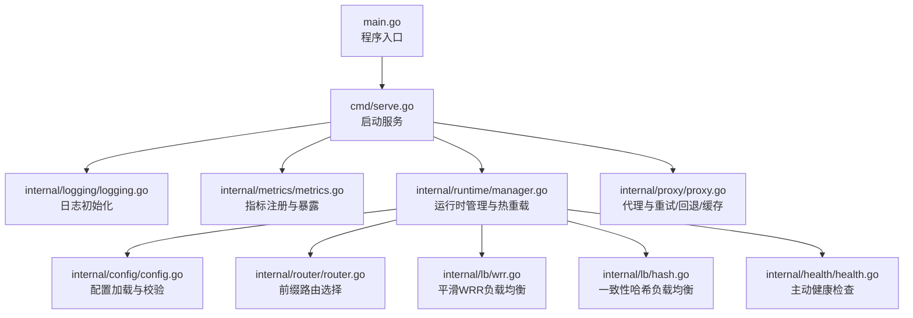
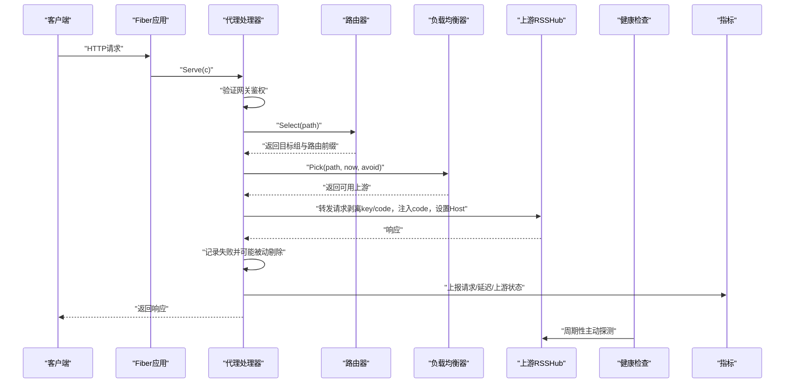
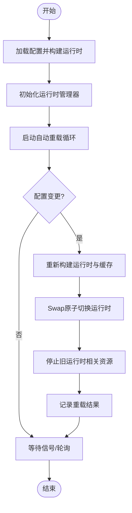
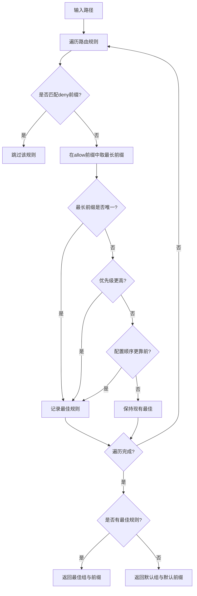
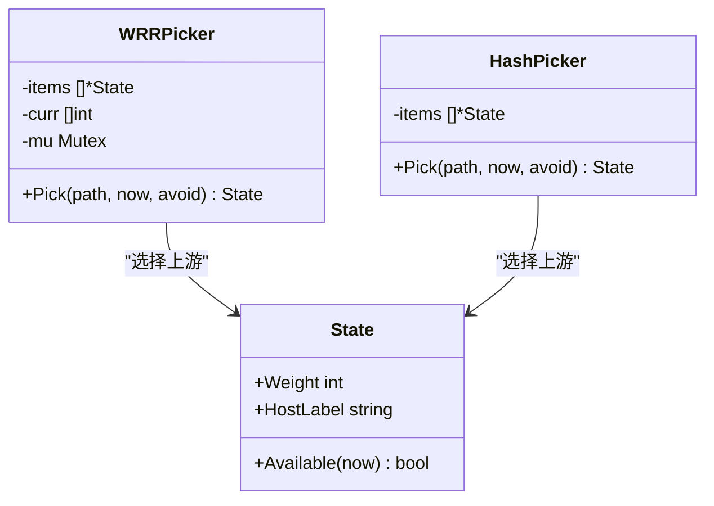
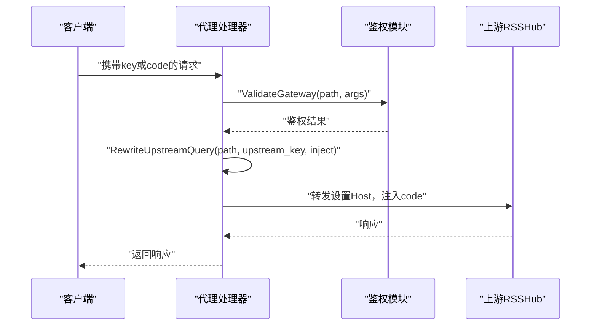
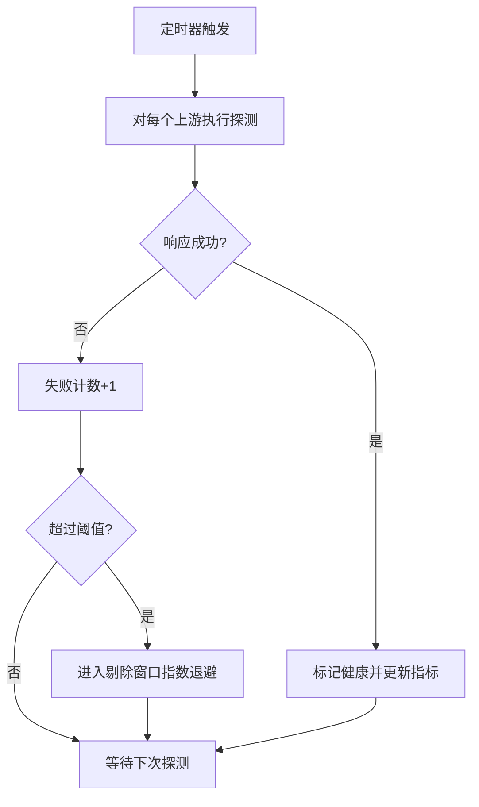
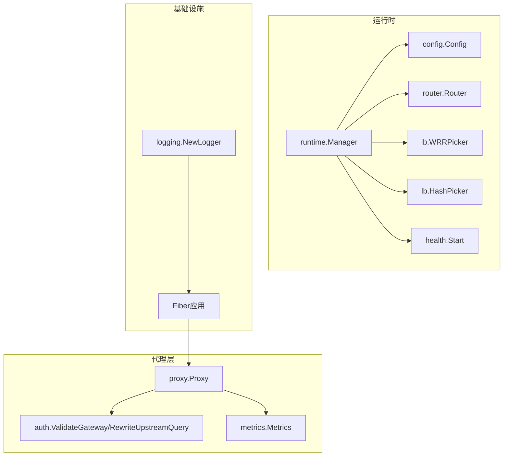

# 项目规范

<cite>
**本文引用的文件列表**
- [openspec/project.md](file://openspec/project.md)
- [go.mod](file://go.mod)
- [main.go](file://main.go)
- [cmd/serve.go](file://cmd/serve.go)
- [internal/config/config.go](file://internal/config/config.go)
- [internal/runtime/manager.go](file://internal/runtime/manager.go)
- [internal/router/router.go](file://internal/router/router.go)
- [internal/lb/wrr.go](file://internal/lb/wrr.go)
- [internal/lb/hash.go](file://internal/lb/hash.go)
- [internal/auth/auth.go](file://internal/auth/auth.go)
- [internal/proxy/proxy.go](file://internal/proxy/proxy.go)
- [internal/metrics/metrics.go](file://internal/metrics/metrics.go)
- [internal/health/health.go](file://internal/health/health.go)
- [internal/logging/logging.go](file://internal/logging/logging.go)
</cite>

## 目录
1. [引言](#引言)
2. [项目结构](#项目结构)
3. [核心组件](#核心组件)
4. [架构总览](#架构总览)
5. [详细组件分析](#详细组件分析)
6. [依赖关系分析](#依赖关系分析)
7. [性能考量](#性能考量)
8. [故障排查指南](#故障排查指南)
9. [结论](#结论)
10. [附录](#附录)

## 引言
本文件系统性阐述 RSSHub-Gateway 的项目规范，聚焦以下方面：
- 项目上下文：作为多实例 RSSHub 部署的单一入口网关，提供路由、鉴权、负载均衡、健康检查、可观测性与热重载能力。
- 技术栈：Go 1.22+、Fiber + fasthttp、prometheus/client_golang、gopkg.in/yaml.v3、zap/zerolog 日志库。
- 架构模式：不可变运行时快照热重载、前缀匹配路由规则、组级负载均衡策略、代理层请求重写。
- 关键约束：禁止转发网关密钥、指标端点需 accesskey 认证、仅 GET/HEAD 可重试且最多一次、默认分组必须存在等。

**章节来源**
- [openspec/project.md](file://openspec/project.md#L1-L60)

## 项目结构
项目采用清晰的模块化组织，遵循“命令入口 + 内部子模块”的布局：
- 命令入口：main.go 调用 cmd.Execute，构建 CLI 子命令。
- 服务启动：cmd/serve.go 初始化日志、指标、运行时管理器与 Fiber 应用，并监听信号以支持 SIGHUP 热重载。
- 核心内部模块：internal/{config,runtime,router,lb,upstream,health,proxy,metrics,logging}，职责明确、可测试性强。
- 配置与规范：openspec/project.md 定义了项目上下文、技术栈、约定与约束；go.mod 明确版本与依赖。

**图表来源**
- [main.go](file://main.go#L1-L22)
- [cmd/serve.go](file://cmd/serve.go#L1-L66)
- [internal/runtime/manager.go](file://internal/runtime/manager.go#L1-L173)
- [internal/config/config.go](file://internal/config/config.go#L1-L476)
- [internal/router/router.go](file://internal/router/router.go#L1-L80)
- [internal/lb/wrr.go](file://internal/lb/wrr.go#L1-L51)
- [internal/lb/hash.go](file://internal/lb/hash.go#L1-L49)
- [internal/health/health.go](file://internal/health/health.go#L1-L115)
- [internal/proxy/proxy.go](file://internal/proxy/proxy.go#L1-L419)
- [internal/metrics/metrics.go](file://internal/metrics/metrics.go#L1-L123)
- [internal/logging/logging.go](file://internal/logging/logging.go#L1-L8)

**章节来源**
- [openspec/project.md](file://openspec/project.md#L17-L35)
- [go.mod](file://go.mod#L1-L37)
- [main.go](file://main.go#L1-L22)
- [cmd/serve.go](file://cmd/serve.go#L1-L66)

## 核心组件
- 运行时管理器：负责配置加载、构建运行时、热重载、自动轮询与缓存存储管理。
- 路由器：基于 allow/deny 前缀匹配，最长前缀优先、再按优先级、最后按配置顺序选择目标组。
- 负载均衡：支持平滑 WRR 与一致性哈希（HRW），均跳过不健康/被剔除上游。
- 鉴权与代理：双层鉴权（网关层 key/code + 上游注入 code），代理层剥离客户端 key/code、注入上游 code 并设置 Host 头。
- 健康检查：主动探测上游 /healthz，失败计数达到阈值则被动剔除并指数退避。
- 指标与日志：Prometheus 指标暴露、JSON 结构化日志、pprof 调试接口。

**章节来源**
- [openspec/project.md](file://openspec/project.md#L17-L35)
- [internal/runtime/manager.go](file://internal/runtime/manager.go#L1-L173)
- [internal/router/router.go](file://internal/router/router.go#L1-L80)
- [internal/lb/wrr.go](file://internal/lb/wrr.go#L1-L51)
- [internal/lb/hash.go](file://internal/lb/hash.go#L1-L49)
- [internal/auth/auth.go](file://internal/auth/auth.go#L1-L58)
- [internal/proxy/proxy.go](file://internal/proxy/proxy.go#L1-L419)
- [internal/health/health.go](file://internal/health/health.go#L1-L115)
- [internal/metrics/metrics.go](file://internal/metrics/metrics.go#L1-L123)
- [internal/logging/logging.go](file://internal/logging/logging.go#L1-L8)

## 架构总览
下图展示从请求进入网关到上游 RSSHub 实例的关键流程，涵盖鉴权、路由、负载均衡、健康检查、重试与回退、缓存与指标记录。

**图表来源**
- [cmd/serve.go](file://cmd/serve.go#L1-L66)
- [internal/proxy/proxy.go](file://internal/proxy/proxy.go#L1-L419)
- [internal/router/router.go](file://internal/router/router.go#L1-L80)
- [internal/lb/wrr.go](file://internal/lb/wrr.go#L1-L51)
- [internal/lb/hash.go](file://internal/lb/hash.go#L1-L49)
- [internal/health/health.go](file://internal/health/health.go#L1-L115)
- [internal/metrics/metrics.go](file://internal/metrics/metrics.go#L1-L123)

## 详细组件分析

### 运行时管理与热重载
- 不可变运行时快照：使用 atomic.Value 保存当前运行时，重载时构建新运行时并通过 Swap 切换，旧运行时通过 Stop 停止相关协程。
- 自动重载：基于配置文件哈希与可选轮询，检测变更后重建运行时并更新缓存存储。
- 信号处理：监听 SIGHUP 触发热重载，SIGINT/SIGTERM 触发优雅关闭。

**图表来源**
- [internal/runtime/manager.go](file://internal/runtime/manager.go#L1-L173)
- [cmd/serve.go](file://cmd/serve.go#L1-L66)

**章节来源**
- [openspec/project.md](file://openspec/project.md#L24-L30)
- [internal/runtime/manager.go](file://internal/runtime/manager.go#L1-L173)
- [cmd/serve.go](file://cmd/serve.go#L1-L66)

### 路由选择与前缀匹配
- 规则：先排除 deny 前缀，再在 allow 前缀中取最长前缀；若相同长度，比较优先级；若仍相同，按配置顺序。
- 默认组：当无匹配路由时，退回默认组与默认路由前缀。

**图表来源**
- [internal/router/router.go](file://internal/router/router.go#L1-L80)

**章节来源**
- [openspec/project.md](file://openspec/project.md#L24-L30)
- [internal/router/router.go](file://internal/router/router.go#L1-L80)

### 负载均衡策略
- 平滑 WRR：维护每个上游的当前权重，命中后累加权重并以总权重归一化，最终选择当前权重最大的上游。
- 一致性哈希（HRW）：对路径与上游标签组合计算哈希，取最小得分的上游，权重参与归一化。
- 选择逻辑：均跳过不健康或被剔除的上游；支持避免集合以实现重试时切换上游。

**图表来源**
- [internal/lb/wrr.go](file://internal/lb/wrr.go#L1-L51)
- [internal/lb/hash.go](file://internal/lb/hash.go#L1-L49)

**章节来源**
- [openspec/project.md](file://openspec/project.md#L24-L30)
- [internal/lb/wrr.go](file://internal/lb/wrr.go#L1-L51)
- [internal/lb/hash.go](file://internal/lb/hash.go#L1-L49)

### 鉴权与代理层重写
- 网关鉴权：支持 key 或 code 两种方式，code 为 md5(path+gateway_access_key)；可配置绕过路径。
- 上游注入：代理层剥离客户端 key/code，注入 md5(path+upstream_access_key)，并设置 Host 为上游主机。
- 请求头处理：过滤 hop-by-hop 头，避免泄露下游细节。

**图表来源**
- [internal/auth/auth.go](file://internal/auth/auth.go#L1-L58)
- [internal/proxy/proxy.go](file://internal/proxy/proxy.go#L1-L419)

**章节来源**
- [openspec/project.md](file://openspec/project.md#L24-L30)
- [internal/auth/auth.go](file://internal/auth/auth.go#L1-L58)
- [internal/proxy/proxy.go](file://internal/proxy/proxy.go#L1-L419)

### 健康检查与被动剔除
- 主动健康检查：周期性向上游 /healthz 发起探测，超时或非 2xx 视为失败；连续失败达到阈值标记不健康。
- 被动剔除：对连接/超时/5xx 等错误进行计数，超过阈值后进入指数退避剔除窗口，期间不再调度。
- 指标联动：健康状态变化同步到指标，便于监控告警。

**图表来源**
- [internal/health/health.go](file://internal/health/health.go#L1-L115)
- [internal/metrics/metrics.go](file://internal/metrics/metrics.go#L1-L123)

**章节来源**
- [openspec/project.md](file://openspec/project.md#L24-L30)
- [internal/health/health.go](file://internal/health/health.go#L1-L115)
- [internal/metrics/metrics.go](file://internal/metrics/metrics.go#L1-L123)

### 指标与日志
- 指标：包含请求总量/时延、上游请求/成功率/失败率、路由成功率/失败率、缓存命中/未命中、上游健康状态、剔除次数、重试次数、回退次数、配置重载次数等。
- 暴露：/metrics 需要 accesskey 参数认证；pprof 调试接口同样需要 accesskey。
- 日志：JSON 结构化日志，记录访问信息、错误类型、回退链路等。

**章节来源**
- [openspec/project.md](file://openspec/project.md#L10-L16)
- [internal/metrics/metrics.go](file://internal/metrics/metrics.go#L1-L123)
- [internal/proxy/proxy.go](file://internal/proxy/proxy.go#L1-L419)
- [internal/logging/logging.go](file://internal/logging/logging.go#L1-L8)

## 依赖关系分析
- 技术栈与版本：Go 1.23.2（go.mod 中声明），Fiber + fasthttp 提供高性能 Web 与 HTTP 客户端；prometheus/client_golang 提供指标注册与导出；gopkg.in/yaml.v3 解析配置；zap 提供生产级日志。
- 组件耦合：运行时管理器聚合配置、路由、负载均衡、健康检查与缓存；代理处理器贯穿鉴权、路由、LB、重试/回退、缓存与指标；各模块通过接口/结构体字段解耦。

**图表来源**
- [go.mod](file://go.mod#L1-L37)
- [internal/runtime/manager.go](file://internal/runtime/manager.go#L1-L173)
- [internal/config/config.go](file://internal/config/config.go#L1-L476)
- [internal/router/router.go](file://internal/router/router.go#L1-L80)
- [internal/lb/wrr.go](file://internal/lb/wrr.go#L1-L51)
- [internal/lb/hash.go](file://internal/lb/hash.go#L1-L49)
- [internal/health/health.go](file://internal/health/health.go#L1-L115)
- [internal/proxy/proxy.go](file://internal/proxy/proxy.go#L1-L419)
- [internal/auth/auth.go](file://internal/auth/auth.go#L1-L58)
- [internal/metrics/metrics.go](file://internal/metrics/metrics.go#L1-L123)
- [internal/logging/logging.go](file://internal/logging/logging.go#L1-L8)
- [cmd/serve.go](file://cmd/serve.go#L1-L66)

**章节来源**
- [go.mod](file://go.mod#L1-L37)
- [internal/runtime/manager.go](file://internal/runtime/manager.go#L1-L173)

## 性能考量
- 低开销网络栈：Fiber + fasthttp 提供高吞吐低延迟的 HTTP 处理与请求发送。
- 负载均衡公平性：平滑 WRR 与 HRW 在不同场景下平衡吞吐与一致性。
- 缓存策略：GET 请求在命中时直接返回缓存响应，减少上游压力；仅缓存成功状态码响应。
- 指标观测：通过直方图统计请求时延，辅助定位性能瓶颈。
- 重试与回退：仅对 GET/HEAD 允许重试，避免放大上游压力；回退链路减少单点故障影响。

[本节为通用性能建议，无需特定文件引用]

## 故障排查指南
- 配置问题
  - 确认配置文件路径与权限正确，必要时启用自动重载轮询。
  - 关注配置校验错误：默认组不存在、上游 URL 非法、LB 策略非法、缓存参数越界等。
- 鉴权失败
  - 确认网关鉴权已启用且 access_key 正确；code 为 md5(path+gateway_access_key)。
  - 检查是否误传网关 key 至上游（代理层会剥离）。
- 负载均衡异常
  - 检查上游权重与健康状态；确认剔除窗口内上游未被调度。
- 重试与回退
  - 仅 GET/HEAD 支持重试，且最多一次；若上游持续失败，观察回退链路与指标。
- 指标与日志
  - /metrics 需 accesskey 认证；pprof 同理。
  - 查看 access 日志中的 err_type、fallback_chain 字段定位问题。

**章节来源**
- [internal/config/config.go](file://internal/config/config.go#L321-L476)
- [internal/auth/auth.go](file://internal/auth/auth.go#L1-L58)
- [internal/proxy/proxy.go](file://internal/proxy/proxy.go#L1-L419)
- [internal/metrics/metrics.go](file://internal/metrics/metrics.go#L1-L123)

## 结论
RSSHub-Gateway 通过清晰的模块划分与严谨的项目规范，实现了多实例 RSSHub 的统一入口与高可用转发。其不可变运行时热重载、前缀路由与组级负载均衡、双层鉴权与代理重写、主动健康检查与被动剔除、以及完善的 Prometheus 指标与 JSON 日志，共同构成了稳定、可观测、易运维的生产级网关方案。严格遵守项目约束（如禁止转发网关密钥、指标端点认证、重试限制、默认分组存在等）是保障系统安全与稳定的前提。

[本节为总结性内容，无需特定文件引用]

## 附录

### 重要约束清单
- 禁止转发网关密钥：代理层剥离客户端 key/code，不透传至上游。
- 指标端点认证：/metrics 需要 accesskey 参数认证。
- 重试限制：仅 GET/HEAD 方法可重试，最多一次，且必须切换上游。
- 回退策略：目标组不可用时尝试回退组，否则返回 502；超时返回 504。
- 默认分组：必须存在 routing.default_group，且上游 URL 必须为 http/https。
- 默认代码模式：默认分组在 code 模式下需要 access_key。
- 版本与依赖：Go 1.23.2，Fiber + fasthttp，prometheus/client_golang，yaml.v3，zap/zerolog。

**章节来源**
- [openspec/project.md](file://openspec/project.md#L48-L60)
- [internal/proxy/proxy.go](file://internal/proxy/proxy.go#L1-L419)
- [internal/metrics/metrics.go](file://internal/metrics/metrics.go#L1-L123)
- [internal/config/config.go](file://internal/config/config.go#L321-L476)