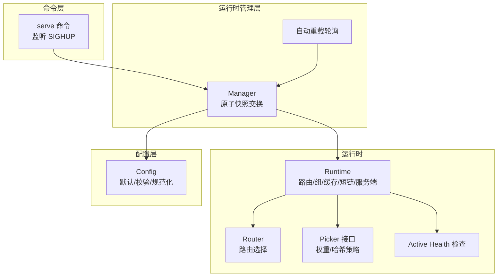
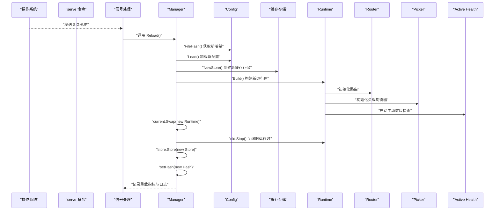
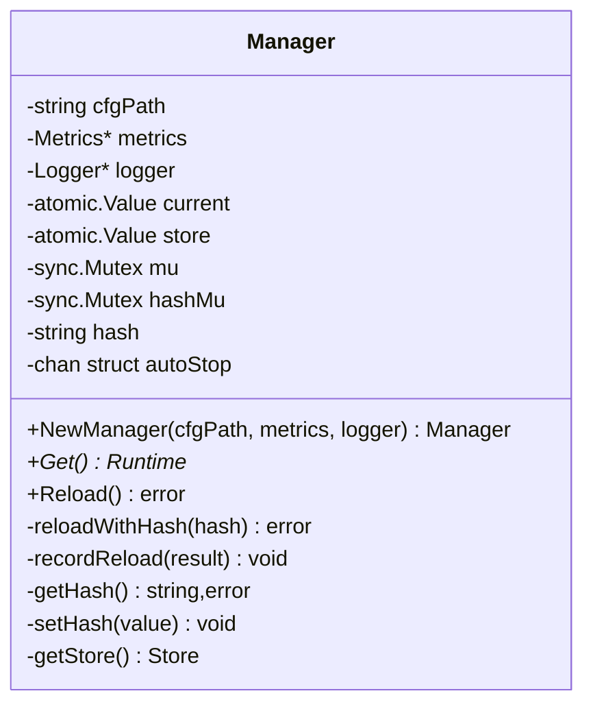
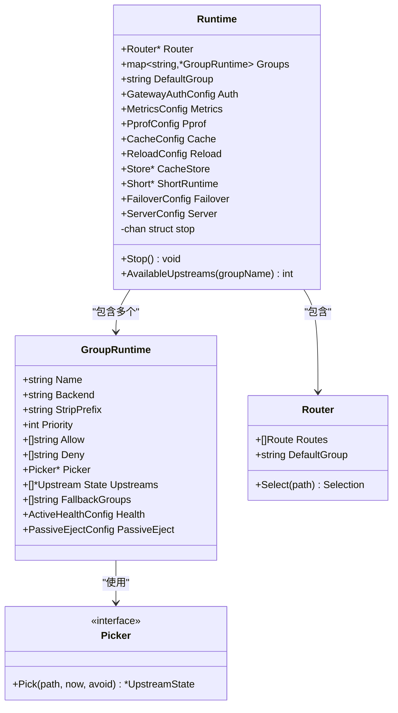
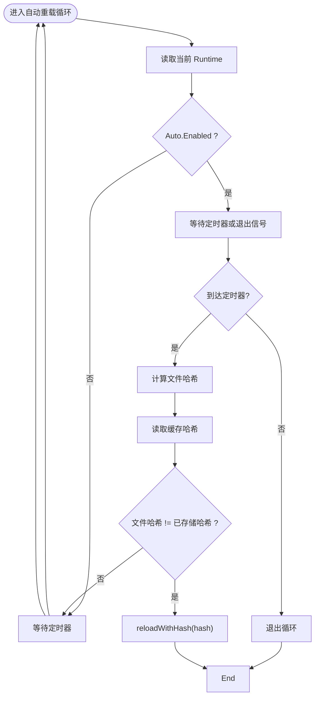
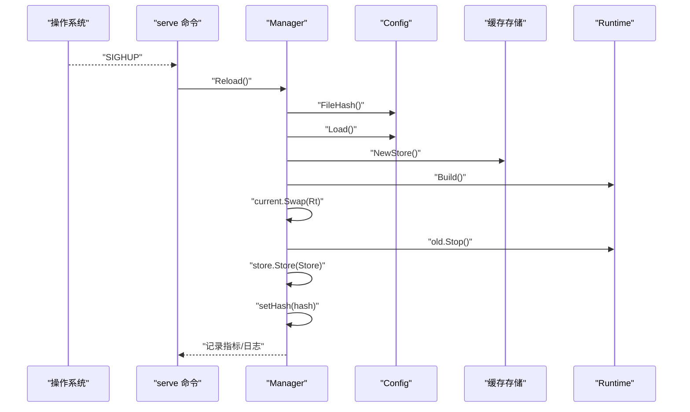
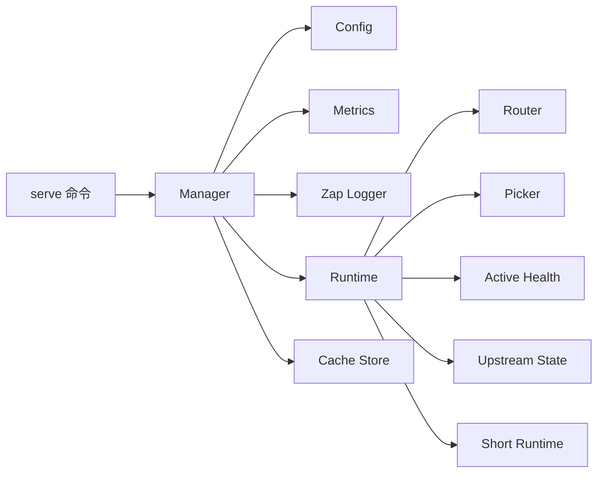

# 运行时与热重载

<cite>
**本文引用的文件**
- [internal/runtime/manager.go](file://internal/runtime/manager.go)
- [internal/runtime/runtime.go](file://internal/runtime/runtime.go)
- [internal/runtime/auto_reload.go](file://internal/runtime/auto_reload.go)
- [cmd/serve.go](file://cmd/serve.go)
- [internal/config/config.go](file://internal/config/config.go)
- [internal/router/router.go](file://internal/router/router.go)
- [internal/lb/picker.go](file://internal/lb/picker.go)
- [internal/health/health.go](file://internal/health/health.go)
- [openspec/changes/add-v0-1-basic-routing-lb/specs/gateway-reload/spec.md](file://openspec/changes/add-v0-1-basic-routing-lb/specs/gateway-reload/spec.md)
- [openspec/changes/add-cache-auto-reload-metrics/specs/gateway-reload/spec.md](file://openspec/changes/add-cache-auto-reload-metrics/specs/gateway-reload/spec.md)
</cite>

## 目录
1. [简介](#简介)
2. [项目结构](#项目结构)
3. [核心组件](#核心组件)
4. [架构总览](#架构总览)
5. [详细组件分析](#详细组件分析)
6. [依赖关系分析](#依赖关系分析)
7. [性能考量](#性能考量)
8. [故障排查指南](#故障排查指南)
9. [结论](#结论)
10. [附录：操作指南与最佳实践](#附录操作指南与最佳实践)

## 简介
本文件围绕运行时管理器与配置热重载机制展开，重点解释 runtime.Manager 如何通过原子操作交换运行时快照，实现配置的零停机更新；梳理 SIGHUP 信号的监听与处理流程；说明配置重载过程中的验证、回滚与状态同步机制；并结合 manager.go 与 runtime.go 的实现，阐述 Runtime 对象的构建过程及其包含的组件（路由表、负载均衡器、健康检查器等）。最后提供操作指南，帮助用户安全地更新配置并验证重载结果，同时指出潜在风险与注意事项。

## 项目结构
- 运行时与热重载相关的核心位于 internal/runtime：
  - manager.go：运行时管理器，负责加载、校验、构建、替换运行时快照，并记录重载指标与日志。
  - runtime.go：运行时对象定义与构建逻辑，包含路由、组、缓存、短链、服务端配置等。
  - auto_reload.go：自动轮询检测配置变更并触发重载。
- 命令入口 cmd/serve.go：启动 Fiber 应用，注册 SIGHUP 处理器，调用 Manager.Reload 实现热重载。
- 配置与校验 internal/config/config.go：提供默认值注入、路径规范化、关键字段校验等。
- 路由与负载均衡 internal/router/router.go、internal/lb/picker.go。
- 健康检查 internal/health/health.go。

图表来源
- [cmd/serve.go](file://cmd/serve.go#L1-L66)
- [internal/runtime/manager.go](file://internal/runtime/manager.go#L1-L173)
- [internal/runtime/auto_reload.go](file://internal/runtime/auto_reload.go#L1-L66)
- [internal/runtime/runtime.go](file://internal/runtime/runtime.go#L1-L155)
- [internal/config/config.go](file://internal/config/config.go#L160-L359)
- [internal/router/router.go](file://internal/router/router.go#L1-L80)
- [internal/lb/picker.go](file://internal/lb/picker.go#L1-L12)
- [internal/health/health.go](file://internal/health/health.go#L1-L115)

章节来源
- [cmd/serve.go](file://cmd/serve.go#L1-L66)
- [internal/runtime/manager.go](file://internal/runtime/manager.go#L1-L173)
- [internal/runtime/auto_reload.go](file://internal/runtime/auto_reload.go#L1-L66)
- [internal/runtime/runtime.go](file://internal/runtime/runtime.go#L1-L155)
- [internal/config/config.go](file://internal/config/config.go#L160-L359)

## 核心组件
- Manager：持有当前运行时快照与缓存存储快照，提供 Get、Reload、记录指标与日志、维护配置哈希等功能。
- Runtime：封装路由、组、认证、指标、pprof、缓存、短链、故障转移、服务器配置等，支持优雅停止。
- 自动重载：基于配置文件哈希对比，周期性检测变更并触发重载。
- 命令入口：监听 SIGHUP，调用 Manager.Reload 完成热重载。

章节来源
- [internal/runtime/manager.go](file://internal/runtime/manager.go#L1-L173)
- [internal/runtime/runtime.go](file://internal/runtime/runtime.go#L1-L155)
- [internal/runtime/auto_reload.go](file://internal/runtime/auto_reload.go#L1-L66)
- [cmd/serve.go](file://cmd/serve.go#L1-L66)

## 架构总览
下图展示从命令入口到运行时管理器、再到运行时对象与各子系统的交互关系，以及 SIGHUP 触发的重载路径。

图表来源
- [cmd/serve.go](file://cmd/serve.go#L1-L66)
- [internal/runtime/manager.go](file://internal/runtime/manager.go#L76-L126)
- [internal/runtime/runtime.go](file://internal/runtime/runtime.go#L49-L126)
- [internal/runtime/auto_reload.go](file://internal/runtime/auto_reload.go#L1-L66)
- [internal/config/config.go](file://internal/config/config.go#L160-L359)

## 详细组件分析

### 运行时管理器 Manager
- 原子快照交换：使用 atomic.Value 存储 current 与 store，Reload 时先构建新 Runtime 与新缓存存储，再通过 Swap 一次性替换，确保读取侧无锁、零停机。
- 并发控制：Reload 使用互斥锁保护配置加载、新运行时构建与旧运行时关闭的顺序执行；哈希读写使用独立互斥锁。
- 配置哈希：首次启动与每次重载后，将文件哈希写入缓存存储（键名固定）与内存，用于自动重载轮询判断是否需要重载。
- 指标与日志：记录重载结果（成功/失败），便于可观测性。
- 自动重载：在后台循环中按配置间隔轮询，比较文件哈希与已缓存哈希，一致则跳过，不一致则触发重载。

图表来源
- [internal/runtime/manager.go](file://internal/runtime/manager.go#L1-L173)

章节来源
- [internal/runtime/manager.go](file://internal/runtime/manager.go#L1-L173)

### 运行时 Runtime 及其构建
- 组与上游：遍历配置组，解析上游 URL，构造上游状态，初始化负载均衡器（默认 WRR，可选哈希策略），并设置允许/拒绝前缀、优先级、回退组、主动健康检查参数与被动剔除策略。
- 路由：根据组的 Allow/Deny/Priority/Order 构建路由表，指定默认组。
- 短链：启用/禁用、路径与条目映射。
- 缓存：传入缓存存储实例，供代理与其它组件使用。
- 服务端：包含监听地址、超时等。
- 主动健康检查：若组启用了主动健康检查，则为该组启动定时探测协程。
- 停止：关闭停止通道并关闭缓存存储，释放资源。

图表来源
- [internal/runtime/runtime.go](file://internal/runtime/runtime.go#L1-L155)
- [internal/router/router.go](file://internal/router/router.go#L1-L80)
- [internal/lb/picker.go](file://internal/lb/picker.go#L1-L12)

章节来源
- [internal/runtime/runtime.go](file://internal/runtime/runtime.go#L1-L155)
- [internal/router/router.go](file://internal/router/router.go#L1-L80)
- [internal/lb/picker.go](file://internal/lb/picker.go#L1-L12)

### 自动重载轮询
- 依据 Runtime.Reload.Auto.Enabled 与 IntervalMS 决定轮询间隔，默认 30 秒。
- 每次轮询先获取文件哈希，再读取缓存中的已存储哈希，二者不一致才触发重载。
- 发生错误时仅记录警告，不影响后续轮询。

图表来源
- [internal/runtime/auto_reload.go](file://internal/runtime/auto_reload.go#L1-L66)
- [internal/runtime/manager.go](file://internal/runtime/manager.go#L137-L165)

章节来源
- [internal/runtime/auto_reload.go](file://internal/runtime/auto_reload.go#L1-L66)
- [internal/runtime/manager.go](file://internal/runtime/manager.go#L137-L165)

### SIGHUP 信号处理与重载流程
- 命令入口注册 SIGHUP、SIGINT、SIGTERM，收到 SIGHUP 后调用 Manager.Reload。
- Reload 流程：
  1) 计算文件哈希；
  2) 加载新配置并构建新缓存存储；
  3) 构建新 Runtime；
  4) 原子交换 current 快照；
  5) 关闭旧 Runtime；
  6) 更新 store 与哈希；
  7) 记录指标与日志。

图表来源
- [cmd/serve.go](file://cmd/serve.go#L1-L66)
- [internal/runtime/manager.go](file://internal/runtime/manager.go#L76-L126)

章节来源
- [cmd/serve.go](file://cmd/serve.go#L1-L66)
- [internal/runtime/manager.go](file://internal/runtime/manager.go#L76-L126)

### 配置验证、回滚与状态同步
- 验证：配置加载后会进行默认值注入、路径规范化与关键字段校验（如鉴权、指标、pprof、缓存等），失败则返回错误，不替换运行时。
- 回滚：当构建新运行时失败时，会关闭新建的缓存存储并记录失败，旧运行时保持不变。
- 状态同步：主动健康检查在新 Runtime 中启动，旧 Runtime 在 Swap 后被关闭，避免资源泄漏。

章节来源
- [internal/config/config.go](file://internal/config/config.go#L160-L359)
- [internal/runtime/manager.go](file://internal/runtime/manager.go#L86-L126)
- [internal/runtime/runtime.go](file://internal/runtime/runtime.go#L119-L126)
- [internal/health/health.go](file://internal/health/health.go#L1-L115)

## 依赖关系分析
- Manager 依赖 Config（加载、哈希）、Metrics（指标）、Zap（日志）、Cache（存储）、Runtime（构建与停止）。
- Runtime 依赖 Router（路由选择）、LB（负载均衡）、Health（主动健康检查）、Upstream（上游状态）、Short（短链）。
- serve 命令依赖 Manager 提供的热重载能力，并通过信号处理触发。

图表来源
- [cmd/serve.go](file://cmd/serve.go#L1-L66)
- [internal/runtime/manager.go](file://internal/runtime/manager.go#L1-L173)
- [internal/runtime/runtime.go](file://internal/runtime/runtime.go#L1-L155)
- [internal/router/router.go](file://internal/router/router.go#L1-L80)
- [internal/lb/picker.go](file://internal/lb/picker.go#L1-L12)
- [internal/health/health.go](file://internal/health/health.go#L1-L115)

章节来源
- [cmd/serve.go](file://cmd/serve.go#L1-L66)
- [internal/runtime/manager.go](file://internal/runtime/manager.go#L1-L173)
- [internal/runtime/runtime.go](file://internal/runtime/runtime.go#L1-L155)

## 性能考量
- 原子快照交换：读取路径无需加锁，降低请求路径开销。
- 互斥锁范围：Reload 期间仅在构建新运行时与旧运行时关闭阶段加锁，缩短临界区。
- 自动重载间隔：可配置，默认 30 秒，避免频繁 IO；当未启用自动重载时不会产生额外开销。
- 负载均衡器：默认 WRR，哈希策略可选，按需选择以平衡一致性与吞吐。
- 主动健康检查：按组配置，避免对所有上游无差别探测。

[本节为通用性能讨论，不直接分析具体文件]

## 故障排查指南
- 重载失败但旧运行时仍在：确认配置校验是否通过；查看指标与日志中“重载失败”的记录；检查缓存存储写入权限与可用性。
- 自动重载未生效：确认 Runtime.Reload.Auto.Enabled 与 IntervalMS 设置；检查文件哈希读取是否成功；观察日志中“自动重载哈希失败/读取失败”提示。
- 请求路由异常：核对路由 Allow/Deny/StripPrefix/Priority/Order 配置；确认默认组与目标组正确。
- 负载均衡不生效：检查上游 URL 解析与权重配置；确认 Picker 策略与上游数量。
- 主动健康检查异常：检查上游健康接口路径、访问密钥、网络连通性与超时设置。

章节来源
- [internal/runtime/manager.go](file://internal/runtime/manager.go#L128-L165)
- [internal/runtime/auto_reload.go](file://internal/runtime/auto_reload.go#L1-L66)
- [internal/config/config.go](file://internal/config/config.go#L321-L359)
- [internal/health/health.go](file://internal/health/health.go#L1-L115)

## 结论
通过原子快照交换与严格的重载流程，系统实现了配置的零停机更新。SIGHUP 与自动重载双通道保障了灵活性与可靠性。配置加载阶段的验证与失败回滚机制确保了运行时的稳定性。结合可观测性指标与日志，运维人员可以安全地进行配置变更并快速定位问题。

[本节为总结性内容，不直接分析具体文件]

## 附录：操作指南与最佳实践

### 操作步骤
- 触发热重载
  - 手动：向进程发送 SIGHUP 信号。
  - 自动：启用自动重载并在配置中设置轮询间隔，系统将周期性检测配置变更并重载。
- 验证重载结果
  - 查看日志中“重载成功/失败”记录。
  - 观察指标 ConfigReload 的计数变化。
  - 验证路由、负载均衡、健康检查等行为是否符合预期。

章节来源
- [cmd/serve.go](file://cmd/serve.go#L1-L66)
- [internal/runtime/manager.go](file://internal/runtime/manager.go#L76-L126)
- [openspec/changes/add-v0-1-basic-routing-lb/specs/gateway-reload/spec.md](file://openspec/changes/add-v0-1-basic-routing-lb/specs/gateway-reload/spec.md#L12-L16)
- [openspec/changes/add-cache-auto-reload-metrics/specs/gateway-reload/spec.md](file://openspec/changes/add-cache-auto-reload-metrics/specs/gateway-reload/spec.md#L16-L20)

### 最佳实践
- 在变更配置前备份原配置文件，以便快速回滚。
- 小步变更并立即触发一次 SIGHUP 验证，确认无误后再批量应用。
- 合理设置自动重载间隔，避免过于频繁导致 IO 压力。
- 对关键上游配置启用主动健康检查，确保故障及时发现与隔离。
- 使用指标与日志持续监控重载成功率与运行时状态。

[本节为通用操作建议，不直接分析具体文件]