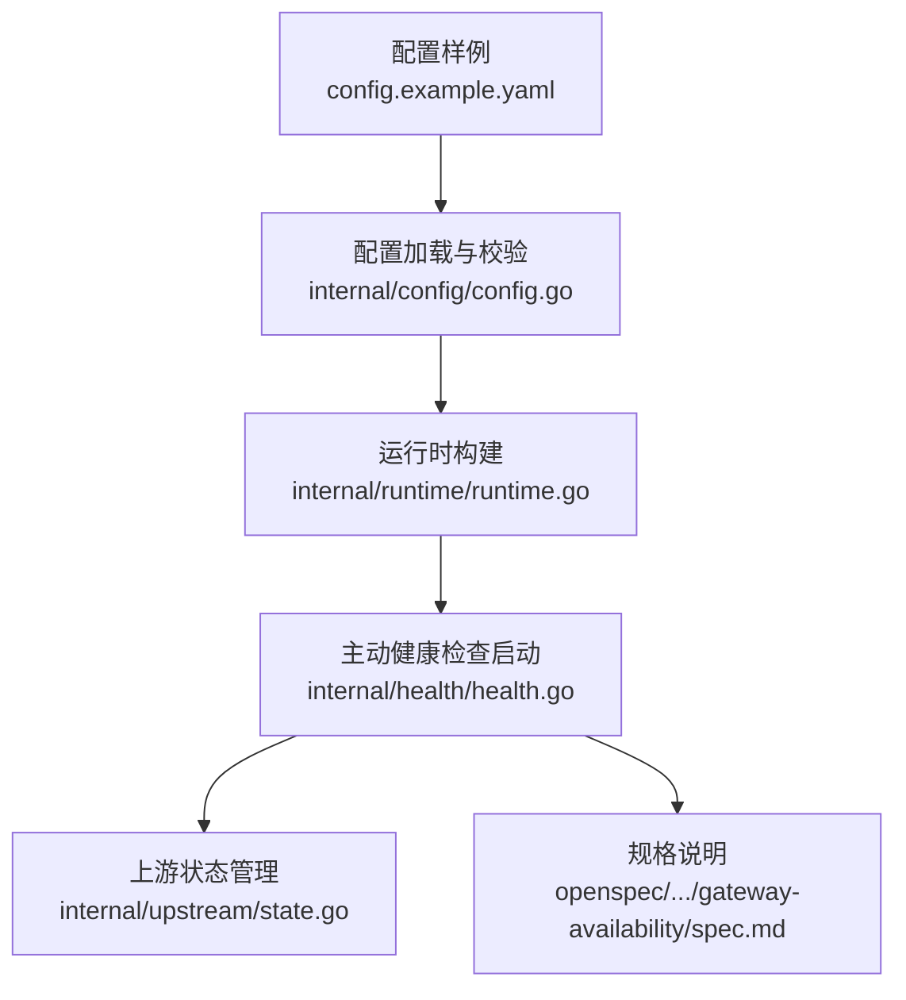
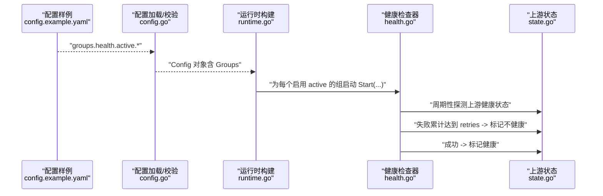
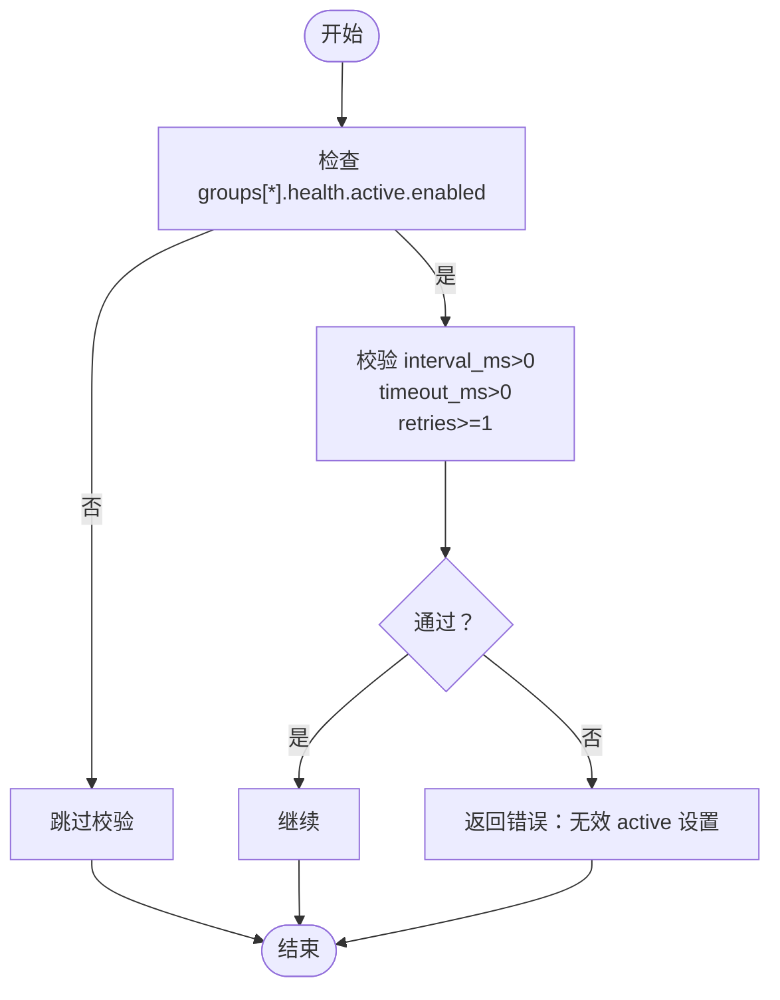
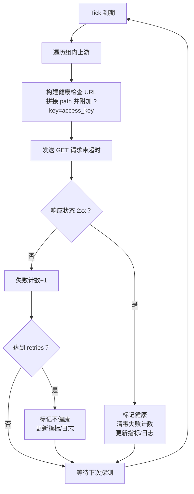
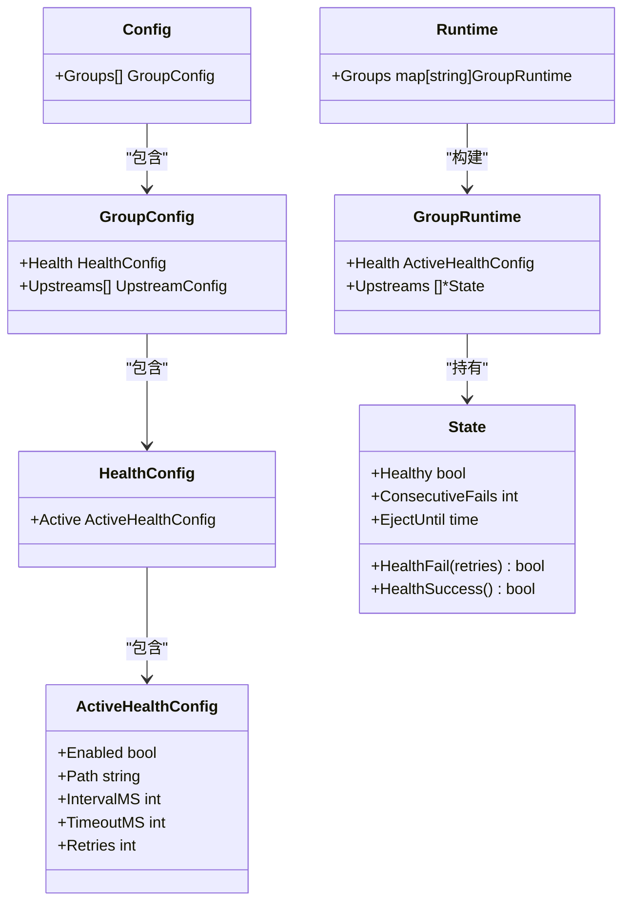

# 健康检查

<cite>
**本文引用的文件**
- [config.example.yaml](file://config.example.yaml)
- [config.go](file://internal/config/config.go)
- [health.go](file://internal/health/health.go)
- [runtime.go](file://internal/runtime/runtime.go)
- [state.go](file://internal/upstream/state.go)
- [openspec/gateway-availability/spec.md](file://openspec/changes/add-v0-1-basic-routing-lb/specs/gateway-availability/spec.md)
</cite>

## 目录
1. [简介](#简介)
2. [项目结构](#项目结构)
3. [核心组件](#核心组件)
4. [架构总览](#架构总览)
5. [详细组件分析](#详细组件分析)
6. [依赖关系分析](#依赖关系分析)
7. [性能考量](#性能考量)
8. [故障排查指南](#故障排查指南)
9. [结论](#结论)
10. [附录：配置示例与参数调优](#附录配置示例与参数调优)

## 简介
本章节聚焦于“主动健康检查”在配置文件中的定义与实现，围绕 config.example.yaml 中 groups.health.active 块的 enabled、path、interval_ms、timeout_ms 和 retries 参数，结合 internal/config/config.go 中的 HealthConfig 与 ActiveHealthConfig 结构体，解释主动健康检查的工作机制、参数校验逻辑、与上游服务的集成方式，以及在不同网络环境下的调优建议。

## 项目结构
与健康检查相关的关键文件与职责：
- 配置样例：config.example.yaml 提供 groups.health.active 的完整示例字段
- 配置解析与校验：internal/config/config.go 定义结构体与 applyDefaults/validate 校验逻辑
- 主动健康检查执行：internal/health/health.go 实现定时探测、构建请求 URL（含 access_key）、更新上游状态
- 上游状态管理：internal/upstream/state.go 维护健康状态、连续失败计数、剔除时间等
- 运行时集成：internal/runtime/runtime.go 在构建运行时后启动各组的主动健康检查任务
- 规格说明：openspec/changes/add-v0-1-basic-routing-lb/specs/gateway-availability/spec.md 明确了健康检查行为规范

图表来源
- [config.example.yaml](file://config.example.yaml#L205-L221)
- [config.go](file://internal/config/config.go#L127-L137)
- [runtime.go](file://internal/runtime/runtime.go#L50-L127)
- [health.go](file://internal/health/health.go#L16-L43)
- [state.go](file://internal/upstream/state.go#L9-L21)
- [openspec/gateway-availability/spec.md](file://openspec/changes/add-v0-1-basic-routing-lb/specs/gateway-availability/spec.md#L1-L31)

章节来源
- [config.example.yaml](file://config.example.yaml#L205-L221)
- [config.go](file://internal/config/config.go#L127-L137)
- [runtime.go](file://internal/runtime/runtime.go#L50-L127)
- [health.go](file://internal/health/health.go#L16-L43)
- [state.go](file://internal/upstream/state.go#L9-L21)
- [openspec/gateway-availability/spec.md](file://openspec/changes/add-v0-1-basic-routing-lb/specs/gateway-availability/spec.md#L1-L31)

## 核心组件
- ActiveHealthConfig：承载 active 健康检查配置，字段包括 enabled、path、interval_ms、timeout_ms、retries
- HealthConfig：包裹 ActiveHealthConfig
- GroupConfig：包含 Health 字段，用于按组启用/禁用主动健康检查
- 运行时 GroupRuntime：持有每组的 ActiveHealthConfig，并在构建完成后启动健康检查任务
- 上游状态 State：维护健康布尔值、连续失败计数、剔除截止时间等

章节来源
- [config.go](file://internal/config/config.go#L127-L137)
- [runtime.go](file://internal/runtime/runtime.go#L36-L48)
- [state.go](file://internal/upstream/state.go#L9-L21)

## 架构总览
主动健康检查从配置加载到运行时启动的流程如下：

图表来源
- [config.example.yaml](file://config.example.yaml#L205-L221)
- [config.go](file://internal/config/config.go#L145-L160)
- [runtime.go](file://internal/runtime/runtime.go#L120-L124)
- [health.go](file://internal/health/health.go#L16-L43)
- [state.go](file://internal/upstream/state.go#L54-L76)

## 详细组件分析

### ActiveHealthConfig 与配置映射
- enabled：是否启用该组的主动健康检查
- path：健康检查路径，默认值在配置默认化阶段设定
- interval_ms：探测间隔（毫秒），默认值在配置默认化阶段设定
- timeout_ms：单次探测超时（毫秒），默认值在配置默认化阶段设定
- retries：连续失败阈值，超过该次数标记为不健康，默认值在配置默认化阶段设定

这些字段直接对应 config.example.yaml 中 groups.health.active 块的配置项。

章节来源
- [config.go](file://internal/config/config.go#L127-L137)
- [config.example.yaml](file://config.example.yaml#L205-L221)

### 配置默认化与校验
- 默认化（applyDefaults）：当 path/interval_ms/timeout_ms/retries 未显式设置时，使用默认值
- 校验（validate）：当启用 active 健康检查时，要求 interval_ms、timeout_ms 必须大于 0，retries 至少为 1；否则返回错误

图表来源
- [config.go](file://internal/config/config.go#L221-L245)
- [config.go](file://internal/config/config.go#L426-L430)

章节来源
- [config.go](file://internal/config/config.go#L221-L245)
- [config.go](file://internal/config/config.go#L426-L430)

### 主动健康检查工作机制
- 启动：运行时在构建完成后，对每个启用 active 的组调用 health.Start(...)
- 探测周期：基于 interval_ms 创建定时器，周期性遍历该组所有上游
- 请求构造：使用 buildHealthURL 将上游基础 URL 与 path 拼接，并在 query 中注入 access_key（若存在）
- 超时控制：使用 timeout_ms 作为单次探测的上下文超时
- 成功/失败处理：
  - 失败：累计失败次数达到 retries，则标记为不健康；同时更新指标与日志
  - 成功：重置失败计数并标记为健康；同时更新指标与日志

图表来源
- [health.go](file://internal/health/health.go#L16-L43)
- [health.go](file://internal/health/health.go#L45-L78)
- [health.go](file://internal/health/health.go#L98-L114)
- [state.go](file://internal/upstream/state.go#L54-L76)

章节来源
- [health.go](file://internal/health/health.go#L16-L43)
- [health.go](file://internal/health/health.go#L45-L78)
- [health.go](file://internal/health/health.go#L98-L114)
- [state.go](file://internal/upstream/state.go#L54-L76)

### 与上游服务的集成
- 健康检查路径 path 与上游服务约定一致（例如 /healthz），用于暴露上游健康端点
- 当上游配置了 access_key 时，健康检查会自动带上查询参数 ?key=access_key，确保受控访问
- 健康状态直接影响上游选择：不健康的上游会被剔除出可用集合

章节来源
- [health.go](file://internal/health/health.go#L98-L114)
- [openspec/gateway-availability/spec.md](file://openspec/changes/add-v0-1-basic-routing-lb/specs/gateway-availability/spec.md#L1-L31)

### 与运行时的集成点
- 运行时构建时，将每组的 ActiveHealthConfig 传递给 health.Start(...)
- 运行时停止时，关闭 stop 通道以终止健康检查循环

章节来源
- [runtime.go](file://internal/runtime/runtime.go#L120-L124)
- [runtime.go](file://internal/runtime/runtime.go#L129-L139)

## 依赖关系分析
- 配置层：config.go 定义结构体、默认化与校验
- 运行时层：runtime.go 构建 GroupRuntime 并启动健康检查
- 执行层：health.go 实现探测逻辑与状态更新
- 状态层：state.go 维护健康状态与剔除逻辑

图表来源
- [config.go](file://internal/config/config.go#L110-L137)
- [runtime.go](file://internal/runtime/runtime.go#L36-L48)
- [state.go](file://internal/upstream/state.go#L9-L21)

章节来源
- [config.go](file://internal/config/config.go#L110-L137)
- [runtime.go](file://internal/runtime/runtime.go#L36-L48)
- [state.go](file://internal/upstream/state.go#L9-L21)

## 性能考量
- 探测频率与资源占用：interval_ms 越小，探测越频繁，CPU 与网络开销越大；需结合上游服务能力与网络状况平衡
- 超时设置：timeout_ms 应覆盖上游平均响应时间与网络抖动，避免误判；过短可能导致频繁超时误伤
- 连续失败阈值：retries 过小易误判，过大则恢复慢；建议根据上游稳定性与故障模式调整
- 指标与日志：健康状态变更会写入指标与日志，便于观测；但过多告警可能带来噪声，建议配合告警策略

## 故障排查指南
- 健康检查未生效
  - 检查 groups[*].health.active.enabled 是否为 true
  - 检查 interval_ms/timeout_ms/retries 是否满足校验条件
- 健康检查频繁失败或超时
  - 检查上游健康端点可达性与响应时间
  - 调整 timeout_ms 以适应网络延迟
  - 检查上游 access_key 是否正确配置，确保健康检查请求被放行
- 健康状态不更新
  - 确认健康检查线程已启动（运行时构建后）
  - 查看日志中健康状态变更记录
- 上游被剔除导致流量异常
  - 检查 passive_eject 配置与连续失败阈值，避免误剔除
  - 关注健康检查 retries 与上游真实健康状态的匹配度

章节来源
- [config.go](file://internal/config/config.go#L426-L430)
- [health.go](file://internal/health/health.go#L45-L78)
- [state.go](file://internal/upstream/state.go#L54-L76)
- [openspec/gateway-availability/spec.md](file://openspec/changes/add-v0-1-basic-routing-lb/specs/gateway-availability/spec.md#L1-L31)

## 结论
主动健康检查通过定期探测上游健康端点，结合连续失败阈值与超时控制，实现对上游可用性的动态感知。配置层提供了灵活的参数设置与严格的校验，运行时层负责启动与生命周期管理，状态层保证健康状态的一致性与可恢复性。合理设置 interval_ms、timeout_ms 与 retries，可在稳定性与资源消耗之间取得平衡。

## 附录：配置示例与参数调优
以下示例基于 config.example.yaml 中 groups.health.active 块的字段说明，给出不同网络环境下的配置建议与注意事项。

- 建议的最小有效配置
  - enabled：true/false，按组启用
  - path："/healthz"（默认值已在默认化阶段设定）
  - interval_ms：30000（默认值已在默认化阶段设定）
  - timeout_ms：10000（默认值已在默认化阶段设定）
  - retries：3（默认值已在默认化阶段设定）

- 不同网络环境下的调优要点
  - 低延迟局域网
    - interval_ms：可适当降低至 15000~20000，提升检测灵敏度
    - timeout_ms：维持 5000~8000，避免误判
    - retries：维持 2~3，快速剔除异常节点
  - 中高延迟广域网
    - interval_ms：提高至 30000~60000，减少探测压力
    - timeout_ms：提高至 10000~20000，留足网络往返时间
    - retries：提高至 3~5，避免瞬时抖动导致误判
  - 不稳定网络（波动大）
    - interval_ms：增大至 60000，降低探测频率
    - timeout_ms：进一步增大，容忍峰值延迟
    - retries：适度提高，采用滑动窗口思维，避免频繁切换

- 配置验证要点
  - 启用 active 健康检查时，interval_ms、timeout_ms 必须大于 0，retries 至少为 1
  - 若未显式设置 path/interval_ms/timeout_ms/retries，将使用默认值
  - 上游 access_key 存在时，健康检查会自动附加 ?key=access_key

章节来源
- [config.example.yaml](file://config.example.yaml#L205-L221)
- [config.go](file://internal/config/config.go#L221-L245)
- [config.go](file://internal/config/config.go#L426-L430)
- [health.go](file://internal/health/health.go#L98-L114)
- [openspec/gateway-availability/spec.md](file://openspec/changes/add-v0-1-basic-routing-lb/specs/gateway-availability/spec.md#L1-L31)