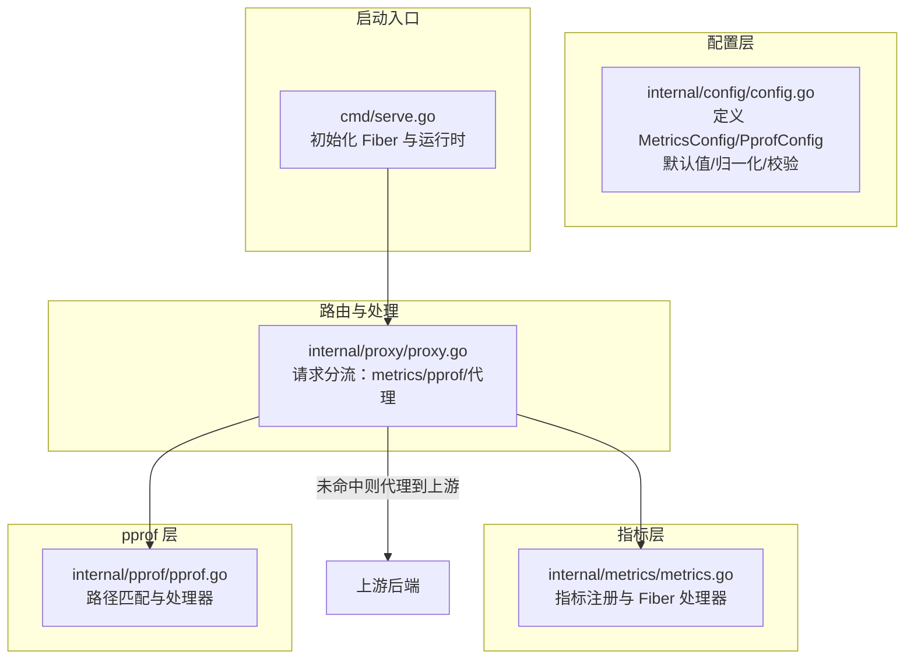
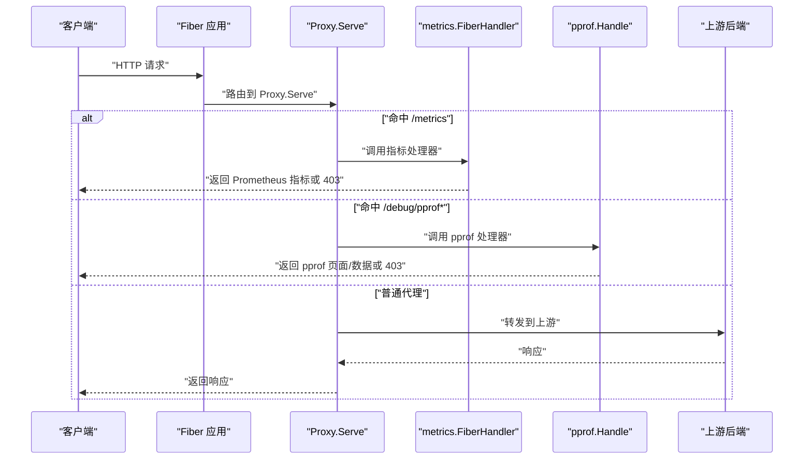
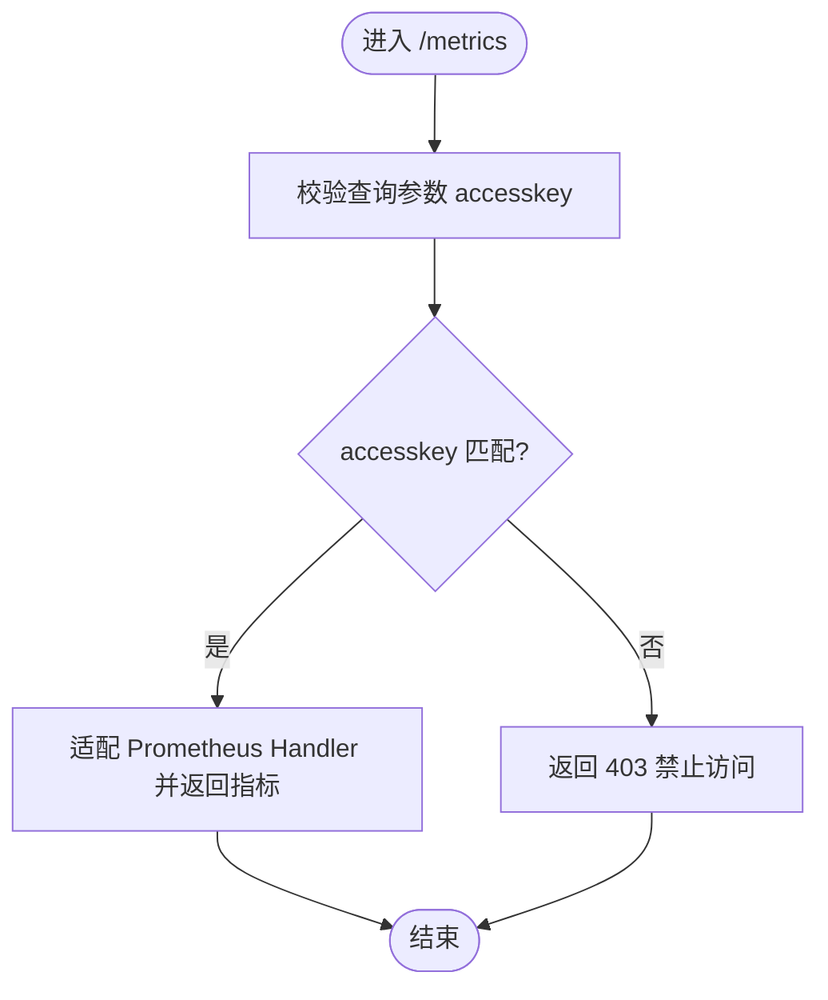
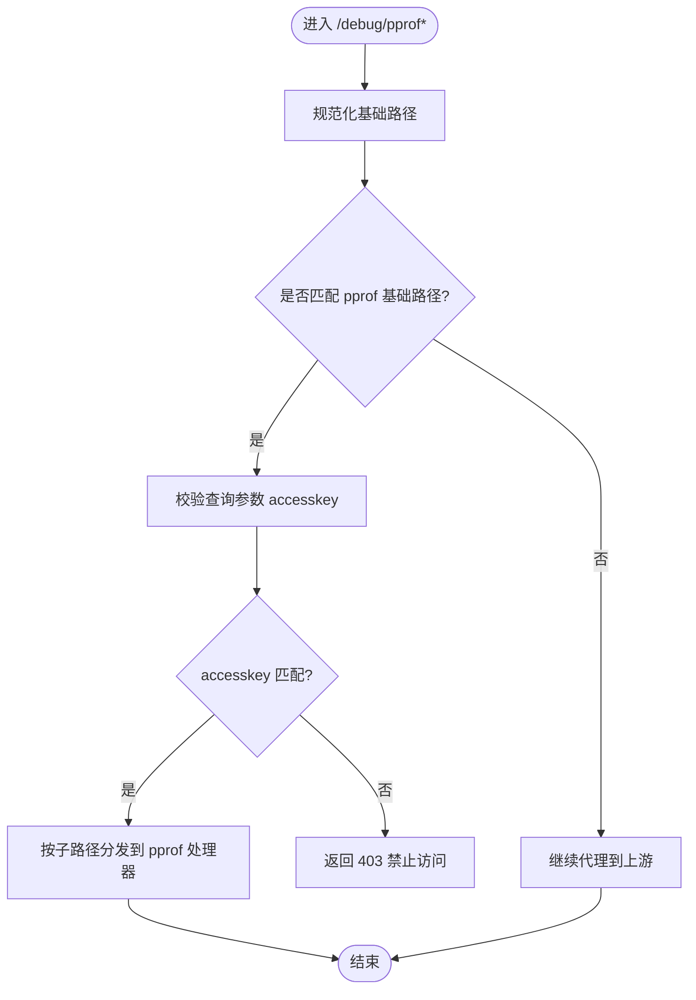
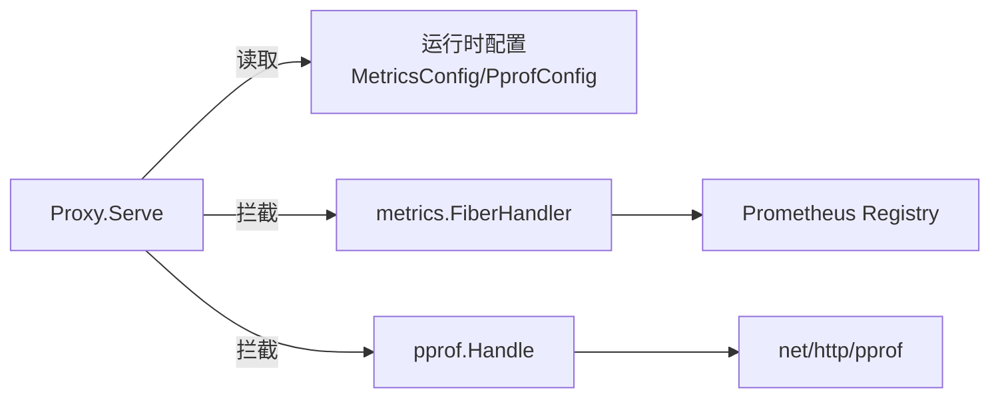

# 可观测性

<cite>
**本文引用的文件列表**
- [internal/config/config.go](file://internal/config/config.go)
- [internal/metrics/metrics.go](file://internal/metrics/metrics.go)
- [internal/pprof/pprof.go](file://internal/pprof/pprof.go)
- [internal/proxy/proxy.go](file://internal/proxy/proxy.go)
- [cmd/serve.go](file://cmd/serve.go)
- [config.example.yaml](file://config.example.yaml)
</cite>

## 目录
1. [简介](#简介)
2. [项目结构](#项目结构)
3. [核心组件](#核心组件)
4. [架构总览](#架构总览)
5. [组件详解](#组件详解)
6. [依赖关系分析](#依赖关系分析)
7. [性能考量](#性能考量)
8. [故障排查指南](#故障排查指南)
9. [结论](#结论)
10. [附录：监控告警规则示例](#附录监控告警规则示例)

## 简介
本文件聚焦于 RSSHub-Gateway 的可观测性配置，围绕 metrics 与 pprof 两大模块进行系统化解析。内容涵盖：
- metrics 配置项 enabled、path、accesskey 的含义与作用，以及与 Prometheus 集成的路径与访问控制；
- pprof 调试端点的启用条件、路径匹配与安全访问控制；
- 结合 internal/config/config.go 中的 MetricsConfig 与 PprofConfig 结构体，给出指标暴露路径与调试接口的安全配置最佳实践；
- 提供监控告警规则配置示例与配置验证中对访问密钥的强制要求说明。

## 项目结构
可观测性相关代码主要分布在以下模块：
- 配置层：internal/config/config.go 定义 MetricsConfig 与 PprofConfig，并在加载、归一化与校验阶段完成默认值填充与参数合法性检查；
- 指标层：internal/metrics/metrics.go 定义指标集合与 Fiber 处理器，支持基于查询参数 accesskey 的访问控制；
- pprof 层：internal/pprof/pprof.go 实现 pprof 路径匹配与处理器，同样支持基于查询参数 accesskey 的访问控制；
- 路由与处理：internal/proxy/proxy.go 在请求进入时优先判断是否命中 metrics 或 pprof 路径，分别交由对应处理器处理，避免转发到上游；
- 启动入口：cmd/serve.go 初始化日志、metrics、运行时管理器与 Fiber 应用，启动监听。

图表来源
- [internal/config/config.go](file://internal/config/config.go#L38-L48)
- [internal/metrics/metrics.go](file://internal/metrics/metrics.go#L1-L123)
- [internal/pprof/pprof.go](file://internal/pprof/pprof.go#L1-L63)
- [internal/proxy/proxy.go](file://internal/proxy/proxy.go#L41-L71)
- [cmd/serve.go](file://cmd/serve.go#L18-L66)

章节来源
- [internal/config/config.go](file://internal/config/config.go#L38-L48)
- [internal/metrics/metrics.go](file://internal/metrics/metrics.go#L1-L123)
- [internal/pprof/pprof.go](file://internal/pprof/pprof.go#L1-L63)
- [internal/proxy/proxy.go](file://internal/proxy/proxy.go#L41-L71)
- [cmd/serve.go](file://cmd/serve.go#L18-L66)

## 核心组件
- MetricsConfig
  - enabled：是否启用指标暴露；
  - path：指标暴露路径，默认值在配置加载时填充；
  - accesskey：访问密钥，用于限制对 /metrics 的查询访问。
- PprofConfig
  - enabled：是否启用 pprof 调试端点；
  - path：pprof 基础路径，默认值在配置加载时填充；
  - accesskey：访问密钥，用于限制对 /debug/pprof* 的查询访问。

章节来源
- [internal/config/config.go](file://internal/config/config.go#L38-L48)
- [internal/config/config.go](file://internal/config/config.go#L169-L174)

## 架构总览
下图展示请求在进入网关后的可观测性处理流程：先判断是否命中 metrics 或 pprof 路径，若命中则直接由对应处理器返回；否则进入常规代理链路。

图表来源
- [internal/proxy/proxy.go](file://internal/proxy/proxy.go#L41-L71)
- [internal/metrics/metrics.go](file://internal/metrics/metrics.go#L113-L123)
- [internal/pprof/pprof.go](file://internal/pprof/pprof.go#L33-L63)

## 组件详解

### 指标模块（metrics）
- 指标注册与暴露
  - 指标集合通过 Prometheus Registry 注册，包含请求数、耗时、上游请求与健康状态等多类指标；
  - 暴露端点通过适配器将 Prometheus HTTP 处理器桥接到 Fiber，便于统一路由与中间件处理。
- 访问控制
  - 指标处理器在处理请求时读取查询参数 accesskey，并与配置中的 accesskey 对比，不一致则返回禁止访问的状态码。
- 配置项与默认值
  - enabled：默认关闭；
  - path：默认 “/metrics”；
  - accesskey：无默认值，若启用则必须配置。

图表来源
- [internal/metrics/metrics.go](file://internal/metrics/metrics.go#L113-L123)
- [internal/config/config.go](file://internal/config/config.go#L169-L174)

章节来源
- [internal/metrics/metrics.go](file://internal/metrics/metrics.go#L1-L123)
- [internal/config/config.go](file://internal/config/config.go#L169-L174)

### pprof 调试模块
- 路径匹配与处理
  - pprof 模块提供路径规范化与前缀匹配函数，用于判断请求路径是否属于 pprof 基础路径；
  - Handle 函数根据具体子路径分发到 net/http/pprof 的相应处理器（如 index/profile/cmdline/symbol/trace 等）。
- 访问控制
  - 与指标类似，pprof 处理器同样读取查询参数 accesskey 并进行校验，不一致则返回禁止访问。
- 配置项与默认值
  - enabled：默认关闭；
  - path：默认 “/debug/pprof”；
  - accesskey：无默认值，若启用则必须配置。

图表来源
- [internal/pprof/pprof.go](file://internal/pprof/pprof.go#L14-L31)
- [internal/pprof/pprof.go](file://internal/pprof/pprof.go#L33-L63)
- [internal/proxy/proxy.go](file://internal/proxy/proxy.go#L61-L63)

章节来源
- [internal/pprof/pprof.go](file://internal/pprof/pprof.go#L1-L63)
- [internal/proxy/proxy.go](file://internal/proxy/proxy.go#L61-L63)

### 配置加载、归一化与校验
- 默认值填充
  - metrics.path 默认 “/metrics”，pprof.path 默认 “/debug/pprof”，short.path 默认 “/short”；
  - 其他字段如 server.listen、server.timeout_ms 等也有默认值。
- 归一化
  - 对 path 前缀进行标准化处理，确保以单斜杠开头且末尾无多余斜杠；
  - 对允许/拒绝前缀进行统一格式化。
- 校验
  - 当 metrics.enabled 为 true 时，必须提供 accesskey 且 path 必须以 “/” 开头；
  - 当 pprof.enabled 为 true 时，必须提供 accesskey 且 path 必须以 “/” 开头；
  - 当 gateway_auth.enabled 为 true 时，需提供 access_key 且至少开启 accept_key 或 accept_code 之一。

章节来源
- [internal/config/config.go](file://internal/config/config.go#L162-L205)
- [internal/config/config.go](file://internal/config/config.go#L248-L319)
- [internal/config/config.go](file://internal/config/config.go#L321-L345)

### Prometheus 集成方法
- 暴露路径
  - 在配置中启用 metrics 并设置 path（默认即 “/metrics”），即可通过该路径暴露指标；
- 访问控制
  - 在 Prometheus 抓取时通过查询参数携带 accesskey，若与配置中的 accesskey 不一致，抓取将被拒绝；
- 示例
  - Prometheus 抓取目标 URL：http(s)://gateway-host:port/metrics?accesskey=YOUR_ACCESSKEY

章节来源
- [internal/metrics/metrics.go](file://internal/metrics/metrics.go#L113-L123)
- [internal/config/config.go](file://internal/config/config.go#L321-L345)
- [config.example.yaml](file://config.example.yaml#L36-L46)

### pprof 调试端点启用与安全访问
- 启用条件
  - pprof.enabled 必须为 true；
  - pprof.path 必须以 “/” 开头；
  - pprof.accesskey 必须提供。
- 安全访问
  - 任何访问 /debug/pprof* 的请求均需携带 accesskey 查询参数，且与配置一致，否则返回禁止访问；
  - pprof 模块会将请求路径与基础路径进行匹配，命中后才进行访问控制与分发。

章节来源
- [internal/pprof/pprof.go](file://internal/pprof/pprof.go#L25-L31)
- [internal/pprof/pprof.go](file://internal/pprof/pprof.go#L33-L63)
- [internal/config/config.go](file://internal/config/config.go#L338-L345)

## 依赖关系分析
- Proxy.Serve 依赖运行时配置（MetricsConfig、PprofConfig）决定是否拦截并处理 metrics 或 pprof；
- metrics.FiberHandler 依赖 Prometheus 注册表输出指标；
- pprof.Handle 依赖 net/http/pprof 的内置处理器；
- 配置层负责提供默认值、归一化与校验，确保后续模块使用安全可靠的参数。

图表来源
- [internal/proxy/proxy.go](file://internal/proxy/proxy.go#L41-L71)
- [internal/metrics/metrics.go](file://internal/metrics/metrics.go#L1-L123)
- [internal/pprof/pprof.go](file://internal/pprof/pprof.go#L1-L63)

章节来源
- [internal/proxy/proxy.go](file://internal/proxy/proxy.go#L41-L71)
- [internal/metrics/metrics.go](file://internal/metrics/metrics.go#L1-L123)
- [internal/pprof/pprof.go](file://internal/pprof/pprof.go#L1-L63)

## 性能考量
- 指标暴露采用 Prometheus 官方适配器，开销极低；
- pprof 仅在启用时生效，且仅对命中基础路径的请求进行处理，避免对常规代理路径产生额外负担；
- 建议在生产环境谨慎启用 pprof，仅在需要诊断时临时开启，并严格控制 accesskey。

## 故障排查指南
- 指标抓取返回 403
  - 检查 Prometheus 抓取 URL 是否包含正确的 accesskey；
  - 确认配置中 metrics.enabled 已开启且 accesskey 设置正确；
  - 确认 metrics.path 与实际暴露路径一致。
- pprof 返回 403
  - 检查访问 URL 是否包含正确的 accesskey；
  - 确认 pprof.enabled 已开启且 accesskey 设置正确；
  - 确认请求路径以 pprof.path 为基础前缀。
- 配置校验报错
  - metrics.enabled 为 true 但未提供 accesskey；
  - pprof.enabled 为 true 但未提供 accesskey；
  - metrics.path 或 pprof.path 未以 “/” 开头；
  - gateway_auth.enabled 为 true 但未提供 access_key 或未开启 accept_key/accept_code。

章节来源
- [internal/config/config.go](file://internal/config/config.go#L321-L345)

## 结论
- metrics 与 pprof 的安全访问均由查询参数 accesskey 控制，建议在生产环境始终启用 accesskey 并妥善保管；
- 配置层提供了完善的默认值、归一化与校验逻辑，确保可观测性功能稳定可用；
- Prometheus 集成简单直观，pprof 调试端点在启用时具备严格的路径匹配与访问控制，适合在受控场景下使用。

## 附录：监控告警规则示例
以下为 Prometheus 告警规则示例，建议结合实际业务阈值调整：
- 指标暴露不可达
  - 触发条件：/metrics 无法抓取或返回非 2xx；
  - 告警名称：MetricsScrapeFailed
- 指标抓取失败率升高
  - 触发条件：抓取失败比例超过阈值；
  - 告警名称：MetricsScrapeErrorRateHigh
- 上游错误率升高
  - 触发条件：rsshub_gateway_upstream_failure_total 增长速率异常；
  - 告警名称：UpstreamFailureRateHigh
- 路由失败率升高
  - 触发条件：rsshub_gateway_route_failure_total 增长速率异常；
  - 告警名称：RouteFailureRateHigh
- 缓存命中率下降
  - 触发条件：rsshub_gateway_cache_hit_total 与 rsshub_gateway_cache_miss_total 比例异常；
  - 告警名称：CacheHitRatioLow
- 配置重载失败
  - 触发条件：rsshub_gateway_config_reload_total 标签为 fail 的计数增加；
  - 告警名称：ConfigReloadFailed

章节来源
- [internal/metrics/metrics.go](file://internal/metrics/metrics.go#L1-L123)