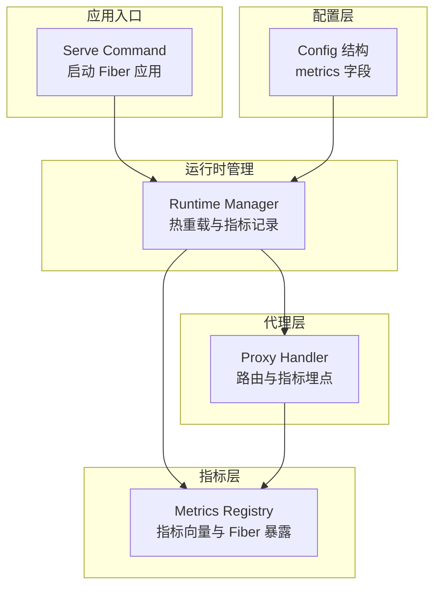
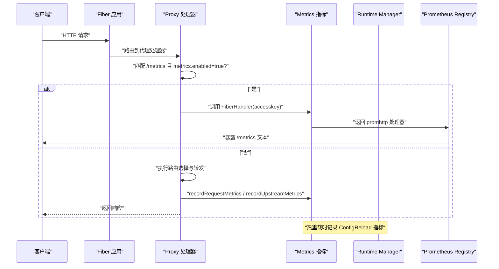
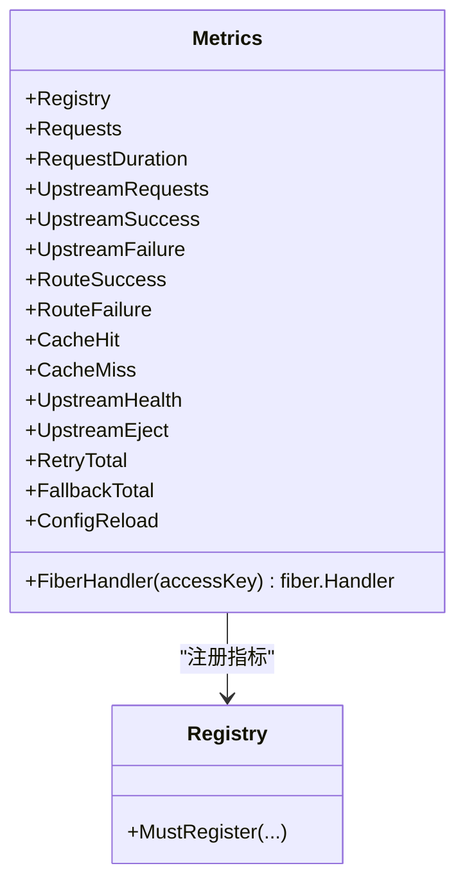
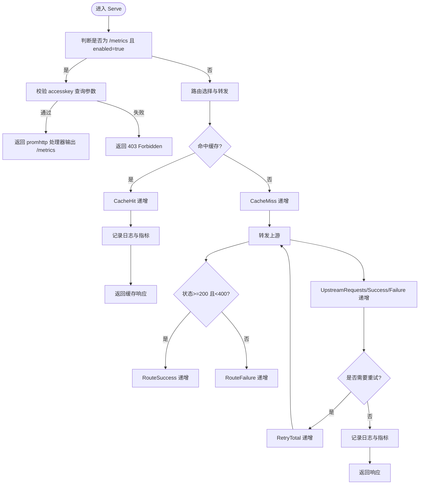
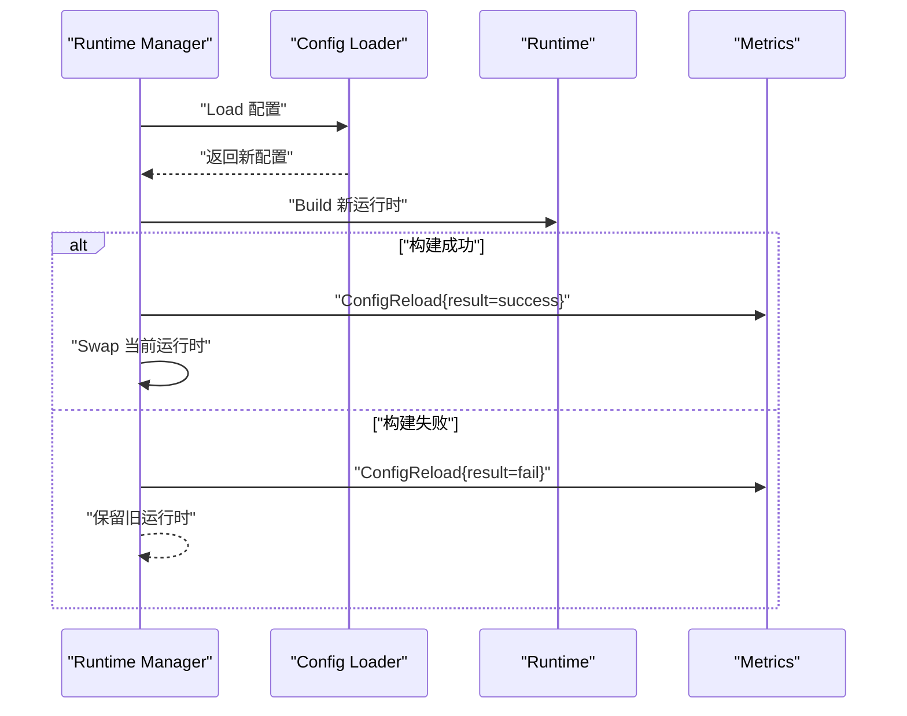
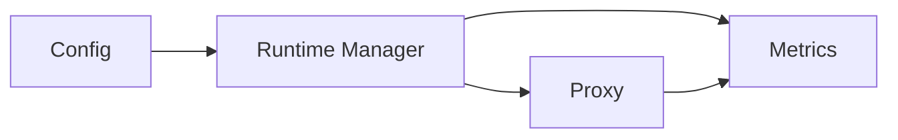

# 指标监控

<cite>
**本文引用的文件**
- [internal/metrics/metrics.go](file://internal/metrics/metrics.go)
- [internal/proxy/proxy.go](file://internal/proxy/proxy.go)
- [internal/runtime/manager.go](file://internal/runtime/manager.go)
- [internal/config/config.go](file://internal/config/config.go)
- [cmd/serve.go](file://cmd/serve.go)
- [config.example.yaml](file://config.example.yaml)
- [internal/proxy/proxy_test.go](file://internal/proxy/proxy_test.go)
</cite>

## 目录
1. [简介](#简介)
2. [项目结构](#项目结构)
3. [核心组件](#核心组件)
4. [架构总览](#架构总览)
5. [组件详解](#组件详解)
6. [依赖关系分析](#依赖关系分析)
7. [性能与采集频率](#性能与采集频率)
8. [故障排查指南](#故障排查指南)
9. [结论](#结论)
10. [附录](#附录)

## 简介
本文件围绕 RSSHub-Gateway 的 Prometheus 指标监控能力进行系统化说明，重点覆盖以下方面：
- 配置项 metrics.enabled、metrics.path 和 metrics.accesskey 的语义与安全作用
- 如何通过 accesskey 对 /metrics 端点进行访问控制
- 自定义指标（请求计数、响应时间、上游健康状态等）的注册与暴露机制
- Prometheus 抓取配置示例、Grafana 看板建议与告警规则（高错误率、上游全宕）
- 与 Fiber 中间件的集成方式
- 指标采集频率与性能影响评估
- 在配置热重载时指标系统的稳定性保障机制

## 项目结构
与指标监控相关的关键模块分布如下：
- 配置层：负责解析与校验 metrics 配置（启用、路径、访问密钥）
- 运行时管理：负责加载配置、构建运行时、支持热重载并记录重载事件指标
- 代理层：在请求处理链路中埋点，记录各类指标
- 指标层：封装 Prometheus Registry 与各类指标向量，提供 Fiber 处理器以暴露 /metrics 并进行访问控制

图表来源
- [internal/config/config.go](file://internal/config/config.go#L12-L42)
- [internal/runtime/manager.go](file://internal/runtime/manager.go#L28-L67)
- [internal/proxy/proxy.go](file://internal/proxy/proxy.go#L42-L71)
- [internal/metrics/metrics.go](file://internal/metrics/metrics.go#L12-L122)
- [cmd/serve.go](file://cmd/serve.go#L31-L40)

章节来源
- [internal/config/config.go](file://internal/config/config.go#L12-L42)
- [internal/runtime/manager.go](file://internal/runtime/manager.go#L28-L67)
- [internal/proxy/proxy.go](file://internal/proxy/proxy.go#L42-L71)
- [internal/metrics/metrics.go](file://internal/metrics/metrics.go#L12-L122)
- [cmd/serve.go](file://cmd/serve.go#L31-L40)

## 核心组件
- 指标注册与暴露
  - 指标对象：计数器、直方图、仪表盘（Gauge）、计数向量等
  - 注册到 Prometheus Registry，并通过 promhttp 暴露
  - 提供 FiberHandler，支持 accesskey 访问控制
- 代理层埋点
  - 请求总量、请求耗时、路由成功/失败、上游请求与成功/失败、缓存命中/未命中、重试次数、回退链路、配置重载次数
- 运行时热重载
  - 重载成功/失败均记录指标，确保可观测性闭环

章节来源
- [internal/metrics/metrics.go](file://internal/metrics/metrics.go#L12-L122)
- [internal/proxy/proxy.go](file://internal/proxy/proxy.go#L251-L274)
- [internal/runtime/manager.go](file://internal/runtime/manager.go#L128-L135)

## 架构总览
下图展示从请求进入、指标埋点到指标暴露的整体流程。

图表来源
- [internal/proxy/proxy.go](file://internal/proxy/proxy.go#L56-L61)
- [internal/metrics/metrics.go](file://internal/metrics/metrics.go#L113-L122)
- [internal/runtime/manager.go](file://internal/runtime/manager.go#L128-L135)

## 组件详解

### 配置项与安全控制
- metrics.enabled
  - 控制是否启用指标暴露
  - 当启用时，需同时配置 metrics.path 与 metrics.accesskey
- metrics.path
  - 指标暴露的路径，默认 "/metrics"
  - 必须以 "/" 开头
- metrics.accesskey
  - 通过查询参数 accesskey 进行访问控制
  - 未提供或不匹配将返回 403 Forbidden
- 配置校验
  - 启用 metrics 时若缺失 accesskey 将报错
  - 路径必须非空且以 "/" 开头

章节来源
- [internal/config/config.go](file://internal/config/config.go#L38-L42)
- [internal/config/config.go](file://internal/config/config.go#L330-L337)
- [internal/metrics/metrics.go](file://internal/metrics/metrics.go#L113-L122)
- [internal/proxy/proxy.go](file://internal/proxy/proxy.go#L56-L61)

### 指标注册与暴露机制
- 指标类型与用途
  - rsshub_gateway_requests_total：请求总量（按方法、分组、路由前缀、状态）
  - rsshub_gateway_request_duration_seconds：请求耗时直方图（按分组、路由前缀）
  - rsshub_gateway_upstream_requests_total：上游请求总量（按分组、上游、状态）
  - rsshub_gateway_upstream_success_total / failure_total：上游成功/失败计数
  - rsshub_gateway_route_success_total / failure_total：路由成功/失败计数
  - rsshub_gateway_cache_hit_total / miss_total：缓存命中/未命中（按 provider）
  - rsshub_gateway_upstream_health：上游健康状态（1 健康，0 不健康）
  - rsshub_gateway_upstream_eject_total：上游被剔除次数
  - rsshub_gateway_retry_total：重试次数
  - rsshub_gateway_fallback_total：回退链路尝试次数
  - rsshub_gateway_config_reload_total：配置重载次数（按结果）
- 注册与暴露
  - 所有指标注册到 Prometheus Registry
  - 通过 promhttp.HandlerFor 暴露给 /metrics
  - FiberHandler 包装 promhttp 处理器，增加 accesskey 校验

图表来源
- [internal/metrics/metrics.go](file://internal/metrics/metrics.go#L12-L122)

章节来源
- [internal/metrics/metrics.go](file://internal/metrics/metrics.go#L12-L122)

### 代理层埋点逻辑
- 请求级指标
  - recordRequestMetrics：更新 Requests、RequestDuration、RouteSuccess/RouteFailure
- 上游级指标
  - recordUpstreamMetrics：更新 UpstreamRequests、UpstreamSuccess/UpstreamFailure
- 缓存命中/未命中
  - CacheHit / CacheMiss：在命中/未命中分支分别递增
- 重试与回退
  - RetryTotal：重试尝试次数
  - FallbackTotal：回退链路切换次数
- 错误与剔除
  - 主动剔除：UpstreamEject
- 访问控制
  - /metrics 路径在代理层拦截，若未通过 accesskey 校验直接返回 403

图表来源
- [internal/proxy/proxy.go](file://internal/proxy/proxy.go#L56-L61)
- [internal/proxy/proxy.go](file://internal/proxy/proxy.go#L83-L102)
- [internal/proxy/proxy.go](file://internal/proxy/proxy.go#L113-L173)
- [internal/proxy/proxy.go](file://internal/proxy/proxy.go#L251-L274)

章节来源
- [internal/proxy/proxy.go](file://internal/proxy/proxy.go#L56-L61)
- [internal/proxy/proxy.go](file://internal/proxy/proxy.go#L83-L102)
- [internal/proxy/proxy.go](file://internal/proxy/proxy.go#L113-L173)
- [internal/proxy/proxy.go](file://internal/proxy/proxy.go#L251-L274)

### 运行时热重载与指标稳定性
- 热重载流程
  - 重新加载配置并构建新运行时
  - 使用原子交换替换当前运行时，旧运行时停止
  - 记录 ConfigReload 指标（success/fail），并写入日志
- 指标稳定性保障
  - Registry 与指标对象在进程生命周期内复用，避免频繁重建
  - 热重载只替换运行时上下文，不影响指标注册与暴露
  - 重载失败时保留旧运行时，确保指标持续可用

图表来源
- [internal/runtime/manager.go](file://internal/runtime/manager.go#L77-L126)
- [internal/runtime/manager.go](file://internal/runtime/manager.go#L128-L135)

章节来源
- [internal/runtime/manager.go](file://internal/runtime/manager.go#L77-L126)
- [internal/runtime/manager.go](file://internal/runtime/manager.go#L128-L135)

### 与 Fiber 中间件的集成
- 指标暴露
  - 通过 FiberHandler 返回 promhttp 处理器，适配为 Fiber Handler
- 访问控制
  - 在 Fiber 层对 /metrics 请求进行 accesskey 校验，不匹配即返回 403
- 入口集成
  - 启动命令中创建 Metrics 实例并注入 Runtime Manager
  - Fiber 应用在代理处理器中识别 /metrics 路径并交由指标模块处理

章节来源
- [internal/metrics/metrics.go](file://internal/metrics/metrics.go#L113-L122)
- [internal/proxy/proxy.go](file://internal/proxy/proxy.go#L56-L61)
- [cmd/serve.go](file://cmd/serve.go#L31-L40)

## 依赖关系分析
- 配置层
  - Config 结构体包含 MetricsConfig 字段，提供默认值与校验
- 运行时管理
  - Manager 在初始化与热重载时使用 Metrics 实例记录指标
- 代理层
  - Proxy 在请求处理过程中调用 Metrics 方法进行埋点
- 指标层
  - Metrics 负责注册与暴露指标，并提供 FiberHandler

图表来源
- [internal/config/config.go](file://internal/config/config.go#L12-L42)
- [internal/runtime/manager.go](file://internal/runtime/manager.go#L28-L67)
- [internal/proxy/proxy.go](file://internal/proxy/proxy.go#L42-L71)
- [internal/metrics/metrics.go](file://internal/metrics/metrics.go#L12-L122)

章节来源
- [internal/config/config.go](file://internal/config/config.go#L12-L42)
- [internal/runtime/manager.go](file://internal/runtime/manager.go#L28-L67)
- [internal/proxy/proxy.go](file://internal/proxy/proxy.go#L42-L71)
- [internal/metrics/metrics.go](file://internal/metrics/metrics.go#L12-L122)

## 性能与采集频率
- 指标开销
  - 指标更新为内存操作，开销极低
  - 直方图采样与标签基数需关注：按 group、route_prefix、upstream 等维度打标
- 采集频率
  - Prometheus 抓取周期由 scrape_interval 决定，建议与业务 QPS 成比例，避免过短导致不必要的负载
- 影响评估
  - /metrics 暴露端点本身无额外业务逻辑，仅做访问控制与数据序列化，对性能影响可忽略
  - 建议在生产环境开启 accesskey 保护，避免公开暴露

[本节为通用性能讨论，不直接分析具体文件]

## 故障排查指南
- /metrics 返回 403
  - 检查是否在查询参数中提供正确的 accesskey
  - 确认 metrics.enabled=true 且 metrics.path 设置正确
- /metrics 无法访问或返回 404
  - 确认 metrics.enabled=true 且 path 未被其他路由覆盖
  - 检查代理层是否正确识别 /metrics 并交由指标模块处理
- 指标为空或缺失
  - 确认 Prometheus 已正确抓取目标端点
  - 检查网络连通性与防火墙策略
- 热重载后指标异常
  - 查看日志中 config reload 的结果字段，确认重载是否成功
  - 若失败，系统会保留旧运行时，指标应保持稳定

章节来源
- [internal/proxy/proxy_test.go](file://internal/proxy/proxy_test.go#L323-L344)
- [internal/proxy/proxy.go](file://internal/proxy/proxy.go#L56-L61)
- [internal/config/config.go](file://internal/config/config.go#L330-L337)
- [internal/runtime/manager.go](file://internal/runtime/manager.go#L128-L135)

## 结论
RSSHub-Gateway 的指标监控体系以 Prometheus 为核心，通过清晰的配置项与严格的访问控制，实现了可观测性与安全性的平衡。代理层在关键路径埋点，覆盖请求、上游、缓存、重试、回退与配置重载等维度，形成完整的观测闭环。配合热重载机制，指标系统在变更期间保持稳定，满足生产环境的可靠性要求。

[本节为总结性内容，不直接分析具体文件]

## 附录

### Prometheus 抓取配置示例
- 在 Prometheus 中添加 job，抓取 RSSHub-Gateway 的 /metrics 端点
- 使用查询参数 accesskey 进行认证
- 建议设置合适的 scrape_interval 与超时参数

章节来源
- [config.example.yaml](file://config.example.yaml#L36-L45)

### Grafana 看板建议
- 请求总量与成功率（按方法、分组、路由前缀）
- 请求耗时分布（直方图）
- 上游健康状态与剔除趋势
- 缓存命中率
- 重试与回退链路统计
- 配置重载次数（按成功/失败）

[本节为通用可视化建议，不直接分析具体文件]

### 告警规则建议
- 高错误率
  - 条件：route_failure_total 增速过高或错误率超过阈值
  - 触发：持续一段时间内错误占比上升
- 上游全宕
  - 条件：upstream_health=0 且持续时间超过阈值
  - 触发：所有上游不可用
- 配置重载失败
  - 条件：config_reload_total{result="fail"} 增速
  - 触发：重载失败次数增多

[本节为通用告警建议，不直接分析具体文件]