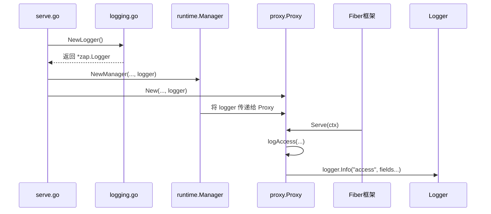
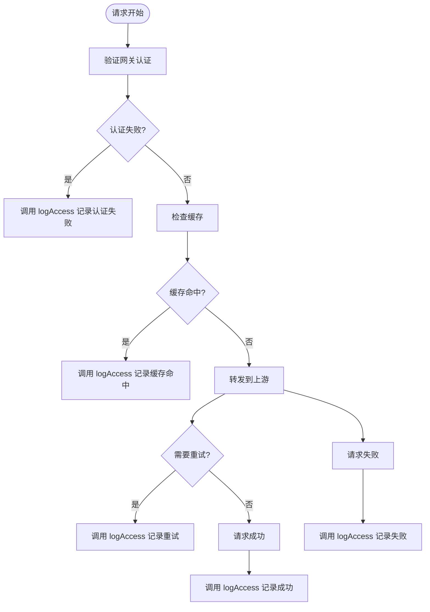

# 日志系统

<cite>
**本文档引用的文件**   
- [logging.go](file://internal/logging/logging.go)
- [serve.go](file://cmd/serve.go)
- [proxy.go](file://internal/proxy/proxy.go)
- [manager.go](file://internal/runtime/manager.go)
- [config.example.yaml](file://config.example.yaml)
</cite>

## 目录
1. [简介](#简介)
2. [日志配置项说明](#日志配置项说明)
3. [结构化日志记录器初始化](#结构化日志记录器初始化)
4. [访问日志结构](#访问日志结构)
5. [事件日志与关键操作记录](#事件日志与关键操作记录)
6. [日志采集与分析集成](#日志采集与分析集成)
7. [日志性能优化策略](#日志性能优化策略)

## 简介
RSSHub-Gateway 项目实现了结构化的日志系统，用于记录访问日志和关键事件日志。该系统基于 uber/zap 日志库，以 JSON 格式输出日志，便于后续的采集、分析和监控。日志系统贯穿于请求处理、健康检查、故障转移和配置重载等核心流程中，为系统的可观测性提供了重要支持。

## 日志配置项说明
在 RSSHub-Gateway 的配置文件中，虽然没有直接的 `logging.level` 或 `logging.format` 配置项，但日志行为通过代码和配置间接控制。系统强制使用 JSON 格式的结构化日志，这符合其设计规范。

- **`logging.format` (JSON/Text)**: 项目规范明确要求系统必须以 JSON 格式输出访问日志和事件日志。这通过使用 `zap.NewProduction()` 函数实现，该函数默认配置为输出 JSON 格式的日志。
- **`access_log`**: 访问日志的记录是核心功能，由 `internal/proxy/proxy.go` 文件中的 `logAccess` 方法负责。每当一个请求处理完成，无论成功或失败，都会调用此方法生成一条访问日志。
- **`logging.level`**: 日志级别由 `zap.NewProduction()` 的默认配置决定。它会记录 `Info`、`Warn`、`Error` 等级别的日志。例如，网关认证失败会记录为 `Info` 级别的访问日志，而上游服务被剔除（eject）则会记录为 `Warn` 级别的事件日志。

**Section sources**
- [config.example.yaml](file://config.example.yaml#L1-L264)
- [openspec/changes/add-v0-1-basic-routing-lb/specs/gateway-observability/spec.md](file://openspec/changes/add-v0-1-basic-routing-lb/specs/gateway-observability/spec.md#L22-L30)

## 结构化日志记录器初始化
日志记录器的初始化和集成遵循一个清晰的流程：

1.  **创建日志记录器**: `internal/logging/logging.go` 文件中的 `NewLogger()` 函数是日志记录器的工厂。它调用 `zap.NewProduction()` 来创建一个预配置的、高性能的 JSON 格式日志记录器。
2.  **在主命令中初始化**: `cmd/serve.go` 文件中的 `newServeCmd()` 函数在服务器启动时被调用。它首先调用 `logging.NewLogger()` 来创建日志记录器实例。
3.  **作为依赖注入**: 创建的日志记录器实例被作为参数传递给其他核心组件，如 `runtime.Manager`、`proxy.Proxy` 和 `metrics.Metrics`。这确保了整个应用都能使用同一个日志记录器实例。
4.  **集成到 Fiber 框架**: 虽然没有显式的日志中间件，但日志记录是通过在 `proxy.Proxy` 结构体中持有 `*zap.Logger` 实例，并在关键方法（如 `Serve`）中调用其方法来实现的。这相当于将日志功能深度集成到了请求处理的主流程中。

**Diagram sources **
- [logging.go](file://internal/logging/logging.go#L5-L7)
- [serve.go](file://cmd/serve.go#L25-L28)
- [proxy.go](file://internal/proxy/proxy.go#L32-L38)
- [manager.go](file://internal/runtime/manager.go#L28-L38)

**Section sources**
- [logging.go](file://internal/logging/logging.go#L5-L7)
- [serve.go](file://cmd/serve.go#L25-L28)
- [proxy.go](file://internal/proxy/proxy.go#L32-L38)

## 访问日志结构
访问日志是系统对每个 HTTP 请求的详细记录，以 JSON 格式输出。其核心字段包括：

- **`ts`**: 日志条目生成的时间戳。
- **`method`**: 客户端请求的 HTTP 方法（如 GET、POST）。
- **`path`**: 客户端请求的完整路径。
- **`status`**: 返回给客户端的 HTTP 状态码。
- **`duration_ms`**: 处理该请求所花费的总时间（毫秒）。
- **`retries`**: 在处理请求过程中，对上游服务进行重试的次数。
- **`group`**: 处理该请求的上游分组名称。
- **`route_prefix`**: 匹配到的路由前缀。
- **`err_type`**: 如果请求处理失败，此字段会记录错误类型（如 `auth`、`timeout`、`connect`）。
- **`fallback_chain`**: 一个字符串数组，记录了在处理该请求时尝试过的所有分组（主分组和回退分组）。

这些字段为分析请求性能、排查错误和理解流量路由提供了全面的数据。

**Diagram sources **
- [proxy.go](file://internal/proxy/proxy.go#L394-L417)

**Section sources**
- [proxy.go](file://internal/proxy/proxy.go#L394-L417)

## 事件日志与关键操作记录
除了访问日志，系统还会记录关键的内部事件，这些事件对于监控系统健康状况至关重要。

- **配置重载 (Config Reload)**: 当通过 `SIGHUP` 信号触发配置重载时，系统会记录一条事件日志。`internal/runtime/manager.go` 中的 `recordReload` 方法负责记录此事件，无论重载成功或失败，都会输出一条 `Info` 级别的日志。
- **上游状态变更 (Upstream State Change)**: 当上游服务的健康状态发生变化时，会记录事件日志。
  - **健康检查变更**: `internal/health/health.go` 中的 `probe` 函数在上游服务从健康变为不健康，或从不健康恢复为健康时，会分别记录 `Warn` 和 `Info` 级别的日志。
  - **被动剔除 (Passive Eject)**: 当一个上游服务因连续失败而被被动剔除时，`internal/proxy/proxy.go` 中的 `recordFailure` 方法会调用日志记录器，输出一条 `Warn` 级别的日志，包含被剔除的上游服务和剔除时长。

这些事件日志帮助运维人员及时了解系统的动态变化。

**Section sources**
- [manager.go](file://internal/runtime/manager.go#L128-L134)
- [health.go](file://internal/health/health.go#L64-L75)
- [proxy.go](file://internal/proxy/proxy.go#L294-L296)

## 日志采集与分析集成
为了实现日志的集中化管理和分析，建议采用以下集成方案：

1.  **日志采集**: 使用 **Filebeat** 作为日志采集代理。将 Filebeat 部署在运行 RSSHub-Gateway 的服务器上，配置其 `filebeat.inputs` 模块来监控网关的日志输出流（通常是标准输出或日志文件）。
2.  **日志传输**: Filebeat 会将采集到的 JSON 格式日志发送到 **Elasticsearch**。由于日志已经是结构化的 JSON，Elasticsearch 可以自动解析字段，无需复杂的预处理。
3.  **日志分析与可视化**: 使用 **Kibana** 连接到 Elasticsearch。在 Kibana 中，可以：
    - 创建仪表板，实时监控请求量、错误率、延迟等关键指标。
    - 通过 `status` 字段过滤出所有 5xx 错误，快速定位问题。
    - 使用 `duration_ms` 字段分析性能瓶颈。
    - 通过 `group` 和 `path` 字段分析不同上游分组和 API 路径的流量分布。
    - 查询 `err_type` 字段，了解认证失败或连接超时的发生频率。

这种 ELK（Elasticsearch, Logstash, Kibana）或更准确地说是 EFK（Elasticsearch, Filebeat, Kibana）栈，是处理此类结构化日志的标准方案。

## 日志性能优化策略
该项目通过以下方式优化日志性能：

- **使用高性能日志库**: 选择 uber/zap 作为日志库。Zap 是 Go 语言中性能最高的日志库之一，其设计目标就是低延迟和低开销。
- **结构化日志**: 使用 JSON 格式而非文本格式，虽然在写入时有轻微的序列化开销，但极大地简化了后续的解析和分析过程，从整体上提升了日志处理的效率。
- **延迟日志同步**: 在 `cmd/serve.go` 中，通过 `defer func() { _ = logger.Sync() }()` 确保在程序退出前将所有缓冲的日志刷新到磁盘，这平衡了性能和数据安全性。
- **避免在热路径上进行复杂操作**: `logAccess` 方法中的字段处理非常直接，主要是将已有的变量打包成 `zap.Field`，避免了在记录日志时进行耗时的字符串拼接或格式化操作。

这些策略确保了日志记录不会成为系统的性能瓶颈。