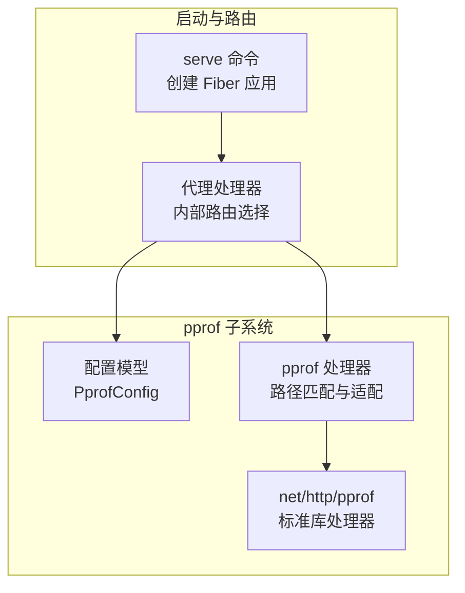
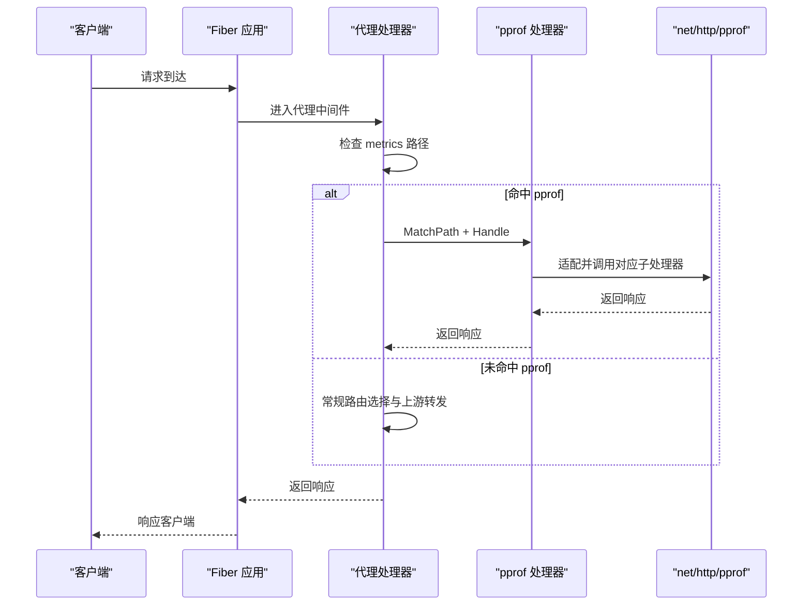
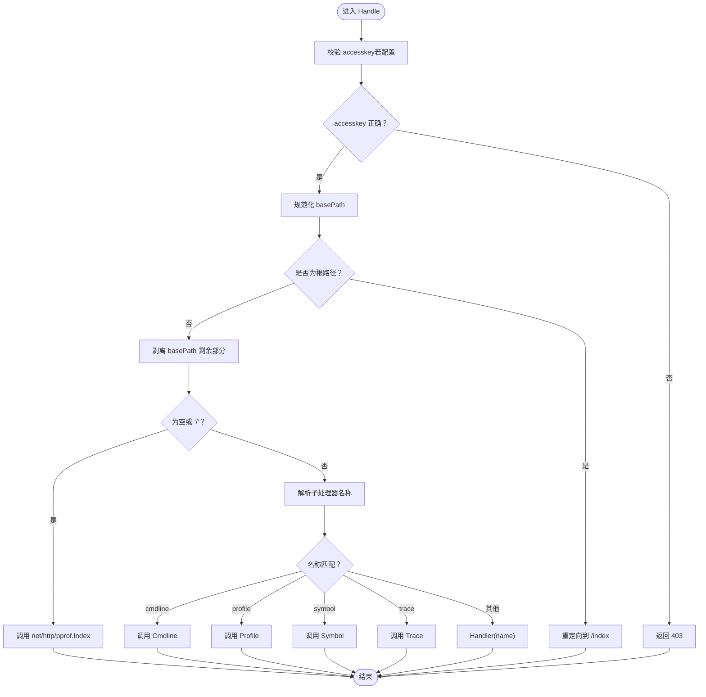
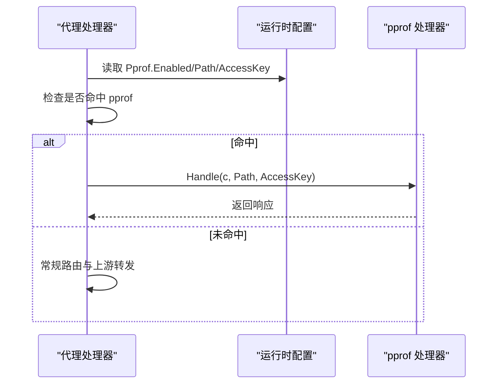
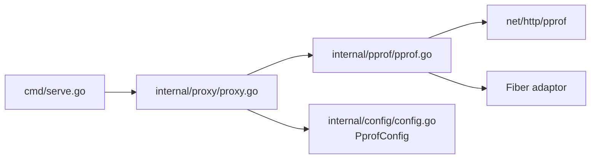

# 调试接口

<cite>
**本文引用的文件列表**
- [internal/pprof/pprof.go](file://internal/pprof/pprof.go)
- [internal/config/config.go](file://internal/config/config.go)
- [internal/proxy/proxy.go](file://internal/proxy/proxy.go)
- [cmd/serve.go](file://cmd/serve.go)
- [internal/router/router.go](file://internal/router/router.go)
- [openspec/changes/add-v0-2-observability-reload/specs/gateway-observability/spec.md](file://openspec/changes/add-v0-2-observability-reload/specs/gateway-observability/spec.md)
- [internal/proxy/proxy_test.go](file://internal/proxy/proxy_test.go)
</cite>

## 目录
1. [简介](#简介)
2. [项目结构](#项目结构)
3. [核心组件](#核心组件)
4. [架构总览](#架构总览)
5. [组件详解](#组件详解)
6. [依赖关系分析](#依赖关系分析)
7. [性能与安全考量](#性能与安全考量)
8. [故障排查指南](#故障排查指南)
9. [结论](#结论)
10. [附录：典型使用场景与操作流程](#附录典型使用场景与操作流程)

## 简介
本文件面向需要在开发或受控环境中进行性能分析的用户，系统性说明如何通过配置启用 /debug/pprof 性能分析端点，并解释 internal/pprof 模块如何集成 net/http/pprof 并挂载到 Fiber 应用上。pprof 与 metrics 类似，均支持通过 accesskey 进行访问控制，以避免在生产环境泄露敏感信息。文档同时提供 curl 或浏览器访问 goroutine、heap、profile 等子端点的示例，并给出典型性能问题排查流程与访问限制建议。

## 项目结构
- pprof 功能位于 internal/pprof，负责将 net/http/pprof 的处理器适配为 Fiber 中间件风格并按路径匹配进行拦截处理。
- 配置模型位于 internal/config，包含 PprofConfig 结构体，定义 enabled、path、accesskey 字段及默认值与校验规则。
- 路由与请求分发位于 internal/proxy，pprof 的匹配与处理逻辑在代理层完成，确保命中 pprof 路径时直接本地处理，不转发至上游。
- 启动入口位于 cmd/serve，创建 Fiber 实例并注册代理中间件；pprof 的启用与否由运行时配置决定。

图表来源
- [cmd/serve.go](file://cmd/serve.go#L37-L40)
- [internal/proxy/proxy.go](file://internal/proxy/proxy.go#L42-L64)
- [internal/config/config.go](file://internal/config/config.go#L44-L48)
- [internal/pprof/pprof.go](file://internal/pprof/pprof.go#L12-L23)

章节来源
- [cmd/serve.go](file://cmd/serve.go#L37-L40)
- [internal/proxy/proxy.go](file://internal/proxy/proxy.go#L42-L64)
- [internal/config/config.go](file://internal/config/config.go#L44-L48)
- [internal/pprof/pprof.go](file://internal/pprof/pprof.go#L12-L23)

## 核心组件
- pprof 配置项
  - 字段：enabled、path、accesskey
  - 默认值：path 默认为 /debug/pprof
  - 校验：当 enabled=true 时，path 必须以 / 开头且非空，accesskey 必须非空
- pprof 匹配与处理
  - MatchPath：根据配置的 basePath 判断请求是否命中 pprof 路径
  - Handle：校验 accesskey，重定向根路径，分发到 net/http/pprof 对应子处理器
- 代理层集成
  - 在代理 Serve 中先检查 metrics，再检查 pprof，最后进入常规路由与上游转发
  - pprof 命中时直接返回本地处理结果，不转发上游

章节来源
- [internal/config/config.go](file://internal/config/config.go#L44-L48)
- [internal/config/config.go](file://internal/config/config.go#L172-L174)
- [internal/config/config.go](file://internal/config/config.go#L338-L345)
- [internal/pprof/pprof.go](file://internal/pprof/pprof.go#L25-L31)
- [internal/pprof/pprof.go](file://internal/pprof/pprof.go#L33-L62)
- [internal/proxy/proxy.go](file://internal/proxy/proxy.go#L42-L64)

## 架构总览
pprof 的工作流如下：
- Fiber 接收请求后，交由代理处理器统一处理
- 代理处理器优先检查是否命中 metrics 路径（若启用），否则检查是否命中 pprof 路径（若启用）
- 若命中 pprof，直接调用 pprof.Handle，内部通过 net/http/pprof 标准库处理器生成响应
- 若未命中 pprof，则继续常规路由选择与上游转发

图表来源
- [cmd/serve.go](file://cmd/serve.go#L37-L40)
- [internal/proxy/proxy.go](file://internal/proxy/proxy.go#L42-L64)
- [internal/pprof/pprof.go](file://internal/pprof/pprof.go#L33-L62)

## 组件详解

### pprof 模块（internal/pprof）
- 职责
  - 将 net/http/pprof 的处理器适配为 Fiber 风格
  - 提供路径规范化与匹配函数
  - 在启用 accesskey 时进行访问控制
- 关键行为
  - normalizeBasePath：去除空白字符，处理末尾斜杠，提供默认 basePath
  - MatchPath：判断请求路径是否属于 pprof 基础路径前缀
  - Handle：
    - 若配置了 accesskey，必须在查询参数中携带 accesskey 才可访问
    - 根路径自动重定向到带斜杠的目录页
    - 目录页与子处理器（cmdline/profile/symbol/trace）通过 HTTPHandlerFunc 适配
    - 其他名称作为 net/http/pprof.Handler(name) 的参数进行分发

图表来源
- [internal/pprof/pprof.go](file://internal/pprof/pprof.go#L14-L23)
- [internal/pprof/pprof.go](file://internal/pprof/pprof.go#L25-L31)
- [internal/pprof/pprof.go](file://internal/pprof/pprof.go#L33-L62)

章节来源
- [internal/pprof/pprof.go](file://internal/pprof/pprof.go#L12-L23)
- [internal/pprof/pprof.go](file://internal/pprof/pprof.go#L25-L31)
- [internal/pprof/pprof.go](file://internal/pprof/pprof.go#L33-L62)

### 配置模型（internal/config）
- PprofConfig
  - 字段：Enabled、Path、AccessKey
  - 默认值：Path 默认为 /debug/pprof
  - 校验：当 Enabled=true 时，Path 必须以 / 开头且非空，AccessKey 必须非空
- 作用
  - 为运行时提供 pprof 是否启用、挂载路径与访问密钥
  - 与代理层配合，决定是否拦截 pprof 请求并进行本地处理

章节来源
- [internal/config/config.go](file://internal/config/config.go#L44-L48)
- [internal/config/config.go](file://internal/config/config.go#L172-L174)
- [internal/config/config.go](file://internal/config/config.go#L338-L345)

### 代理层集成（internal/proxy）
- 路由优先级
  - 首先检查 metrics 路径（若启用）
  - 再检查 pprof 路径（若启用）
  - 最后进入常规路由与上游转发
- pprof 命中条件
  - 当 Pprof.Enabled=true 且请求路径满足 MatchPath(basePath, Path)
  - 直接调用 pprof.Handle，不转发上游
- 场景约束
  - 规范文档明确：pprof 路径命中时不应转发到上游

图表来源
- [internal/proxy/proxy.go](file://internal/proxy/proxy.go#L42-L64)
- [internal/pprof/pprof.go](file://internal/pprof/pprof.go#L25-L31)

章节来源
- [internal/proxy/proxy.go](file://internal/proxy/proxy.go#L42-L64)
- [openspec/changes/add-v0-2-observability-reload/specs/gateway-observability/spec.md](file://openspec/changes/add-v0-2-observability-reload/specs/gateway-observability/spec.md#L18-L21)

### 启动与挂载（cmd/serve）
- Fiber 应用创建后，注册 All("/*") 代理中间件，统一处理所有请求
- pprof 的启用与否完全由运行时配置决定，无需额外手动挂载

章节来源
- [cmd/serve.go](file://cmd/serve.go#L37-L40)

## 依赖关系分析
- pprof 模块依赖 net/http/pprof 与 Fiber 的 adaptor 中间件，用于将标准库处理器适配为 Fiber 风格
- 代理层依赖 pprof 模块提供的 MatchPath 与 Handle，用于在请求进入常规路由之前进行拦截
- 配置层提供 PprofConfig，驱动代理层的拦截逻辑与安全控制

图表来源
- [internal/pprof/pprof.go](file://internal/pprof/pprof.go#L1-L13)
- [internal/proxy/proxy.go](file://internal/proxy/proxy.go#L42-L64)
- [internal/config/config.go](file://internal/config/config.go#L44-L48)
- [cmd/serve.go](file://cmd/serve.go#L37-L40)

章节来源
- [internal/pprof/pprof.go](file://internal/pprof/pprof.go#L1-L13)
- [internal/proxy/proxy.go](file://internal/proxy/proxy.go#L42-L64)
- [internal/config/config.go](file://internal/config/config.go#L44-L48)
- [cmd/serve.go](file://cmd/serve.go#L37-L40)

## 性能与安全考量
- 访问控制
  - pprof 与 metrics 一样，依赖 accesskey 进行访问保护
  - 未提供正确 accesskey 时返回 403
- 生产环境建议
  - 仅在开发或受控环境启用 pprof
  - 通过反向代理或网络策略限制访问来源 IP/网段
  - 使用独立端口或子域名，避免与业务流量混布
- 性能影响
  - profile 等采样会带来额外开销，建议在定位问题时临时开启
  - heap/trace 等端点可能产生较大输出，注意磁盘与网络带宽

## 故障排查指南
- 无法访问 /debug/pprof
  - 检查配置中 pprof.enabled 是否为 true
  - 确认 pprof.path 是否以 / 开头且非空
  - 确认请求是否携带正确的 accesskey 查询参数
- 访问返回 403
  - accesskey 不正确或缺失
  - 检查配置中的 pprof.accesskey 与请求参数是否一致
- 访问被转发到上游
  - 确认请求路径是否命中 pprof 基础路径
  - 检查代理层是否正确执行 pprof 匹配与处理
- 自动重载配置导致 pprof 失效
  - 重载时会重新校验配置，若校验失败会导致 pprof 不生效
  - 参考测试用例中的配置片段，确保字段完整且符合规范

章节来源
- [internal/config/config.go](file://internal/config/config.go#L338-L345)
- [internal/proxy/proxy.go](file://internal/proxy/proxy.go#L42-L64)
- [internal/proxy/proxy_test.go](file://internal/proxy/proxy_test.go#L602-L661)

## 结论
pprof 调试接口通过配置即可启用，并与 Fiber 应用无缝集成。其核心在于代理层对 pprof 路径的优先拦截与本地处理，配合 accesskey 实现访问控制。建议仅在受控环境启用，并通过反向代理或网络策略限制来源，以降低生产风险。

## 附录：典型使用场景与操作流程

### 启用与访问
- 启用方式
  - 在配置中设置 pprof.enabled=true，指定 pprof.path 与 pprof.accesskey
  - 默认 basePath 为 /debug/pprof，可通过配置调整
- 访问示例
  - 浏览器访问：/debug/pprof
  - 获取 goroutine 信息：/debug/pprof/goroutine?accesskey=你的密钥
  - 获取 heap 信息：/debug/pprof/heap?accesskey=你的密钥
  - 获取 profile（CPU）：/debug/pprof/profile?seconds=30&accesskey=你的密钥
  - 获取 trace：/debug/pprof/trace?seconds=5&accesskey=你的密钥
  - 获取符号表：/debug/pprof/symbol?accesskey=你的密钥
  - 获取命令行参数：/debug/pprof/cmdline?accesskey=你的密钥

### 典型场景操作流程
- 内存泄漏排查
  - 步骤：采集两次 heap 数据，对比对象数量与内存占用；定位异常增长的对象类型与调用栈
  - 注意：heap 数据量较大，建议在低峰期采集并保存到本地分析
- CPU 占用过高
  - 步骤：使用 profile 采集 CPU 样本，持续时间建议 30-60 秒；结合火焰图工具定位热点函数
  - 注意：profile 会带来一定开销，定位完成后及时关闭

### 安全与访问限制建议
- 仅在开发或受控环境启用 pprof
- 通过反向代理或网络策略限制访问来源（IP 白名单）
- 使用独立端口或子域名暴露 pprof，避免与业务流量混布
- 为 pprof 设置专用 accesskey，并定期轮换