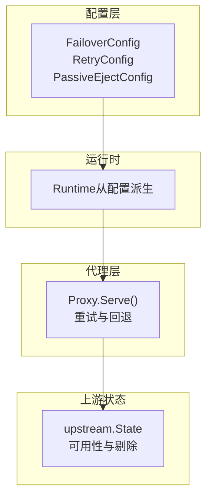
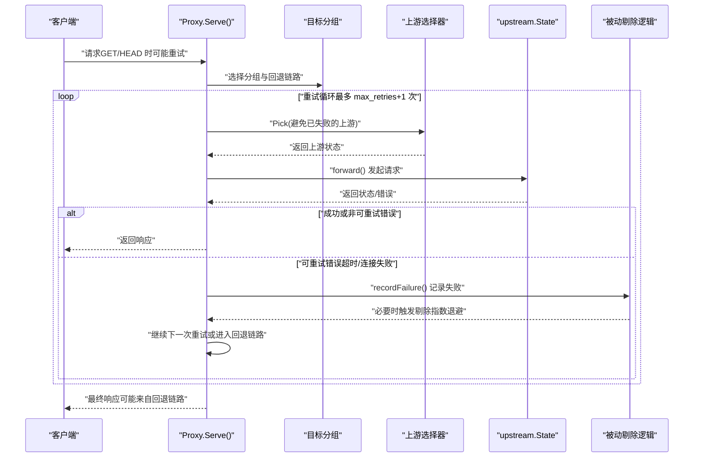
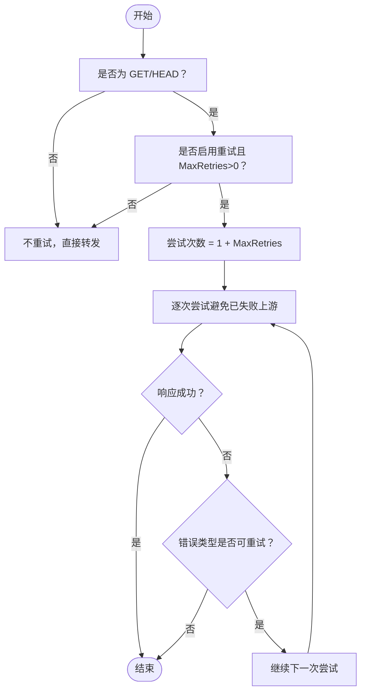
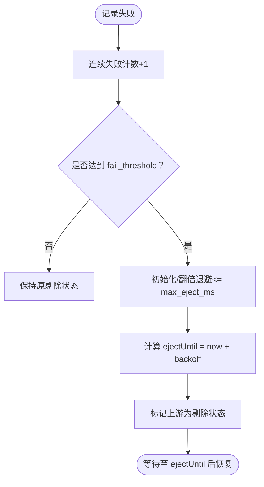
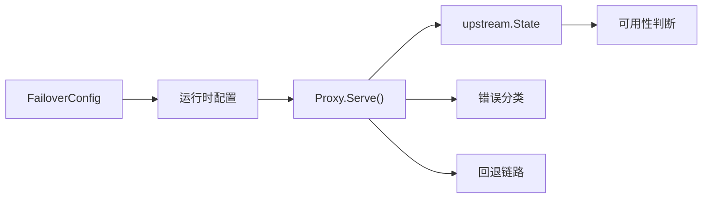

# 故障转移

<cite>
**本文引用的文件**
- [internal/config/config.go](file://internal/config/config.go)
- [internal/proxy/proxy.go](file://internal/proxy/proxy.go)
- [internal/upstream/state.go](file://internal/upstream/state.go)
- [config.example.yaml](file://config.example.yaml)
- [README.md](file://README.md)
</cite>

## 目录
1. [简介](#简介)
2. [项目结构](#项目结构)
3. [核心组件](#核心组件)
4. [架构总览](#架构总览)
5. [详细组件分析](#详细组件分析)
6. [依赖关系分析](#依赖关系分析)
7. [性能考量](#性能考量)
8. [故障排查指南](#故障排查指南)
9. [结论](#结论)

## 简介
本章节系统性介绍 RSSHub-Gateway 的故障转移配置，重点覆盖 failover.retry 与 failover.passive_eject 两大子模块。基于 internal/config/config.go 中的 FailoverConfig、RetryConfig 和 PassiveEjectConfig 结构体定义，我们将说明：
- 重试机制的触发条件（仅 GET/HEAD）、最大重试次数设置与行为边界；
- 被动剔除机制的连续失败阈值、剔除时长（指数退避）的配置方法；
- 两者如何协同工作以提升系统在高并发与不稳定上游环境下的容错能力；
- 高并发场景下的参数调优建议与常见问题排查。

## 项目结构
围绕故障转移相关的代码与配置主要分布在以下位置：
- 配置模型与默认值：internal/config/config.go
- 代理层重试与回退链路：internal/proxy/proxy.go
- 上游状态与被动剔除逻辑：internal/upstream/state.go
- 示例配置与使用说明：config.example.yaml、README.md

图表来源
- [internal/config/config.go](file://internal/config/config.go#L93-L108)
- [internal/proxy/proxy.go](file://internal/proxy/proxy.go#L126-L173)
- [internal/upstream/state.go](file://internal/upstream/state.go#L34-L108)

章节来源
- [internal/config/config.go](file://internal/config/config.go#L93-L108)
- [internal/proxy/proxy.go](file://internal/proxy/proxy.go#L126-L173)
- [internal/upstream/state.go](file://internal/upstream/state.go#L34-L108)

## 核心组件
- FailoverConfig：聚合重试与被动剔除策略的顶层配置对象。
- RetryConfig：控制是否启用重试以及最大重试次数。
- PassiveEjectConfig：控制被动剔除的阈值、初始剔除时长与最大剔除时长。
- Proxy.Serve：实现请求处理、重试尝试、错误分类与回退链路。
- upstream.State：维护上游健康状态、连续失败计数、剔除到期时间与指数退避。

章节来源
- [internal/config/config.go](file://internal/config/config.go#L93-L108)
- [internal/proxy/proxy.go](file://internal/proxy/proxy.go#L126-L173)
- [internal/upstream/state.go](file://internal/upstream/state.go#L34-L108)

## 架构总览
下图展示一次请求在代理层如何根据配置决定重试次数，并在失败时记录失败、触发被动剔除，同时按回退链路切换到备用分组。

图表来源
- [internal/proxy/proxy.go](file://internal/proxy/proxy.go#L126-L173)
- [internal/proxy/proxy.go](file://internal/proxy/proxy.go#L276-L298)
- [internal/upstream/state.go](file://internal/upstream/state.go#L84-L102)

## 详细组件分析

### 重试机制（failover.retry）
- 触发条件
  - 仅对 GET/HEAD 方法启用重试。
  - 当启用且 MaxRetries > 0 时，实际尝试次数为 1 + MaxRetries。
- 行为边界
  - 错误类型分类：超时与连接失败视为可重试；客户端错误不重试。
  - 在每次重试前会避开已标记失败的上游，降低抖动影响。
  - 成功响应后若状态码仍为 5xx，则代理层会记录失败（用于被动剔除）。
- 配置入口
  - 顶层配置项：failover.retry.enabled、failover.retry.max_retries。
  - 默认值：MaxRetries 若未显式设置，默认为 1；enabled 默认开启但受 MaxRetries 影响。

图表来源
- [internal/proxy/proxy.go](file://internal/proxy/proxy.go#L126-L173)
- [internal/proxy/proxy.go](file://internal/proxy/proxy.go#L300-L302)

章节来源
- [internal/proxy/proxy.go](file://internal/proxy/proxy.go#L126-L173)
- [internal/proxy/proxy.go](file://internal/proxy/proxy.go#L300-L302)
- [internal/config/config.go](file://internal/config/config.go#L209-L211)

### 被动剔除机制（failover.passive_eject）
- 触发条件
  - 当上游发生可重试错误或 5xx 响应时，代理层记录失败。
  - 若该上游连续失败次数达到 fail_threshold，则触发剔除。
- 剔除策略
  - 指数退避：首次剔除时长为 base_eject_ms；后续翻倍，不超过 max_eject_ms。
  - 剔除期间上游不可被选择，直到当前时间到达 ejectUntil。
- 配置入口
  - 顶层配置项：failover.passive_eject.enabled、failover.passive_eject.fail_threshold、failover.passive_eject.base_eject_ms、failover.passive_eject.max_eject_ms。
  - 默认值：fail_threshold 默认 3；base_eject_ms 默认 10000；max_eject_ms 默认 60000。
  - 配置校验：base_eject_ms 必须不大于 max_eject_ms。

图表来源
- [internal/proxy/proxy.go](file://internal/proxy/proxy.go#L276-L298)
- [internal/upstream/state.go](file://internal/upstream/state.go#L84-L102)
- [internal/config/config.go](file://internal/config/config.go#L212-L220)
- [internal/config/config.go](file://internal/config/config.go#L397-L399)

章节来源
- [internal/proxy/proxy.go](file://internal/proxy/proxy.go#L276-L298)
- [internal/upstream/state.go](file://internal/upstream/state.go#L84-L102)
- [internal/config/config.go](file://internal/config/config.go#L212-L220)
- [internal/config/config.go](file://internal/config/config.go#L397-L399)

### 两者的协同工作
- 重试优先：在 GET/HEAD 下，先进行有限次数的重试，减少瞬时抖动带来的失败。
- 失败记录与剔除：重试失败或 5xx 响应会被记录，当连续失败达到阈值时触发剔除，避免将流量持续导向不健康的上游。
- 回退链路：若当前分组内所有上游均不可用（含被剔除），代理层会按 fallback_groups 顺序尝试其他分组，进一步提升可用性。

章节来源
- [internal/proxy/proxy.go](file://internal/proxy/proxy.go#L126-L173)
- [internal/proxy/proxy.go](file://internal/proxy/proxy.go#L383-L392)

## 依赖关系分析
- 配置到运行时
  - FailoverConfig 作为顶层配置的一部分，通过加载与归一化流程生成运行时配置。
  - 默认值与校验确保 failover.retry 与 failover.passive_eject 的合理范围。
- 代理层对上游状态的依赖
  - Proxy.Serve 在每次尝试前调用上游选择器，上游状态对象负责可用性判断与剔除到期时间。
  - 记录失败时，代理层调用 upstream.State 的 RecordFailure，触发指数退避与剔除。
- 错误分类与重试判定
  - 代理层对网络错误进行分类，仅对超时与连接失败进行重试，避免对客户端错误与非重试类错误进行无意义重试。

图表来源
- [internal/config/config.go](file://internal/config/config.go#L93-L108)
- [internal/proxy/proxy.go](file://internal/proxy/proxy.go#L126-L173)
- [internal/upstream/state.go](file://internal/upstream/state.go#L34-L108)

章节来源
- [internal/config/config.go](file://internal/config/config.go#L93-L108)
- [internal/proxy/proxy.go](file://internal/proxy/proxy.go#L126-L173)
- [internal/upstream/state.go](file://internal/upstream/state.go#L34-L108)

## 性能考量
- 重试次数与并发
  - GET/HEAD 的有限重试可显著降低瞬时抖动导致的失败率，但过多重试会放大上游压力。建议在高并发场景下谨慎设置 MaxRetries，避免放大效应。
- 指数退避与剔除窗口
  - base_eject_ms 与 max_eject_ms 控制剔除窗口的上限，过短会导致频繁切换，过长会影响恢复速度。建议结合上游稳定性与观测指标（如上游失败率、恢复时间）调整。
- 回退链路与负载
  - fallback_groups 的顺序与权重会影响整体负载分布。建议将更稳定的上游置于前面，或在不同分组间进行合理的权重分配。
- 超时与吞吐
  - 服务器超时（server.timeout_ms）直接影响代理层的请求超时与错误分类。过短可能导致误判为超时而触发重试，过长则会增加端到端延迟。建议与上游 SLA 与业务容忍度匹配。

章节来源
- [internal/proxy/proxy.go](file://internal/proxy/proxy.go#L126-L173)
- [internal/config/config.go](file://internal/config/config.go#L397-L399)

## 故障排查指南
- 重试无效或过度重试
  - 检查请求方法是否为 GET/HEAD；仅这两种方法会触发重试。
  - 确认 failover.retry.enabled 与 failover.retry.max_retries 设置是否符合预期。
  - 关注日志中的 retries 字段与 metrics.rsshub_gateway_retry_total 指标。
- 被动剔除未生效
  - 检查 failover.passive_eject.enabled、failover.passive_eject.fail_threshold、failover.passive_eject.base_eject_ms、failover.passive_eject.max_eject_ms 的配置。
  - 确认 base_eject_ms 不大于 max_eject_ms。
  - 查看日志中“upstream eject”事件与 metrics.rsshub_gateway_upstream_eject_total 指标。
- 回退链路未触发
  - 确认当前分组的 fallback_groups 配置正确且存在可用上游。
  - 观察日志中的 fallback_chain 字段与 metrics.rsshub_gateway_fallback_total 指标。
- 错误分类与状态码
  - 代理层仅对超时与连接失败进行重试；对 5xx 响应也会记录失败以触发剔除。
  - 关注日志中的 err_type 字段与最终返回的状态码。

章节来源
- [internal/proxy/proxy.go](file://internal/proxy/proxy.go#L126-L173)
- [internal/proxy/proxy.go](file://internal/proxy/proxy.go#L276-L298)
- [internal/config/config.go](file://internal/config/config.go#L397-L399)
- [README.md](file://README.md#L315-L326)

## 结论
failover.retry 与 failover.passive_eject 通过“有限重试 + 指数退避剔除 + 回退链路”的组合，在高并发与不稳定上游环境下提供了稳健的容错能力。合理设置 MaxRetries、fail_threshold、base_eject_ms 与 max_eject_ms，配合回退链路与可观测指标，可在保证用户体验的同时最大化系统可用性与稳定性。