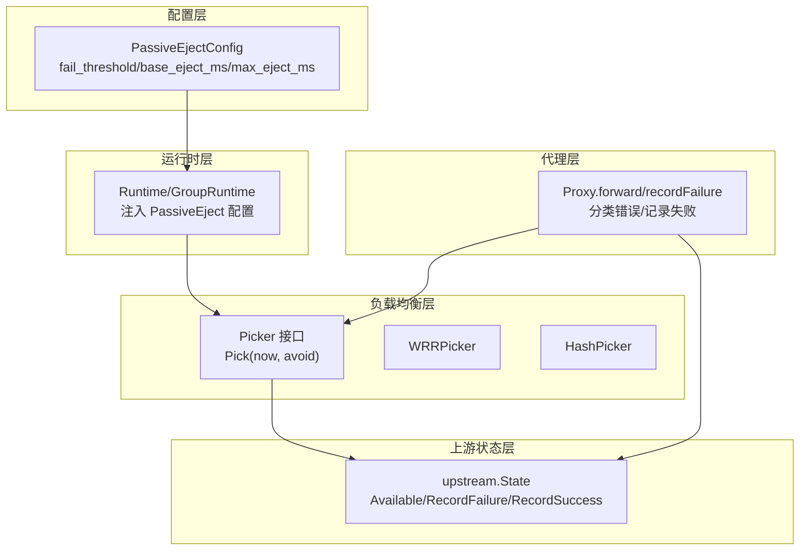
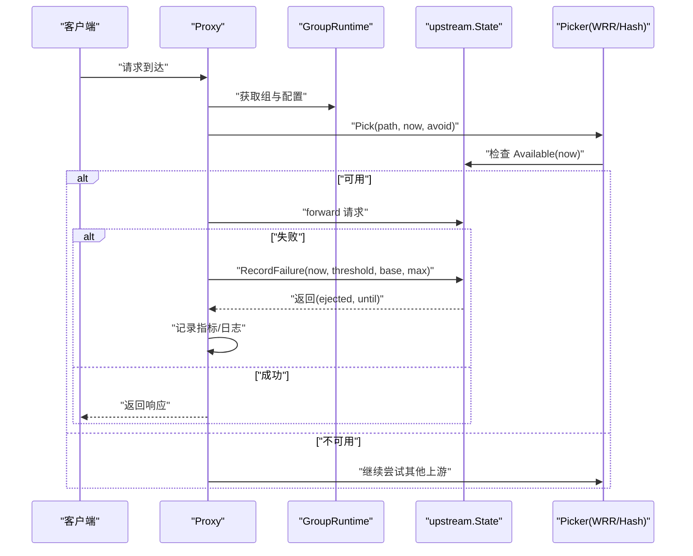
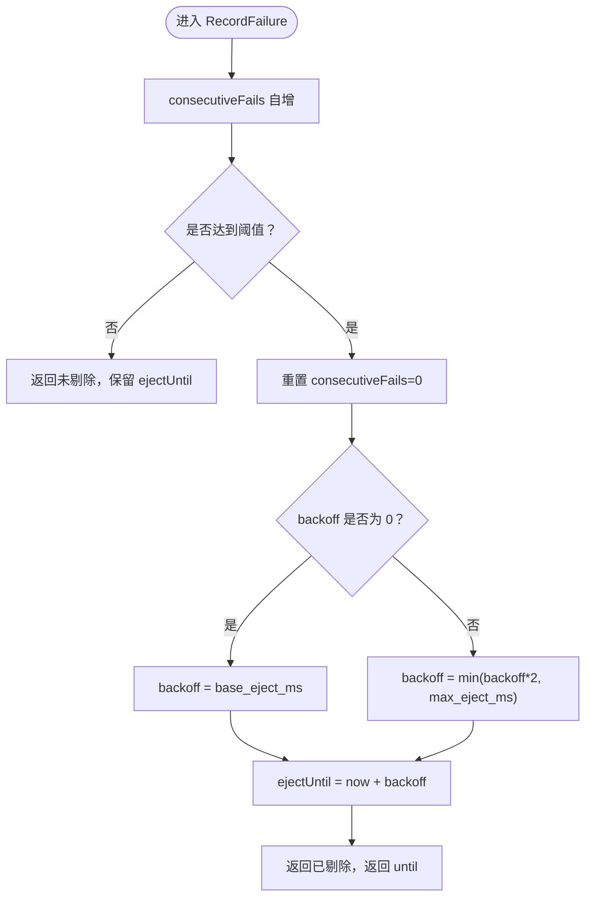
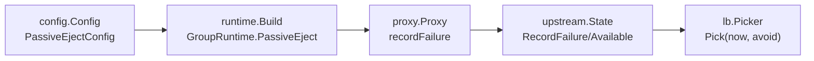

# 被动剔除机制

<cite>
**本文引用的文件**
- [internal/config/config.go](file://internal/config/config.go)
- [internal/runtime/runtime.go](file://internal/runtime/runtime.go)
- [internal/proxy/proxy.go](file://internal/proxy/proxy.go)
- [internal/upstream/state.go](file://internal/upstream/state.go)
- [internal/lb/picker.go](file://internal/lb/picker.go)
- [internal/lb/wrr.go](file://internal/lb/wrr.go)
- [internal/lb/hash.go](file://internal/lb/hash.go)
- [internal/runtime/manager.go](file://internal/runtime/manager.go)
</cite>

## 目录
1. [简介](#简介)
2. [项目结构](#项目结构)
3. [核心组件](#核心组件)
4. [架构总览](#架构总览)
5. [详细组件分析](#详细组件分析)
6. [依赖关系分析](#依赖关系分析)
7. [性能考量](#性能考量)
8. [故障排查指南](#故障排查指南)
9. [结论](#结论)

## 简介
本文件系统性阐述被动剔除（Passive Eject）机制的工作原理与配置细节，围绕 internal/config/config.go 中的 PassiveEjectConfig 结构体展开，重点说明以下三类参数：
- 连续失败阈值：fail_threshold
- 剔除时长基数：base_eject_ms
- 最大剔除时长：max_eject_ms

文档将解释当上游实例连续请求失败达到阈值后，系统如何将其临时从负载均衡池中移除，并采用指数退避方式逐步恢复服务；同时结合 upstream/state.go 的状态管理逻辑，说明健康状态的转换过程。最后给出生产环境配置建议与典型故障排查步骤。

## 项目结构
与被动剔除相关的关键模块分布如下：
- 配置层：定义 PassiveEjectConfig 及其默认值与校验规则
- 运行时层：构建 GroupRuntime 并注入 PassiveEject 配置
- 负载均衡层：Picker 在选择上游时会过滤不可用的上游（包括被剔除的）
- 代理层：在转发失败时记录失败并触发被动剔除
- 上游状态层：维护每个上游的健康状态、连续失败计数、剔除截止时间与指数退避

图表来源
- [internal/config/config.go](file://internal/config/config.go#L93-L108)
- [internal/runtime/runtime.go](file://internal/runtime/runtime.go#L49-L97)
- [internal/lb/picker.go](file://internal/lb/picker.go#L9-L11)
- [internal/lb/wrr.go](file://internal/lb/wrr.go#L23-L49)
- [internal/lb/hash.go](file://internal/lb/hash.go#L19-L38)
- [internal/proxy/proxy.go](file://internal/proxy/proxy.go#L134-L173)
- [internal/upstream/state.go](file://internal/upstream/state.go#L34-L102)

章节来源
- [internal/config/config.go](file://internal/config/config.go#L93-L108)
- [internal/runtime/runtime.go](file://internal/runtime/runtime.go#L49-L97)
- [internal/lb/picker.go](file://internal/lb/picker.go#L9-L11)
- [internal/lb/wrr.go](file://internal/lb/wrr.go#L23-L49)
- [internal/lb/hash.go](file://internal/lb/hash.go#L19-L38)
- [internal/proxy/proxy.go](file://internal/proxy/proxy.go#L134-L173)
- [internal/upstream/state.go](file://internal/upstream/state.go#L34-L102)

## 核心组件
- PassiveEjectConfig（配置层）
  - 字段：enabled、fail_threshold、base_eject_ms、max_eject_ms
  - 默认值：fail_threshold=3、base_eject_ms=10000、max_eject_ms=60000
  - 校验：base_eject_ms ≤ max_eject_ms
- GroupRuntime（运行时层）
  - 将全局 Failover.PassiveEject 注入到各组，供代理层使用
- upstream.State（上游状态层）
  - 维护 healthy、consecutiveFails、ejectUntil、backoff 等字段
  - 提供 Available(now)、RecordFailure(...)、RecordSuccess() 等方法
- Picker（负载均衡层）
  - Pick(path, now, avoid) 会跳过不可用的上游（包括被剔除的）
- Proxy（代理层）
  - 记录失败并调用 upstream.State.RecordFailure(...) 触发剔除
  - 当发生超时或连接错误时，按策略重试或直接返回错误码

章节来源
- [internal/config/config.go](file://internal/config/config.go#L93-L108)
- [internal/config/config.go](file://internal/config/config.go#L212-L220)
- [internal/config/config.go](file://internal/config/config.go#L397-L399)
- [internal/runtime/runtime.go](file://internal/runtime/runtime.go#L76-L88)
- [internal/upstream/state.go](file://internal/upstream/state.go#L9-L21)
- [internal/upstream/state.go](file://internal/upstream/state.go#L34-L102)
- [internal/lb/picker.go](file://internal/lb/picker.go#L9-L11)
- [internal/proxy/proxy.go](file://internal/proxy/proxy.go#L276-L298)

## 架构总览
被动剔除的端到端流程如下：
- 代理层在转发失败时，根据错误类型与状态码判断是否需要记录失败
- 若启用被动剔除，则调用 upstream.State.RecordFailure(...)，在满足连续失败阈值后，计算指数退避时长并设置 ejectUntil
- 负载均衡器在 Pick 时检查 upstream.State.Available(now)，若未到期则跳过该上游
- 当时间到达 ejectUntil 后，上游自动恢复可用，backoff 清零

图表来源
- [internal/proxy/proxy.go](file://internal/proxy/proxy.go#L134-L173)
- [internal/proxy/proxy.go](file://internal/proxy/proxy.go#L276-L298)
- [internal/upstream/state.go](file://internal/upstream/state.go#L34-L102)
- [internal/lb/wrr.go](file://internal/lb/wrr.go#L23-L49)
- [internal/lb/hash.go](file://internal/lb/hash.go#L19-L38)

## 详细组件分析

### PassiveEjectConfig 参数详解
- fail_threshold（连续失败阈值）
  - 定义：连续失败次数达到该阈值后，开始计算指数退避并剔除上游
  - 默认值：3
  - 影响：越小越敏感，越容易触发剔除；越大越保守，可能容忍更多瞬时失败
- base_eject_ms（剔除时长基数）
  - 定义：首次剔除的持续时间（毫秒）
  - 默认值：10000（10 秒）
  - 影响：决定第一次剔除的“冷静期”长度
- max_eject_ms（最大剔除时长）
  - 定义：剔除时长上限（毫秒）
  - 默认值：60000（60 秒）
  - 影响：防止无限延长导致资源长期不可用

参数默认值与校验规则：
- 默认值由配置加载阶段 applyDefaults 设置
- 校验规则要求 base_eject_ms ≤ max_eject_ms，否则配置无效

章节来源
- [internal/config/config.go](file://internal/config/config.go#L93-L108)
- [internal/config/config.go](file://internal/config/config.go#L212-L220)
- [internal/config/config.go](file://internal/config/config.go#L397-L399)

### upstream.State 状态管理与指数退避
- 关键字段
  - healthy：健康状态
  - consecutiveFails：连续失败计数
  - ejectUntil：剔除截止时间
  - backoff：当前指数退避时长
- 核心方法
  - Available(now)：若 healthy 为真且 now ≥ ejectUntil 则可用
  - RecordFailure(now, threshold, base, max)：
    - 连续失败计数自增
    - 达到阈值后重置计数，计算 backoff（首次为 base，后续翻倍，不超过 max），并设置 ejectUntil = now + backoff
    - 返回是否被剔除及剔除截止时间
  - RecordSuccess()：成功时清零连续失败计数
  - HealthFail/HealthSuccess/SetHealthy：用于主动健康探测的状态管理（与被动剔除互补）

指数退避流程图：

图表来源
- [internal/upstream/state.go](file://internal/upstream/state.go#L84-L102)

章节来源
- [internal/upstream/state.go](file://internal/upstream/state.go#L9-L21)
- [internal/upstream/state.go](file://internal/upstream/state.go#L34-L102)

### 负载均衡器对剔除状态的利用
- Picker 接口定义 Pick(path, now, avoid) -> *upstream.State
- WRRPicker/HashPicker 在遍历上游时：
  - 跳过 avoid 映射中的上游
  - 调用 item.Available(now) 过滤不可用上游（包括被剔除的）
- 因此，一旦某上游被剔除，它不会参与后续选择，直到 ejectUntil 到来

章节来源
- [internal/lb/picker.go](file://internal/lb/picker.go#L9-L11)
- [internal/lb/wrr.go](file://internal/lb/wrr.go#L23-L49)
- [internal/lb/hash.go](file://internal/lb/hash.go#L19-L38)
- [internal/upstream/state.go](file://internal/upstream/state.go#L34-L41)

### 代理层对失败的记录与触发剔除
- 代理层在转发失败时：
  - 分类错误类型（超时/连接）
  - 记录失败指标与日志
  - 若启用被动剔除且错误属于 5xx 或可判定为失败，则调用 upstream.State.RecordFailure(...)
- 记录失败的条件：
  - 错误类型非 client
  - 或者错误类型为空但状态码 ≥ 500
  - 且组级 PassiveEject.Enabled 为真

章节来源
- [internal/proxy/proxy.go](file://internal/proxy/proxy.go#L134-L173)
- [internal/proxy/proxy.go](file://internal/proxy/proxy.go#L276-L298)

### 运行时构建与配置注入
- Build 阶段：
  - 为每个上游创建 upstream.State
  - 为每组创建 Picker（WRR/Hash）
  - 将全局 Failover.PassiveEject 注入到 GroupRuntime.PassiveEject
- 这样代理层在转发时可以直接使用组内的 PassiveEject 配置

章节来源
- [internal/runtime/runtime.go](file://internal/runtime/runtime.go#L50-L97)

## 依赖关系分析
- 配置层（config）定义 PassiveEjectConfig，并在加载时应用默认值与校验
- 运行时层（runtime）将配置注入到 GroupRuntime，供代理层使用
- 代理层（proxy）在失败路径上触发上游状态更新
- 上游状态层（upstream）提供可用性判断与指数退避逻辑
- 负载均衡层（lb）消费上游状态，过滤不可用上游

图表来源
- [internal/config/config.go](file://internal/config/config.go#L93-L108)
- [internal/runtime/runtime.go](file://internal/runtime/runtime.go#L50-L97)
- [internal/proxy/proxy.go](file://internal/proxy/proxy.go#L276-L298)
- [internal/upstream/state.go](file://internal/upstream/state.go#L34-L102)
- [internal/lb/picker.go](file://internal/lb/picker.go#L9-L11)

章节来源
- [internal/config/config.go](file://internal/config/config.go#L93-L108)
- [internal/runtime/runtime.go](file://internal/runtime/runtime.go#L50-L97)
- [internal/proxy/proxy.go](file://internal/proxy/proxy.go#L276-L298)
- [internal/upstream/state.go](file://internal/upstream/state.go#L34-L102)
- [internal/lb/picker.go](file://internal/lb/picker.go#L9-L11)

## 性能考量
- 指数退避避免了对故障上游的持续高并发冲击，有助于快速恢复与稳定
- base_eject_ms 决定首次“冷静期”，影响误判成本；max_eject_ms 限制最长停机时间
- 过小的 fail_threshold 可能导致频繁抖动；过大则可能容忍过多失败
- 负载均衡器在每次选择时仅做一次 Available(now) 判断，开销极低
- 建议结合 SLA 与上游稳定性调整阈值与退避参数，避免过度剔除或恢复过慢

## 故障排查指南
- 现象：上游频繁被剔除/恢复，流量波动大
  - 步骤：
    - 检查日志中“upstream eject”记录，确认剔除频率与持续时间
    - 对比 base_eject_ms 与 max_eject_ms，评估是否过短或过长
    - 查看 fail_threshold 是否过低导致误判
  - 建议：
    - 提升 fail_threshold 或增大 base_eject_ms，降低误判概率
    - 若上游确有周期性抖动，适当提高 max_eject_ms，确保足够恢复窗口
- 现象：上游长时间不可用
  - 步骤：
    - 检查当前时间与 ejectUntil 差值，确认是否仍在退避期内
    - 确认 backoff 是否已达 max_eject_ms 仍未恢复
  - 建议：
    - 适当降低 base_eject_ms 或提升 fail_threshold，缩短恢复路径
- 现象：负载均衡器无法选择可用上游
  - 步骤：
    - 使用运行时工具查询某组可用上游数量（AvailableUpstreams）
    - 检查 avoid 列表是否误传导致上游被排除
  - 建议：
    - 确保 Picker 的 avoid 仅包含本次失败的上游，避免跨次请求污染
- 现象：超时/连接错误频繁
  - 步骤：
    - 检查代理层错误分类与状态码，确认是否触发了被动剔除
    - 对上游进行主动健康探测（Active Health），辅助判断真实健康状况
  - 建议：
    - 结合主动健康探测与被动剔除，形成双保险

章节来源
- [internal/proxy/proxy.go](file://internal/proxy/proxy.go#L276-L298)
- [internal/upstream/state.go](file://internal/upstream/state.go#L34-L41)
- [internal/runtime/runtime.go](file://internal/runtime/runtime.go#L141-L155)

## 结论
被动剔除通过 fail_threshold、base_eject_ms、max_eject_ms 三参数协同工作，在检测到连续失败后以指数退避的方式将故障上游暂时移出负载均衡池，从而保护整体系统稳定性。配合负载均衡器的可用性过滤与代理层的失败记录，形成闭环。生产环境中应依据服务 SLA 与上游稳定性合理设置阈值与退避参数，避免误判与过度恢复，同时结合日志与指标进行持续优化。