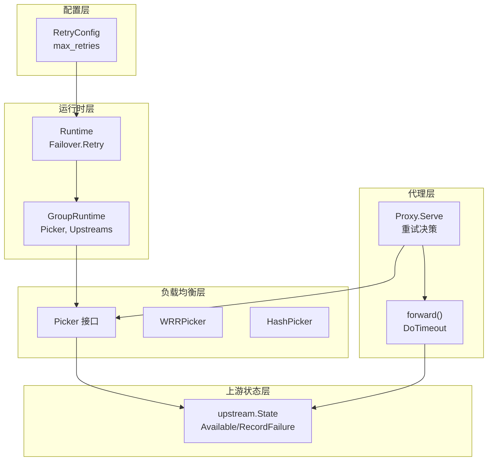
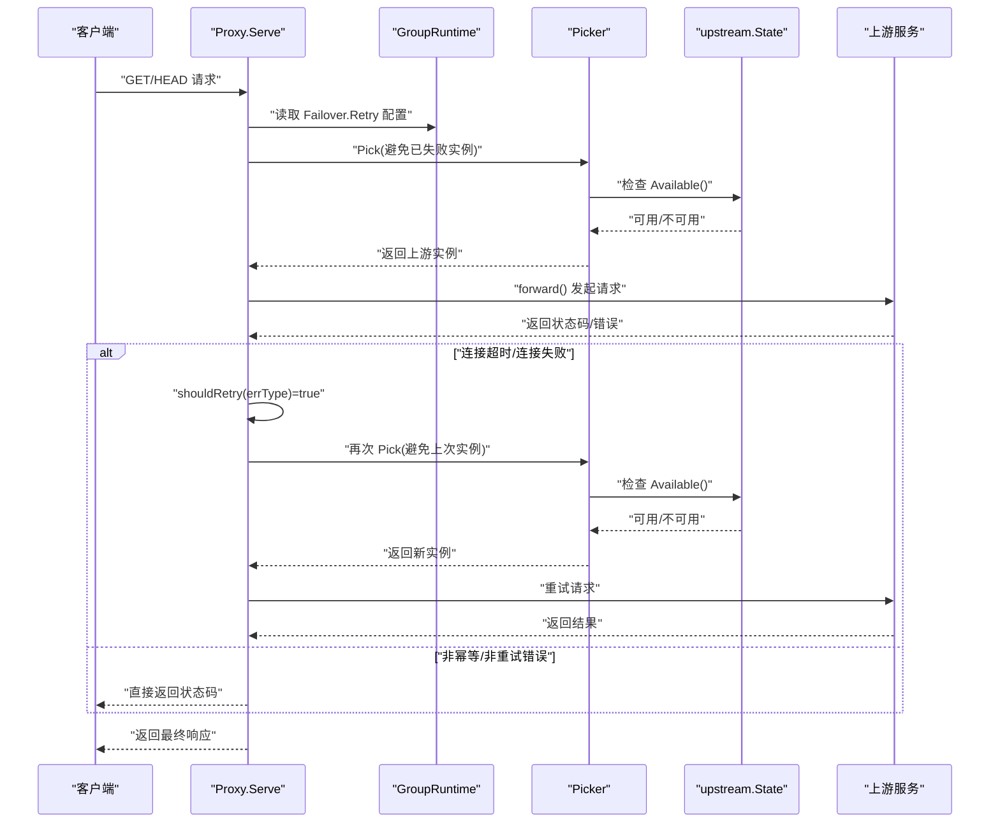
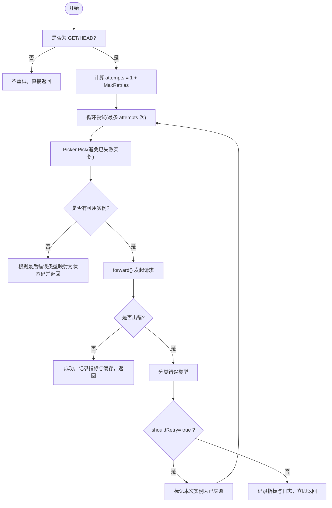
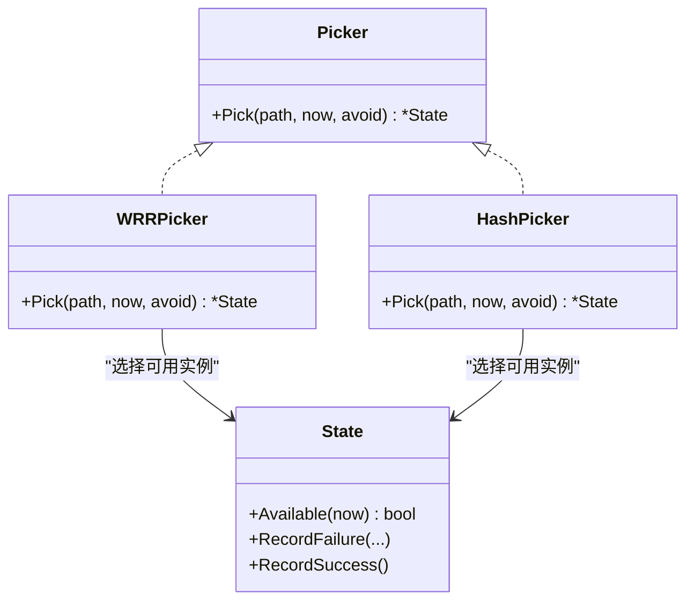
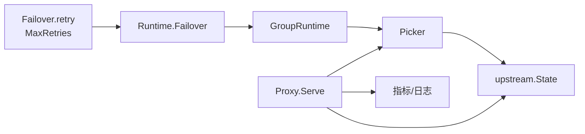

# 重试机制

<cite>
**本文引用的文件列表**
- [internal/config/config.go](file://internal/config/config.go)
- [internal/proxy/proxy.go](file://internal/proxy/proxy.go)
- [internal/lb/picker.go](file://internal/lb/picker.go)
- [internal/lb/wrr.go](file://internal/lb/wrr.go)
- [internal/lb/hash.go](file://internal/lb/hash.go)
- [internal/upstream/state.go](file://internal/upstream/state.go)
- [internal/runtime/runtime.go](file://internal/runtime/runtime.go)
- [config.example.yaml](file://config.example.yaml)
</cite>

## 目录
1. [简介](#简介)
2. [项目结构](#项目结构)
3. [核心组件](#核心组件)
4. [架构总览](#架构总览)
5. [详细组件分析](#详细组件分析)
6. [依赖关系分析](#依赖关系分析)
7. [性能考量](#性能考量)
8. [故障排查指南](#故障排查指南)
9. [结论](#结论)
10. [附录](#附录)

## 简介
本篇文档聚焦于 RSSHub-Gateway 的“重试机制”，围绕 internal/config/config.go 中的 RetryConfig 结构体展开，系统性解析其启用条件、最大重试次数的配置与默认值设定逻辑，以及在代理层 proxy 模块中的执行流程。文档还解释了在上游实例连接失败或返回 5xx 错误时如何触发重试，重试过程中负载均衡器如何选择新的健康实例，并给出高并发场景下的参数调优建议与常见问题排查方法。

## 项目结构
与重试机制直接相关的代码分布在以下模块：
- 配置层：定义重试开关与最大重试次数
- 运行时层：构建分组运行时，注入重试与被动剔除配置
- 代理层：根据方法与错误类型决定是否重试，记录指标与日志
- 负载均衡层：Picker 接口与具体实现（WRR/Hash），支持避开已失败实例
- 上游状态层：记录失败、健康状态与剔除时间窗口

图表来源
- [internal/config/config.go](file://internal/config/config.go#L93-L101)
- [internal/runtime/runtime.go](file://internal/runtime/runtime.go#L50-L118)
- [internal/proxy/proxy.go](file://internal/proxy/proxy.go#L126-L173)
- [internal/lb/picker.go](file://internal/lb/picker.go#L9-L11)
- [internal/lb/wrr.go](file://internal/lb/wrr.go#L23-L49)
- [internal/lb/hash.go](file://internal/lb/hash.go#L19-L37)
- [internal/upstream/state.go](file://internal/upstream/state.go#L34-L41)

章节来源
- [internal/config/config.go](file://internal/config/config.go#L93-L101)
- [internal/runtime/runtime.go](file://internal/runtime/runtime.go#L50-L118)
- [internal/proxy/proxy.go](file://internal/proxy/proxy.go#L126-L173)
- [internal/lb/picker.go](file://internal/lb/picker.go#L9-L11)
- [internal/lb/wrr.go](file://internal/lb/wrr.go#L23-L49)
- [internal/lb/hash.go](file://internal/lb/hash.go#L19-L37)
- [internal/upstream/state.go](file://internal/upstream/state.go#L34-L41)

## 核心组件
- RetryConfig：定义重试开关与最大重试次数
- Proxy.Serve：在 GET/HEAD 方法下按 max_retries 计算尝试次数，基于错误类型决定是否重试
- Picker 接口与实现：WRRPicker/HashPicker 在每次尝试中避开已失败实例，选择可用上游
- upstream.State：维护健康状态、剔除时间窗口与连续失败计数，影响上游可用性判断
- 运行时构建：将配置注入到 GroupRuntime，供代理层使用

章节来源
- [internal/config/config.go](file://internal/config/config.go#L93-L101)
- [internal/proxy/proxy.go](file://internal/proxy/proxy.go#L126-L173)
- [internal/lb/picker.go](file://internal/lb/picker.go#L9-L11)
- [internal/lb/wrr.go](file://internal/lb/wrr.go#L23-L49)
- [internal/lb/hash.go](file://internal/lb/hash.go#L19-L37)
- [internal/upstream/state.go](file://internal/upstream/state.go#L34-L41)
- [internal/runtime/runtime.go](file://internal/runtime/runtime.go#L50-L118)

## 架构总览
重试机制在请求进入代理层后，依据方法与错误类型进行判定，并通过负载均衡器挑选新的健康实例。若达到最大重试次数仍未成功，则根据最后一次错误类型映射为网关超时或网关错误返回给客户端。

图表来源
- [internal/proxy/proxy.go](file://internal/proxy/proxy.go#L126-L173)
- [internal/proxy/proxy.go](file://internal/proxy/proxy.go#L191-L228)
- [internal/lb/picker.go](file://internal/lb/picker.go#L9-L11)
- [internal/lb/wrr.go](file://internal/lb/wrr.go#L23-L49)
- [internal/lb/hash.go](file://internal/lb/hash.go#L19-L37)
- [internal/upstream/state.go](file://internal/upstream/state.go#L34-L41)

## 详细组件分析

### RetryConfig 结构体与默认值
- 字段含义
  - Enabled：是否启用重试
  - MaxRetries：最大重试次数
- 默认值设定
  - 当配置中未显式设置 MaxRetries 时，配置加载阶段会将其默认为 1
- 配置位置
  - 位于 Failover.retry 下，对应 YAML 字段为 retry.enabled 与 retry.max_retries

章节来源
- [internal/config/config.go](file://internal/config/config.go#L93-L101)
- [internal/config/config.go](file://internal/config/config.go#L208-L211)

### 代理层重试流程与触发条件
- 触发条件
  - 仅对 GET/HEAD 方法生效
  - 当发生连接超时或连接失败时触发重试
- 尝试次数计算
  - attempts = 1 + MaxRetries
- 重试过程
  - 每次尝试前从负载均衡器选取一个可用实例
  - 若本次失败，将该实例加入 avoid 集合，避免在同一轮重试中重复选择
  - 若 shouldRetry 返回 true，则继续下一次尝试；否则直接返回当前状态码
- 错误类型分类
  - 超时：映射为网关超时
  - 连接失败：映射为网关错误
- 指标与日志
  - 记录重试总数、路由耗时、成功率/失败率等
  - 日志包含方法、路径、状态、重试次数、回退链路、错误类型等字段

图表来源
- [internal/proxy/proxy.go](file://internal/proxy/proxy.go#L126-L173)
- [internal/proxy/proxy.go](file://internal/proxy/proxy.go#L191-L228)
- [internal/proxy/proxy.go](file://internal/proxy/proxy.go#L300-L302)
- [internal/proxy/proxy.go](file://internal/proxy/proxy.go#L346-L364)

章节来源
- [internal/proxy/proxy.go](file://internal/proxy/proxy.go#L126-L173)
- [internal/proxy/proxy.go](file://internal/proxy/proxy.go#L300-L302)
- [internal/proxy/proxy.go](file://internal/proxy/proxy.go#L346-L364)

### 负载均衡器与实例选择
- Picker 接口
  - 提供 Pick(path, now, avoid) 方法，返回一个可用且未被避免的上游实例
- WRRPicker
  - 基于权重的轮询，支持避开已失败实例
- HashPicker
  - 基于路径与主机标签的稳定哈希，同样支持避开已失败实例
- upstream.State.Available
  - 判断上游是否健康且未处于剔除窗口内

图表来源
- [internal/lb/picker.go](file://internal/lb/picker.go#L9-L11)
- [internal/lb/wrr.go](file://internal/lb/wrr.go#L23-L49)
- [internal/lb/hash.go](file://internal/lb/hash.go#L19-L37)
- [internal/upstream/state.go](file://internal/upstream/state.go#L34-L41)

章节来源
- [internal/lb/picker.go](file://internal/lb/picker.go#L9-L11)
- [internal/lb/wrr.go](file://internal/lb/wrr.go#L23-L49)
- [internal/lb/hash.go](file://internal/lb/hash.go#L19-L37)
- [internal/upstream/state.go](file://internal/upstream/state.go#L34-L41)

### 上游实例健康与剔除
- 健康状态
  - Healthy 标记与 consecutiveFails 计数
  - RecordFailure 在达到阈值后将实例标记为不健康并进入指数退避的剔除窗口
  - RecordSuccess 清零连续失败计数并恢复健康
- 可用性判断
  - Available(now) 要求实例健康且当前时间已超过 ejectUntil

章节来源
- [internal/upstream/state.go](file://internal/upstream/state.go#L34-L41)
- [internal/upstream/state.go](file://internal/upstream/state.go#L78-L102)

### 运行时构建与配置注入
- 运行时构建时，将 Failover.retry 与 PassiveEject 配置注入到 GroupRuntime
- 依据组配置选择负载均衡策略（WRR/Hash），并创建对应的 Picker 实例

章节来源
- [internal/runtime/runtime.go](file://internal/runtime/runtime.go#L50-L118)

## 依赖关系分析
- 配置层与运行时层
  - Failover.retry 配置被注入到 Runtime/Failover 字段，供代理层读取
- 代理层与负载均衡层
  - 代理层在每次尝试前调用 Picker.Pick，避免已失败实例
- 代理层与上游状态层
  - 代理层通过 upstream.State.Available 判断实例可用性，并在失败时调用 RecordFailure 更新健康状态
- 代理层与指标/日志
  - 代理层记录重试总数、路由耗时、成功率/失败率，并输出访问日志

图表来源
- [internal/config/config.go](file://internal/config/config.go#L93-L101)
- [internal/runtime/runtime.go](file://internal/runtime/runtime.go#L50-L118)
- [internal/proxy/proxy.go](file://internal/proxy/proxy.go#L126-L173)
- [internal/lb/picker.go](file://internal/lb/picker.go#L9-L11)
- [internal/upstream/state.go](file://internal/upstream/state.go#L34-L41)

章节来源
- [internal/config/config.go](file://internal/config/config.go#L93-L101)
- [internal/runtime/runtime.go](file://internal/runtime/runtime.go#L50-L118)
- [internal/proxy/proxy.go](file://internal/proxy/proxy.go#L126-L173)
- [internal/lb/picker.go](file://internal/lb/picker.go#L9-L11)
- [internal/upstream/state.go](file://internal/upstream/state.go#L34-L41)

## 性能考量
- 并发与重试
  - 在不稳定网络环境下，适度提高 MaxRetries 可提升成功率；但过度重试会放大后端压力，需谨慎评估
- 超时与重试
  - 代理层使用统一的 Server.TimeoutMS 控制上游请求超时；合理设置超时与重试次数，避免请求堆积
- 负载均衡策略
  - WRR 更适合流量分布，Hash 更适合需要稳定路由的场景；两者均支持避开失败实例
- 指标监控
  - 关注重试总量、路由耗时、成功率/失败率与上游剔除次数，及时发现异常波动

[本节为通用指导，不直接分析具体文件]

## 故障排查指南
- 常见问题
  - 非幂等请求不会重试：POST/PUT/PATCH 等方法不会触发重试，避免重复副作用
  - 仅 GET/HEAD 重试：确保业务接口符合幂等性要求
  - 重试后仍失败：检查上游健康状态与剔除窗口，确认实例是否被被动剔除
- 排查步骤
  - 查看访问日志中的 err_type 与 fallback_chain 字段，定位失败原因与回退链路
  - 关注重试指标与路由耗时，判断是否因网络抖动导致超时
  - 检查上游实例的健康状态与剔除时间窗口，必要时调整 fail_threshold 与 base_eject_ms
- 配置示例参考
  - 参考示例配置中的 failover.retry 与 passive_eject 设置，按需调整

章节来源
- [internal/proxy/proxy.go](file://internal/proxy/proxy.go#L126-L173)
- [internal/proxy/proxy.go](file://internal/proxy/proxy.go#L394-L418)
- [config.example.yaml](file://config.example.yaml#L140-L167)

## 结论
RSSHub-Gateway 的重试机制以幂等性为前提，仅对 GET/HEAD 请求生效，并通过 MaxRetries 与错误类型分类实现可控的重试策略。代理层在每次尝试中利用负载均衡器避开已失败实例，结合上游健康状态与被动剔除策略，有效提升整体可用性。在高并发与不稳定网络环境中，应平衡重试次数与超时设置，配合指标与日志进行持续优化。

[本节为总结性内容，不直接分析具体文件]

## 附录

### 配置示例与说明
- 重试配置
  - retry.enabled：是否启用重试
  - retry.max_retries：最大重试次数，默认值为 1（当未显式设置时）
- 被动剔除配置
  - passive_eject.fail_threshold：连续失败阈值
  - passive_eject.base_eject_ms：初始剔除时长
  - passive_eject.max_eject_ms：最大剔除时长

章节来源
- [internal/config/config.go](file://internal/config/config.go#L93-L101)
- [internal/config/config.go](file://internal/config/config.go#L208-L211)
- [config.example.yaml](file://config.example.yaml#L140-L167)