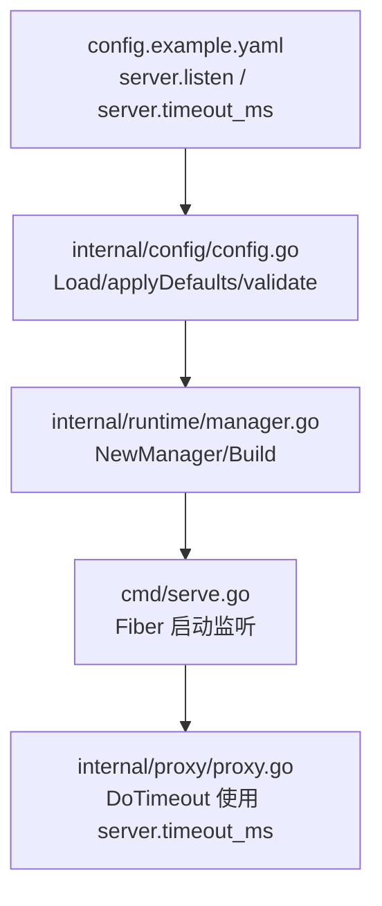
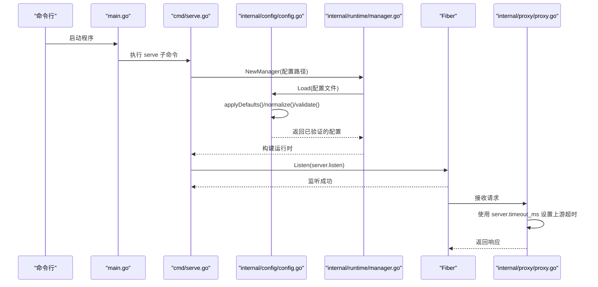
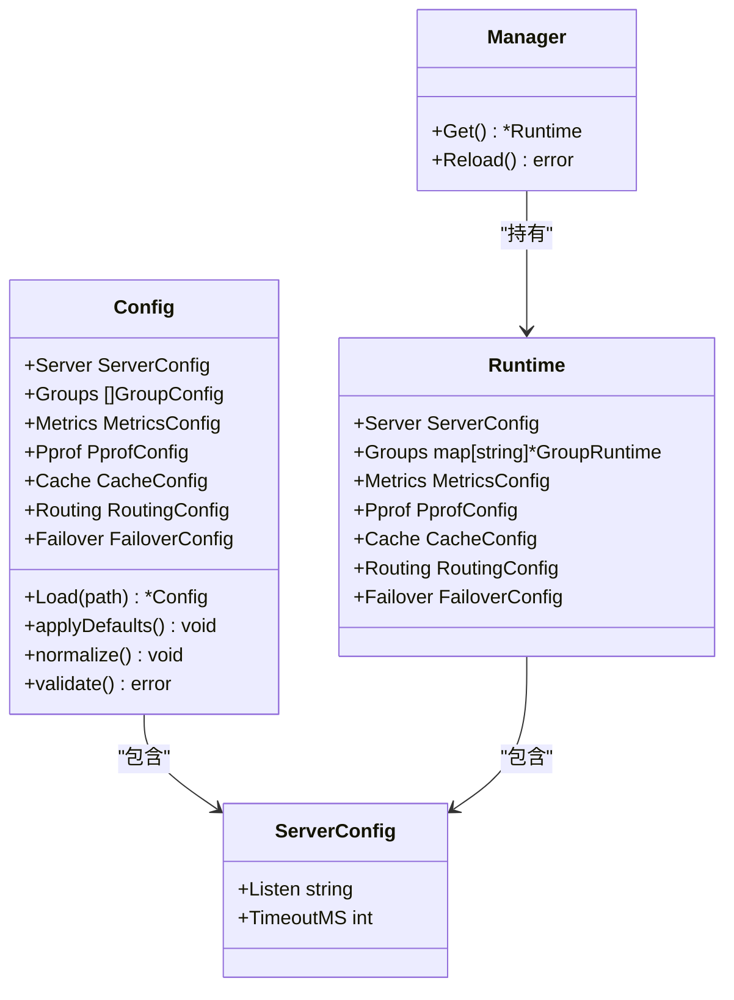

# 服务设置

<cite>
**本文引用的文件列表**
- [config.example.yaml](file://config.example.yaml)
- [config.go](file://internal/config/config.go)
- [serve.go](file://cmd/serve.go)
- [proxy.go](file://internal/proxy/proxy.go)
- [manager.go](file://internal/runtime/manager.go)
- [main.go](file://main.go)
</cite>

## 目录
1. [简介](#简介)
2. [项目结构](#项目结构)
3. [核心组件](#核心组件)
4. [架构总览](#架构总览)
5. [详细组件分析](#详细组件分析)
6. [依赖关系分析](#依赖关系分析)
7. [性能考量](#性能考量)
8. [故障排查指南](#故障排查指南)
9. [结论](#结论)
10. [附录：配置示例与最佳实践](#附录配置示例与最佳实践)

## 简介
本章节聚焦于服务配置中的 server 块，重点解析监听地址 listen 与请求超时 timeout_ms 的默认值、取值范围与验证规则，并结合配置加载流程说明默认值填充与输入验证的实现机制。同时给出不同部署场景下的配置示例，包括绑定特定 IP、适配慢速后端的超时调优，并提供常见问题排查建议。

## 项目结构
- 配置样例位于根目录，包含 server 块的 listen 与 timeout_ms 示例。
- 配置模型与加载逻辑集中在 internal/config/config.go。
- 服务器启动入口在 cmd/serve.go，通过 Fiber 启动监听。
- 实际请求转发与超时控制在 internal/proxy/proxy.go 中，使用 fasthttp 客户端并按 server.timeout_ms 设置上游请求超时。
- 运行时管理器 internal/runtime/manager.go 负责加载配置并构建运行时对象。

图表来源
- [config.example.yaml](file://config.example.yaml#L1-L10)
- [config.go](file://internal/config/config.go#L145-L160)
- [manager.go](file://internal/runtime/manager.go#L28-L67)
- [serve.go](file://cmd/serve.go#L57-L60)
- [proxy.go](file://internal/proxy/proxy.go#L191-L218)

章节来源
- [config.example.yaml](file://config.example.yaml#L1-L10)
- [config.go](file://internal/config/config.go#L145-L160)
- [serve.go](file://cmd/serve.go#L57-L60)
- [proxy.go](file://internal/proxy/proxy.go#L191-L218)
- [manager.go](file://internal/runtime/manager.go#L28-L67)

## 核心组件
- ServerConfig 结构体定义了 server.listen 与 server.timeout_ms 字段，分别对应监听地址与请求超时（毫秒）。
- 配置加载流程：
  - 读取 YAML 文件并反序列化为 Config。
  - 应用默认值（applyDefaults）。
  - 归一化处理（normalize）。
  - 执行验证（validate），其中包含对 server.timeout_ms 的正数校验。
- 服务器启动：
  - 从运行时对象获取 server.listen 并交由 Fiber 监听。
- 请求处理：
  - 在代理转发阶段，将 server.timeout_ms 转换为 time.Duration 传递给 fasthttp.DoTimeout，作为上游请求的超时上限。

章节来源
- [config.go](file://internal/config/config.go#L25-L28)
- [config.go](file://internal/config/config.go#L145-L160)
- [config.go](file://internal/config/config.go#L321-L400)
- [serve.go](file://cmd/serve.go#L57-L60)
- [proxy.go](file://internal/proxy/proxy.go#L191-L218)

## 架构总览
下图展示了从配置到监听再到请求处理的关键链路，以及 server.timeout_ms 在代理层的使用位置。

图表来源
- [main.go](file://main.go#L16-L21)
- [serve.go](file://cmd/serve.go#L18-L60)
- [config.go](file://internal/config/config.go#L145-L160)
- [manager.go](file://internal/runtime/manager.go#L28-L67)
- [proxy.go](file://internal/proxy/proxy.go#L191-L218)

## 详细组件分析

### ServerConfig 结构体与字段语义
- 字段
  - listen: 监听地址字符串，遵循 Go net.Listen 的地址格式约定。
  - timeout_ms: 请求超时（毫秒），用于限制从接收请求到上游响应返回的总时长。
- 关联配置文件
  - config.example.yaml 中 server.listen 与 server.timeout_ms 提供了默认示例值。

章节来源
- [config.go](file://internal/config/config.go#L25-L28)
- [config.example.yaml](file://config.example.yaml#L1-L10)

### 默认值填充与归一化
- 默认值填充（applyDefaults）
  - 若未设置 server.listen，则默认为 ":8080"。
  - 若未设置 server.timeout_ms，则默认为 8000。
- 归一化（normalize）
  - 对路径类字段进行前后空白去除与斜杠规范化，但 server.listen 不在此范围内。
- 作用范围
  - 以上默认值在配置加载早期即被填充，确保后续流程无需额外判断空值。

章节来源
- [config.go](file://internal/config/config.go#L162-L170)
- [config.go](file://internal/config/config.go#L248-L273)

### 输入验证规则（validate）
- server.timeout_ms 必须大于 0，否则返回错误。
- 其他相关验证（与本节主题相关）
  - metrics/pprof/short 等模块的路径必须以 "/" 开头。
  - 缓存与上游健康检查等字段存在正数与格式要求。
- 该规则保证了 server.timeout_ms 的有效性，避免无效或过小的超时导致不可预期的行为。

章节来源
- [config.go](file://internal/config/config.go#L321-L400)
- [config.go](file://internal/config/config.go#L394-L396)

### 监听地址与启动流程
- 启动流程
  - 通过命令行参数指定配置文件路径，默认为 config.yaml。
  - 初始化日志与指标，创建运行时管理器。
  - 从运行时对象获取 server.listen 并交由 Fiber 监听。
- 注意事项
  - listen 的具体格式需满足 Fiber/Go net.Listen 的要求，例如 ":8080"、"127.0.0.1:8080"、"[::]:8080" 等。
  - 若端口已被占用，将出现监听失败；若需要绑定特定 IP，请显式设置 listen。

章节来源
- [serve.go](file://cmd/serve.go#L18-L60)
- [main.go](file://main.go#L16-L21)

### 请求超时与上游转发
- 超时设置
  - 将 server.timeout_ms 转换为 time.Duration 传递给 fasthttp.DoTimeout。
- 行为表现
  - 当上游请求超时时，分类为 "timeout"，最终返回 504 状态码。
  - 其他连接错误分类为 "connect"，返回 502 状态码。
- 适用场景
  - 适用于慢速后端或网络抖动环境，适当提高 timeout_ms 可减少误判为失败的情况。

章节来源
- [proxy.go](file://internal/proxy/proxy.go#L191-L218)
- [proxy.go](file://internal/proxy/proxy.go#L346-L365)

### 类图：配置与运行时交互

图表来源
- [config.go](file://internal/config/config.go#L12-L23)
- [config.go](file://internal/config/config.go#L25-L28)
- [manager.go](file://internal/runtime/manager.go#L69-L75)

## 依赖关系分析
- 配置加载依赖
  - config.go 负责 YAML 解析、默认值填充、归一化与验证。
  - runtime/manager.go 在初始化时调用 config.Load，构建运行时对象。
  - cmd/serve.go 从运行时对象读取 server.listen 并启动 Fiber。
- 请求处理依赖
  - proxy/proxy.go 在转发上游请求时使用 server.timeout_ms 作为超时上限。
- 耦合与内聚
  - server.listen 与 server.timeout_ms 通过 Config/ServerConfig 统一管理，耦合度低，职责清晰。
  - 超时控制在 proxy 层集中体现，便于统一治理。

图表来源
- [config.go](file://internal/config/config.go#L145-L160)
- [manager.go](file://internal/runtime/manager.go#L28-L67)
- [serve.go](file://cmd/serve.go#L57-L60)
- [proxy.go](file://internal/proxy/proxy.go#L191-L218)

## 性能考量
- 超时设置对吞吐与稳定性的影响
  - 过小的 timeout_ms 会频繁触发超时，导致大量 504，影响用户体验与下游健康。
  - 过大的 timeout_ms 会占用连接资源更久，增加排队与延迟。
- 建议
  - 根据上游后端平均响应时间与 P95/P99 延迟，合理设置 timeout_ms。
  - 对慢速后端（如数据库查询、外部 API）适当上调，避免误判失败。
  - 结合重试与故障转移策略，平衡成功率与资源占用。

[本节为通用指导，不直接分析具体文件]

## 故障排查指南
- 端口冲突
  - 现象：启动时报错无法监听端口。
  - 排查：确认 server.listen 的端口是否被占用；更换端口或释放占用进程。
  - 参考：Fiber 监听行为由 server.listen 决定。
- 超时设置过短
  - 现象：频繁出现 504 Gateway Timeout。
  - 排查：检查 server.timeout_ms 是否过小；结合上游实际响应时间调整。
  - 参考：代理层使用 server.timeout_ms 作为上游请求超时上限。
- 配置验证失败
  - 现象：启动时报错，提示 server.timeout_ms 必须大于 0。
  - 排查：修正配置文件中 server.timeout_ms 的值，确保为正整数。
  - 参考：validate 对 server.timeout_ms 的正数校验。
- 监听地址格式错误
  - 现象：启动失败或监听异常。
  - 排查：确保 listen 符合标准地址格式，如 ":8080"、"127.0.0.1:8080" 等。

章节来源
- [serve.go](file://cmd/serve.go#L57-L60)
- [proxy.go](file://internal/proxy/proxy.go#L191-L218)
- [config.go](file://internal/config/config.go#L394-L396)

## 结论
- server.listen 与 server.timeout_ms 是服务启动与请求处理的关键参数。
- 默认值与验证规则确保了配置的可用性与一致性。
- 在不同部署场景下，应根据网络与上游能力合理设置监听地址与超时时间，以获得稳定与高效的运行效果。

[本节为总结性内容，不直接分析具体文件]

## 附录：配置示例与最佳实践
- 绑定特定 IP
  - 在配置文件中设置 server.listen 为 "127.0.0.1:8080" 或 "0.0.0.0:8080"，以限定监听范围。
  - 参考：config.example.yaml 中的示例值。
- 适配慢速后端
  - 将 server.timeout_ms 提升至略高于上游 P99 延迟的时间，减少误判超时。
  - 参考：代理层使用 server.timeout_ms 作为上游请求超时上限。
- 常见配置要点
  - server.listen：支持 IPv4/IPv6 与通配地址，注意端口占用。
  - server.timeout_ms：必须为正整数，建议结合上游性能评估设定。
- 验证与加载
  - 配置加载顺序：读取 -> 反序列化 -> 默认值填充 -> 归一化 -> 验证 -> 构建运行时 -> 启动监听。
  - 参考：config.go 的 Load/applyDefaults/normalize/validate 流程与 serve.go 的启动流程。

章节来源
- [config.example.yaml](file://config.example.yaml#L1-L10)
- [config.go](file://internal/config/config.go#L145-L160)
- [config.go](file://internal/config/config.go#L162-L170)
- [config.go](file://internal/config/config.go#L321-L400)
- [serve.go](file://cmd/serve.go#L57-L60)
- [proxy.go](file://internal/proxy/proxy.go#L191-L218)