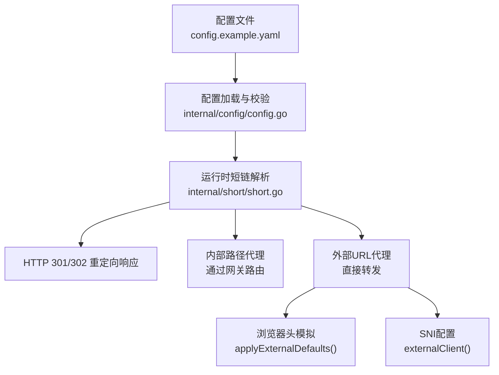
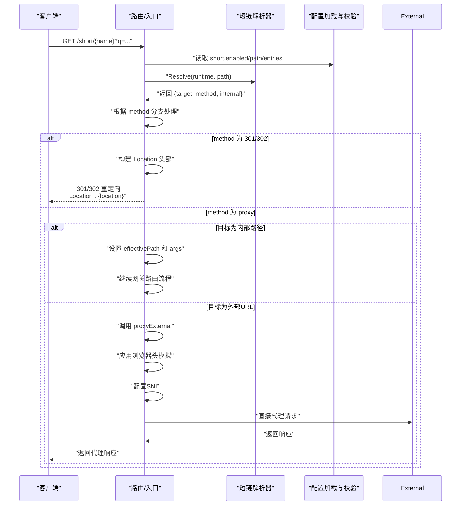
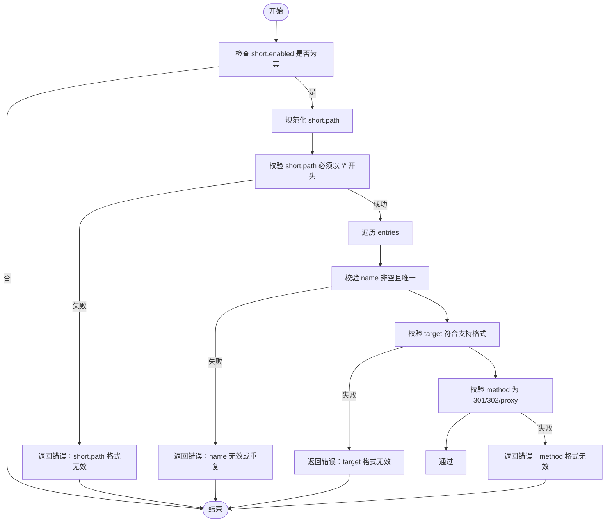
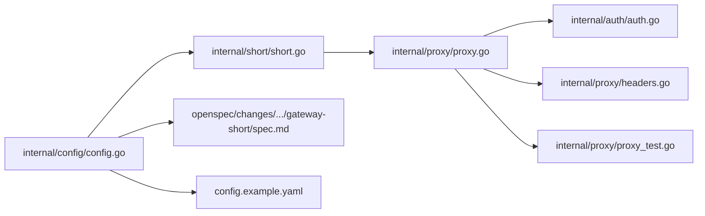

# 短链接服务

<cite>
**本文引用的文件**
- [internal/config/config.go](file://internal/config/config.go)
- [internal/short/short.go](file://internal/short/short.go)
- [internal/proxy/proxy.go](file://internal/proxy/proxy.go)
- [config.example.yaml](file://config.example.yaml)
- [openspec/changes/add-short-methods/specs/gateway-short/spec.md](file://openspec/changes/add-short-methods/specs/gateway-short/spec.md)
- [openspec/changes/add-short-methods/proposal.md](file://openspec/changes/add-short-methods/proposal.md)
- [internal/proxy/proxy_test.go](file://internal/proxy/proxy_test.go)
</cite>

## 更新摘要
**已做更改**
- 更新了短链接服务文档，以支持新的 `method` 配置选项（301、302、proxy）
- 详细说明了不同方法在内部/外部目标、查询参数处理和鉴权行为上的差异
- 新增了关于 `method` 配置项的语义、默认值和校验规则的说明
- 更新了配置示例以展示三种方法的使用场景
- 修改了架构流程图以反映新的处理逻辑
- **新增了外部短链接代理功能的浏览器头模拟和SNI配置支持的详细说明**

## 目录
1. [简介](#简介)
2. [项目结构](#项目结构)
3. [核心组件](#核心组件)
4. [架构总览](#架构总览)
5. [详细组件分析](#详细组件分析)
6. [依赖关系分析](#依赖关系分析)
7. [性能考量](#性能考量)
8. [故障排查指南](#故障排查指南)
9. [结论](#结论)
10. [附录](#附录)

## 简介
本文系统性讲解短链接服务的配置与行为，重点围绕配置文件中的 short 块，解析 enabled、path 和 entries 三个关键字段的语义与约束。结合 internal/config/config.go 中的 ShortConfig 与 ShortEntry 结构体，阐明短链前缀路径的规范化规则、重定向条目名称的唯一性约束，以及目标 URL 的支持范围与查询参数透传机制。文档还提供订阅简化与营销推广等典型使用场景的配置思路，并通过代码路径标注展示配置验证中对目标 URL 的有效性校验逻辑。特别更新了对新引入的 method 配置选项（301、302、proxy）的详细说明，包括其在内部/外部目标、查询参数处理和鉴权行为上的差异。**重点新增了外部短链接代理功能中浏览器头模拟和SNI配置的支持机制，以提高与外部服务的兼容性。**

## 项目结构
短链接功能涉及配置加载与校验、运行时解析与处理三个主要模块：
- 配置层：定义 short 块结构、默认值填充、路径规范化、配置校验（含目标 URL 和 method 校验）
- 运行时层：根据请求路径匹配短链前缀、提取条目名、根据 method 类型执行重定向或代理
- 代理层：处理 proxy 方法的外部请求转发，**新增浏览器头模拟和SNI配置支持**

图表来源
- [config.example.yaml](file://config.example.yaml#L112-L132)
- [internal/config/config.go](file://internal/config/config.go#L145-L160)
- [internal/config/config.go](file://internal/config/config.go#L248-L273)
- [internal/config/config.go](file://internal/config/config.go#L373-L390)
- [internal/config/config.go](file://internal/config/config.go#L466-L476)
- [internal/short/short.go](file://internal/short/short.go#L19-L35)
- [internal/proxy/proxy.go](file://internal/proxy/proxy.go#L68-L97)
- [internal/proxy/proxy.go](file://internal/proxy/proxy.go#L491-L511)
- [internal/proxy/proxy.go](file://internal/proxy/proxy.go#L469-L489)

章节来源
- [config.example.yaml](file://config.example.yaml#L112-L132)
- [internal/config/config.go](file://internal/config/config.go#L145-L160)
- [internal/config/config.go](file://internal/config/config.go#L248-L273)
- [internal/config/config.go](file://internal/config/config.go#L373-L390)
- [internal/config/config.go](file://internal/config/config.go#L466-L476)
- [internal/short/short.go](file://internal/short/short.go#L19-L35)
- [internal/proxy/proxy.go](file://internal/proxy/proxy.go#L68-L97)
- [internal/proxy/proxy.go](file://internal/proxy/proxy.go#L491-L511)
- [internal/proxy/proxy.go](file://internal/proxy/proxy.go#L469-L489)

## 核心组件
- ShortConfig：short 块的配置对象，包含 enabled、path、entries 字段
- ShortEntry：单个短链条目，包含 name、target 和 method
- 运行时 Runtime：封装 enabled、path、targets 映射，供路由层调用
- 解析器 Resolve：负责路径匹配、条目名提取、返回目标信息
- 代理处理器：根据 method 执行 301/302 重定向或 proxy 代理，**包含浏览器头模拟和SNI配置功能**

章节来源
- [internal/config/config.go](file://internal/config/config.go#L77-L86)
- [internal/short/short.go](file://internal/short/short.go#L5-L17)
- [internal/proxy/proxy.go](file://internal/proxy/proxy.go#L68-L97)
- [internal/proxy/proxy.go](file://internal/proxy/proxy.go#L491-L511)
- [internal/proxy/proxy.go](file://internal/proxy/proxy.go#L469-L489)

## 架构总览
短链接服务在配置阶段完成路径规范化与条目校验，在运行时根据请求路径进行匹配与处理。其关键流程如下：

图表来源
- [internal/short/short.go](file://internal/short/short.go#L19-L35)
- [internal/config/config.go](file://internal/config/config.go#L248-L273)
- [internal/config/config.go](file://internal/config/config.go#L373-L390)
- [internal/proxy/proxy.go](file://internal/proxy/proxy.go#L68-L97)
- [internal/proxy/proxy.go](file://internal/proxy/proxy.go#L491-L511)
- [internal/proxy/proxy.go](file://internal/proxy/proxy.go#L469-L489)

## 详细组件分析

### 配置模型与字段语义
- ShortConfig.enabled：启用/禁用短链功能
- ShortConfig.path：短链前缀路径，默认值在配置加载时填充
- ShortConfig.entries：短链条目列表，每个条目包含 name、target 和 method
- ShortEntry.method：重定向方法，可选值为 "301"、"302" 或 "proxy"，默认为 "301"

章节来源
- [internal/config/config.go](file://internal/config/config.go#L77-L86)
- [internal/config/config.go](file://internal/config/config.go#L175-L177)
- [internal/config/config.go](file://internal/config/config.go#L261-L264)

### 路径前缀规范化规则
- normalizePathPrefix：确保路径以单斜杠开头且末尾无多余斜杠（根路径“/”除外）
- normalizePaths：对数组路径去重并规范化
- normalizePrefixes：对允许/拒绝前缀进行同样处理
- ShortConfig.path 在 normalize() 中被规范化，保证短链前缀路径合法

章节来源
- [internal/config/config.go](file://internal/config/config.go#L248-L273)
- [internal/config/config.go](file://internal/config/config.go#L275-L287)
- [internal/config/config.go](file://internal/config/config.go#L289-L302)
- [internal/config/config.go](file://internal/config/config.go#L304-L319)

### 条目名称唯一性约束
- 当 short.enabled 为真时，validate() 会对 entries 进行校验：
  - 名称非空
  - 名称全局唯一
  - 目标 URL 符合支持格式（见下节）
  - method 字段必须为 "301"、"302" 或 "proxy" 之一

章节来源
- [internal/config/config.go](file://internal/config/config.go#L373-L390)
- [internal/config/config.go](file://internal/config/config.go#L394-L396)

### 目标 URL 支持格式与校验逻辑
- 支持的目标格式：
  - 外部 HTTPS 链接（以 https:// 开头）
  - 内部 RSSHub 路由：以 /rsshub 开头的路径
  - 内部 Upvote 路由：以 /upvote 开头的路径
- isShortTarget() 实现了上述格式判断
- 配置校验阶段通过 isShortTarget() 对每个条目的 target 进行有效性检查

章节来源
- [internal/config/config.go](file://internal/config/config.go#L466-L476)
- [internal/config/config.go](file://internal/config/config.go#L373-L390)

### 方法配置与行为差异
- method 字段定义了短链接的处理方式：
  - **301/302 重定向**：返回 HTTP 301 或 302 响应，Location 头部指向目标 URL
  - **proxy 代理**：将请求代理到目标路径或 URL，不进行重定向
- 不同 method 在内部/外部目标、查询参数处理和鉴权行为上存在差异：

| 行为 | 301/302 内部 | 301/302 外部 | proxy 内部 | proxy 外部 |
|------|-------------|-------------|-----------|-----------|
| 查询参数透传 | 完整保留 key/code | 移除 key/code | 完整保留 key/code | 移除 key/code |
| 网关鉴权 | 不强制 | 不强制 | 强制验证 | 不强制 |
| 处理方式 | 返回重定向响应 | 返回重定向响应 | 继续网关路由 | 直接代理转发 |

章节来源
- [openspec/changes/add-short-methods/specs/gateway-short/spec.md](file://openspec/changes/add-short-methods/specs/gateway-short/spec.md#L5-L39)
- [internal/proxy/proxy.go](file://internal/proxy/proxy.go#L68-L97)
- [internal/auth/auth.go](file://internal/auth/auth.go#L30-L42)

### 查询参数透传机制
- 运行时 Resolve() 在命中条目后，根据 method 和目标类型决定查询参数处理：
  - 对于 301/302 重定向到外部目标，使用 RewriteUpstreamQuery 移除 key/code
  - 对于 proxy 代理到外部目标，同样移除 key/code
  - 内部目标的查询参数保持不变
- AppendQuery() 函数负责将原始查询字符串追加到目标 URL：
  - 若目标已包含“?”，则以“&”连接
  - 否则以“?”连接

章节来源
- [internal/short/short.go](file://internal/short/short.go#L66-L75)
- [internal/proxy/proxy.go](file://internal/proxy/proxy.go#L74-L78)
- [internal/auth/auth.go](file://internal/auth/auth.go#L30-L42)
- [internal/proxy/proxy_test.go](file://internal/proxy/proxy_test.go#L748-L760)
- [internal/proxy/proxy_test.go](file://internal/proxy/proxy_test.go#L824-L836)

### 路径匹配与条目名提取
- matchesPath：判断请求路径是否匹配短链前缀（支持“/prefix/xxx”形式）
- extractName：从“/prefix/name”中提取 name，要求 name 不为空且不含“/”
- Resolve：组合上述逻辑，返回目标 URL、method 和 internal 标志

章节来源
- [internal/short/short.go](file://internal/short/short.go#L37-L65)
- [internal/short/short.go](file://internal/short/short.go#L19-L35)

### 使用场景与配置示例
- 订阅简化：为常用 RSSHub 路由创建短链，便于分享与记忆
- 营销推广：为外部站点提供稳定的 feed 入口，便于追踪与管理
- 示例参考：配置文件中提供了内部与外部目标的示例条目，展示了三种 method 的使用

章节来源
- [config.example.yaml](file://config.example.yaml#L112-L132)

### 外部代理的浏览器头模拟与SNI配置
**新增功能说明**：为了提高与外部服务的兼容性，短链接服务在代理外部URL时，会自动模拟浏览器请求头并配置SNI（Server Name Indication）。

- **浏览器头模拟 (applyExternalDefaults)**：
  - 自动设置 User-Agent 为现代浏览器标识
  - 添加 Accept、Accept-Encoding、Accept-Language 等标准请求头
  - 设置 Sec-CH-UA 等浏览器特征头，模拟真实浏览器环境
  - 代码实现位于 `internal/proxy/proxy.go` 的 `applyExternalDefaults()` 函数

- **SNI配置 (externalClient)**：
  - 当代理HTTPS请求时，自动从目标URL中提取主机名作为SNI
  - 在TLS配置中设置 ServerName，确保与目标服务器的SNI要求匹配
  - 代码实现位于 `internal/proxy/proxy.go` 的 `externalClient()` 方法中

章节来源
- [internal/proxy/proxy.go](file://internal/proxy/proxy.go#L491-L511)
- [internal/proxy/proxy.go](file://internal/proxy/proxy.go#L469-L489)
- [internal/proxy/proxy_test.go](file://internal/proxy/proxy_test.go#L1018-L1142)

### 配置验证流程图

图表来源
- [internal/config/config.go](file://internal/config/config.go#L373-L390)
- [internal/config/config.go](file://internal/config/config.go#L466-L476)
- [internal/config/config.go](file://internal/config/config.go#L484-L491)

## 依赖关系分析
- 配置层依赖：
  - YAML 解析与默认值填充
  - 路径规范化工具函数
  - 目标 URL 校验函数 isShortTarget()
  - 方法校验函数 isShortMethod()
- 运行时层依赖：
  - 短链解析器 Resolve() 依赖 Runtime（包含 enabled、path、targets）
  - 路径匹配与条目名提取辅助函数
  - 代理处理器依赖 proxyExternal 和 RewriteUpstreamQuery
- 代理层依赖：
  - 外部代理依赖 forwardExternal 和 buildExternalURL
  - 鉴权处理依赖 RewriteUpstreamQuery
  - **新增浏览器头模拟依赖 applyExternalDefaults**
  - **新增SNI配置依赖 externalClient**

图表来源
- [internal/config/config.go](file://internal/config/config.go#L145-L160)
- [internal/config/config.go](file://internal/config/config.go#L248-L273)
- [internal/config/config.go](file://internal/config/config.go#L373-L390)
- [internal/config/config.go](file://internal/config/config.go#L466-L476)
- [internal/short/short.go](file://internal/short/short.go#L19-L35)
- [openspec/changes/add-short-methods/specs/gateway-short/spec.md](file://openspec/changes/add-short-methods/specs/gateway-short/spec.md#L31-L43)
- [config.example.yaml](file://config.example.yaml#L112-L132)
- [internal/proxy/proxy.go](file://internal/proxy/proxy.go#L68-L97)
- [internal/auth/auth.go](file://internal/auth/auth.go#L30-L42)
- [internal/proxy/headers.go](file://internal/proxy/headers.go#L5-L20)
- [internal/proxy/proxy_test.go](file://internal/proxy/proxy_test.go#L748-L760)

章节来源
- [internal/config/config.go](file://internal/config/config.go#L145-L160)
- [internal/config/config.go](file://internal/config/config.go#L248-L273)
- [internal/config/config.go](file://internal/config/config.go#L373-L390)
- [internal/config/config.go](file://internal/config/config.go#L466-L476)
- [internal/short/short.go](file://internal/short/short.go#L19-L35)
- [openspec/changes/add-short-methods/specs/gateway-short/spec.md](file://openspec/changes/add-short-methods/specs/gateway-short/spec.md#L31-L43)
- [config.example.yaml](file://config.example.yaml#L112-L132)
- [internal/proxy/proxy.go](file://internal/proxy/proxy.go#L68-L97)
- [internal/auth/auth.go](file://internal/auth/auth.go#L30-L42)
- [internal/proxy/headers.go](file://internal/proxy/headers.go#L5-L20)
- [internal/proxy/proxy_test.go](file://internal/proxy/proxy_test.go#L748-L760)

## 性能考量
- 短链解析为 O(1) 匹配与常数时间查询拼接，开销极低
- entries 数量有限，哈希映射查找成本可忽略
- 建议控制 entries 数量与命名长度，避免过长路径导致额外内存占用
- proxy 方法的外部代理性能取决于目标服务器响应时间
- **浏览器头模拟和SNI配置对性能影响极小，仅在代理外部URL时执行一次**

## 故障排查指南
- 配置错误
  - short.path 不以“/”开头：配置校验会报错
  - entries 中 name 为空或重复：配置校验会报错
  - target 不符合支持格式（非 https:// 且非 /rsshub/ 或 /upvote/ 开头）：配置校验会报错
  - method 不是 301、302 或 proxy：配置校验会报错
- 运行时错误
  - 请求未命中任何条目：返回未匹配状态，不会产生重定向
  - 请求路径不匹配前缀：返回未匹配状态，不会产生重定向
- 行为验证
  - 内部与外部目标均可透传查询参数，测试用例覆盖了该行为
  - 301/302 重定向会正确处理 Location 头部
  - proxy 方法会正确代理请求并处理鉴权
  - **外部代理时，可通过抓包验证浏览器头和SNI是否正确设置**

章节来源
- [internal/config/config.go](file://internal/config/config.go#L373-L390)
- [internal/config/config.go](file://internal/config/config.go#L466-L476)
- [internal/short/short.go](file://internal/short/short.go#L19-L35)
- [internal/proxy/proxy.go](file://internal/proxy/proxy.go#L68-L97)
- [internal/proxy/proxy_test.go](file://internal/proxy/proxy_test.go#L748-L760)
- [internal/proxy/proxy_test.go](file://internal/proxy/proxy_test.go#L824-L836)

## 结论
短链接服务通过简洁的配置模型实现了稳定高效的重定向与代理能力：统一的前缀路径规范、严格的条目名称唯一性与目标 URL 校验、以及透明的查询参数透传，既满足订阅简化与营销推广等场景需求，又保持了良好的可维护性与安全性。新增的 method 配置选项（301、302、proxy）提供了更灵活的处理方式，能够适应不同场景下的需求，包括永久重定向、临时重定向和直接代理。**特别地，新增的浏览器头模拟和SNI配置功能显著提高了与外部服务的兼容性，使代理请求更接近真实浏览器行为，减少了被目标服务器拒绝的风险。**

## 附录

### 配置要点速查
- enabled：启用短链功能
- path：短链前缀路径（必须以“/”开头）
- entries：条目列表，每项包含 name、target 和 method
  - name：非空且全局唯一
  - target：支持 /rsshub/...、/upvote/... 或 https://... 格式
  - method：可选 301、302 或 proxy，默认为 301

章节来源
- [internal/config/config.go](file://internal/config/config.go#L77-L86)
- [internal/config/config.go](file://internal/config/config.go#L373-L390)
- [internal/config/config.go](file://internal/config/config.go#L466-L476)
- [config.example.yaml](file://config.example.yaml#L112-L132)

### 规范与影响说明
- 短链需求与行为在开放规范中有明确描述，包括 301/302 重定向、proxy 代理、查询透传、配置校验等
- 提案明确了实现范围与影响面，涵盖配置、路由/处理器、文档与测试

章节来源
- [openspec/changes/add-short-methods/specs/gateway-short/spec.md](file://openspec/changes/add-short-methods/specs/gateway-short/spec.md#L1-L65)
- [openspec/changes/add-short-methods/proposal.md](file://openspec/changes/add-short-methods/proposal.md#L1-L13)