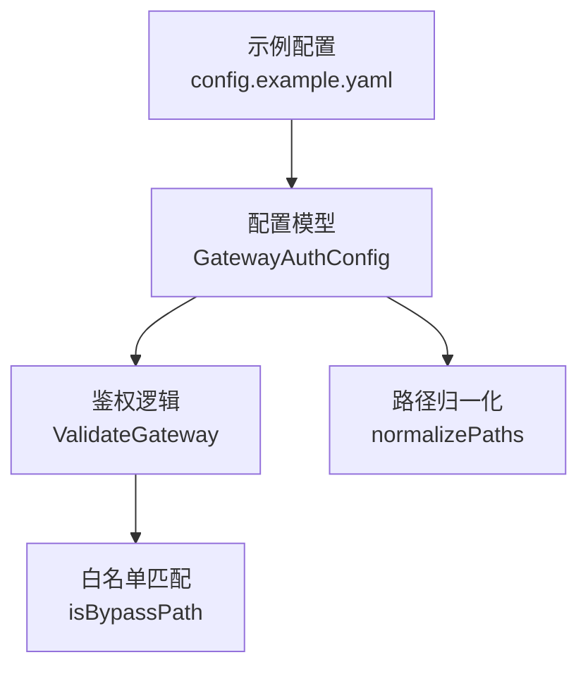
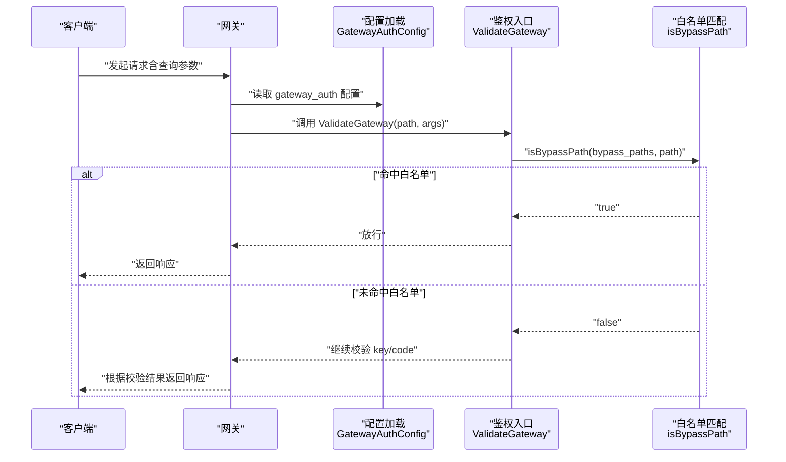
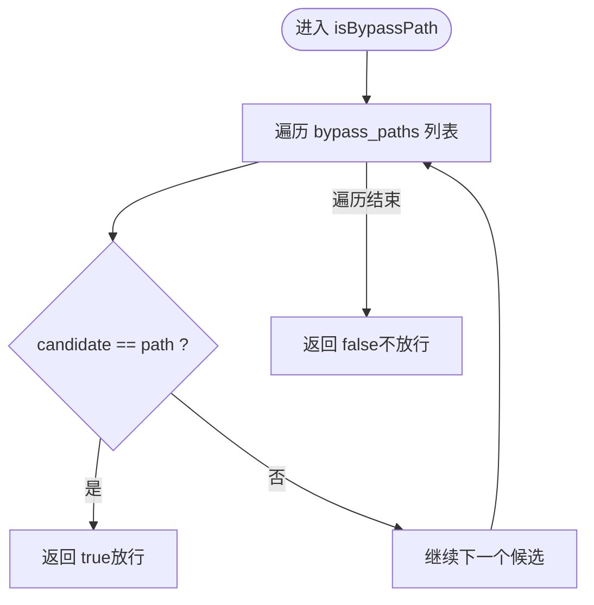
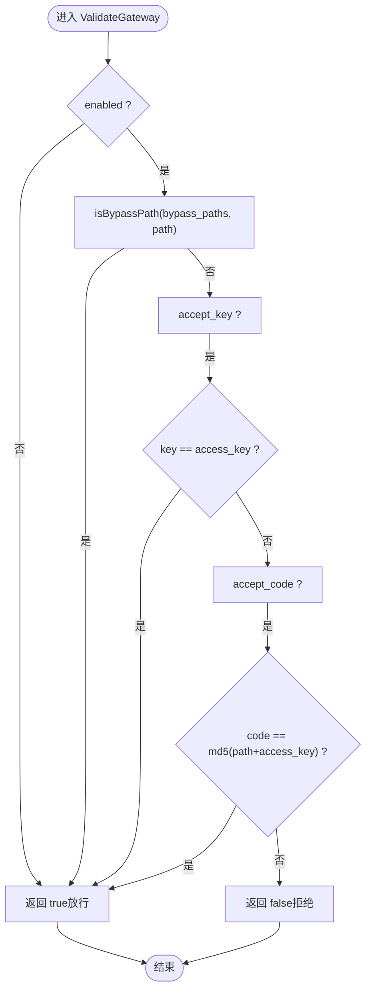
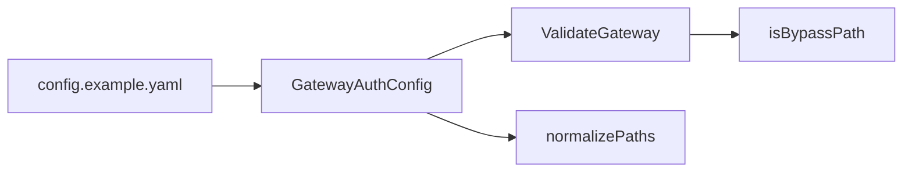

# 白名单路径配置

<cite>
**本文引用的文件**
- [internal/auth/auth.go](file://internal/auth/auth.go)
- [internal/auth/auth_test.go](file://internal/auth/auth_test.go)
- [internal/config/config.go](file://internal/config/config.go)
- [config.example.yaml](file://config.example.yaml)
</cite>

## 目录
1. [简介](#简介)
2. [项目结构](#项目结构)
3. [核心组件](#核心组件)
4. [架构概览](#架构概览)
5. [详细组件分析](#详细组件分析)
6. [依赖分析](#依赖分析)
7. [性能考虑](#性能考虑)
8. [故障排查指南](#故障排查指南)
9. [结论](#结论)
10. [附录](#附录)

## 简介
本文件围绕 gateway_auth.bypass_paths 配置项进行系统性解析，重点说明其如何通过“精确路径匹配”实现特定 URL 的鉴权绕过。文档以源码为依据，结合 isBypassPath 函数的实现，解释白名单路径的匹配行为、配置方式与典型用例，并强调安全风险与最佳实践。

## 项目结构
与本主题直接相关的代码分布在以下模块：
- 配置模型：定义 gateway_auth.enabled、access_key、accept_key、accept_code、bypass_paths 等字段
- 鉴权逻辑：在 ValidateGateway 中调用 isBypassPath 实现白名单放行
- 配置归一化：normalizePaths 对白名单路径进行去重、标准化处理
- 示例配置：config.example.yaml 展示了典型的白名单路径清单

图表来源
- [internal/config/config.go](file://internal/config/config.go#L30-L36)
- [internal/auth/auth.go](file://internal/auth/auth.go#L11-L17)
- [internal/auth/auth.go](file://internal/auth/auth.go#L50-L56)
- [internal/config/config.go](file://internal/config/config.go#L304-L319)
- [config.example.yaml](file://config.example.yaml#L13-L33)

章节来源
- [internal/config/config.go](file://internal/config/config.go#L30-L36)
- [internal/auth/auth.go](file://internal/auth/auth.go#L11-L17)
- [internal/auth/auth.go](file://internal/auth/auth.go#L50-L56)
- [internal/config/config.go](file://internal/config/config.go#L304-L319)
- [config.example.yaml](file://config.example.yaml#L13-L33)

## 核心组件
- 配置模型 GatewayAuthConfig
  - 字段 enabled、access_key、accept_key、accept_code、bypass_paths
  - 归一化 normalizePaths 在加载配置时对白名单路径进行去重与标准化
- 鉴权入口 ValidateGateway
  - 当启用鉴权且路径命中白名单时直接放行
  - 否则按 key/code 规则校验
- 白名单匹配 isBypassPath
  - 精确字符串相等匹配，不支持前缀匹配
- 示例配置 config.example.yaml
  - 提供了 /favicon.ico、/robots.txt、/logo.png、/manifest.json 等典型公开路径作为白名单

章节来源
- [internal/config/config.go](file://internal/config/config.go#L30-L36)
- [internal/config/config.go](file://internal/config/config.go#L304-L319)
- [internal/auth/auth.go](file://internal/auth/auth.go#L11-L17)
- [internal/auth/auth.go](file://internal/auth/auth.go#L50-L56)
- [config.example.yaml](file://config.example.yaml#L13-L33)

## 架构概览
下图展示了从配置到鉴权放行的关键流程：

图表来源
- [internal/auth/auth.go](file://internal/auth/auth.go#L11-L17)
- [internal/auth/auth.go](file://internal/auth/auth.go#L50-L56)
- [internal/config/config.go](file://internal/config/config.go#L30-L36)

## 详细组件分析

### 白名单路径配置与归一化
- 配置项位置与含义
  - gateway_auth.bypass_paths 是一个字符串数组，用于声明无需鉴权即可访问的精确路径
- 归一化规则
  - normalizePaths 会去除空白、确保以斜杠开头、去重、并移除末尾斜杠（根路径保留）
  - 这些规则保证白名单路径格式一致，避免因路径差异导致误判
- 示例配置
  - config.example.yaml 中列举了 /favicon.ico、/robots.txt、/logo.png、/manifest.json 等路径作为白名单

章节来源
- [internal/config/config.go](file://internal/config/config.go#L304-L319)
- [config.example.yaml](file://config.example.yaml#L13-L33)

### isBypassPath 匹配机制
- 匹配算法
  - 遍历白名单路径列表，执行字符串完全相等比较
  - 一旦发现相等即返回 true，否则返回 false
- 关键特性
  - 精确匹配：/robots.txt 与 /robots.txt/ 不同
  - 不支持前缀匹配：/robots.txt 不会匹配 /robots.txt/sitemap.xml
  - 大小写敏感：/robots.txt 与 /Robots.txt 不同
  - 查询参数不影响匹配：仅比较路径部分

图表来源
- [internal/auth/auth.go](file://internal/auth/auth.go#L50-L56)

章节来源
- [internal/auth/auth.go](file://internal/auth/auth.go#L50-L56)

### ValidateGateway 鉴权流程
- 流程要点
  - 若 gateway_auth.enabled 为 false，直接放行
  - 否则先判断是否命中白名单，命中则放行
  - 否则按 accept_key/accept_code 规则校验
- 与白名单的关系
  - 白名单位于关键路径判断之前，确保精确路径无需鉴权

图表来源
- [internal/auth/auth.go](file://internal/auth/auth.go#L11-L27)
- [internal/auth/auth.go](file://internal/auth/auth.go#L50-L56)

章节来源
- [internal/auth/auth.go](file://internal/auth/auth.go#L11-L27)
- [internal/auth/auth.go](file://internal/auth/auth.go#L50-L56)

### 配置示例与典型用例
- 典型公开路径
  - /robots.txt：搜索引擎爬虫访问站点规则
  - /favicon.ico：浏览器自动请求网站图标
  - /logo.png、/manifest.json：前端静态资源
- 使用建议
  - 仅将无敏感信息的公开路径加入白名单
  - 避免使用前缀通配，防止意外暴露内部路径
  - 如需监控或调试端点，建议采用独立鉴权或专用路径，而非白名单

章节来源
- [config.example.yaml](file://config.example.yaml#L13-L33)

### 安全风险与最佳实践
- 风险点
  - 精确匹配意味着 /robots.txt 与 /robots.txt/sitemap.xml 不同，但若误将 /robots.txt 加入白名单，可能被错误理解为允许所有子路径
  - 不支持前缀匹配，因此不要期望 /robots.txt 能放行 /robots.txt/sitemap.xml
  - 白名单路径过多会扩大攻击面，应最小化
- 最佳实践
  - 仅对明确的公开资源启用白名单
  - 使用归一化后的路径，避免重复与歧义
  - 结合其他安全措施（如上游鉴权、网络隔离）共同保障

章节来源
- [internal/config/config.go](file://internal/config/config.go#L304-L319)
- [internal/auth/auth.go](file://internal/auth/auth.go#L50-L56)

## 依赖分析
- 组件耦合
  - ValidateGateway 依赖 GatewayAuthConfig（enabled、bypass_paths、access_key、accept_key、accept_code）
  - isBypassPath 仅依赖白名单列表与当前路径
  - normalizePaths 在配置加载阶段对白名单进行预处理，降低运行时开销
- 外部依赖
  - fasthttp.Args 用于读取查询参数（key/code）

图表来源
- [internal/config/config.go](file://internal/config/config.go#L30-L36)
- [internal/auth/auth.go](file://internal/auth/auth.go#L11-L17)
- [internal/auth/auth.go](file://internal/auth/auth.go#L50-L56)
- [internal/config/config.go](file://internal/config/config.go#L304-L319)
- [config.example.yaml](file://config.example.yaml#L13-L33)

章节来源
- [internal/config/config.go](file://internal/config/config.go#L30-L36)
- [internal/auth/auth.go](file://internal/auth/auth.go#L11-L17)
- [internal/auth/auth.go](file://internal/auth/auth.go#L50-L56)
- [internal/config/config.go](file://internal/config/config.go#L304-L319)
- [config.example.yaml](file://config.example.yaml#L13-L33)

## 性能考虑
- 匹配复杂度
  - isBypassPath 为线性扫描，时间复杂度 O(n)，n 为白名单数量
  - 在白名单规模较小的情况下，性能开销可忽略
- 优化建议
  - 控制白名单数量，避免冗余路径
  - 将最常命中的路径置于列表前部（Go 语言中 for-range 顺序稳定，但不保证编译器会做额外优化）
  - 如白名单规模增长，可考虑引入更高效的查找结构（例如哈希集合），但当前实现已足够简洁高效

章节来源
- [internal/auth/auth.go](file://internal/auth/auth.go#L50-L56)

## 故障排查指南
- 常见问题
  - 白名单未生效
    - 检查 gateway_auth.enabled 是否开启
    - 确认路径是否与白名单完全一致（大小写、斜杠）
    - 确认路径是否经过 normalizePaths 归一化（以斜杠开头、去重）
  - 前缀匹配无效
    - isBypassPath 不支持前缀匹配，请使用精确路径
  - 仍需鉴权
    - 若未命中白名单，确认是否提供了正确的 key 或 code
- 测试参考
  - 单元测试验证了白名单路径放行与非白名单路径拒绝的行为

章节来源
- [internal/auth/auth_test.go](file://internal/auth/auth_test.go#L31-L45)
- [internal/config/config.go](file://internal/config/config.go#L304-L319)
- [internal/auth/auth.go](file://internal/auth/auth.go#L50-L56)

## 结论
gateway_auth.bypass_paths 通过 isBypassPath 的精确路径匹配实现了对特定公开 URL 的鉴权绕过。配置上，应遵循“最小化、精确化”的原则，仅对无敏感信息的公开路径启用白名单，并避免使用前缀通配导致意外暴露。配合配置归一化与单元测试，可有效提升系统的安全性与可维护性。

## 附录
- 配置字段说明（节选）
  - enabled：是否启用网关鉴权
  - access_key：全局访问密钥
  - accept_key：是否接受 ?key= 方式
  - accept_code：是否接受 ?code=md5(path+key)
  - bypass_paths：无需鉴权的精确路径列表

章节来源
- [internal/config/config.go](file://internal/config/config.go#L30-L36)
- [config.example.yaml](file://config.example.yaml#L13-L33)