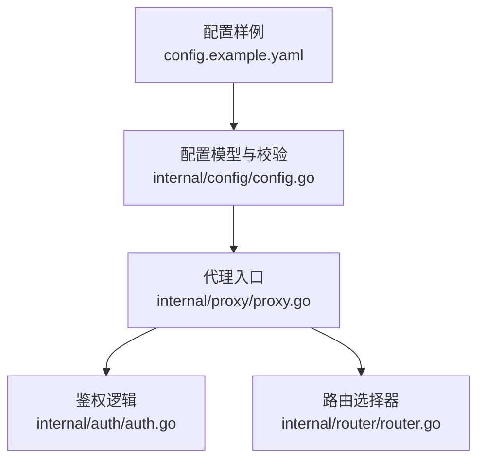
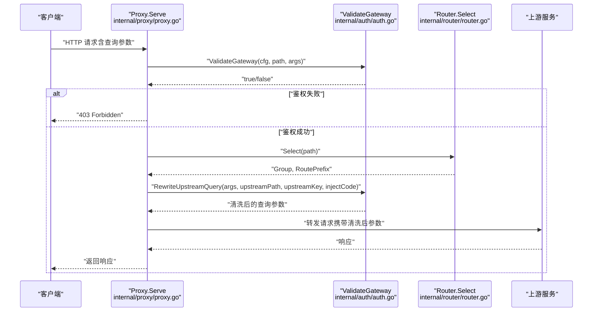
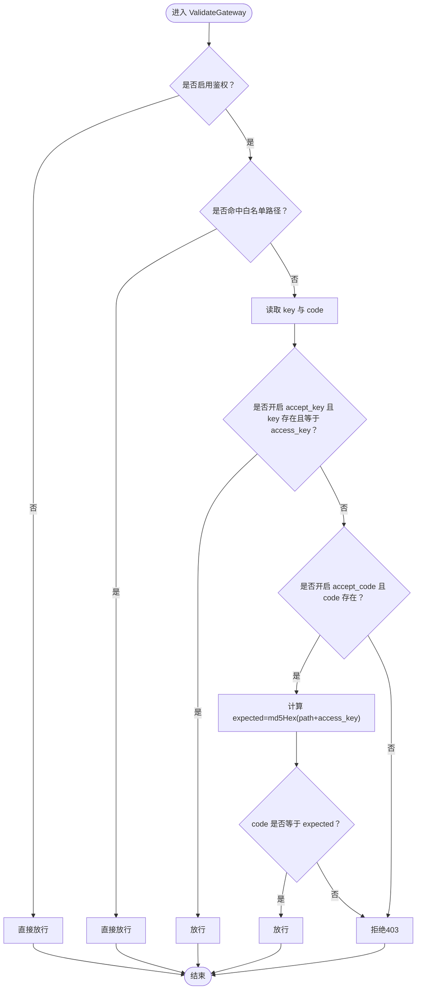
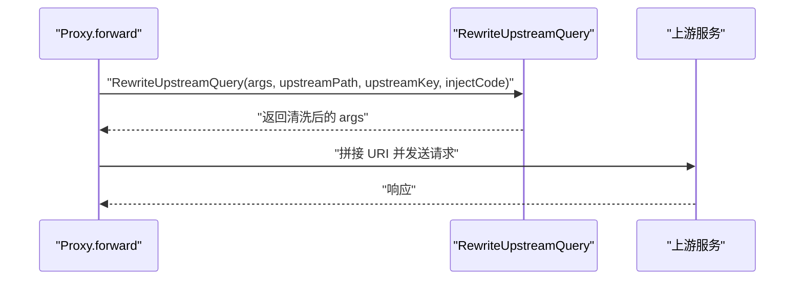
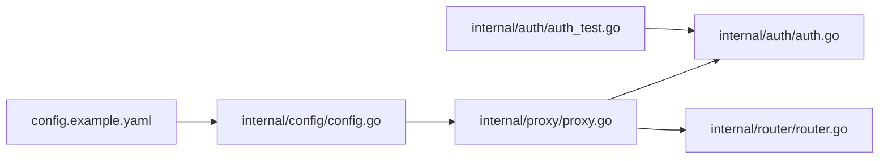

# 网关鉴权

<cite>
**本文引用的文件**
- [config.example.yaml](file://config.example.yaml)
- [config.go](file://internal/config/config.go)
- [auth.go](file://internal/auth/auth.go)
- [proxy.go](file://internal/proxy/proxy.go)
- [router.go](file://internal/router/router.go)
- [auth_test.go](file://internal/auth/auth_test.go)
</cite>

## 目录
1. [简介](#简介)
2. [项目结构](#项目结构)
3. [核心组件](#核心组件)
4. [架构总览](#架构总览)
5. [详细组件分析](#详细组件分析)
6. [依赖关系分析](#依赖关系分析)
7. [性能考量](#性能考量)
8. [故障排查指南](#故障排查指南)
9. [结论](#结论)
10. [附录](#附录)

## 简介
本章节聚焦于网关鉴权配置与实现，围绕配置文件中的 gateway_auth 块展开，系统性解析以下配置项：
- enabled：是否启用网关鉴权
- access_key：全局访问密钥
- accept_key：是否接受 ?key= 的密钥参数
- accept_code：是否接受 ?code= 的签名参数
- bypass_paths：白名单路径列表（无需鉴权）

同时结合 internal/config/config.go 中的 GatewayAuthConfig 结构体，解释密钥验证（key）与签名验证（code）两种模式的工作原理、安全考量与边界条件，并给出白名单路径的匹配规则与典型使用场景（如静态资源免鉴权）。最后提供安全配置最佳实践与常见漏洞防范建议，并通过代码示例路径展示验证逻辑的实现细节。

## 项目结构
网关鉴权相关的核心文件分布如下：
- 配置样例：config.example.yaml
- 配置模型与校验：internal/config/config.go
- 鉴权逻辑：internal/auth/auth.go
- 路由与代理入口：internal/proxy/proxy.go
- 路由选择器：internal/router/router.go
- 鉴权单元测试：internal/auth/auth_test.go

图表来源
- [config.example.yaml](file://config.example.yaml#L11-L33)
- [config.go](file://internal/config/config.go#L12-L36)
- [auth.go](file://internal/auth/auth.go#L11-L28)
- [proxy.go](file://internal/proxy/proxy.go#L42-L77)
- [router.go](file://internal/router/router.go#L29-L56)

章节来源
- [config.example.yaml](file://config.example.yaml#L11-L33)
- [config.go](file://internal/config/config.go#L12-L36)
- [auth.go](file://internal/auth/auth.go#L11-L28)
- [proxy.go](file://internal/proxy/proxy.go#L42-L77)
- [router.go](file://internal/router/router.go#L29-L56)

## 核心组件
- GatewayAuthConfig 结构体：定义网关鉴权的全部配置字段，包括启用开关、全局密钥、两种验证模式开关以及白名单路径数组。
- ValidateGateway 函数：在请求进入代理链路前执行鉴权，支持白名单放行、密钥验证与签名验证。
- RewriteUpstreamQuery 函数：在向上游转发时移除客户端的 key/code 参数，并按需注入基于上游密钥的 code 参数。
- Proxy.Serve：在代理入口处调用 ValidateGateway 执行鉴权，鉴权失败直接返回 403。
- Router.Select：负责将请求路由到合适的上游分组，与鉴权无直接耦合，但影响最终上游密钥的使用。

章节来源
- [config.go](file://internal/config/config.go#L30-L36)
- [auth.go](file://internal/auth/auth.go#L11-L28)
- [auth.go](file://internal/auth/auth.go#L30-L43)
- [proxy.go](file://internal/proxy/proxy.go#L72-L77)
- [router.go](file://internal/router/router.go#L29-L56)

## 架构总览
下图展示了从请求进入网关到鉴权与代理的关键流程：

图表来源
- [proxy.go](file://internal/proxy/proxy.go#L72-L77)
- [auth.go](file://internal/auth/auth.go#L11-L28)
- [router.go](file://internal/router/router.go#L29-L56)
- [auth.go](file://internal/auth/auth.go#L30-L43)

## 详细组件分析

### 配置项详解与行为
- enabled
  - 类型：布尔
  - 作用：控制是否启用网关鉴权。若关闭，则所有请求均视为通过。
  - 行为：当启用时，后续 accept_key/accept_code 必须至少开启一项；否则配置校验会报错。
- access_key
  - 类型：字符串
  - 作用：全局访问密钥，用于密钥验证与签名计算。
  - 行为：必须在启用网关鉴权且未开启 accept_code 时提供；否则配置校验会报错。
- accept_key
  - 类型：布尔
  - 作用：是否接受 ?key= 密钥参数进行鉴权。
  - 行为：开启后，若请求携带 key 且与 access_key 完全一致，则放行。
- accept_code
  - 类型：布尔
  - 作用：是否接受 ?code= 签名参数进行鉴权。
  - 行为：开启后，若请求携带 code，且 code 等于 md5Hex(path + access_key)，则放行。
- bypass_paths
  - 类型：字符串数组
  - 作用：白名单路径列表，命中这些路径的请求无需鉴权。
  - 匹配规则：严格相等匹配（字符串完全一致），不包含前缀匹配或通配符。

章节来源
- [config.example.yaml](file://config.example.yaml#L11-L33)
- [config.go](file://internal/config/config.go#L30-L36)
- [config.go](file://internal/config/config.go#L205-L208)
- [config.go](file://internal/config/config.go#L321-L329)
- [auth.go](file://internal/auth/auth.go#L11-L28)
- [auth.go](file://internal/auth/auth.go#L50-L57)

### 验证逻辑与安全考量
- 密钥验证（key）工作原理
  - 从查询参数中读取 key。
  - 若 accept_key 开启且 key 存在且与 access_key 完全一致，则放行。
  - 安全要点：key 为纯文本明文，传输与存储需严格防护；建议仅在受信网络或 HTTPS 下使用。
- 签名验证（code）工作原理
  - 从查询参数中读取 code。
  - 若 accept_code 开启且 code 存在，则计算期望值 expected = md5Hex(path + access_key)，并与 code 比较。
  - 安全要点：code 基于 path 与 access_key 的组合，具备一定抗重放能力；但仍建议配合 HTTPS 使用，并定期轮换 access_key。
- 白名单路径（bypass_paths）
  - 严格相等匹配，命中即放行。
  - 典型场景：静态资源（favicon、logo、robots.txt、manifest.json 等）免鉴权，降低前端资源访问成本。
- 代码示例路径
  - 鉴权入口与白名单判断：[auth.go](file://internal/auth/auth.go#L11-L17)
  - 密钥验证分支：[auth.go](file://internal/auth/auth.go#L18-L22)
  - 签名验证分支：[auth.go](file://internal/auth/auth.go#L23-L27)
  - 白名单匹配函数：[auth.go](file://internal/auth/auth.go#L50-L57)
  - 单元测试覆盖：[auth_test.go](file://internal/auth/auth_test.go#L12-L29)、[auth_test.go](file://internal/auth/auth_test.go#L31-L45)

图表来源
- [auth.go](file://internal/auth/auth.go#L11-L28)
- [auth.go](file://internal/auth/auth.go#L45-L48)
- [auth.go](file://internal/auth/auth.go#L50-L57)

章节来源
- [auth.go](file://internal/auth/auth.go#L11-L28)
- [auth.go](file://internal/auth/auth.go#L45-L48)
- [auth.go](file://internal/auth/auth.go#L50-L57)
- [auth_test.go](file://internal/auth/auth_test.go#L12-L29)
- [auth_test.go](file://internal/auth/auth_test.go#L31-L45)

### 上游参数清洗与注入
- 在代理转发前，会调用 RewriteUpstreamQuery 清洗客户端参数：
  - 移除 key 与 code，避免泄露密钥或签名给上游。
  - 若需要注入 code，将根据上游密钥生成 code 并设置到查询参数中。
- 该机制确保：
  - 客户端侧仅凭 key/code 验证即可通过网关；
  - 上游仅接收清洗后的安全参数，防止密钥泄露与重放攻击。
- 代码示例路径
  - 参数清洗与注入：[auth.go](file://internal/auth/auth.go#L30-L43)
  - 代理转发时调用清洗函数：[proxy.go](file://internal/proxy/proxy.go#L198-L202)

图表来源
- [proxy.go](file://internal/proxy/proxy.go#L198-L202)
- [auth.go](file://internal/auth/auth.go#L30-L43)

章节来源
- [proxy.go](file://internal/proxy/proxy.go#L198-L202)
- [auth.go](file://internal/auth/auth.go#L30-L43)

### 白名单路径匹配规则与典型场景
- 匹配规则
  - 严格相等匹配，不支持前缀匹配、通配符或正则。
  - 配置加载阶段会对路径进行归一化处理（去除多余空白、统一以斜杠开头结尾、去重）。
- 典型场景
  - 静态资源免鉴权：favicon、logo、robots.txt、manifest.json 等。
  - 健康检查与监控：若将健康检查路径加入白名单，可避免额外鉴权开销。
- 代码示例路径
  - 白名单匹配函数：[auth.go](file://internal/auth/auth.go#L50-L57)
  - 配置归一化（路径去重与标准化）：[config.go](file://internal/config/config.go#L248-L319)

章节来源
- [auth.go](file://internal/auth/auth.go#L50-L57)
- [config.go](file://internal/config/config.go#L248-L319)
- [config.example.yaml](file://config.example.yaml#L26-L33)

### 配置加载与默认值
- 当启用网关鉴权但未显式开启 accept_key 或 accept_code 时，系统会在应用默认值阶段自动开启两者，确保至少一种验证方式可用。
- access_key 在启用网关鉴权时必须提供，否则配置校验会报错。
- 白名单路径在配置归一化阶段会被标准化与去重，保证一致性与性能。
- 代码示例路径
  - 应用默认值：[config.go](file://internal/config/config.go#L205-L208)
  - 配置校验（鉴权相关）：[config.go](file://internal/config/config.go#L321-L329)
  - 归一化与去重：[config.go](file://internal/config/config.go#L248-L319)

章节来源
- [config.go](file://internal/config/config.go#L205-L208)
- [config.go](file://internal/config/config.go#L321-L329)
- [config.go](file://internal/config/config.go#L248-L319)

## 依赖关系分析
- 配置层
  - config.example.yaml 提供用户参考配置；
  - internal/config/config.go 定义结构体、默认值、归一化与校验逻辑。
- 鉴权层
  - internal/auth/auth.go 实现 ValidateGateway 与参数清洗/注入；
  - internal/auth/auth_test.go 提供关键行为的单元测试覆盖。
- 代理层
  - internal/proxy/proxy.go 在入口处调用 ValidateGateway，鉴权失败直接返回 403；
  - 在转发上游前调用 RewriteUpstreamQuery 清洗参数并按需注入 code。
- 路由层
  - internal/router/router.go 负责将请求路由到合适的上游分组，与鉴权无直接耦合。

图表来源
- [config.example.yaml](file://config.example.yaml#L11-L33)
- [config.go](file://internal/config/config.go#L12-L36)
- [proxy.go](file://internal/proxy/proxy.go#L42-L77)
- [auth.go](file://internal/auth/auth.go#L11-L28)
- [router.go](file://internal/router/router.go#L29-L56)
- [auth_test.go](file://internal/auth/auth_test.go#L12-L29)

章节来源
- [config.go](file://internal/config/config.go#L12-L36)
- [proxy.go](file://internal/proxy/proxy.go#L42-L77)
- [auth.go](file://internal/auth/auth.go#L11-L28)
- [router.go](file://internal/router/router.go#L29-L56)
- [auth_test.go](file://internal/auth/auth_test.go#L12-L29)

## 性能考量
- 白名单路径采用严格相等匹配，时间复杂度为 O(n)（n 为白名单数量），通常白名单规模较小，对性能影响有限。
- 鉴权逻辑为常量时间操作（读取参数、字符串比较、一次 MD5 计算），整体开销极低。
- 配置归一化与去重在启动时完成，运行期不会重复处理。
- 建议：
  - 将高频静态资源路径加入白名单，减少鉴权与上游调用次数；
  - 控制白名单数量，避免过度膨胀导致匹配成本上升。

[本节为通用性能讨论，不直接分析具体文件]

## 故障排查指南
- 常见问题与定位
  - 403 Forbidden：检查是否启用了网关鉴权、是否提供了有效的 key 或正确的 code。
  - 白名单未生效：确认路径是否与配置完全一致（大小写、斜杠等），因为匹配为严格相等。
  - 鉴权配置错误：若启用网关鉴权但未开启 accept_key 与 accept_code，或未提供 access_key，配置加载阶段会报错。
- 排查步骤
  - 查看配置加载日志与错误信息，确认配置是否通过校验。
  - 使用单元测试覆盖的场景进行对照验证（key 验证、code 验证、白名单路径）。
  - 检查上游转发参数是否被正确清洗与注入（key/code 是否被移除，是否注入了新的 code）。
- 代码示例路径
  - 鉴权失败返回 403：[proxy.go](file://internal/proxy/proxy.go#L72-L77)
  - 白名单匹配测试：[auth_test.go](file://internal/auth/auth_test.go#L31-L45)
  - 参数清洗与注入测试：[auth_test.go](file://internal/auth/auth_test.go#L47-L81)

章节来源
- [proxy.go](file://internal/proxy/proxy.go#L72-L77)
- [auth_test.go](file://internal/auth/auth_test.go#L31-L45)
- [auth_test.go](file://internal/auth/auth_test.go#L47-L81)

## 结论
网关鉴权通过简洁的配置与高效的实现，提供了两种实用的验证模式：密钥验证与签名验证，并辅以白名单路径提升静态资源访问体验。在安全方面，建议结合 HTTPS、严格的密钥管理与定期轮换策略，以降低泄露与重放风险。通过配置归一化与去重，系统在保证易用性的同时兼顾了运行效率。

[本节为总结性内容，不直接分析具体文件]

## 附录

### 安全配置最佳实践
- 密钥轮换策略
  - 定期更换 access_key，并在新旧密钥过渡期内允许双密钥验证，逐步迁移。
  - 对历史访问记录与日志进行清理，避免旧密钥泄露。
- 常见漏洞防范
  - 强制使用 HTTPS，防止中间人窃取 key/code。
  - 限制白名单路径范围，避免将敏感接口误设为免鉴权。
  - 对上游密钥进行最小权限原则管理，避免在非必要场景注入 code。
- 代码实现细节参考
  - 鉴权入口与白名单判断：[auth.go](file://internal/auth/auth.go#L11-L17)
  - 密钥与签名验证逻辑：[auth.go](file://internal/auth/auth.go#L18-L27)
  - 白名单匹配函数：[auth.go](file://internal/auth/auth.go#L50-L57)
  - 参数清洗与注入：[auth.go](file://internal/auth/auth.go#L30-L43)
  - 代理入口鉴权调用：[proxy.go](file://internal/proxy/proxy.go#L72-L77)

章节来源
- [auth.go](file://internal/auth/auth.go#L11-L28)
- [auth.go](file://internal/auth/auth.go#L30-L43)
- [auth.go](file://internal/auth/auth.go#L50-L57)
- [proxy.go](file://internal/proxy/proxy.go#L72-L77)