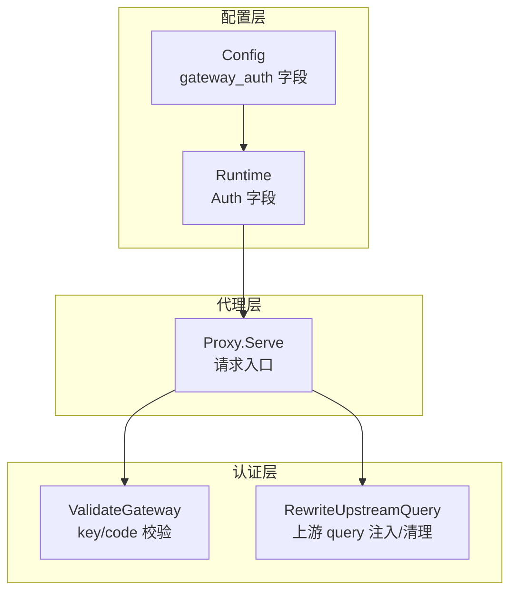
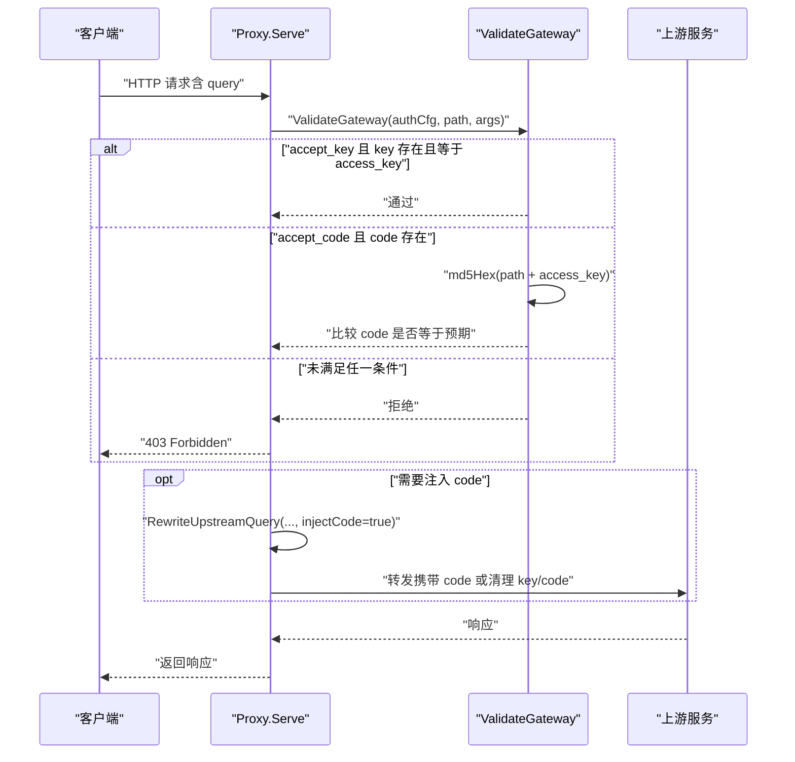
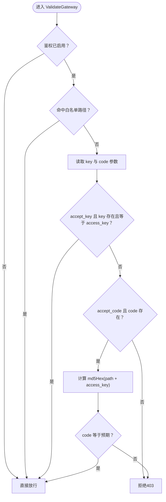
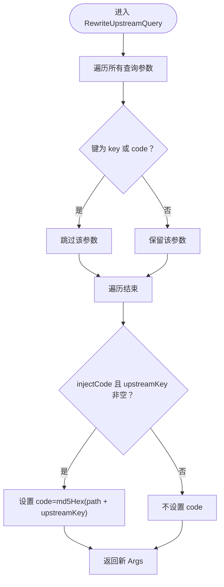
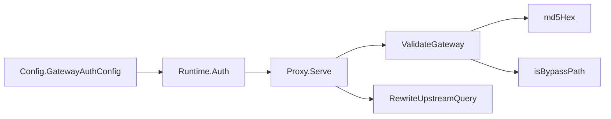

# 访问密钥配置

<cite>
**本文引用的文件**
- [internal/auth/auth.go](file://internal/auth/auth.go)
- [internal/auth/auth_test.go](file://internal/auth/auth_test.go)
- [internal/config/config.go](file://internal/config/config.go)
- [config.example.yaml](file://config.example.yaml)
- [internal/proxy/proxy.go](file://internal/proxy/proxy.go)
- [internal/runtime/runtime.go](file://internal/runtime/runtime.go)
</cite>

## 目录
1. [简介](#简介)
2. [项目结构](#项目结构)
3. [核心组件](#核心组件)
4. [架构总览](#架构总览)
5. [详细组件分析](#详细组件分析)
6. [依赖关系分析](#依赖关系分析)
7. [性能考量](#性能考量)
8. [故障排查指南](#故障排查指南)
9. [结论](#结论)
10. [附录](#附录)

## 简介
本文件围绕 gateway_auth.access_key 配置项展开，系统性解析其在“主密钥”角色下的关键作用：既可直接与请求参数 key 进行明文比对实现基础鉴权，也可与请求路径拼接后经 MD5 哈希生成预期 code 值，用于“code 验证模式”。文档同时结合代码实现，给出密钥生成建议、安全存储最佳实践，并明确警告避免在 URL 中硬编码密钥的风险。

## 项目结构
- 认证逻辑集中在 internal/auth，负责校验请求参数 key 与 code，并在转发上游时按需注入 code。
- 配置模型位于 internal/config，定义了 gateway_auth 的字段与默认值、规范化与校验规则。
- 运行时 runtime 将配置注入到运行态对象，供代理层在处理请求时使用。
- 代理层 internal/proxy 在收到请求后先调用认证函数，再进行路由选择与上游转发。

图表来源
- [internal/config/config.go](file://internal/config/config.go#L12-L36)
- [internal/runtime/runtime.go](file://internal/runtime/runtime.go#L104-L118)
- [internal/proxy/proxy.go](file://internal/proxy/proxy.go#L72-L77)
- [internal/auth/auth.go](file://internal/auth/auth.go#L11-L28)

章节来源
- [internal/config/config.go](file://internal/config/config.go#L12-L36)
- [internal/runtime/runtime.go](file://internal/runtime/runtime.go#L104-L118)
- [internal/proxy/proxy.go](file://internal/proxy/proxy.go#L72-L77)
- [internal/auth/auth.go](file://internal/auth/auth.go#L11-L28)

## 核心组件
- gateway_auth.access_key：全局访问密钥，作为主密钥参与两种鉴权模式：
  - 明文 key 模式：将请求参数 key 与 access_key 完全相等比较。
  - code 验证模式：将请求路径与 access_key 拼接后计算 MD5 哈希，得到预期 code，与请求参数 code 比较。
- gateway_auth.accept_key / accept_code：控制允许的鉴权模式开关，默认在配置加载时若两者皆未开启，则自动启用二者以保证可用性。
- bypass_paths：白名单路径，命中后跳过鉴权。

章节来源
- [internal/config/config.go](file://internal/config/config.go#L205-L208)
- [internal/auth/auth.go](file://internal/auth/auth.go#L11-L28)
- [config.example.yaml](file://config.example.yaml#L13-L33)

## 架构总览
下图展示了从请求进入代理层，到认证与上游转发的关键流程。

图表来源
- [internal/proxy/proxy.go](file://internal/proxy/proxy.go#L72-L77)
- [internal/auth/auth.go](file://internal/auth/auth.go#L11-L28)
- [internal/auth/auth.go](file://internal/auth/auth.go#L30-L43)

章节来源
- [internal/proxy/proxy.go](file://internal/proxy/proxy.go#L72-L77)
- [internal/auth/auth.go](file://internal/auth/auth.go#L11-L28)
- [internal/auth/auth.go](file://internal/auth/auth.go#L30-L43)

## 详细组件分析

### 组件A：认证函数 ValidateGateway
- 功能要点
  - 若未启用鉴权或命中白名单路径，直接放行。
  - 从请求参数中读取 key 与 code。
  - 当 accept_key 为真且 key 存在且与 access_key 完全一致时放行。
  - 当 accept_code 为真且 code 存在时，计算 md5Hex(path + access_key)，并与 code 比较，一致则放行。
  - 否则拒绝。
- 复杂度
  - 时间复杂度 O(n)（n 为路径长度），主要消耗在字符串拼接与哈希计算。
  - 空间复杂度 O(n)（哈希输出固定 32 字节，但输入可能较大）。
- 错误处理
  - 无显式异常抛出，返回布尔值表示是否通过。
  - 白名单命中与参数缺失均视为不满足条件而拒绝。
- 性能影响
  - 哈希计算成本极低，整体瓶颈不在此处。
  - 对于高频请求，建议在上游侧配合限流与缓存策略。

图表来源
- [internal/auth/auth.go](file://internal/auth/auth.go#L11-L28)

章节来源
- [internal/auth/auth.go](file://internal/auth/auth.go#L11-L28)

### 组件B：上游 query 重写 RewriteUpstreamQuery
- 功能要点
  - 清理请求参数中的 key 与 code，避免泄露主密钥。
  - 若需要注入 code 且上游密钥非空，则将 code 设置为 md5Hex(path + upstreamKey)。
  - 保留其他查询参数。
- 安全意义
  - 防止 access_key 泄露到上游日志与监控。
  - 通过注入 code 替代明文 key，降低敏感信息暴露风险。
- 性能影响
  - 仅遍历一次查询参数，O(n) 复杂度，开销很小。

图表来源
- [internal/auth/auth.go](file://internal/auth/auth.go#L30-L43)

章节来源
- [internal/auth/auth.go](file://internal/auth/auth.go#L30-L43)

### 组件C：配置模型与默认值
- 关键字段
  - enabled：是否启用网关鉴权。
  - access_key：全局访问密钥（主密钥）。
  - accept_key / accept_code：控制鉴权模式开关。
  - bypass_paths：白名单路径列表。
- 默认行为
  - 若启用鉴权但未显式开启 accept_key 与 accept_code，则自动双启，确保可用性。
- 校验规则
  - 启用鉴权时，access_key 必须非空。
  - 至少开启 accept_key 或 accept_code 之一。
- 示例配置
  - config.example.yaml 展示了 access_key、accept_key、accept_code、bypass_paths 的典型用法。

章节来源
- [internal/config/config.go](file://internal/config/config.go#L205-L208)
- [internal/config/config.go](file://internal/config/config.go#L321-L329)
- [config.example.yaml](file://config.example.yaml#L13-L33)

### 组件D：运行时注入与代理入口
- 运行时注入
  - runtime.Build 将配置中的 gateway_auth 注入到 Runtime.Auth，供后续请求处理使用。
- 代理入口
  - Proxy.Serve 在路由与负载均衡之前调用 ValidateGateway，失败即返回 403。
  - 在转发上游前调用 RewriteUpstreamQuery，清理 key/code 并按需注入 code。

章节来源
- [internal/runtime/runtime.go](file://internal/runtime/runtime.go#L104-L118)
- [internal/proxy/proxy.go](file://internal/proxy/proxy.go#L72-L77)
- [internal/proxy/proxy.go](file://internal/proxy/proxy.go#L191-L202)

## 依赖关系分析
- 认证函数 ValidateGateway 依赖：
  - 配置 GatewayAuthConfig（enabled、access_key、accept_key、accept_code、bypass_paths）。
  - fasthttp.Args（读取 key 与 code）。
  - 内部辅助函数 md5Hex 与 isBypassPath。
- 代理层 Proxy.Serve 依赖：
  - 运行时 Runtime.Auth（鉴权配置）。
  - 认证函数 ValidateGateway。
  - 上游 query 重写函数 RewriteUpstreamQuery。
- 配置层 Config 依赖：
  - YAML 解析与默认值、规范化、校验逻辑。

图表来源
- [internal/config/config.go](file://internal/config/config.go#L12-L36)
- [internal/runtime/runtime.go](file://internal/runtime/runtime.go#L104-L118)
- [internal/proxy/proxy.go](file://internal/proxy/proxy.go#L72-L77)
- [internal/auth/auth.go](file://internal/auth/auth.go#L11-L28)

章节来源
- [internal/config/config.go](file://internal/config/config.go#L12-L36)
- [internal/runtime/runtime.go](file://internal/runtime/runtime.go#L104-L118)
- [internal/proxy/proxy.go](file://internal/proxy/proxy.go#L72-L77)
- [internal/auth/auth.go](file://internal/auth/auth.go#L11-L28)

## 性能考量
- 认证阶段
  - ValidateGateway 仅进行常量时间的字符串比较与一次 MD5 哈希，对吞吐影响可忽略。
- 上游转发
  - RewriteUpstreamQuery 仅遍历一次查询参数，成本极低。
- 建议
  - 对高频接口配合缓存与限流策略，减少重复计算。
  - 使用 accept_code 模式时，建议在上游侧也做幂等与去重处理，避免重复消费。

[本节为通用性能讨论，不直接分析具体文件]

## 故障排查指南
- 常见问题与定位
  - 403 Forbidden：通常因未满足 accept_key 或 accept_code 条件，或 access_key 为空导致鉴权失败。
  - 白名单路径仍被拒绝：确认 bypass_paths 是否正确配置且路径完全匹配。
  - code 不生效：检查请求路径与 access_key 拼接是否一致，以及上游是否支持 code 验证。
- 测试参考
  - 单元测试覆盖了 key 模式、code 模式与白名单路径的场景，可对照验证本地配置与行为。
- 日志与可观测性
  - 代理层在鉴权失败时会记录访问日志，便于定位问题。

章节来源
- [internal/auth/auth_test.go](file://internal/auth/auth_test.go#L12-L45)
- [internal/proxy/proxy.go](file://internal/proxy/proxy.go#L72-L77)

## 结论
gateway_auth.access_key 作为全局主密钥，在两种鉴权模式中承担核心职责：
- 明文 key 模式：简单直接，适合内部或受控环境。
- code 验证模式：更安全，避免在 URL 中暴露主密钥，推荐在公网场景使用。
结合配置默认值与校验规则，系统在启用鉴权时具备良好的可用性与安全性。建议优先采用 code 验证模式，并遵循安全存储与最小暴露原则。

[本节为总结性内容，不直接分析具体文件]

## 附录

### 密钥生成建议
- 推荐使用强随机源生成十六进制密钥，例如 openssl rand -hex 16。
- 长度建议至少 16 字节（32 位十六进制），以获得足够熵空间。
- 避免使用字典序明显、易猜测的短语或常见密码。

[本节为通用建议，不直接分析具体文件]

### 存储安全最佳实践
- 将 access_key 存储在安全的密钥管理服务或环境变量中，避免硬编码在配置文件中。
- 限制访问权限，仅授予必要进程与用户。
- 定期轮换密钥，并在变更后逐步替换旧密钥，确保平滑过渡。
- 对配置文件与日志进行脱敏，防止意外泄露。

[本节为通用建议，不直接分析具体文件]

### 警告：避免在 URL 中硬编码密钥
- 使用明文 key 参数时，密钥会出现在 URL 中，容易被日志、浏览器历史、中间人攻击等途径泄露。
- 建议优先采用 code 验证模式，将密钥隐藏在服务端计算结果中，降低泄露风险。

[本节为通用建议，不直接分析具体文件]