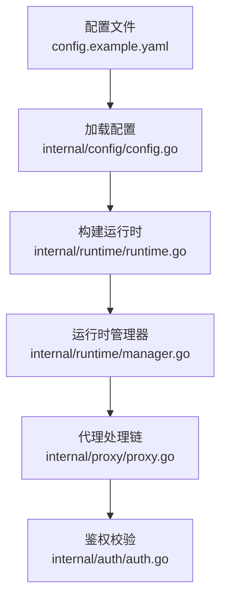
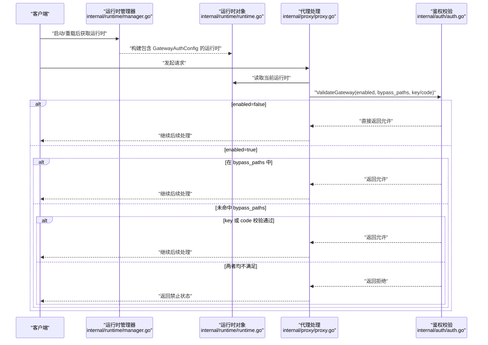
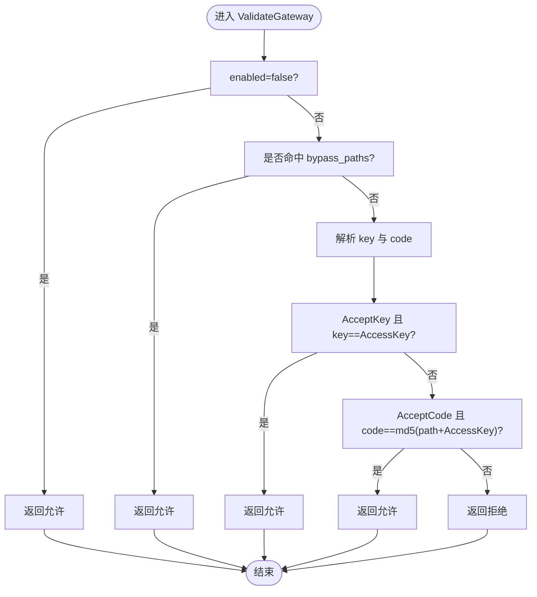
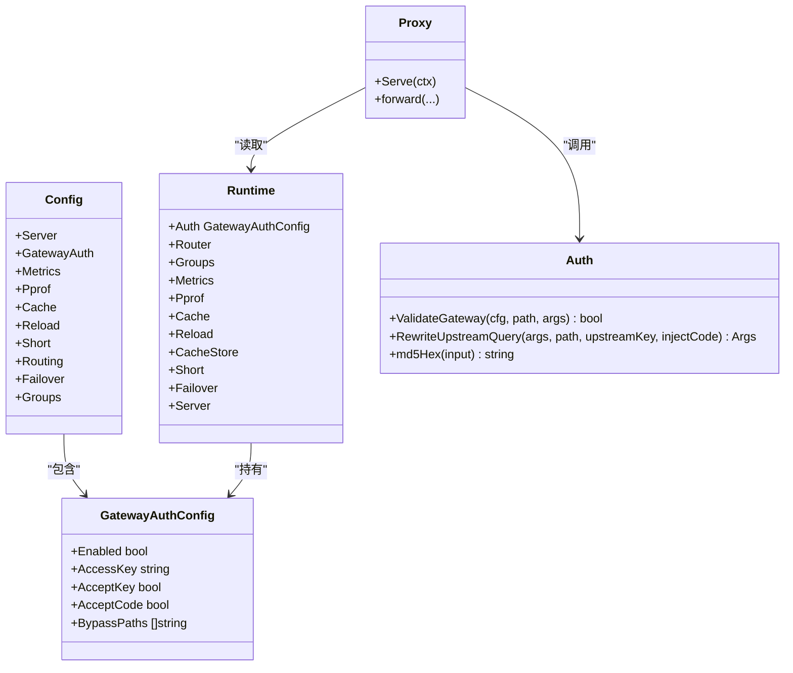

# 鉴权启用控制

<cite>
**本文引用的文件**
- [internal/config/config.go](file://internal/config/config.go)
- [internal/auth/auth.go](file://internal/auth/auth.go)
- [internal/proxy/proxy.go](file://internal/proxy/proxy.go)
- [internal/runtime/runtime.go](file://internal/runtime/runtime.go)
- [internal/runtime/manager.go](file://internal/runtime/manager.go)
- [config.example.yaml](file://config.example.yaml)
</cite>

## 目录
1. [简介](#简介)
2. [项目结构](#项目结构)
3. [核心组件](#核心组件)
4. [架构总览](#架构总览)
5. [详细组件分析](#详细组件分析)
6. [依赖关系分析](#依赖关系分析)
7. [性能考量](#性能考量)
8. [故障排查指南](#故障排查指南)
9. [结论](#结论)
10. [附录：配置示例与安全建议](#附录配置示例与安全建议)

## 简介
本篇文档围绕 gateway_auth.enabled 配置项展开，系统性说明其在全局范围内对网关鉴权功能的启停控制。基于代码实现，gateway_auth.enabled 为一个布尔开关，决定是否对所有进入网关的请求进行鉴权校验。当 enabled 为 false 时，ValidateGateway 将直接返回允许，从而实现“无条件放行”。同时，文档结合 GatewayAuthConfig 结构体、ValidateGateway 函数以及运行时注入机制，给出配置示例、安全建议及与其他鉴权选项的逻辑关系。

## 项目结构
与鉴权启用控制相关的关键文件与职责如下：
- internal/config/config.go：定义配置结构体，包括 GatewayAuthConfig，并负责默认值与校验逻辑。
- internal/auth/auth.go：实现 ValidateGateway 校验函数与上游查询参数重写等辅助逻辑。
- internal/proxy/proxy.go：在请求处理链中调用 ValidateGateway，未通过将返回禁止状态。
- internal/runtime/runtime.go：将配置注入到运行时对象，供代理层使用。
- internal/runtime/manager.go：加载配置、构建运行时并提供热重载能力。
- config.example.yaml：提供完整的配置示例，包含 gateway_auth 的典型用法。

图表来源
- [config.example.yaml](file://config.example.yaml#L1-L40)
- [internal/config/config.go](file://internal/config/config.go#L12-L40)
- [internal/runtime/runtime.go](file://internal/runtime/runtime.go#L100-L118)
- [internal/runtime/manager.go](file://internal/runtime/manager.go#L28-L66)
- [internal/proxy/proxy.go](file://internal/proxy/proxy.go#L72-L77)
- [internal/auth/auth.go](file://internal/auth/auth.go#L11-L28)

章节来源
- [internal/config/config.go](file://internal/config/config.go#L12-L40)
- [internal/runtime/runtime.go](file://internal/runtime/runtime.go#L100-L118)
- [internal/runtime/manager.go](file://internal/runtime/manager.go#L28-L66)
- [internal/proxy/proxy.go](file://internal/proxy/proxy.go#L72-L77)
- [config.example.yaml](file://config.example.yaml#L11-L33)

## 核心组件
- GatewayAuthConfig：承载网关鉴权相关的全部配置，其中 enabled 为布尔开关，控制是否启用鉴权。
- ValidateGateway：根据 enabled、bypass_paths、accept_key、accept_code 以及 access_key 执行鉴权判定。
- 运行时注入：运行时对象将 GatewayAuthConfig 注入到代理层，使每次请求都可获取当前生效的鉴权配置。
- 代理层调用：在请求进入路由选择与转发之前，调用 ValidateGateway，未通过即拒绝。

章节来源
- [internal/config/config.go](file://internal/config/config.go#L30-L36)
- [internal/auth/auth.go](file://internal/auth/auth.go#L11-L28)
- [internal/runtime/runtime.go](file://internal/runtime/runtime.go#L100-L118)
- [internal/proxy/proxy.go](file://internal/proxy/proxy.go#L72-L77)

## 架构总览
下图展示从配置加载到请求鉴权的整体流程，突出 enabled 对鉴权行为的影响。

图表来源
- [internal/runtime/manager.go](file://internal/runtime/manager.go#L28-L66)
- [internal/runtime/runtime.go](file://internal/runtime/runtime.go#L100-L118)
- [internal/proxy/proxy.go](file://internal/proxy/proxy.go#L72-L77)
- [internal/auth/auth.go](file://internal/auth/auth.go#L11-L28)

## 详细组件分析

### 组件一：GatewayAuthConfig 与 enabled 开关
- 结构体字段
  - Enabled：布尔开关，控制是否启用网关鉴权。
  - AccessKey：全局访问密钥，用于 key 校验或 code 计算。
  - AcceptKey、AcceptCode：分别控制是否接受 key 参数或 code 参数。
  - BypassPaths：白名单路径列表，命中这些路径的请求将被无条件放行。
- 默认值与校验
  - 当 enabled 为真时，若未显式设置 accept_key 或 accept_code，则会自动启用二者，确保至少一种鉴权方式可用。
  - 当 enabled 为真时，若未设置 access_key 或两种鉴权方式均未启用，则会在校验阶段报错。
- 影响范围
  - 该开关直接影响 ValidateGateway 的返回值，进而影响代理层是否放行请求。

章节来源
- [internal/config/config.go](file://internal/config/config.go#L30-L36)
- [internal/config/config.go](file://internal/config/config.go#L205-L208)
- [internal/config/config.go](file://internal/config/config.go#L321-L329)

### 组件二：ValidateGateway 的判定逻辑
- 关键分支
  - enabled=false：直接返回允许，实现“无条件放行”。
  - enabled=true：先检查是否命中 bypass_paths，命中则放行。
  - 若未命中 bypass_paths：尝试解析 query 中的 key 或 code，并与配置进行比对。
    - AcceptKey=true 且 key 存在且等于 AccessKey，则放行。
    - AcceptCode=true 且 code 存在且等于 md5(path+AccessKey)，则放行。
  - 其他情况：返回拒绝。
- 与上游参数重写
  - RewriteUpstreamQuery 会移除 query 中的 key 和 code，并在需要时注入 code（针对非 upvote 后端）。

图表来源
- [internal/auth/auth.go](file://internal/auth/auth.go#L11-L28)
- [internal/auth/auth.go](file://internal/auth/auth.go#L30-L43)

章节来源
- [internal/auth/auth.go](file://internal/auth/auth.go#L11-L28)
- [internal/auth/auth.go](file://internal/auth/auth.go#L30-L43)

### 组件三：代理层调用 ValidateGateway
- 在代理 Serve 流程中，于路由选择与转发之前调用 ValidateGateway。
- 若返回拒绝，记录访问日志并返回禁止状态；通过则继续后续处理。

章节来源
- [internal/proxy/proxy.go](file://internal/proxy/proxy.go#L72-L77)

### 组件四：运行时注入与热重载
- 运行时构建时将 GatewayAuthConfig 注入到 Runtime 对象，代理层通过运行时读取当前生效的鉴权配置。
- 运行时管理器支持配置热重载，更新后的配置会替换当前运行时，从而即时生效新的 enabled 等开关。

章节来源
- [internal/runtime/runtime.go](file://internal/runtime/runtime.go#L100-L118)
- [internal/runtime/manager.go](file://internal/runtime/manager.go#L28-L66)
- [internal/runtime/manager.go](file://internal/runtime/manager.go#L77-L126)

## 依赖关系分析
- 配置层
  - config.Config 包含 GatewayAuthConfig，负责默认值与校验。
- 运行时层
  - runtime.Runtime 持有 GatewayAuthConfig，并在代理层可见。
- 处理层
  - proxy.Proxy 在请求处理链中调用 auth.ValidateGateway。
- 辅助层
  - auth.RewriteUpstreamQuery 与 md5Hex 为上游参数重写与 code 计算提供支持。

图表来源
- [internal/config/config.go](file://internal/config/config.go#L12-L40)
- [internal/runtime/runtime.go](file://internal/runtime/runtime.go#L100-L118)
- [internal/proxy/proxy.go](file://internal/proxy/proxy.go#L72-L77)
- [internal/auth/auth.go](file://internal/auth/auth.go#L11-L43)

章节来源
- [internal/config/config.go](file://internal/config/config.go#L12-L40)
- [internal/runtime/runtime.go](file://internal/runtime/runtime.go#L100-L118)
- [internal/proxy/proxy.go](file://internal/proxy/proxy.go#L72-L77)
- [internal/auth/auth.go](file://internal/auth/auth.go#L11-L43)

## 性能考量
- enabled=false 时，ValidateGateway 直接返回允许，避免了额外的参数解析与哈希计算开销，对性能影响极小。
- enabled=true 时，ValidateGateway 仅进行常量时间的字符串比较与一次 MD5 计算，开销可忽略。
- 代理层在鉴权失败时会记录日志并返回禁止状态，避免不必要的上游转发。

[本节为通用性能讨论，不直接分析具体文件]

## 故障排查指南
- 症状：请求被拒绝
  - 检查 gateway_auth.enabled 是否为 true。
  - 检查请求路径是否命中 bypass_paths。
  - 检查是否提供了有效的 key 或 code。
- 症状：配置修改后未生效
  - 确认运行时已热重载，代理层读取的是最新运行时。
- 症状：生产环境出现未授权访问
  - 确认 gateway_auth.enabled 已设为 true，且 access_key 设置正确，accept_key 或 accept_code 至少启用一项。

章节来源
- [internal/auth/auth.go](file://internal/auth/auth.go#L11-L28)
- [internal/proxy/proxy.go](file://internal/proxy/proxy.go#L72-L77)
- [internal/runtime/manager.go](file://internal/runtime/manager.go#L77-L126)

## 结论
gateway_auth.enabled 是网关鉴权的全局开关。当其为 false 时，ValidateGateway 直接放行，实现“无条件放行”；当其为 true 时，ValidateGateway 依据 bypass_paths、key 与 code 等规则进行严格校验。通过运行时注入与热重载，enabled 的变更可在不重启服务的情况下即时生效。生产环境务必启用鉴权，并合理配置 access_key、accept_key、accept_code 与 bypass_paths，以兼顾安全性与可用性。

[本节为总结性内容，不直接分析具体文件]

## 附录：配置示例与安全建议

### 配置示例
- 全局启用鉴权
  - 在配置文件中设置 gateway_auth.enabled 为 true，并提供 access_key。
  - 可同时启用 accept_key 与 accept_code，或仅启用其一。
  - 可配置 bypass_paths，将静态资源等无需鉴权的路径加入白名单。
- 示例参考
  - 参考示例配置文件中的 gateway_auth 段落，了解各字段含义与默认行为。

章节来源
- [config.example.yaml](file://config.example.yaml#L11-L33)

### 安全建议
- 生产环境必须启用鉴权
  - 将 gateway_auth.enabled 设为 true，确保所有请求均受控。
- 强化密钥管理
  - 使用强随机生成的 access_key，并限制其传播范围。
  - 如需使用 code 方式，确保仅在可信网络内生成与传递。
- 合理设置白名单
  - bypass_paths 应仅包含必要的静态资源路径，避免扩大攻击面。
- 与其他鉴权选项的关系
  - gateway_auth.enabled 控制是否启用网关层鉴权。若关闭，则不会执行任何网关层鉴权逻辑。
  - 若开启，accept_key 与 accept_code 提供两种鉴权方式，二者可并行启用，但至少启用其一。
  - 上游后端的 access_key 主要用于上游鉴权与健康检查，与网关层鉴权互不影响，但会影响 code 注入与上游转发行为。

章节来源
- [internal/config/config.go](file://internal/config/config.go#L205-L208)
- [internal/config/config.go](file://internal/config/config.go#L321-L329)
- [internal/auth/auth.go](file://internal/auth/auth.go#L30-L43)
- [internal/proxy/proxy.go](file://internal/proxy/proxy.go#L191-L202)