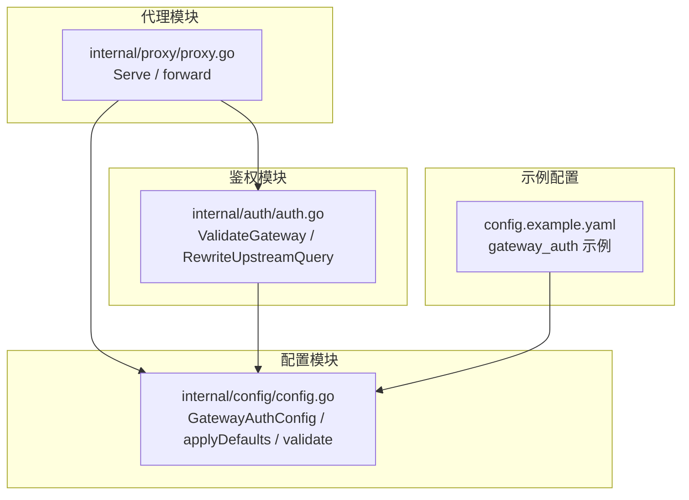
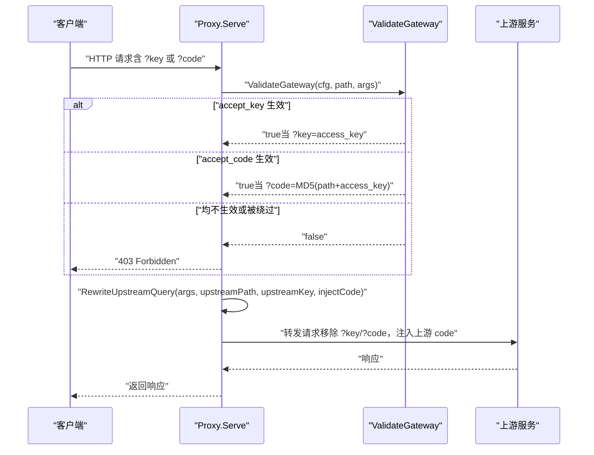
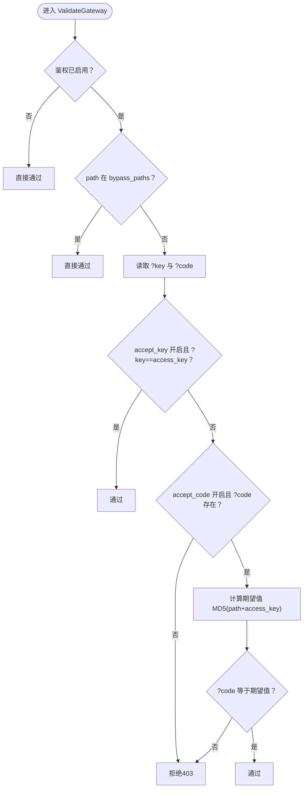
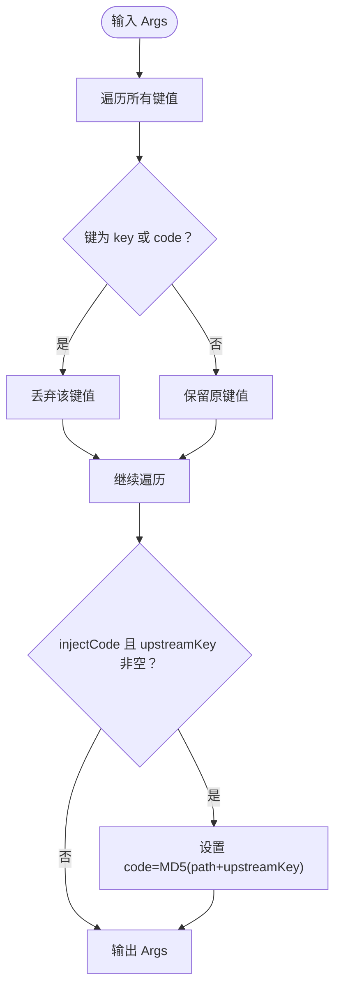
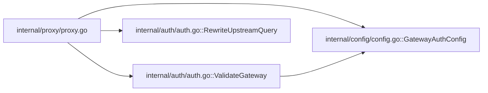

# 鉴权模式选择

<cite>
**本文引用的文件**
- [internal/auth/auth.go](file://internal/auth/auth.go)
- [internal/auth/auth_test.go](file://internal/auth/auth_test.go)
- [internal/config/config.go](file://internal/config/config.go)
- [internal/proxy/proxy.go](file://internal/proxy/proxy.go)
- [config.example.yaml](file://config.example.yaml)
- [openspec/changes/add-v0-1-basic-routing-lb/specs/gateway-auth/spec.md](file://openspec/changes/add-v0-1-basic-routing-lb/specs/gateway-auth/spec.md)
</cite>

## 目录
1. [简介](#简介)
2. [项目结构](#项目结构)
3. [核心组件](#核心组件)
4. [架构总览](#架构总览)
5. [详细组件分析](#详细组件分析)
6. [依赖关系分析](#依赖关系分析)
7. [性能考量](#性能考量)
8. [故障排查指南](#故障排查指南)
9. [结论](#结论)
10. [附录](#附录)

## 简介
本文件围绕 RSSHub Gateway 的鉴权机制，系统阐述两个关键配置项 accept_key 与 accept_code 的功能、区别与组合使用方式，并结合 ValidateGateway 函数的实现逻辑，说明两种模式如何独立启用或同时启用，以及典型使用场景：accept_key 适合内部调试，accept_code 适合公开服务的安全接入。

## 项目结构
- 鉴权相关的核心代码集中在 internal/auth 下，包括鉴权校验与上游查询参数重写。
- 配置模型在 internal/config 中定义，包含 GatewayAuthConfig 结构体及其默认值与校验规则。
- 请求入口在 internal/proxy 中，代理层在转发前调用鉴权校验，并在转发到上游前对查询参数进行清洗与注入。
- 示例配置文件 config.example.yaml 展示了 accept_key 与 accept_code 的典型开启方式。

图表来源
- [internal/auth/auth.go](file://internal/auth/auth.go#L1-L58)
- [internal/config/config.go](file://internal/config/config.go#L30-L40)
- [internal/proxy/proxy.go](file://internal/proxy/proxy.go#L72-L83)
- [config.example.yaml](file://config.example.yaml#L13-L33)

章节来源
- [internal/auth/auth.go](file://internal/auth/auth.go#L1-L58)
- [internal/config/config.go](file://internal/config/config.go#L30-L40)
- [internal/proxy/proxy.go](file://internal/proxy/proxy.go#L72-L83)
- [config.example.yaml](file://config.example.yaml#L13-L33)

## 核心组件
- GatewayAuthConfig：定义鉴权开关、全局密钥、是否接受 key 参数、是否接受 code 参数、以及免鉴权路径列表。
- ValidateGateway：根据配置判断请求是否通过鉴权，支持 accept_key 与 accept_code 两种模式。
- RewriteUpstreamQuery：在向上游转发前，移除客户端传入的 key/code，并按规则注入上游专用的 code 参数。
- Proxy.Serve/forward：在代理层调用鉴权校验，并在转发前执行查询参数重写。

章节来源
- [internal/config/config.go](file://internal/config/config.go#L30-L40)
- [internal/auth/auth.go](file://internal/auth/auth.go#L11-L43)
- [internal/proxy/proxy.go](file://internal/proxy/proxy.go#L72-L83)
- [internal/proxy/proxy.go](file://internal/proxy/proxy.go#L191-L208)

## 架构总览
鉴权流程在请求进入代理层后立即执行，随后决定是否将请求转发至上游。上游侧仅接收经清洗与注入后的查询参数，避免泄露原始密钥。

图表来源
- [internal/proxy/proxy.go](file://internal/proxy/proxy.go#L72-L83)
- [internal/auth/auth.go](file://internal/auth/auth.go#L11-L43)
- [internal/proxy/proxy.go](file://internal/proxy/proxy.go#L191-L208)

## 详细组件分析

### accept_key 与 accept_code 的功能与区别
- accept_key 模式
  - 行为：当配置开启且客户端携带 ?key=access_key 时，视为通过鉴权。
  - 特点：简单直接，便于内部调试与快速验证。
  - 风险：明文密钥出现在 URL 查询参数中，易被日志、中间件、浏览器历史等记录，存在泄露风险。
- accept_code 模式
  - 行为：当配置开启且客户端携带 ?code=MD5(path+access_key) 时，视为通过鉴权。
  - 特点：基于路径与密钥的哈希，防篡改能力更强，即使 URL 被截获也难以伪造 code。
  - 安全性：code 与具体路径绑定，若路径变化则 code 失效，降低重放风险。

章节来源
- [internal/auth/auth.go](file://internal/auth/auth.go#L18-L27)
- [internal/auth/auth_test.go](file://internal/auth/auth_test.go#L12-L29)

### ValidateGateway 的处理逻辑
- 全局开关与绕过路径
  - 若未启用鉴权，直接通过。
  - 若当前 path 在 bypass_paths 中，直接通过。
- 接受 key 模式
  - 当 accept_key 开启且 ?key 存在且等于全局 access_key，则通过。
- 接受 code 模式
  - 当 accept_code 开启且 ?code 存在时，计算期望值 MD5(path+access_key)，并与客户端提供的 code 比较，一致则通过。
- 其他情况
  - 以上条件均不满足则拒绝。

图表来源
- [internal/auth/auth.go](file://internal/auth/auth.go#L11-L28)

章节来源
- [internal/auth/auth.go](file://internal/auth/auth.go#L11-L28)

### 上游查询参数重写（RewriteUpstreamQuery）
- 目的：在转发到上游前，移除客户端传入的 ?key 与 ?code，避免泄露密钥；根据上游 access_key 注入新的 code 参数。
- 规则：
  - 移除 key 与 code。
  - 若需要注入且上游 access_key 非空，则设置 code=MD5(path+upstream_access_key)。
- 作用：确保上游只看到经注入的 code，不暴露原始 access_key；同时避免将客户端的 key/code 透传给上游。

图表来源
- [internal/auth/auth.go](file://internal/auth/auth.go#L30-L43)

章节来源
- [internal/auth/auth.go](file://internal/auth/auth.go#L30-L43)
- [internal/proxy/proxy.go](file://internal/proxy/proxy.go#L191-L208)

### 配置项与默认行为
- GatewayAuthConfig 字段
  - enabled：是否启用网关鉴权。
  - access_key：全局访问密钥。
  - accept_key：是否接受 ?key= 形式的鉴权。
  - accept_code：是否接受 ?code=MD5(path+access_key) 形式的鉴权。
  - bypass_paths：免鉴权路径列表。
- 默认值与校验
  - applyDefaults：当启用鉴权但未显式指定 accept_key 与 accept_code 时，默认两者都开启。
  - validate：要求启用鉴权时必须提供 access_key，且至少开启 accept_key 或 accept_code 之一。

章节来源
- [internal/config/config.go](file://internal/config/config.go#L30-L40)
- [internal/config/config.go](file://internal/config/config.go#L205-L208)
- [internal/config/config.go](file://internal/config/config.go#L321-L329)

### 典型使用场景
- accept_key 用于内部调试
  - 在开发与内网联调阶段，可通过 ?key=access_key 快速验证路由与上游连通性，减少复杂度。
- accept_code 用于公开服务的安全接入
  - 对外开放的接口建议仅开启 accept_code，以哈希方式防止密钥泄露与重放攻击。
- 同时启用
  - 在过渡期或多环境共存时，可同时开启 accept_key 与 accept_code，以便不同客户端逐步迁移至更安全的 accept_code 模式。

章节来源
- [config.example.yaml](file://config.example.yaml#L13-L33)
- [openspec/changes/add-v0-1-basic-routing-lb/specs/gateway-auth/spec.md](file://openspec/changes/add-v0-1-basic-routing-lb/specs/gateway-auth/spec.md#L23-L31)

## 依赖关系分析
- Proxy.Serve 依赖 ValidateGateway 进行鉴权判定。
- Proxy.forward 在转发前调用 RewriteUpstreamQuery，确保上游只收到注入后的 code。
- 配置加载与校验由 internal/config 提供，保证运行时鉴权配置合法。

图表来源
- [internal/proxy/proxy.go](file://internal/proxy/proxy.go#L72-L83)
- [internal/proxy/proxy.go](file://internal/proxy/proxy.go#L191-L208)
- [internal/auth/auth.go](file://internal/auth/auth.go#L11-L43)
- [internal/config/config.go](file://internal/config/config.go#L30-L40)

章节来源
- [internal/proxy/proxy.go](file://internal/proxy/proxy.go#L72-L83)
- [internal/proxy/proxy.go](file://internal/proxy/proxy.go#L191-L208)
- [internal/auth/auth.go](file://internal/auth/auth.go#L11-L43)
- [internal/config/config.go](file://internal/config/config.go#L30-L40)

## 性能考量
- 鉴权成本极低：仅进行字符串比较与一次 MD5 计算，对吞吐影响可忽略。
- 重写成本低：遍历查询参数并按需注入 code，时间复杂度与参数数量线性相关。
- 建议
  - 在高并发场景下，优先采用 accept_code 模式，避免在日志中出现明文密钥带来的额外审计与合规成本。
  - 对于内部调试，可临时开启 accept_key 以提升效率，但务必在生产环境关闭。

## 故障排查指南
- 403 Forbidden
  - 可能原因：未启用鉴权但请求未命中 bypass_paths；或未满足 accept_key/accept_code 条件。
  - 排查要点：确认 gateway_auth.enabled、access_key、accept_key、accept_code 设置；核对请求路径是否在 bypass_paths。
- 上游鉴权失败
  - 可能原因：上游 access_key 与注入的 code 不匹配。
  - 排查要点：确认上游配置的 access_key；检查路径 strip 前后是否一致；确认 injectCode 逻辑是否按预期工作。
- 日志与审计
  - 由于 key 会在上游被移除，仅保留 code，建议在上游侧记录 code 的来源与路径，便于审计与排障。

章节来源
- [internal/auth/auth.go](file://internal/auth/auth.go#L11-L28)
- [internal/proxy/proxy.go](file://internal/proxy/proxy.go#L72-L83)
- [internal/proxy/proxy.go](file://internal/proxy/proxy.go#L191-L208)

## 结论
- accept_key 与 accept_code 是两种互补的鉴权模式：前者简单易用，后者更安全可靠。
- ValidateGateway 与 RewriteUpstreamQuery 的配合，既保证了入口侧的灵活校验，又确保了上游侧的安全与一致性。
- 在实际部署中，建议优先采用 accept_code 模式；在内部调试阶段可临时启用 accept_key，待稳定后再统一迁移到 accept_code。

## 附录
- 配置示例参考：config.example.yaml 中的 gateway_auth 部分展示了 accept_key 与 accept_code 的典型开启方式。
- 规范约束参考：openspec 中明确了上游鉴权注入的要求，即移除客户端 key/code 并注入上游专用 code。

章节来源
- [config.example.yaml](file://config.example.yaml#L13-L33)
- [openspec/changes/add-v0-1-basic-routing-lb/specs/gateway-auth/spec.md](file://openspec/changes/add-v0-1-basic-routing-lb/specs/gateway-auth/spec.md#L23-L31)