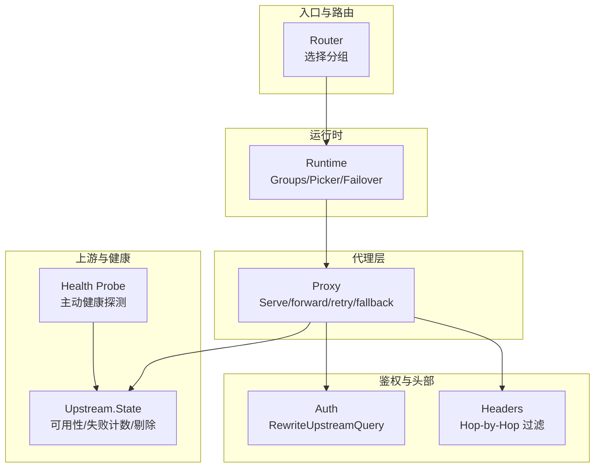
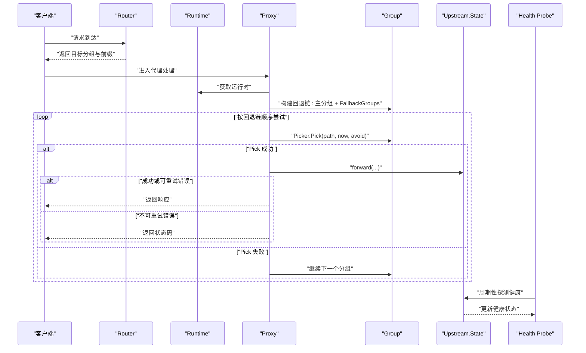
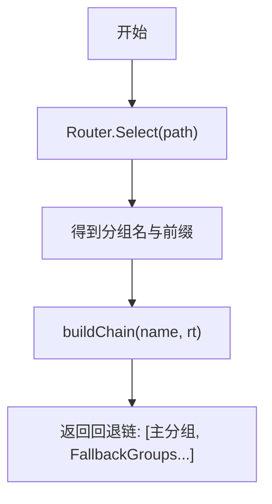
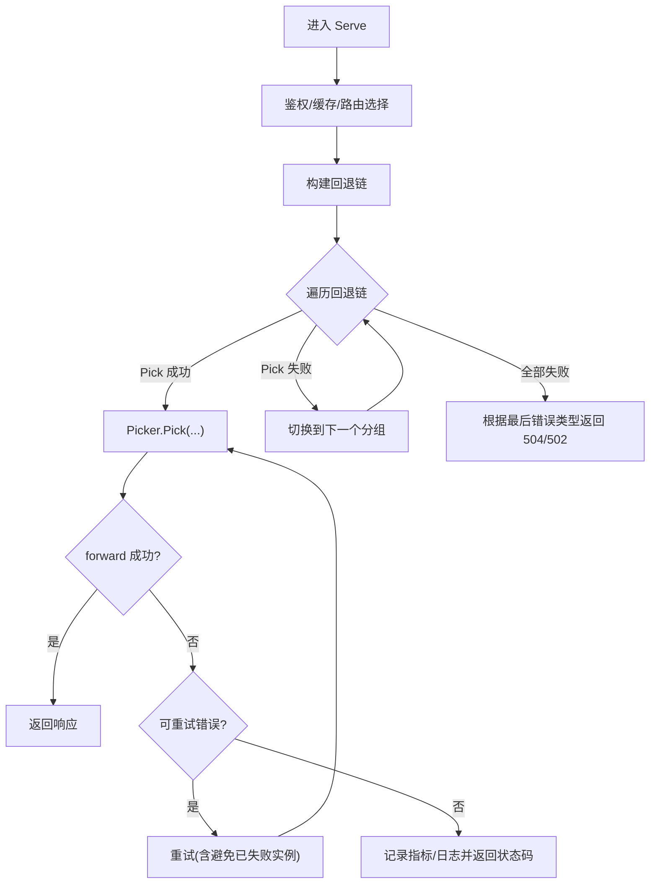
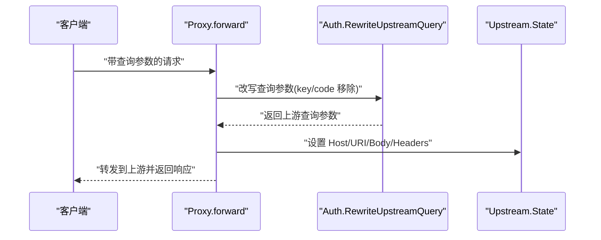
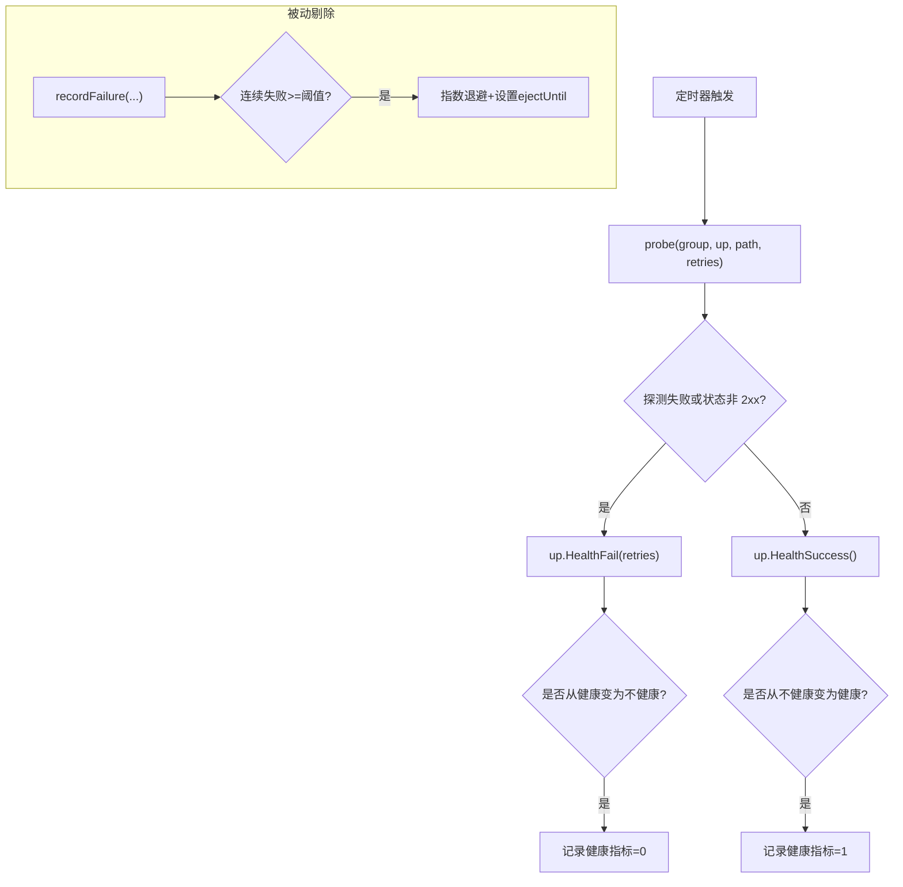
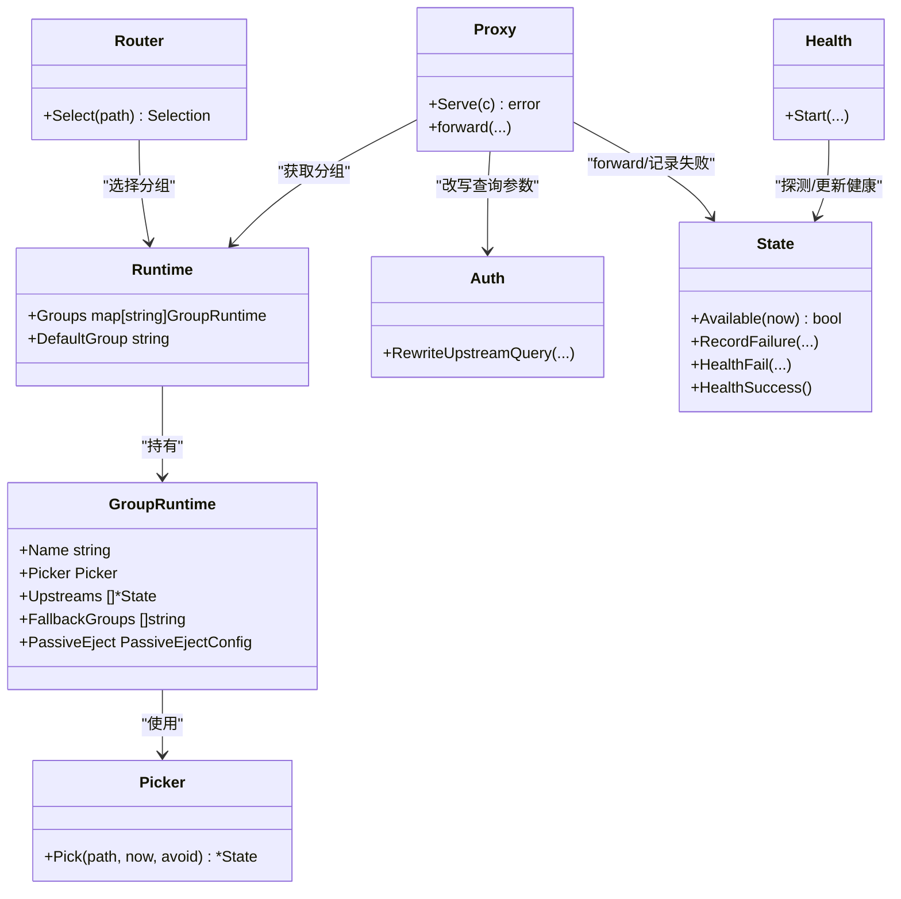

# 故障回退链机制

<cite>
**本文引用的文件列表**
- [proxy.go](file://internal/proxy/proxy.go)
- [headers.go](file://internal/proxy/headers.go)
- [picker.go](file://internal/lb/picker.go)
- [state.go](file://internal/upstream/state.go)
- [health.go](file://internal/health/health.go)
- [config.go](file://internal/config/config.go)
- [runtime.go](file://internal/runtime/runtime.go)
- [router.go](file://internal/router/router.go)
- [auth.go](file://internal/auth/auth.go)
</cite>

## 目录
1. [简介](#简介)
2. [项目结构](#项目结构)
3. [核心组件](#核心组件)
4. [架构总览](#架构总览)
5. [组件详解](#组件详解)
6. [依赖关系分析](#依赖关系分析)
7. [性能考量](#性能考量)
8. [故障排查指南](#故障排查指南)
9. [结论](#结论)
10. [附录：多活容灾配置范例](#附录多活容灾配置范例)

## 简介
本文件系统性阐述 RSSHub 网关的“故障回退链（Fallback Groups）”工作机制，围绕以下目标展开：
- 当主分组中所有上游实例均不可用时，网关如何依据配置优先级依次尝试备用分组；
- 在 Pick 失败后触发 fallback 的条件判断逻辑；
- 重试次数（retry）与回退链的协同策略；
- 请求上下文在 headers 层的传递方式，确保跨分组跳转时保留原始请求参数与鉴权信息；
- 多活容灾架构的配置范例，展示如何通过层级化 fallback_groups 实现区域故障隔离与全局高可用；
- 回退过程中的健康检查状态继承与更新机制。

## 项目结构
围绕故障回退链相关的关键模块如下：
- 路由与选择：根据路由规则选择目标分组，确定回退链起始点
- 运行时构建：将配置转换为运行时对象，包含分组、负载均衡器、被动剔除策略等
- 代理处理：执行转发、重试、回退链、日志与指标记录
- 上游状态与健康：维护上游可用性、失败计数、被动剔除与主动健康探测
- 鉴权与请求头：对上游查询参数进行改写，注入鉴权码；过滤 Hop-by-Hop 头部

图表来源
- [router.go](file://internal/router/router.go#L29-L56)
- [runtime.go](file://internal/runtime/runtime.go#L50-L127)
- [proxy.go](file://internal/proxy/proxy.go#L79-L183)
- [state.go](file://internal/upstream/state.go#L34-L109)
- [health.go](file://internal/health/health.go#L16-L78)
- [auth.go](file://internal/auth/auth.go#L30-L43)
- [headers.go](file://internal/proxy/headers.go#L1-L21)

章节来源
- [router.go](file://internal/router/router.go#L29-L56)
- [runtime.go](file://internal/runtime/runtime.go#L50-L127)
- [proxy.go](file://internal/proxy/proxy.go#L79-L183)
- [state.go](file://internal/upstream/state.go#L34-L109)
- [health.go](file://internal/health/health.go#L16-L78)
- [auth.go](file://internal/auth/auth.go#L30-L43)
- [headers.go](file://internal/proxy/headers.go#L1-L21)

## 核心组件
- 路由选择：根据路径匹配与优先级选择目标分组，作为回退链起点
- 分组运行时：包含负载均衡器、上游集合、回退分组列表、被动剔除策略
- 代理处理：按回退链顺序尝试，支持重试与错误分类，记录指标与日志
- 上游状态：维护健康状态、连续失败计数、剔除时间窗口与指数退避
- 主动健康探测：周期性探测上游健康，更新状态并记录指标
- 鉴权与头部：对上游查询参数进行改写，注入上游鉴权码；过滤不透传头部

章节来源
- [router.go](file://internal/router/router.go#L29-L56)
- [runtime.go](file://internal/runtime/runtime.go#L50-L127)
- [proxy.go](file://internal/proxy/proxy.go#L79-L183)
- [state.go](file://internal/upstream/state.go#L34-L109)
- [health.go](file://internal/health/health.go#L16-L78)
- [auth.go](file://internal/auth/auth.go#L30-L43)
- [headers.go](file://internal/proxy/headers.go#L1-L21)

## 架构总览
下图展示了从路由选择到回退链执行的整体流程，包括重试与错误分类、指标与日志记录，以及健康探测对上游状态的影响。

图表来源
- [router.go](file://internal/router/router.go#L29-L56)
- [runtime.go](file://internal/runtime/runtime.go#L50-L127)
- [proxy.go](file://internal/proxy/proxy.go#L79-L183)
- [state.go](file://internal/upstream/state.go#L34-L109)
- [health.go](file://internal/health/health.go#L16-L78)

## 组件详解

### 1) 路由选择与回退链构建
- 路由选择：根据 allow/deny 前缀匹配与优先级，返回目标分组与路由前缀
- 回退链构建：以目标分组为起点，追加其 fallback_groups 形成完整链路

图表来源
- [router.go](file://internal/router/router.go#L29-L56)
- [proxy.go](file://internal/proxy/proxy.go#L383-L392)

章节来源
- [router.go](file://internal/router/router.go#L29-L56)
- [proxy.go](file://internal/proxy/proxy.go#L383-L392)

### 2) 代理处理流程与回退触发条件
- 代理入口：解析路由、鉴权、缓存命中、构建回退链
- 尝试顺序：按回退链逐个分组，每个分组内使用 Picker.Pick 获取上游
- 回退触发条件：
  - Pick 返回空（无可用上游）
  - 或者发生可重试错误（超时/连接失败），且未达到最大重试次数
- 重试策略：
  - 对 GET/HEAD 方法启用重试，最大重试次数来自配置
  - 每次重试会增加 retries 计数并记录指标
- 错误分类与状态映射：
  - 超时 -> 504 网关超时
  - 其他连接错误 -> 502 网关错误
- 最终失败：
  - 若链路全部失败，依据最后一次错误类型返回 504 或 502

图表来源
- [proxy.go](file://internal/proxy/proxy.go#L79-L183)
- [proxy.go](file://internal/proxy/proxy.go#L191-L228)
- [proxy.go](file://internal/proxy/proxy.go#L300-L302)
- [proxy.go](file://internal/proxy/proxy.go#L359-L364)

章节来源
- [proxy.go](file://internal/proxy/proxy.go#L79-L183)
- [proxy.go](file://internal/proxy/proxy.go#L191-L228)
- [proxy.go](file://internal/proxy/proxy.go#L300-L302)
- [proxy.go](file://internal/proxy/proxy.go#L359-L364)

### 3) 重试次数与回退链的协同策略
- 仅对 GET/HEAD 启用重试，避免对可能有副作用的请求造成重复执行
- 最大重试次数来自配置，实际尝试次数为 1 + max_retries
- 每次重试都会记录指标，避免重复使用同一失败上游（通过 avoid 集合）

章节来源
- [proxy.go](file://internal/proxy/proxy.go#L126-L133)
- [proxy.go](file://internal/proxy/proxy.go#L134-L172)

### 4) 请求上下文传递与鉴权注入
- 查询参数改写：上游查询参数由鉴权模块改写，移除网关层 key/code，按需注入上游 code
- 鉴权码生成：基于路径与上游 access_key 计算 MD5，作为上游 code
- 请求头传递：复制非 Hop-by-Hop 头部，设置 Host 为目标上游主机
- 跨分组跳转时，上游 code 仍基于原始路径与对应上游的 access_key 注入，保证鉴权一致性

图表来源
- [proxy.go](file://internal/proxy/proxy.go#L191-L208)
- [auth.go](file://internal/auth/auth.go#L30-L43)
- [headers.go](file://internal/proxy/headers.go#L1-L21)

章节来源
- [proxy.go](file://internal/proxy/proxy.go#L191-L208)
- [auth.go](file://internal/auth/auth.go#L30-L43)
- [headers.go](file://internal/proxy/headers.go#L1-L21)

### 5) 健康检查状态的继承与更新
- 主动健康探测：周期性向各上游健康端点发起探测，失败则增加健康失败计数，达到阈值变为不健康；成功则恢复健康
- 被动剔除：当代理侧记录失败且满足阈值，对上游进行指数退避式剔除，设置 ejectUntil 时间窗
- 上游可用性：Picker 在选择时会考虑上游可用性（健康且未被剔除），从而影响回退链的 Pick 结果

图表来源
- [health.go](file://internal/health/health.go#L16-L78)
- [state.go](file://internal/upstream/state.go#L54-L102)
- [proxy.go](file://internal/proxy/proxy.go#L276-L298)

章节来源
- [health.go](file://internal/health/health.go#L16-L78)
- [state.go](file://internal/upstream/state.go#L54-L102)
- [proxy.go](file://internal/proxy/proxy.go#L276-L298)

### 6) 配置模型与验证要点
- 分组配置包含：名称、后端类型、StripPrefix、优先级、允许/拒绝前缀、负载均衡策略、回退分组列表、健康探测、上游列表
- 回退链长度由主分组的 fallback_groups 决定，最终形成 [主分组, 备用分组...] 的顺序
- 验证规则：禁止自引用、必须指向存在的分组、默认分组必须存在、上游 URL 必须合法等

章节来源
- [config.go](file://internal/config/config.go#L110-L121)
- [config.go](file://internal/config/config.go#L450-L464)
- [runtime.go](file://internal/runtime/runtime.go#L50-L127)

## 依赖关系分析
- 路由选择依赖运行时中的分组定义与默认分组
- 代理处理依赖运行时中的分组运行时（含 Picker、PassiveEject、FallbackGroups）
- 上游状态与健康探测相互作用：健康探测改变上游健康状态，被动剔除影响上游可用性
- 鉴权模块与代理层协作：上游查询参数改写与 Host 设置

图表来源
- [router.go](file://internal/router/router.go#L29-L56)
- [runtime.go](file://internal/runtime/runtime.go#L50-L127)
- [proxy.go](file://internal/proxy/proxy.go#L79-L183)
- [picker.go](file://internal/lb/picker.go#L9-L12)
- [state.go](file://internal/upstream/state.go#L34-L109)
- [health.go](file://internal/health/health.go#L16-L78)
- [auth.go](file://internal/auth/auth.go#L30-L43)

章节来源
- [router.go](file://internal/router/router.go#L29-L56)
- [runtime.go](file://internal/runtime/runtime.go#L50-L127)
- [proxy.go](file://internal/proxy/proxy.go#L79-L183)
- [picker.go](file://internal/lb/picker.go#L9-L12)
- [state.go](file://internal/upstream/state.go#L34-L109)
- [health.go](file://internal/health/health.go#L16-L78)
- [auth.go](file://internal/auth/auth.go#L30-L43)

## 性能考量
- 重试策略仅对幂等方法启用，避免重复副作用
- 通过 avoid 集合避免重复尝试同一失败上游，减少无效重试
- 被动剔除采用指数退避，降低热点上游的压力，提升整体稳定性
- 主动健康探测间隔与超时可调，平衡探测开销与故障感知速度
- 缓存命中可显著降低上游压力，建议合理设置 TTL 与命中条件

## 故障排查指南
- 观察回退链日志：确认是否发生了分组切换与重试次数
- 检查错误类型：timeout 映射到 504，其他连接错误映射到 502
- 关注被动剔除：若上游被剔除，日志会记录 eject_until 时间
- 排查健康探测：确认探测路径、间隔、超时与重试配置是否合理
- 鉴权问题：确认上游 code 是否正确生成，key/code 是否被正确移除

章节来源
- [proxy.go](file://internal/proxy/proxy.go#L394-L418)
- [proxy.go](file://internal/proxy/proxy.go#L276-L298)
- [health.go](file://internal/health/health.go#L16-L78)
- [auth.go](file://internal/auth/auth.go#L30-L43)

## 结论
RSSHub 网关通过“回退链 + 重试 + 被动剔除 + 主动健康探测”的组合，实现了在主分组全量不可用时的平滑切换与快速恢复。代理层在 Pick 失败与可重试错误场景下自动推进至下一分组，配合重试次数与 avoid 机制，既提升了可用性也避免了放大效应。请求上下文在 headers 层的传递与鉴权注入保证了跨分组跳转时的安全与一致性。健康检查状态的继承与更新进一步增强了系统的自愈能力。

## 附录：多活容灾配置范例
以下为通过层级化 fallback_groups 实现区域故障隔离与全局高可用的配置思路（示例字段，具体数值请按实际环境调整）：
- 主分组 primary：优先承载本地区域流量，fallback_groups 包含 region-b 与 region-c
- 区域分组 region-b：作为 primary 的就近备份，fallback_groups 可包含 region-c
- 区域分组 region-c：作为兜底分组，fallback_groups 可为空或指向 global
- 全局分组 global：作为最终兜底，fallback_groups 通常为空
- 负载均衡策略：建议在主分组使用 WRR，区域分组使用 WRR 或 Hash（按需）
- 被动剔除与重试：开启被动剔除，设置合理的 fail_threshold 与退避上限；对 GET/HEAD 开启重试，max_retries 按业务容忍度设定
- 主动健康探测：为每个分组配置独立的健康探测路径、间隔与超时，确保快速感知故障

该层级化设计可在区域故障时自动降级至就近备份，再在全局层面兜底，实现区域隔离与全局高可用。