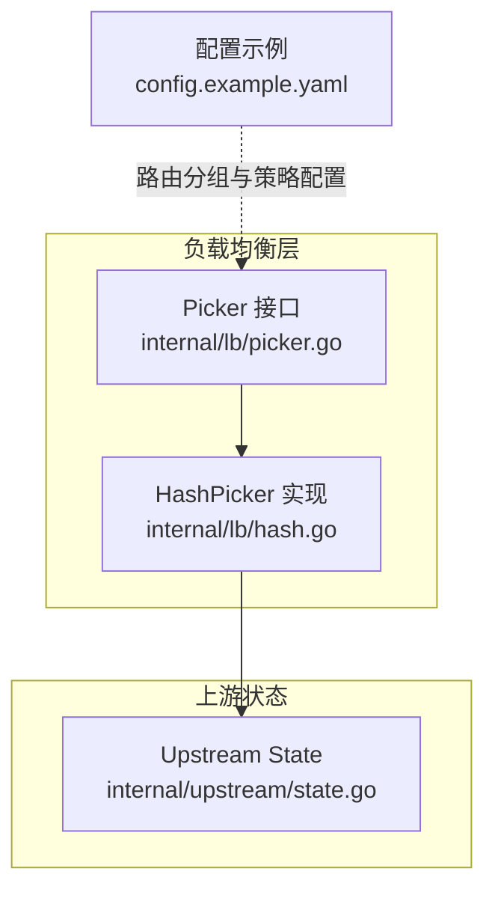
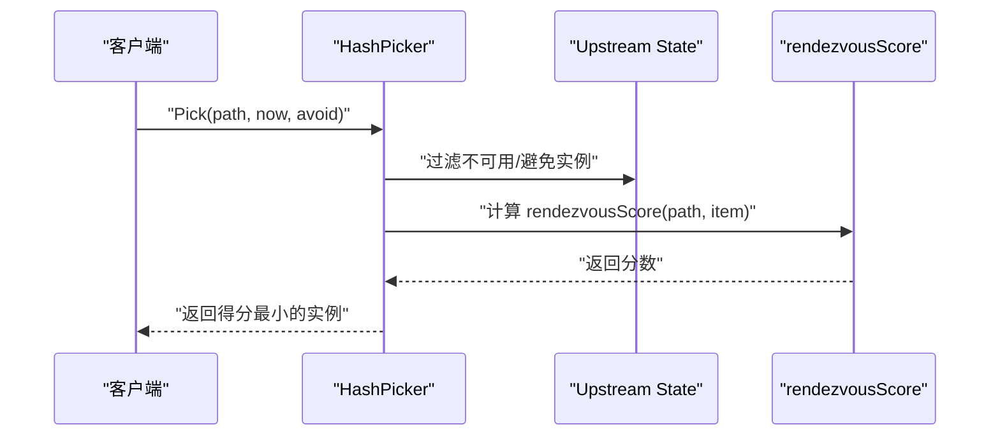
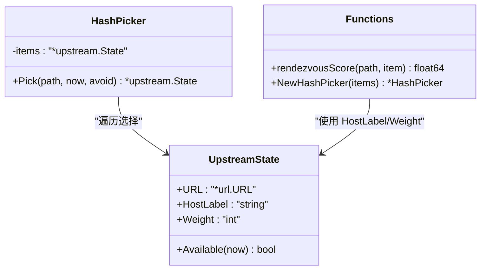
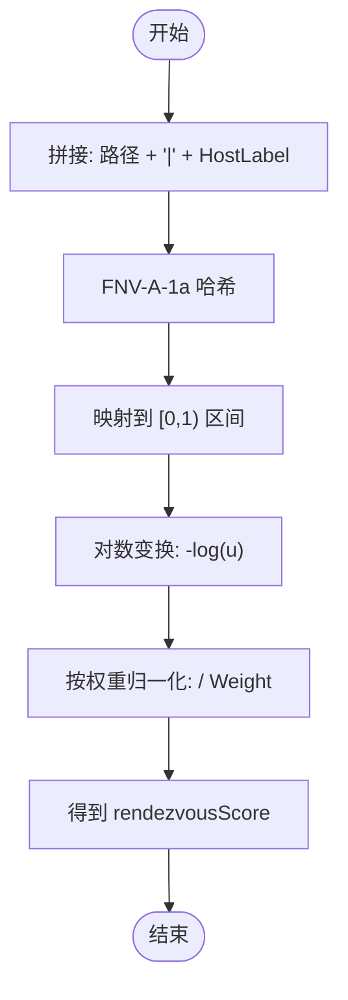
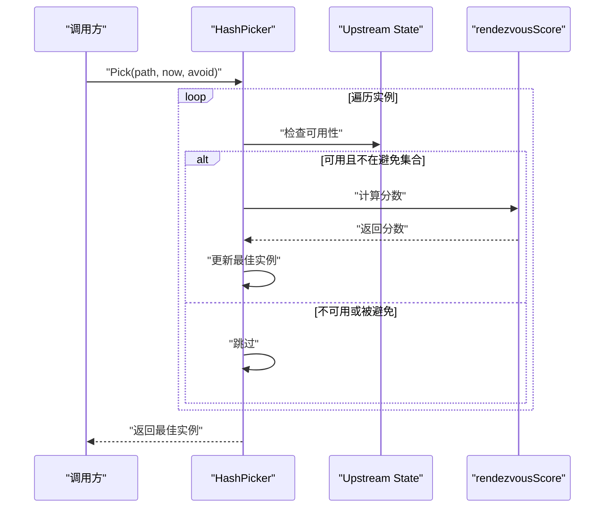
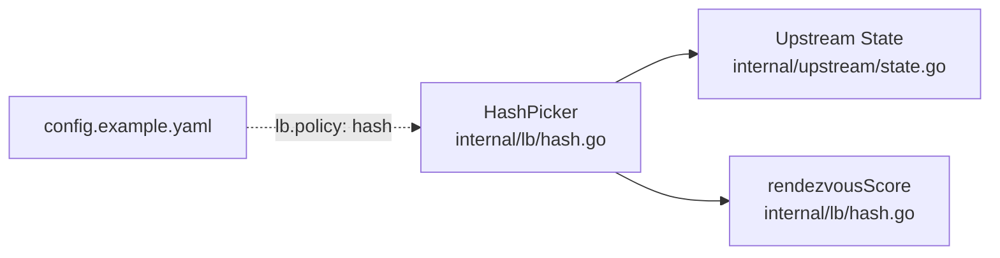

# 一致性哈希策略（Hash）

<cite>
**本文引用的文件**
- [internal/lb/hash.go](file://internal/lb/hash.go)
- [internal/lb/hash_test.go](file://internal/lb/hash_test.go)
- [internal/lb/picker.go](file://internal/lb/picker.go)
- [internal/upstream/state.go](file://internal/upstream/state.go)
- [config.example.yaml](file://config.example.yaml)
</cite>

## 目录
1. [简介](#简介)
2. [项目结构](#项目结构)
3. [核心组件](#核心组件)
4. [架构概览](#架构概览)
5. [详细组件分析](#详细组件分析)
6. [依赖关系分析](#依赖关系分析)
7. [性能考量](#性能考量)
8. [故障排查指南](#故障排查指南)
9. [结论](#结论)
10. [附录](#附录)

## 简介
本文件系统性阐述 HashPicker 基于“最高随机权重”（Rendezvous Hashing）的实现原理与工程实践。重点说明 Pick 方法如何使用 FNV-A-1a 哈希对请求路径与上游 HostLabel 组合进行哈希，将哈希值映射到单位区间后经对数变换，再按权重归一化得到 rendezvousScore，最终选择得分最小（即“最高随机权重”意义下的最优）的上游实例进行转发。该策略在会话保持、缓存亲和等场景具有显著优势：相同请求路径尽可能稳定地路由到同一后端实例，从而降低缓存击穿风险并提升命中率。

此外，文档对比了 O(n) 时间复杂度与环状一致性哈希的差异，强调无虚拟节点设计带来的内存效率与实现简洁性；并通过测试用例验证哈希稳定性；最后给出在配置文件中启用 lb.policy: hash 的方法与最佳实践建议。

## 项目结构
围绕负载均衡与上游状态管理的相关文件组织如下：
- 负载均衡接口与实现：internal/lb/picker.go、internal/lb/hash.go
- 上游实例状态模型：internal/upstream/state.go
- 配置示例：config.example.yaml
- 稳定性测试：internal/lb/hash_test.go

图表来源
- [internal/lb/picker.go](file://internal/lb/picker.go#L1-L12)
- [internal/lb/hash.go](file://internal/lb/hash.go#L1-L49)
- [internal/upstream/state.go](file://internal/upstream/state.go#L1-L109)
- [config.example.yaml](file://config.example.yaml#L181-L246)

章节来源
- [internal/lb/picker.go](file://internal/lb/picker.go#L1-L12)
- [internal/lb/hash.go](file://internal/lb/hash.go#L1-L49)
- [internal/upstream/state.go](file://internal/upstream/state.go#L1-L109)
- [config.example.yaml](file://config.example.yaml#L181-L246)

## 核心组件
- Picker 接口：定义统一的 Pick 方法签名，接收请求路径、当前时间与避免集合，返回上游实例。
- HashPicker：实现基于 Rendezvous Hashing 的选择器，内部维护上游实例列表。
- rendezvousScore：对“路径|HostLabel”组合进行 FNV-A-1a 哈希，映射到单位区间并做对数变换，再按权重归一化，得到可比较的分数。
- upstream.State：封装上游 URL、HostLabel、权重、可用性与健康状态等信息，并提供可用性判断。

章节来源
- [internal/lb/picker.go](file://internal/lb/picker.go#L1-L12)
- [internal/lb/hash.go](file://internal/lb/hash.go#L1-L49)
- [internal/upstream/state.go](file://internal/upstream/state.go#L1-L109)

## 架构概览
HashPicker 的工作流如下：
- 输入：请求路径、当前时间、避免集合
- 过程：遍历所有上游实例，过滤不可用与被避免的实例，计算 rendezvousScore，取最小者
- 输出：选定的上游实例

图表来源
- [internal/lb/hash.go](file://internal/lb/hash.go#L19-L38)
- [internal/lb/hash.go](file://internal/lb/hash.go#L40-L48)
- [internal/upstream/state.go](file://internal/upstream/state.go#L34-L41)

## 详细组件分析

### HashPicker 类与 rendezvousScore 函数
- 结构体字段：保存上游实例切片
- NewHashPicker：构造函数，注入上游实例列表
- Pick 方法：
  - 初始化最佳实例与最佳分数
  - 遍历实例，跳过 avoid 中的实例与不可用实例
  - 计算 rendezvousScore 并更新最佳实例
- rendezvousScore：
  - 使用 FNV-A-1a 对“路径|HostLabel”进行哈希
  - 将哈希值映射到单位半开区间 [0,1)
  - 对概率做对数变换，再按权重归一化，得到可比较的分数

图表来源
- [internal/lb/hash.go](file://internal/lb/hash.go#L11-L48)
- [internal/upstream/state.go](file://internal/upstream/state.go#L9-L32)

章节来源
- [internal/lb/hash.go](file://internal/lb/hash.go#L11-L48)
- [internal/upstream/state.go](file://internal/upstream/state.go#L9-L32)

### rendezvousScore 算法流程
- 输入：请求路径字符串、上游实例
- 步骤：
  - 对“路径|HostLabel”进行 FNV-A-1a 哈希
  - 将哈希值映射到 [0,1) 区间
  - 对概率做对数变换，再除以权重
  - 返回分数
- 选择策略：取最小分数对应的实例

图表来源
- [internal/lb/hash.go](file://internal/lb/hash.go#L40-L48)

章节来源
- [internal/lb/hash.go](file://internal/lb/hash.go#L40-L48)

### Pick 方法调用链与数据流
- 调用方：路由层或其他调用者
- 过滤条件：avoid 集合、可用性判断
- 评分与选择：遍历实例，计算分数，更新最佳实例
- 返回：最佳实例或空

图表来源
- [internal/lb/hash.go](file://internal/lb/hash.go#L19-L38)
- [internal/upstream/state.go](file://internal/upstream/state.go#L34-L41)

章节来源
- [internal/lb/hash.go](file://internal/lb/hash.go#L19-L38)
- [internal/upstream/state.go](file://internal/upstream/state.go#L34-L41)

### 稳定性与均匀性验证
- 测试目标：相同路径多次 Pick 应返回同一实例，验证稳定性
- 测试方法：构造两个上游实例，固定路径，重复调用 Pick 并断言结果一致
- 结论：该策略在相同路径下具备稳定的选择行为

章节来源
- [internal/lb/hash_test.go](file://internal/lb/hash_test.go#L11-L26)

## 依赖关系分析
- HashPicker 依赖 upstream.State 的 HostLabel 与 Weight 字段
- HashPicker 依赖 upstream.State 的 Available(now) 判断可用性
- rendezvousScore 依赖 FNV-A-1a 哈希库与数学库
- 配置层面通过路由分组的 lb.policy 指定策略

图表来源
- [internal/lb/hash.go](file://internal/lb/hash.go#L1-L49)
- [internal/upstream/state.go](file://internal/upstream/state.go#L1-L109)
- [config.example.yaml](file://config.example.yaml#L198-L204)

章节来源
- [internal/lb/hash.go](file://internal/lb/hash.go#L1-L49)
- [internal/upstream/state.go](file://internal/upstream/state.go#L1-L109)
- [config.example.yaml](file://config.example.yaml#L198-L204)

## 性能考量
- 时间复杂度：O(n)，其中 n 为上游实例数量。每次选择需遍历全部可用实例，计算一次哈希与一次对数运算，整体线性开销清晰可控。
- 空间复杂度：O(1)，仅常量额外空间。
- 与环状一致性哈希对比：
  - 环状哈希通常引入虚拟节点以提升分布均匀性，但会增加内存占用与实现复杂度。
  - HashPicker 采用“最高随机权重”思想，不使用虚拟节点，内存效率高、实现简洁，适合中小规模上游实例与对稳定性要求较高的场景。
- 权重影响：权重越大，归一化后的分数越小，更易被选中；权重越小，被选中概率越低，体现公平性与容量控制。

[本节为通用性能讨论，不直接分析具体文件]

## 故障排查指南
- 问题：Pick 返回空
  - 可能原因：所有实例均不可用或被避免集合排除
  - 排查要点：检查 upstream.State 的可用性判断逻辑与 avoid 参数
- 问题：路径变更导致实例频繁切换
  - 可能原因：HostLabel 或路径变化导致哈希输入变化
  - 排查要点：确认上游 HostLabel 与路径是否稳定；必要时调整上游配置或路由规则
- 问题：权重设置不合理
  - 可能原因：权重过小导致实例长期不被选中
  - 排查要点：根据实例容量与 SLA 调整权重，观察稳定性测试结果

章节来源
- [internal/lb/hash.go](file://internal/lb/hash.go#L19-L38)
- [internal/upstream/state.go](file://internal/upstream/state.go#L34-L41)

## 结论
HashPicker 通过 FNV-A-1a 哈希与对数变换构建“最高随机权重”评分体系，结合权重归一化实现稳定、可预期的路由选择。其 O(n) 复杂度与无虚拟节点设计在内存效率与实现简洁性上具备优势，特别适用于需要会话保持与缓存亲和的场景。配合稳定性测试与合理的权重配置，可在保证性能的同时提升系统可靠性。

[本节为总结性内容，不直接分析具体文件]

## 附录

### 配置方法：启用 lb.policy: hash
- 在路由分组中设置 lb.policy 为 "hash"
- 示例位置：config.example.yaml 中的 groups.rsshub-backup 分组已演示 hash 策略的使用方式

章节来源
- [config.example.yaml](file://config.example.yaml#L234-L246)

### 关键实现路径参考
- HashPicker 结构与 NewHashPicker 构造函数
  - [internal/lb/hash.go](file://internal/lb/hash.go#L11-L17)
- Pick 方法与选择逻辑
  - [internal/lb/hash.go](file://internal/lb/hash.go#L19-L38)
- rendezvousScore 计算细节
  - [internal/lb/hash.go](file://internal/lb/hash.go#L40-L48)
- 上游实例状态与可用性判断
  - [internal/upstream/state.go](file://internal/upstream/state.go#L34-L41)
- 稳定性测试用例
  - [internal/lb/hash_test.go](file://internal/lb/hash_test.go#L11-L26)