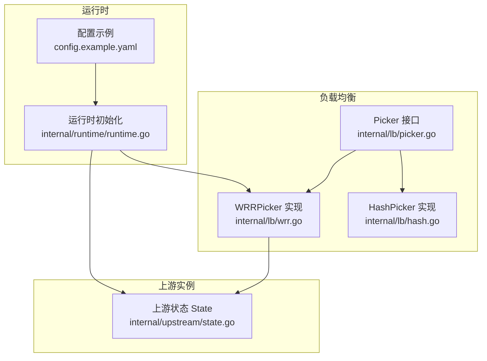
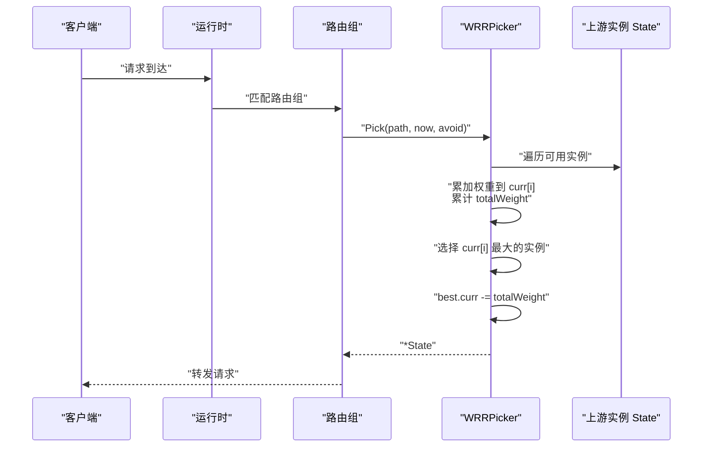
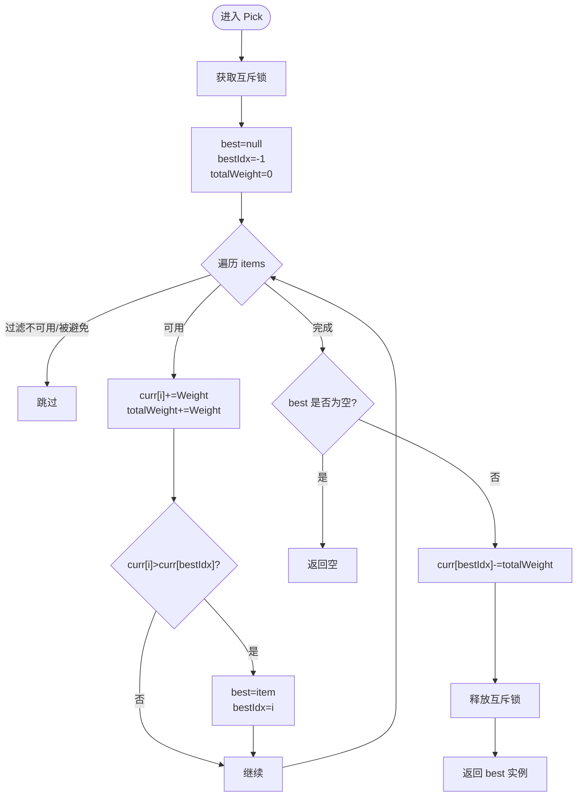
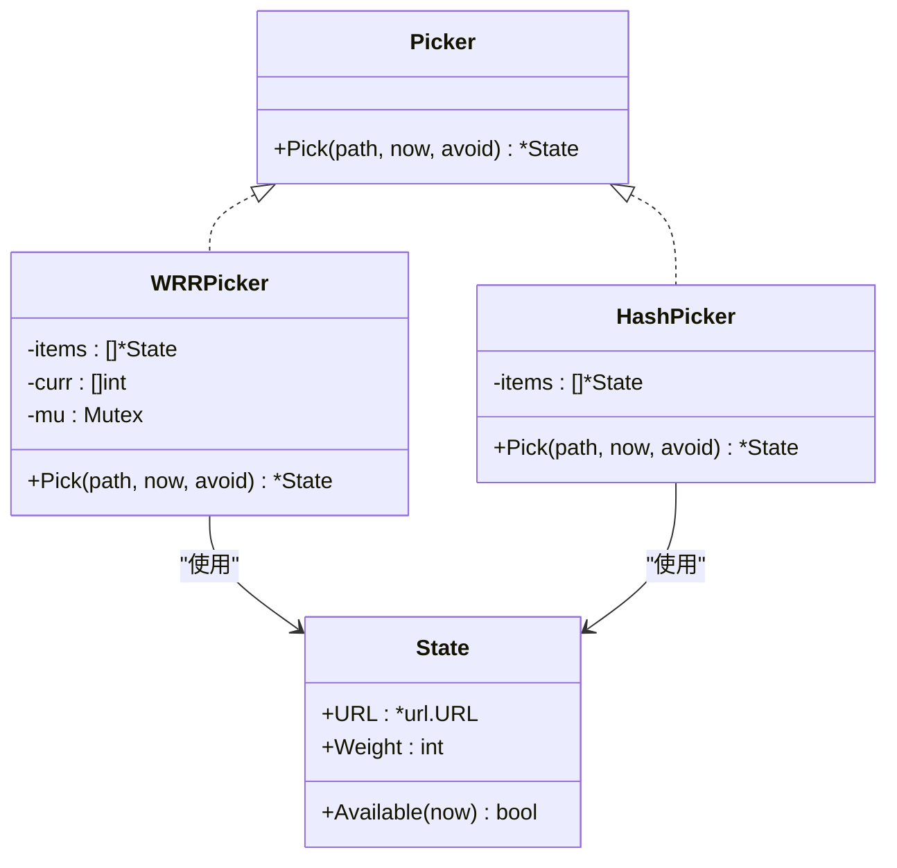

# 加权轮询策略 (WRR)

<cite>
**本文引用的文件**
- [wrr.go](file://internal/lb/wrr.go)
- [wrr_test.go](file://internal/lb/wrr_test.go)
- [picker.go](file://internal/lb/picker.go)
- [state.go](file://internal/upstream/state.go)
- [runtime.go](file://internal/runtime/runtime.go)
- [config.example.yaml](file://config.example.yaml)
</cite>

## 目录
1. [简介](#简介)
2. [项目结构](#项目结构)
3. [核心组件](#核心组件)
4. [架构概览](#架构概览)
5. [详细组件分析](#详细组件分析)
6. [依赖关系分析](#依赖关系分析)
7. [性能考量](#性能考量)
8. [故障排查指南](#故障排查指南)
9. [结论](#结论)
10. [附录](#附录)

## 简介
本文件深入解析加权轮询（Weighted Round Robin, WRR）策略在 RSSHub-Gateway 中的实现机制，重点围绕以下要点：
- 基于权重累加与“当前权重偏移量”的调度算法
- items 数组存储上游实例状态，curr 数组记录当前权重偏移量
- totalWeight 用于平滑加权轮询的总权重计算
- 使用 sync.Mutex 保证 Pick 方法的并发安全
- 通过 WRRPicker.Pick 的执行流程，解释如何实现高权重实例获得更多流量的公平分配
- 结合 wrr_test.go 的测试用例，验证不同权重配置下的流量分布准确性与公平性
- 提供在 config.yaml 中设置 lb.policy: wrr 及各 upstream 的 weight 值的配置示例，并说明适用场景

## 项目结构
WRR 实现位于内部负载均衡模块，配合上游实例状态管理与运行时配置加载共同工作。

图表来源
- [picker.go](file://internal/lb/picker.go#L1-L12)
- [wrr.go](file://internal/lb/wrr.go#L1-L51)
- [hash.go](file://internal/lb/hash.go#L1-L49)
- [state.go](file://internal/upstream/state.go#L1-L109)
- [runtime.go](file://internal/runtime/runtime.go#L60-L90)
- [config.example.yaml](file://config.example.yaml#L198-L233)

章节来源
- [picker.go](file://internal/lb/picker.go#L1-L12)
- [wrr.go](file://internal/lb/wrr.go#L1-L51)
- [state.go](file://internal/upstream/state.go#L1-L109)
- [runtime.go](file://internal/runtime/runtime.go#L60-L90)
- [config.example.yaml](file://config.example.yaml#L198-L233)

## 核心组件
- Picker 接口：定义 Pick(path, now, avoid) -> *State 的统一选择器接口，WRRPicker 和 HashPicker 均实现该接口。
- WRRPicker：基于权重累加与当前权重偏移量的平滑加权轮询选择器。
- upstream.State：封装上游实例的 URL、权重、健康状态、剔除时间等信息，并提供 Available(now) 判断可用性。
- 运行时初始化：根据配置选择 lb.policy 并创建对应 Picker；将上游实例转换为 State 并注入 Picker。

章节来源
- [picker.go](file://internal/lb/picker.go#L1-L12)
- [wrr.go](file://internal/lb/wrr.go#L1-L51)
- [state.go](file://internal/upstream/state.go#L1-L109)
- [runtime.go](file://internal/runtime/runtime.go#L60-L90)

## 架构概览
WRR 在运行时根据路由组配置选择策略。当 lb.policy 为 wrr 时，使用 WRRPicker；否则使用 HashPicker。WRRPicker 从上游实例集合中挑选一个可用实例，依据权重进行平滑分配。

图表来源
- [runtime.go](file://internal/runtime/runtime.go#L60-L90)
- [wrr.go](file://internal/lb/wrr.go#L22-L50)
- [state.go](file://internal/upstream/state.go#L34-L41)

## 详细组件分析

### WRRPicker 数据结构与字段
- items []*upstream.State：上游实例列表
- curr []int：每个实例的当前权重偏移量，初始为 0
- mu sync.Mutex：保护 Pick 执行期间的并发安全

章节来源
- [wrr.go](file://internal/lb/wrr.go#L10-L14)

### WRRPicker.Pick 执行流程
- 加锁：进入 Pick 时获取互斥锁，避免并发修改
- 遍历 items：对每个实例
  - 若在 avoid 集合中或不可用，则跳过
  - 将该实例的 Weight 累加到 curr[i]，并将 Weight 加入 totalWeight
  - 更新 best 指针与 bestIdx（curr[i] 更大时更新）
- 若无可用实例，返回空
- 否则，将 best 实例的 curr[bestIdx] 减去 totalWeight，作为本轮“权重偏移量”的衰减
- 返回 best 实例

图表来源
- [wrr.go](file://internal/lb/wrr.go#L22-L50)

章节来源
- [wrr.go](file://internal/lb/wrr.go#L22-L50)

### 并发安全与原子性
- Pick 方法通过 sync.Mutex 保证整个选择过程的原子性，避免多个 goroutine 同时修改 curr、totalWeight 与 best 指针导致的竞争条件
- upstream.State 的 Available(now) 与健康状态相关操作均使用互斥锁保护，确保在 Pick 期间不会出现竞态

章节来源
- [wrr.go](file://internal/lb/wrr.go#L12-L14)
- [state.go](file://internal/upstream/state.go#L34-L41)

### 平滑加权轮询的数学原理
- 每次迭代将所有可用实例的 curr[i] 增加其 Weight，相当于为每个实例累积“权重分数”
- 选择分数最高的实例作为本轮输出
- 本轮结束后，将该实例的 curr[bestIdx] 减去 totalWeight，使其他实例有机会在下一轮获得更高分数
- 这种方式避免了简单整数倍轮询的“突发性”，实现了更平滑的流量分配

章节来源
- [wrr.go](file://internal/lb/wrr.go#L28-L49)

### 测试用例验证
- 测试构造两个权重分别为 3 与 1 的上游实例，连续选择 40 次
- 断言：权重高的实例被选择的次数更多，且至少达到权重比的两倍以上，以体现权重倾斜效果

章节来源
- [wrr_test.go](file://internal/lb/wrr_test.go#L11-L30)

### 配置示例与适用场景
- 在路由组配置中设置 lb.policy: wrr，即可启用 WRR 策略
- 为每个上游实例设置 weight 字段，权重越大，获得的流量越多
- 适用于后端实例性能异构且需要精确控制流量分配的场景，例如：
  - 不同实例硬件能力差异较大
  - 需要按比例分配流量而非随机或一致性哈希
  - 对流量分布的平滑性有要求

章节来源
- [config.example.yaml](file://config.example.yaml#L198-L233)

## 依赖关系分析
- Picker 接口统一了选择器抽象，WRRPicker 与 HashPicker 并列实现
- WRRPicker 依赖 upstream.State 的权重与可用性判断
- 运行时根据配置选择策略并创建对应 Picker，注入上游实例状态

图表来源
- [picker.go](file://internal/lb/picker.go#L1-L12)
- [wrr.go](file://internal/lb/wrr.go#L1-L51)
- [hash.go](file://internal/lb/hash.go#L1-L49)
- [state.go](file://internal/upstream/state.go#L1-L109)

章节来源
- [picker.go](file://internal/lb/picker.go#L1-L12)
- [wrr.go](file://internal/lb/wrr.go#L1-L51)
- [hash.go](file://internal/lb/hash.go#L1-L49)
- [state.go](file://internal/upstream/state.go#L1-L109)

## 性能考量
- 时间复杂度：每次 Pick 为 O(n)，n 为上游实例数量
- 空间复杂度：curr 数组与 items 数组线性规模
- 锁粒度：Pick 内部持有互斥锁，避免竞争但可能成为热点；建议在高并发场景下评估锁争用
- 可扩展性：若上游实例数量较多，可考虑减少锁持有时间或采用更细粒度的并发控制策略

## 故障排查指南
- 无可用实例：当所有实例均不可用或被避免时，Pick 返回空。请检查上游健康状态与剔除时间
- 权重未生效：确认配置中为每个上游设置了 weight，并且 lb.policy 设置为 wrr
- 并发问题：如出现选择结果异常，请检查是否存在外部并发调用 Pick 且未正确同步

章节来源
- [wrr.go](file://internal/lb/wrr.go#L22-L50)
- [state.go](file://internal/upstream/state.go#L34-L41)
- [runtime.go](file://internal/runtime/runtime.go#L60-L90)

## 结论
WRRPicker 通过“权重累加 + 当前权重偏移量”的机制，在每次选择中将所有可用实例的 curr[i] 增加其 Weight，并选择分数最高的实例；随后以 totalWeight 为步长对最佳实例进行衰减，从而实现平滑的加权轮询。配合 sync.Mutex 保证并发安全，结合测试用例验证了不同权重配置下的流量分布公平性。在配置层面，只需在路由组中设置 lb.policy: wrr 与各 upstream 的 weight，即可在性能异构的后端环境中实现精确而平滑的流量分配。

## 附录

### 配置示例（摘自 config.example.yaml）
- 在路由组的 lb 字段设置 policy: wrr
- 在 upstreams 中为每个上游设置 weight 值
- 示例位置参考：[config.example.yaml](file://config.example.yaml#L198-L233)

章节来源
- [config.example.yaml](file://config.example.yaml#L198-L233)