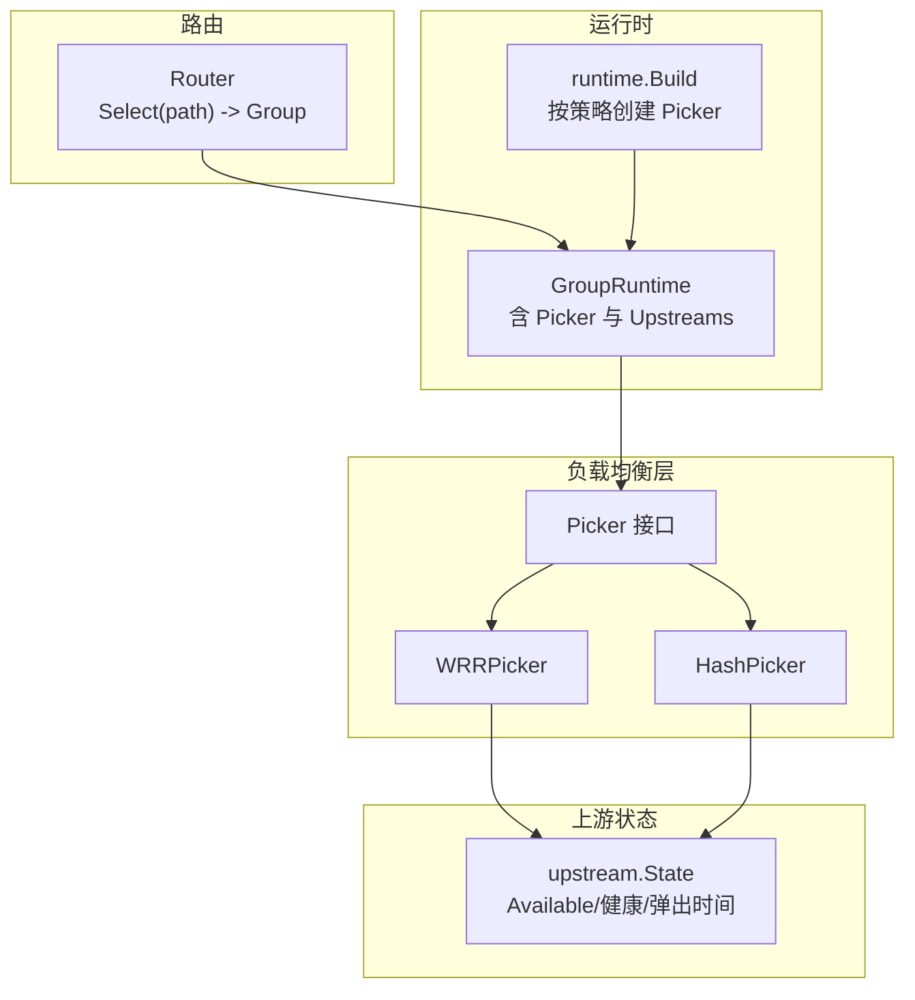
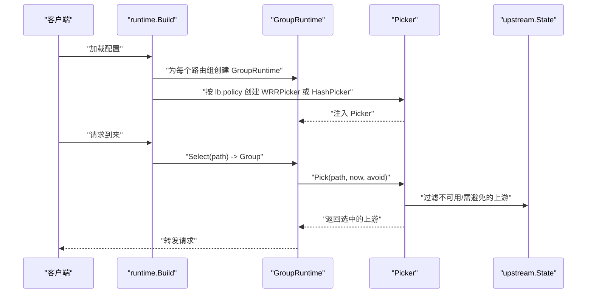
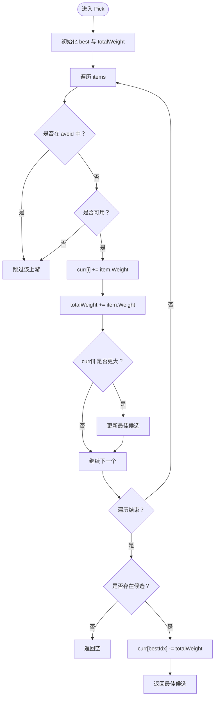
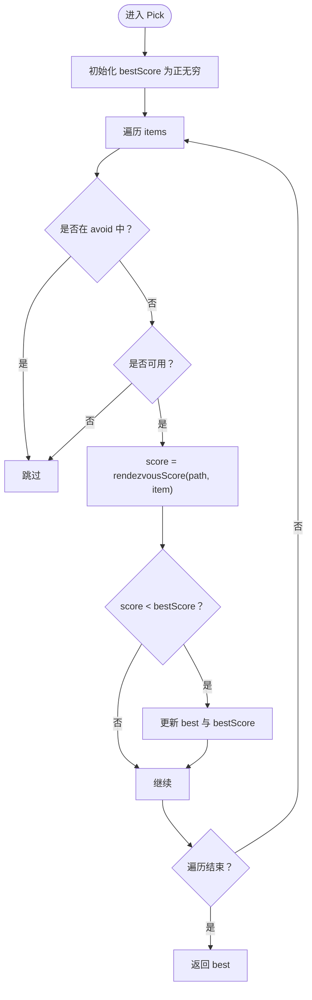
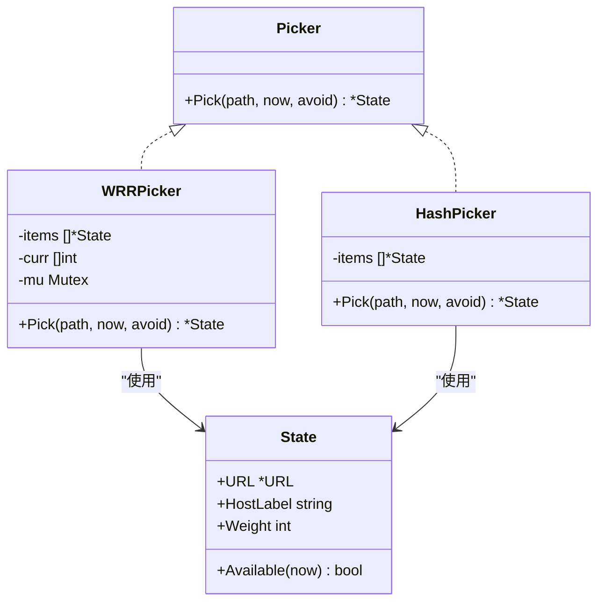
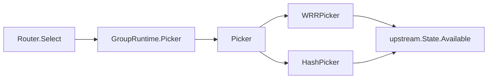
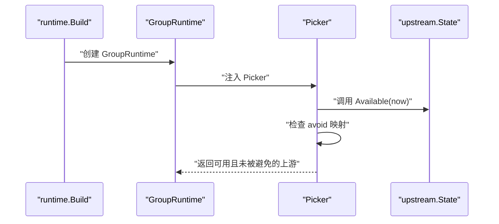

# 负载均衡策略

<cite>
**本文引用的文件**
- [internal/lb/picker.go](file://internal/lb/picker.go)
- [internal/lb/wrr.go](file://internal/lb/wrr.go)
- [internal/lb/hash.go](file://internal/lb/hash.go)
- [internal/lb/wrr_test.go](file://internal/lb/wrr_test.go)
- [internal/lb/hash_test.go](file://internal/lb/hash_test.go)
- [internal/upstream/state.go](file://internal/upstream/state.go)
- [internal/runtime/runtime.go](file://internal/runtime/runtime.go)
- [internal/router/router.go](file://internal/router/router.go)
- [openspec/changes/add-v0-1-basic-routing-lb/specs/gateway-routing/spec.md](file://openspec/changes/add-v0-1-basic-routing-lb/specs/gateway-routing/spec.md)
</cite>

## 目录
1. [简介](#简介)
2. [项目结构](#项目结构)
3. [核心组件](#核心组件)
4. [架构总览](#架构总览)
5. [详细组件分析](#详细组件分析)
6. [依赖关系分析](#依赖关系分析)
7. [性能考量](#性能考量)
8. [故障转移与避免机制](#故障转移与避免机制)
9. [选择指南：何时使用 WRR 或 Hash](#选择指南何时使用-wrr-或-hash)
10. [结论](#结论)
11. [附录](#附录)

## 简介
本文件系统性解析 RSSHub-Gateway 中的两种负载均衡策略：加权轮询（WRR）与一致性哈希（Hash）。围绕 WRRPicker 的“平滑加权轮询”调度算法，重点阐述 curr 数组与 totalWeight 在权重累加与原子递减中的作用；针对 HashPicker，深入剖析基于 Rendezvous Hashing 的 rendezvousScore 计算流程，解释 FNV-A 哈希与权重归一化对负载均衡性与稳定性的影响，并通过测试用例验证流量分布与路径稳定性。最后给出两种策略的适用场景、性能特征与资源消耗对比，以及如何在配置中选择合适的 lb.policy 并结合 avoid 机制进行故障转移。

## 项目结构
- 负载均衡器位于 internal/lb，包含接口定义与两种实现：
  - 接口：Picker（Pick 方法接收 path、当前时间、避免集合）
  - 实现：WRRPicker、HashPicker
- 上游节点状态位于 internal/upstream/state.go，提供可用性判断与健康状态记录
- 运行时构建逻辑位于 internal/runtime/runtime.go，按路由组配置实例化对应 Picker
- 路由选择位于 internal/router/router.go，将请求映射到路由组

图表来源
- [internal/lb/picker.go](file://internal/lb/picker.go#L9-L11)
- [internal/lb/wrr.go](file://internal/lb/wrr.go#L10-L21)
- [internal/lb/hash.go](file://internal/lb/hash.go#L11-L17)
- [internal/upstream/state.go](file://internal/upstream/state.go#L34-L41)
- [internal/runtime/runtime.go](file://internal/runtime/runtime.go#L50-L97)
- [internal/router/router.go](file://internal/router/router.go#L29-L56)

章节来源
- [internal/lb/picker.go](file://internal/lb/picker.go#L9-L11)
- [internal/lb/wrr.go](file://internal/lb/wrr.go#L10-L21)
- [internal/lb/hash.go](file://internal/lb/hash.go#L11-L17)
- [internal/upstream/state.go](file://internal/upstream/state.go#L34-L41)
- [internal/runtime/runtime.go](file://internal/runtime/runtime.go#L50-L97)
- [internal/router/router.go](file://internal/router/router.go#L29-L56)

## 核心组件
- Picker 接口：统一的 Pick(path, now, avoid) 策略入口，返回一个可用的上游节点
- WRRPicker：基于权重累加与 totalWeight 原子递减的平滑加权轮询
- HashPicker：基于 Rendezvous Hashing 的路径一致性哈希，使用 FNV-A 哈希与权重归一化
- upstream.State：封装上游节点 URL、权重、健康状态、弹出时间等，并提供 Available(now) 判断

章节来源
- [internal/lb/picker.go](file://internal/lb/picker.go#L9-L11)
- [internal/lb/wrr.go](file://internal/lb/wrr.go#L10-L21)
- [internal/lb/hash.go](file://internal/lb/hash.go#L11-L17)
- [internal/upstream/state.go](file://internal/upstream/state.go#L34-L41)

## 架构总览
运行时在构建阶段根据路由组的 lb.policy 创建对应的 Picker，并将其注入到 GroupRuntime 中。请求到达时，Router 先根据路径选择路由组，随后由该组的 Picker 从可用上游中挑选一个节点。

图表来源
- [internal/runtime/runtime.go](file://internal/runtime/runtime.go#L50-L97)
- [internal/router/router.go](file://internal/router/router.go#L29-L56)
- [internal/lb/picker.go](file://internal/lb/picker.go#L9-L11)
- [internal/upstream/state.go](file://internal/upstream/state.go#L34-L41)

## 详细组件分析

### WRRPicker：平滑加权轮询
- 数据结构
  - items：上游节点列表
  - curr：与 items 对应的“当前权重”数组，用于平滑调度
  - mu：互斥锁，保证 Pick 的并发安全
- 核心流程
  - 遍历所有上游，跳过被 avoid 标记或不可用的节点
  - 将当前节点的权重累加到 curr[i]，并累计 totalWeight
  - 记录 curr 最大的节点作为最佳候选
  - 若存在候选，则将 bestIdx 的 curr 减去 totalWeight，实现“平滑”滚动
- 关键点
  - curr[i] 的累加使高权重节点更频繁地成为最大值，从而提升命中概率
  - totalWeight 作为权重总和，确保每次只减去一次 totalWeight，形成稳定的轮转步长
  - 使用互斥锁保护 Pick 的执行，避免竞态条件
- 测试验证
  - 通过固定权重的两个上游进行多次 Pick，断言高权重上游被更多次选中，且权重倾斜明显

图表来源
- [internal/lb/wrr.go](file://internal/lb/wrr.go#L23-L49)

章节来源
- [internal/lb/wrr.go](file://internal/lb/wrr.go#L10-L21)
- [internal/lb/wrr.go](file://internal/lb/wrr.go#L23-L49)
- [internal/lb/wrr_test.go](file://internal/lb/wrr_test.go#L11-L30)

### HashPicker：Rendezvous 一致性哈希
- 数据结构
  - items：上游节点列表
- 核心流程
  - 遍历所有上游，跳过被 avoid 标记或不可用的节点
  - 对每个候选上游计算 rendezvousScore(path, item)
  - 返回得分最小的上游（越小越近）
- rendezvousScore 计算
  - 使用 FNV-A 哈希对 “path | HostLabel” 进行哈希，得到 64 位无符号整数
  - 将哈希值映射到 [0,1) 区间 u
  - 计算 -log(u) / item.Weight，权重越大，分母越大，得分越小
- 关键点
  - FNV-A 哈希具备良好的分散性，能有效降低碰撞
  - 权重归一化使高权重上游在得分上更优，但不会完全“独占”
  - 同一 path 在同一组内稳定落到同一上游，有利于会话保持与缓存亲和

图表来源
- [internal/lb/hash.go](file://internal/lb/hash.go#L19-L38)
- [internal/lb/hash.go](file://internal/lb/hash.go#L40-L49)

章节来源
- [internal/lb/hash.go](file://internal/lb/hash.go#L11-L17)
- [internal/lb/hash.go](file://internal/lb/hash.go#L19-L38)
- [internal/lb/hash.go](file://internal/lb/hash.go#L40-L49)
- [internal/lb/hash_test.go](file://internal/lb/hash_test.go#L11-L26)

### 类关系图

图表来源
- [internal/lb/picker.go](file://internal/lb/picker.go#L9-L11)
- [internal/lb/wrr.go](file://internal/lb/wrr.go#L10-L21)
- [internal/lb/hash.go](file://internal/lb/hash.go#L11-L17)
- [internal/upstream/state.go](file://internal/upstream/state.go#L34-L41)

## 依赖关系分析
- Picker 接口被 GroupRuntime 持有，运行时按路由组配置选择具体实现
- upstream.State 提供可用性判断，影响 Pick 的候选集
- Router 负责将请求映射到路由组，再由组内的 Picker 选择上游

图表来源
- [internal/router/router.go](file://internal/router/router.go#L29-L56)
- [internal/runtime/runtime.go](file://internal/runtime/runtime.go#L50-L97)
- [internal/lb/picker.go](file://internal/lb/picker.go#L9-L11)
- [internal/upstream/state.go](file://internal/upstream/state.go#L34-L41)

章节来源
- [internal/router/router.go](file://internal/router/router.go#L29-L56)
- [internal/runtime/runtime.go](file://internal/runtime/runtime.go#L50-L97)
- [internal/lb/picker.go](file://internal/lb/picker.go#L9-L11)
- [internal/upstream/state.go](file://internal/upstream/state.go#L34-L41)

## 性能考量
- 时间复杂度
  - WRRPicker：单次 Pick 遍历 O(n)，n 为上游数量；包含常数级哈希与浮点运算
  - HashPicker：单次 Pick 遍历 O(n)，包含一次 FNV-A 哈希与一次对数运算
- 空间复杂度
  - WRRPicker：O(n) 存储 curr 与 items
  - HashPicker：O(n) 存储 items
- 并发与锁
  - WRRPicker 使用互斥锁保护 Pick，适合中低并发场景；若并发极高，可考虑无锁优化（例如使用原子操作或分段锁）
  - HashPicker 无共享可变状态，天然无锁
- 分布性与稳定性
  - WRR 更偏向“按权重分配”，适合吞吐优先的场景
  - Hash 在同一组内对相同 path 保持稳定，适合需要会话保持与缓存亲和的场景

## 故障转移与避免机制
- avoid 机制
  - Pick 接口接收 avoid map，用于跳过当前已知不可用或需要绕过的上游
  - WRRPicker 与 HashPicker 在遍历时均检查 avoid，确保仅从候选集中选择
- upstream.State 可用性
  - Available(now) 基于健康状态与弹出时间判断，避免将请求发送给暂时不可用的上游
- 运行时集成
  - runtime.Build 会为每个路由组创建 Picker，并在后续路由选择中使用该 Picker
  - 当上游健康状态变化或被被动弹出时，Pick 会自动避开这些节点

图表来源
- [internal/runtime/runtime.go](file://internal/runtime/runtime.go#L50-L97)
- [internal/lb/picker.go](file://internal/lb/picker.go#L9-L11)
- [internal/upstream/state.go](file://internal/upstream/state.go#L34-L41)

章节来源
- [internal/lb/picker.go](file://internal/lb/picker.go#L9-L11)
- [internal/upstream/state.go](file://internal/upstream/state.go#L34-L41)
- [internal/runtime/runtime.go](file://internal/runtime/runtime.go#L50-L97)

## 选择指南：何时使用 WRR 或 Hash
- 适用场景
  - WRR：多上游权重不同、追求按权重分配流量、吞吐优先
  - Hash：需要路径级别的稳定性（会话保持、缓存亲和），同一 path 始终落到同一上游
- 性能与资源
  - WRR：需要维护 curr 数组，内存占用与上游数量线性相关；Pick 为 O(n)
  - Hash：无需额外状态，内存占用与上游数量线性相关；Pick 为 O(n)
- 配置建议
  - 在路由组配置中设置 lb.policy 为 "wrr" 或 "hash"
  - 通过 upstream.weight 设置权重，影响 WRR 的分配比例或 Hash 的得分归一化

章节来源
- [openspec/changes/add-v0-1-basic-routing-lb/specs/gateway-routing/spec.md](file://openspec/changes/add-v0-1-basic-routing-lb/specs/gateway-routing/spec.md#L22-L34)
- [internal/runtime/runtime.go](file://internal/runtime/runtime.go#L68-L74)

## 结论
- WRRPicker 通过 curr 与 totalWeight 的配合，实现了平滑加权轮询，适合按权重分配流量的场景
- HashPicker 基于 Rendezvous Hashing，利用 FNV-A 哈希与权重归一化，提供路径稳定性，适合会话保持与缓存亲和
- 两者均通过 avoid 与 upstream.State 的 Available(now) 机制参与故障转移
- 在配置层面，通过 lb.policy 选择策略，并结合权重与上游数量评估性能与资源消耗，以满足业务目标

## 附录
- 测试用例参考
  - WRR 分布性测试：验证高权重上游被更多次选中，且权重倾斜明显
  - Hash 稳定性测试：同一 path 多次选择同一上游
- 规范说明
  - 路由组支持 per-group load balancing，策略包括 smooth WRR 与 hash(path)

章节来源
- [internal/lb/wrr_test.go](file://internal/lb/wrr_test.go#L11-L30)
- [internal/lb/hash_test.go](file://internal/lb/hash_test.go#L11-L26)
- [openspec/changes/add-v0-1-basic-routing-lb/specs/gateway-routing/spec.md](file://openspec/changes/add-v0-1-basic-routing-lb/specs/gateway-routing/spec.md#L22-L34)