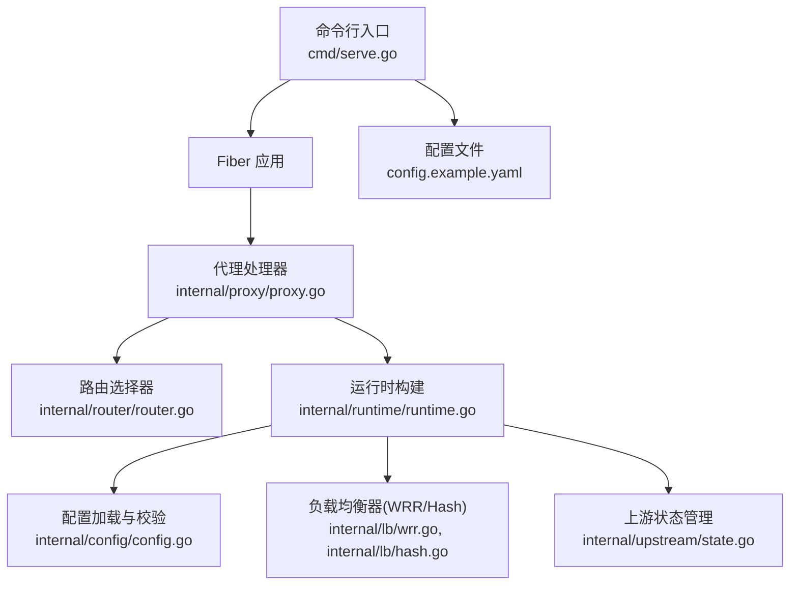
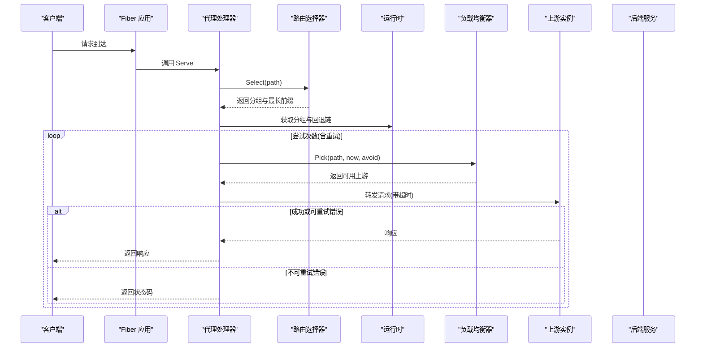
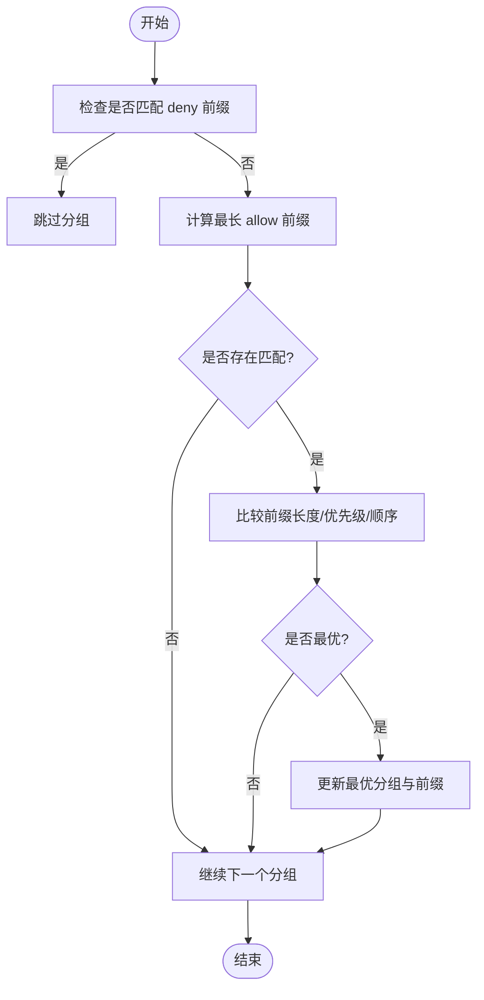
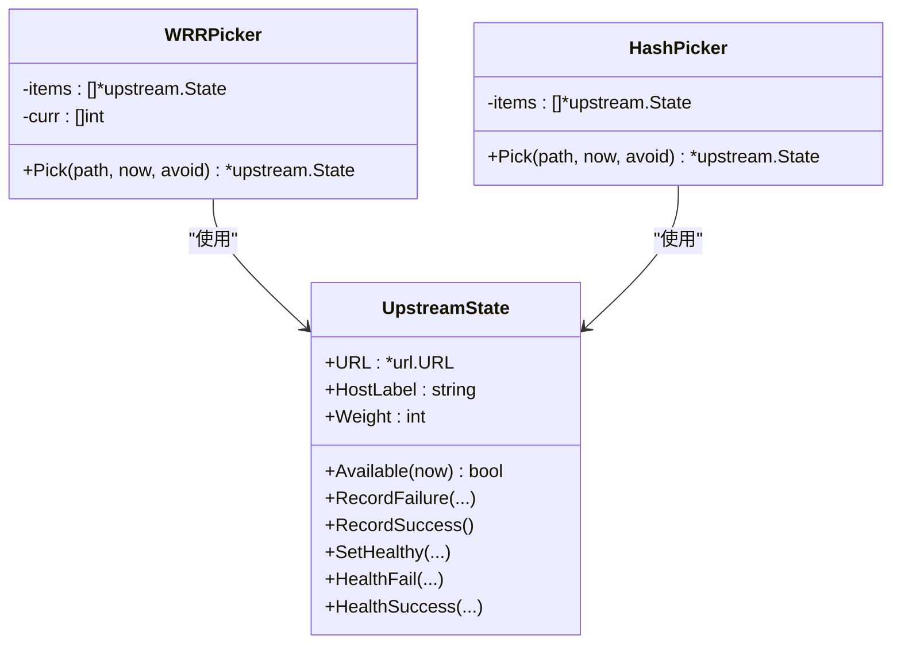
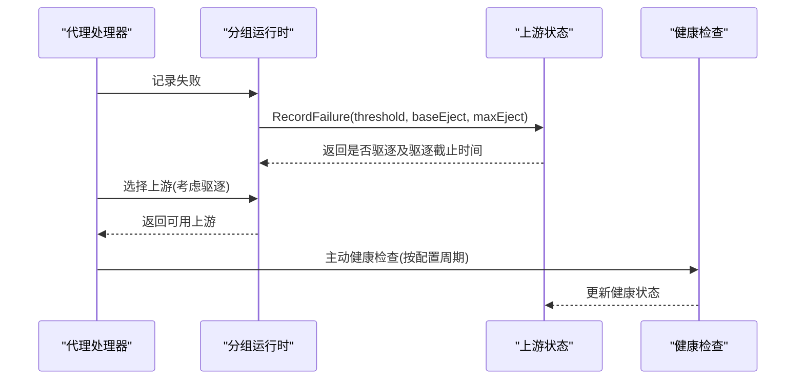
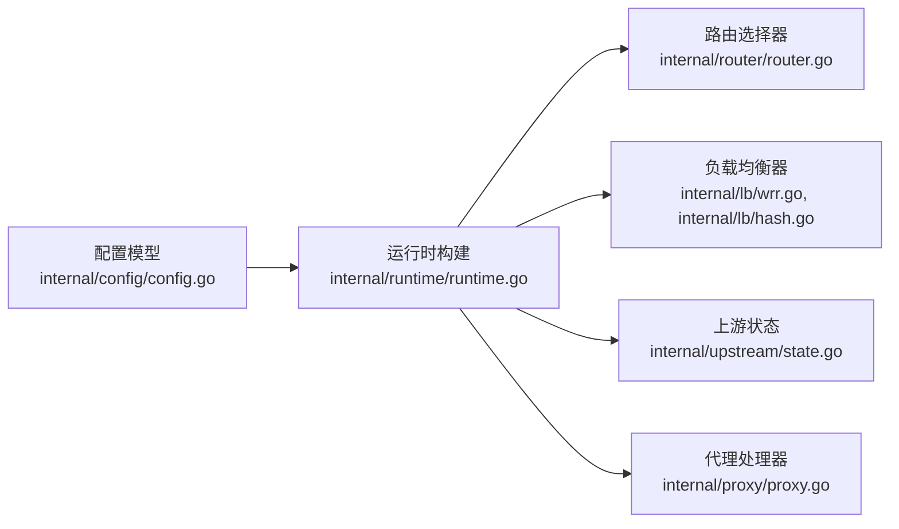

# 路由与负载均衡

<cite>
**本文引用的文件列表**
- [internal/config/config.go](file://internal/config/config.go)
- [internal/router/router.go](file://internal/router/router.go)
- [internal/runtime/runtime.go](file://internal/runtime/runtime.go)
- [internal/runtime/manager.go](file://internal/runtime/manager.go)
- [internal/proxy/proxy.go](file://internal/proxy/proxy.go)
- [internal/lb/wrr.go](file://internal/lb/wrr.go)
- [internal/lb/hash.go](file://internal/lb/hash.go)
- [internal/upstream/state.go](file://internal/upstream/state.go)
- [cmd/serve.go](file://cmd/serve.go)
- [config.example.yaml](file://config.example.yaml)
</cite>

## 目录
1. [简介](#简介)
2. [项目结构](#项目结构)
3. [核心组件](#核心组件)
4. [架构总览](#架构总览)
5. [详细组件分析](#详细组件分析)
6. [依赖关系分析](#依赖关系分析)
7. [性能考量](#性能考量)
8. [故障排查指南](#故障排查指南)
9. [结论](#结论)
10. [附录：配置示例与最佳实践](#附录配置示例与最佳实践)

## 简介
本文件围绕“路由与负载均衡”主题，系统性阐述 RSSHub-Gateway 的分组路由与负载均衡机制。重点解析 groups 块中的关键字段：name、backend、strip_prefix、priority、allow、deny、lb.policy 和 upstreams，并结合 internal/config/config.go 中的 GroupConfig 与 UpstreamConfig 结构体，说明：
- 分组路由的匹配优先级规则（前缀匹配、优先级、顺序）
- 负载均衡策略（WRR 与 Hash）的配置与行为
- 上游实例权重设置、健康检查关联与被动驱逐（故障回退链）
- 多活架构与灰度发布的高级场景配置思路
- 配置验证阶段对分组名唯一性、URL 合法性等约束的实现

## 项目结构
从入口到运行时，请求在 Fiber 框架下进入代理处理器，经由路由选择器定位目标分组，再通过负载均衡器挑选上游实例，最终转发至后端服务并支持缓存、可观测性与自动重载。

图表来源
- [cmd/serve.go](file://cmd/serve.go#L1-L66)
- [internal/proxy/proxy.go](file://internal/proxy/proxy.go#L1-L120)
- [internal/router/router.go](file://internal/router/router.go#L1-L80)
- [internal/runtime/runtime.go](file://internal/runtime/runtime.go#L1-L127)
- [internal/config/config.go](file://internal/config/config.go#L1-L120)
- [internal/lb/wrr.go](file://internal/lb/wrr.go#L1-L51)
- [internal/lb/hash.go](file://internal/lb/hash.go#L1-L49)
- [internal/upstream/state.go](file://internal/upstream/state.go#L1-L109)
- [config.example.yaml](file://config.example.yaml)

章节来源
- [cmd/serve.go](file://cmd/serve.go#L1-L66)
- [internal/proxy/proxy.go](file://internal/proxy/proxy.go#L1-L120)
- [internal/router/router.go](file://internal/router/router.go#L1-L80)
- [internal/runtime/runtime.go](file://internal/runtime/runtime.go#L1-L127)
- [internal/config/config.go](file://internal/config/config.go#L1-L120)

## 核心组件
- 配置模型与校验：定义了 GroupConfig、UpstreamConfig、LBConfig、HealthConfig 等结构体，并在加载时应用默认值、归一化路径、以及严格的校验逻辑（如分组名唯一性、URL 合法性、权重合法性、后端类型限制等）。
- 路由选择器：基于 allow/deny 前缀匹配、priority 优先级、以及分组在配置中的顺序，确定命中分组与最长前缀。
- 运行时构建：将配置转换为运行时对象，初始化负载均衡器（WRR/Hash）、上游状态、健康检查任务与故障回退链。
- 代理处理器：执行认证、缓存、路由选择、负载均衡、转发、重试与日志记录；支持多活与灰度的回退链。
- 负载均衡器：WRR（加权轮询）与 Hash（一致性哈希）两种策略，均考虑上游可用性与权重。
- 上游状态：维护健康状态、连续失败计数、驱逐时间窗口与退避策略，支撑被动驱逐与故障回退。

章节来源
- [internal/config/config.go](file://internal/config/config.go#L110-L144)
- [internal/router/router.go](file://internal/router/router.go#L1-L80)
- [internal/runtime/runtime.go](file://internal/runtime/runtime.go#L50-L127)
- [internal/proxy/proxy.go](file://internal/proxy/proxy.go#L120-L220)
- [internal/lb/wrr.go](file://internal/lb/wrr.go#L1-L51)
- [internal/lb/hash.go](file://internal/lb/hash.go#L1-L49)
- [internal/upstream/state.go](file://internal/upstream/state.go#L1-L109)

## 架构总览
下图展示一次请求从进入网关到后端的完整流程，包括路由选择、负载均衡、健康检查与故障回退链。

图表来源
- [internal/proxy/proxy.go](file://internal/proxy/proxy.go#L120-L220)
- [internal/router/router.go](file://internal/router/router.go#L29-L56)
- [internal/lb/wrr.go](file://internal/lb/wrr.go#L23-L50)
- [internal/lb/hash.go](file://internal/lb/hash.go#L19-L49)
- [internal/upstream/state.go](file://internal/upstream/state.go#L34-L109)

## 详细组件分析

### 分组路由匹配与优先级规则
- 匹配条件：
  - deny 列表优先于 allow 列表，若路径以任一 deny 前缀开头则跳过该分组。
  - 在未被拒绝的前提下，计算路径与 allow 前缀的最长匹配长度。
- 选择策略：
  - 优先选择最长前缀匹配的分组；
  - 若前缀长度相同，则比较 priority；
  - 若 priority 也相同，则按分组在配置中的顺序（order）从小到大选择。
- 默认路由：
  - 若无分组命中，返回默认分组与默认前缀标识。

图表来源
- [internal/router/router.go](file://internal/router/router.go#L29-L56)

章节来源
- [internal/router/router.go](file://internal/router/router.go#L1-L80)

### 负载均衡策略（WRR 与 Hash）
- WRR（加权轮询）：
  - 维护每个上游的当前分数，每次将对应权重加到分数上，选择分数最高的可用上游，然后将其分数减去总权重。
  - 支持避免已知不可用的上游（避免环路与重试抖动）。
- Hash（一致性哈希）：
  - 使用 FNV 哈希对路径与上游 HostLabel 组合进行打分，取最小得分的上游。
  - 得分与权重相关，权重越小得分越低，从而提升命中概率。
  - 对同一路径在同一时刻具有稳定性（在上游集合不变时）。

图表来源
- [internal/lb/wrr.go](file://internal/lb/wrr.go#L1-L51)
- [internal/lb/hash.go](file://internal/lb/hash.go#L1-L49)
- [internal/upstream/state.go](file://internal/upstream/state.go#L1-L109)

章节来源
- [internal/lb/wrr.go](file://internal/lb/wrr.go#L1-L51)
- [internal/lb/hash.go](file://internal/lb/hash.go#L1-L49)
- [internal/upstream/state.go](file://internal/upstream/state.go#L1-L109)

### 上游实例权重、健康检查与故障回退链
- 权重设置：
  - 在 UpstreamConfig 中为每个上游指定 weight，默认值在配置归一化阶段补齐。
- 可用性判断：
  - upstream.State.Available(now) 会考虑健康状态与驱逐时间窗口。
- 健康检查：
  - 运行时启动后，若分组启用了主动健康检查，将为该分组的每个上游启动健康检查任务。
- 被动驱逐与回退链：
  - 代理处理中根据错误类型与阈值触发被动驱逐，记录驱逐直至某个时间点。
  - 回退链由分组的 fallback_groups 决定，按顺序尝试多个分组，支持多活与灰度发布。

图表来源
- [internal/proxy/proxy.go](file://internal/proxy/proxy.go#L276-L299)
- [internal/runtime/runtime.go](file://internal/runtime/runtime.go#L120-L124)
- [internal/upstream/state.go](file://internal/upstream/state.go#L84-L109)

章节来源
- [internal/proxy/proxy.go](file://internal/proxy/proxy.go#L276-L299)
- [internal/runtime/runtime.go](file://internal/runtime/runtime.go#L120-L124)
- [internal/upstream/state.go](file://internal/upstream/state.go#L1-L109)

### 配置验证与约束
- 分组名唯一性：遍历 groups，确保 name 非空且唯一。
- 后端类型限制：backend 仅允许 rsshub 或 upvote。
- strip_prefix 归一化：必须以 / 开头，且去除尾部多余斜杠。
- 负载均衡策略：lb.policy 仅允许 wrr 或 hash。
- 上游校验：至少一个上游；URL 必须非空且为 http/https；scheme 合法；权重必须大于 0；当 backend=rsshub 时要求 access_key。
- fallback_groups：不允许包含自身，且必须引用存在的分组；default_group 必须存在于 groups 中。
- 其他通用约束：metrics/pprof 路径必须以 / 开头；缓存参数范围合法；重载间隔必须大于 0；短链条目名称唯一且目标合法。

章节来源
- [internal/config/config.go](file://internal/config/config.go#L321-L464)

## 依赖关系分析
- 配置层（config）定义数据结构与校验，驱动运行时构建。
- 运行时层（runtime）将配置映射为可执行对象，初始化路由、负载均衡器、健康检查与缓存。
- 代理层（proxy）负责请求生命周期：认证、缓存、路由选择、负载均衡、转发、重试与日志。
- 负载均衡层（lb）与上游状态层（upstream）为代理层提供选择能力与健康状态。

图表来源
- [internal/config/config.go](file://internal/config/config.go#L110-L144)
- [internal/runtime/runtime.go](file://internal/runtime/runtime.go#L50-L127)
- [internal/router/router.go](file://internal/router/router.go#L1-L80)
- [internal/lb/wrr.go](file://internal/lb/wrr.go#L1-L51)
- [internal/lb/hash.go](file://internal/lb/hash.go#L1-L49)
- [internal/upstream/state.go](file://internal/upstream/state.go#L1-L109)
- [internal/proxy/proxy.go](file://internal/proxy/proxy.go#L120-L220)

章节来源
- [internal/config/config.go](file://internal/config/config.go#L110-L144)
- [internal/runtime/runtime.go](file://internal/runtime/runtime.go#L50-L127)
- [internal/proxy/proxy.go](file://internal/proxy/proxy.go#L120-L220)

## 性能考量
- 负载均衡：
  - WRR 适合均匀分配流量，权重越大命中越多；Hash 适合粘性会话或幂等请求的稳定性。
  - 两者均考虑上游可用性与权重，避免对不健康实例的持续请求。
- 健康检查：
  - 主动健康检查周期与超时可调，减少误判与抖动。
- 被动驱逐：
  - 失败阈值与指数退避策略降低雪崩风险，提升系统韧性。
- 缓存：
  - GET 请求命中缓存可显著降低后端压力；仅对成功状态码缓存响应。
- 重试：
  - 仅对特定错误类型（超时/连接失败）进行有限次重试，避免放大后端压力。

[本节为通用性能建议，不直接分析具体代码文件]

## 故障排查指南
- 路由不生效：
  - 检查 allow/deny 前缀是否正确；确认路径与前缀匹配关系；核对 priority 与顺序。
- 负载不均衡：
  - 检查各上游 weight 设置；确认 Hash 策略下路径是否稳定；观察 WRR 是否出现可用实例不足。
- 健康检查异常：
  - 查看健康检查周期与超时设置；确认后端健康接口可达；关注上游健康状态变化。
- 被动驱逐频繁：
  - 检查失败阈值与退避上限；评估后端瞬时波动；必要时提高阈值或缩短驱逐时间。
- 回退链无效：
  - 确认 fallback_groups 引用的分组存在且非自身；观察代理日志中的回退链记录。
- 配置校验失败：
  - 关注分组名唯一性、URL 合法性、权重合法性、backend 类型等报错信息。

章节来源
- [internal/router/router.go](file://internal/router/router.go#L29-L56)
- [internal/lb/wrr.go](file://internal/lb/wrr.go#L23-L50)
- [internal/lb/hash.go](file://internal/lb/hash.go#L19-L49)
- [internal/upstream/state.go](file://internal/upstream/state.go#L84-L109)
- [internal/proxy/proxy.go](file://internal/proxy/proxy.go#L383-L392)
- [internal/config/config.go](file://internal/config/config.go#L401-L464)

## 结论
RSSHub-Gateway 的路由与负载均衡体系以配置为中心，通过严格的校验保障安全性与一致性；路由选择器提供灵活的前缀匹配与优先级排序；WRR 与 Hash 两种负载均衡策略满足不同业务需求；健康检查与被动驱逐共同构成稳健的故障回退链；代理层整合认证、缓存、重试与可观测性，形成完整的请求处理闭环。结合多活与灰度发布场景，可通过回退链与权重策略实现平滑演进。

[本节为总结性内容，不直接分析具体代码文件]

## 附录：配置示例与最佳实践
- 多活架构（多分组并行）：
  - 定义多个分组，分别指向不同地域或集群的上游；通过 allow/deny 控制路由边界；为各分组设置不同的 priority 与顺序，确保主备切换与流量控制。
- 灰度发布（权重与回退链）：
  - 新版本上游权重设为较小值，逐步提升；同时在新分组中配置回退链，先走新分组，失败时回退到旧分组。
- 健康检查与被动驱逐：
  - 为主分组启用主动健康检查；为被动驱逐设置合理阈值与退避上限，避免雪崩。
- URL 与路径规范化：
  - strip_prefix 与 allow/deny 前缀均需以 / 开头，避免歧义；短链与指标路径同样需要规范化。

章节来源
- [internal/config/config.go](file://internal/config/config.go#L248-L319)
- [internal/config/config.go](file://internal/config/config.go#L401-L464)
- [internal/runtime/runtime.go](file://internal/runtime/runtime.go#L120-L124)
- [internal/proxy/proxy.go](file://internal/proxy/proxy.go#L383-L392)
- [config.example.yaml](file://config.example.yaml)