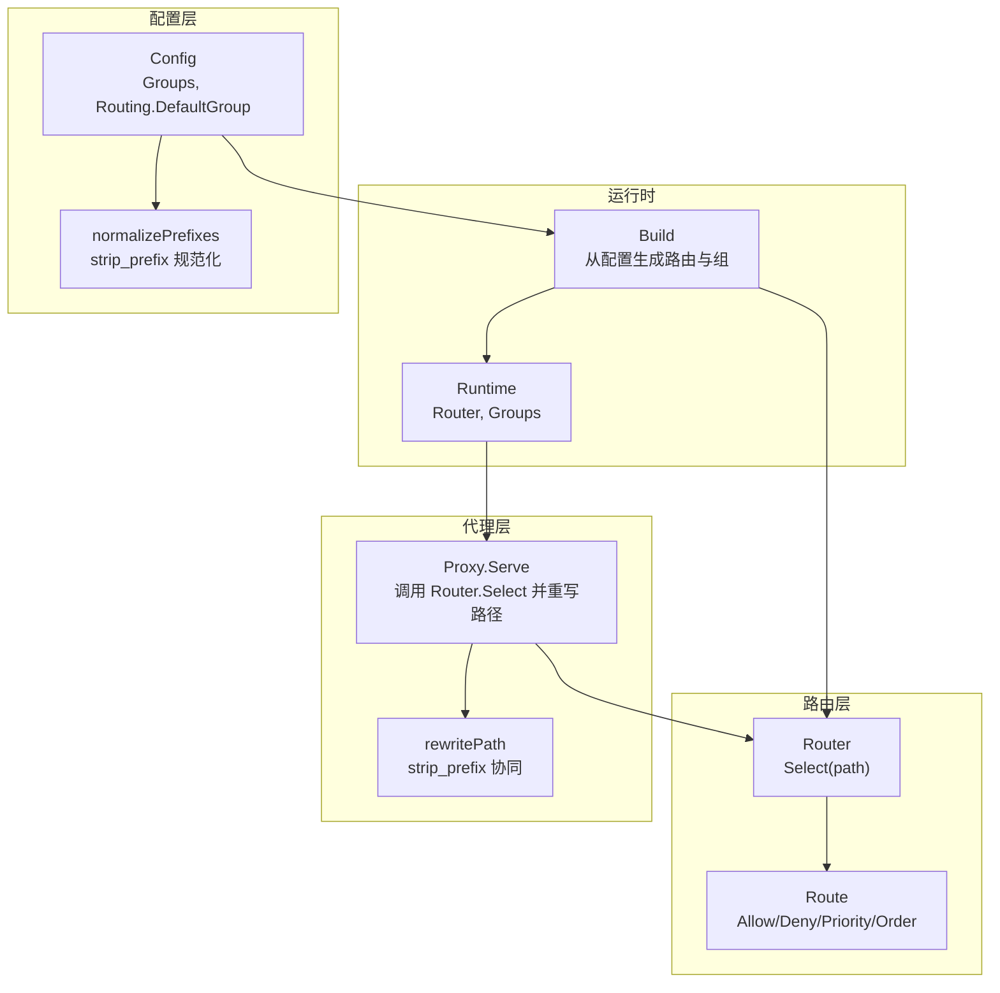
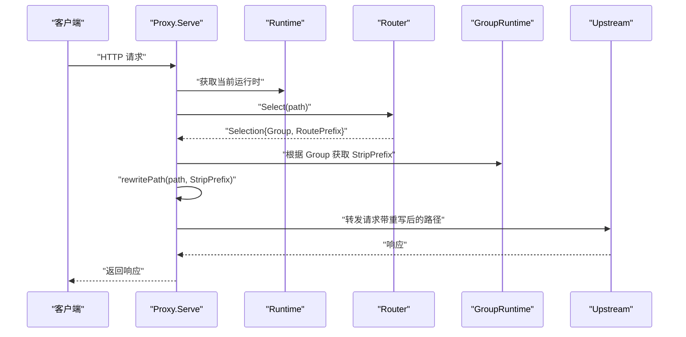
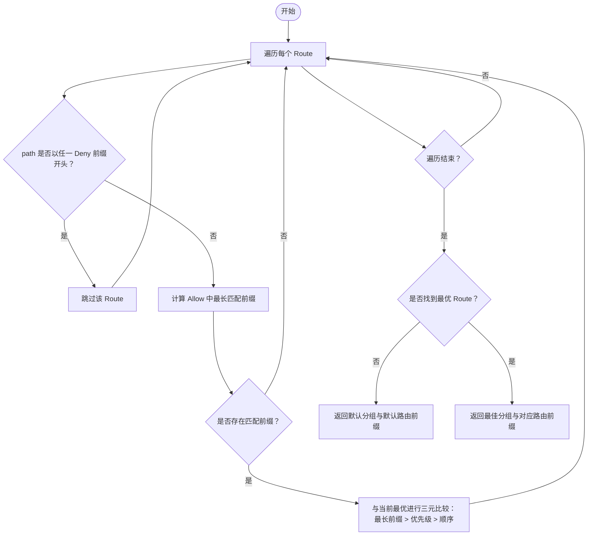
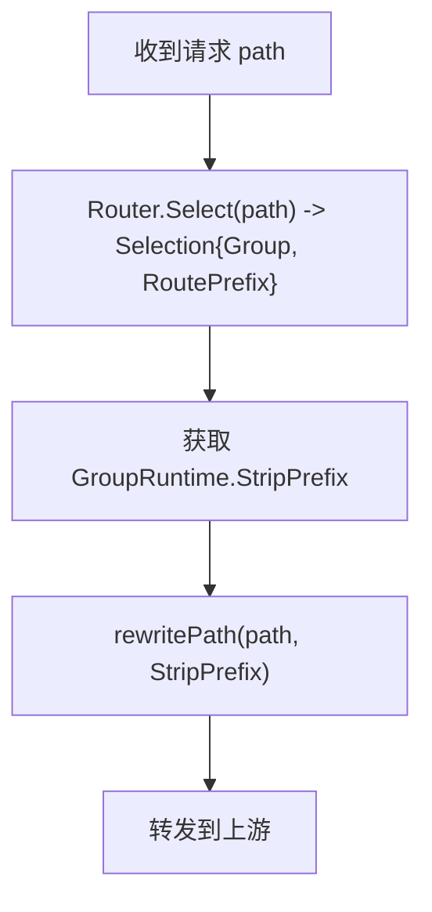
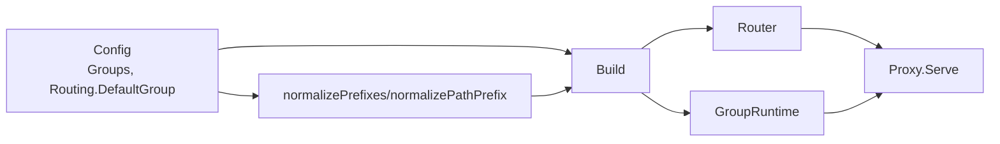

# 路由匹配机制

<cite>
**本文引用的文件**
- [internal/router/router.go](file://internal/router/router.go)
- [internal/router/router_test.go](file://internal/router/router_test.go)
- [internal/runtime/runtime.go](file://internal/runtime/runtime.go)
- [internal/proxy/proxy.go](file://internal/proxy/proxy.go)
- [internal/config/config.go](file://internal/config/config.go)
- [config.example.yaml](file://config.example.yaml)
</cite>

## 目录
1. [简介](#简介)
2. [项目结构](#项目结构)
3. [核心组件](#核心组件)
4. [架构总览](#架构总览)
5. [详细组件分析](#详细组件分析)
6. [依赖关系分析](#依赖关系分析)
7. [性能考量](#性能考量)
8. [故障排查指南](#故障排查指南)
9. [结论](#结论)
10. [附录：配置示例与实践](#附录配置示例与实践)

## 简介
本文件深入解析 RSSHub-Gateway 的路由匹配机制，围绕 Route 结构体中的 Allow、Deny、Priority 和 Order 字段，系统阐述其在路径匹配中的作用与优先级决策逻辑。结合 Router.Select 方法，解释最长前缀匹配、拒绝规则优先、优先级排序与顺序稳定性的实现方式；并说明 DefaultGroup 与 DefaultRoutePrefix 在默认路由选择中的行为。通过测试用例展示多规则冲突时的决策流程，最后提供实际配置示例，演示如何利用 allow/deny 列表实现灰度发布、API 版本路由与路径重写等高级场景，并说明 strip_prefix 配置与路由前缀的协同工作机制。

## 项目结构
路由匹配相关的核心代码分布在以下模块：
- 路由定义与选择：internal/router/router.go
- 路由选择测试：internal/router/router_test.go
- 运行时构建与路由注入：internal/runtime/runtime.go
- 代理层调用路由并执行路径重写：internal/proxy/proxy.go
- 配置模型与 strip_prefix 规范化：internal/config/config.go
- 示例配置：config.example.yaml

图表来源
- [internal/router/router.go](file://internal/router/router.go#L1-L80)
- [internal/runtime/runtime.go](file://internal/runtime/runtime.go#L50-L118)
- [internal/proxy/proxy.go](file://internal/proxy/proxy.go#L73-L130)
- [internal/config/config.go](file://internal/config/config.go#L248-L302)

章节来源
- [internal/router/router.go](file://internal/router/router.go#L1-L80)
- [internal/runtime/runtime.go](file://internal/runtime/runtime.go#L50-L118)
- [internal/proxy/proxy.go](file://internal/proxy/proxy.go#L73-L130)
- [internal/config/config.go](file://internal/config/config.go#L248-L302)

## 核心组件
- Route：描述单条路由规则，包含名称、允许前缀集合、拒绝前缀集合、优先级与顺序。
- Router：持有所有 Route，并提供 Select(path) 选择最佳匹配。
- Selection：返回匹配到的分组名与路由前缀。
- Runtime：从配置构建 Router 与 Groups，并注入到代理层。
- Proxy：在请求处理链中调用 Router.Select，随后根据 group.StripPrefix 执行路径重写并转发。

章节来源
- [internal/router/router.go](file://internal/router/router.go#L1-L80)
- [internal/runtime/runtime.go](file://internal/runtime/runtime.go#L19-L48)
- [internal/proxy/proxy.go](file://internal/proxy/proxy.go#L73-L130)

## 架构总览
下图展示了从请求进入代理层，到路由选择、路径重写与上游转发的整体流程。

图表来源
- [internal/proxy/proxy.go](file://internal/proxy/proxy.go#L73-L130)
- [internal/router/router.go](file://internal/router/router.go#L29-L56)
- [internal/runtime/runtime.go](file://internal/runtime/runtime.go#L104-L118)

## 详细组件分析

### Route 结构体与字段语义
- Name：路由分组标识，用于最终选择结果的分组名。
- Allow：允许前缀列表，采用最长前缀匹配原则。
- Deny：拒绝前缀列表，deny 优先于 allow 生效。
- Priority：当最长前缀相同时，优先级更高的路由胜出。
- Order：当最长前缀与优先级都相同时，Order 更小的路由胜出（保证顺序稳定性）。

章节来源
- [internal/router/router.go](file://internal/router/router.go#L5-L11)

### Router.Select 匹配算法
Router.Select 的决策流程如下：
1) 遍历所有路由；
2) 若 path 以任一 Deny 前缀开头，则跳过该路由；
3) 对剩余路由，计算 Allow 前缀中最长匹配前缀；
4) 以“最长前缀 > 优先级 > 顺序”三元比较选出最优路由；
5) 若无匹配路由，返回默认分组与默认路由前缀。

图表来源
- [internal/router/router.go](file://internal/router/router.go#L29-L56)
- [internal/router/router.go](file://internal/router/router.go#L58-L79)

章节来源
- [internal/router/router.go](file://internal/router/router.go#L29-L56)
- [internal/router/router.go](file://internal/router/router.go#L58-L79)

### 测试用例解读：冲突决策流程
- 最长前缀优先：当 Allow 同时匹配更短与更长前缀时，优先选择更长前缀。
- 拒绝规则优先：若 path 与某条路由的 Deny 前缀匹配，则该路由被排除。
- 优先级决定：当最长前缀相同时，优先级更高的路由胜出。
- 默认行为：若没有任何路由匹配，返回默认分组与默认路由前缀。

章节来源
- [internal/router/router_test.go](file://internal/router/router_test.go#L5-L18)
- [internal/router/router_test.go](file://internal/router/router_test.go#L20-L33)
- [internal/router/router_test.go](file://internal/router/router_test.go#L35-L48)
- [internal/router/router_test.go](file://internal/router/router_test.go#L50-L62)

### DefaultGroup 与 DefaultRoutePrefix 行为
- DefaultGroup：当没有路由匹配成功时，Router 返回的分组名即为 DefaultGroup。
- DefaultRoutePrefix：当没有路由匹配成功时，Router 返回的路由前缀常量值为 DefaultRoutePrefix。
- 这两个默认值由运行时构建阶段从配置中读取并注入到 Router。

章节来源
- [internal/router/router.go](file://internal/router/router.go#L18-L23)
- [internal/router/router.go](file://internal/router/router.go#L52-L56)
- [internal/runtime/runtime.go](file://internal/runtime/runtime.go#L104-L118)

### 运行时构建与路由注入
- Build 将配置中的 Groups 转换为 GroupRuntime，并构造 router.Route 列表；
- 将 Groups 映射注入到 Runtime，供代理层查询；
- 将 DefaultGroup 注入到 Router，作为默认路由选择结果。

章节来源
- [internal/runtime/runtime.go](file://internal/runtime/runtime.go#L50-L118)

### 代理层路径重写与路由前缀协同
- Proxy.Serve 在路由选择后，根据所选分组的 StripPrefix 执行路径重写；
- rewritePath 实现 strip_prefix 与路由前缀的协同：先按路由前缀裁剪，再按 strip_prefix 裁剪，确保上游收到的路径符合预期。

图表来源
- [internal/proxy/proxy.go](file://internal/proxy/proxy.go#L73-L130)
- [internal/proxy/proxy.go](file://internal/proxy/proxy.go#L366-L381)

章节来源
- [internal/proxy/proxy.go](file://internal/proxy/proxy.go#L73-L130)
- [internal/proxy/proxy.go](file://internal/proxy/proxy.go#L366-L381)

### 配置层的 strip_prefix 规范化
- normalizePrefixes 与 normalizePathPrefix 确保 allow/deny 与 strip_prefix 始终以斜杠开头且去除多余尾随斜杠；
- 这些规范化规则保障了路由匹配与路径重写的确定性。

章节来源
- [internal/config/config.go](file://internal/config/config.go#L248-L302)

## 依赖关系分析
- Router 依赖 strings 库进行前缀判断；
- Runtime.Build 将配置转换为路由与分组，并创建 Router；
- Proxy.Serve 依赖 Runtime.Router 与 GroupRuntime.StripPrefix 完成路径重写；
- 配置层负责 strip_prefix 的规范化与校验。

图表来源
- [internal/runtime/runtime.go](file://internal/runtime/runtime.go#L50-L118)
- [internal/proxy/proxy.go](file://internal/proxy/proxy.go#L73-L130)
- [internal/config/config.go](file://internal/config/config.go#L248-L302)

章节来源
- [internal/runtime/runtime.go](file://internal/runtime/runtime.go#L50-L118)
- [internal/proxy/proxy.go](file://internal/proxy/proxy.go#L73-L130)
- [internal/config/config.go](file://internal/config/config.go#L248-L302)

## 性能考量
- 路由选择复杂度：O(N)，其中 N 为路由数量。对于典型网关规模，性能开销极低。
- 前缀匹配使用字符串前缀函数，时间复杂度与前缀长度线性相关，通常很短。
- 顺序稳定性的引入避免了随机性，有利于缓存命中与一致性。

[本节为通用性能讨论，不直接分析具体文件]

## 故障排查指南
- 路由未命中：检查是否被 Deny 前缀覆盖；确认 Allow 前缀是否正确、是否需要更长前缀。
- 优先级冲突：当最长前缀相同时，调整 Priority 或 Order 以明确胜负。
- 默认路由生效：确认 DefaultGroup 是否存在于 groups 中，以及路由选择是否真的无匹配。
- strip_prefix 异常：检查配置中 strip_prefix 是否以斜杠开头、是否与路由前缀一致。

章节来源
- [internal/router/router_test.go](file://internal/router/router_test.go#L20-L33)
- [internal/router/router_test.go](file://internal/router/router_test.go#L35-L48)
- [internal/router/router_test.go](file://internal/router/router_test.go#L50-L62)
- [internal/config/config.go](file://internal/config/config.go#L391-L400)
- [internal/config/config.go](file://internal/config/config.go#L411-L413)

## 结论
RSSHub-Gateway 的路由匹配机制以简洁而稳健的方式实现了最长前缀匹配、拒绝优先、优先级与顺序稳定的综合决策。通过 DefaultGroup 与 DefaultRoutePrefix 提供可靠的兜底行为；配合运行时构建与代理层路径重写，形成从配置到请求处理的完整闭环。该设计既满足日常路由需求，也为灰度发布、版本路由与路径重写等高级场景提供了清晰的扩展空间。

[本节为总结性内容，不直接分析具体文件]

## 附录：配置示例与实践

### 配置要点
- routing.default_group：指定默认分组名，需与 groups 中某一项一致。
- groups[].allow/deny：前缀匹配，deny 优先于 allow。
- groups[].priority：当最长前缀相同时决定胜负。
- groups[].strip_prefix：转发前剥离前缀，与路由前缀协同工作。

章节来源
- [config.example.yaml](file://config.example.yaml#L133-L140)
- [config.example.yaml](file://config.example.yaml#L181-L205)
- [config.example.yaml](file://config.example.yaml#L234-L264)
- [internal/config/config.go](file://internal/config/config.go#L391-L400)
- [internal/config/config.go](file://internal/config/config.go#L411-L413)

### 实战场景示例（基于配置与测试思路）
- 灰度发布
  - 将新版本路由配置为较长的 Allow 前缀，设置更高的 Priority；
  - 使用较小的 Deny 范围控制流量，逐步扩大 Allow 范围；
  - 通过 Order 保持稳定顺序，避免随机性导致的不可控行为。
- API 版本路由
  - 不同版本使用不同 Allow 前缀（如 /api/v1/、/api/v2/），通过 Deny 控制旧版本迁移期的访问；
  - 在版本切换期间，利用 Priority 快速切换默认版本。
- 路径重写
  - 配置 strip_prefix 与路由前缀配合，确保上游只接收期望的路径片段；
  - 通过 rewritePath 的实现，确认路径裁剪逻辑与预期一致。

章节来源
- [internal/router/router_test.go](file://internal/router/router_test.go#L5-L18)
- [internal/proxy/proxy.go](file://internal/proxy/proxy.go#L366-L381)
- [config.example.yaml](file://config.example.yaml#L181-L205)